:PROPERTIES:
:ID:       20221023T101228.247381
:ROAM_ALIASES: Deep-Learning
:END:
#+title: 深度學習
# -*- org-export-babel-evaluate: nil -*-
#+INCLUDE: ../pdf.org
#+PROPERTY: header-args :eval never-export
#+TAGS: AI, Python
#+EXCLUDE_TAGS: noexport
#+OPTIONS: toc:2 ^:nil num:5
#+OPTIONS: H:4
#+LATEX:\newpage
#+HTML_HEAD: <link rel="stylesheet" type="text/css" href="../css/muse.css" />
#+HTML_HEAD_EXTRA: 
#+begin_export html

#+end_export
* 為此 org 啟用 venv :noexport:
#+begin_src shell -r -n :results output :exports no
python3 -m venv ./venv
source ./venv/bin/activate
echo $VIRTUAL_ENV
ls venv

python3 -m pip install -U matplotlib
python3 -m pip install -U ace_tools
python3 -m pip install -U seaborn
python3 -m pip install -U statsmodels
#+end_src

#+begin_src shell -r -n :results output :exports no
python3 -m pip install -U scikeras
#+end_src

#+RESULTS:
#+begin_example
Collecting scikeras
  Downloading scikeras-0.13.0-py3-none-any.whl.metadata (3.1 kB)
Requirement already satisfied: keras>=3.2.0 in ./venv/lib/python3.12/site-packages (from scikeras) (3.8.0)
Requirement already satisfied: scikit-learn>=1.4.2 in ./venv/lib/python3.12/site-packages (from scikeras) (1.5.2)
Requirement already satisfied: absl-py in ./venv/lib/python3.12/site-packages (from keras>=3.2.0->scikeras) (2.1.0)
Requirement already satisfied: numpy in ./venv/lib/python3.12/site-packages (from keras>=3.2.0->scikeras) (1.26.4)
Requirement already satisfied: rich in ./venv/lib/python3.12/site-packages (from keras>=3.2.0->scikeras) (13.7.1)
Requirement already satisfied: namex in ./venv/lib/python3.12/site-packages (from keras>=3.2.0->scikeras) (0.0.8)
Requirement already satisfied: h5py in ./venv/lib/python3.12/site-packages (from keras>=3.2.0->scikeras) (3.13.0)
Requirement already satisfied: optree in ./venv/lib/python3.12/site-packages (from keras>=3.2.0->scikeras) (0.14.0)
Requirement already satisfied: ml-dtypes in ./venv/lib/python3.12/site-packages (from keras>=3.2.0->scikeras) (0.4.1)
Requirement already satisfied: packaging in ./venv/lib/python3.12/site-packages (from keras>=3.2.0->scikeras) (24.1)
Requirement already satisfied: scipy>=1.6.0 in ./venv/lib/python3.12/site-packages (from scikit-learn>=1.4.2->scikeras) (1.13.1)
Requirement already satisfied: joblib>=1.2.0 in ./venv/lib/python3.12/site-packages (from scikit-learn>=1.4.2->scikeras) (1.4.2)
Requirement already satisfied: threadpoolctl>=3.1.0 in ./venv/lib/python3.12/site-packages (from scikit-learn>=1.4.2->scikeras) (3.5.0)
Requirement already satisfied: typing-extensions>=4.5.0 in ./venv/lib/python3.12/site-packages (from optree->keras>=3.2.0->scikeras) (4.12.2)
Requirement already satisfied: markdown-it-py>=2.2.0 in ./venv/lib/python3.12/site-packages (from rich->keras>=3.2.0->scikeras) (3.0.0)
Requirement already satisfied: pygments<3.0.0,>=2.13.0 in ./venv/lib/python3.12/site-packages (from rich->keras>=3.2.0->scikeras) (2.18.0)
Requirement already satisfied: mdurl~=0.1 in ./venv/lib/python3.12/site-packages (from markdown-it-py>=2.2.0->rich->keras>=3.2.0->scikeras) (0.1.2)
Downloading scikeras-0.13.0-py3-none-any.whl (26 kB)
Installing collected packages: scikeras
Successfully installed scikeras-0.13.0
#+end_example

#+BEGIN_SRC emacs-lisp :exports no
(pyvenv-activate "./venv")
(setq org-babel-python-command "./venv/bin/python3")
#+END_SRC

#+RESULTS:
: ./venv/bin/python3

* 深度學習
所謂深度學習是指
#+CAPTION: AI, Machine Learning與Deep Learning
#+LABEL:fig:Labl
#+name: fig:Name
#+ATTR_LATEX: :width 300
#+ATTR_ORG: :width 300
#+ATTR_HTML: :width 500
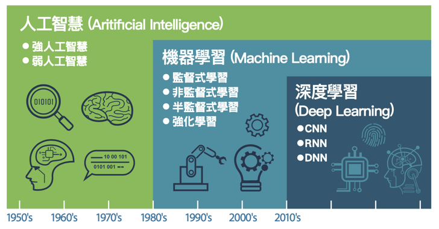

在[[id:d6daa102-05bb-475d-b619-db8b61e86030][神經網路]]中我們曾經提及：
#+begin_quote
深度神經網路(Deep Neural Network, DNN)，顧名思義就是有很多層的神經網路。然而，幾層才算是多呢？一般來說有1-2個隱藏層的神經網絡就可以叫做多層，準確的說是(淺層)神經網絡(Shallow Neural Networks)。隨著隱藏層的增多，更深的神經網絡(一般來說超過3層)就都叫做深度神經網路[fn:1]。而那些以深度神經網路為模型的機器學習就是我們耳熟能詳的[[id:20221023T101228.247381][深度學習]]。
#+end_quote

那麼幾層才算是夠深呢？實際上，「深度」只是一個商業概念，很多時候工業界把3層隱藏層也叫做「深度學習」，在機器學習領域的約定俗成是，名字中有深度(Deep)的網絡僅代表其有超過5-7層的隱藏層[fn:1]。

典型的深度學習如圖[[fig:python-deep-learning-1]]，在此例中，輸入為一張手寫數字的影像，經由 4 層的深度學習模型後得知此數字為 4。

#+CAPTION: 典型的深度神經網路-1
#+LABEL:fig:python-deep-learning-1
#+name: fig:python-deep-learning-1
#+ATTR_LATEX: :width 400
#+ATTR_ORG: :width 400
#+ATTR_HTML: :width 500
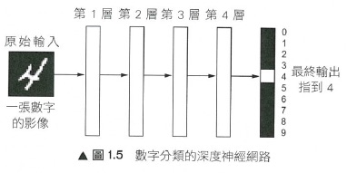

圖[[fig:python-deep-learning-2]]進一步說明網路模型中每一層的作用，可以將每一層網路視為對影像的特殊運算，如此一層一層逐一精煉(purified)，最後得到結果。

#+CAPTION: 典型的深度神經網路-2
#+LABEL:fig:python-deep-learning-2
#+name: fig:python-deep-learning-2
#+ATTR_LATEX: :width 400
#+ATTR_ORG: :width 400
#+ATTR_HTML: :width 500
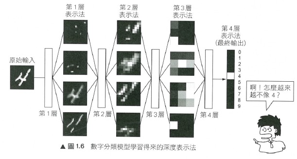

關於增加層數的重要性，目前還缺乏理論佐證，但從過往的研究或實驗中，有幾點可以說明。
1. 在 ILSVRC 這種大型視覺辨識競賽結果中，加深層數的比例多與辨識效能成正比。
2. 加深層數可以在減少網路參數的狀況下得到相同成效，透過重叠層級，可以讓 ReLU 等活化函數夾在卷積層之間，進一步提高網路的表現力，因為透過活化函數，可以在網路增加「非線性」的能力，重叠非線性函數，也能達到更複雜的表現力。
3. 學習的效率也是加深層數的優點之一，卷積層的神經元會反應出邊界等單純形狀，隨著層數增加，可以反應出紋理、物體部位等特質，依照階層逐漸變複雜。
4. 以辨識「狗」為例子，如果要以層數較少的網路來解決這個問題，卷積層就要一次「理解」眾多特徵，還要因應不同拍攝環境帶來的變化，一次處理這些龐大的資料會花費許多學習時間； 如果加深層數，就能用階層分解必須學習的問題，每一層可以處理單純的問題，例如，最初的層級可以只學習邊界，利用少量的學習資料來進行效率化的學習。
5. 加深層數可以階層性的傳遞資料，例如，擷取出邊界的下一層會使用邊界資料來學習更高階的問題（如判斷形狀）。

** 深度學習的知名模型
幾個知名的深度學習模型如下：
*** VGG
VGG 為由卷積層與池化層構成的基本 CNN。特色是含權重層（卷積層及全連接層）共 16-19 層，有時會稱為 VGG16[fn:2] 或 VGG19[fn:3]。VGG 由於結構非常簡單，應用性高，所以多數技術人員喜歡使用以 VGG 為最基礎的網路。

#+CAPTION: VGG-16
#+LABEL:fig:Labl
#+name: fig:Name
#+ATTR_LATEX: :width 300
#+ATTR_ORG: :width 300
#+ATTR_HTML: :width 500
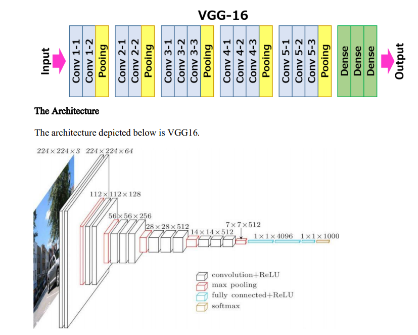

#+CAPTION: VGG-19
#+LABEL:fig:Labl
#+name: fig:Name
#+ATTR_LATEX: :width 300
#+ATTR_ORG: :width 300
#+ATTR_HTML: :width 500
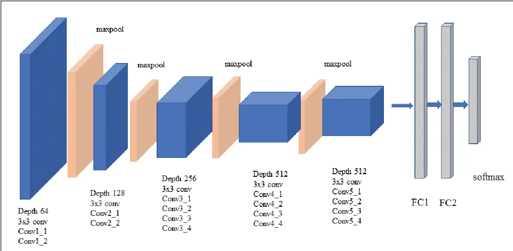
*** GoogLeNet
GoogLeNet[fn:4]為2014 年 ILSVRC (ImageNet Large Scale Visual Recognition Competition)圖像分類競賽的冠軍得主，與 VGGNet（該年的亞軍）相比具有相對較低的錯誤率。GoogLeNet基本上與 CNN 相同，其特色是不僅會往垂直方向加深網路，也會往水平方向加深。GoogLeNet 往水平方向的做法稱為「Inception 結構」。
#+CAPTION: GoogLeNet
#+LABEL:fig:Labl
#+name: fig:Name
#+ATTR_LATEX: :width 300
#+ATTR_ORG: :width 300
#+ATTR_HTML: :width 700
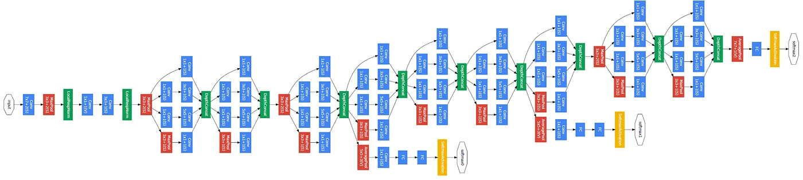
*** ResNet
ResNet[fn:5]是由 Microsoft 團隊開發的網路，特色是具有能加深比過去更多層的「結構」，為了解決因加深過多層數無法順利學習的問題，ResNet 導入了「跳躍結構」（也稱為捷徑或分流）。跳躍結構是「直接」傳遞輸入資料，所以在反向傳播時，也會將上層的梯度「直接」傳遞給下層。透過這種跳躍結構，不用擔心梯度變小（或變得太大），可以把「具有意義的梯度」傳遞給上層。因此，跳躍結構能減少之前因為加深層數，使得梯度變小，出現梯度消失的問題。
#+CAPTION: ResNet
#+LABEL:fig:Labl
#+name: fig:Name
#+ATTR_LATEX: :width 300
#+ATTR_ORG: :width 300
#+ATTR_HTML: :width 700
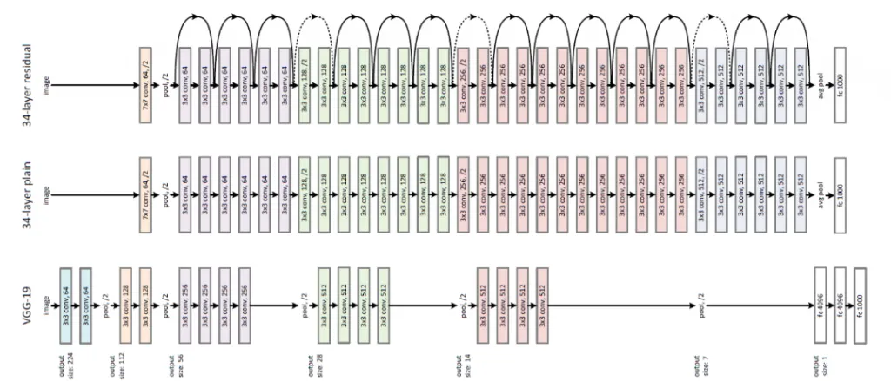
*** ImageNet大賽
從下圖可觀察到，網路的層數從2014年GoogLeNet的22層爆增到2015年ResNet的152層，足足多了130層。這個結果證實了越深的網路，在沒有Overfitting的情況下，效果是越好的[fn:6]。
#+CAPTION: ImageNet歷年冠軍
#+LABEL:fig:Labl
#+name: fig:Name
#+ATTR_LATEX: :width 300
#+ATTR_ORG: :width 300
#+ATTR_HTML: :width 500
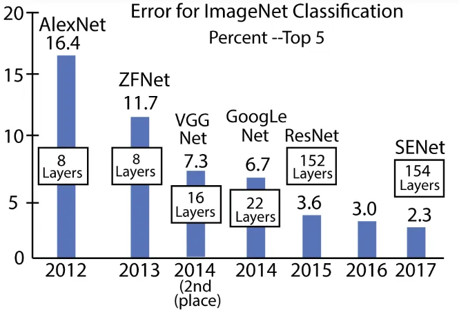

那麼...如果想要提升模型的效果，是不是加越多網路層，使網路越深就可以了呢？，底下這個研究結果可以給我們一點啟發：

#+CAPTION: DNN層數與誤差的實驗
#+LABEL:fig:Labl
#+name: fig:Name
#+ATTR_LATEX: :width 300
#+ATTR_ORG: :width 300
#+ATTR_HTML: :width 500
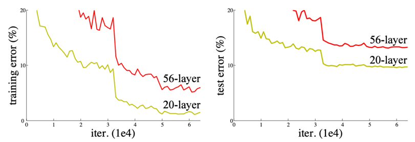

這是為2016年IEEE Conference on Computer Vision and Pattern Recognition的一篇研究結果[fn:7]，實驗結果顯示一般深度網路層數越多，訓練誤差不降反增。

** 深度學習的高速化
由於大資料(big data)與大型網路的關係，使得深度學習必須進行大量運算，過去我們使用 CPU 來進行運算，如今多數深度學習的框架多支援 GPU，甚至支援以多個 GPU 與多台裝置進行分散式學習。GPU 原本是圖形專用處理器，可以快速處理平行運算，GPU 運算的目標是把其強大的效能運用在各種用途。比較 CPU 與 GPU 在 AlexNet 的學習，CPU 需花費 40 天以上，GPU 則可以在 6 天內完成。

利用 GPU 除了可以大幅提升深度學習的運算速度，但是一旦變成多層網路時，就需要花費數天或數週的時間來學習，Google 的 TensorFlow、Microsoft 的 CNTK 便是針對分散式學習來開發的，100 個分散式的 GPU 可以提升比單一 GPU 高到 56 倍的速度，意味著原本要有天才能完成的學習，只要 3 小時就可以結束。

在深度學習的高速化過程中，包含運算量在內，記憶體容量、匯流排頻寬等，都會造成瓶頸，就記憶體容量來說，必須考慮到大量權重參數及中間資料會儲存在記憶體的情況。至於匯流排頻寛，一旦通過 GPU(或 CPU)的匯流排資料超過一定的限制，該處就會形成瓶頸，所以，最好能儘量減少通過網路的資料位元數。
*** GPU v.s. CPU
#+CAPTION: CPU 與 GPU 在架構上的設計差異
#+LABEL:fig:CPUGPU
#+name: fig:CPUGPU
#+ATTR_LATEX: :width 300
#+ATTR_ORG: :width 300
#+ATTR_HTML: :width 500

如圖[[fig:CPUGPU]]，CPU 和 GPU 的差異起源於其相異的設計目標與應用場景， CPU的設計目的是處理各種不同的資料運算、邏輯判斷和中斷要求;而 GPU 的設計目的則是為了圖形運算， 其優勢在於能快速對同類型的資料進行平行運算[fn:8]。二者主要差異大致如下：
- CPU 是由幾個每次可處理數個獨立「執行緒」(threads)的核心(core)所組成；GPU 則有數百個這樣的核心，同時可以處理上千個執行緒
- CPU 主要是線性執行； GPU 則是個高度平行化的單元
- CPU 的發展主要致力於最佳化系統的遲滯時間，讓系統能有迅速流暢的反應；GPU 的發展則是朝頻寬最佳化努力。在深度神經網路中，頻寬為主要的系統瓶頸
- GPU 的 Level 1 cache 比 CPU 快且大，在深度神經網路中，大部份的資料都會再次被使用到

** 深度學習應用領域 :noexport:
*** 影像辨識:卷積神經網路 CNN
MNIST 歷年的競賽前幾名都是以 CNN 為基礎，進一步提高辨識準確率的方法還包括整體學習、學習率遞減（learning rate decay）、資料擴增（Data Augmentation, 如利用旋轉、垂直或水平移動輸入影像來小幅改變輸入資料以增加輸入影像張數）。

傳統機器學習進行圖片識別，主要是希望能透過原始像數值找出一種適合的分類器(classifier)，但事實證明這麼做不管用，因為信噪比太低。後來的改善方式是由人類挑選出重要特徵，然後由機器學習演算法使用這些「特徵向量(feature vectors)」進行分類判斷。這種特徵提取(feature extraction)的做法確實改善了信噪比，但是如果圖片的重要特點因光線或其他因素難以識別，則精確率會降低很多，而且，事前的人工挑選特徵花去太多人力，以深度學習進行圖片視覺就是設法消除那些既繁瑣又會造成侷限性的特徵選取程序。David Hubel 和 Torsten Wiesel 發現動物視覺皮層有一部份專門負責檢測邊緣，1959 年他們把電極插入貓的大腦中，在螢幕上投射出黑白圖案，發現有些神經元只有在出現垂直線時被激發，有些則只有在出現水平線時被激發，有些則是只有看到某特定角度的線時被激發。進一步的研究確認，視覺皮層是以分層的結構組織起來的，每一層都會根據前一層所偵測到的特徵得出進一步的訊息，從線條、輪廓、形狀，一直到整個物體。由上述研究得來的第一個概念就是「過濾器(filter)」。

典型的過濾器如下：
- blur = [[1./9, 1./9, 1./9], [1./9, 1./9, 1./9], [1./9, 1./9, 1./9]]
#+CAPTION: 模糊過濾器
#+name: fig:blurFilter
#+ATTR_LATEX: :width 300
#+ATTR_HTML: :width 500
#+ATTR_ORG: :width 300
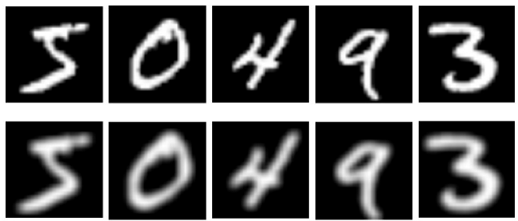

- edges = [[1, 1, 1], [1, -8, 1], [1, 1, 1]]
#+CAPTION: 邊緣強調過濾器
#+name: fig:edgesFilter
#+ATTR_LATEX: :width 300
#+ATTR_HTML: :width 500
#+ATTR_ORG: :width 400
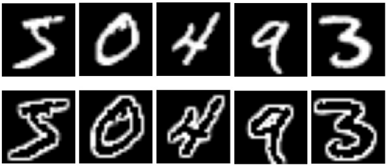

圖[[fig:blurFilter]]為一 3*3 的模楜強過濾器產生的效果，圖[[fig:edgesFilter]]則為邊緣強週器的效果。過濾器可以改變圖形，並顯示可用於「圖形偵測」和「圖形分類」的特徵。例如，為了對數字進行分類，內部的顏色並不重要，此時，邊緣強調過濾器就有助於辨識數字的一般形狀，進而提升數字識別效能。

我們可以用「類神經網路」的方式來理解「過濾器」，將我們定義的「過濾器」視為一組加權，最終的值又做為下一層的啟動值（輸入）。如圖[[fig:filterScanner]]，過濾器會逐次掃過整張圖，然後建立一組新的圖片，
#+CAPTION: 過濾器的掃瞄計算
#+name: fig:filterScanner
#+ATTR_LATEX: :width 260
#+ATTR_ORG: :width 260
#+ATTR_HTML: :width 500
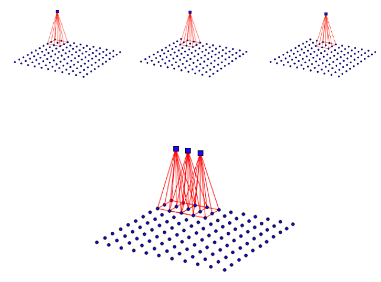
*** 語言模型
[[id:263cb433-d0eb-4400-a373-35175c000c01][循環神經網路]]
*** 棋盤遊戲
大約在 50 年代，研究人員開始建立具有 AI 的遊戲，這些遊戲以「西洋跳棋」(checkers)和「西洋棋」(chess)為主，這兩種遊戲有一些共同之處：
- 它們是所謂的「零和遊戲」(zero-sum games)，即一個玩家所得到的奬勵就來自另一個玩家相對應的損失。另一類相對的遊戲則是指兩位玩家可以選擇合作，如 「囚徒困境」(prisoner's dilemma)。
- 它們都具有「完全資訊」(perfect information)，兩方不同玩家都知道遊戲的整個狀態；另一種相對的遊戲則是撲克。因為得知目前狀態就可以導出最好的行動，所以這種遊戲可以減少 AI 所需處理問題的複雜度。
- 兩種遊戲都有「明確性」(deterministic): 如果一個玩家下了一步，這步就會導致一個明確的下一個狀態；另一種相對的遊戲中，玩家下的一步可能是丟一次骰子或是抽一張牌，這就無法導致一個明確的下一步。
*** 電腦遊戲
*** 異常偵測
*** 物體偵測
從影像中分析出物體位置，進行分類。物體偵測比物體辨識的問題更困難，最著名的方式為 R-CNN，R-CNN 的實際處理流程有點複雜，包括把影像變形成正方形，使用 SVM 分類。
*** 影像分割
指針對影像以像素標籤進行類別分類，利用神經網路進行影像分割，最簡單的方法就是以全部的像素為對象，再依照各個像素進行推論處理。典型做法為 FCN(Fully Convolutional Network)，相對於一般 CNN 含有全連接層的情況，FCN 把全連接層更換成「執行相同動作的卷積層」，在物體辨識的網路全連接層中，中間資料的空間大小當作排列成 1 行節點來處理。
*** 產生圖說
針對影像自動產生說明該影像的內容，代表性方法為 NIC (Neural Image Caption)模型，NIC 是由處理多層 CNN 與自然語言的 RNN(Recurrent Neural Network, [[id:263cb433-d0eb-4400-a373-35175c000c01][循環神經網路]])所構成，RNN 指擁有遞迴功能的網路，常用在自然語言、時間序列資料等有連續性的資料上。
*** 影像風格轉換
代表論文為 A Neural Algorithm of Artistic Style。
*** 產生影像
從零開始產生「臥室」影像，代表性方法為 DCGAN(Deep Convolutional Generative Adversarial Network)。DCGAN 利用大量影像（如大量拍攝臥室影像）來學習，結束學習後，只要利用該模組就能產生新的影像。DCGAN 運用了 Generator(生成器)與 Discriminator(判別器)等兩個神經網路，Generator 產生與本尊相似的影像，Discriminator 判斷是否為本尊，即，確定是由 Generator 產生的影像或是實際拍攝的影像。兩者彼此制䚘學習，Generator 可以學習到更精巧的偽裝影像技術，Discriminator 則學習更高的鑑定技能，二者相互切磋成長，最終，Generator 能學會畫出與本尊一模一樣的影像。
*** 自動駕駛
最近在辨識周圍環境的技術中，深度學習的能力頗受期待，例如以 CNN 為基礎的網路 SegNet 即可精確辨識走路的環境。
*** Deep Q-Network (強化學習)
人類是透過嚐試錯誤來學習，例如騎腳踏車，在電腦領域中，也有從嚐試錯誤的過程中進行自主學習的例子，稱為強化學習(reinforcement learning)。在強化學習中，代理人(Agent)根據環境狀況來決定要採取的行動，利用該行動讓㼈境變化。隨環境變化，代理人獲得某些報酬。強化學習的目的是決定代理人的行動方針，以獲得更好的報酬。典型的 DQN 可以讓遊戲自動學習，達到超越人類等級的能力，使用 DQN 的 CNN 可以輸入遊戲影像(如連續 4 個畫面)，最後針對遊戲的控制器動作(搖桿的動作與按鈕)分別輸出該動作的「價值」。由於 DQN 的輸入只是影像，所以不用隨著遊戲的不同來改變設定，同一套 DQN 可以學習「小精靈」與「Atari」。DQN 與 AlphaGo 都是 Google Deep Mind 公司的研究。* ex: 入侵偵測系統

* 深度學習運作原理
** 機器學習的SOP
1. 資料載入和預處理
1. 建立模型
1. 訓練模型
1. 評估模型/修改模型(回到3.)
1. 發佈模型/應用

** 資料的分割
訓練模型時通常會將資料集分割為訓練集、測試集，有時還會再細分出驗證集。
其具體分割方式可以分為以下幾類：
*** 基本資料分割
以下這些方法用於基本的模型訓練與評估，適合初步模型測試或大規模資料。
**** 訓練/測試分割（train-Test Split)
部份文獻也稱為Holdout Method，就是我們平時最常見的資料分割方式，把資料集分為以下兩部份：
- 訓練集(Training set): 用於訓練模型
- 測試集(Test set): 用於評估模型的性能
#+ATTR_LATEX: :width 300
#+ATTR_ORG: :width 300
#+ATTR_HTML: :width 500

一般的分割比例常見為：
1) 80% 訓練，20% 測試
1) 70% 訓練，30% 測試

適用情境：
- 大規模資料集（如上萬筆以上）
- 訓練成本較高時，因為只需要訓練一次

缺點：
- 結果依賴單次分割，可能因為某次隨機分割影響評估結果，導致高變異性（high variance）
- 無法充分利用資料，因為測試集的部分資料未參與訓練，而這部分測試資料可能對模型的訓練有幫助，例如包含重要特徵

範例程式
#+begin_src python -r -n :results output :exports both
from sklearn.model_selection import train_test_split

X_train, X_test, y_train, y_test = train_test_split(X, y, test_size=0.2, random_state=42)
#+end_src

**** 訓練/驗證/測試分割（Train-Validation-Test Split）
這個方法的主要目的為了調整模型的超參數，避免測試集的資料洩漏，做法是將資料集分為以下三部份：
- 訓練集(Training set): 用於訓練模型
- 驗證集(Validation set): 用於調整模型的超參數
- 測試集(Test set): 用於評估模型的性能

常見比例：
- 80% 訓練 / 10% 驗證 / 10% 測試
- 70% 訓練 / 15% 驗證 / 15% 測試

適用情境：
- 需要調整超參數（如學習率、模型架構）
- 確保測試集未參與模型選擇過程，避免資訊洩漏

缺點：
- 需要更多資料，否則訓練集會變小
- 驗證結果可能受隨機分割影響

範例程式
#+begin_src python -r -n :results output :exports both
from sklearn.model_selection import train_test_split

X_train, X_temp, y_train, y_temp = train_test_split(X, y, test_size=0.2, random_state=42)
X_val, X_test, y_val, y_test = train_test_split(X_temp, y_temp, test_size=0.5, random_state=42)
#+end_src
*** 交叉驗證（Cross-Validation, CV）
多次切分資料，讓每個資料點都能當一次測試集，避免評估的不穩定性。
**** K-Fold Cross-Validation
K-Fold 交叉驗證的主要目的之一是評估不同模型或超參數組合的表現，進而選擇最佳的設定。完整的流程如下：
1. 先劃分出測試集
   - 測試集不參與 K-Fold 交叉驗證，確保它是真正未見過的資料。
   - 此步驟確保我們最終的模型評估是公平的，不會發生資訊洩漏（Data Leakage）。
2. 在訓練集上使用 K-Fold 進行超參數調整
   - 使用 K-Fold 交叉驗證來評估不同的超參數組合，選擇最佳的超參數。
   - 此時測試集仍未被使用！我們只用交叉驗證來決定超參數。
3. 使用完整的訓練集（不再做 K-Fold）訓練最終模型
   - 找到最佳超參數後，我們不再使用 K-Fold，而是用完整的訓練集來訓練最終模型。
4. 用測試集做最終評估
   - 測試集應在第一步就獨立出來，不能參與 K-Fold 交叉驗證。交叉驗證應僅針對訓練集，確保泛化能力評估準確無誤

實際進行資料分割時，K-folder將訓練集分為K組，每次取其中一組作為測試集，其餘的作為訓練集，重複K次，最後取平均值作為模型的性能評估。

#+ATTR_LATEX: :width 300
#+ATTR_ORG: :width 300
#+ATTR_HTML: :width 500
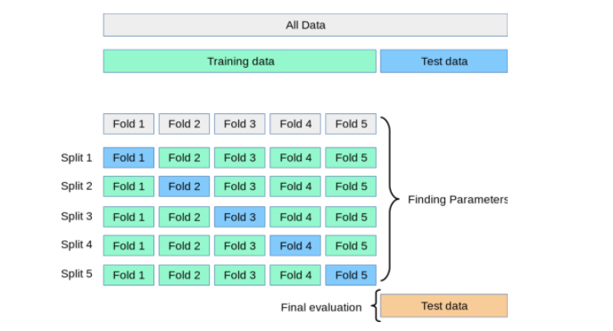

至於如何利用驗證集找出最佳超參數或模型，可以參考以下三種方法：
***** 手動調整
1) 定義超參數組合（例如 max_depth 和 n_estimators）。
2) 使用 K-Fold 交叉驗證來評估每組超參數的表現。
3) 選擇具有最佳平均交叉驗證準確率的超參數組合。
#+begin_src python -r -n :results output :exports both
from sklearn.model_selection import KFold
from sklearn.ensemble import RandomForestClassifier
from sklearn.metrics import accuracy_score
import numpy as np

# 定義超參數組合
param_grid = [
    {"n_estimators": 50, "max_depth": 5},
    {"n_estimators": 100, "max_depth": 5},
    {"n_estimators": 50, "max_depth": 10},
    {"n_estimators": 100, "max_depth": 10}
]

best_params = None
best_score = 0

kf = KFold(n_splits=5, shuffle=True, random_state=42)

# 遍歷所有超參數組合
for params in param_grid:
    val_scores = []

    for train_idx, val_idx in kf.split(X_train):
        model = RandomForestClassifier(n_estimators=params["n_estimators"], max_depth=params["max_depth"])
        model.fit(X_train[train_idx], y_train[train_idx])  # 訓練模型
        y_val_pred = model.predict(X_train[val_idx])  # 在驗證集上預測
        val_acc = accuracy_score(y_train[val_idx], y_val_pred)  # 計算準確率
        val_scores.append(val_acc)

    avg_score = np.mean(val_scores)  # 計算交叉驗證的平均準確率

    print(f"參數組合: {params}, 平均交叉驗證準確率: {avg_score:.4f}")

    if avg_score > best_score:
        best_score = avg_score
        best_params = params

print(f"最佳超參數: {best_params}, 最高交叉驗證準確率: {best_score:.4f}")
#+end_src
在上述程式中，我們做了以下幾個步驟：
1) 定義 4 組不同的超參數組合（n_estimators 和 max_depth）。
2) 對每組超參數執行 K-Fold 交叉驗證，計算 5 次的平均準確率。
3) 選擇擁有最高交叉驗證準確率的超參數組合 作為最佳組合。

缺點：如果超參數組合很多（例如 1000 種），這樣手動測試會非常耗時，因此可以使用 Grid SearchCV 或 RandomizedSearchCV 來自動搜尋最佳超參數。
***** GridSearchCV
GridSearchCV 是 Scikit-Learn 提供的一個自動化調參工具，可以幫助我們快速找到最佳超參數組合。它會自動遍歷所有超參數組合，並使用 K-Fold 交叉驗證來評估每組超參數的表現，最後返回最佳超參數組合。
#+begin_src python -r -n :results output :exports both
from sklearn.model_selection import GridSearchCV
from sklearn.ensemble import RandomForestClassifier

# 定義超參數搜索範圍
param_grid = {
    "n_estimators": [50, 100, 150],
    "max_depth": [5, 10, 15]
}

# 建立隨機森林模型
model = RandomForestClassifier()

# 使用 GridSearchCV + K-Fold 交叉驗證來搜索最佳超參數
grid_search = GridSearchCV(model, param_grid, cv=5, scoring='accuracy', n_jobs=-1)
grid_search.fit(X_train, y_train)

# 輸出最佳超參數和對應的分數
print(f"最佳超參數: {grid_search.best_params_}")
print(f"最佳交叉驗證準確率: {grid_search.best_score_:.4f}")
#+end_src
在上述程式中，我們做了以下幾個步驟：
1) 定義超參數範圍（n_estimators 和 max_depth）。
2) 使用 GridSearchCV 進行 K-Fold 交叉驗證，自動測試所有超參數組合。
3) 輸出最佳超參數和最高的交叉驗證分數。

優勢：
- 完全自動化，不需要手動測試每組超參數。
- 計算效能較高，可以使用 n_jobs=-1 同時運行多個超參數組合，提高速度。
***** RandomizedSearchCV
RandomizedSearchCV 與 GridSearchCV 類似，但是它不是遍歷所有超參數組合，而是隨機選取一部分超參數組合進行測試，這樣可以節省時間，尤其是當超參數範圍很大時。
#+begin_src python -r -n :results output :exports both
from sklearn.model_selection import RandomizedSearchCV
from scipy.stats import randint

# 定義超參數範圍（使用隨機分布）
param_dist = {
    "n_estimators": randint(50, 200),
    "max_depth": randint(5, 20)
}

# 建立隨機森林模型
model = RandomForestClassifier()

# 使用 RandomizedSearchCV 進行隨機超參數搜尋
random_search = RandomizedSearchCV(model, param_dist, cv=5, n_iter=10, scoring='accuracy', n_jobs=-1, random_state=42)
random_search.fit(X_train, y_train)

# 輸出最佳超參數和對應的分數
print(f"最佳超參數: {random_search.best_params_}")
print(f"最佳交叉驗證準確率: {random_search.best_score_:.4f}")
#+end_src
在上述程式中，我們做了以下幾個步驟：
1. 使用 隨機分布 設定超參數範圍（randint(50, 200)）。
1. n_iter=10 表示只隨機測試 10 組超參數組合，大幅減少計算時間。
1. 使用 K-Fold 交叉驗證來評估每組超參數的表現。

優勢：
- 比 Grid Search 快速許多，適合超參數組合很多時使用。
- 可以涵蓋更廣的搜尋範圍，避免限制於固定的超參數組合。
**** LOOCV (Leave-One-Out Cross Validation)
LOOCV 是一種特殊的交叉驗證方法，是 K-fold 其中一種特例，此作法相當簡單明瞭，但是訓練負擔會非常重且耗時。將資料集分為訓練集和測試集，其中測試集只包含 *一筆樣本資料* ，訓練集包含 *其餘N-1筆樣本* ，整個訓練會重複進行N次(N為樣本數），最後取所有測試結果的平均值作為模型的性能評估。這樣的分割方式可以:
- 保證每個樣本都被用於測試一次，並且可以得到最穩定的結果
- 充分利用資料，每筆資料都有機會成為測試集
- 結果最穩定，不受特定分割影響

#+ATTR_LATEX: :width 300
#+ATTR_ORG: :width 300
#+ATTR_HTML: :width 500
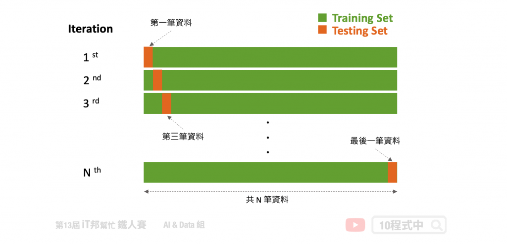

適用情境：
- 小型資料集（如 N < 100），因為可以最大化利用訓練資料
- 不適合大規模資料集，因為計算成本過高。

優點：
- 充分利用資料，每筆資料都有機會成為測試集
- 結果最穩定，不受特定分割影響

缺點
- 訓練成本極高：因為有 N 筆資料，就需要 訓練 N 次，如果 N = 10000，則要訓練 10000 次，時間成本極高。
- 對離群值（outliers）極度敏感：如果某個樣本是異常值，這個異常值在某次迭代會成為測試集，會嚴重影響模型表現。

範例程式:
#+begin_src python -r -n :results output :exports both
from sklearn.model_selection import LeaveOneOut

loo = LeaveOneOut()
loo_accuracies = []

for train_idx, test_idx in loo.split(X):
    model.fit(X[train_idx], y[train_idx])
    acc = model.score(X[test_idx], y[test_idx])
    loo_accuracies.append(acc)

print("平均準確率:", np.mean(loo_accuracies))
#+end_src
**** Stratified K-fold Cross-Validation
Stratified K-fold Cross-Validation 是 K-fold Cross-Validation 的一種變形，主要是針對分類問題而設計的。在 K-fold Cross-Validation 中，每次分割都是隨機的，可能會導致某些類別的樣本在訓練集和測試集中的比例不均衡，進而影響模型的性能評估。Stratified K-fold Cross-Validation 通過保持每個類別在每個分割中的比例來解決這個問題，確保每個類別在訓練集和測試集中的比例相同。

適用場景
- 類別不均衡問題（例如詐欺檢測、罕見疾病分類）
- 確保所有類別都能在每個 fold 中出現，避免某些 fold 缺少少數類別
- 小型資料集時特別重要，避免某些類別完全未出現在特定 fold

範例程式
#+begin_src python -r -n :results output :exports both
from sklearn.model_selection import StratifiedKFold
from collections import Counter

X = np.arange(20).reshape(-1, 1)  # 20 筆樣本
y = np.array([0] * 18 + [1] * 2)  # 18 個類別 0，2 個類別 1

skf = StratifiedKFold(n_splits=5, shuffle=True, random_state=42)
for fold, (train_idx, test_idx) in enumerate(skf.split(X, y)):
    print(f"Fold {fold+1} - 測試集類別分佈:", Counter(y[test_idx]))
#+end_src
*** 時間序列交叉驗證（Time Series Split）
Time Series Split 是時序資料（如股市、氣象預測）的專用分割方式，確保未來的資料不會洩漏到訓練中。

適用場景
- 股票預測
- 氣象預測
- 銷售趨勢分析
- 任何未來資料不可提前出現的應用

範例程式
#+begin_src python -r -n :results output :exports both
from sklearn.model_selection import TimeSeriesSplit

tscv = TimeSeriesSplit(n_splits=5)
for train_idx, val_idx in tscv.split(X):
    model.fit(X[train_idx], y[train_idx])
    acc = model.score(X[val_idx], y[val_idx])
#+end_src
輸出示意
#+begin_example
第一次訓練: 1 2 3 4  -> 測試 5
第二次訓練: 1 2 3 4 5 -> 測試 6
第三次訓練: 1 2 3 4 5 6 -> 測試 7
#+end_example
*** 自助抽樣（Bootstrap Sampling）
一種隨機抽樣方法，主要用於統計學與集成學習（如隨機森林）。以 *抽完放回* 的方式從原始資料集中隨機抽取樣本，形成新的訓練集。

適用場景
- 當資料量較小時，希望模擬多次抽樣的效果。
- 隨機森林（Random Forest）、統計學中的區間估計

優點
- 可以充分利用資料，因為每次抽樣都是隨機的，每次抽樣都有可能抽到重要樣本
- 可以模擬多次抽樣的效果，得到更穩定的結果

缺點
- 會產生重複樣本，導致模型訓練時的方差增加
- 計算成本高，因為要重複抽樣多次

範例程式1
#+begin_src python -r -n :results output :exports both
from sklearn.utils import resample

X_train_bootstrap, y_train_bootstrap = resample(X_train, y_train, replace=True, random_state=42)
model.fit(X_train_bootstrap, y_train_bootstrap)
#+end_src
範例程式2: 隨機森林（Random Forest）
#+begin_src python -r -n :results output :exports both
from sklearn.ensemble import RandomForestClassifier

model = RandomForestClassifier(n_estimators=100, bootstrap=True)
model.fit(X_train, y_train)
#+end_src
*** 交叉驗證的效能評估指標
在機器學習中，我們通常使用一些指標來評估模型的性能，這些指標可以幫助我們了解模型的表現，並選擇最佳模型。以下是一些常見的效能評估指標：
**** 分類問題
- 準確率（Accuracy）：正確預測的樣本數除以總樣本數。
- 精確率（Precision）：正確預測為正例的樣本數除以所有預測為正例的樣本數。
- 召回率（Recall）：正確預測為正例的樣本數除以所有真正為正例的樣本數。
- F1 Score：精確率和召回率的調和平均數。
- ROC 曲線（Receiver Operating Characteristic Curve）：以假陽性率（False Positive Rate）為橫軸，真陽性率（True Positive Rate）為縱軸繪製的曲線。
- AUC（Area Under Curve）：ROC 曲線下的面積，用來衡量模型的性能。
**** 回歸問題
- 平均絕對誤差（Mean Absolute Error, MAE）：預測值和真實值之間的絕對誤差的平均值。
- 均方誤差（Mean Squared Error, MSE）：預測值和真實值之間的誤差的平方的平均值。
- 均方根誤差（Root Mean Squared Error, RMSE）：均方誤差的平方根。
- R平方（R-squared）：模型解釋的變異量占總變異量的比例，取值範圍為0到1，越接近1表示模型越好。
- MAPE（Mean Absolute Percentage Error）：預測值和真實值之間的絕對百分比誤差的平均值。
- 決定係數（Coefficient of Determination）：R平方的另一種表示方法，也是模型解釋的變異量占總變異量的比例。
- 殘差圖（Residual Plot）：用來檢查模型的殘差是否符合常態分佈，以及是否存在異方差性。
- QQ 圖（Q-Q Plot）：用來檢查模型的殘差是否符合常態分佈。
- 預測區間（Prediction Interval）：用來估計預測值的不確定性，通常是一個區間，表示預測值的範圍。

** Layer, 損失函數與優化器
前節深度學習中的每一「層」(layer)如何運作，取決於儲存於該層的權重(weight)，而權重是由多個數字組成。從技術層面來看，layer 是由各個權重參數(parameters)來和輸入的資料(如圖[[fig:python-deep-learning-3]]中的X)進行運算以執行資料轉換的工作(如圖[[fig:python-deep-learning-3]])。而所謂的學習，指的就是幫助神經網路的每一層找出適當的權重值，讓神經網路可以將輸入的訓練資料經由與權重的運作推導出接近標準答案的運算結果(即圖[[fig:python-deep-learning-3]]中的預測 Y)。

然而，這在實際運作上是十分困難的，因為一個深度神經網路可以包含數千萬個權重，此外，其中一個權重被改變後，往往會影響其他權重的運作。

#+CAPTION: nn 中 layer 的 parameter
#+LABEL:fig:python-deep-learning-3
#+name: fig:python-deep-learning-3
#+ATTR_LATEX: :width 400
#+ATTR_HTML: :width 400
#+ATTR_ORG: :width 400
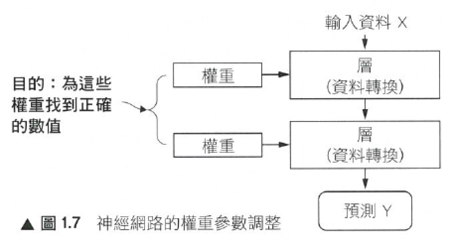

為了提高神經網路的效能(預測的準確率)，我們要即時的掌握目前的輸出(Y)與真正的標準答案Y還差多少，這個評估由神經網路的損失函數(loss function;或稱目標函數, objective function;或稱成本函數, cost function[fn:9])來負責，如圖[[fig:python-deep-learning-4]]。損失函數會取得神經網路的預測結果與標準答案二者的損失分數(又稱差距分數)，做為每一次學習的表現效能之評估標準。

#+CAPTION: 損失函數
#+LABEL:fig:python-deep-learning-4
#+name: fig:python-deep-learning-4
#+ATTR_LATEX: :width 400
#+ATTR_HTML: :width 400
#+ATTR_ORG: :width 400
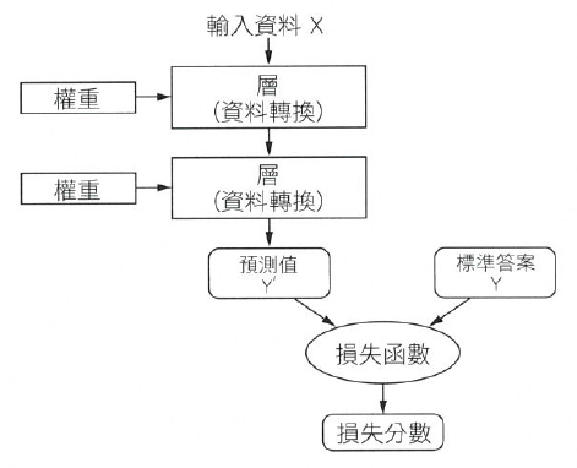

而深度學習的基本工作就是使用損失函數做為回饋訊息來一步步微調權重，逐步降低每次學習的損失分數，最終目標在於讓損失函數結果達到最小，而這個微調工作則由優化器(optimizer，也稱最佳化函數)來執行。優化器實作了反向傳播演算法(Backpropagation)，這也是深度學習中的核心演算法，藉此來週整權重。

#+CAPTION: 優化器
#+LABEL:fig:python-deep-learning-5
#+name: fig:python-deep-learning-5
#+ATTR_LATEX: :width 300
#+ATTR_HTML: :width 400
#+ATTR_ORG: :width 300
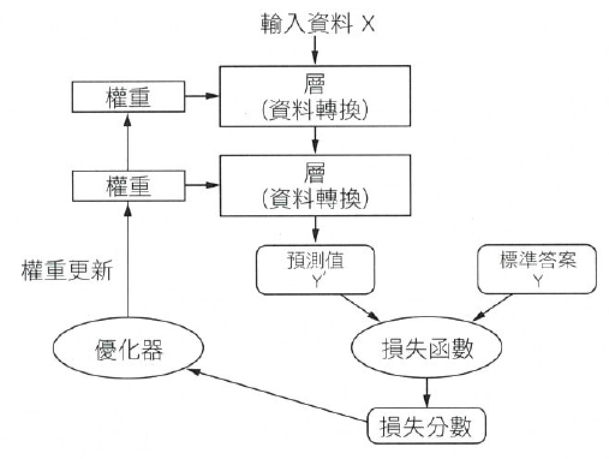

事實上，同樣的流程我們也曾在[[id:6ae7fb7a-0b38-4448-b19f-073d262513f2][迴歸]]裡看過，在找到一條理想的迴歸方程式時，我們也是先隨便找一條，然後用loss function去評估這條方程式的優劣，再「求切線斜率」的方式來修正方程式的係數。差別只在於：在[[id:6ae7fb7a-0b38-4448-b19f-073d262513f2][迴歸]]時我們要修正的係數只有一、兩個，而在深度學習中，我們要同時修正成千上萬個權重。

那麼，在最初一次的學習，權重的值是如何設定的呢？可以先全數設為零，但更常用的做法是隨機指定，隨著多次學習後，權重會逐步往正確的方向調整，損失分數也會慢慢降低。

我們再複習一下[[id:d6daa102-05bb-475d-b619-db8b61e86030][神經網路]]這章裡的文字：

#+begin_quote
是的，就如同考試時你面對陌生選擇題的反應，神經網路也決定這麼幹，隨便丟一些數值填到矩陣中當成第一批參數。事實上，同樣的策略我們在[[id:7cd4a142-4cd9-46b6-b9a4-2ad750ae622f][線性迴歸:年齡身高預測/隨機的力量]]裡已經玩過了，當初在找出方程式的最佳參數組合時，我們也是閉上眼睛隨便選一組。不管整個網路中有多少參數，當我們隨機設定好了所有參數的最初值後，整個神經網就就可以運作了，嗯...至少已經可以依照前向傳播的流程輸出第一個預測結果了，你看，我們已經朝完美的人工智慧跨近一大步了-_-
#+ATTR_LATEX: :width 300
#+ATTR_ORG: :width 300
#+ATTR_HTML: :width 400

接下來的流程其實和[[id:6ae7fb7a-0b38-4448-b19f-073d262513f2][迴歸]]有點類似，我們評估預測結果的品質，然後回頭修正參數，只是這次的工程有點浩大，我們要修正所有的參數，這個回頭修正所有參數的過程稱為反向傳播(backward propagation)。

#+end_quote

* 實作範例
** 二元分類：IMDB
自 IMDB 資料集中取得 50000 個正/負評論，各 25000 個，該資料集已內建於 Keras 中，且資料已先預處理，電影評論內容為由單字構成的 list 結構，例如，若評論內容為
#+begin_example
In a Wonderful morning...
#+end_example
其 list 結構可能為
#+begin_example
(8, 3, 386, 1969...)
#+end_example
即，每個單字都會依據其出現頻率給定一個編號，編號越小越常見。(與 IMDb 相關的 paper 參見[[https://paperswithcode.com/sota/sentiment-analysis-on-imdb][Sentiment Analysis on IMDb / paperswithcode]]

#+BEGIN_SRC python -r -n :async :results output :exports both :session imdb
from keras.datasets import imdb
(train_data, train_labels), (test_data, test_labels) = imdb.load_data(num_words=10000)
print(train_data[0])
print(train_labels[0])
#+END_SRC

#+RESULTS:
: [1, 14, 22, 16, 43, 530, 973, 1622, 1385, 65, 458, 4468, 66, 3941, 4, 173, 36, 256, 5, 25, 100, 43, 838, 112, 50, 670, 2, 9, 35, 480, 284, 5, 150, 4, 172, 112, 167, 2, 336, 385, 39, 4, 172, 4536, 1111, 17, 546, 38, 13, 447, 4, 192, 50, 16, 6, 147, 2025, 19, 14, 22, 4, 1920, 4613, 469, 4, 22, 71, 87, 12, 16, 43, 530, 38, 76, 15, 13, 1247, 4, 22, 17, 515, 17, 12, 16, 626, 18, 2, 5, 62, 386, 12, 8, 316, 8, 106, 5, 4, 2223, 5244, 16, 480, 66, 3785, 33, 4, 130, 12, 16, 38, 619, 5, 25, 124, 51, 36, 135, 48, 25, 1415, 33, 6, 22, 12, 215, 28, 77, 52, 5, 14, 407, 16, 82, 2, 8, 4, 107, 117, 5952, 15, 256, 4, 2, 7, 3766, 5, 723, 36, 71, 43, 530, 476, 26, 400, 317, 46, 7, 4, 2, 1029, 13, 104, 88, 4, 381, 15, 297, 98, 32, 2071, 56, 26, 141, 6, 194, 7486, 18, 4, 226, 22, 21, 134, 476, 26, 480, 5, 144, 30, 5535, 18, 51, 36, 28, 224, 92, 25, 104, 4, 226, 65, 16, 38, 1334, 88, 12, 16, 283, 5, 16, 4472, 113, 103, 32, 15, 16, 5345, 19, 178, 32]
: 1

如上為第一筆評論的單字代號與評論結果，若要將原始資料的單字代號還原，其程式碼如下：
#+BEGIN_SRC python -r -n:async :results output :exports both :session imdb
# word_index is a dictionary mapping words to an integer index
word_index = imdb.get_word_index()     (ref:wordIndex)
print("字典中key為this對應的value:",word_index['this'])
# We reverse it, mapping integer indices to words
reverse_word_index = dict([(value, key) for (key, value) in word_index.items()])    (ref:reverseWordIndex)
print("反轉字典中key為11所對應到的value:",reverse_word_index[11])
print("反轉字典中key為1所對應到的value:",reverse_word_index[1])
print("反轉字典中key為2所對應到的value:",reverse_word_index[2])
# We decode the review; note that our indices were offset by 3
# because 0, 1 and 2 are reserved indices for "padding", "start of sequence", and "unknown".
decoded_review = ' '.join([reverse_word_index.get(i - 3, '?') for i in train_data[0]]) (ref:decodedReview)
print(decoded_review)
#+END_SRC

#+RESULTS:
: 字典中key為this對應的value: 11
: 反轉字典中key為11所對應到的value: this
: 反轉字典中key為1所對應到的value: the
: 反轉字典中key為2所對應到的value: and
: ? this film was just brilliant casting location scenery story direction everyone's really suited the part they played and you could just imagine being there robert ? is an amazing actor and now the same being director ? father came from the same scottish island as myself so i loved the fact there was a real connection with this film the witty remarks throughout the film were great it was just brilliant so much that i bought the film as soon as it was released for ? and would recommend it to everyone to watch and the fly fishing was amazing really cried at the end it was so sad and you know what they say if you cry at a film it must have been good and this definitely was also ? to the two little boy's that played the ? of norman and paul they were just brilliant children are often left out of the ? list i think because the stars that play them all grown up are such a big profile for the whole film but these children are amazing and should be praised for what they have done don't you think the whole story was so lovely because it was true and was someone's life after all that was shared with us all

上述程式中第[[(wordIndex)]]行主要負責取得單字(key)的對應數字(value)的字典，再藉由第[[(reverseWordIndex)]]行將(key:value)轉換為(value:key)，最後第[[(decodedReview)]]行將字典中的單字回復至原始評論，程式中(i-3)的原因是imdb.load_data已預留了第 0~2 個位置做特殊用途。
*** 準備資料
由於 IMDB 匯入 train_data 及 test_data 均為 list 型態，要先轉換為 tensor 才能輸入至神經網路，方法有二：
1. 填補資料中每個子 list 內容使其具有相同長度，再做reshape
2. 對每個子 list 做 one-hot encoding，其程式碼如下：
#+BEGIN_SRC python -r -n :async :results output :exports both :session imdb
import numpy as np
def vectorize_sequences(sequences, dimension=10000):
    # Create an all-zero matrix of shape (len(sequences), dimension)
    results = np.zeros((len(sequences), dimension))
    for i, sequence in enumerate(sequences):
        results[i, sequence] = 1.  # set specific indices of results[i] to 1s
    return results
print("====train_data[0]======")
print(train_data[0])
# Our vectorized training data

x_train = vectorize_sequences(train_data)
# Our vectorized test data
x_test = vectorize_sequences(test_data)
print("====x_data[0]======")
print(x_train[0])

# 最後再將標籤資料也向量化
y_train = np.asarray(train_labels).astype('float32')
y_test = np.asarray(test_labels).astype('float32')
print("====y_data[0]======")
print(y_train[0])
#+END_SRC

#+RESULTS:
: ====train_data[0]======
: [1, 14, 22, 16, 43, 530, 973, 1622, 1385, 65, 458, 4468, 66, 3941, 4, 173, 36, 256, 5, 25, 100, 43, 838, 112, 50, 670, 2, 9, 35, 480, 284, 5, 150, 4, 172, 112, 167, 2, 336, 385, 39, 4, 172, 4536, 1111, 17, 546, 38, 13, 447, 4, 192, 50, 16, 6, 147, 2025, 19, 14, 22, 4, 1920, 4613, 469, 4, 22, 71, 87, 12, 16, 43, 530, 38, 76, 15, 13, 1247, 4, 22, 17, 515, 17, 12, 16, 626, 18, 2, 5, 62, 386, 12, 8, 316, 8, 106, 5, 4, 2223, 5244, 16, 480, 66, 3785, 33, 4, 130, 12, 16, 38, 619, 5, 25, 124, 51, 36, 135, 48, 25, 1415, 33, 6, 22, 12, 215, 28, 77, 52, 5, 14, 407, 16, 82, 2, 8, 4, 107, 117, 5952, 15, 256, 4, 2, 7, 3766, 5, 723, 36, 71, 43, 530, 476, 26, 400, 317, 46, 7, 4, 2, 1029, 13, 104, 88, 4, 381, 15, 297, 98, 32, 2071, 56, 26, 141, 6, 194, 7486, 18, 4, 226, 22, 21, 134, 476, 26, 480, 5, 144, 30, 5535, 18, 51, 36, 28, 224, 92, 25, 104, 4, 226, 65, 16, 38, 1334, 88, 12, 16, 283, 5, 16, 4472, 113, 103, 32, 15, 16, 5345, 19, 178, 32]
: ====x_data[0]======
: [0. 1. 1. ... 0. 0. 0.]
: ====y_data[0]======
: 1.0
*** 建立神經網路
要建構一個 Dense 層堆疊架構的神經網路，要考慮兩個關鍵：
1. 要用多少層？
1. 每一層要有多少神經元？

此處使用兩個中間層、一個輸出層，如圖[[fig:nn3-6]]，一般的神經網路中，對那些介於輸入層和輸出層間的layer，我們習慣上稱之為隱藏層(hidden layers)，但此處 Keras 的輸入層也有隱藏層的特性。圖[[fig:nn3-6]]的 hidden layer 以 relu 為啟動函數，輸出層以 sigmoid 啟動函數輸出機率值。

#+BEGIN_SRC ditaa :file images/nn3-6.png

        輸入(向量化文字)
            |
            v
  +-------------------+
  |+-----------------+|
  || Dense(units=16) ||-+
  |+--------+--------+| |
  |         |         | +-隱藏層
  |         v         | |
  |+-----------------+| |
  || Dense(units=10) ||-+
  |+--------+--------+|
  |         |         |
  |         v         |
  |+-----------------+|-+
  ||  Dense(units=1) || +-輸出層
  |+-----------------+|-+
  +-------------------+
  #+END_SRC

#+RESULTS:
#+CAPTION: IMDB model 架構
#+name: fig:nn3-6
#+ATTR_LATEX: :width 200
#+ATTR_HTML: :width 300
#+ATTR_ORG: :width 200
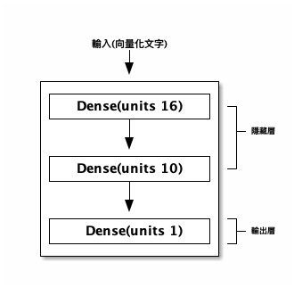

由於輸入資料為向量、標籤為純量(1, 0)，對這樣的問題，適合用 relu 啟動函數的全連接層(Dense)堆疊架構：Dense(16, activation='relu')。其中 16 指該層神經元的數量(也可看成該層的寬度)，典型旳寫法為：
#+BEGIN_SRC python -r :results output :exports both :eval no
# 加入Dense隱藏層，該層有16個神經元
model.add(layers.Dense(16, activation='relu'))
#+END_SRC

擁有 16 個神經單元表示權重矩陣 W 的 shape 為(input_dimension, 16)，在 W 和 input 做內積後，input 資料會被映射到 16 維的空間上，最後加上 b、套用 relu 運算來產生輸出值。每一層的神經元數越多，可以讓神經網路學習更複雜的資料表示法，但也使計算成本更高。

#+CAPTION: ReLU 函數圖
#+LABEL:fig:ReLUFunction
#+name: fig:ReLUFunction
#+ATTR_LATEX: :width 200
#+ATTR_ORG: :width 200
#+ATTR_HTML: :width 300
#+RESULTS:
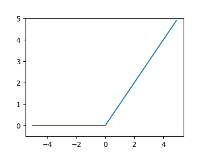

*** 為什麼要加入[[id:d3bcc30a-3d94-4a3c-8e66-baaac7325c75][Activation Function]]
為何要有 relu 等啟動函數？原因之一是這類函數為非線性函數(如圖[[fig:ReLUFunction]])，回顧[[id:d6daa102-05bb-475d-b619-db8b61e86030][神經網路]]中的「學測成績預測模型」，像圖[[fig:exam-Network2]]的模型，我們也只是在解一個如\(f(x)=x_1*w_1+x_2*w_2+x_3*w_3+...+x_7*w_7\)這樣的函式問題。

#+begin_src plantuml -t latex :file images/exam-network2p.png
@startuml
storage 學測成績
storage x1
storage x2
storage x3
storage x4
storage x5
storage x6
storage x7
x1 --|> 學測成績 : w1
x2 --|> 學測成績 : w2
x3 --|> 學測成績 : w3
x4 --|> 學測成績 : w4
x5 --|> 學測成績 : w5
x6 --|> 學測成績 : w6
x7 --|> 學測成績 : w7
@enduml
#+end_src

#+CAPTION: 學測成績預測模型#2
#+LABEL:fig:exam-Network2
#+NAME:fig:exam-Network2
#+ATTR_LATEX: :width 400
#+ATTR_ORG: :width 400
#+ATTR_HTML: :width 400
#+RESULTS:
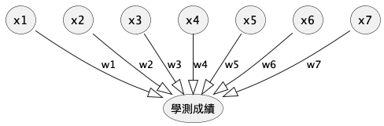

就算我們把模型2進化為模型3(如圖[[fig:exam-Network3]])，本質上也仍只是一層，再多的層數也能合併為一層，此類模型並無助於複雜的學習。

#+begin_src plantuml :file images/exam-network3p.png
@startuml
storage 學測成績
storage x1
storage x2
storage x3
storage x4
storage x5
storage x6
storage x7
storage y1
storage y2
storage y3
x1 --|> y1 : w11
x2 --|> y1 : w21
x3 --|> y1 : w31
x3 --|> y2 : w32
x4 --|> y2 : w42
x5 --|> y2 : w52
x5 --|> y3 : w53
x6 --|> y2 : w62
x6 --|> y3 : w63
x7 --|> y3 : w73
y1 -[dashed]-|> 學測成績 : w8
y2 -[dashed]-|> 學測成績 : w9
y3 -[dashed]-|> 學測成績 : w10
@enduml
#+end_src

#+CAPTION: 學測成績預測模型#3
#+LABEL:fig:exam-Network3
#+NAME:fig:exam-Network3
#+ATTR_LATEX: :width 400
#+ATTR_ORG: :width 300
#+ATTR_HTML: :width 500
#+RESULTS:
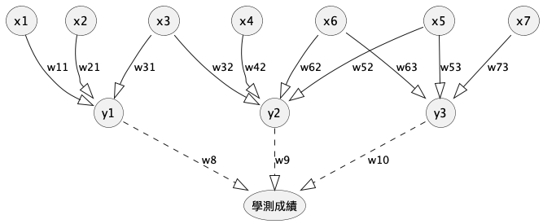

以圖[[fig:exam-Network3]]為例，最後對學測成績\(\hat{y}\)的預測為：
$$
\hat{y}=y_1w_8+y_2w_9+y_3w_{10}
$$
其中
\begin{eqnarray}
y_1 &=& x_1w_{11} + x_2w_{21} + x_3w_{31} \\
y_2 &=& x_3w_{32} + x_4w_{42} + x_5w_{52} + x_6w_{62} \\
y_3 &=& x_5w_{53} + x_6w_{63} + x_7w_{73}
\end{eqnarray}
如果我們稍微整理一下上面這個看起來像兩層的模型：
\begin{equation*}
\begin{split}
\hat{y} =& y_1w_8+y_2w_9+y_3w_{10} \\
        =& (x_1w_{11} + x_2w_{21} + x_3w_{31})w_8 \\
         &+ (x_3w_{32} + x_4w_{42} + x_5w_{52} + x_6w_{62})w_9 \\
         &+ (x_5w_{53} + x_6w_{63} + x_7w_{73})w_{10} \\
        =& x_1w_{11}w_8 + x_2w_{21}w_8 + x_3w_{31}w_8 \\
         &+ x_3w_{32}w_9 + x_4w_{42}w_9 + x_5w_{52}w_9 + x_6w_{62}w_9 \\
         &+ x_5w_{53}w_{10} + x_6w_{63}w_{10} + x_7w_{73}w_{10} \\
\end{split}
\end{equation*}
最後就會發現，不管它看起來像是幾層，最後都能整理成一層的模樣:
\begin{equation*}
\begin{split}
\hat{y} =& x_1\times(w_{11}w_8) \\
         &+ x_2\times(w_{21}w_8) \\
         &+ x_3\times(w_{31}w_8+w_{32}w_9) \\
         &+ x_4\times(w_{42}w_9) \\
         &+ x_5\times(w_{52}w_9 + w_{53}w_{10}) \\
         &+ x_6\times(w_{62}w_9 + w_{63}w_{10})\\
         &+ x_7\times(w_{73}w_{10})
\end{split}
\end{equation*}
結果就是跟底下的方程式一樣
\(f(x)=x_1*w_1+x_2*w_2+x_3*w_3+...+x_7*w_7\)

為了有效讓模型更加複雜，此處可以在模型中加入非線性轉換，如圖[[fig:ReLUFunction]]中的ReLU[[id:d3bcc30a-3d94-4a3c-8e66-baaac7325c75][激勵函數]]，其結果如圖[[fig:exam-Network4]]所示。

#+CAPTION: ReLU 函數圖
#+LABEL:fig:ReLUFunction
#+name: fig:ReLUFunction
#+ATTR_LATEX: :width 300
#+ATTR_ORG: :width 300
#+ATTR_HTML: :width 500

#+begin_src plantuml :file images/exam-network4p.png
@startuml
storage 學測成績
storage x1
storage x2
storage x3
storage x4
storage x5
storage x6
storage x7
storage reLU1 as "reLU" #aliceblue;line:blue;line.dotted;text:blue
storage reLU2 as "reLU" #aliceblue;line:blue;line.dotted;text:blue
storage reLU3 as "reLU" #aliceblue;line:blue;line.dotted;text:blue

storage y1
storage y2
storage y3
storage reLU4 as "reLU" #aliceblue;line:blue;line.dotted;text:blue
storage reLU5 as "reLU" #aliceblue;line:blue;line.dotted;text:blue
storage reLU6 as "reLU" #aliceblue;line:blue;line.dotted;text:blue
reLU1 -[dashed]-|> y1
reLU2 -[dashed]-|> y2
reLU3 -[dashed]-|> y3

x1 --|> reLU1 : w11
x2 --|> reLU1 : w21
x3 --|> reLU1 : w31
x3 --|> reLU2 : w32
x4 --|> reLU2 : w42
x5 --|> reLU2 : w52
x5 --|> reLU3 : w53
x6 --|> reLU2 : w62
x6 --|> reLU3 : w63
x7 --|> reLU3 : w73

y1 --|> reLU4 : w8
y2 --|> reLU5 : w9
y3 --|> reLU6 : w10

reLU4 -[dashed]-|> 學測成績
reLU5 -[dashed]-|> 學測成績
reLU6 -[dashed]-|> 學測成績

@enduml
#+end_src
#+CAPTION: 學測成績預測模型#4
#+LABEL:fig:exam-Network4
#+name: fig:exam-Network4
#+ATTR_LATEX: :width 500
#+ATTR_ORG: :width 100
#+ATTR_HTML: :width 500
#+RESULTS:
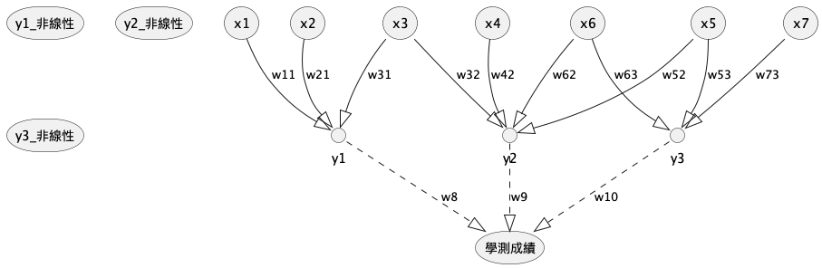
*** 程式實作
圖[[fig:nn3-6]]的實作程式如下，此處以最簡單的 NN (Neural Network) 作為範例。以 Keras 的核心為模型，應用最常使用 Sequential 模型。藉由.add()我們可以一層一層的將神經網路疊起。在每一層之中我們只需要簡單的設定每層的大小(units)與激勵函數(activation function)。
#+BEGIN_SRC python -r -n :async :results output :exports both :session imdb
from keras import models
from keras import layers

model = models.Sequential()
model.add(layers.Dense(16, activation='relu', input_shape=(10000,)))
model.add(layers.Dense(16, activation='relu'))
model.add(layers.Dense(1, activation='sigmoid'))
#+END_SRC

#+RESULTS:
: /Library/Frameworks/Python.framework/Versions/3.12/lib/python3.12/site-packages/keras/src/layers/core/dense.py:85: UserWarning: Do not pass an `input_shape`/`input_dim` argument to a layer. When using Sequential models, prefer using an `Input(shape)` object as the first layer in the model instead.
:   super().__init__(activity_regularizer=activity_regularizer, **kwargs)

建好 model 後，要選擇一個損失函數和一個優化器，由於要處理的是二元分類問題，所以最好用 binary_crossentropy 損失函數，因為 crossentropy 主要就是用來測量機率分佈之間的距離(差異)。其實作如下：

#+BEGIN_SRC python -r -n :async :results output :exports both :session imdb
model.compile(optimizer='rmsprop',
             loss='binary_crossentropy',
             metrics=['accuracy'])
#+END_SRC

#+RESULTS:

之所以能將 optimizer 和 loss function 以字串方式經由參數傳給 compile()，這是因為 rmsprop、binary_crossentropy 和 accuracy 均已事先在 Keras 套件中定義好了，若是要進一步自訂參數(如自訂學習率)，做法如下：

#+BEGIN_SRC python -r -n :async :results output :exports both :session imdb
# 調整learning rate
from keras import optimizers

model.compile(optimizer=optimizers.RMSprop(learning_rate=0.001),
              loss='binary_crossentropy',
              metrics=['accuracy'])

# 使用另外的評估函數
from keras import losses
from keras import metrics

model.compile(optimizer=optimizers.RMSprop(learning_rate=0.001),
              loss=losses.binary_crossentropy,
              metrics=[metrics.binary_accuracy])
#+END_SRC

#+RESULTS:
若您使用的是M1/M2核心的Mac電腦，則可能會出現上述訊息，雖然不影響正執行結果，但你仍可以參考[[https://stackoverflow.com/questions/77222463/is-there-a-way-to-change-adam-to-legacy-when-using-mac-m1-m2-in-tensorflow][stackoverflow上的這篇文章]]來解決這些惱人的訊息。
*** 驗證神經網路的 model
為了在訓練期間監控 model 對新資料的準確度，可以從原始訓練資料中分離出 10000 個樣本來建立驗證資料集。
#+BEGIN_SRC python -r -n :async :results output :exports both :session imdb
x_val = x_train[:10000] # 前10000個資料為驗證集
partial_x_train = x_train[10000:] # 第10000個以後為訓練集

y_val = y_train[:10000]
partial_y_train = y_train[10000:]
#+END_SRC

#+RESULTS:

接下來才是使用 fit()來訓練模型，進行 20 個訓練週期(epoch，即，把 x_train 和 y_train 張量中的所有訓練樣本進行 20 輪的訓練)，以 512 個小樣本的小批量(batch_size)進行訓練，
#+BEGIN_SRC python -r -n :async :results output :exports both :session imdb
history = model.fit(partial_x_train,
                    partial_y_train,
                    epochs=20,
                    batch_size=512,
                    validation_data=(x_val, y_val))
#+END_SRC

#+RESULTS:
#+begin_example
Epoch 1/20
30/30 ━━━━━━━━━━━━━━━━━━━━ 2s 34ms/step - binary_accuracy: 0.6895 - loss: 0.5987 - val_binary_accuracy: 0.8637 - val_loss: 0.3995
...略...
Epoch 20/20
30/30 ━━━━━━━━━━━━━━━━━━━━ 0s 9ms/step - binary_accuracy: 0.9995 - loss: 0.0107 - val_binary_accuracy: 0.8726 - val_loss: 0.5637
#+end_example

model.fit()會回傳一個 history 物件，這物件本身有一個 history 屬性，為一個包含有關訓練過程中相關資料的字典，這個字期包含有 4 個項目(val_loss, val_acc, loss, acc)，為訓練和驗證時監控的指標。
#+BEGIN_SRC python -r -n :async :results output :exports both :session imdb
print(history.history)
print("binary_accuracy:",history.history['binary_accuracy'])
print("loss:",history.history['loss'])
print("val_binary_accuracy:",history.history['val_binary_accuracy'])
print("val_loss:",history.history['val_loss'])
#+end_src

#+RESULTS:
: {'binary_accuracy': [0.7724000215530396, 0.8913999795913696, 0.9195333123207092, 0.9340000152587891, 0.946066677570343, 0.9564666748046875, 0.9628000259399414, 0.966533362865448, 0.974133312702179, 0.9778666496276855, 0.9836000204086304, 0.9865333437919617, 0.9886000156402588, 0.9922000169754028, 0.9932000041007996, 0.9955999851226807, 0.9947333335876465, 0.9983999729156494, 0.997866690158844, 0.9980000257492065], 'loss': [0.523308277130127, 0.32568830251693726, 0.2428768277168274, 0.195417582988739, 0.16299770772457123, 0.13810740411281586, 0.12029378116130829, 0.10577400773763657, 0.08585202693939209, 0.07604678720235825, 0.0627065971493721, 0.05464218556880951, 0.04679805412888527, 0.03932145610451698, 0.033363644033670425, 0.02628222107887268, 0.026078475639224052, 0.018040597438812256, 0.017737768590450287, 0.014618363231420517], 'val_binary_accuracy': [0.8636999726295471, 0.8859000205993652, 0.8891000151634216, 0.876800000667572, 0.8762000203132629, 0.8863999843597412, 0.8859999775886536, 0.8823999762535095, 0.8826000094413757, 0.8780999779701233, 0.8794999718666077, 0.8788999915122986, 0.878000020980835, 0.8666999936103821, 0.8751999735832214, 0.8748999834060669, 0.8738999962806702, 0.8673999905586243, 0.8712999820709229, 0.8726000189781189], 'val_loss': [0.39949268102645874, 0.3119995892047882, 0.28234928846359253, 0.3045506775379181, 0.30820411443710327, 0.2834608554840088, 0.2936294972896576, 0.3101825714111328, 0.3229252099990845, 0.34479930996894836, 0.36042720079421997, 0.3789125978946686, 0.4012978971004486, 0.46704238653182983, 0.44717246294021606, 0.47011518478393555, 0.4929317533969879, 0.5508306622505188, 0.5428465604782104, 0.563687264919281]}
: binary_accuracy: [0.7724000215530396, 0.8913999795913696, 0.9195333123207092, 0.9340000152587891, 0.946066677570343, 0.9564666748046875, 0.9628000259399414, 0.966533362865448, 0.974133312702179, 0.9778666496276855, 0.9836000204086304, 0.9865333437919617, 0.9886000156402588, 0.9922000169754028, 0.9932000041007996, 0.9955999851226807, 0.9947333335876465, 0.9983999729156494, 0.997866690158844, 0.9980000257492065]
: loss: [0.523308277130127, 0.32568830251693726, 0.2428768277168274, 0.195417582988739, 0.16299770772457123, 0.13810740411281586, 0.12029378116130829, 0.10577400773763657, 0.08585202693939209, 0.07604678720235825, 0.0627065971493721, 0.05464218556880951, 0.04679805412888527, 0.03932145610451698, 0.033363644033670425, 0.02628222107887268, 0.026078475639224052, 0.018040597438812256, 0.017737768590450287, 0.014618363231420517]
: val_binary_accuracy: [0.8636999726295471, 0.8859000205993652, 0.8891000151634216, 0.876800000667572, 0.8762000203132629, 0.8863999843597412, 0.8859999775886536, 0.8823999762535095, 0.8826000094413757, 0.8780999779701233, 0.8794999718666077, 0.8788999915122986, 0.878000020980835, 0.8666999936103821, 0.8751999735832214, 0.8748999834060669, 0.8738999962806702, 0.8673999905586243, 0.8712999820709229, 0.8726000189781189]
: val_loss: [0.39949268102645874, 0.3119995892047882, 0.28234928846359253, 0.3045506775379181, 0.30820411443710327, 0.2834608554840088, 0.2936294972896576, 0.3101825714111328, 0.3229252099990845, 0.34479930996894836, 0.36042720079421997, 0.3789125978946686, 0.4012978971004486, 0.46704238653182983, 0.44717246294021606, 0.47011518478393555, 0.4929317533969879, 0.5508306622505188, 0.5428465604782104, 0.563687264919281]

#+BEGIN_SRC python -r -n :async :results output :exports both :session imdb
# 秀出history架構
history_dict = history.history
print(history_dict.keys())

# 畫圖
import matplotlib.pyplot as plt
accuracy = history.history['binary_accuracy']
val_accuracy = history.history['val_binary_accuracy']
loss = history.history['loss']
val_loss = history.history['val_loss']
epochs = range(1, len(accuracy) + 1)# "bo" is for "blue dot"
plt.cla()
plt.plot(epochs, loss, 'bo', label='Training loss')
# b is for "solid blue line"
plt.plot(epochs, val_loss, 'b', label='Validation loss')
plt.title('Training and validation loss')
plt.xlabel('Epochs')
plt.ylabel('Loss')
plt.legend()
plt.plot()
plt.savefig("images/imdb-Keras-1.png")
plt.cla()
#plt.show()plt.clf()   # clear figureplt.clf()
acc_values = history_dict['binary_accuracy']
val_acc_values = history_dict['val_binary_accuracy']
plt.plot(epochs, accuracy, 'bo', label='Training acc')
plt.plot(epochs, val_accuracy, 'b', label='Validation acc')
plt.title('Training and validation accuracy')
plt.xlabel('Epochs')
plt.ylabel('Accuracy')
plt.legend()
plt.plot()
plt.savefig("images/imdb-Keras-2.png")
#plt.show()
#+END_SRC

#+RESULTS:
: dict_keys(['binary_accuracy', 'loss', 'val_binary_accuracy', 'val_loss'])

#+CAPTION: IMDB-Keras-1
#+LABEL:fig: IMDB-Keras-1
#+name: fig:IMDB-Keras-1
#+ATTR_LATEX: :width 300
#+ATTR_ORG: :width 300
#+ATTR_HTML: :width 500
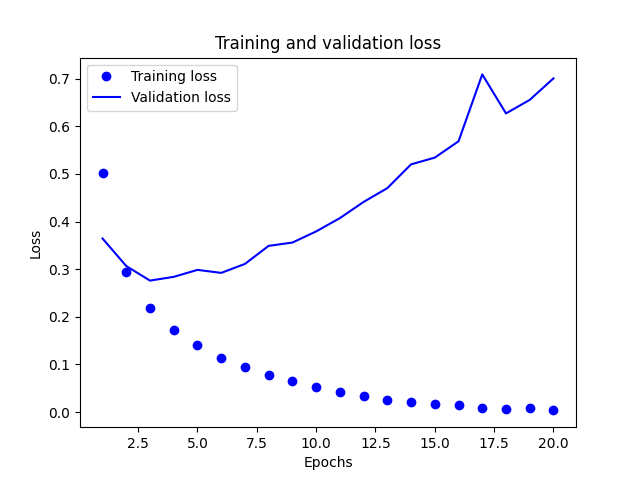

#+CAPTION:IMDB-Keras-2
#+LABEL:fig:IMDB-Keras-2
#+name: fig:IMDB-Keras-2
#+ATTR_LATEX: :width 300
#+ATTR_ORG: :width 300
#+ATTR_HTML: :width 500
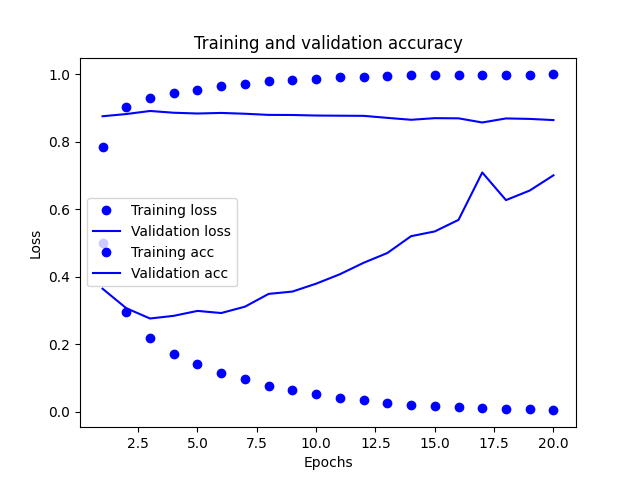
*** 優化 model
由圖[[fig:IMDB-Keras-1]]、[[fig:IMDB-Keras-2]]可以看出，上述 model 雖然在訓練階段的效能不錯，loss function 隨 epoch 下降、accuracy 也隨 epoch 升高，但在驗證階段的表現卻十分不理想，不僅 accuracy 隨 epoch 的增加呈緩降趨勢，loss function 甚至還往上急升。

第二版的 model 做了以下改進:
- 將資料向量化(vectorize_sequences())
- 加入了兩層 layer 以及 dropout 層，其架構如圖[[fig:nn3-6-2]]
#+BEGIN_SRC ditaa :file nn3-6-2.png

        輸入(向量化文字)
            |
            v
  +-------------------+
  |+-----------------+|
  || Dense(units=16) ||-+
  |+--------+--------+| |
  |         |         | |
  |         v         | |
  |+-----------------+| |
  || Dense(units=64) || |
  |+--------+--------+| |
  |         |         | |
  |         v         | |
  |+-----------------+| |
  ||  Dropout(0.25)  || |
  |+--------+--------+| |
  |         |         | +-隱藏層
  |         v         | |
  |+-----------------+| |
  || Dense(units=64) || |
  |+--------+--------+| |
  |         |         | |
  |         v         | |
  |+-----------------+| |
  ||  Dropout(0.25)  || |
  |+--------+--------+| |
  |         |         | |
  |         v         | |
  |+-----------------+| |
  || Dense(units=10) ||-+
  |+--------+--------+|
  |         |         |
  |         v         |
  |+-----------------+|-+
  ||  Dense(units=1) || +-輸出層
  |+-----------------+|-+
  +-------------------+
  #+END_SRC
#+RESULTS:
#+CAPTION: IMDB model 架構#2
#+name: fig:nn3-6-2
#+ATTR_LATEX: :width 200
#+ATTR_HTML: :width 300
#+ATTR_ORG: :width 200
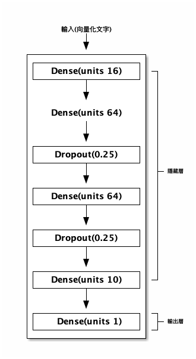

#+BEGIN_SRC python -r -n :async :results output :exports both :session imdb
# 向量化function
def vectorize_sequences(sequences, dimension=10000):
    # Create an all-zero matrix of shape (len(sequences), dimension)
    results = np.zeros((len(sequences), dimension))
    for i, sequence in enumerate(sequences):
        results[i, sequence] = 1.  # set specific indices of results[i] to 1s
    return results
# Our vectorized training data
x_train = vectorize_sequences(train_data)
# Our vectorized test data
x_test = vectorize_sequences(test_data)
# 最後再將標籤資料也向量化
y_train = np.asarray(train_labels).astype('float32')
y_test = np.asarray(test_labels).astype('float32')
# 建立model
model = models.Sequential()
model.add(layers.Dense(16, activation='relu', input_shape=(10000,)))
model.add(layers.Dense(64, activation='relu'))
model.add(layers.Dropout(0.25))
model.add(layers.Dense(64, activation='relu'))
model.add(layers.Dropout(0.25))
model.add(layers.Dense(1, activation='sigmoid'))

#判斷作業系統類型，選擇優化器
import platform
#if platform.system() == "Darwin" and platform.processor() == "arm":
#    opt = optimizers.legacy.RMSprop(learning_rate=0.0001)
#else:
opt = optimizers.RMSprop(learning_rate=0.0001)

model.compile(optimizer=opt, loss='binary_crossentropy',
              metrics=[metrics.binary_accuracy])

# 驗證資料集
x_val = x_train[:10000] # 前10000個資料為驗證集
partial_x_train = x_train[10000:] # 第10000個以後為訓練集
y_val = y_train[:10000]
partial_y_train = y_train[10000:]

# 訓練model
history = model.fit(partial_x_train, partial_y_train,
                    epochs=20, batch_size=512,
                    validation_data=(x_val, y_val), verbose=0)

# 秀出history架構
history_dict = history.history
print(history_dict.keys())

# 進行預測
x = model.predict(x_test)
print(x)

# 畫圖
import matplotlib.pyplot as plt
plt.cla()
loss = history.history['loss']
val_loss = history.history['val_loss']
epochs = range(1, len(binary_accuracy) + 1)# "bo" is for "blue dot"
plt.plot(epochs, loss, 'bo', label='Training loss')
# b is for "solid blue line"
plt.plot(epochs, val_loss, 'b', label='Validation loss')
plt.title('Training and validation loss')
plt.xlabel('Epochs')
plt.ylabel('Loss')
plt.legend()
plt.plot()
plt.savefig("images/imdb-Keras-3.png")
#plt.show()

plt.cla()
acc_values = history_dict['binary_accuracy']
val_acc_values = history_dict['val_binary_accuracy']
plt.plot(epochs, binary_accuracy, 'bo', label='Training acc')
plt.plot(epochs, val_binary_accuracy, 'b', label='Validation acc')
plt.title('Training and validation accuracy')
plt.xlabel('Epochs')
plt.ylabel('Accuracy')
plt.legend()
plt.plot()
plt.savefig("images/imdb-Keras-4.png")
#plt.show()
#+END_SRC

#+RESULTS:
: dict_keys(['binary_accuracy', 'loss', 'val_binary_accuracy', 'val_loss'])
: 782/782 ━━━━━━━━━━━━━━━━━━━━ 0s 530us/step
: [[0.28722998]
:  [0.99044675]
:  [0.72447336]
:  ...
:  [0.04659463]
:  [0.12886518]
:  [0.4191768 ]]

#+CAPTION: IMDB-Keras-1
#+LABEL:fig: IMDB-Kera-1
#+name: fig:IMDB-Keras-1
#+ATTR_LATEX: :width 300
#+ATTR_ORG: :width 300
#+ATTR_HTML: :width 500

#+CAPTION: IMDB-Keras-2
#+LABEL:fig: IMDB-Kera-2
#+name: fig:IMDB-Keras-2
#+ATTR_LATEX: :width 300
#+ATTR_ORG: :width 300
#+ATTR_HTML: :width 500

#+CAPTION: IMDB-Keras-3
#+LABEL:fig: IMDB-Kera-3
#+name: fig:IMDB-Keras-3
#+ATTR_LATEX: :width 300
#+ATTR_ORG: :width 300
#+ATTR_HTML: :width 500
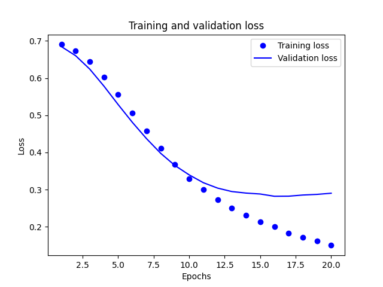

#+CAPTION: IMDB-Keras-4
#+LABEL:fig: IMDB-Kera-4
#+name: fig:IMDB-Keras-4
#+ATTR_LATEX: :width 300
#+ATTR_ORG: :width 300
#+ATTR_HTML: :width 500
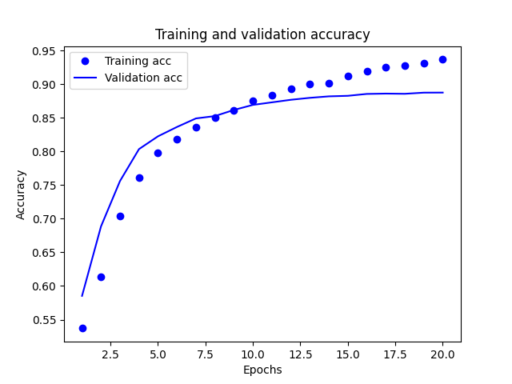

比較上述兩組結果，可以發現優化版的 model 在 loss function 以及 accuracy 的表現都有進步。

** 資料分割: IRIS / K-Fold Cross Validation

*** GridSearchCV
#+begin_src python -r -n  :async :results output :exports both :session IRIS-KFold
import numpy as np
import tensorflow as tf
from sklearn.datasets import load_iris
from sklearn.preprocessing import StandardScaler
from sklearn.model_selection import train_test_split, GridSearchCV
from sklearn.metrics import classification_report, accuracy_score
from tensorflow import keras
from tensorflow.keras.models import Sequential
from tensorflow.keras.layers import Dense
from scikeras.wrappers import KerasClassifier

# 載入IRIS資料集
iris = load_iris()
x, y = iris.data, iris.target

# 資料標準化
scaler = StandardScaler()
x = scaler.fit_transform(x)

# 分割資料集為訓練集和測試集
x_train, x_test, y_train, y_test = train_test_split(
    x, y, test_size=0.2, random_state=9527
)

# 建立模型的函數 (用於 KerasClassifier)
def create_model(optimizer='adam', activation='relu'):
    model = Sequential()
    model.add(Dense(16, input_dim=4, activation=activation))
    model.add(Dense(8, activation=activation))
    model.add(Dense(3, activation='softmax'))

    model.compile(optimizer=optimizer,
                  loss='sparse_categorical_crossentropy',
                  metrics=['accuracy'])
    return model

# 使用 scikeras 的 KerasClassifier
model = KerasClassifier(model=create_model, verbose=0)

# 設定參數網格 (需加上 model__ 前綴)
param_grid = {
    'batch_size': [10, 20, 32],
    'epochs': [50, 100],
    'model__optimizer': ['adam', 'sgd'],
    'model__activation': ['relu', 'tanh']
}

# 建立 GridSearchCV 物件
grid = GridSearchCV(estimator=model,
                    param_grid=param_grid,
                    cv=5,
                    n_jobs=-1)

# 執行參數搜尋
grid_result = grid.fit(x_train, y_train)

# 輸出最佳參數及最佳分數
print(f"最佳參數: {grid_result.best_params_}")
print(f"最佳驗證準確度: {grid_result.best_score_:.4f}")

# 以最佳模型在測試集上評估效果
best_model = grid_result.best_estimator_
y_pred = best_model.predict(x_test)
print(f"測試集準確度: {accuracy_score(y_test, y_pred):.4f}")
print(classification_report(y_test, y_pred))
#+end_src

#+RESULTS:
#+begin_example
最佳參數: {'batch_size': 10, 'epochs': 100, 'model__activation': 'tanh', 'model__optimizer': 'adam'}
最佳驗證準確度: 0.9583
測試集準確度: 1.0000
              precision    recall  f1-score   support

           0       1.00      1.00      1.00        13
           1       1.00      1.00      1.00         6
           2       1.00      1.00      1.00        11

    accuracy                           1.00        30
   macro avg       1.00      1.00      1.00        30
weighted avg       1.00      1.00      1.00        30
#+end_example

** 多類別分類：數位新聞
目標：將路透社(Reuters)的數位新聞專欄分成 46 個主題，這屬於多類別分類(multiclass classification)問題，每個資料點只會被歸入一個類別；如果每個資料點可能屬於多個類別，則屬於多標籤多類別(multilabel multiclass classification)問題。
*** 資料集
和 MNIST、IMDB 一樣，這組由 Reuters 在 1986 年發布的簡短新聞主題資料集也內建在 Keras 中，這個資料集總共分為 46 個不同主題。
#+BEGIN_SRC python -r -n :async :results output :exports both :session reuters
from keras.datasets import reuters
(train_data, train_labels), (test_data, test_labels) = reuters.load_data(num_words=10000)
print(train_data[0])
print(train_labels[0])
#+END_SRC

#+RESULTS:
: [1, 2, 2, 8, 43, 10, 447, 5, 25, 207, 270, 5, 3095, 111, 16, 369, 186, 90, 67, 7, 89, 5, 19, 102, 6, 19, 124, 15, 90, 67, 84, 22, 482, 26, 7, 48, 4, 49, 8, 864, 39, 209, 154, 6, 151, 6, 83, 11, 15, 22, 155, 11, 15, 7, 48, 9, 4579, 1005, 504, 6, 258, 6, 272, 11, 15, 22, 134, 44, 11, 15, 16, 8, 197, 1245, 90, 67, 52, 29, 209, 30, 32, 132, 6, 109, 15, 17, 12]
: 3

將資料向量化有幾種方式：將 label list 轉為整數張量，或是用 one-hot 編碼。以下為使用 python 自訂的編碼程式：

#+BEGIN_SRC python -r -n :async :results output :exports both :session reuters
import numpy as np

def vectorize_sequences(sequences, dimension=10000):
    results = np.zeros((len(sequences), dimension))
    for i, sequence in enumerate(sequences):
        results[i, sequence] = 1.
    return results

# Our vectorized training data
x_train = vectorize_sequences(train_data)
# Our vectorized test data
x_test = vectorize_sequences(test_data)
print('原始資料集維度:',train_data.shape)
print('向量化資料集維度:',x_train.shape)
print(x_train[0])
#+END_SRC

#+RESULTS:
: 原始資料集維度: (8982,)
: 向量化資料集維度: (8982, 10000)
: [0. 1. 1. ... 0. 0. 0.]

另外，Keras 也有一個內建的函式可用：

#+BEGIN_SRC python -r -n :async :results output :exports both :session reuters
from tensorflow.keras.utils import to_categorical

one_hot_train_labels = to_categorical(train_labels)
one_hot_test_labels = to_categorical(test_labels)
print(one_hot_train_labels.shape)
print(one_hot_train_labels[0])
#+END_SRC

#+RESULTS:
: (8982, 46)
: [0. 0. 0. 1. 0. 0. 0. 0. 0. 0. 0. 0. 0. 0. 0. 0. 0. 0. 0. 0. 0. 0. 0. 0.
:  0. 0. 0. 0. 0. 0. 0. 0. 0. 0. 0. 0. 0. 0. 0. 0. 0. 0. 0. 0. 0. 0.]
*** 建立神經網路模型

此次面臨的問題不似 IMDB 只分成兩類，而是共有 46 類，若每個 Dense layer 仍只使用16個維度，可能無法學會區分 46 個不同類別，故有需要將維度增加：

#+BEGIN_SRC python -r -n :async :results output :exports both :session reuters
from keras import models
from keras import layers

model = models.Sequential()
model.add(layers.Dense(64, activation='relu', input_shape=(10000,)))
model.add(layers.Dense(64, activation='relu'))
model.add(layers.Dense(46, activation='softmax'))
#+END_SRC

#+RESULTS:

另外，輸出層將啟動函數由 sigmoid 改為 softmax，以機率值來顯示預測的類別結果，配合這種情境，最適合的損失函數為 categorical_crossentropy，它可以測量兩個機率分佈間的差距（即神經網路輸出的預測機率分佈與真實分佈間的距離），透過最小化這兩個分佈間的距離來訓練神經網路，讓結果接近答案。

#+BEGIN_SRC python -r -n :async :results output :exports both :session reuters
model.compile(optimizer='rmsprop', loss='categorical_crossentropy',
                metrics=['accuracy'])
#+END_SRC

#+RESULTS:

此處的metrics用來儲存後續評估(model.evaluate)模型的記錄
#+RESULTS:
*** 驗證資料集
由訓練集抽出 1000 個樣本來驗證：
#+BEGIN_SRC python -r -n :async :results output :exports both :session reuters
x_val = x_train[:1000]
partial_x_train = x_train[1000:]

y_val = one_hot_train_labels[:1000]
partial_y_train = one_hot_train_labels[1000:]
#+END_SRC

#+RESULTS:

*** 訓練模型
#+BEGIN_SRC python -r -n :async :results output :exports both :session reuters
history = model.fit(partial_x_train,
                    partial_y_train,
                    epochs=9,
                    batch_size=512,
                    validation_data=(x_val, y_val),
                    verbose=0)
history_dict = history.history
print(history_dict.keys())
#+end_src

#+RESULTS:
: dict_keys(['accuracy', 'loss', 'val_accuracy', 'val_loss'])
*** 評估模型
程式第[[(modelEvaluate)]]行的model.evaluate()會傳回兩個結果:
- loss value
- model.compile()時指定的metrics，這裡會記錄accuracy

#+BEGIN_SRC python -r -n :async :results output :exports both :session reuters
print('loss:', history_dict['loss'])
print('accuracy:', history_dict['accuracy'])
print('val_accuracy:', history_dict['val_accuracy'])
# 評估
# Returns the loss value & metrics values for the model in test mode.
results = model.evaluate(x_test, one_hot_test_labels)      (ref:modelEvaluate)
print("評估資料內容：",results)
# 預測
predictions = model.predict(x_test)
print("預測資料架構：",predictions[0].shape)
print("預測資料內容：",predictions[0])
print("預測結果:",np.argmax(predictions[0]))
print("答案:",one_hot_test_labels[0])
#+END_SRC

#+RESULTS:
#+begin_example
loss: [3.0026934146881104, 1.6911225318908691, 1.232879877090454, 0.995611846446991, 0.8247262835502625, 0.6870928406715393, 0.5740740299224854, 0.4755861163139343, 0.4013058543205261]
accuracy: [0.47619643807411194, 0.6736406683921814, 0.7411676049232483, 0.7872713804244995, 0.8251065015792847, 0.8561763763427734, 0.8801052570343018, 0.9030318260192871, 0.9189426302909851]
val_accuracy: [0.6200000047683716, 0.6959999799728394, 0.7379999756813049, 0.765999972820282, 0.7929999828338623, 0.8069999814033508, 0.8130000233650208, 0.8069999814033508, 0.8130000233650208]
71/71 ━━━━━━━━━━━━━━━━━━━━ 0s 839us/step - accuracy: 0.8001 - loss: 0.9160
評估資料內容： [0.9611411094665527, 0.7858415246009827]
71/71 ━━━━━━━━━━━━━━━━━━━━ 0s 685us/step
預測資料架構： (46,)
預測資料內容： [1.2854149e-05 3.7789090e-05 4.2292118e-05 9.0718436e-01 8.3002120e-02
 2.3392004e-06 2.9046484e-04 1.1120371e-05 1.7645630e-03 3.6879155e-05
 1.1398656e-06 5.2984012e-04 7.8006480e-05 5.6496664e-04 2.5368774e-05
 1.3207436e-04 7.5159752e-04 2.6923684e-05 1.9250263e-05 4.1414335e-04
 1.8693011e-03 7.0673483e-04 6.4346145e-06 1.2796119e-04 6.4659413e-05
 3.2037435e-05 5.2164037e-06 1.2275139e-04 9.2562705e-06 2.1327383e-04
 5.8351434e-05 1.9944042e-04 3.2126438e-05 2.4959205e-05 8.7677283e-05
 2.4225967e-05 6.1072549e-04 4.1610518e-05 3.6517431e-06 2.3155226e-04
 9.5444564e-05 4.4300844e-04 1.3225984e-05 1.0810289e-05 4.7312778e-07
 3.7070378e-05]
預測結果: 3
答案: [0. 0. 0. 1. 0. 0. 0. 0. 0. 0. 0. 0. 0. 0. 0. 0. 0. 0. 0. 0. 0. 0. 0. 0.
 0. 0. 0. 0. 0. 0. 0. 0. 0. 0. 0. 0. 0. 0. 0. 0. 0. 0. 0. 0. 0. 0.]
#+end_example
上述程式在經由 9 個 epoch 後精準度已近 80%(0.79)。
*** 評估結果視覺化
#+BEGIN_SRC python -r -n :async :results output :exports both :session reuters
# 畫圖
import matplotlib.pyplot as plt

loss = history.history['loss']
val_loss = history.history['val_loss']

epochs = range(1, len(loss) + 1)
plt.cla()
plt.plot(epochs, loss, 'bo', label='Training loss')
plt.plot(epochs, val_loss, 'b', label='Validation loss')
plt.title('Training and validation loss')
plt.xlabel('Epochs')
plt.ylabel('Loss')
plt.axis([0, 10, 0, 3])
plt.legend()
plt.plot()
plt.savefig("images/reuters-1.png")
#plt.show()

plt.cla()   # clear figure

accuracy = history.history['accuracy']
val_accuracy = history.history['val_accuracy']

plt.plot(epochs, accuracy, 'bo', label='Training accuracy')
plt.plot(epochs, val_accuracy, 'b', label='Validation accuracy')
plt.title('Training and validation accuracy')
plt.xlabel('Epochs')
plt.ylabel('Accuracy')
plt.axis([0, 10, 0, 1])
plt.legend()
plt.plot()
plt.savefig("images/reuters-2.png")
# plt.show()
#+end_src

#+RESULTS:

#+CAPTION:Reuters-1
#+LABEL:fig:Reuters-1
#+name: fig:Reuters-1
#+ATTR_LATEX: :width 300
#+ATTR_ORG: :width 300
#+ATTR_HTML: :width 500
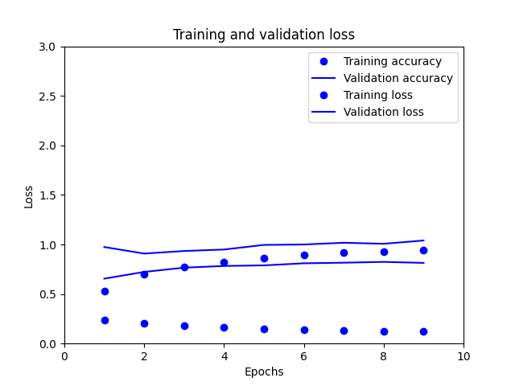

#+CAPTION:Reuters-2
#+LABEL:fig:Reuters-2
#+name: fig:Reuters-2
#+ATTR_LATEX: :width 300
#+ATTR_ORG: :width 300
#+ATTR_HTML: :width 500
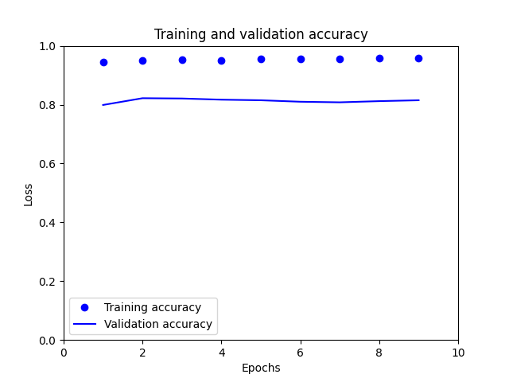
*** 優化 model
上例中的中間層若將神經元數(維度)降到 4，則其驗證準確率會降至 71%，主要原因是因為這樣會壓縮大量資訊到一個低維度的中間層表示空間，雖然神經網路能將大部份必要的資訊塞進這 4 維表示法中，但仍顯不足。若再提升維度、增加層數、加入 Dropout，結果似乎沒有顯著改善，為什麼？
#+BEGIN_SRC python -r -n :async :results output :exports both :session reuters
model = models.Sequential()
model.add(layers.Dense(64, activation='relu', input_shape=(10000,)))
model.add(layers.Dense(128, activation='relu'))
model.add(layers.Dropout(0.25))
model.add(layers.Dense(256, activation='relu'))
model.add(layers.Dropout(0.3))
model.add(layers.Dense(512, activation='relu'))
model.add(layers.Dropout(0.5))
model.add(layers.Dense(46, activation='softmax'))

model.compile(optimizer='rmsprop',
              loss='categorical_crossentropy',
              metrics=['accuracy'])  (ref:metricsName)

# 訓練
history = model.fit(partial_x_train,
                    partial_y_train,
                    epochs=9,
                    batch_size=512,
                    validation_data=(x_val, y_val),
                    verbose=0)

history_dict = history.history
print(history_dict.keys())

# 評估
# Returns the loss value & metrics values for the model in test mode.
results = model.evaluate(x_test, one_hot_test_labels)               (ref:modelEvaluate)
print("評估資料內容：",results)

# 預測
predictions = model.predict(x_test)
print("預測資料架構：",predictions[0].shape)
print("預測資料內容：",predictions[0])
print("預測結果:",np.argmax(predictions[0]))
print("答案:",one_hot_test_labels[0])
# 畫圖

import matplotlib.pyplot as plt

loss = history.history['loss']
val_loss = history.history['val_loss']

epochs = range(1, len(loss) + 1)
plt.cla()
plt.plot(epochs, loss, 'bo', label='Training loss')
plt.plot(epochs, val_loss, 'b', label='Validation loss')
plt.title('Training and validation loss')
plt.xlabel('Epochs')
plt.ylabel('Loss')
plt.axis([0, 10, 0, 3])
plt.legend()
plt.plot()
plt.savefig("images/reuters-3.png")
#plt.show()

plt.cla()   # clear figure

accuracy = history.history['accuracy']
val_accuracy = history.history['val_accuracy']

plt.plot(epochs, accuracy, 'bo', label='Training accuracy')
plt.plot(epochs, val_accuracy, 'b', label='Validation accuracy')
plt.title('Training and validation accuracy')
plt.xlabel('Epochs')
plt.ylabel('Loss')
plt.axis([0, 10, 0, 1])
plt.legend()
plt.plot()
plt.savefig("images/reuters-4.png")
# plt.show()
#+END_SRC

#+RESULTS:
#+begin_example
/Library/Frameworks/Python.framework/Versions/3.12/lib/python3.12/site-packages/keras/src/layers/core/dense.py:85: UserWarning: Do not pass an `input_shape`/`input_dim` argument to a layer. When using Sequential models, prefer using an `Input(shape)` object as the first layer in the model instead.
  super().__init__(activity_regularizer=activity_regularizer, **kwargs)
dict_keys(['accuracy', 'loss', 'val_accuracy', 'val_loss'])
71/71 ━━━━━━━━━━━━━━━━━━━━ 0s 2ms/step - accuracy: 0.7549 - loss: 1.2041
評估資料內容： [1.2634036540985107, 0.7471059560775757]
71/71 ━━━━━━━━━━━━━━━━━━━━ 0s 2ms/step
預測資料架構： (46,)
預測資料內容： [8.09684124e-08 9.49222340e-07 5.19393861e-09 9.99711692e-01
 1.80036150e-04 5.10908560e-09 1.91957028e-07 8.43487769e-08
 4.33161113e-05 5.34591793e-09 8.28265286e-07 2.17356887e-06
 1.84676892e-07 6.15979616e-07 5.97942105e-08 6.40554010e-09
 1.57276918e-05 3.67254273e-07 8.75066561e-08 4.16998364e-06
 3.44055552e-05 2.87553036e-07 9.22512200e-09 1.12576892e-07
 4.54701921e-09 1.97374948e-06 1.79199517e-08 2.03319690e-08
 1.43965934e-07 7.99068971e-08 3.35195637e-07 5.80273181e-08
 3.48503910e-08 4.89572605e-09 8.85782299e-07 2.67696922e-08
 3.60888407e-07 1.24438397e-08 2.77553855e-08 3.01288338e-07
 8.20946955e-09 1.16714205e-07 2.22603358e-09 1.22548434e-08
 2.11367723e-09 2.50342702e-09]
預測結果: 3
答案: [0. 0. 0. 1. 0. 0. 0. 0. 0. 0. 0. 0. 0. 0. 0. 0. 0. 0. 0. 0. 0. 0. 0. 0.
 0. 0. 0. 0. 0. 0. 0. 0. 0. 0. 0. 0. 0. 0. 0. 0. 0. 0. 0. 0. 0. 0.]
#+end_example

#+CAPTION: Rueter-1
#+LABEL:fig:Rueter-1
#+name: fig:Rueter-1
#+ATTR_LATEX: :width 300
#+ATTR_ORG: :width 300
#+ATTR_HTML: :width 500

#+CAPTION: Rueter-2
#+LABEL:fig:Rueter-2
#+name: fig:Rueter-2
#+ATTR_LATEX: :width 300
#+ATTR_ORG: :width 300
#+ATTR_HTML: :width 500

#+CAPTION: Rueter-3
#+LABEL:fig:Rueter-3
#+name: fig:Rueter-3
#+ATTR_LATEX: :width 300
#+ATTR_ORG: :width 300
#+ATTR_HTML: :width 500
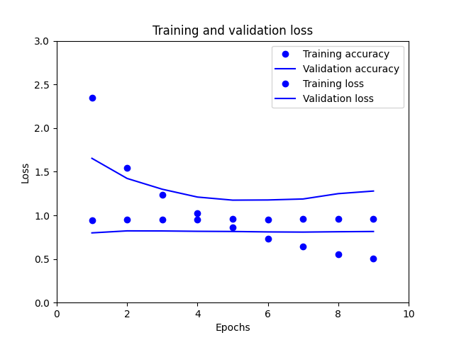

#+CAPTION: Rueter-4
#+LABEL:fig:Rueter-4
#+name: fig:Rueter-4
#+ATTR_LATEX: :width 300
#+ATTR_ORG: :width 300
#+ATTR_HTML: :width 500
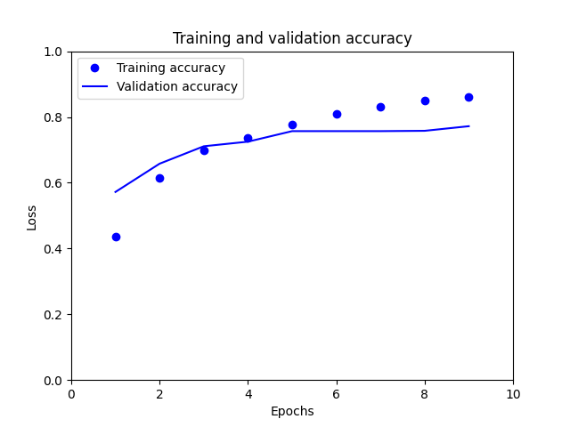

** 迴歸問題：預測房價
*** 準備資料
#+BEGIN_SRC python -r -n :async :results output :exports both :session boston_housing
from keras.datasets import boston_housing

(train_data, train_targets), (test_data, test_targets) =  boston_housing.load_data()

print(train_data.shape)
print(test_data.shape)
#+END_SRC

#+RESULTS:
: (404, 13)
: (102, 13)

**** 資料集標準化
#+BEGIN_SRC python -r -n :async :results output :exports both :session boston_housing
mean = train_data.mean(axis=0)
train_data -= mean
std = train_data.std(axis=0)
train_data /= std

test_data -= mean
test_data /= std
#+END_SRC

#+RESULTS:
*** 建立神經網路
由於可用的樣本很少，所以使用一個較小的神經網路，一般來說，訓練資料集越少，過度配適的情況會越嚴重。

#+BEGIN_SRC python -r -n :async :results output :exports both :session boston_housing
from keras import models
from keras import layers

def build_model():
    # Because we will need to instantiate
    # the same model multiple times,
    # we use a function to construct it.
    model = models.Sequential()
    model.add(layers.Dense(64, activation='relu',
                           input_shape=(train_data.shape[1],)))
    model.add(layers.Dense(64, activation='relu'))
    model.add(layers.Dense(1))      (ref:OneUnitLayer)
    model.compile(optimizer='rmsprop', loss='mse', metrics=['mae'])
    return model
#+END_SRC

#+RESULTS:

這裡以 1 unit 的神經網路結束而且沒有啟動函數(第[[(OneUnitLayer)]]行)，代表為線性轉換，這是純量迴歸的基本設定，會輸出一個浮點數型別的數值(即迴歸值)，如果使用啟動函數，則只會輸出 0~1 間的值。另，mse 也是迴歸常用的損失函數，在評量指標的選擇方面，則採用 mae(mean absolute error，即預測值與目標值間差異的絕對值)。
*** 驗證
本例中由於資料點少，驗證集也只有 100 筆資料，故驗證分數可能會因驗證資料點或訓練資料點的選用而有很大的變化，因而阻礙評估 model 優劣的可靠性。在這種情況下，最好的方式是選用 K-fold corss validation，做法如圖[[fig:K-fold-cross-validation]]，原理是將資料拆分為 K 個區域(通常 K=4 或 5)，每次取一個區域做為驗證資料集，最後求 K 次驗證分數的平均值。

#+CAPTION:K-fold 交叉驗證
#+LABEL:fig:K-fold-cross-validation
#+name: fig:K-fold-cross-validation
#+ATTR_LATEX: :width 300
#+ATTR_ORG: :width 300
#+ATTR_HTML: :width 500
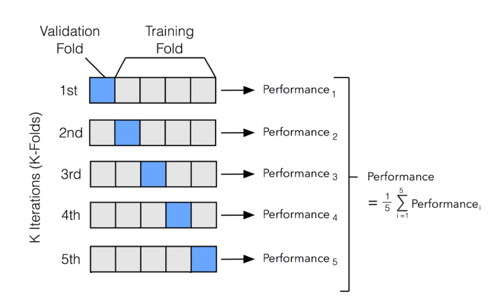

K-fold cross validation 的 python 實作程式碼如下：
#+BEGIN_SRC python -r -n :async :results output :exports both :session boston_housing
import numpy as np

k = 4
num_val_samples = len(train_data) // k
num_epochs = 100
all_scores = []
for i in range(k):
    print('processing fold #', i)
    # Prepare the validation data: data from partition # k
    val_data = train_data[i * num_val_samples: (i + 1) * num_val_samples]
    val_targets = train_targets[i * num_val_samples: (i + 1) * num_val_samples]

    # Prepare the training data: data from all other partitions
    partial_train_data = np.concatenate([train_data[:i * num_val_samples],
         train_data[(i + 1) * num_val_samples:]], axis=0)
    partial_train_targets = np.concatenate([train_targets[:i * num_val_samples],
         train_targets[(i + 1) * num_val_samples:]], axis=0)

    # Build the Keras model (already compiled)
    model = build_model()
    # Train the model (in silent mode, verbose=0)
    model.fit(partial_train_data, partial_train_targets,
              epochs=num_epochs, batch_size=1, verbose=0)
    # Evaluate the model on the validation data
    val_mse, val_mae = model.evaluate(val_data, val_targets, verbose=0)
    all_scores.append(val_mae)
#+END_SRC

#+RESULTS:
: processing fold # 0
: processing fold # 1
: processing fold # 2
: processing fold # 3

*** 查看結果
#+BEGIN_SRC python -r -n :async :results output :exports both :session boston_housing
print(all_scores)
print(np.mean(all_scores))
#+END_SRC

#+RESULTS:
: [2.2767844200134277, 2.619281053543091, 2.72979474067688, 2.562032461166382]
: 2.546973168849945

由上述結果看來，拆成 4 區的驗證分數自 2.28 到 2.73，總平均為 2.54，這個平均值是較為可靠的指標，因為當目標房價的數值很大時，2.28 到 2.73 會變成很大的誤差。

可能是因為 MAC 與 Linux 版本的 Anaconda 相容性問題，或是 Keras 版本差異問題，MAC 版與 Linux 下的 history.history 架構略有差異：
#+BEGIN_SRC python -r -n :async :results output :exports both :session boston_housing
# Linux with Keras 2.2.5
dict_keys(['val_loss', 'val_mean_absolute_error', 'loss', 'mean_absolute_error'])
# Mac with Keras 2.3.1
dict_keys(['val_loss', 'val_mae', 'loss', 'mae'])
#+END_SRC
**** 評估結果視覺化
#+BEGIN_SRC python -r -n :async :results output :exports both :session boston_housing
# Some memory clean-up
k = 4
num_val_samples = len(train_data) // k
num_epochs = 500
all_mae_histories = []
for i in range(k):
    print('processing fold #', i)
    # Prepare the validation data: data from partition # k
    val_data = train_data[i * num_val_samples: (i + 1) * num_val_samples]
    val_targets = train_targets[i * num_val_samples: (i + 1) * num_val_samples]
    # Prepare the training data: data from all other partitions
    partial_train_data = np.concatenate(
        [train_data[:i * num_val_samples],
         train_data[(i + 1) * num_val_samples:]],
        axis=0)
    partial_train_targets = np.concatenate(
        [train_targets[:i * num_val_samples],
         train_targets[(i + 1) * num_val_samples:]],
        axis=0)
    # Build the Keras model (already compiled)
    model = build_model()
    # Train the model (in silent mode, verbose=0)
    history = model.fit(partial_train_data, partial_train_targets,
                        validation_data=(val_data, val_targets),
                        epochs=num_epochs, batch_size=1, verbose=0)
    mae_history = history.history['val_mae']
    all_mae_histories.append(mae_history)

average_mae_history = [np.mean([x[i] for x in all_mae_histories]) for i in range(num_epochs)]

import matplotlib.pyplot as plt
plt.plot(range(1, len(average_mae_history) + 1), average_mae_history)
plt.xlabel('Epochs')
plt.ylabel('Validation MAE')
plt.plot()
plt.savefig("images/Boston-House-Price.png")

# 排除每週期的前10個資料點
def smooth_curve(points, factor=0.9):
  smoothed_points = []
  for point in points:
    if smoothed_points:
      previous = smoothed_points[-1]
      smoothed_points.append(previous * factor + point * (1 - factor))
    else:
      smoothed_points.append(point)
  return smoothed_points

smooth_mae_history = smooth_curve(average_mae_history[10:])
plt.clf()
plt.plot(range(1, len(smooth_mae_history) + 1), smooth_mae_history)
plt.xlabel('Epochs')
plt.ylabel('Validation MAE')
plt.plot()
plt.savefig("images/Boston-House-Price-ex10.png")
#+END_SRC

#+RESULTS:
: processing fold # 0
: processing fold # 1
: processing fold # 2
: processing fold # 3

#+CAPTION: Boston House Price Training MAE
#+LABEL:fig:BostonHouseMAE
#+name: fig:BostonHouseMAE
#+ATTR_LATEX: :width 300
#+ATTR_ORG: :width 300
#+ATTR_HTML: :width 500
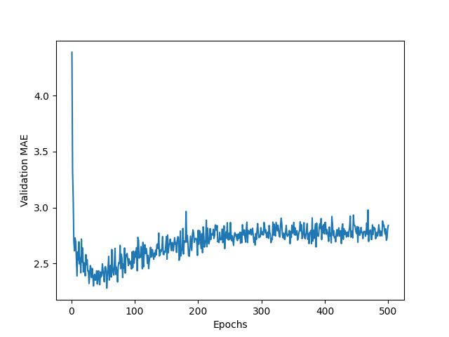

圖[[fig:BostonHouseMAE]]是由每一訓練週期的平均 MAE 分數所繪出的折線圖，由於單位刻度與 y 軸刻度問題，此圖失去了部份重要細節，經由下列方式進行修正：
- 省略前 10 個資料點，
- 把每個資料點替換成前一點的指數移動平均值(exponential moving average, EMA)，讓誤差變平滑。

EMA 常應用於各領域的資料分析中，其核心概念為：現在的資料會被過去的資料所影響，而時間點越近的資料影響越大，反之越小，如股票的漲幅，前 10 年的漲跌與前 10 日的漲跌，自然是後者對未來的影響更大。

EMA 的數學函式如下：
\( E_t = a \times V_t + (1-a) \times E_{t-1} \)，其中
- \(E_t\)為時間點\(t\)的指數移動平均值
- \(a\)為平滑係數，通常介於 0 到 1 之間
- \(V_t\)為時間點\(t\)的原始數值
- \(E_{t-1}\)為時間點\(t-1\)的指數移動平均值

為什麼前例中前 10 筆資料的與其他資料差異如此巨大？我們以前 10 天的資料(一天一筆)來看，第 10 天的 EMA 為：
\( E_{10} = aV_{10} + (1-a)E_9 \)
展開第 9 天的\(E_9\)後
\( E_{10} = aV_{10} + (1-a)[aV_9 + (1-a)E_8] \)
整理後變成
\( E_{10} = a(V_{10} + (1-a)V_9) + (1-a)^{2}E_8 \)
若繼續展開所有天數，將得到
\( E_{10} = a(V_{10} + (1-a)V_9) + (1-a)^{2}E_8+ \dots + (1-a)^{9}V_{1}) + (1-a)^{9}E_1 \)
通常上式的最後一項會因為時間很長而變太小，故可忽略不計，而由此也可看出，\(E_{10}\)的值會被每天的原始資料\((V_{10} \dots V_{1}\))影響，每多一天，原始數值就會多乘(1-a)倍，成指數關係，故時間越久遠的事件，影響越小。

#+CAPTION: Boston House Price Training MAE (排除前 10 個資料點)
#+LABEL:fig:BostonHouseMAE-ex10
#+name: fig:BostonHouseMAE-ex10
#+ATTR_LATEX: :width 300
#+ATTR_ORG: :width 300
#+ATTR_HTML: :width 500
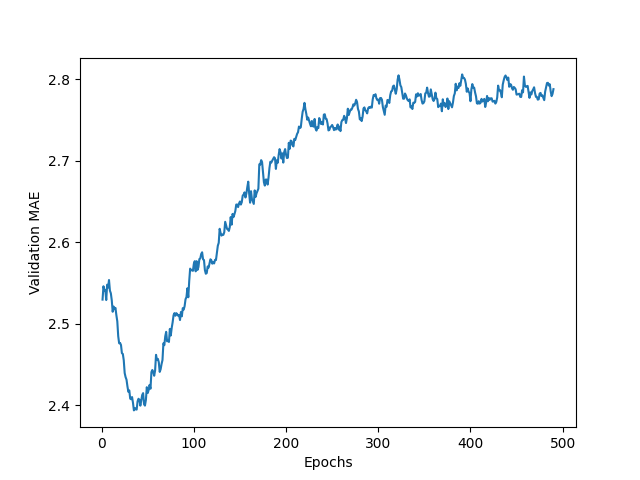

由圖[[fig:BostonHouseMAE-ex10]]是可看出 MAE 在 80 個週期後已停止改善，然後開始往上升，即，過了這點就開始發生過度適配的情況。
*** 小結

由此範例可知：
- 進行迴歸分析時，常以 MSE 做為損失函數、以 MAE 做為評估指標(而非 accuracy).
- 當輸入資料的特徵有不同刻度時，應先將每個特徵進行轉換。
- 當可用資料很少時，使用 K-fold 驗證來評估模式。
- 當可用資料很少時，最好使用隠藏層較少(較淺)的小型神經網路，如一個或兩個，以免產生過渡配適。

** 圖片識別: MNIST
此處以最簡單的 NN (Neural Network) 作為範例。以 Keras 的核心為模型，應用最常使用 Sequential 模型。藉由.add()我們可以一層一層的將神經網路疊起。在每一層之中我們只需要簡單的設定每層的大小(units)與激勵函數(activation function)。需要特別記得的是：第一層要記得寫輸入的向量大小、最後一層的 units 要等於輸出的向量大小。在這邊我們最後一層使用的激活函數(activation function)為 softmax。
*** Import Library
#+BEGIN_SRC python -r -n :results output :exports both :session mnistX :async
from keras.datasets import mnist
from tensorflow.keras.utils import to_categorical
import numpy as np

(x_train, y_train), (x_test, y_test) = mnist.load_data()

# 將訓練集特徵x_train攤平成一維向量
X_train = x_train.reshape(x_train.shape[0], -1)
# 將標籤y_train進行獨熱編碼
Y_train = to_categorical(y_train)

X_test = x_test.reshape(x_test.shape[0], -1)
Y_test = to_categorical(y_test)
#+end_src

#+RESULTS:
*** 建立模型
- Keras的模型有Sequential與Model兩類
- 決定好要設計的模型類別，還要決定模型裡的layer如何叠力，layer有許多選擇，例如[[https://keras.io/api/layers/][Layer]]的種類就有Dense layer, Activation layer, Conv1D layer, Dropout layer.....
- 決定好layer,還要再選activation function，如 relu, sigmoid, softmax.....
- [[https://keras.io/api/layers/activations/][Keras API reference / Layers API / Layer activation functions ]]
#+BEGIN_SRC python -r -n :results output :exports both :session mnistX :async
from keras.models import Sequential
from keras.layers import Dense
from keras.layers import Dropout

model = Sequential()
#將模型疊起
model.add(Dense(input_dim=28*28,units=128,activation='relu'))
model.add(Dense(units=64,activation='relu'))
model.add(Dense(units=10,activation='softmax'))
model.summary()
#+end_src

#+RESULTS:
#+begin_example
/Library/Frameworks/Python.framework/Versions/3.12/lib/python3.12/site-packages/keras/src/layers/core/dense.py:85: UserWarning: Do not pass an `input_shape`/`input_dim` argument to a layer. When using Sequential models, prefer using an `Input(shape)` object as the first layer in the model instead.
  super().__init__(activity_regularizer=activity_regularizer, **kwargs)
Model: "sequential"
┏━━━━━━━━━━━━━━━━━━━━━━━━━━━━━━━━━━━━━━┳━━━━━━━━━━━━━━━━━━━━━━━━━━━━━┳━━━━━━━━━━
┃ Layer (type)                         ┃ Output Shape                ┃         P
┡━━━━━━━━━━━━━━━━━━━━━━━━━━━━━━━━━━━━━━╇━━━━━━━━━━━━━━━━━━━━━━━━━━━━━╇━━━━━━━━━━
│ dense (Dense)                        │ (None, 128)                 │         1
├──────────────────────────────────────┼─────────────────────────────┼──────────
│ dense_1 (Dense)                      │ (None, 64)                  │
├──────────────────────────────────────┼─────────────────────────────┼──────────
│ dense_2 (Dense)                      │ (None, 10)                  │
└──────────────────────────────────────┴─────────────────────────────┴──────────
 Total params: 109,386 (427.29 KB)
 Trainable params: 109,386 (427.29 KB)
 Non-trainable params: 0 (0.00 B)
#+end_example

藉由model.summary()可以簡略輸出模型的大概架構與所使用的參數總數。

此例中叠了三個Dense層，第一層為每張圖的輸入(28*28個點)，有784個神經元(或node)，第二層有64個神經元，這是隱藏層，最後一層有10神經元，分別代表10種數字的可能性。

*** 訓練模型
訓練模型時要決定使用何種loss function、使用何種optimizer，可以到官網([[https://keras.io/api/models/model_training_apis/][Model training APIs]])查看有哪些選項可使用以及何種選項適合哪些類型的資料集與問題。
#+BEGIN_SRC python -r -n :results output :exports both :session mnistX :async

model.compile(loss='categorical_crossentropy',
              optimizer='adam', metrics=['accuracy'])

train_history = model.fit(x=X_train, y=Y_train, validation_split=0.2,
                          epochs=50, batch_size=1000, verbose=2)
#+end_src

#+RESULTS:
#+begin_example
Epoch 1/50
48/48 - 1s - 27ms/step - accuracy: 0.9686 - loss: 0.1297 - val_accuracy: 0.9424 - val_loss: 0.4813
...略...
Epoch 50/50
48/48 - 1s - 12ms/step - accuracy: 0.9961 - loss: 0.0137 - val_accuracy: 0.9631 - val_loss: 0.4587
#+end_example
*** 查看訓練過程
看一下history的結構
#+BEGIN_SRC python -r -n :results output :exports both :session mnistX :async
print(train_history.history.keys())
#+end_src

#+RESULTS:
: dict_keys(['accuracy', 'loss', 'val_accuracy', 'val_loss'])

#+BEGIN_SRC python -r -n :results output :exports both :session mnistX :async
import matplotlib.pyplot as plt
def show_train_history(ylabel,train,test,fn):
    plt.cla()
    plt.plot(train_history.history[train])
    plt.plot(train_history.history[test])
    plt.title('Train History')
    plt.ylabel(ylabel)
    plt.xlabel('Epoch')
    plt.legend(['train', 'test'], loc='center left')
    plt.savefig("images/"+fn, dpi=300)
    ##plt.show()

show_train_history('Accuracy', 'accuracy','val_accuracy','mnist-acc-val.png')
show_train_history('Loss', 'loss','val_loss','mnist-loss-val.png')
#+end_src

#+RESULTS:

訓練完就可以透過accuracy與loss來評估模型的效能，可以粗略看出隨著epoch的增加，精確度也隨之提升、loss則隨之下降。
#+RESULTS:
#+CAPTION: Accuracy
#+LABEL:fig:Labl
#+name: fig:Name
#+ATTR_LATEX: :width 300
#+ATTR_ORG: :width 300
#+ATTR_HTML: :width 500
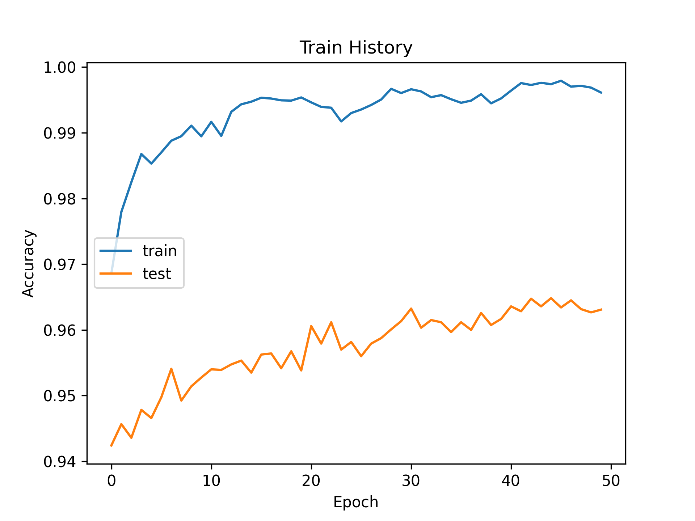

#+CAPTION: Loss
#+LABEL:fig:Labl
#+name: fig:Name
#+ATTR_LATEX: :width 300
#+ATTR_ORG: :width 300
#+ATTR_HTML: :width 500
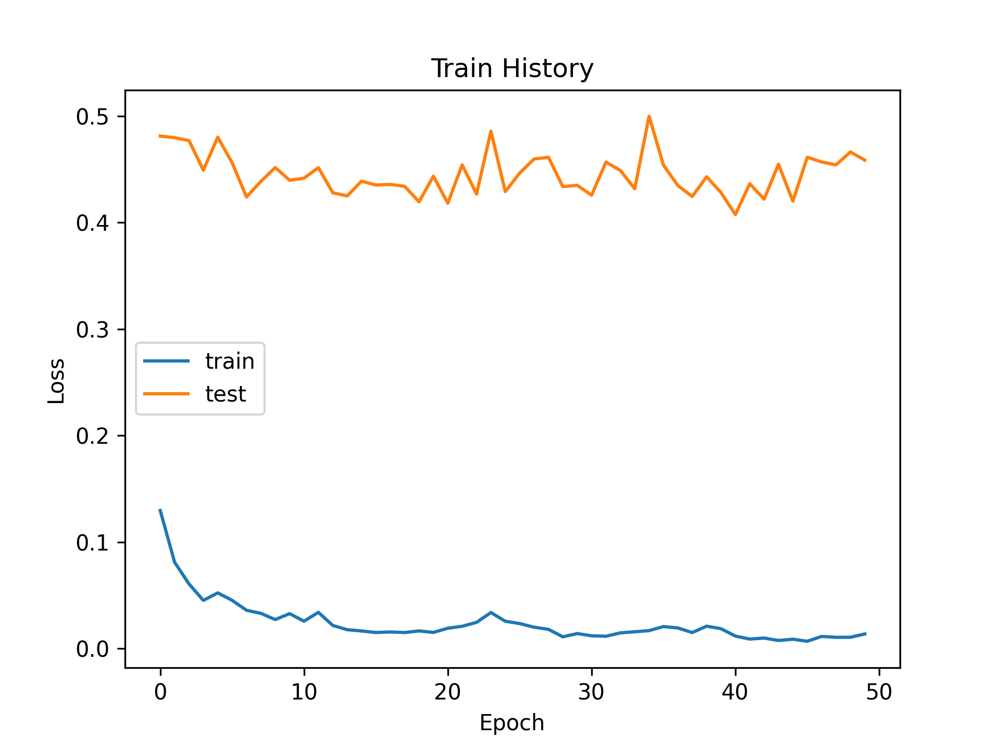
*** 評估模型準確率
#+BEGIN_SRC python -r -n :results output :exports both :session mnistX :async
score = model.evaluate(X_train, Y_train, batch_size = 200)
print ('\nTrain Acc:', score[1])
score = model.evaluate(X_test, Y_test, batch_size = 200)
print ('\nTest Acc:', score[1])
#+end_src

#+RESULTS:
: 300/300 ━━━━━━━━━━━━━━━━━━━━ 1s 1ms/step - accuracy: 0.9955 - loss: 0.0254
:
: Train Acc: 0.9897500276565552
: 50/50 ━━━━━━━━━━━━━━━━━━━━ 0s 1ms/step - accuracy: 0.9575 - loss: 0.5729
:
: Test Acc: 0.9627000093460083
*** 實際預測結果
#+BEGIN_SRC python -r -n :results output :exports both :session mnistX
prediction=model.predict(X_test)
print(prediction.shape)
print(prediction[:2])
#+end_src

#+RESULTS:
: 313/313 ━━━━━━━━━━━━━━━━━━━━ 0s 519us/step
: (10000, 10)
: [[0.0000000e+00 4.8615205e-32 4.4841320e-31 5.9096544e-32 9.9364236e-38
:   5.8718204e-37 0.0000000e+00 1.0000000e+00 0.0000000e+00 3.7505548e-29]
:  [1.0376822e-33 4.1142359e-27 1.0000000e+00 6.7152534e-21 0.0000000e+00
:   0.0000000e+00 0.0000000e+00 0.0000000e+00 1.6477517e-24 0.0000000e+00]]

#+BEGIN_SRC python -r -n :results output :exports both :session mnistX :async
import matplotlib.pyplot as plt
import numpy as np
def oneHotDecode(number):
    return np.argmax(number)
def plot_images_labels_prediction(images, labels, prediction, num, fn):
    plt.cla()
    fig = plt.gcf()

    fig.set_size_inches(10, 14)

    idx = 0
    for i in range(0, num):
        ax=plt.subplot(5, 5, 1+i)
        ax.imshow(images[idx].reshape(28, 28), cmap='binary')

        ax.set_title("label=" +str(oneHotDecode(labels[idx]))+
                     ",\npredict="+str(np.argmax(prediction[idx]))
                     ,fontsize=10)
        idx+=1
    plt.savefig("images/"+fn, dpi=300, bbox_inches='tight',pad_inches = 0.2)
plot_images_labels_prediction(x_test, y_test, prediction, 20, 'mnist-predic-perf.png')

#+end_src

#+RESULTS:

最後輸出測試資料集的前20筆資料的圖、label以及預測結果
#+RESULTS:
#+CAPTION: 前20筆測試集預測結果
#+LABEL:fig:Labl
#+name: fig:Name
#+ATTR_LATEX: :width 500
#+ATTR_ORG: :width 500
#+ATTR_HTML: :width 500
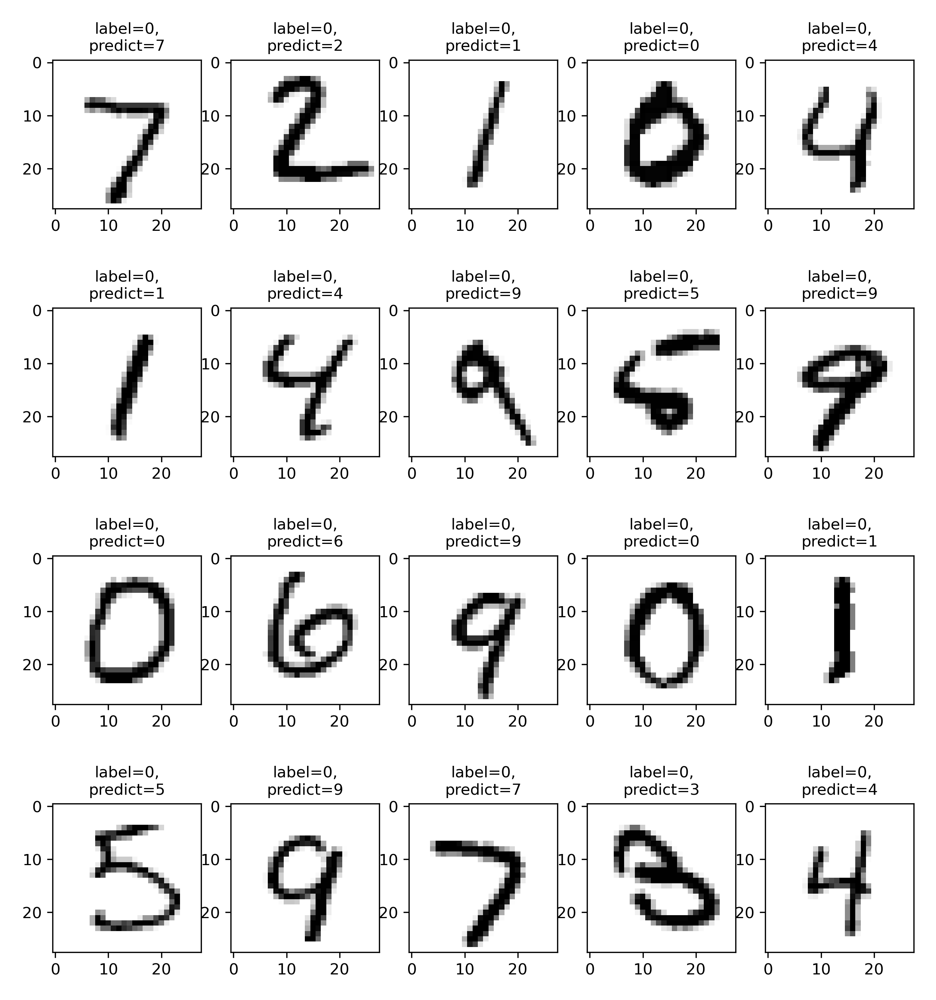

** 圖片識別版本2: MNIST
*** 另一版本
#+BEGIN_SRC python -r -n :results output :exports both :noeval
# 載入資料
from keras.datasets import mnist
from tensorflow.keras.utils import to_categorical

def load_data():
    # 載入minst的資料
    (x_train, y_train), (x_test, y_test) = mnist.load_data()
    # 將圖片轉換為一個60000*784的向量，並且標準化
    x_train = x_train.reshape(x_train.shape[0], 28*28)
    x_test = x_test.reshape(x_test.shape[0], 28*28)
    x_train = x_train.astype('float32')
    x_test = x_test.astype('float32')
    x_train = x_train/255
    x_test = x_test/255
    # 將y轉換成one-hot encoding
    y_train = to_categorical(y_train, 10)
    y_test = to_categorical(y_test, 10)
    # 回傳處理完的資料
    return (x_train, y_train), (x_test, y_test)

import numpy as np
from keras import layers
from keras import models

def build_model():#建立模型
    model = models.Sequential()
    #將模型疊起
    model.add(layers.Dense(input_dim=28*28,units=128,activation='relu'))
    model.add(layers.Dense(units=64,activation='relu'))
    model.add(layers.Dense(units=10,activation='softmax'))
    model.summary()
    return model

# 開始訓練模型，此處使用了Adam做為我們的優化器，loss function選用了categorical_crossentropy。
(x_train,y_train),(x_test,y_test)=load_data()
model = build_model()
#開始訓練模型
model.compile(loss='categorical_crossentropy',optimizer="adam",metrics=['accuracy'])
model.fit(x_train, y_train, batch_size=100, epochs=5, verbose=0)
#顯示訓練結果
score = model.evaluate(x_train, y_train)
print ('\nTrain Acc:', score[1])
score = model.evaluate(x_test,y_test)
print ('\nTest Acc:', score[1])

### 進行預測
prediction = model.predict(x_test)
print(prediction[:10])

import pandas as pd
# 将预测结果转换为类别标签
predicted_labels = np.argmax(prediction, axis=1)
# 将真实标签转换为类别标签
true_labels = np.argmax(y_test, axis=1)

p = pd.crosstab(true_labels, predicted_labels, rownames=['label'], colnames=['predict'])
print(p)

#+END_SRC

#+RESULTS:
#+begin_example
Model: "sequential"
┏━━━━━━━━━━━━━━━━━━━━━━━━━━━━━━━━━┳━━━━━━━━━━━━━━━━━━━━━━━━┳━━━━━━━━━━━━━━━┓
┃ Layer (type)                    ┃ Output Shape           ┃       Param # ┃
┡━━━━━━━━━━━━━━━━━━━━━━━━━━━━━━━━━╇━━━━━━━━━━━━━━━━━━━━━━━━╇━━━━━━━━━━━━━━━┩
│ dense (Dense)                   │ (None, 128)            │       100,480 │
├─────────────────────────────────┼────────────────────────┼───────────────┤
│ dense_1 (Dense)                 │ (None, 64)             │         8,256 │
├─────────────────────────────────┼────────────────────────┼───────────────┤
│ dense_2 (Dense)                 │ (None, 10)             │           650 │
└─────────────────────────────────┴────────────────────────┴───────────────┘
 Total params: 109,386 (427.29 KB)
 Trainable params: 109,386 (427.29 KB)
 Non-trainable params: 0 (0.00 B)

   1/1875 ━━━━━━━━━━━━━━━━━━━━ 1:11 38ms/step - accuracy: 1.0000 - loss: 0.0060
 119/1875 ━━━━━━━━━━━━━━━━━━━━ 0s 426us/step - accuracy: 0.9900 - loss: 0.0408 
 266/1875 ━━━━━━━━━━━━━━━━━━━━ 0s 379us/step - accuracy: 0.9910 - loss: 0.0376
 406/1875 ━━━━━━━━━━━━━━━━━━━━ 0s 372us/step - accuracy: 0.9909 - loss: 0.0371
 553/1875 ━━━━━━━━━━━━━━━━━━━━ 0s 364us/step - accuracy: 0.9909 - loss: 0.0365
 691/1875 ━━━━━━━━━━━━━━━━━━━━ 0s 364us/step - accuracy: 0.9908 - loss: 0.0361
 838/1875 ━━━━━━━━━━━━━━━━━━━━ 0s 360us/step - accuracy: 0.9907 - loss: 0.0359
 975/1875 ━━━━━━━━━━━━━━━━━━━━ 0s 361us/step - accuracy: 0.9906 - loss: 0.0358
1115/1875 ━━━━━━━━━━━━━━━━━━━━ 0s 360us/step - accuracy: 0.9904 - loss: 0.0358
1261/1875 ━━━━━━━━━━━━━━━━━━━━ 0s 358us/step - accuracy: 0.9903 - loss: 0.0358
1410/1875 ━━━━━━━━━━━━━━━━━━━━ 0s 356us/step - accuracy: 0.9903 - loss: 0.0358
1554/1875 ━━━━━━━━━━━━━━━━━━━━ 0s 355us/step - accuracy: 0.9902 - loss: 0.0359
1686/1875 ━━━━━━━━━━━━━━━━━━━━ 0s 357us/step - accuracy: 0.9901 - loss: 0.0360
1801/1875 ━━━━━━━━━━━━━━━━━━━━ 0s 362us/step - accuracy: 0.9900 - loss: 0.0361
1875/1875 ━━━━━━━━━━━━━━━━━━━━ 1s 364us/step - accuracy: 0.9900 - loss: 0.0361

Train Acc: 0.9893333315849304

  1/313 ━━━━━━━━━━━━━━━━━━━━ 14s 45ms/step - accuracy: 1.0000 - loss: 0.0102
144/313 ━━━━━━━━━━━━━━━━━━━━ 0s 350us/step - accuracy: 0.9736 - loss: 0.0826
279/313 ━━━━━━━━━━━━━━━━━━━━ 0s 361us/step - accuracy: 0.9729 - loss: 0.0823
313/313 ━━━━━━━━━━━━━━━━━━━━ 0s 359us/step - accuracy: 0.9733 - loss: 0.0810

Test Acc: 0.9764999747276306

  1/313 ━━━━━━━━━━━━━━━━━━━━ 5s 17ms/step
139/313 ━━━━━━━━━━━━━━━━━━━━ 0s 364us/step
288/313 ━━━━━━━━━━━━━━━━━━━━ 0s 350us/step
313/313 ━━━━━━━━━━━━━━━━━━━━ 0s 378us/step
[[1.58942123e-06 4.56630090e-07 1.44183810e-04 7.96658918e-04
  4.83289035e-08 5.57914291e-07 8.43276837e-12 9.98949349e-01
  7.18311139e-06 9.99482872e-05]
 [9.20066245e-11 8.16951651e-05 9.99909282e-01 7.55548444e-06
  9.96026872e-11 2.12249276e-07 8.12293024e-08 3.26049777e-11
  1.17174454e-06 2.21182258e-14]
 [1.82215524e-06 9.96792972e-01 3.96484742e-04 1.60194541e-04
  1.02035912e-04 1.21604295e-04 6.79323348e-05 8.09717865e-04
  1.49104348e-03 5.62478417e-05]
 [9.99915719e-01 5.35815747e-09 4.51234046e-05 5.88590240e-07
  1.43257850e-07 3.82396547e-06 1.11071859e-05 1.55277394e-06
  2.66697526e-08 2.18579280e-05]
 [4.33285859e-05 1.10104907e-06 1.34856982e-05 1.56399324e-06
  9.93066788e-01 4.01588704e-06 4.50718362e-05 1.48709762e-04
  9.48531579e-06 6.66645123e-03]
 [6.66389894e-08 9.97991085e-01 3.08640438e-06 4.88619798e-06
  1.13685437e-05 2.65808126e-07 6.75553053e-08 1.93838566e-03
  2.31987287e-05 2.76108785e-05]
 [7.66120678e-08 4.94036567e-06 2.84373783e-07 6.58262920e-08
  9.98910308e-01 1.59385650e-06 7.10860562e-08 8.05889431e-06
  4.70556435e-04 6.04005065e-04]
 [6.92483184e-07 7.98684960e-06 4.36144364e-05 3.25308600e-03
  4.72561878e-05 9.02633201e-06 8.00792588e-09 1.29608334e-05
  2.07478279e-05 9.96604562e-01]
 [1.25154367e-08 2.27490159e-06 1.40500115e-03 6.09770814e-06
  4.96629109e-05 8.98099899e-01 9.85215753e-02 2.18058993e-08
  1.91533507e-03 1.61481594e-07]
 [6.98578688e-08 2.19913043e-09 5.58190187e-08 9.24819687e-06
  1.30430009e-04 7.13636261e-09 4.16892909e-12 4.35012007e-05
  2.02734009e-06 9.99814689e-01]]
predict    0     1     2    3    4    5    6     7    8    9
label
0        960     0     6    0    2    0    7     1    4    0
1          0  1128     3    0    0    0    1     0    3    0
2          2     4  1015    2    1    0    1     4    2    1
3          0     0    11  979    0    9    0     4    2    5
4          0     1     1    0  955    0    6     4    2   13
5          2     0     0   14    1  860    4     1    7    3
6          3     3     2    1    1    3  942     1    2    0
7          0     4     7    1    1    0    0  1004    0   11
8          5     1     4    7    3    2    3     5  938    6
9          3     2     2    6    6    1    2     3    0  984
#+end_example

* Footnotes

[fn:1][[https://kknews.cc/zh-tw/tech/b4zkbom.html][主流的深度學習模型有哪些？]]

[fn:2] [[https://medium.com/nerd-for-tech/vgg-16-easiest-explanation-12453b599526][VGG 16 Easiest Explanation]]

[fn:3] [[https://towardsdatascience.com/extract-features-visualize-filters-and-feature-maps-in-vgg16-and-vgg19-cnn-models-d2da6333edd0][Extract Features, Visualize Filters and Feature Maps in VGG16 and VGG19 CNN Models]]

[fn:4] [[https://medium.com/image-processing-and-ml-note/inception-v1-googlenet-winner-of-ilsvrc-2014-image-classification-15b1ea62cc11][Inception-v1 (GoogLeNet) — Winner of ILSVRC 2014 (Image Classification)]]

[fn:5] [[https://medium.com/ai-blog-tw/deep-learning-residual-leaning-%E8%AA%8D%E8%AD%98resnet%E8%88%87%E4%BB%96%E7%9A%84%E5%86%A0%E5%90%8D%E5%BE%8C%E7%B9%BC%E8%80%85resnext-resnest-6bedf9389ce][Residual Leaning: 認識ResNet與他的冠名後繼者ResNeXt、ResNeSt]]

[fn:6][[https://medium.com/@rossleecooloh/%E7%9B%B4%E8%A7%80%E7%90%86%E8%A7%A3resnet-%E7%B0%A1%E4%BB%8B-%E8%A7%80%E5%BF%B5%E5%8F%8A%E5%AF%A6%E4%BD%9C-python-keras-8d1e2e057de2][直觀理解ResNet —簡介、 觀念及實作(Python Keras)]]

[fn:7] [[https://arxiv.org/pdf/1512.03385.pdf][Deep Residual Learning for Image Recognition]]

[fn:8] [[http://tkdbooks.com/PC14110][台科大資訊科技]]

[fn:9] [[https://www.baeldung.com/cs/cost-vs-loss-vs-objective-function][Difference Between the Cost, Loss, and the Objective Function]]

[fn:18][[https://morvanzhou.github.io/tutorials/machine-learning/ML-intro/3-09-l1l2regularization/][L1 / L2 正規化]]

[fn:17][[https://ithelp.ithome.com.tw/articles/10219648?sc=rss.iron][Google ML課程筆記 - Overfitting 與 L1 /L2 Regularization ]]

[fn:16][[https://www.itread01.com/content/1549579879.html][機器學習十大演算法---8. 隨機森林演算法]]

[fn:15][[https://medium.com/@chih.sheng.huang821/%E6%A9%9F%E5%99%A8-%E7%B5%B1%E8%A8%88%E5%AD%B8%E7%BF%92-%E4%B8%BB%E6%88%90%E5%88%86%E5%88%86%E6%9E%90-principle-component-analysis-pca-58229cd26e71][機器/統計學習:主成分分析(Principal Component Analysis, PCA)]]

[fn:14][[https://blog.csdn.net/dongyanwen6036/article/details/78311071][LDA與PCA都是常用的降維方法，二者的區別]]

[fn:13][[https://keras-cn.readthedocs.io/en/latest/models/model/][函數式模型接口]]

[fn:12][[https://keras.io/zh/getting-started/sequential-model-guide/][Sequential 順序模型指引]]

[fn:11][[https://medium.com/yiyi-network/transfer-learning-1f87d4f1886f][Kaggle Learn | Deep Learning 深度學習 | 學習資源介紹 (Part 2)]]

[fn:10] Goodfello, Ian J., Oriol Vinyals & Andrew M. Saxe, Qualitatively characterizing neural ntwork optimization problems, arXiv preprint arXiv: 1412.6544 (2014).
