:PROPERTIES:
:ID:       20221023T101228.247381
:ROAM_ALIASES: Deep-Learning
:END:
#+title: 深度學習
#+AUTHOR: 顏永進
# -*- org-export-babel-evaluate: nil -*-
#+INCLUDE: ../pdf.org
#+PROPERTY: header-args :python :python "/Users/letranger/Dropbox/notes/roam/venv/bin/python3" :eval never-export
#+TAGS: AI, Python
#+EXCLUDE_TAGS: noexport
#+OPTIONS: toc:2 ^:nil num:5
#+OPTIONS: H:4
#+LATEX:\newpage
#+HTML_HEAD: <link rel="stylesheet" type="text/css" href="../css/muse.css" />
#+HTML_HEAD_EXTRA: 
#+begin_export html

#+end_export
* 為此 org 啟用 venv :noexport:
#+begin_src shell -r -n :results output :exports none
python3 -m venv ./venv
source ./venv/bin/activate
echo $VIRTUAL_ENV
ls venv

python3 -m pip install -U matplotlib
python3 -m pip install -U ace_tools
python3 -m pip install -U seaborn
python3 -m pip install -U statsmodels
#+end_src

#+begin_src shell -r -n :results output :exports none
python3 -m pip install -U scikeras
#+end_src

#+RESULTS:
#+begin_example
Collecting scikeras
  Downloading scikeras-0.13.0-py3-none-any.whl.metadata (3.1 kB)
Requirement already satisfied: keras>=3.2.0 in ./venv/lib/python3.12/site-packages (from scikeras) (3.8.0)
Requirement already satisfied: scikit-learn>=1.4.2 in ./venv/lib/python3.12/site-packages (from scikeras) (1.5.2)
Requirement already satisfied: absl-py in ./venv/lib/python3.12/site-packages (from keras>=3.2.0->scikeras) (2.1.0)
Requirement already satisfied: numpy in ./venv/lib/python3.12/site-packages (from keras>=3.2.0->scikeras) (1.26.4)
Requirement already satisfied: rich in ./venv/lib/python3.12/site-packages (from keras>=3.2.0->scikeras) (13.7.1)
Requirement already satisfied: namex in ./venv/lib/python3.12/site-packages (from keras>=3.2.0->scikeras) (0.0.8)
Requirement already satisfied: h5py in ./venv/lib/python3.12/site-packages (from keras>=3.2.0->scikeras) (3.13.0)
Requirement already satisfied: optree in ./venv/lib/python3.12/site-packages (from keras>=3.2.0->scikeras) (0.14.0)
Requirement already satisfied: ml-dtypes in ./venv/lib/python3.12/site-packages (from keras>=3.2.0->scikeras) (0.4.1)
Requirement already satisfied: packaging in ./venv/lib/python3.12/site-packages (from keras>=3.2.0->scikeras) (24.1)
Requirement already satisfied: scipy>=1.6.0 in ./venv/lib/python3.12/site-packages (from scikit-learn>=1.4.2->scikeras) (1.13.1)
Requirement already satisfied: joblib>=1.2.0 in ./venv/lib/python3.12/site-packages (from scikit-learn>=1.4.2->scikeras) (1.4.2)
Requirement already satisfied: threadpoolctl>=3.1.0 in ./venv/lib/python3.12/site-packages (from scikit-learn>=1.4.2->scikeras) (3.5.0)
Requirement already satisfied: typing-extensions>=4.5.0 in ./venv/lib/python3.12/site-packages (from optree->keras>=3.2.0->scikeras) (4.12.2)
Requirement already satisfied: markdown-it-py>=2.2.0 in ./venv/lib/python3.12/site-packages (from rich->keras>=3.2.0->scikeras) (3.0.0)
Requirement already satisfied: pygments<3.0.0,>=2.13.0 in ./venv/lib/python3.12/site-packages (from rich->keras>=3.2.0->scikeras) (2.18.0)
Requirement already satisfied: mdurl~=0.1 in ./venv/lib/python3.12/site-packages (from markdown-it-py>=2.2.0->rich->keras>=3.2.0->scikeras) (0.1.2)
Downloading scikeras-0.13.0-py3-none-any.whl (26 kB)
Installing collected packages: scikeras
Successfully installed scikeras-0.13.0
#+end_example

#+BEGIN_SRC emacs-lisp :exports none
(pyvenv-activate "./venv")
(setq org-babel-python-command "./venv/bin/python3")
#+END_SRC

#+RESULTS:
: ./venv/bin/python3

* 深度學習
#+CAPTION: AI, Machine Learning與Deep Learning
#+LABEL:fig:AI-ML-DL
#+name: fig:AI-ML-DL
#+ATTR_LATEX: :width 300
#+ATTR_ORG: :width 300
#+ATTR_HTML: :width 500
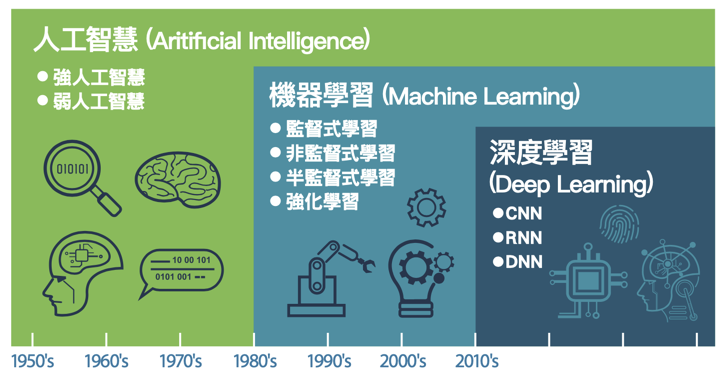

在[[id:d6daa102-05bb-475d-b619-db8b61e86030][神經網路]]中我們曾經提及：
#+begin_quote
深度神經網路(Deep Neural Network, DNN)，顧名思義就是有很多層的神經網路。然而，幾層才算是多呢？一般來說有1-2個隱藏層的神經網絡就可以叫做多層，準確的說是(淺層)神經網絡(Shallow Neural Networks)。隨著隱藏層的增多，更深的神經網絡(一般來說超過3層)就都叫做深度神經網路[fn:1]。而那些以深度神經網路為模型的機器學習就是我們耳熟能詳的[[id:20221023T101228.247381][深度學習]]。
#+end_quote

那麼幾層才算是夠深呢？實際上，「深度」只是一個商業概念，很多時候工業界把3層隱藏層也叫做「深度學習」，在機器學習領域的約定俗成是，名字中有深度(Deep)的網絡僅代表其有超過5-7層的隱藏層[fn:1]。

典型的深度學習如圖[[fig:python-deep-learning-1]]，在此例中，輸入為一張手寫數字的影像，經由 4 層的深度學習模型後得知此數字為 4。

#+CAPTION: 典型的深度神經網路-1
#+LABEL:fig:python-deep-learning-1
#+name: fig:python-deep-learning-1
#+ATTR_LATEX: :width 400
#+ATTR_ORG: :width 400
#+ATTR_HTML: :width 500
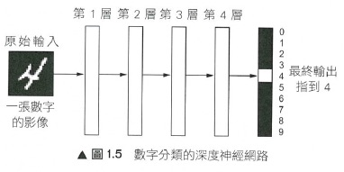

圖[[fig:python-deep-learning-2]]進一步說明網路模型中每一層的作用，可以將每一層網路視為對影像的特殊運算，如此一層一層逐一精煉(purified)，最後得到結果。

#+CAPTION: 典型的深度神經網路-2
#+LABEL:fig:python-deep-learning-2
#+name: fig:python-deep-learning-2
#+ATTR_LATEX: :width 400
#+ATTR_ORG: :width 400
#+ATTR_HTML: :width 500
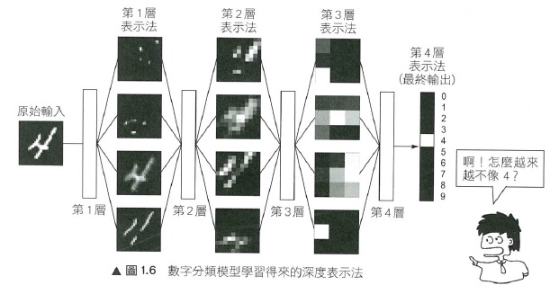

關於增加層數的重要性，目前還缺乏理論佐證，但從過往的研究或實驗中，有幾點可以說明。
1. 在 ILSVRC 這種大型視覺辨識競賽結果中，加深層數的比例多與辨識效能成正比。
2. 加深層數可以在減少網路參數的狀況下得到相同成效，透過重疊層級，可以讓 ReLU 等活化函數夾在卷積層之間，進一步提高網路的表現力，因為透過活化函數，可以在網路增加「非線性」的能力，重疊非線性函數，也能達到更複雜的表現力。
3. 學習的效率也是加深層數的優點之一，卷積層的神經元會反應出邊界等單純形狀，隨著層數增加，可以反應出紋理、物體部位等特質，依照階層逐漸變複雜。
4. 以辨識「狗」為例子，如果要以層數較少的網路來解決這個問題，卷積層就要一次「理解」眾多特徵，還要因應不同拍攝環境帶來的變化，一次處理這些龐大的資料會花費許多學習時間； 如果加深層數，就能用階層分解必須學習的問題，每一層可以處理單純的問題，例如，最初的層級可以只學習邊界，利用少量的學習資料來進行效率化的學習。
5. 加深層數可以階層性的傳遞資料，例如，擷取出邊界的下一層會使用邊界資料來學習更高階的問題（如判斷形狀）。

** 深度學習的知名模型
幾個知名的深度學習模型如下：
*** VGG
VGG 為由卷積層與池化層構成的基本 CNN。特色是含權重層（卷積層及全連接層）共 16-19 層，有時會稱為 VGG16[fn:2] 或 VGG19[fn:3]。VGG 由於結構非常簡單，應用性高，所以多數技術人員喜歡使用以 VGG 為最基礎的網路。

#+CAPTION: VGG-16
#+LABEL:fig:VGG16
#+name: fig:VGG16
#+ATTR_LATEX: :width 300
#+ATTR_ORG: :width 300
#+ATTR_HTML: :width 500
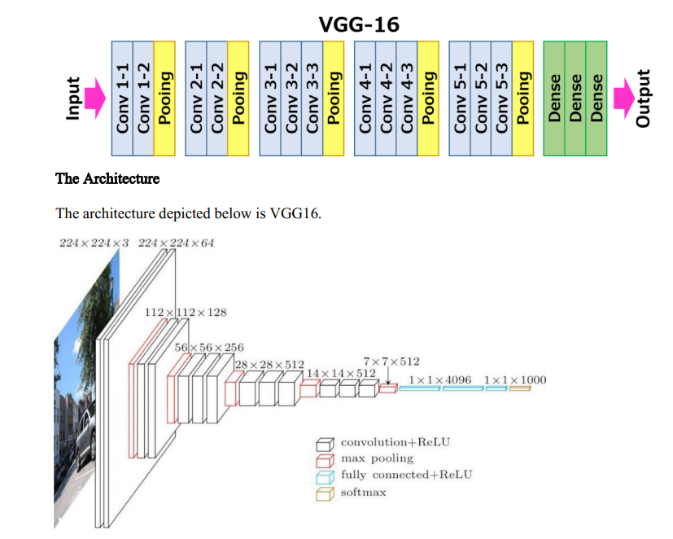

#+CAPTION: VGG-19
#+LABEL:fig:VGG19
#+name: fig:VGG19
#+ATTR_LATEX: :width 300
#+ATTR_ORG: :width 300
#+ATTR_HTML: :width 500
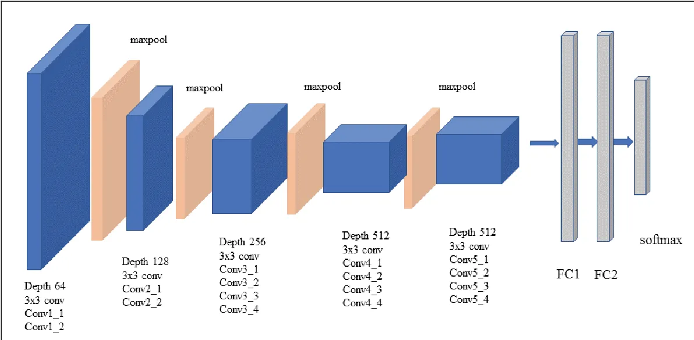
*** GoogLeNet
GoogLeNet[fn:4]為2014 年 ILSVRC (ImageNet Large Scale Visual Recognition Competition)圖像分類競賽的冠軍得主，與 VGGNet（該年的亞軍）相比具有相對較低的錯誤率。GoogLeNet基本上與 CNN 相同，其特色是不僅會往垂直方向加深網路，也會往水平方向加深。GoogLeNet 往水平方向的做法稱為「Inception 結構」。
#+CAPTION: GoogLeNet
#+LABEL:fig:GoogLeNet
#+name: fig:GoogLeNet
#+ATTR_LATEX: :width 300
#+ATTR_ORG: :width 300
#+ATTR_HTML: :width 700
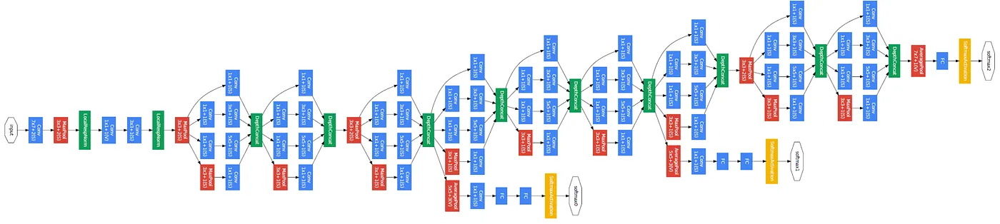
*** ResNet
ResNet[fn:5]是由 Microsoft 團隊開發的網路，特色是具有能加深比過去更多層的「結構」，為了解決因加深過多層數無法順利學習的問題，ResNet 導入了「跳躍結構」（也稱為捷徑或分流）。跳躍結構是「直接」傳遞輸入資料，所以在反向傳播時，也會將上層的梯度「直接」傳遞給下層。透過這種跳躍結構，不用擔心梯度變小（或變得太大），可以把「具有意義的梯度」傳遞給上層。因此，跳躍結構能減少之前因為加深層數，使得梯度變小，出現梯度消失的問題。
#+CAPTION: ResNet
#+LABEL:fig:ResNet
#+name: fig:ResNet
#+ATTR_LATEX: :width 300
#+ATTR_ORG: :width 300
#+ATTR_HTML: :width 700
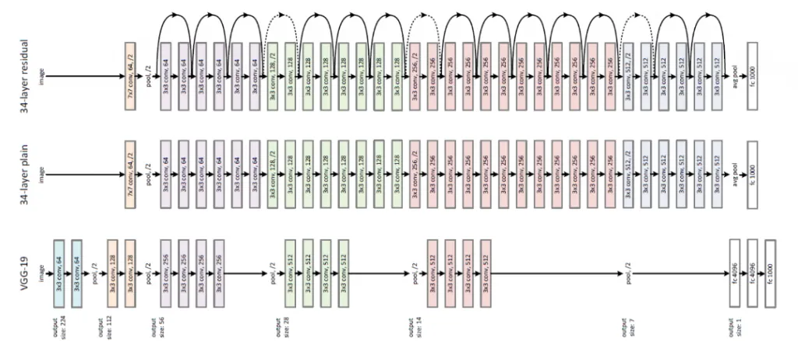
*** ImageNet大賽
從下圖可觀察到，網路的層數從2014年GoogLeNet的22層爆增到2015年ResNet的152層，足足多了130層。這個結果證實了越深的網路，在沒有Overfitting的情況下，效果是越好的[fn:6]。
#+CAPTION: ImageNet歷年冠軍
#+LABEL:fig:ImageNet-champs
#+name: fig:ImageNet-champs
#+ATTR_LATEX: :width 300
#+ATTR_ORG: :width 300
#+ATTR_HTML: :width 500
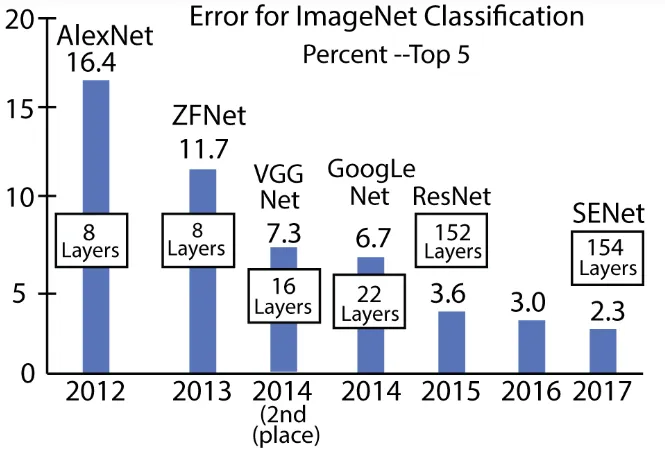

那麼...如果想要提升模型的效果，是不是加越多網路層，使網路越深就可以了呢？底下這個研究結果可以給我們一點啟發：

#+CAPTION: DNN層數與誤差的實驗
#+LABEL:fig:DNN-depth-error
#+name: fig:DNN-depth-error
#+ATTR_LATEX: :width 300
#+ATTR_ORG: :width 300
#+ATTR_HTML: :width 500
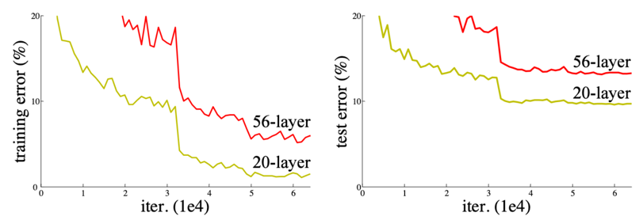

這是為2016年IEEE Conference on Computer Vision and Pattern Recognition的一篇研究結果[fn:7]，實驗結果顯示一般深度網路層數越多，訓練誤差不降反增。

*** 後續發展
在 ResNet 之後，深度學習模型的架構仍持續演進：

- *EfficientNet* (2019)：Google 提出的模型，透過「複合縮放」(compound scaling) 方法，同時調整網路的深度、寬度和解析度，以更少的參數達到更高的準確率。EfficientNet-B7 在 ImageNet 上以 66M 參數達到 84.3% top-1 準確率，遠優於先前需要更多參數的模型。
- *Vision Transformer (ViT)* (2020)：Google 將原本用於自然語言處理的 Transformer 架構應用於影像辨識，將影像切割成小區塊（patches）後，以類似處理文字序列的方式進行分類。ViT 證明了在足夠大的資料集上，Transformer 可以超越傳統 CNN 的表現，開啟了電腦視覺領域的新典範。
- *ConvNeXt* (2022)：Meta 提出的純 CNN 架構，借鑑了 Transformer 的設計理念（如更大的卷積核、Layer Normalization），證明經過現代化改良的 CNN 仍能與 Transformer 匹敵。

*** Transformer
Transformer 是 2017 年由 Google 團隊在論文《Attention Is All You Need》中提出的架構，是近年來深度學習領域最具影響力的突破。

**** 核心概念：自注意力機制 (Self-Attention)
傳統的序列模型（如 RNN、LSTM）是逐步處理輸入序列的每個元素，因此難以平行化且不易捕捉長距離依賴關係。Transformer 完全捨棄了遞迴結構，改用「自注意力機制」(Self-Attention Mechanism) 來計算序列中每個元素與其他所有元素之間的關聯程度。

自注意力的核心運算包含三個向量：
- *Query (Q)* ：代表「我在找什麼」
- *Key (K)* ：代表「我有什麼」
- *Value (V)* ：代表「我提供什麼資訊」

其公式為：
\[ \text{Attention}(Q, K, V) = \text{softmax}\left(\frac{QK^T}{\sqrt{d_k}}\right)V \]

其中 \(d_k\) 為 Key 向量的維度，除以 \(\sqrt{d_k}\) 是為了避免內積值過大導致 softmax 梯度消失。

**** 編碼器-解碼器架構
Transformer 由編碼器（Encoder）和解碼器（Decoder）兩部分組成：
- *編碼器* ：負責理解輸入序列，由多層自注意力層和前饋神經網路堆疊而成
- *解碼器* ：負責生成輸出序列，除了自注意力外還加入了「交叉注意力」(Cross-Attention)，用來關注編碼器的輸出

後續的模型通常只使用其中一部分：
- 僅編碼器：BERT（用於文本理解、分類）
- 僅解碼器：GPT 系列（用於文本生成）
- 編碼器-解碼器：T5、BART（用於翻譯、摘要）

**** 為什麼 Transformer 如此重要
1. *平行化運算* ：不像 RNN 需要逐步計算，Transformer 可以同時處理整個序列，大幅提升訓練速度
2. *長距離依賴* ：自注意力機制讓模型能直接關注序列中任意位置的元素，不會像 RNN 那樣隨距離增加而遺忘
3. *可擴展性* ：Transformer 的效能隨模型大小和資料量的增加而持續提升，這個特性催生了「大型語言模型」(LLM) 的發展
4. *跨領域應用* ：除了自然語言處理，Transformer 也被成功應用於電腦視覺 (ViT)、語音辨識、蛋白質結構預測 (AlphaFold) 等領域

** 深度學習的高速化
由於大資料(big data)與大型網路的關係，使得深度學習必須進行大量運算，過去我們使用 CPU 來進行運算，如今多數深度學習的框架多支援 GPU，甚至支援以多個 GPU 與多台裝置進行分散式學習。GPU 原本是圖形專用處理器，可以快速處理平行運算，GPU 運算的目標是把其強大的效能運用在各種用途。比較 CPU 與 GPU 在 AlexNet 的學習，CPU 需花費 40 天以上，GPU 則可以在 6 天內完成。

利用 GPU 除了可以大幅提升深度學習的運算速度，但是一旦變成多層網路時，就需要花費數天或數週的時間來學習，Google 的 TensorFlow、Microsoft 的 CNTK 便是針對分散式學習來開發的，100 個分散式的 GPU 可以提升比單一 GPU 高到 56 倍的速度，意味著原本要花好幾天才能完成的學習，只要 3 小時就可以結束。

在深度學習的高速化過程中，包含運算量在內，記憶體容量、匯流排頻寬等，都會造成瓶頸，就記憶體容量來說，必須考慮到大量權重參數及中間資料會儲存在記憶體的情況。至於匯流排頻寬，一旦通過 GPU(或 CPU)的匯流排資料超過一定的限制，該處就會形成瓶頸，所以，最好能儘量減少通過網路的資料位元數。
*** GPU v.s. CPU
#+CAPTION: CPU 與 GPU 在架構上的設計差異
#+LABEL:fig:CPUGPU
#+name: fig:CPUGPU
#+ATTR_LATEX: :width 300
#+ATTR_ORG: :width 300
#+ATTR_HTML: :width 500

如圖[[fig:CPUGPU]]，CPU 和 GPU 的差異起源於其相異的設計目標與應用場景， CPU的設計目的是處理各種不同的資料運算、邏輯判斷和中斷要求;而 GPU 的設計目的則是為了圖形運算， 其優勢在於能快速對同類型的資料進行平行運算[fn:8]。二者主要差異大致如下：
- CPU 是由幾個每次可處理數個獨立「執行緒」(threads)的核心(core)所組成；GPU 則有數百個這樣的核心，同時可以處理上千個執行緒
- CPU 主要是線性執行； GPU 則是個高度平行化的單元
- CPU 的發展主要致力於最佳化系統的遲滯時間，讓系統能有迅速流暢的反應；GPU 的發展則是朝頻寬最佳化努力。在深度神經網路中，頻寬為主要的系統瓶頸
- GPU 的 Level 1 cache 比 CPU 快且大，在深度神經網路中，大部份的資料都會再次被使用到

** 深度學習應用領域

深度學習到底能幹嘛？答案是：幾乎什麼都能幹。以下是幾個你可能每天都在用、但沒意識到背後是深度學習在撐腰的應用。

*** 看圖說故事：電腦視覺

電腦視覺是深度學習最早大放異彩的領域。簡單來說，就是讓電腦「看懂」圖片和影片。

**** 影像辨識
你的手機相簿能自動把同一個人的照片歸在一起、Google 相簿搜尋「海邊」就能找出所有海邊照片——這些都是深度學習在背後默默工作。核心技術是[[id:20221023T101414.457264][卷積神經網路（CNN）]]，它模仿人類視覺皮層的運作方式，一層一層地從影像中提取特徵：先看到邊緣、再看到紋理、然後辨識形狀、最後認出整個物體。

**** 物體偵測
影像辨識只能告訴你「這張圖裡有一隻狗」，物體偵測則更進一步：不只知道有狗，還知道狗在圖片的哪個位置，並用方框把牠框出來。你在 Instagram 上傳照片時，系統自動偵測到人臉並建議你標記朋友，就是物體偵測的應用。代表性的模型包括 R-CNN 系列和 YOLO（You Only Look Once，對，它的名字就是這麼中二）。

**** 影像分割
物體偵測用方框框住物體，影像分割則更精細——它會標記出物體的每一個像素。自動駕駛車就是靠這個技術來區分「這是路面」「這是行人」「這是紅綠燈」。想像你在 Photoshop 裡用魔術棒選取物體，影像分割就是讓 AI 幫你做這件事，而且做得比你好。

*** 聽懂人話：自然語言處理

讓電腦理解和生成人類語言，這個領域叫自然語言處理（NLP）。

**** 語言模型與聊天機器人
你最熟悉的應該就是 [[id:22f4856f-104e-4c15-8226-8b9b70bc584b][ChatGPT]] 了。ChatGPT 的核心是 GPT（Generative Pre-trained Transformer），一個基於 Transformer 架構的大型[[id:23447394-65f3-4149-b26d-c3a88272c0c9][語言模型]]。它在網路上的海量文本資料上進行預訓練，學會了「給定前面的文字，下一個字最可能是什麼」。聽起來很簡單？但當模型大到有上千億個參數時，這個「猜下一個字」的能力就強大到可以寫作文、寫程式、翻譯、甚至解數學題。

**** 機器翻譯
Google 翻譯在 2016 年換上了基於深度學習的翻譯模型後，翻譯品質有了巨大的飛躍。早期的翻譯系統是一個字一個字對照著翻（所以翻出來的句子常常語序錯亂），現在的模型則是「讀完整句話，理解意思，再用另一種語言重新表達」，更接近人類翻譯的方式。

**** 語音辨識
Siri、Google 助理、小愛同學——這些語音助手背後都是深度學習。語音辨識模型會把聲波轉成頻譜圖（一種把聲音「畫」成圖片的方式），然後用類似影像辨識的技術來辨認你說了什麼。所以本質上，語音辨識就是一種「看圖說故事」——只不過看的是聲音的圖。

*** 無中生有：生成式 AI

如果說前面的應用是讓 AI「看懂」或「聽懂」，生成式 AI 則是讓 AI 自己「創作」。

**** 影像生成
還記得 2022 年一幅 AI 生成的畫作在美國科羅拉多州藝術博覽會拿下冠軍，引發藝術界大地震嗎？那就是影像生成模型的威力。從早期的 GAN（生成對抗網路）到現在的 Stable Diffusion、DALL-E、Midjourney，AI 已經能根據一段文字描述（如「一隻戴著墨鏡在沙灘上衝浪的柴犬」）生成逼真的圖片。

GAN 的運作方式很有趣：它有兩個神經網路在互相對抗。生成器（Generator）負責「偽造」圖片，判別器（Discriminator）負責「鑑定」圖片是真是假。就像偽鈔集團和警察的軍備競賽——偽鈔越做越像，警察的鑑定技術也越來越強，最終生成器能畫出連判別器都分不出真假的圖片。

**** 影像風格轉換
把你的自拍照變成梵谷的《星夜》風格、或是變成漫畫風——這就是風格轉換（Style Transfer）。它的原理是用一個 CNN 分別提取「內容圖」的結構和「風格圖」的筆觸、色彩特徵，然後把兩者合成在一起。2015 年 Gatys 等人發表論文《A Neural Algorithm of Artistic Style》後，各種修圖 App 紛紛加入這個功能，讓每個人都能當一秒畢卡索。

*** 打敗人類：遊戲 AI

深度學習在遊戲領域的表現大概是最容易讓人「哇」出來的。

**** AlphaGo 與棋盤遊戲
2016 年，Google DeepMind 的 AlphaGo 以 4:1 擊敗世界圍棋冠軍李世乭，震驚全球。圍棋的棋盤有 19×19 = 361 個交叉點，合法的盤面數量估計超過 \(10^{170}\)（作為對比，宇宙中的原子數量大約只有 \(10^{80}\)），所以不可能像西洋棋那樣靠暴力搜尋所有可能的走法。AlphaGo 結合了深度學習（用 CNN 評估盤面好壞）和[[id:0a5c37c0-741a-4a1a-bec7-f98074830132][強化學習]]（讓 AI 自己跟自己下棋不斷進步），才突破了這個難關。

後來的 AlphaGo Zero 更誇張——它完全不看人類棋譜，從零開始自己跟自己下，3 天就超越了 AlphaGo，40 天後已經是地球上最強的圍棋選手。人類花了幾千年累積的棋藝精華，AI 只花了 40 天就全部超越，順便發明了一堆人類從沒想過的下法。

**** 電玩遊戲與 DQN
DeepMind 在 2013 年發表的 DQN（Deep Q-Network）是另一個里程碑。他們讓 AI 只靠「看螢幕畫面」來學習玩 Atari 遊戲（對，就是那個年代久遠的遊戲機），完全不告訴 AI 遊戲規則，AI 就自己摸索出了超越人類的玩法。

DQN 的核心概念是強化學習（Reinforcement Learning）：AI（稱為代理人 Agent）在環境中採取行動，根據結果獲得獎勵或懲罰，然後學會「在什麼情況下做什麼動作最有利」。就像你小時候打電動——死了就知道剛才不該那樣做，過關了就記住這個方法有效。差別在於 AI 可以在幾小時內「死」個幾百萬次然後變成高手，你大概試了幾十次就想摔手把了。

最厲害的是，同一套 DQN 不用改任何設定就能學會玩完全不同的遊戲——從打磚塊到小精靈都行，因為它的輸入就只是「螢幕上的像素」而已。

*** 救命用的：醫療與科學

**** 醫學影像分析
AI 讀 X 光片和 CT 掃描的準確率在某些任務上已經可以媲美甚至超越資深放射科醫師。例如，Google Health 開發的乳癌篩檢模型在 2020 年的研究中，漏診率比人類醫師低了 9.4%。不過，AI 目前還是以「輔助」角色為主——畢竟告訴病人「AI 說你沒事」聽起來還是不太令人安心。

**** 蛋白質結構預測
2020 年，DeepMind 的 AlphaFold 在蛋白質結構預測競賽 CASP14 中取得壓倒性勝利，解決了一個困擾生物學界 50 年的難題。蛋白質的功能取決於它的 3D 結構，但從胺基酸序列預測 3D 結構一直是個超級困難的問題。AlphaFold 利用 Transformer 架構，成功預測了幾乎所有已知蛋白質的結構，對藥物開發和疾病研究產生了深遠的影響。這項成果也讓 DeepMind 的 Demis Hassabis 和 John Jumper 獲得了 2024 年的諾貝爾化學獎。

*** 小結

| 應用領域 | 代表技術/模型 | 你可能在哪裡遇到它 |
|----------+--------------+-------------------|
| 影像辨識 | CNN、ResNet | 手機人臉解鎖、Google 相簿搜尋 |
| 物體偵測 | YOLO、R-CNN | Instagram 人臉標記、自駕車 |
| 聊天機器人 | GPT、Transformer | ChatGPT、Gemini |
| 語音辨識 | Whisper | Siri、Google 助理 |
| 影像生成 | GAN、Diffusion Model | Midjourney、DALL-E |
| 遊戲 AI | DQN、AlphaGo | 你打不贏的電腦對手 |
| 醫學影像 | CNN | AI 輔助 X 光判讀 |
| 蛋白質預測 | AlphaFold | 新藥開發 |

看完這些，你可能會覺得深度學習無所不能。但別忘了，這些厲害的應用背後，都是靠大量資料、大量算力、以及精心設計的模型架構撐起來的。接下來我們就要來了解這些模型到底是怎麼運作的。

* 深度學習運作原理
** 機器學習的SOP
1. 資料載入和預處理
1. 建立模型
1. 訓練模型
1. 評估模型/修改模型(回到3.)
1. 發佈模型/應用

** 資料的分割 :noexport:
*** 基本資料分割
以下這些方法用於基本的模型訓練與評估，適合初步模型測試或大規模資料。
**** 訓練/測試分割（train-Test Split)
部份文獻也稱為Holdout Method，就是我們平時最常見的資料分割方式，把資料集分為以下兩部份：
- 訓練集(Training set): 用於訓練模型
- 測試集(Test set): 用於評估模型的性能
#+ATTR_LATEX: :width 300
#+ATTR_ORG: :width 300
#+ATTR_HTML: :width 500

一般的分割比例常見為：
1) 80% 訓練，20% 測試
1) 70% 訓練，30% 測試

適用情境：
- 大規模資料集（如上萬筆以上）
- 訓練成本較高時，因為只需要訓練一次

缺點：
- 結果依賴單次分割，可能因為某次隨機分割影響評估結果，導致高變異性（high variance）
- 無法充分利用資料，因為測試集的部分資料未參與訓練，而這部分測試資料可能對模型的訓練有幫助，例如包含重要特徵

範例程式
#+begin_src python -r -n :results output :exports both
from sklearn.model_selection import train_test_split

X_train, X_test, y_train, y_test = train_test_split(X, y, test_size=0.2, random_state=42)
#+end_src

**** 訓練/驗證/測試分割（Train-Validation-Test Split）
這個方法的主要目的為了調整模型的超參數，避免測試集的資料洩漏，做法是將資料集分為以下三部份：
- 訓練集(Training set): 用於訓練模型
- 驗證集(Validation set): 用於調整模型的超參數
- 測試集(Test set): 用於評估模型的性能

常見比例：
- 80% 訓練 / 10% 驗證 / 10% 測試
- 70% 訓練 / 15% 驗證 / 15% 測試

適用情境：
- 需要調整超參數（如學習率、模型架構）
- 確保測試集未參與模型選擇過程，避免資訊洩漏

缺點：
- 需要更多資料，否則訓練集會變小
- 驗證結果可能受隨機分割影響

範例程式
#+begin_src python -r -n :results output :exports both
from sklearn.model_selection import train_test_split

X_train, X_temp, y_train, y_temp = train_test_split(X, y, test_size=0.2, random_state=42)
X_val, X_test, y_val, y_test = train_test_split(X_temp, y_temp, test_size=0.5, random_state=42)
#+end_src
*** 交叉驗證（Cross-Validation, CV）
多次切分資料，讓每個資料點都能當一次測試集，避免評估的不穩定性。
**** K-Fold Cross-Validation
K-Fold 交叉驗證的主要目的之一是評估不同模型或超參數組合的表現，進而選擇最佳的設定。完整的流程如下：
1. 先劃分出測試集
   - 測試集不參與 K-Fold 交叉驗證，確保它是真正未見過的資料。
   - 此步驟確保我們最終的模型評估是公平的，不會發生資訊洩漏（Data Leakage）。
2. 在訓練集上使用 K-Fold 進行超參數調整
   - 使用 K-Fold 交叉驗證來評估不同的超參數組合，選擇最佳的超參數。
   - 此時測試集仍未被使用！我們只用交叉驗證來決定超參數。
3. 使用完整的訓練集（不再做 K-Fold）訓練最終模型
   - 找到最佳超參數後，我們不再使用 K-Fold，而是用完整的訓練集來訓練最終模型。
4. 用測試集做最終評估
   - 測試集應在第一步就獨立出來，不能參與 K-Fold 交叉驗證。交叉驗證應僅針對訓練集，確保泛化能力評估準確無誤

實際進行資料分割時，K-fold將訓練集分為K組，每次取其中一組作為測試集，其餘的作為訓練集，重複K次，最後取平均值作為模型的性能評估。

#+ATTR_LATEX: :width 300
#+ATTR_ORG: :width 300
#+ATTR_HTML: :width 500
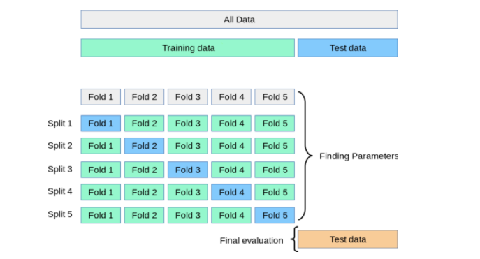

至於如何利用驗證集找出最佳超參數或模型，可以參考以下三種方法：
***** 手動調整
1) 定義超參數組合（例如 max_depth 和 n_estimators）。
2) 使用 K-Fold 交叉驗證來評估每組超參數的表現。
3) 選擇具有最佳平均交叉驗證準確率的超參數組合。
#+begin_src python -r -n :results output :exports both
from sklearn.model_selection import KFold
from sklearn.ensemble import RandomForestClassifier
from sklearn.metrics import accuracy_score
import numpy as np

# 定義超參數組合
param_grid = [
    {"n_estimators": 50, "max_depth": 5},
    {"n_estimators": 100, "max_depth": 5},
    {"n_estimators": 50, "max_depth": 10},
    {"n_estimators": 100, "max_depth": 10}
]

best_params = None
best_score = 0

kf = KFold(n_splits=5, shuffle=True, random_state=42)

# 遍歷所有超參數組合
for params in param_grid:
    val_scores = []

    for train_idx, val_idx in kf.split(X_train):
        model = RandomForestClassifier(n_estimators=params["n_estimators"], max_depth=params["max_depth"])
        model.fit(X_train[train_idx], y_train[train_idx])  # 訓練模型
        y_val_pred = model.predict(X_train[val_idx])  # 在驗證集上預測
        val_acc = accuracy_score(y_train[val_idx], y_val_pred)  # 計算準確率
        val_scores.append(val_acc)

    avg_score = np.mean(val_scores)  # 計算交叉驗證的平均準確率

    print(f"參數組合: {params}, 平均交叉驗證準確率: {avg_score:.4f}")

    if avg_score > best_score:
        best_score = avg_score
        best_params = params

print(f"最佳超參數: {best_params}, 最高交叉驗證準確率: {best_score:.4f}")
#+end_src
在上述程式中，我們做了以下幾個步驟：
1) 定義 4 組不同的超參數組合（n_estimators 和 max_depth）。
2) 對每組超參數執行 K-Fold 交叉驗證，計算 5 次的平均準確率。
3) 選擇擁有最高交叉驗證準確率的超參數組合 作為最佳組合。

缺點：如果超參數組合很多（例如 1000 種），這樣手動測試會非常耗時，因此可以使用 Grid SearchCV 或 RandomizedSearchCV 來自動搜尋最佳超參數。
***** GridSearchCV
GridSearchCV 是 Scikit-Learn 提供的一個自動化調參工具，可以幫助我們快速找到最佳超參數組合。它會自動遍歷所有超參數組合，並使用 K-Fold 交叉驗證來評估每組超參數的表現，最後返回最佳超參數組合。
#+begin_src python -r -n :results output :exports both
from sklearn.model_selection import GridSearchCV
from sklearn.ensemble import RandomForestClassifier

# 定義超參數搜索範圍
param_grid = {
    "n_estimators": [50, 100, 150],
    "max_depth": [5, 10, 15]
}

# 建立隨機森林模型
model = RandomForestClassifier()

# 使用 GridSearchCV + K-Fold 交叉驗證來搜索最佳超參數
grid_search = GridSearchCV(model, param_grid, cv=5, scoring='accuracy', n_jobs=-1)
grid_search.fit(X_train, y_train)

# 輸出最佳超參數和對應的分數
print(f"最佳超參數: {grid_search.best_params_}")
print(f"最佳交叉驗證準確率: {grid_search.best_score_:.4f}")
#+end_src
在上述程式中，我們做了以下幾個步驟：
1) 定義超參數範圍（n_estimators 和 max_depth）。
2) 使用 GridSearchCV 進行 K-Fold 交叉驗證，自動測試所有超參數組合。
3) 輸出最佳超參數和最高的交叉驗證分數。

優勢：
- 完全自動化，不需要手動測試每組超參數。
- 計算效能較高，可以使用 n_jobs=-1 同時運行多個超參數組合，提高速度。
***** RandomizedSearchCV
RandomizedSearchCV 與 GridSearchCV 類似，但是它不是遍歷所有超參數組合，而是隨機選取一部分超參數組合進行測試，這樣可以節省時間，尤其是當超參數範圍很大時。
#+begin_src python -r -n :results output :exports both
from sklearn.model_selection import RandomizedSearchCV
from scipy.stats import randint

# 定義超參數範圍（使用隨機分布）
param_dist = {
    "n_estimators": randint(50, 200),
    "max_depth": randint(5, 20)
}

# 建立隨機森林模型
model = RandomForestClassifier()

# 使用 RandomizedSearchCV 進行隨機超參數搜尋
random_search = RandomizedSearchCV(model, param_dist, cv=5, n_iter=10, scoring='accuracy', n_jobs=-1, random_state=42)
random_search.fit(X_train, y_train)

# 輸出最佳超參數和對應的分數
print(f"最佳超參數: {random_search.best_params_}")
print(f"最佳交叉驗證準確率: {random_search.best_score_:.4f}")
#+end_src
在上述程式中，我們做了以下幾個步驟：
1. 使用 隨機分布 設定超參數範圍（randint(50, 200)）。
1. n_iter=10 表示只隨機測試 10 組超參數組合，大幅減少計算時間。
1. 使用 K-Fold 交叉驗證來評估每組超參數的表現。

優勢：
- 比 Grid Search 快速許多，適合超參數組合很多時使用。
- 可以涵蓋更廣的搜尋範圍，避免限制於固定的超參數組合。
**** LOOCV (Leave-One-Out Cross Validation)
LOOCV 是一種特殊的交叉驗證方法，是 K-fold 其中一種特例，此作法相當簡單明瞭，但是訓練負擔會非常重且耗時。將資料集分為訓練集和測試集，其中測試集只包含 *一筆樣本資料* ，訓練集包含 *其餘N-1筆樣本* ，整個訓練會重複進行N次(N為樣本數），最後取所有測試結果的平均值作為模型的性能評估。這樣的分割方式可以:
- 保證每個樣本都被用於測試一次，並且可以得到最穩定的結果
- 充分利用資料，每筆資料都有機會成為測試集
- 結果最穩定，不受特定分割影響

#+ATTR_LATEX: :width 300
#+ATTR_ORG: :width 300
#+ATTR_HTML: :width 500
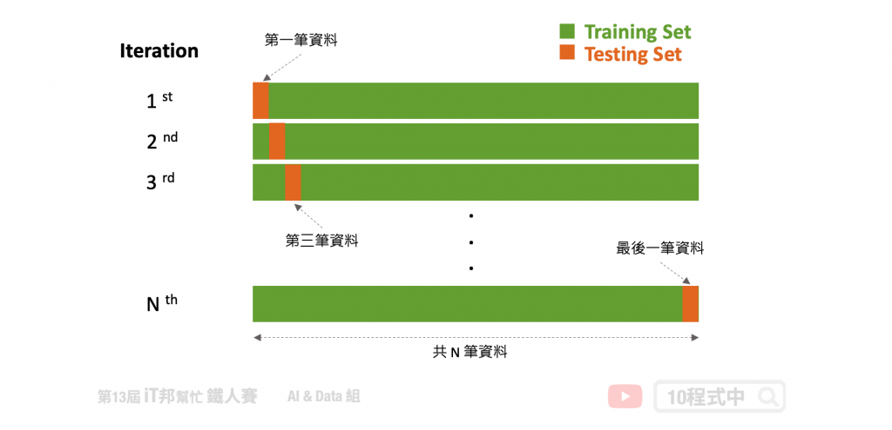

適用情境：
- 小型資料集（如 N < 100），因為可以最大化利用訓練資料
- 不適合大規模資料集，因為計算成本過高。

優點：
- 充分利用資料，每筆資料都有機會成為測試集
- 結果最穩定，不受特定分割影響

缺點
- 訓練成本極高：因為有 N 筆資料，就需要 訓練 N 次，如果 N = 10000，則要訓練 10000 次，時間成本極高。
- 對離群值（outliers）極度敏感：如果某個樣本是異常值，這個異常值在某次迭代會成為測試集，會嚴重影響模型表現。

範例程式:
#+begin_src python -r -n :results output :exports both
from sklearn.model_selection import LeaveOneOut

loo = LeaveOneOut()
loo_accuracies = []

for train_idx, test_idx in loo.split(X):
    model.fit(X[train_idx], y[train_idx])
    acc = model.score(X[test_idx], y[test_idx])
    loo_accuracies.append(acc)

print("平均準確率:", np.mean(loo_accuracies))
#+end_src
**** Stratified K-fold Cross-Validation
Stratified K-fold Cross-Validation 是 K-fold Cross-Validation 的一種變形，主要是針對分類問題而設計的。在 K-fold Cross-Validation 中，每次分割都是隨機的，可能會導致某些類別的樣本在訓練集和測試集中的比例不均衡，進而影響模型的性能評估。Stratified K-fold Cross-Validation 通過保持每個類別在每個分割中的比例來解決這個問題，確保每個類別在訓練集和測試集中的比例相同。

適用場景
- 類別不均衡問題（例如詐欺檢測、罕見疾病分類）
- 確保所有類別都能在每個 fold 中出現，避免某些 fold 缺少少數類別
- 小型資料集時特別重要，避免某些類別完全未出現在特定 fold

範例程式
#+begin_src python -r -n :results output :exports both
from sklearn.model_selection import StratifiedKFold
from collections import Counter

X = np.arange(20).reshape(-1, 1)  # 20 筆樣本
y = np.array([0] * 18 + [1] * 2)  # 18 個類別 0，2 個類別 1

skf = StratifiedKFold(n_splits=5, shuffle=True, random_state=42)
for fold, (train_idx, test_idx) in enumerate(skf.split(X, y)):
    print(f"Fold {fold+1} - 測試集類別分佈:", Counter(y[test_idx]))
#+end_src
*** 時間序列交叉驗證（Time Series Split）
Time Series Split 是時序資料（如股市、氣象預測）的專用分割方式，確保未來的資料不會洩漏到訓練中。

適用場景
- 股票預測
- 氣象預測
- 銷售趨勢分析
- 任何未來資料不可提前出現的應用

範例程式
#+begin_src python -r -n :results output :exports both
from sklearn.model_selection import TimeSeriesSplit

tscv = TimeSeriesSplit(n_splits=5)
for train_idx, val_idx in tscv.split(X):
    model.fit(X[train_idx], y[train_idx])
    acc = model.score(X[val_idx], y[val_idx])
#+end_src
輸出示意
#+begin_example
第一次訓練: 1 2 3 4  -> 測試 5
第二次訓練: 1 2 3 4 5 -> 測試 6
第三次訓練: 1 2 3 4 5 6 -> 測試 7
#+end_example
*** 自助抽樣（Bootstrap Sampling）
一種隨機抽樣方法，主要用於統計學與集成學習（如隨機森林）。以 *抽完放回* 的方式從原始資料集中隨機抽取樣本，形成新的訓練集。

適用場景
- 當資料量較小時，希望模擬多次抽樣的效果。
- 隨機森林（Random Forest）、統計學中的區間估計

優點
- 可以充分利用資料，因為每次抽樣都是隨機的，每次抽樣都有可能抽到重要樣本
- 可以模擬多次抽樣的效果，得到更穩定的結果

缺點
- 會產生重複樣本，導致模型訓練時的方差增加
- 計算成本高，因為要重複抽樣多次

範例程式1
#+begin_src python -r -n :results output :exports both
from sklearn.utils import resample

X_train_bootstrap, y_train_bootstrap = resample(X_train, y_train, replace=True, random_state=42)
model.fit(X_train_bootstrap, y_train_bootstrap)
#+end_src
範例程式2: 隨機森林（Random Forest）
#+begin_src python -r -n :results output :exports both
from sklearn.ensemble import RandomForestClassifier

model = RandomForestClassifier(n_estimators=100, bootstrap=True)
model.fit(X_train, y_train)
#+end_src
*** 交叉驗證的效能評估指標
在機器學習中，我們通常使用一些指標來評估模型的性能，這些指標可以幫助我們了解模型的表現，並選擇最佳模型。以下是一些常見的效能評估指標：
**** 分類問題
- 準確率（Accuracy）：正確預測的樣本數除以總樣本數。
- 精確率（Precision）：正確預測為正例的樣本數除以所有預測為正例的樣本數。
- 召回率（Recall）：正確預測為正例的樣本數除以所有真正為正例的樣本數。
- F1 Score：精確率和召回率的調和平均數。
- ROC 曲線（Receiver Operating Characteristic Curve）：以假陽性率（False Positive Rate）為橫軸，真陽性率（True Positive Rate）為縱軸繪製的曲線。
- AUC（Area Under Curve）：ROC 曲線下的面積，用來衡量模型的性能。
**** 回歸問題
- 平均絕對誤差（Mean Absolute Error, MAE）：預測值和真實值之間的絕對誤差的平均值。
- 均方誤差（Mean Squared Error, MSE）：預測值和真實值之間的誤差的平方的平均值。
- 均方根誤差（Root Mean Squared Error, RMSE）：均方誤差的平方根。
- R平方（R-squared）：模型解釋的變異量占總變異量的比例，取值範圍為0到1，越接近1表示模型越好。
- MAPE（Mean Absolute Percentage Error）：預測值和真實值之間的絕對百分比誤差的平均值。
- 決定係數（Coefficient of Determination）：R平方的另一種表示方法，也是模型解釋的變異量占總變異量的比例。
- 殘差圖（Residual Plot）：用來檢查模型的殘差是否符合常態分佈，以及是否存在異方差性。
- QQ 圖（Q-Q Plot）：用來檢查模型的殘差是否符合常態分佈。
- 預測區間（Prediction Interval）：用來估計預測值的不確定性，通常是一個區間，表示預測值的範圍。

** Layer, 損失函數與優化器
前節深度學習中的每一「層」(layer)如何運作，取決於儲存於該層的權重(weight)，而權重是由多個數字組成。從技術層面來看，layer 是由各個權重參數(parameters)來和輸入的資料(如圖[[fig:python-deep-learning-3]]中的X)進行運算以執行資料轉換的工作(如圖[[fig:python-deep-learning-3]])。而所謂的學習，指的就是幫助神經網路的每一層找出適當的權重值，讓神經網路可以將輸入的訓練資料經由與權重的運作推導出接近標準答案的運算結果(即圖[[fig:python-deep-learning-3]]中的預測 Y)。

然而，這在實際運作上是十分困難的，因為一個深度神經網路可以包含數千萬個權重，此外，其中一個權重被改變後，往往會影響其他權重的運作。

#+CAPTION: nn 中 layer 的 parameter
#+LABEL:fig:python-deep-learning-3
#+name: fig:python-deep-learning-3
#+ATTR_LATEX: :width 400
#+ATTR_HTML: :width 400
#+ATTR_ORG: :width 400
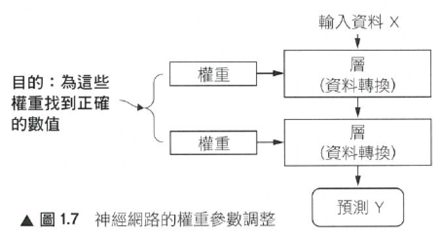

為了提高神經網路的效能(預測的準確率)，我們要即時的掌握目前的輸出(Y)與真正的標準答案Y還差多少，這個評估由神經網路的損失函數(loss function;或稱目標函數, objective function;或稱成本函數, cost function[fn:9])來負責，如圖[[fig:python-deep-learning-4]]。損失函數會取得神經網路的預測結果與標準答案二者的損失分數(又稱差距分數)，做為每一次學習的表現效能之評估標準。

#+CAPTION: 損失函數
#+LABEL:fig:python-deep-learning-4
#+name: fig:python-deep-learning-4
#+ATTR_LATEX: :width 400
#+ATTR_HTML: :width 400
#+ATTR_ORG: :width 400
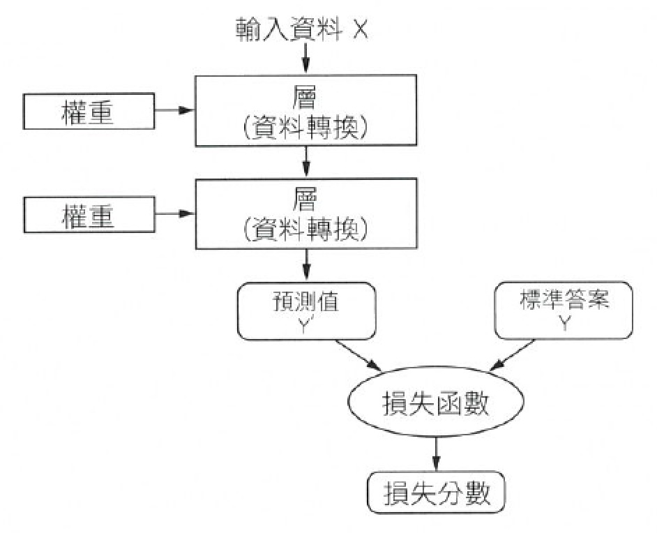

而深度學習的基本工作就是使用損失函數做為回饋訊息來一步步微調權重，逐步降低每次學習的損失分數，最終目標在於讓損失函數結果達到最小，而這個微調工作則由優化器(optimizer，也稱最佳化函數)來執行。優化器實作了反向傳播演算法(Backpropagation)，這也是深度學習中的核心演算法，藉此來調整權重。

#+CAPTION: 優化器
#+LABEL:fig:python-deep-learning-5
#+name: fig:python-deep-learning-5
#+ATTR_LATEX: :width 300
#+ATTR_HTML: :width 400
#+ATTR_ORG: :width 300
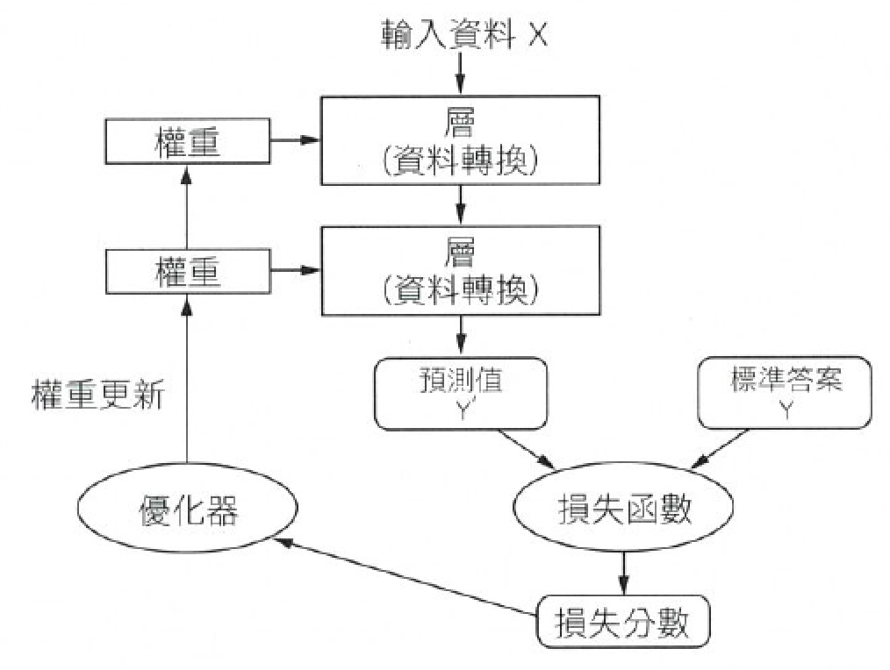

事實上，同樣的流程我們也曾在[[id:6ae7fb7a-0b38-4448-b19f-073d262513f2][迴歸]]裡看過，在找到一條理想的迴歸方程式時，我們也是先隨便找一條，然後用loss function去評估這條方程式的優劣，再「求切線斜率」的方式來修正方程式的係數。差別只在於：在[[id:6ae7fb7a-0b38-4448-b19f-073d262513f2][迴歸]]時我們要修正的係數只有一、兩個，而在深度學習中，我們要同時修正成千上萬個權重。

那麼，在最初一次的學習，權重的值是如何設定的呢？可以先全數設為零，但更常用的做法是隨機指定，隨著多次學習後，權重會逐步往正確的方向調整，損失分數也會慢慢降低。

我們再複習一下[[id:d6daa102-05bb-475d-b619-db8b61e86030][神經網路]]這章裡的文字：

#+begin_quote
是的，就如同考試時你面對陌生選擇題的反應，神經網路也決定這麼幹，隨便丟一些數值填到矩陣中當成第一批參數。事實上，同樣的策略我們在[[id:7cd4a142-4cd9-46b6-b9a4-2ad750ae622f][線性迴歸:年齡身高預測/隨機的力量]]裡已經玩過了，當初在找出方程式的最佳參數組合時，我們也是閉上眼睛隨便選一組。不管整個網路中有多少參數，當我們隨機設定好了所有參數的最初值後，整個神經網路就可以運作了，嗯...至少已經可以依照前向傳播的流程輸出第一個預測結果了，你看，我們已經朝完美的人工智慧跨進一大步了-_-
#+ATTR_LATEX: :width 300
#+ATTR_ORG: :width 300
#+ATTR_HTML: :width 400

接下來的流程其實和[[id:6ae7fb7a-0b38-4448-b19f-073d262513f2][迴歸]]有點類似，我們評估預測結果的品質，然後回頭修正參數，只是這次的工程有點浩大，我們要修正所有的參數，這個回頭修正所有參數的過程稱為反向傳播(backward propagation)。

#+end_quote

** 過度配適與正則化
在訓練深度學習模型時，一個核心挑戰是：模型在訓練資料上表現很好，但在新的（未見過的）資料上表現很差。這個現象稱為「過度配適」(Overfitting)，意味著模型記住了訓練資料中的雜訊和細節，而非學到真正的規律。

與之相對的是「配適不足」(Underfitting)，指模型過於簡單，連訓練資料中的基本規律都無法捕捉。理想的模型應該在這兩者之間取得平衡。

*** 如何判斷過度配適
觀察訓練過程中的損失函數和準確率曲線：
- 訓練損失持續下降，但驗證損失在某個時間點開始上升 → 過度配適
- 訓練準確率遠高於驗證準確率 → 過度配適
- 訓練損失和驗證損失都很高 → 配適不足

*** 正則化技術
正則化 (Regularization) 是指用來減少過度配適的各種技術：

**** Dropout
Dropout 是深度學習中最常用的正則化技術之一，由 Hinton 等人在 2014 年提出。其做法是在訓練過程中隨機「關閉」一定比例的神經元（將其輸出設為 0），迫使網路不依賴任何特定的神經元，從而學到更具泛化能力的特徵。

#+begin_src python -r -n :results output :exports both
# 在 Dense 層之後加入 Dropout，隨機關閉 25% 的神經元
model.add(layers.Dense(64, activation='relu'))
model.add(layers.Dropout(0.25))
#+end_src
注意：Dropout 只在訓練時啟用，在預測（推論）時所有神經元都會被使用。

**** L1 與 L2 正則化
在損失函數中加入權重的懲罰項，限制權重值不要過大：
- *L1 正則化*（Lasso）：加入權重絕對值的總和，傾向使部分權重變為 0，達到特徵選擇的效果
- *L2 正則化*（Ridge，又稱 Weight Decay）：加入權重平方的總和，傾向使所有權重都較小但不為 0
#+begin_src python -r -n :results output :exports both
from keras import regularizers

# L2 正則化
model.add(layers.Dense(64, activation='relu',
                       kernel_regularizer=regularizers.l2(0.001)))

# L1 正則化
model.add(layers.Dense(64, activation='relu',
                       kernel_regularizer=regularizers.l1(0.001)))

# 同時使用 L1 與 L2
model.add(layers.Dense(64, activation='relu',
                       kernel_regularizer=regularizers.l1_l2(l1=0.001, l2=0.001)))
#+end_src
**** Early Stopping
監控驗證損失，當驗證損失連續數個 epoch 不再改善時，自動停止訓練：
#+begin_src python -r -n :results output :exports both
from keras.callbacks import EarlyStopping

early_stop = EarlyStopping(monitor='val_loss', patience=5, restore_best_weights=True)
model.fit(X_train, y_train, epochs=100, validation_split=0.2, callbacks=[early_stop])
#+end_src

其中 =patience=5= 表示容許驗證損失連續 5 個 epoch 未改善，=restore_best_weights=True= 會在停止時恢復到驗證損失最低時的權重。
**** Batch Normalization
Batch Normalization (BN) 由 Ioffe 和 Szegedy 於 2015 年提出，對每一層的輸入進行標準化處理（使其均值接近 0、標準差接近 1）。雖然 BN 最初的目的是加速訓練收斂，但實務上也具有一定的正則化效果。
#+begin_src python -r -n :results output :exports both
model.add(layers.Dense(64, activation='relu'))
model.add(layers.BatchNormalization())
#+end_src
**** Data Augmentation
透過對訓練資料進行隨機變換（如旋轉、翻轉、縮放、裁切）來人為增加訓練樣本的多樣性，這在影像分類任務中特別有效。詳細內容可參考[[id:20221023T101414.457264][CNN/卷積神經網路]]中的資料擴增章節。

** 遷移學習 (Transfer Learning)
遷移學習是指將在某個任務上訓練好的模型（或其部分知識）應用到另一個相關任務上的技術。這是現代深度學習實務中最重要的概念之一，因為從零開始訓練一個深度神經網路往往需要龐大的資料集和運算資源。

*** 為什麼需要遷移學習
- 標註資料昂貴且稀少：許多實際問題只有少量標註資料
- 訓練成本高：從零訓練大型模型需要大量 GPU 時間
- 特徵可以共用：低層的特徵（如邊緣、紋理）在不同視覺任務中是通用的

*** 常見做法
**** 特徵提取 (Feature Extraction)
使用預訓練模型（如在 ImageNet 上訓練的 VGG、ResNet）作為固定的特徵提取器，只訓練最後的分類層：

#+begin_src python -r -n :results output :exports both :eval no
from keras.applications import ResNet50
from keras import layers, models

# 載入預訓練的 ResNet50，不包含頂層分類器
base_model = ResNet50(weights='imagenet', include_top=False, input_shape=(224, 224, 3))

# 凍結預訓練模型的權重
base_model.trainable = False

# 在上面堆疊自己的分類層
model = models.Sequential([
    base_model,
    layers.GlobalAveragePooling2D(),
    layers.Dense(256, activation='relu'),
    layers.Dropout(0.5),
    layers.Dense(10, activation='softmax')  # 假設分 10 類
])
#+end_src

**** 微調 (Fine-tuning)
先用特徵提取的方式訓練頂層，再解凍預訓練模型的部分（或全部）層進行微調，使用較小的學習率以避免破壞已學到的特徵：

#+begin_src python -r -n :results output :exports both :eval no
# 解凍預訓練模型的最後幾層
base_model.trainable = True
for layer in base_model.layers[:-20]:  # 只解凍最後 20 層
    layer.trainable = False

# 用較小的學習率重新編譯
model.compile(optimizer=keras.optimizers.Adam(learning_rate=1e-5),
              loss='categorical_crossentropy',
              metrics=['accuracy'])
#+end_src

*** 自然語言處理中的遷移學習
在 NLP 領域，遷移學習的成功更加顯著：
- *Word2Vec / GloVe*：預訓練的詞向量，可直接用於各種 NLP 任務
- *BERT* (2018)：Google 提出的預訓練語言模型，在大量文本上以遮蔽語言模型 (Masked LM) 方式預訓練，再針對下游任務微調
- *GPT 系列*：OpenAI 的大型語言模型，展示了「預訓練 + 提示」(pre-train + prompt) 的新典範，不需微調即可執行多種任務

** 常見優化器比較
在訓練神經網路時，優化器負責根據損失函數的梯度來更新權重。不同的優化器有不同的更新策略，選擇合適的優化器對訓練效果影響很大。

*** SGD (隨機梯度下降)
最基本的優化器，每次用一個小批量（mini-batch）的梯度來更新權重：
\[ w = w - \eta \cdot \nabla L \]
其中 \(\eta\) 為學習率，\(\nabla L\) 為損失函數的梯度。SGD 簡單但收斂速度慢，且容易陷入局部最小值。

*** SGD + Momentum
在 SGD 基礎上加入「動量」，讓更新方向考慮過去的梯度方向，類似球從坡上滾下時累積的速度：
\[ v = \gamma v + \eta \cdot \nabla L \]
\[ w = w - v \]
其中 \(\gamma\) 通常設為 0.9。Momentum 可以加速收斂並減少震盪。

*** RMSprop
由 Hinton 提出，對每個參數使用不同的學習率，根據該參數過去梯度的大小做調整。對於梯度大的參數使用較小的學習率，對於梯度小的參數使用較大的學習率，適合處理非穩態（non-stationary）問題。

*** Adam
結合了 Momentum 和 RMSprop 的優點，同時追蹤梯度的一階矩（均值）和二階矩（變異數），是目前最常用的優化器。

#+begin_src python -r -n :results output :exports both :eval no
# SGD（隨機梯度下降）：最基本的優化器，像是用最笨的方法下山
model.compile(optimizer='sgd', loss='categorical_crossentropy')

# SGD + Momentum（加上動量）：像是滾球下山，會「記住」之前的方向，不容易卡住
model.compile(optimizer=keras.optimizers.SGD(learning_rate=0.01, momentum=0.9),
              loss='categorical_crossentropy')

# RMSprop：會根據梯度大小自動調整學習速度，比 SGD 聰明
model.compile(optimizer='rmsprop', loss='categorical_crossentropy')

# Adam（最常用）：結合了 Momentum 和 RMSprop 的優點，新手首選
model.compile(optimizer='adam', loss='categorical_crossentropy')

# Adam 搭配自訂學習率（learning_rate 越小學越慢但越穩定）
model.compile(optimizer=keras.optimizers.Adam(learning_rate=0.001),
              loss='categorical_crossentropy')
#+end_src

*** 如何選擇優化器
| 情境 | 建議優化器 |
|------+------|
| 一般任務、快速實驗 | Adam |
| 電腦視覺（CNN） | SGD + Momentum（搭配學習率排程） |
| 自然語言處理 | Adam 或 AdamW |
| 資料量小、模型簡單 | Adam |
| 追求最佳泛化效能 | SGD + Momentum + 學習率排程 |

實務上，Adam 是最安全的預設選擇。但在電腦視覺的大規模訓練中，SGD + Momentum 搭配適當的學習率排程（如 cosine annealing）往往能達到更好的最終效能。

* 實作範例
** 二元分類：IMDB
自 IMDB 資料集中取得 50000 個正/負評論，各 25000 個，該資料集已內建於 Keras 中，且資料已先預處理，電影評論內容為由單字構成的 list 結構，例如，若評論內容為
#+begin_example
In a Wonderful morning...
#+end_example
其 list 結構可能為
#+begin_example
(8, 3, 386, 1969...)
#+end_example
即，每個單字都會依據其出現頻率給定一個編號，編號越小越常見。(與 IMDb 相關的 paper 參見[[https://paperswithcode.com/sota/sentiment-analysis-on-imdb][Sentiment Analysis on IMDb / paperswithcode]])

#+BEGIN_SRC python -r -n :async :results output :exports both :session imdb
from keras.datasets import imdb  # 從 Keras 內建資料集載入 IMDB 電影評論資料
# 載入資料，num_words=10000 表示只保留出現頻率前 10000 名的單字（其他太冷門的就不要了）
# 回傳值會自動分成「訓練集」和「測試集」，各有 data（評論內容）和 labels（正面=1/負面=0）
(train_data, train_labels), (test_data, test_labels) = imdb.load_data(num_words=10000)
print(train_data[0])   # 印出第一筆評論，內容是一串數字（每個數字代表一個單字的編號）
print(train_labels[0]) # 印出第一筆評論的標籤（1=正面評論, 0=負面評論）
#+END_SRC

#+RESULTS:
: [1, 14, 22, 16, 43, 530, 973, 1622, 1385, 65, 458, 4468, 66, 3941, 4, 173, 36, 256, 5, 25, 100, 43, 838, 112, 50, 670, 2, 9, 35, 480, 284, 5, 150, 4, 172, 112, 167, 2, 336, 385, 39, 4, 172, 4536, 1111, 17, 546, 38, 13, 447, 4, 192, 50, 16, 6, 147, 2025, 19, 14, 22, 4, 1920, 4613, 469, 4, 22, 71, 87, 12, 16, 43, 530, 38, 76, 15, 13, 1247, 4, 22, 17, 515, 17, 12, 16, 626, 18, 2, 5, 62, 386, 12, 8, 316, 8, 106, 5, 4, 2223, 5244, 16, 480, 66, 3785, 33, 4, 130, 12, 16, 38, 619, 5, 25, 124, 51, 36, 135, 48, 25, 1415, 33, 6, 22, 12, 215, 28, 77, 52, 5, 14, 407, 16, 82, 2, 8, 4, 107, 117, 5952, 15, 256, 4, 2, 7, 3766, 5, 723, 36, 71, 43, 530, 476, 26, 400, 317, 46, 7, 4, 2, 1029, 13, 104, 88, 4, 381, 15, 297, 98, 32, 2071, 56, 26, 141, 6, 194, 7486, 18, 4, 226, 22, 21, 134, 476, 26, 480, 5, 144, 30, 5535, 18, 51, 36, 28, 224, 92, 25, 104, 4, 226, 65, 16, 38, 1334, 88, 12, 16, 283, 5, 16, 4472, 113, 103, 32, 15, 16, 5345, 19, 178, 32]
: 1

如上為第一筆評論的單字代號與評論結果，若要將原始資料的單字代號還原，其程式碼如下：
#+BEGIN_SRC python -r -n :async :results output :exports both :session imdb
# 取得「單字 → 數字編號」的對照字典（例如 'this' → 11）
word_index = imdb.get_word_index()     (ref:wordIndex)
print("字典中key為this對應的value:",word_index['this'])
# 把字典反過來變成「數字編號 → 單字」，這樣我們才能把數字還原成看得懂的英文
reverse_word_index = dict([(value, key) for (key, value) in word_index.items()])    (ref:reverseWordIndex)
print("反轉字典中key為11所對應到的value:",reverse_word_index[11])
print("反轉字典中key為1所對應到的value:",reverse_word_index[1])
print("反轉字典中key為2所對應到的value:",reverse_word_index[2])
# 把第一筆評論從數字序列還原成英文句子
# 注意：每個數字要先減 3，因為 0/1/2 被 IMDB 保留給「填充」「序列開頭」「未知字」這三個特殊用途
decoded_review = ' '.join([reverse_word_index.get(i - 3, '?') for i in train_data[0]]) (ref:decodedReview)
print(decoded_review)
#+END_SRC

#+RESULTS:
: 字典中key為this對應的value: 11
: 反轉字典中key為11所對應到的value: this
: 反轉字典中key為1所對應到的value: the
: 反轉字典中key為2所對應到的value: and
: ? this film was just brilliant casting location scenery story direction everyone's really suited the part they played and you could just imagine being there robert ? is an amazing actor and now the same being director ? father came from the same scottish island as myself so i loved the fact there was a real connection with this film the witty remarks throughout the film were great it was just brilliant so much that i bought the film as soon as it was released for ? and would recommend it to everyone to watch and the fly fishing was amazing really cried at the end it was so sad and you know what they say if you cry at a film it must have been good and this definitely was also ? to the two little boy's that played the ? of norman and paul they were just brilliant children are often left out of the ? list i think because the stars that play them all grown up are such a big profile for the whole film but these children are amazing and should be praised for what they have done don't you think the whole story was so lovely because it was true and was someone's life after all that was shared with us all

上述程式中第[[(wordIndex)]]行主要負責取得單字(key)的對應數字(value)的字典，再藉由第[[(reverseWordIndex)]]行將(key:value)轉換為(value:key)，最後第[[(decodedReview)]]行將字典中的單字回復至原始評論，程式中(i-3)的原因是imdb.load_data已預留了第 0~2 個位置做特殊用途。
*** 準備資料
由於 IMDB 匯入 train_data 及 test_data 均為 list 型態，要先轉換為 tensor 才能輸入至神經網路，方法有二：
1. 填補資料中每個子 list 內容使其具有相同長度，再做reshape
2. 對每個子 list 做 one-hot encoding，其程式碼如下：
#+BEGIN_SRC python -r -n :async :results output :exports both :session imdb
import numpy as np  # 載入 NumPy，等等要用來做矩陣運算

# 這個函式負責把評論資料做 one-hot encoding（獨熱編碼）
# 簡單說就是：把「出現過哪些單字」標記成 1，沒出現的標記成 0
def vectorize_sequences(sequences, dimension=10000):
    # 先建一個全部是 0 的大矩陣，大小是（資料筆數 × 10000 個單字）
    results = np.zeros((len(sequences), dimension))
    for i, sequence in enumerate(sequences):  # 逐筆處理每則評論
        results[i, sequence] = 1.  # 把這則評論中出現過的單字位置標記為 1
    return results

print("====train_data[0]======")
print(train_data[0])  # 原始資料：一串單字編號（長度不固定）

# 將訓練資料向量化（變成固定長度 10000 的 0/1 向量）
x_train = vectorize_sequences(train_data)
# 將測試資料也做一樣的向量化處理
x_test = vectorize_sequences(test_data)
print("====x_data[0]======")
print(x_train[0])  # 向量化後：長度固定為 10000 的 0/1 陣列

# 最後再將標籤資料轉換為 float32 格式（神經網路比較喜歡浮點數）
y_train = np.asarray(train_labels).astype('float32')
y_test = np.asarray(test_labels).astype('float32')
print("====y_data[0]======")
print(y_train[0])  # 標籤：1.0 代表正面，0.0 代表負面
#+END_SRC

#+RESULTS:
: ====train_data[0]======
: [1, 14, 22, 16, 43, 530, 973, 1622, 1385, 65, 458, 4468, 66, 3941, 4, 173, 36, 256, 5, 25, 100, 43, 838, 112, 50, 670, 2, 9, 35, 480, 284, 5, 150, 4, 172, 112, 167, 2, 336, 385, 39, 4, 172, 4536, 1111, 17, 546, 38, 13, 447, 4, 192, 50, 16, 6, 147, 2025, 19, 14, 22, 4, 1920, 4613, 469, 4, 22, 71, 87, 12, 16, 43, 530, 38, 76, 15, 13, 1247, 4, 22, 17, 515, 17, 12, 16, 626, 18, 2, 5, 62, 386, 12, 8, 316, 8, 106, 5, 4, 2223, 5244, 16, 480, 66, 3785, 33, 4, 130, 12, 16, 38, 619, 5, 25, 124, 51, 36, 135, 48, 25, 1415, 33, 6, 22, 12, 215, 28, 77, 52, 5, 14, 407, 16, 82, 2, 8, 4, 107, 117, 5952, 15, 256, 4, 2, 7, 3766, 5, 723, 36, 71, 43, 530, 476, 26, 400, 317, 46, 7, 4, 2, 1029, 13, 104, 88, 4, 381, 15, 297, 98, 32, 2071, 56, 26, 141, 6, 194, 7486, 18, 4, 226, 22, 21, 134, 476, 26, 480, 5, 144, 30, 5535, 18, 51, 36, 28, 224, 92, 25, 104, 4, 226, 65, 16, 38, 1334, 88, 12, 16, 283, 5, 16, 4472, 113, 103, 32, 15, 16, 5345, 19, 178, 32]
: ====x_data[0]======
: [0. 1. 1. ... 0. 0. 0.]
: ====y_data[0]======
: 1.0
*** 建立神經網路
要建構一個 Dense 層堆疊架構的神經網路，要考慮兩個關鍵：
1. 要用多少層？
1. 每一層要有多少神經元？

此處使用兩個中間層、一個輸出層，如圖[[fig:nn3-6]]，一般的神經網路中，對那些介於輸入層和輸出層間的layer，我們習慣上稱之為隱藏層(hidden layers)，但此處 Keras 的輸入層也有隱藏層的特性。圖[[fig:nn3-6]]的 hidden layer 以 relu 為啟動函數，輸出層以 sigmoid 啟動函數輸出機率值。

#+BEGIN_SRC ditaa :file images/nn3-6.png

        輸入(向量化文字)
            |
            v
  +-------------------+
  |+-----------------+|
  || Dense(units=16) ||-+
  |+--------+--------+| |
  |         |         | +-隱藏層
  |         v         | |
  |+-----------------+| |
  || Dense(units=10) ||-+
  |+--------+--------+|
  |         |         |
  |         v         |
  |+-----------------+|-+
  ||  Dense(units=1) || +-輸出層
  |+-----------------+|-+
  +-------------------+
  #+END_SRC

#+RESULTS:
#+CAPTION: IMDB model 架構
#+name: fig:nn3-6
#+ATTR_LATEX: :width 200
#+ATTR_HTML: :width 300
#+ATTR_ORG: :width 200
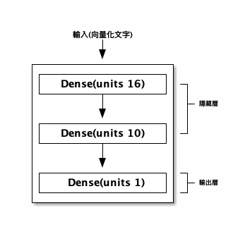

將上述 ditaa 圖換成更具體的視覺化，如圖[[fig:imdb-model-annotated]]，可以看到 one-hot 向量中每個位置對應一個單字，1 代表該單字出現在評論中、0 代表未出現。每條連線都帶有一個權重（weight），訓練過程就是在調整這些權重，讓模型學會「哪些字的出現與正面/負面評論有關」。

#+CAPTION: IMDB 模型架構：從 One-Hot 向量到情感預測
#+name: fig:imdb-model-annotated
#+ATTR_LATEX: :width 500
#+ATTR_ORG: :width 500
#+ATTR_HTML: :width 700
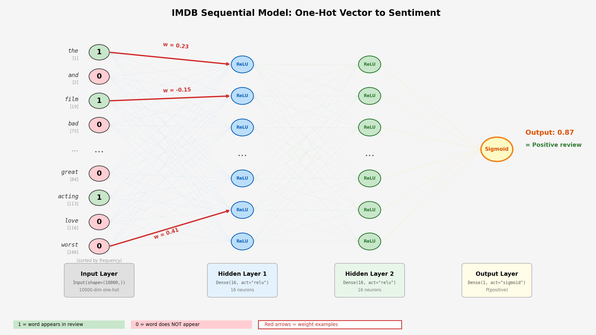

由於輸入資料為向量、標籤為純量(1, 0)，對這樣的問題，適合用 relu 啟動函數的全連接層(Dense)堆疊架構：Dense(16, activation='relu')。其中 16 指該層神經元的數量(也可看成該層的寬度)，典型的寫法為：
#+BEGIN_SRC python -r :results output :exports both :eval no
# 加入一個 Dense（全連接）隱藏層，該層有 16 個神經元
# activation='relu' 表示用 ReLU 啟動函數：負數變 0，正數保留原值
model.add(layers.Dense(16, activation='relu'))
#+END_SRC

擁有 16 個神經單元表示權重矩陣 W 的 shape 為(input_dimension, 16)，在 W 和 input 做內積後，input 資料會被映射到 16 維的空間上，最後加上 b、套用 relu 運算來產生輸出值。每一層的神經元數越多，可以讓神經網路學習更複雜的資料表示法，但也使計算成本更高。

#+CAPTION: ReLU 函數圖
#+LABEL:fig:ReLUFunction
#+name: fig:ReLUFunction
#+ATTR_LATEX: :width 200
#+ATTR_ORG: :width 200
#+ATTR_HTML: :width 300
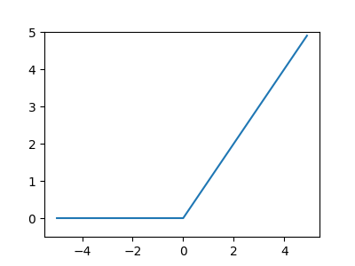

*** 為什麼要加入[[id:d3bcc30a-3d94-4a3c-8e66-baaac7325c75][Activation Function]]
為何要有 relu 等啟動函數？原因之一是這類函數為非線性函數(如圖[[fig:ReLUFunction]])，回顧[[id:d6daa102-05bb-475d-b619-db8b61e86030][神經網路]]中的「學測成績預測模型」，像圖[[fig:exam-Network2]]的模型，我們也只是在解一個如\(f(x)=x_1*w_1+x_2*w_2+x_3*w_3+...+x_7*w_7\)這樣的函式問題。

#+begin_src plantuml -t latex :file images/exam-network2p.png
@startuml
storage 學測成績
storage x1
storage x2
storage x3
storage x4
storage x5
storage x6
storage x7
x1 --|> 學測成績 : w1
x2 --|> 學測成績 : w2
x3 --|> 學測成績 : w3
x4 --|> 學測成績 : w4
x5 --|> 學測成績 : w5
x6 --|> 學測成績 : w6
x7 --|> 學測成績 : w7
@enduml
#+end_src

#+CAPTION: 學測成績預測模型#2
#+LABEL:fig:exam-Network2
#+NAME:fig:exam-Network2
#+ATTR_LATEX: :width 400
#+ATTR_ORG: :width 400
#+ATTR_HTML: :width 400
#+RESULTS:
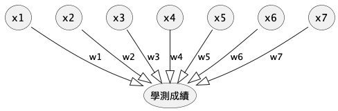

就算我們把模型2進化為模型3(如圖[[fig:exam-Network3]])，本質上也仍只是一層，再多的層數也能合併為一層，此類模型並無助於複雜的學習。

#+begin_src plantuml :file images/exam-network3p.png
@startuml
storage 學測成績
storage x1
storage x2
storage x3
storage x4
storage x5
storage x6
storage x7
storage y1
storage y2
storage y3
x1 --|> y1 : w11
x2 --|> y1 : w21
x3 --|> y1 : w31
x3 --|> y2 : w32
x4 --|> y2 : w42
x5 --|> y2 : w52
x5 --|> y3 : w53
x6 --|> y2 : w62
x6 --|> y3 : w63
x7 --|> y3 : w73
y1 -[dashed]-|> 學測成績 : w8
y2 -[dashed]-|> 學測成績 : w9
y3 -[dashed]-|> 學測成績 : w10
@enduml
#+end_src

#+CAPTION: 學測成績預測模型#3
#+LABEL:fig:exam-Network3
#+NAME:fig:exam-Network3
#+ATTR_LATEX: :width 400
#+ATTR_ORG: :width 300
#+ATTR_HTML: :width 500
#+RESULTS:
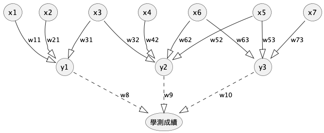

以圖[[fig:exam-Network3]]為例，最後對學測成績\(\hat{y}\)的預測為：
$$
\hat{y}=y_1w_8+y_2w_9+y_3w_{10}
$$
其中
\begin{eqnarray}
y_1 &=& x_1w_{11} + x_2w_{21} + x_3w_{31} \\
y_2 &=& x_3w_{32} + x_4w_{42} + x_5w_{52} + x_6w_{62} \\
y_3 &=& x_5w_{53} + x_6w_{63} + x_7w_{73}
\end{eqnarray}
如果我們稍微整理一下上面這個看起來像兩層的模型：
\begin{equation*}
\begin{split}
\hat{y} =& y_1w_8+y_2w_9+y_3w_{10} \\
        =& (x_1w_{11} + x_2w_{21} + x_3w_{31})w_8 \\
         &+ (x_3w_{32} + x_4w_{42} + x_5w_{52} + x_6w_{62})w_9 \\
         &+ (x_5w_{53} + x_6w_{63} + x_7w_{73})w_{10} \\
        =& x_1w_{11}w_8 + x_2w_{21}w_8 + x_3w_{31}w_8 \\
         &+ x_3w_{32}w_9 + x_4w_{42}w_9 + x_5w_{52}w_9 + x_6w_{62}w_9 \\
         &+ x_5w_{53}w_{10} + x_6w_{63}w_{10} + x_7w_{73}w_{10} \\
\end{split}
\end{equation*}
最後就會發現，不管它看起來像是幾層，最後都能整理成一層的模樣:
\begin{equation*}
\begin{split}
\hat{y} =& x_1\times(w_{11}w_8) \\
         &+ x_2\times(w_{21}w_8) \\
         &+ x_3\times(w_{31}w_8+w_{32}w_9) \\
         &+ x_4\times(w_{42}w_9) \\
         &+ x_5\times(w_{52}w_9 + w_{53}w_{10}) \\
         &+ x_6\times(w_{62}w_9 + w_{63}w_{10})\\
         &+ x_7\times(w_{73}w_{10})
\end{split}
\end{equation*}
結果就是跟底下的方程式一樣
\(f(x)=x_1*w_1+x_2*w_2+x_3*w_3+...+x_7*w_7\)

為了有效讓模型更加複雜，此處可以在模型中加入非線性轉換，如圖[[fig:ReLUFunction]]中的ReLU[[id:d3bcc30a-3d94-4a3c-8e66-baaac7325c75][激勵函數]]，其結果如圖[[fig:exam-Network4]]所示。

#+CAPTION: ReLU 函數圖
#+LABEL:fig:ReLUFunction2
#+name: fig:ReLUFunction2
#+ATTR_LATEX: :width 300
#+ATTR_ORG: :width 300
#+ATTR_HTML: :width 500

#+begin_src plantuml :file images/exam-network4p.png
@startuml
storage 學測成績
storage x1
storage x2
storage x3
storage x4
storage x5
storage x6
storage x7
storage reLU1 as "reLU" #aliceblue;line:blue;line.dotted;text:blue
storage reLU2 as "reLU" #aliceblue;line:blue;line.dotted;text:blue
storage reLU3 as "reLU" #aliceblue;line:blue;line.dotted;text:blue

storage y1
storage y2
storage y3
storage reLU4 as "reLU" #aliceblue;line:blue;line.dotted;text:blue
storage reLU5 as "reLU" #aliceblue;line:blue;line.dotted;text:blue
storage reLU6 as "reLU" #aliceblue;line:blue;line.dotted;text:blue
reLU1 -[dashed]-|> y1
reLU2 -[dashed]-|> y2
reLU3 -[dashed]-|> y3

x1 --|> reLU1 : w11
x2 --|> reLU1 : w21
x3 --|> reLU1 : w31
x3 --|> reLU2 : w32
x4 --|> reLU2 : w42
x5 --|> reLU2 : w52
x5 --|> reLU3 : w53
x6 --|> reLU2 : w62
x6 --|> reLU3 : w63
x7 --|> reLU3 : w73

y1 --|> reLU4 : w8
y2 --|> reLU5 : w9
y3 --|> reLU6 : w10

reLU4 -[dashed]-|> 學測成績
reLU5 -[dashed]-|> 學測成績
reLU6 -[dashed]-|> 學測成績

@enduml
#+end_src
#+CAPTION: 學測成績預測模型#4
#+LABEL:fig:exam-Network4
#+name: fig:exam-Network4
#+ATTR_LATEX: :width 500
#+ATTR_ORG: :width 100
#+ATTR_HTML: :width 500
#+RESULTS:
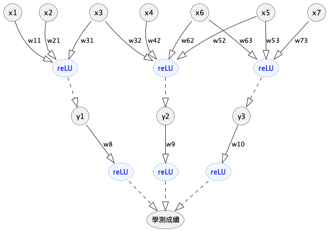
*** 程式實作
圖[[fig:nn3-6]]的實作程式如下，此處以最簡單的 NN (Neural Network) 作為範例。以 Keras 的核心為模型，應用最常使用 Sequential 模型。藉由.add()我們可以一層一層的將神經網路疊起。在每一層之中我們只需要簡單的設定每層的大小(units)與激勵函數(activation function)。
#+BEGIN_SRC python -r -n :async :results output :exports both :session imdb
from keras import models  # 載入模型模組
from keras import layers  # 載入層模組

# 建立一個 Sequential（順序型）模型——就像疊積木一樣，一層一層往上疊
model = models.Sequential()
# 輸入層：告訴模型每筆資料是一個長度 10000 的向量（one-hot 編碼後的結果）
model.add(layers.Input(shape=(10000,)))
# 第一層隱藏層：16 個神經元，用 ReLU 啟動函數（負數變 0，正數保留）
model.add(layers.Dense(16, activation='relu'))
# 第二層隱藏層：再來 16 個神經元，一樣用 ReLU
model.add(layers.Dense(16, activation='relu'))
# 輸出層：只有 1 個神經元，用 sigmoid 把結果壓在 0~1 之間（代表正面評論的機率）
model.add(layers.Dense(1, activation='sigmoid'))
#+END_SRC

#+RESULTS:

建好 model 後，要選擇一個損失函數和一個優化器，由於要處理的是二元分類問題，所以最好用 binary_crossentropy 損失函數，因為 crossentropy 主要就是用來測量機率分佈之間的距離(差異)。其實作如下：

#+BEGIN_SRC python -r -n :async :results output :exports both :session imdb
# 編譯模型：設定訓練時要用的優化器、損失函數和評估指標
model.compile(optimizer='rmsprop',             # 優化器：RMSprop（一種聰明的梯度下降法）
             loss='binary_crossentropy',       # 損失函數：二元交叉熵（專門用於二分類問題）
             metrics=['accuracy'])             # 評估指標：準確率（答對幾題 / 總題數）
#+END_SRC

#+RESULTS:

之所以能將 optimizer 和 loss function 以字串方式經由參數傳給 compile()，這是因為 rmsprop、binary_crossentropy 和 accuracy 均已事先在 Keras 套件中定義好了，若是要進一步自訂參數(如自訂學習率)，做法如下：

#+BEGIN_SRC python -r -n :async :results output :exports both :session imdb
# 方法一：自訂學習率（learning_rate 越小學越慢但越穩，越大學越快但可能亂跳）
from keras import optimizers

model.compile(optimizer=optimizers.RMSprop(learning_rate=0.001),  # 自訂學習率為 0.001
              loss='binary_crossentropy',
              metrics=['accuracy'])

# 方法二：用物件形式指定損失函數和評估指標（效果跟字串一樣，但可以做更多客製化）
from keras import losses    # 載入損失函數模組
from keras import metrics   # 載入評估指標模組

model.compile(optimizer=optimizers.RMSprop(learning_rate=0.001),
              loss=losses.binary_crossentropy,        # 用物件形式指定損失函數
              metrics=[metrics.binary_accuracy])       # 用物件形式指定評估指標
#+END_SRC

#+RESULTS:
若您使用的是M1/M2核心的Mac電腦，則可能會出現上述訊息，雖然不影響正常執行結果，但你仍可以參考[[https://stackoverflow.com/questions/77222463/is-there-a-way-to-change-adam-to-legacy-when-using-mac-m1-m2-in-tensorflow][stackoverflow上的這篇文章]]來解決這些惱人的訊息。
*** 驗證神經網路的 model
為了在訓練期間監控 model 對新資料的準確度，可以從原始訓練資料中分離出 10000 個樣本來建立驗證資料集。
#+BEGIN_SRC python -r -n :async :results output :exports both :session imdb
# 從 25000 筆訓練資料中，切出前 10000 筆當作「驗證集」（用來監控訓練過程中有沒有過度配適）
x_val = x_train[:10000]           # 驗證集的特徵（前 10000 筆）
partial_x_train = x_train[10000:] # 真正拿來訓練的特徵（剩下的 15000 筆）

y_val = y_train[:10000]           # 驗證集的標籤
partial_y_train = y_train[10000:] # 訓練集的標籤
#+END_SRC

#+RESULTS:

接下來才是使用 fit()來訓練模型，進行 20 個訓練週期(epoch，即，把 x_train 和 y_train 張量中的所有訓練樣本進行 20 輪的訓練)，以 512 個小樣本的小批量(batch_size)進行訓練，
#+BEGIN_SRC python -r -n :async :results output :exports both :session imdb
# 開始訓練模型！fit() 就是讓模型「學習」的指令
history = model.fit(partial_x_train,              # 訓練用的特徵資料
                    partial_y_train,              # 訓練用的標籤（正確答案）
                    epochs=20,                    # 把全部資料跑 20 輪（像複習考卷 20 遍）
                    batch_size=512,               # 每次餵 512 筆資料給模型（不是一次全丟，會消化不良）
                    validation_data=(x_val, y_val))  # 每跑完一輪就用驗證集測試一下，看有沒有「背答案」的跡象
#+END_SRC

#+RESULTS:
#+begin_example
Epoch 1/20
30/30 ━━━━━━━━━━━━━━━━━━━━ 2s 34ms/step - binary_accuracy: 0.6895 - loss: 0.5987 - val_binary_accuracy: 0.8637 - val_loss: 0.3995
...略...
Epoch 20/20
30/30 ━━━━━━━━━━━━━━━━━━━━ 0s 9ms/step - binary_accuracy: 0.9995 - loss: 0.0107 - val_binary_accuracy: 0.8726 - val_loss: 0.5637
#+end_example

model.fit()會回傳一個 history 物件，這物件本身有一個 history 屬性，為一個包含有關訓練過程中相關資料的字典，這個字典包含有 4 個項目(loss, binary_accuracy, val_loss, val_binary_accuracy)，為訓練和驗證時監控的指標。
#+BEGIN_SRC python -r -n :async :results output :exports both :session imdb
# history.history 是一個字典，記錄了每個 epoch 的訓練指標
print(history.history)                                          # 印出完整的訓練歷史紀錄
print("binary_accuracy:",history.history['binary_accuracy'])    # 每個 epoch 的訓練準確率
print("loss:",history.history['loss'])                          # 每個 epoch 的訓練損失值
print("val_binary_accuracy:",history.history['val_binary_accuracy'])  # 每個 epoch 的驗證準確率
print("val_loss:",history.history['val_loss'])                  # 每個 epoch 的驗證損失值
#+end_src

#+RESULTS:
: {'binary_accuracy': [0.7724000215530396, 0.8913999795913696, 0.9195333123207092, 0.9340000152587891, 0.946066677570343, 0.9564666748046875, 0.9628000259399414, 0.966533362865448, 0.974133312702179, 0.9778666496276855, 0.9836000204086304, 0.9865333437919617, 0.9886000156402588, 0.9922000169754028, 0.9932000041007996, 0.9955999851226807, 0.9947333335876465, 0.9983999729156494, 0.997866690158844, 0.9980000257492065], 'loss': [0.523308277130127, 0.32568830251693726, 0.2428768277168274, 0.195417582988739, 0.16299770772457123, 0.13810740411281586, 0.12029378116130829, 0.10577400773763657, 0.08585202693939209, 0.07604678720235825, 0.0627065971493721, 0.05464218556880951, 0.04679805412888527, 0.03932145610451698, 0.033363644033670425, 0.02628222107887268, 0.026078475639224052, 0.018040597438812256, 0.017737768590450287, 0.014618363231420517], 'val_binary_accuracy': [0.8636999726295471, 0.8859000205993652, 0.8891000151634216, 0.876800000667572, 0.8762000203132629, 0.8863999843597412, 0.8859999775886536, 0.8823999762535095, 0.8826000094413757, 0.8780999779701233, 0.8794999718666077, 0.8788999915122986, 0.878000020980835, 0.8666999936103821, 0.8751999735832214, 0.8748999834060669, 0.8738999962806702, 0.8673999905586243, 0.8712999820709229, 0.8726000189781189], 'val_loss': [0.39949268102645874, 0.3119995892047882, 0.28234928846359253, 0.3045506775379181, 0.30820411443710327, 0.2834608554840088, 0.2936294972896576, 0.3101825714111328, 0.3229252099990845, 0.34479930996894836, 0.36042720079421997, 0.3789125978946686, 0.4012978971004486, 0.46704238653182983, 0.44717246294021606, 0.47011518478393555, 0.4929317533969879, 0.5508306622505188, 0.5428465604782104, 0.563687264919281]}
: binary_accuracy: [0.7724000215530396, 0.8913999795913696, 0.9195333123207092, 0.9340000152587891, 0.946066677570343, 0.9564666748046875, 0.9628000259399414, 0.966533362865448, 0.974133312702179, 0.9778666496276855, 0.9836000204086304, 0.9865333437919617, 0.9886000156402588, 0.9922000169754028, 0.9932000041007996, 0.9955999851226807, 0.9947333335876465, 0.9983999729156494, 0.997866690158844, 0.9980000257492065]
: loss: [0.523308277130127, 0.32568830251693726, 0.2428768277168274, 0.195417582988739, 0.16299770772457123, 0.13810740411281586, 0.12029378116130829, 0.10577400773763657, 0.08585202693939209, 0.07604678720235825, 0.0627065971493721, 0.05464218556880951, 0.04679805412888527, 0.03932145610451698, 0.033363644033670425, 0.02628222107887268, 0.026078475639224052, 0.018040597438812256, 0.017737768590450287, 0.014618363231420517]
: val_binary_accuracy: [0.8636999726295471, 0.8859000205993652, 0.8891000151634216, 0.876800000667572, 0.8762000203132629, 0.8863999843597412, 0.8859999775886536, 0.8823999762535095, 0.8826000094413757, 0.8780999779701233, 0.8794999718666077, 0.8788999915122986, 0.878000020980835, 0.8666999936103821, 0.8751999735832214, 0.8748999834060669, 0.8738999962806702, 0.8673999905586243, 0.8712999820709229, 0.8726000189781189]
: val_loss: [0.39949268102645874, 0.3119995892047882, 0.28234928846359253, 0.3045506775379181, 0.30820411443710327, 0.2834608554840088, 0.2936294972896576, 0.3101825714111328, 0.3229252099990845, 0.34479930996894836, 0.36042720079421997, 0.3789125978946686, 0.4012978971004486, 0.46704238653182983, 0.44717246294021606, 0.47011518478393555, 0.4929317533969879, 0.5508306622505188, 0.5428465604782104, 0.563687264919281]

#+BEGIN_SRC python -r -n :async :results output :exports both :session imdb
# 把訓練歷史紀錄存到 history_dict，方便等等畫圖用
history_dict = history.history
print(history_dict.keys())  # 看看字典裡有哪些 key（loss, accuracy 之類的）

# 繪圖輔助函數：把訓練過程畫成折線圖，一眼看出模型學得好不好
import matplotlib.pyplot as plt
def plot_train_history(hdict, train_key, val_key, ylabel, filename, axis_range=None):
    plt.cla()                                          # 清除前一張圖（不然會疊在一起）
    epochs = range(1, len(hdict[train_key]) + 1)       # X 軸：第 1, 2, 3... 個 epoch
    plt.plot(epochs, hdict[train_key], 'bo', label='Training ' + ylabel.lower())   # 訓練曲線（藍色圓點）
    plt.plot(epochs, hdict[val_key], 'b', label='Validation ' + ylabel.lower())    # 驗證曲線（藍色線）
    plt.title(f'Training and validation {ylabel.lower()}')  # 圖表標題
    plt.xlabel('Epochs')   # X 軸標籤
    plt.ylabel(ylabel)     # Y 軸標籤
    if axis_range:         # 如果有指定座標軸範圍就套用
        plt.axis(axis_range)
    plt.legend()           # 顯示圖例（哪條線是訓練、哪條是驗證）
    plt.savefig(f"images/{filename}")  # 把圖存成檔案

# 畫出 Loss 曲線（損失值越低越好）
plot_train_history(history_dict, 'loss', 'val_loss', 'Loss', 'imdb-Keras-1.png')
# 畫出 Accuracy 曲線（準確率越高越好）
plot_train_history(history_dict, 'binary_accuracy', 'val_binary_accuracy', 'Accuracy', 'imdb-Keras-2.png')
#+END_SRC

#+RESULTS:
: dict_keys(['binary_accuracy', 'loss', 'val_binary_accuracy', 'val_loss'])

#+CAPTION: IMDB-Keras-1
#+LABEL:fig:IMDB-Keras-1
#+name: fig:IMDB-Keras-1
#+ATTR_LATEX: :width 300
#+ATTR_ORG: :width 300
#+ATTR_HTML: :width 500
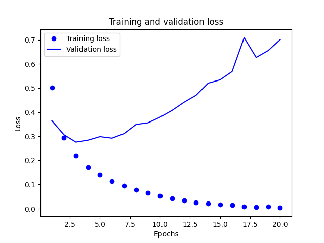

#+CAPTION:IMDB-Keras-2
#+LABEL:fig:IMDB-Keras-2
#+name: fig:IMDB-Keras-2
#+ATTR_LATEX: :width 300
#+ATTR_ORG: :width 300
#+ATTR_HTML: :width 500
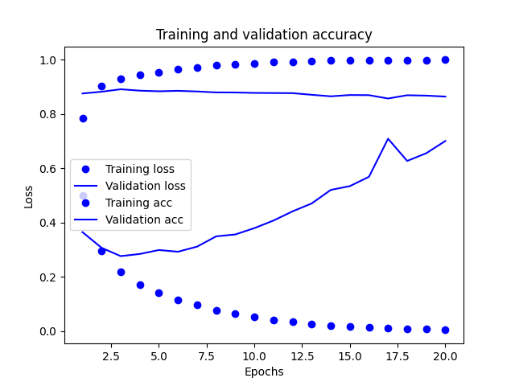
*** 優化 model
由圖[[fig:IMDB-Keras-1]]、[[fig:IMDB-Keras-2]]可以看出，上述 model 雖然在訓練階段的效能不錯，loss function 隨 epoch 下降、accuracy 也隨 epoch 升高，但在驗證階段的表現卻十分不理想，不僅 accuracy 隨 epoch 的增加呈緩降趨勢，loss function 甚至還往上急升。

第二版的 model 做了以下改進:
- 將資料向量化(vectorize_sequences())
- 加入了兩層 layer 以及 dropout 層，其架構如圖[[fig:nn3-6-2]]
#+BEGIN_SRC ditaa :file images/nn3-6-2.png

        輸入(向量化文字)
            |
            v
  +-------------------+
  |+-----------------+|
  || Dense(units=16) ||-+
  |+--------+--------+| |
  |         |         | |
  |         v         | |
  |+-----------------+| |
  || Dense(units=64) || |
  |+--------+--------+| |
  |         |         | |
  |         v         | |
  |+-----------------+| |
  ||  Dropout(0.25)  || |
  |+--------+--------+| |
  |         |         | +-隱藏層
  |         v         | |
  |+-----------------+| |
  || Dense(units=64) || |
  |+--------+--------+| |
  |         |         | |
  |         v         | |
  |+-----------------+| |
  ||  Dropout(0.25)  || |
  |+--------+--------+| |
  |         |         | |
  |         v         | |
  |+-----------------+| |
  || Dense(units=10) ||-+
  |+--------+--------+|
  |         |         |
  |         v         |
  |+-----------------+|-+
  ||  Dense(units=1) || +-輸出層
  |+-----------------+|-+
  +-------------------+
  #+END_SRC
#+RESULTS:
#+CAPTION: IMDB model 架構#2
#+name: fig:nn3-6-2
#+ATTR_LATEX: :width 200
#+ATTR_HTML: :width 300
#+ATTR_ORG: :width 200
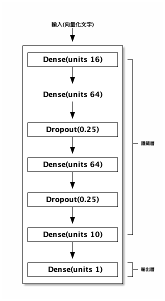

#+BEGIN_SRC python -r -n :async :results output :exports both :session imdb
# ===== 第二版：優化模型 =====

# 向量化函式（跟前面一樣，把單字編號轉成 one-hot 向量）
def vectorize_sequences(sequences, dimension=10000):
    results = np.zeros((len(sequences), dimension))  # 建立全 0 矩陣
    for i, sequence in enumerate(sequences):
        results[i, sequence] = 1.  # 出現過的單字位置設為 1
    return results

x_train = vectorize_sequences(train_data)   # 向量化訓練資料
x_test = vectorize_sequences(test_data)     # 向量化測試資料
# 標籤轉為浮點數格式
y_train = np.asarray(train_labels).astype('float32')
y_test = np.asarray(test_labels).astype('float32')

# 建立優化版 model（比第一版多了 Dropout 層來防止過度配適）
model = models.Sequential()
model.add(layers.Input(shape=(10000,)))          # 輸入層：10000 維向量
model.add(layers.Dense(16, activation='relu'))   # 隱藏層 1：16 個神經元
model.add(layers.Dense(64, activation='relu'))   # 隱藏層 2：64 個神經元（加寬，讓模型學更多特徵）
model.add(layers.Dropout(0.25))                  # Dropout：隨機關掉 25% 的神經元（防止模型「背答案」）
model.add(layers.Dense(64, activation='relu'))   # 隱藏層 3：再來 64 個神經元
model.add(layers.Dropout(0.25))                  # 再加一層 Dropout，雙重保險
model.add(layers.Dense(1, activation='sigmoid')) # 輸出層：sigmoid 輸出 0~1 的機率

# 設定優化器，學習率調低到 0.0001（學慢一點但更穩定）
import platform
opt = optimizers.RMSprop(learning_rate=0.0001)

# 編譯模型
model.compile(optimizer=opt, loss='binary_crossentropy',
              metrics=[metrics.binary_accuracy])

# 切出驗證集（跟前面一樣的做法）
x_val = x_train[:10000]           # 前 10000 筆做驗證
partial_x_train = x_train[10000:] # 剩下的拿來訓練
y_val = y_train[:10000]
partial_y_train = y_train[10000:]

# 開始訓練（verbose=0 表示不要一直印進度條，安靜訓練）
history = model.fit(partial_x_train, partial_y_train,
                    epochs=20, batch_size=512,
                    validation_data=(x_val, y_val), verbose=0)

# 看看訓練歷史紀錄有哪些指標
history_dict = history.history
print(history_dict.keys())

# 用訓練好的模型對測試集進行預測（每筆資料會得到一個 0~1 的機率值）
x = model.predict(x_test)
print(x)

# 畫出優化版的 Loss 和 Accuracy 曲線，跟第一版比較看看有沒有進步
plot_train_history(history_dict, 'loss', 'val_loss', 'Loss', 'imdb-Keras-3.png')
plot_train_history(history_dict, 'binary_accuracy', 'val_binary_accuracy', 'Accuracy', 'imdb-Keras-4.png')
#+END_SRC

#+RESULTS:
: dict_keys(['binary_accuracy', 'loss', 'val_binary_accuracy', 'val_loss'])
: 782/782 ━━━━━━━━━━━━━━━━━━━━ 0s 530us/step
: [[0.28722998]
:  [0.99044675]
:  [0.72447336]
:  ...
:  [0.04659463]
:  [0.12886518]
:  [0.4191768 ]]

#+CAPTION: IMDB-Keras-3 (優化版 Loss)
#+LABEL:fig:IMDB-Keras-3b
#+name: fig:IMDB-Keras-3b
#+ATTR_LATEX: :width 300
#+ATTR_ORG: :width 300
#+ATTR_HTML: :width 500
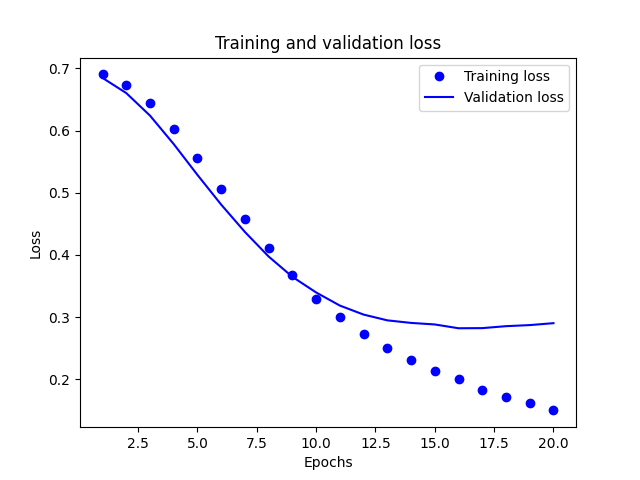

#+CAPTION: IMDB-Keras-4 (優化版 Accuracy)
#+LABEL:fig:IMDB-Keras-4b
#+name: fig:IMDB-Keras-4b
#+ATTR_LATEX: :width 300
#+ATTR_ORG: :width 300
#+ATTR_HTML: :width 500
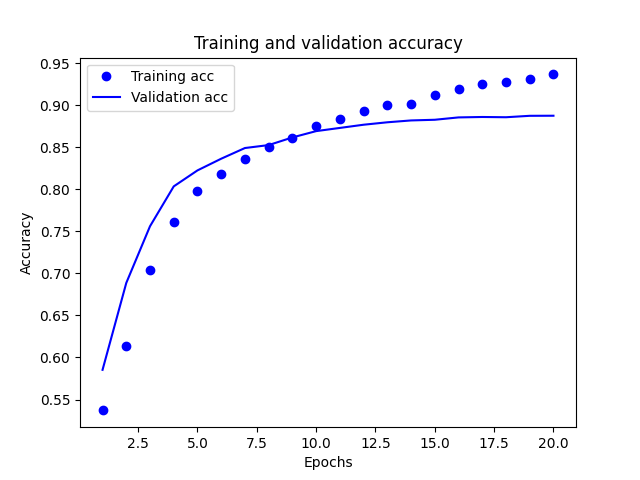

#+CAPTION: IMDB-Keras-3
#+LABEL:fig:IMDB-Keras-3
#+name: fig:IMDB-Keras-3
#+ATTR_LATEX: :width 300
#+ATTR_ORG: :width 300
#+ATTR_HTML: :width 500

#+CAPTION: IMDB-Keras-4
#+LABEL:fig:IMDB-Keras-4
#+name: fig:IMDB-Keras-4
#+ATTR_LATEX: :width 300
#+ATTR_ORG: :width 300
#+ATTR_HTML: :width 500

比較上述兩組結果，可以發現優化版的 model 在 loss function 以及 accuracy 的表現都有進步。

** [課堂作業]多類別分類挑戰：路透社新聞                            :TNFSH:

恭喜你已經成功訓練出一個能分辨電影評論正負面的 IMDB 模型了！但人生就是這樣，老闆不會讓你只做二選一的簡單題。現在我們要挑戰一個更硬的任務：把路透社（Reuters）的新聞分成 *46 個主題* 。沒錯，46 個，比你期末考的科目還多。

*** 背景知識

Reuters 資料集是 1986 年路透社發布的新聞分類資料集，也內建在 Keras 裡（跟 IMDB 一樣方便，感謝 Keras 佛心）。

跟 IMDB 的關鍵差異：

| 比較項目 | IMDB（已完成） | Reuters（本次作業） |
|----------+----------------+---------------------|
| 類別數   | 2（正/負面）   | 46 個主題           |
| 輸出層啟動函數 | =sigmoid= | ??? |
| 輸出層神經元數 | 1          | ??? |
| 損失函數 | =binary_crossentropy= | ??? |

你的任務：根據 IMDB 的經驗，把上面三個 =???= 填出來。

*** 第一步：載入資料與向量化

這部分跟 IMDB 幾乎一樣，直接給你，不用客氣：

#+begin_src python -r -n :results output :exports both :session reuters
from keras.datasets import reuters               # 載入 Reuters 新聞分類資料集
from tensorflow.keras.utils import to_categorical # 載入 one-hot 編碼工具
import numpy as np

# 載入資料，num_words=10000 表示只保留最常見的 10000 個字（跟 IMDB 一樣的套路）
(train_data, train_labels), (test_data, test_labels) = reuters.load_data(num_words=10000)
print(f"訓練資料筆數: {len(train_data)}")       # 看看有多少筆訓練資料
print(f"測試資料筆數: {len(test_data)}")         # 看看有多少筆測試資料
print(f"類別數: {max(train_labels) + 1}")        # 最大標籤值 +1 = 總類別數（因為從 0 開始編號）

# 向量化函式（跟 IMDB 一模一樣：把單字編號轉成 one-hot 向量）
def vectorize_sequences(sequences, dimension=10000):
    results = np.zeros((len(sequences), dimension))  # 建立全 0 矩陣
    for i, sequence in enumerate(sequences):
        results[i, sequence] = 1.                    # 出現過的單字標記為 1
    return results

x_train = vectorize_sequences(train_data)  # 向量化訓練資料
x_test = vectorize_sequences(test_data)    # 向量化測試資料

# 標籤用 one-hot 編碼：因為有 46 個類別，每個標籤會變成長度 46 的向量
# 例如類別 3 會變成 [0, 0, 0, 1, 0, 0, ..., 0]（只有第 3 個位置是 1）
one_hot_train_labels = to_categorical(train_labels)
one_hot_test_labels = to_categorical(test_labels)
print(f"標籤 one-hot 維度: {one_hot_train_labels.shape}")  # 應該是 (筆數, 46)
#+end_src

*** 第二步：建立模型（填空題）

請把下方程式碼中的 =______= 替換成正確的值。想想看：IMDB 只要分 2 類，現在要分 46 類，模型該怎麼改？

#+begin_src python -r -n :results output :exports both :session reuters
from keras import models  # 載入模型模組
from keras import layers  # 載入層模組

model = models.Sequential()                          # 建立順序型模型
model.add(layers.Input(shape=(10000,)))              # 輸入層：10000 維向量（跟 IMDB 一樣）
model.add(layers.Dense(64, activation='relu'))       # 隱藏層 1：64 個神經元（比 IMDB 多，因為分類更複雜）
model.add(layers.Dense(64, activation='relu'))       # 隱藏層 2：64 個神經元
model.add(layers.Dense(______, activation='______'))  # <-- 輸出層：幾個神經元？什麼啟動函數？

model.compile(optimizer='rmsprop',
              loss='______',            # <-- 什麼損失函數？
              metrics=['accuracy'])

model.summary()  # 印出模型架構摘要（可以看到每層的參數數量）
#+end_src

*** 第三步：訓練與評估

模型建好之後，訓練和評估的流程跟 IMDB 一樣：

#+begin_src python -r -n :results output :exports both :session reuters
# 切出驗證集（前 1000 筆當驗證，剩下的拿來訓練）
x_val = x_train[:1000]                          # 驗證集特徵
partial_x_train = x_train[1000:]                # 訓練集特徵
y_val = one_hot_train_labels[:1000]             # 驗證集標籤
partial_y_train = one_hot_train_labels[1000:]   # 訓練集標籤

# 開始訓練模型
history = model.fit(partial_x_train,
                    partial_y_train,
                    epochs=9,                    # 訓練 9 輪
                    batch_size=512,              # 每批次 512 筆
                    validation_data=(x_val, y_val),  # 每輪結束後用驗證集測試
                    verbose=0)                   # 安靜模式，不印進度條

# 用測試集評估模型表現
results = model.evaluate(x_test, one_hot_test_labels)
print(f"測試集 Loss: {results[0]:.4f}")       # 損失值（越低越好）
print(f"測試集 Accuracy: {results[1]:.4f}")   # 準確率（越高越好）

# 拿測試集做預測，看看模型實際猜的結果
predictions = model.predict(x_test)
# argmax 會找出機率最大的那個位置，就是模型認為的類別
print(f"第一筆預測結果: 類別 {np.argmax(predictions[0])}")
print(f"第一筆正確答案: 類別 {np.argmax(one_hot_test_labels[0])}")
#+end_src

*** 第四步：畫出訓練過程

#+begin_src python -r -n :results output :exports both :session reuters
import matplotlib.pyplot as plt  # 載入繪圖套件

# 繪圖輔助函數（跟 IMDB 用的一樣）
def plot_train_history(hdict, train_key, val_key, ylabel, filename, axis_range=None):
    plt.cla()                                          # 清除上一張圖
    epochs = range(1, len(hdict[train_key]) + 1)       # X 軸：epoch 編號
    plt.plot(epochs, hdict[train_key], 'bo', label='Training ' + ylabel.lower())   # 訓練曲線
    plt.plot(epochs, hdict[val_key], 'b', label='Validation ' + ylabel.lower())    # 驗證曲線
    plt.title(f'Training and validation {ylabel.lower()}')
    plt.xlabel('Epochs')
    plt.ylabel(ylabel)
    if axis_range:         # 設定座標軸範圍（讓圖看起來更整齊）
        plt.axis(axis_range)
    plt.legend()           # 顯示圖例
    plt.savefig(f"images/{filename}")  # 存檔

history_dict = history.history  # 取得訓練歷史紀錄
# 畫 Loss 曲線（座標軸範圍：x=0~10, y=0~3）
plot_train_history(history_dict, 'loss', 'val_loss', 'Loss', 'reuters-1.png', [0, 10, 0, 3])
# 畫 Accuracy 曲線（座標軸範圍：x=0~10, y=0~1）
plot_train_history(history_dict, 'accuracy', 'val_accuracy', 'Accuracy', 'reuters-2.png', [0, 10, 0, 1])
#+end_src

#+CAPTION:Reuters Loss
#+LABEL:fig:Reuters-1
#+name: fig:Reuters-1
#+ATTR_LATEX: :width 300
#+ATTR_ORG: :width 300
#+ATTR_HTML: :width 500
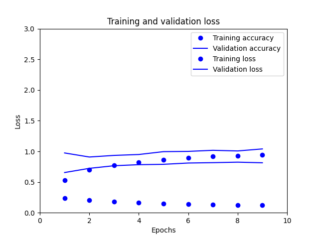

#+CAPTION:Reuters Accuracy
#+LABEL:fig:Reuters-2
#+name: fig:Reuters-2
#+ATTR_LATEX: :width 300
#+ATTR_ORG: :width 300
#+ATTR_HTML: :width 500
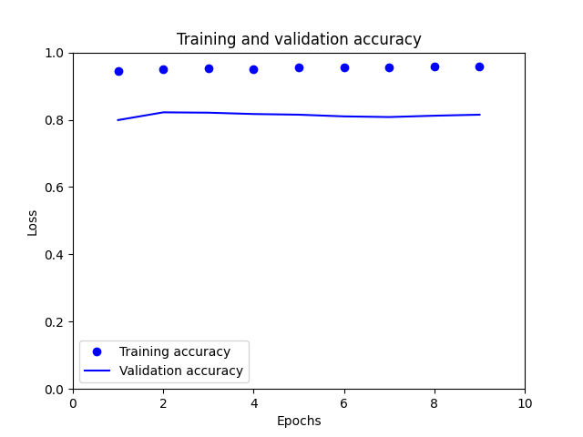

*** 提示（卡住再看，不要一開始就偷看，會折壽）

#+begin_quote
1. =sigmoid= 輸出的是「屬於某一類的機率」，適合二元分類。如果有多個類別，你需要一個能輸出「每個類別各自機率」的函數 → *softmax*
2. =binary_crossentropy= 是給 2 個類別用的損失函數。多個類別要用 → *categorical_crossentropy*
3. 輸出層的神經元數 = 類別數。IMDB 只有 1 個輸出（正或負），Reuters 有 46 個類別，所以需要 → *46 個神經元*
4. 46 個類別比 2 個類別複雜很多，如果隱藏層的神經元太少（例如 16 個），模型會學不好。建議至少 64 個起跳。
#+end_quote

*** 預期輸出

如果你填對了，測試集的 Accuracy 應該在 *0.78 ~ 0.80* 左右。如果你的準確率低於 0.5，很可能是啟動函數或損失函數填錯了，回去檢查一下吧！

*** 參考解答                                                       :noexport:

#+begin_src python -r -n :results output :exports both :session reuters-ans
from keras.datasets import reuters
from tensorflow.keras.utils import to_categorical
import numpy as np

# 載入資料
(train_data, train_labels), (test_data, test_labels) = reuters.load_data(num_words=10000)

# 向量化
def vectorize_sequences(sequences, dimension=10000):
    results = np.zeros((len(sequences), dimension))
    for i, sequence in enumerate(sequences):
        results[i, sequence] = 1.
    return results

x_train = vectorize_sequences(train_data)
x_test = vectorize_sequences(test_data)

one_hot_train_labels = to_categorical(train_labels)
one_hot_test_labels = to_categorical(test_labels)

# 建立模型
from keras import models
from keras import layers

model = models.Sequential()
model.add(layers.Input(shape=(10000,)))
model.add(layers.Dense(64, activation='relu'))
model.add(layers.Dense(64, activation='relu'))
model.add(layers.Dense(46, activation='softmax'))

model.compile(optimizer='rmsprop',
              loss='categorical_crossentropy',
              metrics=['accuracy'])

# 切出驗證集
x_val = x_train[:1000]
partial_x_train = x_train[1000:]
y_val = one_hot_train_labels[:1000]
partial_y_train = one_hot_train_labels[1000:]

# 訓練
history = model.fit(partial_x_train,
                    partial_y_train,
                    epochs=9,
                    batch_size=512,
                    validation_data=(x_val, y_val),
                    verbose=0)

# 評估
results = model.evaluate(x_test, one_hot_test_labels)
print(f"測試集 Loss: {results[0]:.4f}")
print(f"測試集 Accuracy: {results[1]:.4f}")

# 預測
predictions = model.predict(x_test)
print(f"第一筆預測結果: 類別 {np.argmax(predictions[0])}")
print(f"第一筆正確答案: 類別 {np.argmax(one_hot_test_labels[0])}")

# 畫圖
import matplotlib.pyplot as plt

def plot_train_history(hdict, train_key, val_key, ylabel, filename, axis_range=None):
    plt.cla()
    epochs = range(1, len(hdict[train_key]) + 1)
    plt.plot(epochs, hdict[train_key], 'bo', label='Training ' + ylabel.lower())
    plt.plot(epochs, hdict[val_key], 'b', label='Validation ' + ylabel.lower())
    plt.title(f'Training and validation {ylabel.lower()}')
    plt.xlabel('Epochs')
    plt.ylabel(ylabel)
    if axis_range:
        plt.axis(axis_range)
    plt.legend()
    plt.savefig(f"images/{filename}")

history_dict = history.history
plot_train_history(history_dict, 'loss', 'val_loss', 'Loss', 'reuters-1.png', [0, 10, 0, 3])
plot_train_history(history_dict, 'accuracy', 'val_accuracy', 'Accuracy', 'reuters-2.png', [0, 10, 0, 1])
#+end_src

** 迴歸問題：預測房價

前面的 IMDB 和 Reuters 都是分類問題（輸出是「哪一類」），接下來換一個不同類型的問題——迴歸（輸出是「一個數值」）。

本例使用 California Housing 資料集，目標是根據加州各地區的統計數據（如收入中位數、屋齡、人口數等 8 個特徵）來預測該地區的房價中位數（單位：十萬美元）。

*** 準備資料
#+begin_src python -r -n :results output :exports both :session california
from sklearn.datasets import fetch_california_housing  # 從 scikit-learn 載入加州房價資料集
from sklearn.model_selection import train_test_split   # 載入資料分割工具
import numpy as np

housing = fetch_california_housing()                   # 下載並載入資料集
print(f"資料集大小: {housing.data.shape}")              # 看看有幾筆資料、幾個特徵
print(f"特徵名稱: {housing.feature_names}")            # 8 個特徵：收入、屋齡、房間數等等
print(f"目標: 房價中位數（單位：十萬美元）")

# 把資料分成訓練集（80%）和測試集（20%），random_state=42 是為了讓每次分割結果一樣
train_data, test_data, train_targets, test_targets = train_test_split(
    housing.data, housing.target, test_size=0.2, random_state=42)
print(f"訓練集: {train_data.shape}, 測試集: {test_data.shape}")
#+end_src

**** 資料集標準化
各特徵的單位不同（例如收入是萬美元、屋齡是年、人口是人數），直接丟進神經網路會讓某些特徵因為數值較大而主導學習過程。標準化後每個特徵的平均值為 0、標準差為 1，讓所有特徵站在同一起跑線上。

#+begin_src python -r -n :results output :exports both :session california
# 標準化：讓每個特徵的平均值變 0、標準差變 1（讓所有特徵站在同一起跑線）
mean = train_data.mean(axis=0)           # 算出每個特徵的平均值（axis=0 表示沿著「每一行」算）
std = train_data.std(axis=0)             # 算出每個特徵的標準差
train_data = (train_data - mean) / std   # 標準化公式：(原始值 - 平均值) / 標準差
test_data = (test_data - mean) / std     # 測試集也要用「訓練集的」平均值和標準差來標準化（不能偷看測試集）
print("標準化後第一筆資料:", np.round(train_data[0], 3))  # 標準化後數值會落在 -3 ~ 3 左右
#+end_src

*** 建立神經網路
#+begin_src python -r -n :results output :exports both :session california
from keras import models  # 載入模型模組
from keras import layers  # 載入層模組

# 把模型建構包成函式，方便重複使用
def build_model():
    model = models.Sequential()                                    # 順序型模型
    model.add(layers.Input(shape=(train_data.shape[1],)))          # 輸入層：8 個特徵
    model.add(layers.Dense(64, activation='relu'))                 # 隱藏層 1：64 個神經元
    model.add(layers.Dense(64, activation='relu'))                 # 隱藏層 2：64 個神經元
    model.add(layers.Dense(1))      (ref:OneUnitLayer)
    # ↑ 輸出層：1 個神經元，不加啟動函數！因為是迴歸問題，要直接輸出房價數值
    model.compile(optimizer='rmsprop',    # 優化器：RMSprop
                  loss='mse',             # 損失函數：均方誤差（Mean Squared Error）
                  metrics=['mae'])        # 評估指標：平均絕對誤差（Mean Absolute Error）
    return model
#+end_src

注意第[[(OneUnitLayer)]]行：輸出層只有 1 個神經元，而且 *沒有啟動函數* 。跟分類問題比較一下：

| | 分類（IMDB） | 迴歸（California Housing） |
|---+---+---|
| 輸出層啟動函數 | sigmoid / softmax | *無*（線性輸出） |
| 輸出值 | 0~1 之間的機率 | 任意實數（房價） |
| 損失函數 | crossentropy | *mse*（均方誤差） |
| 評估指標 | accuracy | *mae*（平均絕對誤差） |

如果迴歸問題也套 sigmoid，輸出值會被壓在 0~1 之間，房價怎麼可能只在這個範圍？所以迴歸的輸出層不加啟動函數，讓神經網路直接輸出原始數值。
*** 訓練與驗證
#+begin_src python -r -n :results output :exports both :session california
model = build_model()  # 呼叫函式建立模型

# 開始訓練！validation_split=0.2 表示自動從訓練資料中切 20% 當驗證集
history = model.fit(train_data, train_targets,   # 訓練資料和目標值（房價）
                    validation_split=0.2,        # 自動切 20% 做驗證
                    epochs=100,                  # 訓練 100 輪
                    batch_size=32,               # 每批次 32 筆
                    verbose=0)                   # 安靜模式

# 在測試集上評估模型表現（用模型沒看過的資料來測試）
test_mse, test_mae = model.evaluate(test_data, test_targets, verbose=0)
print(f"測試集 MSE: {test_mse:.4f}")   # 均方誤差（越低越好）
print(f"測試集 MAE: {test_mae:.4f}")   # 平均絕對誤差（越低越好）
print(f"→ 平均預測誤差約 {test_mae:.2f} 十萬美元（約 {test_mae*10:.1f} 萬美元）")  # 把 MAE 換算成實際金額
#+end_src

*** 評估結果視覺化
#+begin_src python -r -n :results output :exports both :session california
import matplotlib.pyplot as plt  # 載入繪圖套件

history_dict = history.history   # 取得訓練歷史紀錄

plt.cla()                        # 清除上一張圖
plt.figure(figsize=(12, 4))      # 建立一個寬 12、高 4 的畫布（放兩張子圖剛好）

# 左邊的子圖：Loss (MSE) 曲線
plt.subplot(1, 2, 1)                                     # 1 列 2 欄的第 1 格
plt.plot(history_dict['loss'], label='Training')          # 訓練集的 MSE
plt.plot(history_dict['val_loss'], label='Validation')    # 驗證集的 MSE
plt.title('Loss (MSE)')        # 圖標題
plt.xlabel('Epochs')           # X 軸
plt.ylabel('MSE')              # Y 軸
plt.legend()                   # 顯示圖例

# 右邊的子圖：MAE 曲線
plt.subplot(1, 2, 2)                                     # 1 列 2 欄的第 2 格
plt.plot(history_dict['mae'], label='Training')           # 訓練集的 MAE
plt.plot(history_dict['val_mae'], label='Validation')     # 驗證集的 MAE
plt.title('Mean Absolute Error')
plt.xlabel('Epochs')
plt.ylabel('MAE')
plt.legend()

plt.tight_layout()             # 自動調整子圖間距（避免標題被切掉）
plt.savefig("images/california-housing-train.png", dpi=300)  # 存成高解析度 PNG
print("圖已儲存")
#+end_src

#+CAPTION: California Housing 訓練過程
#+LABEL:fig:CaliforniaHousingTrain
#+name: fig:CaliforniaHousingTrain
#+ATTR_LATEX: :width 500
#+ATTR_ORG: :width 500
#+ATTR_HTML: :width 700
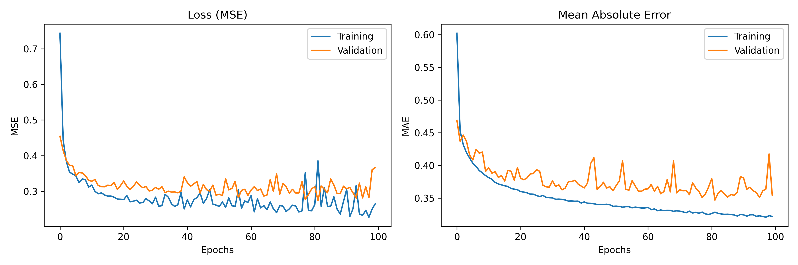

觀察上圖：如果 validation 的 MAE 在某個 epoch 之後開始往上升而 training 繼續下降，就代表模型開始過度配適（overfitting）——模型把訓練資料「背起來了」，但對新資料的預測能力反而變差。

*** 小結

由此範例可知：
- 迴歸問題的輸出層 *不加啟動函數* ，讓模型直接輸出數值。
- 損失函數用 MSE、評估指標用 MAE（而非分類問題的 accuracy）。
- 當輸入特徵的刻度不同時，應先做標準化。

** 圖片識別: MNIST
前面的例子都是處理「數字資料」（文字向量、房價特徵），現在終於要碰 *圖片* 了。MNIST 是手寫數字辨識資料集（0~9），每張圖片是 28×28 像素的灰階影像。

但這裡有個問題：我們目前學的 Dense 層只接受一維向量輸入，而圖片是二維的。最粗暴的做法就是——把圖片「攤平」成一條長長的一維向量（28×28 = 784 個數字），然後丟進 Dense 層。這就像把一張照片剪成 784 條紙條排成一列，再讓模型去猜上面寫了什麼數字。

*** 實作：用神經網路辨識手寫數字
先用最直覺的方式試試看：把圖片攤平、建模型、開始訓練。
**** Import Library
#+BEGIN_SRC python -r -n :results output :exports both :session mnistX :async
from keras.datasets import mnist               # 載入 MNIST 手寫數字資料集
from tensorflow.keras.utils import to_categorical  # 載入 one-hot 編碼工具
import numpy as np

# 載入資料：x 是圖片（28x28 灰階影像），y 是標籤（0~9 的數字）
(x_train, y_train), (x_test, y_test) = mnist.load_data()

# 把 28x28 的二維圖片「攤平」成 784 的一維向量（Dense 層只吃一維輸入）
# reshape 的 -1 表示「自動算」，等同於 28*28 = 784
X_train = x_train.reshape(x_train.shape[0], -1)
# 把標籤做 one-hot 編碼：數字 3 → [0,0,0,1,0,0,0,0,0,0]
Y_train = to_categorical(y_train)

# 測試資料也做一樣的處理
X_test = x_test.reshape(x_test.shape[0], -1)
Y_test = to_categorical(y_test)
#+end_src

#+RESULTS:
**** 建立模型
- Keras的模型有Sequential與Model兩類
- 決定好要設計的模型類別，還要決定模型裡的layer如何堆疊，layer有許多選擇，例如[[https://keras.io/api/layers/][Layer]]的種類就有Dense layer, Activation layer, Conv1D layer, Dropout layer.....
- 決定好layer,還要再選activation function，如 relu, sigmoid, softmax.....
- [[https://keras.io/api/layers/activations/][Keras API reference / Layers API / Layer activation functions ]]
#+BEGIN_SRC python -r -n :results output :exports both :session mnistX :async
from keras.models import Sequential     # 載入順序型模型
from keras.layers import Dense, Input   # 載入全連接層和輸入層
from keras.layers import Dropout        # 載入 Dropout 層（這版還沒用到，先載入備用）

model = Sequential()  # 建立順序型模型
# 一層一層往上疊：
model.add(Input(shape=(28*28,)))                    # 輸入層：784 個數字（28x28 攤平後的結果）
model.add(Dense(units=128,activation='relu'))       # 隱藏層 1：128 個神經元，ReLU 啟動
model.add(Dense(units=64,activation='relu'))        # 隱藏層 2：64 個神經元，ReLU 啟動
model.add(Dense(units=10,activation='softmax'))     # 輸出層：10 個神經元（對應 0~9 十個數字），softmax 輸出機率
model.summary()  # 印出模型架構（看看總共有多少參數要訓練）
#+end_src

#+RESULTS:
#+begin_example
Model: "sequential"
┏━━━━━━━━━━━━━━━━━━━━━━━━━━━━━━━━━━━━━━┳━━━━━━━━━━━━━━━━━━━━━━━━━━━━━┳━━━━━━━━━━
┃ Layer (type)                         ┃ Output Shape                ┃         P
┡━━━━━━━━━━━━━━━━━━━━━━━━━━━━━━━━━━━━━━╇━━━━━━━━━━━━━━━━━━━━━━━━━━━━━╇━━━━━━━━━━
│ dense (Dense)                        │ (None, 128)                 │         1
├──────────────────────────────────────┼─────────────────────────────┼──────────
│ dense_1 (Dense)                      │ (None, 64)                  │
├──────────────────────────────────────┼─────────────────────────────┼──────────
│ dense_2 (Dense)                      │ (None, 10)                  │
└──────────────────────────────────────┴─────────────────────────────┴──────────
 Total params: 109,386 (427.29 KB)
 Trainable params: 109,386 (427.29 KB)
 Non-trainable params: 0 (0.00 B)
#+end_example

藉由model.summary()可以簡略輸出模型的大概架構與所使用的參數總數。

此例中疊了三個Dense層，輸入為每張圖攤平後的784個像素值，第一個隱藏層有128個神經元，第二個隱藏層有64個神經元，最後一層（輸出層）有10個神經元，分別代表10種數字的可能性。
**** 訓練模型
訓練模型時要決定使用何種loss function、使用何種optimizer，可以到官網([[https://keras.io/api/models/model_training_apis/][Model training APIs]])查看有哪些選項可使用以及何種選項適合哪些類型的資料集與問題。
#+BEGIN_SRC python -r -n :results output :exports both :session mnistX :async
# 編譯模型：設定損失函數、優化器、評估指標
model.compile(loss='categorical_crossentropy',   # 多分類問題用 categorical_crossentropy
              optimizer='adam',                   # Adam 優化器（目前最常用的優化器）
              metrics=['accuracy'])               # 追蹤準確率

# 開始訓練！
train_history = model.fit(x=X_train, y=Y_train,  # 訓練資料和標籤
                          validation_split=0.2,   # 自動切 20% 當驗證集
                          epochs=50,              # 訓練 50 輪（有點多，等等會看到過度配適）
                          batch_size=1000,        # 每批次 1000 筆
                          verbose=2)              # verbose=2 表示每個 epoch 印一行摘要
#+end_src

#+RESULTS:
#+begin_example
Epoch 1/50
48/48 - 1s - 27ms/step - accuracy: 0.9686 - loss: 0.1297 - val_accuracy: 0.9424 - val_loss: 0.4813
...略...
Epoch 50/50
48/48 - 1s - 12ms/step - accuracy: 0.9961 - loss: 0.0137 - val_accuracy: 0.9631 - val_loss: 0.4587
#+end_example
**** 查看訓練過程
看一下history的結構
#+BEGIN_SRC python -r -n :results output :exports both :session mnistX :async
print(train_history.history.keys())  # 查看訓練歷史紀錄有哪些指標可以畫圖
#+end_src

#+RESULTS:
: dict_keys(['accuracy', 'loss', 'val_accuracy', 'val_loss'])

#+BEGIN_SRC python -r -n :results output :exports both :session mnistX :async
import matplotlib.pyplot as plt  # 載入繪圖套件

# 繪圖函式：把訓練和驗證的曲線畫在同一張圖上比較
def show_train_history(ylabel,train,test,fn):
    plt.cla()                                   # 清除上一張圖
    plt.plot(train_history.history[train])       # 畫訓練集曲線
    plt.plot(train_history.history[test])        # 畫驗證集曲線
    plt.title('Train History')                  # 圖表標題
    plt.ylabel(ylabel)                          # Y 軸標籤（Accuracy 或 Loss）
    plt.xlabel('Epoch')                         # X 軸標籤
    plt.legend(['train', 'test'], loc='center left')  # 圖例放在左邊中間
    plt.savefig("images/"+fn, dpi=300)          # 存成高解析度圖檔

# 畫 Accuracy 曲線（觀察：訓練和驗證的差距越大 = 越嚴重的過度配適）
show_train_history('Accuracy', 'accuracy','val_accuracy','mnist-acc-val.png')
# 畫 Loss 曲線
show_train_history('Loss', 'loss','val_loss','mnist-loss-val.png')
#+end_src

#+RESULTS:

訓練完就可以透過accuracy與loss來評估模型的效能，可以粗略看出隨著epoch的增加，精確度也隨之提升、loss則隨之下降。
#+CAPTION: MNIST Accuracy
#+LABEL:fig:mnist-accuracy
#+name: fig:mnist-accuracy
#+ATTR_LATEX: :width 300
#+ATTR_ORG: :width 300
#+ATTR_HTML: :width 500
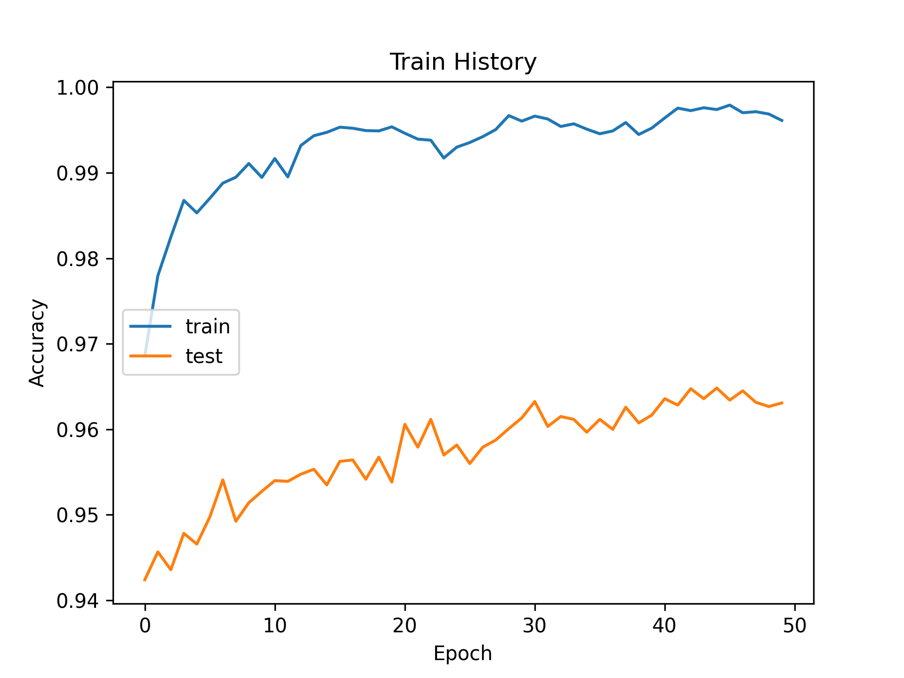

#+CAPTION: MNIST Loss
#+LABEL:fig:mnist-loss
#+name: fig:mnist-loss
#+ATTR_LATEX: :width 300
#+ATTR_ORG: :width 300
#+ATTR_HTML: :width 500
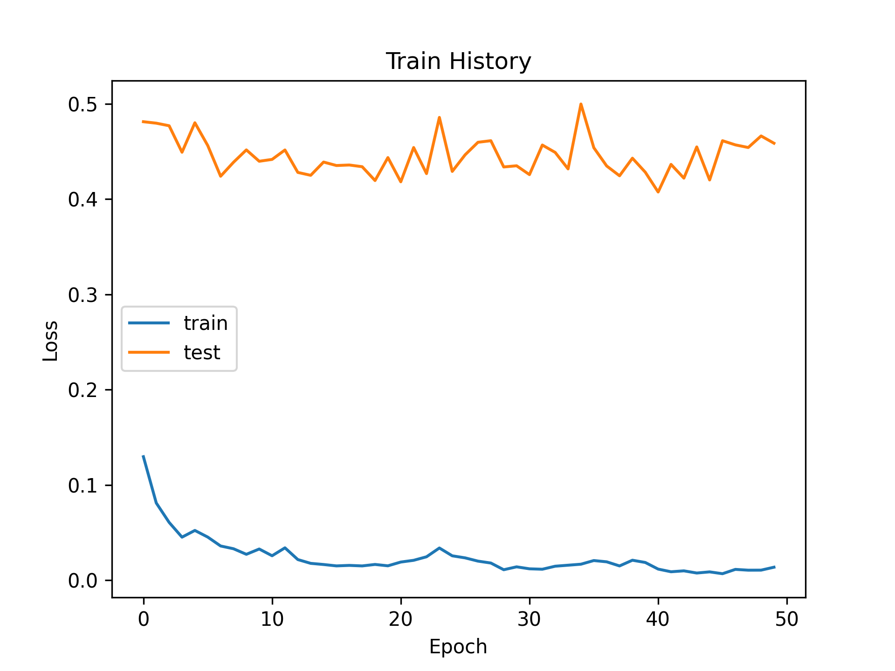
**** 評估模型準確率
#+BEGIN_SRC python -r -n :results output :exports both :session mnistX :async
# 用訓練集評估模型（理論上應該很高，因為模型已經「看過」這些資料了）
score = model.evaluate(X_train, Y_train, batch_size = 200)
print ('\nTrain Acc:', score[1])  # score[0] 是 loss, score[1] 是 accuracy
# 用測試集評估模型（這才是真正的實力，模型從來沒看過測試集）
score = model.evaluate(X_test, Y_test, batch_size = 200)
print ('\nTest Acc:', score[1])   # 如果這個數字比 Train Acc 低很多，就代表過度配適了
#+end_src

#+RESULTS:
: 300/300 ━━━━━━━━━━━━━━━━━━━━ 1s 1ms/step - accuracy: 0.9955 - loss: 0.0254
:
: Train Acc: 0.9897500276565552
: 50/50 ━━━━━━━━━━━━━━━━━━━━ 0s 1ms/step - accuracy: 0.9575 - loss: 0.5729
:
: Test Acc: 0.9627000093460083
**** 實際預測結果
#+BEGIN_SRC python -r -n :results output :exports both :session mnistX
prediction=model.predict(X_test)   # 對所有測試圖片進行預測
print(prediction.shape)            # (10000, 10)：10000 張圖，每張有 10 個類別的機率
print(prediction[:2])              # 印出前兩張圖的預測結果（10 個機率值，加起來 = 1）
#+end_src

#+RESULTS:
: 313/313 ━━━━━━━━━━━━━━━━━━━━ 0s 519us/step
: (10000, 10)
: [[0.0000000e+00 4.8615205e-32 4.4841320e-31 5.9096544e-32 9.9364236e-38
:   5.8718204e-37 0.0000000e+00 1.0000000e+00 0.0000000e+00 3.7505548e-29]
:  [1.0376822e-33 4.1142359e-27 1.0000000e+00 6.7152534e-21 0.0000000e+00
:   0.0000000e+00 0.0000000e+00 0.0000000e+00 1.6477517e-24 0.0000000e+00]]

#+BEGIN_SRC python -r -n :results output :exports both :session mnistX :async
import matplotlib.pyplot as plt
import numpy as np

# 把 one-hot 向量轉回數字（例如 [0,0,0,1,0,...] → 3）
def oneHotDecode(number):
    return np.argmax(number)  # 找出機率最大的位置，就是對應的數字

# 把圖片、正確答案、預測結果一起畫出來，方便一眼看出哪些猜對、哪些猜錯
def plot_images_labels_prediction(images, labels, prediction, num, fn):
    plt.cla()                          # 清除上一張圖
    fig = plt.gcf()                    # 取得目前的畫布
    fig.set_size_inches(10, 14)        # 設定畫布大小

    idx = 0
    for i in range(0, num):            # 畫出指定數量的圖片
        ax=plt.subplot(5, 5, 1+i)     # 排成 5x5 的格子（最多 25 張）
        ax.imshow(images[idx].reshape(28, 28), cmap='binary')  # 把一維向量轉回 28x28 圖片顯示

        # 在每張圖上面標註：正確答案（label）和模型的預測結果（predict）
        ax.set_title("label=" +str(oneHotDecode(labels[idx]))+
                     ",\npredict="+str(np.argmax(prediction[idx]))
                     ,fontsize=10)
        idx+=1
    plt.savefig("images/"+fn, dpi=300, bbox_inches='tight',pad_inches = 0.2)  # 存檔

# 畫出前 20 張測試圖片的預測結果
plot_images_labels_prediction(x_test, Y_test, prediction, 20, 'mnist-predic-perf.png')

#+end_src

#+RESULTS:

最後輸出測試資料集的前20筆資料的圖、label以及預測結果
#+CAPTION: 前20筆測試集預測結果
#+LABEL:fig:mnist-prediction
#+name: fig:mnist-prediction
#+ATTR_LATEX: :width 500
#+ATTR_ORG: :width 500
#+ATTR_HTML: :width 500
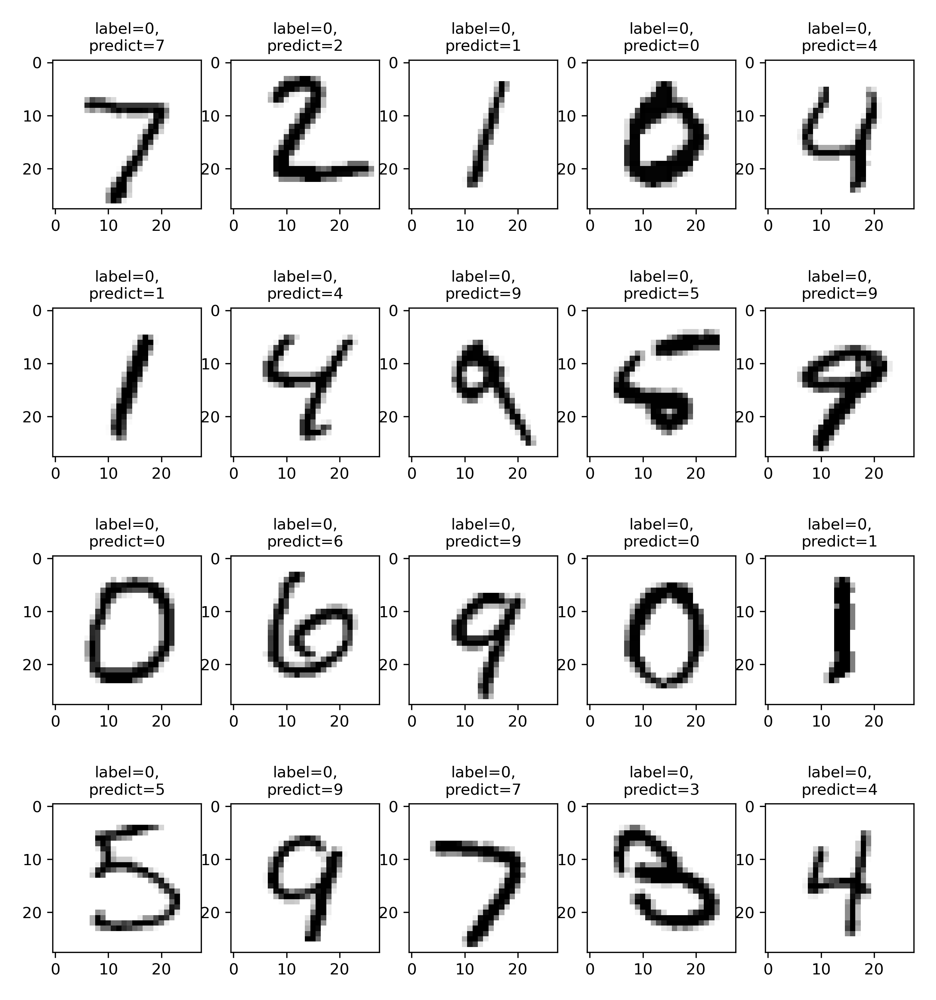

*** 思考：攤平影像丟 Dense 層，真的是好方法嗎？

我們剛才把 28×28 的影像攤平成 784 個數字丟進 Dense 層。這就像把一張照片剪成 784 條紙條排成一列——所有「像素之間的空間關係」都被破壞了。左上角的像素和右下角的像素，對 Dense 層來說只是一串數字中的兩個位置，它根本不知道它們在原圖上離得很遠。

想像一下：如果有人把你的大頭照剪成紙條打亂順序，你還認得出那是誰嗎？Dense 層就是在做這種事，而且它居然還能達到 97% 以上的準確率——手寫數字實在是太簡單了。

但如果換成更複雜的影像（例如貓狗辨識、醫學影像），攤平就行不通了。不信？我們馬上來試。

*** 實證：用 CIFAR-10 戳破 Dense 的天花板

CIFAR-10 也是 Keras 內建的資料集，包含 10 類彩色圖片（飛機、汽車、鳥、貓、鹿、狗、青蛙、馬、船、卡車），每張 32×32 像素、3 個色彩通道。比起 MNIST 那種乾乾淨淨的黑白手寫數字，這才比較接近「真實世界的圖片」。

**** 先看看 CIFAR-10 長什麼樣
#+begin_src python -r -n :results output :exports both :session cifar
from keras.datasets import cifar10
import matplotlib.pyplot as plt
import numpy as np
import ssl
(x_train, y_train), (x_test, y_test) = cifar10.load_data()

# CIFAR-10 的 10 個類別名稱
class_names = ['飛機', '汽車', '鳥', '貓', '鹿', '狗', '青蛙', '馬', '船', '卡車']

print(f"訓練集: {x_train.shape}")   # (50000, 32, 32, 3)：5 萬張 32x32 彩色圖
print(f"測試集: {x_test.shape}")    # (10000, 32, 32, 3)

# 隨機挑 10 張圖出來看看
plt.close('all')
fig, axes = plt.subplots(2, 5, figsize=(10, 4))
for i, ax in enumerate(axes.flat):
    ax.imshow(x_train[i])
    ax.set_title(class_names[y_train[i][0]], fontsize=12)
    ax.axis('off')
plt.tight_layout()
plt.savefig("images/cifar10-samples.png", dpi=150)
print("圖已儲存")
#+end_src

#+RESULTS:
#+CAPTION: CIFAR-10 樣本圖片
#+name: fig:cifar10-samples
#+ATTR_LATEX: :width 500
#+ATTR_ORG: :width 500
#+ATTR_HTML: :width 600
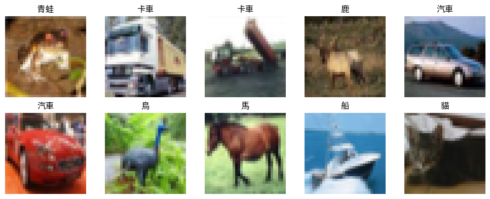

跟 MNIST 比一下：MNIST 每張圖是 28×28×1 = 784 個數字，CIFAR-10 每張圖是 32×32×3 = 3072 個數字，複雜度差了好幾倍。

**** 用 MNIST 同款的 Dense 模型來挑戰 CIFAR-10
我們直接把 MNIST 版本二那個效果不錯的架構（128 → 64 → 10）搬過來用，唯一的差別是輸入從 784 變成 3072：

#+begin_src python -r -n :results output :exports both :session cifar
from keras import models, layers
from tensorflow.keras.utils import to_categorical

# 攤平 + 正規化（跟 MNIST 一模一樣的套路）
X_train = x_train.reshape(x_train.shape[0], -1).astype('float32') / 255
X_test = x_test.reshape(x_test.shape[0], -1).astype('float32') / 255
Y_train = to_categorical(y_train, 10)
Y_test = to_categorical(y_test, 10)

print(f"攤平後的輸入維度: {X_train.shape[1]}")  # 3072

# 建立跟 MNIST 一樣的 Dense 模型
model = models.Sequential()
model.add(layers.Input(shape=(3072,)))              # 輸入：3072 維（32×32×3 攤平）
model.add(layers.Dense(128, activation='relu'))     # 隱藏層 1：128 神經元
model.add(layers.Dense(64, activation='relu'))      # 隱藏層 2：64 神經元
model.add(layers.Dense(10, activation='softmax'))   # 輸出層：10 個類別

model.compile(loss='categorical_crossentropy', optimizer='adam', metrics=['accuracy'])

# 訓練（用跟 MNIST 版本二一樣的設定）
history = model.fit(X_train, Y_train, batch_size=100, epochs=20,
                    validation_split=0.2, verbose=1)

# 評估
score = model.evaluate(X_test, Y_test, verbose=0)
print(f"\n測試集準確率: {score[1]:.4f}")
print(f"（MNIST 同架構的測試集準確率: 0.9765）")
print(f"（隨機亂猜 10 類的準確率: 0.1000）")
#+end_src

**** 視覺化比較
#+begin_src python -r -n :results output :exports both :session cifar
import matplotlib.pyplot as plt

plt.close('all')
fig, (ax1, ax2) = plt.subplots(1, 2, figsize=(12, 4))

# Loss 曲線
ax1.plot(history.history['loss'], label='Training')
ax1.plot(history.history['val_loss'], label='Validation')
ax1.set_title('CIFAR-10 Dense Model - Loss')
ax1.set_xlabel('Epochs')
ax1.set_ylabel('Loss')
ax1.legend()

# Accuracy 曲線
ax2.plot(history.history['accuracy'], label='Training')
ax2.plot(history.history['val_accuracy'], label='Validation')
ax2.set_title('CIFAR-10 Dense Model - Accuracy')
ax2.set_xlabel('Epochs')
ax2.set_ylabel('Accuracy')
ax2.legend()

plt.tight_layout()
plt.savefig("images/cifar10-dense-result.png", dpi=150)
print("圖已儲存")
#+end_src

#+CAPTION: CIFAR-10 用 Dense 模型的訓練結果
#+name: fig:cifar10-dense
#+ATTR_LATEX: :width 500
#+ATTR_ORG: :width 500
#+ATTR_HTML: :width 700
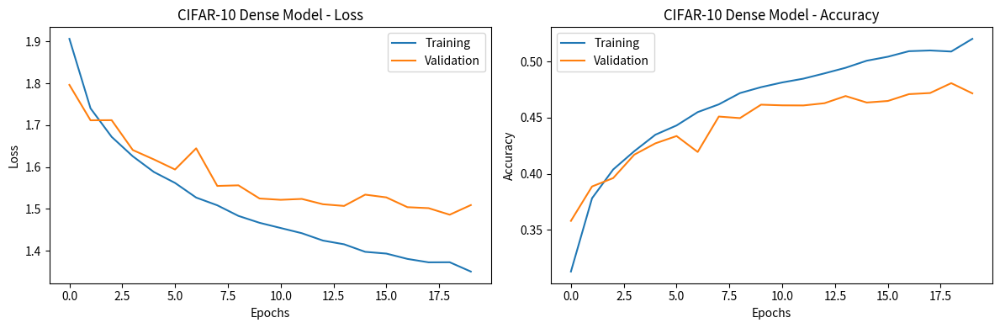

**** 結果分析

| 資料集 | 模型架構 | 測試準確率 |
|--------+----------+----------|
| MNIST  | Dense (128→64→10) | ~97.6%   |
| CIFAR-10 | Dense (128→64→10) | ~47%     |

同一個模型，MNIST 上表現優異，CIFAR-10 上卻慘不忍睹。為什麼？

1. *空間資訊被破壞*：攤平後，「貓的眼睛在鼻子上方」這種空間關係全部消失。MNIST 的數字形狀簡單到靠「哪些像素亮了」就能猜出來，但真實圖片不行。
2. *參數量爆炸但沒效率*：Dense(128) 在 MNIST 要學 784×128 ≈ 10 萬個參數，在 CIFAR-10 要學 3072×128 ≈ 39 萬個參數。參數變多了，但學到的全是「第 N 號像素亮不亮」這種低層次資訊，完全沒有「邊緣」「紋理」「形狀」的概念。
3. *沒有平移不變性*：一隻貓出現在圖片左上角和右下角，對 Dense 來說是完全不同的輸入。但對人類（和 CNN）來說，那明明就是同一隻貓。

我們需要一種能「看懂圖片空間結構」的神經網路——這就是下一章要介紹的[[id:20221023T101414.457264][卷積神經網路（CNN）]]。CNN 用滑動的濾波器掃描圖片，不管特徵出現在哪個位置都能偵測到，而且參數量遠比 Dense 少。同樣的 CIFAR-10 資料集，簡單的 CNN 就能把準確率從 47% 拉到 70% 以上。

* Footnotes

[fn:1][[https://kknews.cc/zh-tw/tech/b4zkbom.html][主流的深度學習模型有哪些？]]

[fn:2] [[https://medium.com/nerd-for-tech/vgg-16-easiest-explanation-12453b599526][VGG 16 Easiest Explanation]]

[fn:3] [[https://towardsdatascience.com/extract-features-visualize-filters-and-feature-maps-in-vgg16-and-vgg19-cnn-models-d2da6333edd0][Extract Features, Visualize Filters and Feature Maps in VGG16 and VGG19 CNN Models]]

[fn:4] [[https://medium.com/image-processing-and-ml-note/inception-v1-googlenet-winner-of-ilsvrc-2014-image-classification-15b1ea62cc11][Inception-v1 (GoogLeNet) — Winner of ILSVRC 2014 (Image Classification)]]

[fn:5] [[https://medium.com/ai-blog-tw/deep-learning-residual-leaning-%E8%AA%8D%E8%AD%98resnet%E8%88%87%E4%BB%96%E7%9A%84%E5%86%A0%E5%90%8D%E5%BE%8C%E7%B9%BC%E8%80%85resnext-resnest-6bedf9389ce][Residual Learning: 認識ResNet與他的冠名後繼者ResNeXt、ResNeSt]]

[fn:6][[https://medium.com/@rossleecooloh/%E7%9B%B4%E8%A7%80%E7%90%86%E8%A7%A3resnet-%E7%B0%A1%E4%BB%8B-%E8%A7%80%E5%BF%B5%E5%8F%8A%E5%AF%A6%E4%BD%9C-python-keras-8d1e2e057de2][直觀理解ResNet —簡介、 觀念及實作(Python Keras)]]

[fn:7] [[https://arxiv.org/pdf/1512.03385.pdf][Deep Residual Learning for Image Recognition]]

[fn:8] [[http://tkdbooks.com/PC14110][台科大資訊科技]]

[fn:9] [[https://www.baeldung.com/cs/cost-vs-loss-vs-objective-function][Difference Between the Cost, Loss, and the Objective Function]]
