:PROPERTIES:
:ID:       20221023T101456.955364
:ROAM_ALIASES: Machine Learning
:END:
#+title: 機器學習

#+INCLUDE: ../pdf.org
#+TAGS: AI, Machine Learning
#+OPTIONS: toc:2 ^:nil num:5
#+OPTIONS: H:4
#+PROPERTY: header-args :eval never-export
#+HTML_HEAD: <link rel="stylesheet" type="text/css" href="../css/muse.css" />
#+HTML_HEAD_EXTRA: 
#+EXCLUDE_TAGS: noexport
#+begin_export html

#+end_export

* 機器學習
** 簡介
- 機器學習是[[id:20221023T101138.945879][人工智慧]]的一個分支，在[[id:20221023T101138.945879][人工智慧]]的研究歷史有著一條從以「推理」為重點，到以「知識」為重點，再到以 「學習」為重點的自然、清晰的脈絡。
- 機器學習是實現[[file:AI-Introduction.org][人工智慧]]的方法之一，機器學習理論主要是設計和分析一些讓電腦可以自動「學習」 的演算法。機器學習演算法是一類從資料中自動分析獲得規律，並利用規律對未知資料進行預測的演算法。
- 機器學習已廣泛應用於資料探勘、電腦視覺、自然語言處理、
- 生物特徵辨識、搜尋引擎、醫學診斷、檢測信用卡欺詐、證券市場分析、DNA 序列測序、語音和手寫辨識、戰略遊戲和機器人等領域
- 機器學習就是從一組function中找出一個最合適的function的過程[李宏毅]。

** 機器學習的類型
機器學習可以大致分為三類：[[id:20221023T101626.420918][監督式學習]]、[[id:20221023T101716.467694][非監督式學習]]、[[id:0a5c37c0-741a-4a1a-bec7-f98074830132][增強式學習]]，如圖[[fig:DifferentLearningTypes]][fn:1]。

#+BEGIN_SRC ditaa :file images/MLTypes.png  :cmdline -r -s 1
                               +-------------------------------+
   +---------------------------+ Labeled Data                  |
   | 1. Supervised Learning    | Direct feedback               |
   +---------------------------+ Predict outcome / future      |
                               +-------------------------------+

                               +-------------------------------+
   +---------------------------+ No labels / targets           |
   | 2. Unsupervised Learning  | No feedback                   |
   +---------------------------+ Find hidden structure in data |
                               +-------------------------------+

                               +-------------------------------+
   +---------------------------+ Decision process              |
   | 3. Reinforcement Learning | Reward system                 |
   +---------------------------+ Learn series of actions       |
                               +-------------------------------+
#+END_SRC
#+CAPTION: 三種不同的機器學習
#+name: fig:DifferentLearningTypes
#+ATTR_LATEX: :width 500
#+ATTR_ORG: :width 500
#+ATTR_HTML: :width 700
#+RESULTS:
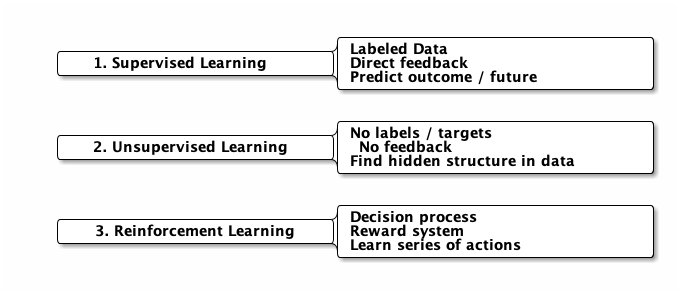
#+latex:\newpage

* 機器學習如何解決問題
有一個用來描述直線的函數(模型): $y=wx+b$，直線上的每個點都可以用 $x$ 值乘以$w$(權重值)再加上$b$(偏差值)，得到相應的 $y$ 值。

問題：假設直線上有兩個點，分別是 $x=2, y=3$ 和 $x=3, y=5$ (如圖[[fig:LinearQuestion]])，那麼，請問當 $x=10$ 時，$y$ 的值是多少呢？
#+begin_src python -r -n :results output :exports none
import matplotlib.pyplot as plt
import numpy as np

x = [2, 3]
y = [3, 5]
plt.plot(x, y, '-*')
plt.xlim(0, 12)
plt.ylim(0, 20)
plt.xlabel('$x$', fontsize=15)
plt.ylabel('$y$', fontsize=15)

# 畫紅點
plt.plot(10, 19, 'ro', markersize=8)

# 註解紅點
plt.text(10.2, 19-0.3, '(10, ?)', color='red', fontsize=15)

plt.text(2.5, 3-0.5, '(2, 3)', fontsize=15)
plt.text(3.5, 5-0.5, '(3, 5)', fontsize=15)
plt.savefig('images/TrandPlot.png', dpi=300)
#+end_src

#+RESULTS:
#+CAPTION: 一個直線函數問題
#+LABEL: fig:Labl
#+name: fig:LinearQuestion
#+ATTR_LATEX: :width 300
#+ATTR_ORG: :width 300
#+ATTR_HTML: :width 500
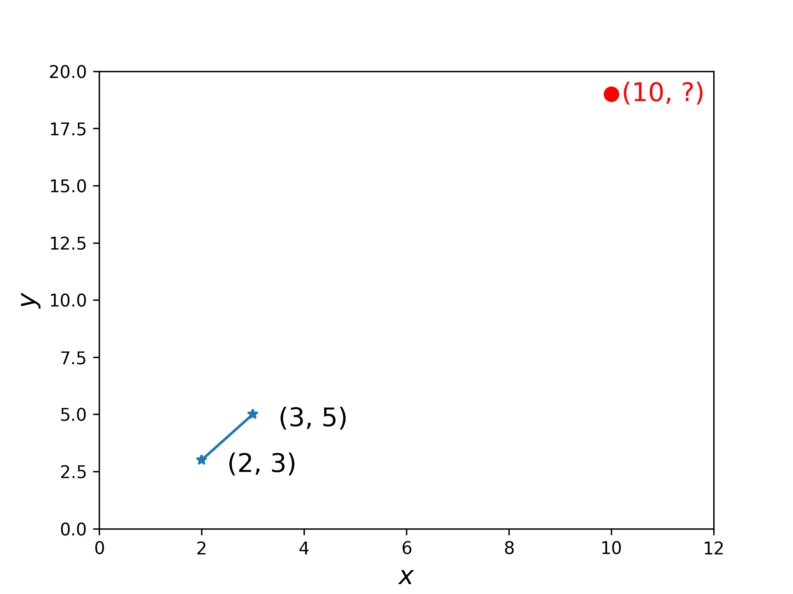
** 傳統程式設計的解題模式
以下是傳統的程式設計模式，受了十數年高深數學教育的你，第一反應大概是會想先求出連接這兩個點的直線所相應的 $w$ 值與 $b$ 值(也就是模型中的兩個參數)。
*** 解法2: class版 :noexport:
看不懂的可以看底下的tuple版
#+begin_src python -r -n :results output :exports both
def get_slope(p1, p2):
    w = (p2.y - p1.y) / (p2.x - p1.x)
    return w

def get_bias(p1, w):
    b = p1.y - (w*p1.x)
    return b

def get_y(x, w, b):
    y = w*x + b

from dataclasses import dataclass
@dataclass
class Point:
    x: float
    y: float

p1 = Point(2, 3)
p2 = Point(3, 5)

w = get_slope(p1, p2)
b = get_bias(p1, w)

print("Slope:", w)
print("Bias:", b)
print(f'當x=10時，y={w}*10+{b}={w*10+b}')
#+end_src

#+RESULTS:
: Slope: 2.0
: Bias: -1.0
: 當x=10時，y=2.0*10+-1.0=19.0
*** 解法
#+begin_src python -r -n:results output :exports both
def get_slope(p1, p2):
    p1x, p1y = p1 #取出tuple中的(x, y)
    p2x, p2y = p2 #取出tuple中的(x, y)
    w = (p2y - p1y) / (p2x - p1x)
    return w

def get_bias(p1, w):
    p1x, p1y = p1 #取出tuple中的(x, y)
    b = p1y - (w*p1x)
    return b

def get_y(x, w, b):
    y = w*x + b

# 以tuple來描述(x, y)
p1 = (2, 3)
p2 = (3, 5)

w = get_slope(p1, p2)
b = get_bias(p1, w)

print("Slope:", w)
print("Bias:", b)
print(f'當x=10時，y={w}*10+{b}={w*10+b}')
#+end_src

#+RESULTS:
: Slope: 2.0
: Bias: -1.0
: 當x=10時，y=2.0*10+-1.0=19.0

由以上的程式碼可以看出傳統的解題模式如圖[[fig:solution-1]]，其解題策略為：
1. 給資料(兩個點)
2. 給規則(公式)
接下來就以程式來解出答案。
#+BEGIN_SRC ditaa :file images/TradProg.png  :cmdline -r -s 0.9
              +-----------------+
     Rules    |                 |
   ---------->|   Traditional   |   Answers
     Data     |   Programming   +------------>
   ---------->|      cBLK       |
              +-----------------+
#+END_SRC
#+CAPTION: 傳統程式設計的解題模式
#+LABEL:fig:solution-1
#+name: fig:solution-1
#+ATTR_LATEX: :width 300
#+ATTR_ORG: :width 300
#+ATTR_HTML: :width 500
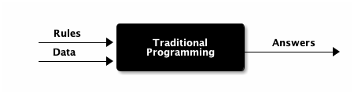

那麼，面臨一樣的問題，機器學習的解題策略又是如何呢？

** 機器學習的策略
機器學習與傳統程式設計的解題策略有以下兩點不同：
- 傳統的程式設計pattern是將資料及規則餵給程式，經由程式判斷(if-else)產生答案
- Meachine learning是將資料(features)和答案(label)餵給model，然後由model學習出規則

事實上，機器學習的解題策略是分成兩階段的：訓練階段(Training Phase)和推論階段(Inference Phase)，如圖[[fig:TPIP]]所示：
- 訓練階段(Training Phase)：將資料(features)和答案(label)餵給模型(model)，讓模型學習出規則(也就是找出最佳的參數值)；
- 推論階段(Inference Phase)：此時模型已訓練完成，我們只需要將資料(features)餵給模型(model)，就能得到預測結果(predictions)。
#+BEGIN_SRC ditaa :file images/TPIP.png  :cmdline -r -s 0.8
Training Phase
-=------------
              +-----------------+
     Answers  |                 |
   ---------->|     Machine     |   Rules
     Data     |     Learning    +------------>
   ---------->|      cGRE       |
              +-----------------+

Inference Phase
-=-------------
              +-----------------+
              |                 |
     Data     |                 | Predictions
   ---------->|      Model      +------------>
              |      c1AB       |
              +-----------------+
#+END_SRC

#+CAPTION: Training and Inference Phase of ML
#+name: fig: TPIP
#+LABEL:fig:TPIP
#+ATTR_HTML: :width 500
#+ATTR_LATEX: :width 300
#+ATTR_ORG: :width 300
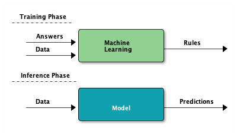

機器學習將這個線性函數當成一個模型，而我們想求的 $w$ 和 $b$ 則為模型的兩個參數。機器學習訓練模型的策略大致如下：
1. 第一步：猜答案
   一開始我們並不知道正確答案是什麼，所以用猜的：以隨機亂數來做為 $w$ 和$b$ 值，例如：$y=10x+5$。
2. 第二步：評估猜測答案的品質
   上個步驟中所猜的 $w$ 和$b$ 值夠不夠準確呢？我們可以用$y=10x+5$ 這個函數來計算出每個 $x$ 值相對應的 $y$ 值，再和 *正確* 的 $y$ 值比較，看看還差多少。這個比較的方式稱為「損失」(loss)或「誤差」(error)。
3. 第三步：對所猜測的策略進行最佳化調整
   依據上一步驟猜測結果的品質(loss或error)做出更好的猜測，這個步驟稱為「最佳化」(optimization)。微積分可以用「梯度遞減」(gradient descent)的方式來進行。

整個訓練流程大致如下：
#+BEGIN_SRC ditaa :file images/MLProg.png  :cmdline -r -s 0.9
   +-----------------+    +-----------------------------+    +-----------------+
   |                 |    |                             |    |                 |
   | 1. Guess Answer |--->| 2. Evaluate precision(loss) |--->| 3. Optimization |
   |                 |    |                             |    |                 |
   +-----------------+    +-----------------------------+    +-----------------+
            ^                                                          |
            |                                                          |
            +----------------------------------------------------------+
#+END_SRC
#+CAPTION: 機器學習訓練模型的流程
#+LABEL:fig:Labl
#+name: fig:Name
#+ATTR_LATEX: :width 300
#+ATTR_ORG: :width 300
#+ATTR_HTML: :width 500
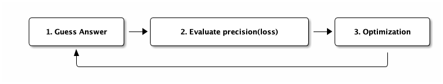

*** 實作1
我們來實作一下這個機器學習的解題策略，首先，我們先用兩個點(2, 3)和(3, 5)來訓練一個模型，然後用這個模型來預測 $x=10$ 時的 $y$ 值(也就是 $\hat{y}$ )，整個模型的訓練過程如圖[[fig:solution-2]]所示，最終目的是希望這個模型在訓練完成後，輸入 $x$ 值到模型中就能得到一個非常接近正確答案19的結果。
#+begin_src plantuml :file images/mldemo-1.png
@startuml
 left to right direction
 state x: 10
 state 已訓練模型 {
 state 訓練資料 {
 state Xs #palegreen : [2.0, 3.0]
 state Ys #palegreen : [3.0, 5.0]
 }
 state 模型 {
 state l0 #lightgray : 黑盒子
 }
 Xs --> l0
 Ys --> l0
 }
 state 預測結果 {
 state y #lightyellow: 14.709847
 }
 x --> 已訓練模型
 已訓練模型 --> y
 note top of 預測結果: 正確答案:19
@endum
#+end_src

#+RESULTS:
#+CAPTION: 第一版機器學習模型訓練流程圖
#+LABEL:fig:solution-2
#+name: fig:solution-2
#+ATTR_LATEX: :width 400
#+ATTR_ORG: :width 400
#+ATTR_HTML: :width 500
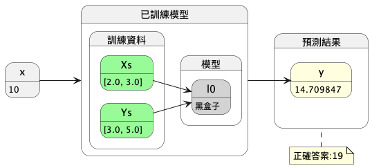

這是我們的第一版模型對應的程式，訓練資料只有兩個點(2, 3)和(3, 5)，我們希望這個模型能夠預測 $x=10$ 時的 $y$ 值，並且接近正確答案19。
#+begin_src python -r -n :results output :exports both
import tensorflow as tf
import numpy as np
from tensorflow.keras import Sequential
from tensorflow.keras.layers import Dense

l0 = Dense(units=1, input_shape=[1])        (ref:neuron)
model = Sequential([l0])                    (ref:model)
model.compile(optimizer='sgd', loss='mean_squared_error') (ref:modelCompile)

xs = np.array([2.0, 3.0], dtype=float)
ys = np.array([3.0, 5.0], dtype=float)

model.fit(xs, ys, epochs=500, verbose=0)    (ref:modelFit)

print(f'y的預測結果為: {model.predict([10.0])}')    (ref:modelPredict)
print("模型的兩個參數w,b: {}".format(l0.get_weights()))  (ref:modelWeights)
#+end_src

#+RESULTS:
: 1/1 [==============================] - 0s 172ms/step
: y的預測結果為: 14.709847
: 模型的兩個參數w, b: [array([[1.4212971]], dtype=float32), array([0.49687672], dtype=float32)]

但是正確答案為19，預測的結果好像不太準....QQ

**** 程式解說
1. 上述程式使用tensorflow這個模組為主要預測工具，建立了一個模型(第[[(model)]]行)，這個模型中只有一層、裡面有一個神經元(第[[(neuron)]]行)
2. 定義好模型後，我們以SGD(隨機梯度下降法)為優化器、用它來找出最佳參數；以MSE(均方差)做為損失函數，計算模型訓練過程中生成的參數優劣判斷標準(第[[(modelCompile)]]行)，並編譯此模型
3. 編譯好模型，我們就拿手僅有的5組資料來訓練模型，訓練500回(第[[(modelFit)]]行)
4. 訓練好的模型就能拿來預測了，我們拿 $x=10$ 當成預測資料，要求模型給出預測的結果 $y$ (第[[(modelPredict)]]行)
5. 偷偷看一下這個模型給出答案的關鍵、也就是模型的兩個參數(Weight)(第[[(modelWeights)]]行)
#+latex:\newpage

*** 實作2
如果我們向上帝偷偷多要一個模型的參照點(4, 7)，以三點當成標準答案來進行預測，結果會不會好一點呢?
#+begin_src plantuml :file images/mldemo-2.png
@startuml
 left to right direction
 state x: 10
 state 已訓練模型 {
 state 訓練資料 {
 state Xs #palegreen : [2.0, 3.0, 4.0]
 state Ys #palegreen : [3.0, 5.0, 7.0]
 }
 state 模型 {
 state l0 #lightgray : 黑盒子
 }
 Xs --> l0
 Ys --> l0
 }
 state 預測結果 {
 state y #lightyellow: 17.07221
 }
 x --> 已訓練模型
 已訓練模型 --> y
 note top of 預測結果: 正確答案:19
@endum
#+end_src
#+CAPTION: 第二版機器學習模型訓練流程圖
#+LABEL:fig:solution-3
#+name: fig:solution-3
#+ATTR_LATEX: :width 400
#+ATTR_ORG: :width 400
#+ATTR_HTML: :width 500
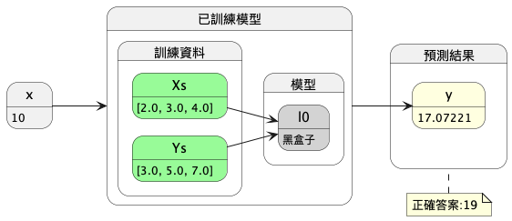

這是我們的第二版模型對應的程式，訓練資料有三個點(2, 3)、(3, 5)和(4, 7)：
#+begin_src python -r -n :results output :exports both
import tensorflow as tf
import numpy as np
from tensorflow.keras import Sequential
from tensorflow.keras.layers import Dense

l0 = Dense(units=1, input_shape=[1])
model = Sequential([l0])
model.compile(optimizer='sgd', loss='mean_squared_error')

xs = np.array([2.0, 3.0, 4.0], dtype=float)
ys = np.array([3.0, 5.0, 7.0], dtype=float)

model.fit(xs, ys, epochs=500, verbose=0)

print(f'y的預測結果為: {model.predict([10.0])}')
print("模型的兩個參數w,b: {}".format(l0.get_weights()))
#+end_src

#+RESULTS:
: y的預測結果為: [[17.07221]]
: 模型的兩個參數w,b: [array([[1.7164488]], dtype=float32), array([-0.09227743], dtype=float32)]

- 預測結果y的值為17.072221，而正確答案為19，是比第一版好一點了....-_-
- 兩個參數的值為(1.7164488, -0.9227743)，與正確答案(2, -1)相近。

*** 實作3
讓我們壯起膽子再跟上帝多要兩個線上的點:(-1, -3)、(0, -1)，以五點當成標準答案來進行預測(如圖[[fig:solution-4]])：
#+begin_src plantuml :file images/mldemo-3.png
@startuml
 left to right direction
 state x: 10
 state 已訓練模型 {
 state 訓練資料 {
 state Xs #palegreen : [-1.0, 0.0, 2.0, 3.0, 4.0]
 state Ys #palegreen : [-3.0, -1.0, 3.0, 5.0, 7.0]
 }
 state 模型 {
 state l0 #lightgray : 黑盒子
 }
 Xs --> l0
 Ys --> l0
 }
 state 預測結果 {
 state y #lightyellow: 18.979391
 }
 x --> 已訓練模型
 已訓練模型 --> y
 note top of 預測結果: 正確答案:19
@endum
#+end_src
#+CAPTION: 第三版機器學習模型訓練流程圖
#+LABEL:fig:solution-4
#+name: fig:solution-4
#+ATTR_LATEX: :width 400
#+ATTR_ORG: :width 400
#+ATTR_HTML: :width 500
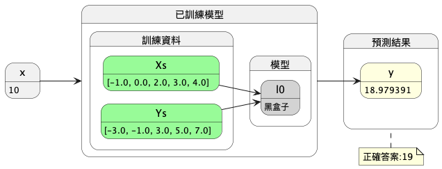

第三版的實作程式碼如下：
#+begin_src python -r -n :results output :exports both
import tensorflow as tf
import numpy as np
from tensorflow.keras import Sequential
from tensorflow.keras.layers import Dense

l0 = Dense(units=1, input_shape=[1])
model = Sequential([l0])
model.compile(optimizer='sgd', loss='mean_squared_error')

xs = np.array([-1.0, 0.0, 1.0, 2.0, 3.0, 4.0], dtype=float)
ys = np.array([-3.0, -1.0, 1.0, 3.0, 5.0, 7.0], dtype=float)

model.fit(xs, ys, epochs=500, verbose=0)

print(f'y的預測結果為: {model.predict([10.0])}')
print("模型的兩個參數w,b: {}".format(l0.get_weights()))
#+end_src

#+RESULTS:
: y的預測結果為:[[18.979391]]
: 模型的兩個參數w,b: [array([[1.9970131]], dtype=float32), array([-0.99074], dtype=float32)]

模型對 $y$ 的預測結果為18.979391，與正確答案19已經十分相近。

* 機器學習的類型
:PROPERTIES:
:ID:       20221023T110646.714031
:END:
#+CAPTION: AI, Machine Learning與Deep Learning
#+LABEL:fig:Labl
#+name: fig:Name
#+ATTR_LATEX: :width 300
#+ATTR_ORG: :width 300
#+ATTR_HTML: :width 500
[[file:images/AI,_Machine_Learning與Deep_Learning/2024-02-19_16-24-48_2024-02-19_16-23-09.png]]

#+CAPTION: 機器學習的類型
#+LABEL:fig:Labl
#+name: fig:Name
#+ATTR_LATEX: :width 300
#+ATTR_ORG: :width 300
#+ATTR_HTML: :width 500
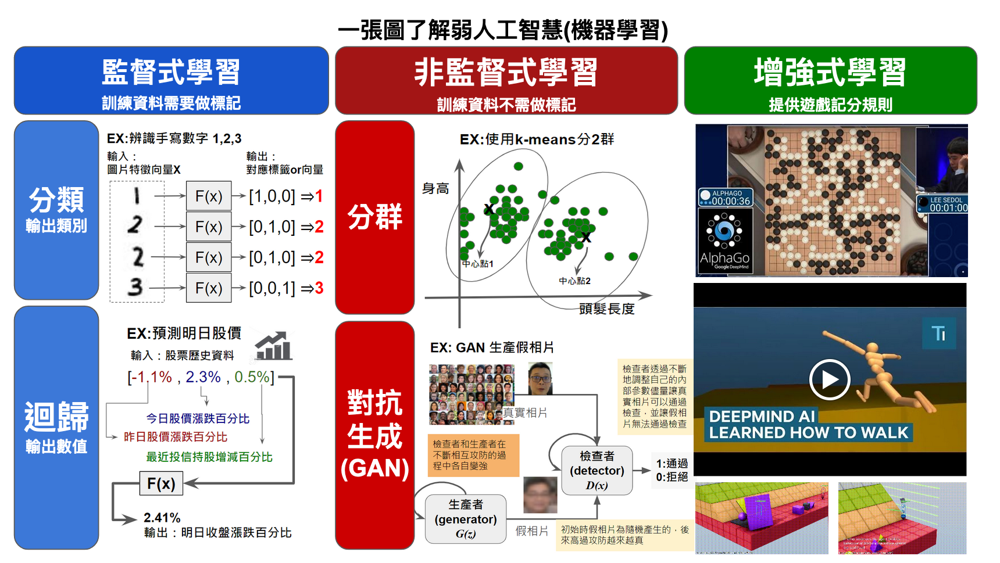

#+CAPTION: 監督、非監督、半監督
#+LABEL:fig:Labl
#+name: fig:semi
#+ATTR_LATEX: :width 300
#+ATTR_ORG: :width 300
#+ATTR_HTML: :width 500
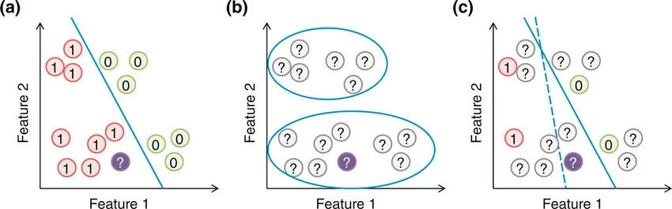

** [[id:20221023T101626.420918][監督式學習]](Supervised learning)
#+CAPTION: 監督式學習流程圖
#+name: fig:FlowChartOfSupervisedLearning
#+ATTR_LATEX: :width 300
#+ATTR_ORG: :width 300
#+ATTR_HTML: :width 500
#+Results:
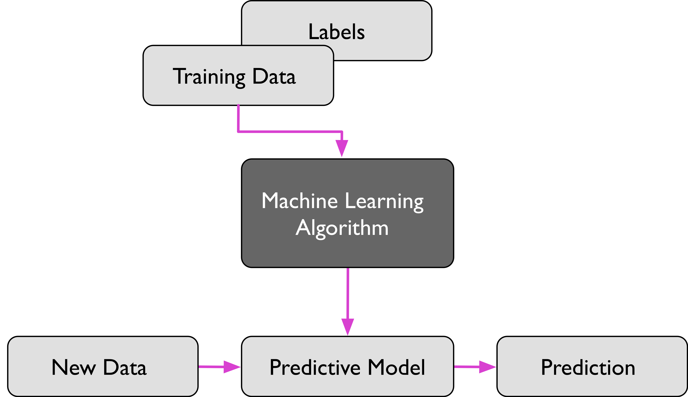
- [[id:20221023T101626.420918][監督式學習]]指在訓練過程中直接告訴機器答案，也就是將資料進行標註(label:人力標註)，例如，在 1000 張訓練集照片中標註「貓/狗」。目前九成以上的機器學習應用均屬此類。
- 監督學習的訓練集要求是包括輸入和輸出， 也可以說是特徵和目標。做法是從給定的訓練資料集中學習出一個函式，當新的資料到來時，可以根據這個函式預測結果。
- 為迄今為止最常見的機器學習，泛指一群的機器學習演算法，是從一組「已標記」的「訓練數據集」(training dataset)來學習(訓練)，並導出模型。然後，以此一模型對「未標記」的類似數據進行預測分類，其運作流程如圖[[fig:FlowChartOfSupervisedLearning]][fn:1]所示。典型的例子為早期電子郵件的垃圾信件是讓使用者先去標記某些信為垃圾郵件，然後藉由這些被標記的郵件來推論找出其他可能的垃圾郵件；由此看來，我們以為 Gmail 很好心的提供給我們為信件加註「垃圾」、「廣告」的功能，其實是 Google 利用我們當免費勞工為他們提供信件加註標籤的工作。
*** 方法
- 分類: 最短距離分類器、KNN分類器、決策樹
- 類神經網路
- 單純貝氏分類器(Naive Bayes Classifier)
- 邏輯迴歸(Logisitc Regression)
- 決策樹(Decision tree)
- 支援向量機(SVM, Support Vector Machine)
*** 典型應用
- Credit/loan approval:信用評比與貸款通過
- Medical diagnosis: if a tumor is cancerous or benign(是否有 XX 癌症)
- Fraud detection: if a transaction is fraudulent 詐騙或正常交易
- 垃圾郵件(SPAM)或正常郵件
- Web page categorization 網站分類: which category it is
- 資安應用: 取得有漏洞程式碼資料集(label)，評估其他程式是否有漏洞
*** 類型：
**** 分類
基於從訓練集資料觀測到的分類類別來標籤、預測新數據的類別，如上述的垃圾郵件即為典型的二元分類工作(如圖[[fig:01_03]])，類別分類工作也可以進行「多類別分類」(multi-class classification)，如典型的 MNist 手寫數字辨識，即是將手寫的 0-9 數字進行預測辨識，並給出一個 0-9 的類別標籤。
#+CAPTION: 典型的分類
#+name: fig:01_03
#+ATTR_LATEX: :width 200
#+ATTR_ORG: :width 200
#+ATTR_HTML: :width 300
#+RESULTS:
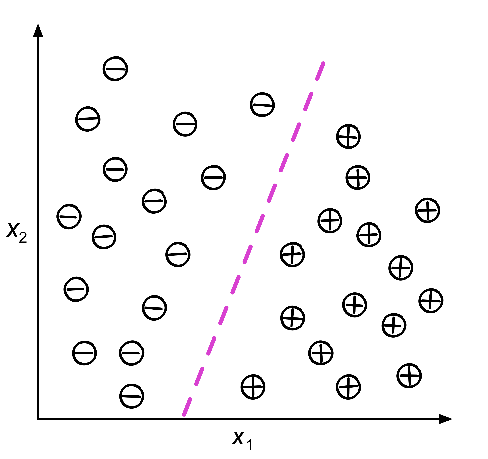
**** 迴歸
利用輸入數據的「特徵」來預測出一個「值」，例如，根據房屋的地點、坪數、樓層、房間數等變數, 發掘出這些變數之間的關係，進而預測房價，如圖[[fig:01_04]]。
#+CAPTION: 典型的迴歸
#+name: fig:01_04
#+ATTR_LATEX: :width 200一火
#+ATTR_ORG: :width 200
#+ATTR_HTML: :width 300
#+RESULTS:
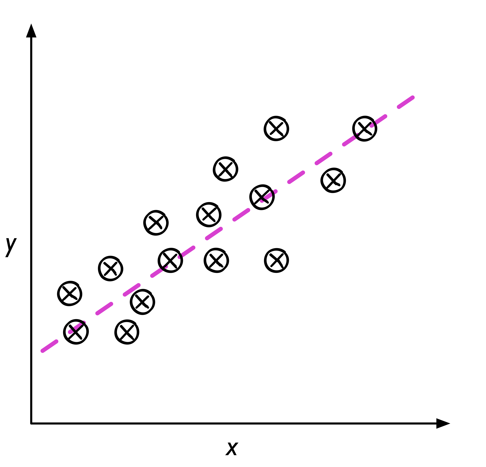
*** 決策樹
#+CAPTION: Decision Tree
#+LABEL:fig:Labl
#+name: fig:iris-dt
#+ATTR_LATEX: :width 300
#+ATTR_ORG: :width 300
#+ATTR_HTML: :width 500
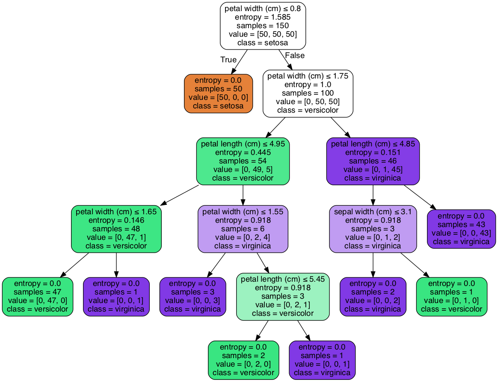

圖[[fig:iris-dt]]為「鳶尾花數據集」(http://archive.ics.uci.deu/ml/datasets/Iris)的分類結果，依鳶尾花的四個特徵：花萼(sepal)長度、寬度、花瓣(petal)長度、寬度，對其進行鳶尾花種類判斷。
*** 支援向量機(Support Vector Machine, SVM)
#+CAPTION: SVM
#+LABEL:fig:Labl
#+name: fig:Name
#+ATTR_LATEX: :width 300
#+ATTR_ORG: :width 300
#+ATTR_HTML: :width 400
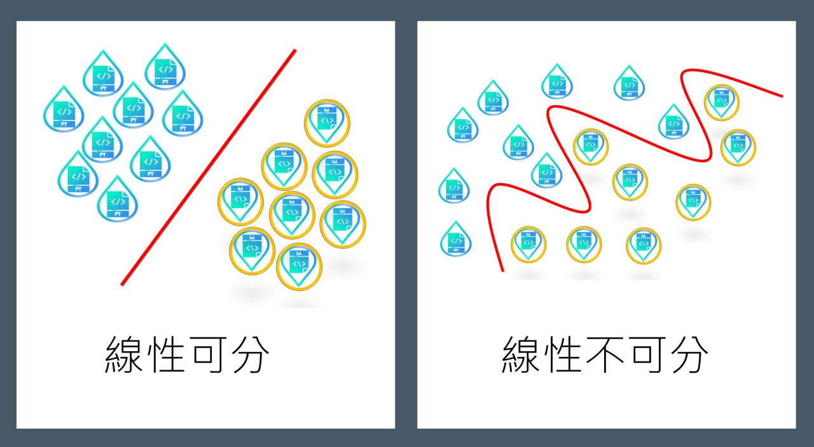

支援向量機是一種基於統計學習理論基礎的機器學習模型，針對小樣本、非線性、高維度與局部最小點等問題具有相對的優勢，主要用來處理分類問題。除了在文字分類、圖像分類及醫學中分類蛋白質等領域有不錯的成效外，因具有計算速度快且空間成本低等優勢，在工業界也有廣泛的應用[fn:2]。

#+CAPTION: SVM超平面
#+LABEL:fig:Labl
#+name: fig:Name
#+ATTR_LATEX: :width 300
#+ATTR_ORG: :width 300
#+ATTR_HTML: :width 400
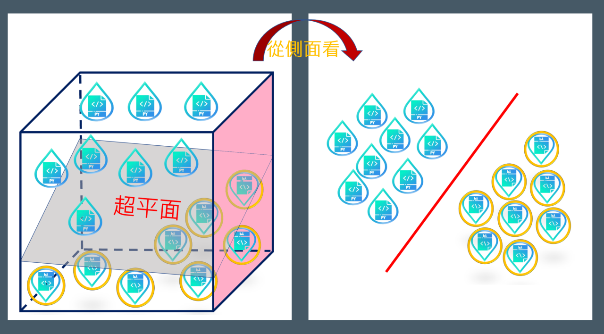

#+CAPTION: 將超平面最大化
#+LABEL:fig:Labl
#+name: fig:Name
#+ATTR_LATEX: :width 300
#+ATTR_ORG: :width 300
#+ATTR_HTML: :width 400
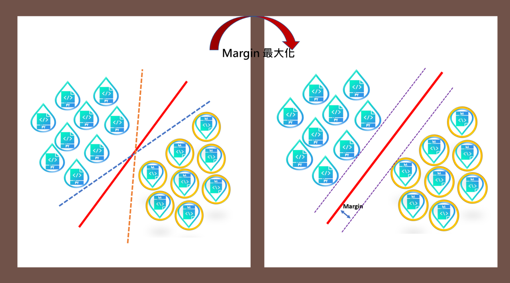

SVM不僅能將數據分門別類，甚至還可以找到最大化的「分離超平面」（類似於三維以上空間中的一個平面）[fn:2]，會最大化每個樣本點與該「超平面」的差。此外，當數據是「不可線性分離」時，支援向量機還可以透過「軟邊界」(soft margin)和「核技巧」(kernel trick)來處理。

** [[id:20221023T101716.467694][非監督式學習]](Unsupervised learning)
#+CAPTION: 資料分群
#+LABEL:fig:Labl
#+name: fig:knn-10
#+ATTR_LATEX: :width 300
#+ATTR_ORG: :width 300
#+ATTR_HTML: :width 400
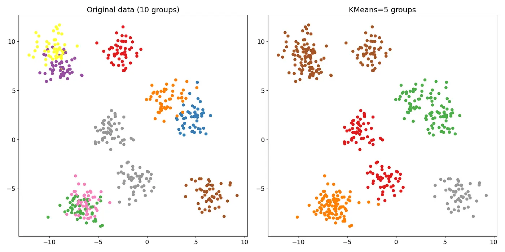

- 非監督式學習只有觀測值，單純給電腦大量觀測資料，然後從這些資料找出潛在規則。例如：將 10 萬張照片依據電腦自己歸納的規則分為數個不同的群組(如圖[[fig:knn-10]]左[fn:3])或是分成5群(如圖[[fig:knn-10]]右)。
- 在[[id:20221023T101626.420918][監督式學習]]中，我們事先會知道訓練集數據的正確答案(label)，並依此訓練我們的模型；在[[id:0a5c37c0-741a-4a1a-bec7-f98074830132][強化學習]]的環境中，我們會為代理人定義如何度量特定行動的奬勵；然而，在「非監督式學習」的環境中，我們面對的是未標記類別的數據或未知結構的數據，目的是讓演算法導出結論。最典型的例子就是「集群」(clustering)，即，讓演算法自己根據數據的特性把它們依某種特質分類為不同子集合，這裡的子集合不一定要是有限集合，也可能是無界子集(unbounded subsets)。「受限玻爾茲曼機」以及「深度信念網路」(deep belief networks, DBN)都屬此類。
- 非監督式學習經常被運用於資料分析的前置階段，用來先將資料分群或降低維度(減少變數量)，以利後續的分析或監督式學習的進行。
*** 方法：
- 群集(Clustering): K平均法(K-means)、階層式分群
  cluster analysis 是一種精簡資料的方法，主要目的是將一大筆資料依據樣本之間的共同屬性精簡成少數幾個同質性次群體 homogeneous subgroups ，即以相似性 similarity 衡量，形成集群(cluster)，以便從雜亂無章的一大堆原始資料中，做到分類、分群的目標。而所謂的相似性通常是以「距離」作為衡量，相對距離愈近，相似程度愈高，分群之後可以使得群內差異小、群間差異大[fn:4]。
- 階層式分群​​(Hierarchical Clustering​​)
  將資料在一個階層式的樹狀上，反覆的利用拆分以及聚合的方式建立出一個分類系統。階層式分群的優勢在於它使用上的簡單性以及能夠在小數據上操作，然而卻非常難處理大型的資料[fn:5]。
  各群組間的距離計算方式有以下三種：Single linkage、Maximum linkage、Average Linkage
- 自動編碼器(Autoencoder)
  由編碼器(encoder)與解碼器(decoder)構成，
*** 範例：
- 集群(cluster): 是一種「探索式數據分析」(exploratory data analysis)技術，它允許我們先組織一堆資訊到一個有意義的「子集群」(clusters)中，而無需任何先驗知識。
- K-means: 將數據集中的每個樣本分類到 k 個不同的子集合中，它隨機選擇 k 個點，這些點稱為「質心」(centroid)，代表這 k 個不同子集合的中心點，然後對於每個「質心」，我們選擇最接近它的一點，群組起來。

** 半監督式學習
#+CAPTION: 半監督式學習
#+LABEL:fig:Labl
#+name: fig:semi-1
#+ATTR_LATEX: :width 200
#+ATTR_ORG: :width 200
#+ATTR_HTML: :width 300
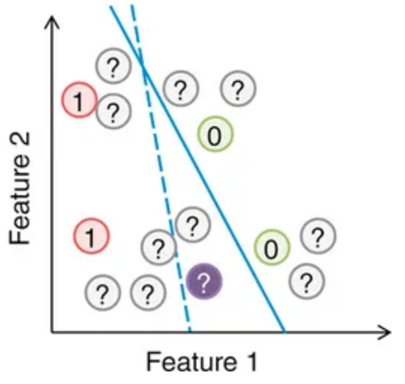

Semi-Supervised Learning如圖[[fig:semi-1]]所示，只有部分的data有label，而其他的data則是未標註的(unlabeled)。半監督學習的目標與監督學習完全相同，差別在資料集中存在部分的標注缺失[fn:6]。

** [[id:0a5c37c0-741a-4a1a-bec7-f98074830132][增強式學習]]
- 機器為了達成目標，隨著環境的變動，而逐步調整其行為，並評估每一個行動之後所到 的回饋是正向的或負向的，即，在 try-and-error 的過程中一步步從失敗中找出成功的路徑。
- 較常用於以下領域：電腦遊戲、下棋、自駕車、機器人。
- AlphaGo：先以監督式學習(以人類棋譜來訓練)訓練出早期版的 AlphaGo，接下來以增強式學習兩個最期版的 AlphaGo 對奕(40 天內對奕 3000 萬盤棋)。
- 2017 年的 AlphaZero 則放棄監督式學習(人類棋譜)，完全採取強化學習的模式，三天後摸索出自己的圍棋下法，成為有史以來棋力最強的版本。(不再以人類為師，所以才能超越人類？)
- Google 也將強化學習用於機房伺服器管理，持續偵測機房室內外用電、溫度、建立模型，由模型決定每台伺服器的運轉(全速、低速、休眠、關機)，並達到省電 40%的目標。
- 強化學習的目標在於開發一個系統（或代理人，agent）,他會藉由與環境的互動來改進自身的效能。由於當前的環境狀態資訊通常就包含了所謂「奬勵信號」(reward signal)，強化學習的目的就是找到一個最好的 Policy(策略)，可以讓 reward 最多。所以也可以把「強化學習」視為與「監督式學習」相關聯的領域，然而在強化學習中，環境回饋不能視為真實正的事實（或是說，正確的標籤），只能將之視為：測量函數對特定行動所觀測到並回報的一個度量值。如圖[[fig:ReinforcementLearning]]，Agent
- 最常見的應用是教機器如何「玩遊戲」，在這種情境下，我們不會對某個動作貼標籤說它是「好」或「壞」，而是根據遊戲的結果（輸或是贏）或是遊戲中的信號（得分或失分）來做為回饋。

#+BEGIN_SRC ditaa :file images/ReinforcementLearning.png
                  +-------------+
         +--------+ Environment |
         |  +-----+     cRED    |
         |  |     +-------------+
 Reward  |  |State      ^
         v  V           |
    +-----------+       |Action(This is a test)
    |  Agent    +-------+
    |   cYEL    |
    +-----------+
#+END_SRC
#+CAPTION: 強化學習流程圖
#+name: fig:ReinforcementLearning
#+ATTR_LATEX: :width 300
#+ATTR_HTML: :width 500
#+ATTR_ORG: :width 300
#+RESULTS:
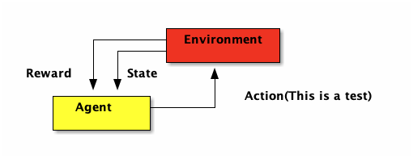
*** 範例
典型的 reinforcement learning 包括
- DQN
- q-learning
*** Flappy bird:
在這個遊戲中，我們需要簡單的點擊操作來控制小鳥，躲過各種水管，飛的越遠越好，因為飛的越遠就能獲得更高的積分獎勵。這就是一個典型的強化學習場景：
- 機器有一個明確的小鳥角色——代理
- 需要控制小鳥飛的更遠——目標
- 整個遊戲過程中需要躲避各種水管——環境
- 躲避水管的方法是讓小鳥用力飛一下——行動
- 飛的越遠，就會獲得越多的積分——獎勵
#+CAPTION: 強化學習流程圖
#+name: fig:ReinforcementLearning
#+ATTR_LATEX: :width 500
#+ATTR_ORG: :width 500
#+RESULTS:

** 依據AI模型是否能由即時資料流進行 **增量學習** 來區分[fn:7]
*** 離線（批次）學習 / Offline (Batch) learning:
在批次學習中，系統無法進行增量學習(learning incrementally)；它使用所有可用的資料一次性進行訓練。
*** 線上學習 / Online learning:
- 在線上學習中，你可以逐步餵入資料實例進行訓練，這些資料可以是一筆一筆（個別）或以小批次（mini-batches）形式進行。
- 線上學習特別適合那些資料持續流入（如股價）的系統，並且需要快速或自動地適應變化。
- 線上學習演算法也常用於資料量龐大、無法一次載入單台機器主記憶體的情況，這類情境也被稱為 **超核心學習(out-of-core learning)** 。

* 機器學習的程序與資料呈現方式
** 機器學習解決問題的標準流程
1. *數據收集（Data Collection）*
  首先，我們需要蒐集與要解決問題相關的資料。如果是監督式學習，還必須確保每一筆資料都有正確的標記（label）。
2. *數據處理（Data Processing）*
  蒐集到的資料往往不夠乾淨，這時要進行數據清理。例如：刪除不必要或重複的特徵、補齊遺漏值，或對資料進行標準化處理。這些步驟可以提升模型學習的效果。
3. *資料集的建立（Dataset Preparation）*
  接下來，要把整理好的資料分成三個部分：
  - 訓練集（training dataset）：用來讓模型學習。
  - 驗證集（validation dataset）：用來調整模型參數，選出表現最佳的模型。
  - 測試集（test dataset）：用來評估最終模型的表現。
4. *建立模型（Model Building）*
  根據手上的資料和問題特性，選擇合適的機器學習模型，並搭建模型結構。
5. *模型訓練（Model Training）*
  使用訓練集的資料來訓練模型，讓模型能從數據中學習規律。
6. *模型評估與修正（Model Evaluation & Tuning）*
  訓練完成後，使用驗證集和測試集評估模型的準確度。如果模型表現不理想，可以重新調整參數、選擇其他特徵，甚至更換不同的模型來優化預測效果。

** 機器學習的資料呈現方式
要如何以電腦能理解的方式來表示資料（如圖片、文字、使用者偏好等）？因為電腦只認識數字，所以我們需要將資訊組織成「向量」[fn:8]。
- 向量是一維的數字陣列，具有大小（長度）與方向。
- 特徵向量（feature vector）是指其每個元素代表某個物件的「特徵」的向量。
#+CAPTION: Feature Vector
#+LABEL:fig:feature-vector
#+name: fig:feature-vector
#+ATTR_LATEX: :width 300
#+ATTR_ORG: :width 300
#+ATTR_HTML: :width 500
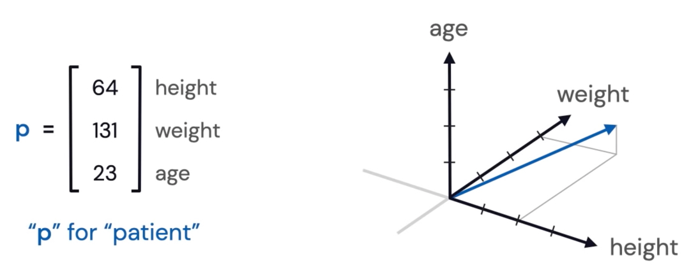

圖[[fig:feature-vector]]中的特徵向量表示一某個人的特徵，包含了他的身高、體重、年齡等資訊。這些特徵可以用來描述這個人，並與其他人進行比較。
*** Images
在黑白圖片(如圖[[fig:Image-data-representation]])中，每個像素(pixel)可以用一個數字來表示，這個數字代表該像素的顏色強度。對於黑白圖片，像素值通常是 0 或 1，分別代表黑色和白色；對於灰階圖片，像素值則是從 0 到 255 的整數，表示不同的灰階級別。這些像素值可以組成一個一維的數字陣列。
#+CAPTION: Image data representations
#+LABEL:fig:Image-data-representation
#+name: fig:Image-data-representation
#+ATTR_LATEX: :width 300
#+ATTR_ORG: :width 300
#+ATTR_HTML: :width 500
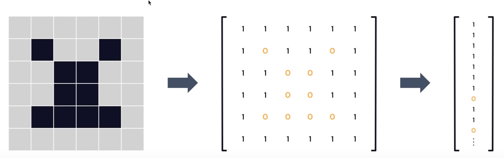
*** Words and Documents
文字和文件同樣也可以用向量來表示。每個單字或詞彙可以被視為一個特徵，並且可以用一個數字來表示它在文件中的出現頻率或重要性。圖[[fig:word-representation]]展示了如何將單字轉換為向量表示法，其中第 $i$ 個元素表示這個單字在第 $i$ 份文件中出現的次數，這種表示法又稱為「詞袋模型」（Bag-of-Words model）。這種方法可以將文本資料轉換為數字形式，便於機器學習模型進行處理。
#+CAPTION: Words and documents representations
#+LABEL:fig:word-representation
#+name: fig:word-representation
#+ATTR_LATEX: :width 200
#+ATTR_ORG: :width 200
#+ATTR_HTML: :width 300
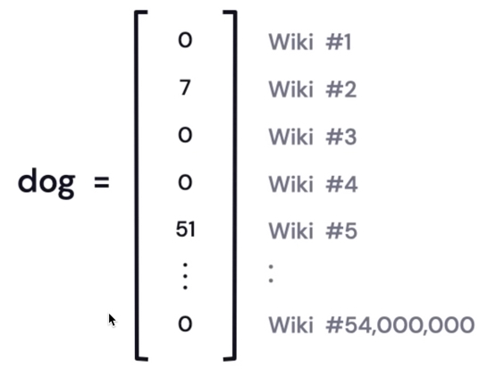

這些向量能組成一個大型矩陣，可用於*潛在語意分析*（latent semantic analysis）等方法。
*** Yes/No or Ratings
以使用者和項目（如電影）為例，向量可用來表示使用者是否看過某項目（1=是，0=否），或以 0~5 的數字表示使用者對該項目的評分(如圖[[fig:YN-rep]])。
#+CAPTION: Y/N or Ratings
#+LABEL:fig:YN-rep
#+name: fig:YN-rep
#+ATTR_LATEX: :width 300
#+ATTR_ORG: :width 300
#+ATTR_HTML: :width 500
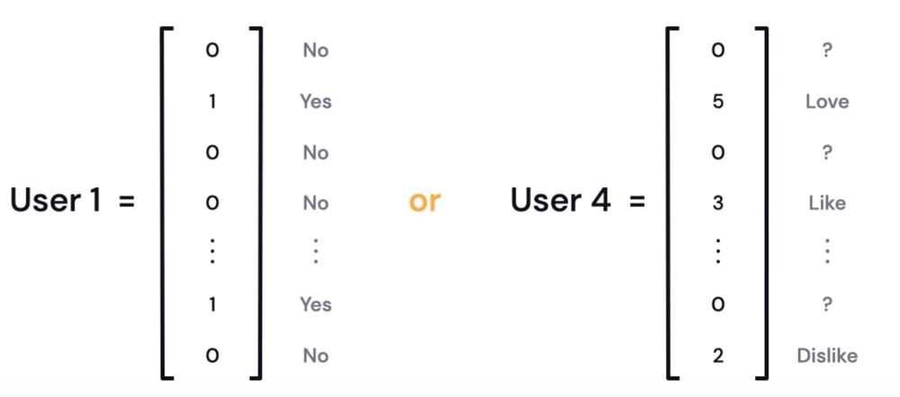
*** One-Hot Encodings
給每個單字分配一個只有一個 1、其餘都是 0 的向量，這就叫做 one-hot 編碼（或稱「標準基底向量」）。圖[[fig:woh]]展示了這種編碼方式，其中每個單字都被表示為一個向量，該向量在對應的單字位置上為 1，其餘位置為 0。
#+CAPTION: words one-hot encoding
#+LABEL:fig:woh
#+name: fig:woh
#+ATTR_LATEX: :width 300
#+ATTR_ORG: :width 300
#+ATTR_HTML: :width 500
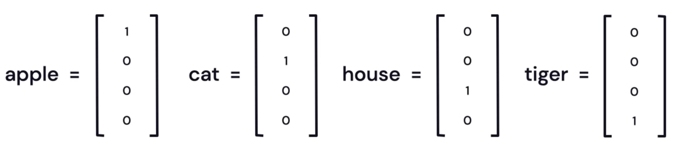
**** 需要注意的缺點：
One-Hot Encoding在自然語言處理中很常見，但也有一些缺點需要考慮。
***** 這些向量可能非常稀疏（sparse）
- 「稀疏」指的是向量中有大量的零
- 例如有 50 萬位使用者和 100 萬部電影時
***** 向量之間*可能缺乏有意義的關聯*
- one-hot 編碼之間永遠不會「相似」
- 向量間的相似性通常用 *點積(dot product)* 來衡量
- 例如，對於兩個向量 $a$ 和 $b$，其點積為 $a \cdot b = a_1 b_1 + a_2 b_2 + ... + a_n b_n$，如果兩個向量的點積為 0，則表示它們是正交的（orthogonal），即沒有任何相似性。

* 機器學習的主要挑戰[fn:7]
** 訓練資料數量不足（Insufficient quantity of training data）
訓練機器學習模型時，即使是非常簡單的問題，通常也需要數千筆範例；若是複雜的問題（如影像或語音辨識），可能需要數百萬筆範例。Peter Norvig 等人在 2009 年發表的論文〈The Unreasonable Effectiveness of Data〉就強調：對於複雜問題來說，資料量比演算法本身更重要。

** 訓練資料不具代表性（Nonrepresentative training data）
- 為了讓模型能夠有效泛化，訓練資料必須能夠代表未來將遇到的新案例。
- 最著名的抽樣偏差（sampling bias）案例發生在 1936 年美國總統大選，當時 /Literary Digest/ 進行了一次大規模調查，寄送問卷給約一千萬人。問題出在他們的抽樣方式：
  1. 首先，/Literary Digest/ 取得郵寄地址的方法，是使用電話簿、雜誌訂戶名單、俱樂部成員名單等。
  2. 再者，最終回覆問卷的人不到 25%。
#+CAPTION: 加入更多資料會使模型更具代表性
#+name: fig:GDP1
#+ATTR_LATEX: :width 500
#+ATTR_ORG: :width 500
#+ATTR_HTML: :width 500
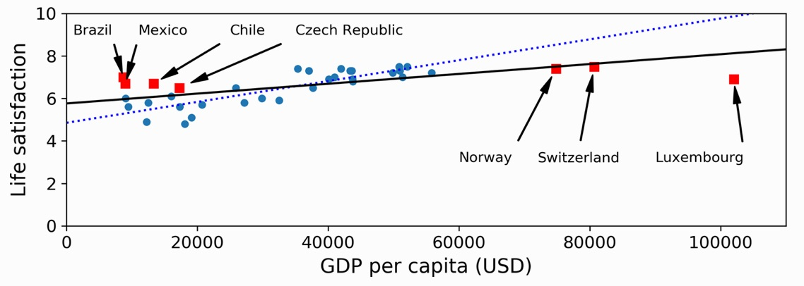

** 資料品質不佳（Poor-quality data）
很明顯，如果訓練資料充滿錯誤、異常值與雜訊（例如因為測量不良所致），系統就難以找出真正的規律，因此模型表現也不佳。

** 特徵不相關（Irrelevant features）
俗話說：「垃圾進、垃圾出。(garbage in, garbage out)」只有當訓練資料包含足夠多相關特徵，且無太多無關特徵時，系統才有可能學習到有效的規律。

** 訓練資料過度擬合（Overfitting the training data）
- 過度擬合發生在模型相對於資料量和雜訊程度來說過於複雜時。常見的解決方法有：
  1. 選擇參數較少的簡單模型。
  2. 收集更多訓練資料。
  3. 減少資料中的雜訊（例如修正資料錯誤、移除異常值）。
- 對模型加以限制、讓它變得更簡單，以降低過度擬合風險，這稱為/正則化/（regularization）。
- 在訓練過程中，正則化的強度可以由 **超參數（hyperparameter）** 來控制。超參數是學習演算法本身的參數，而不是模型的參數。

** 訓練資料擬合不足（Underfitting the training data）
當模型太過簡單，無法學到資料中的結構時，就會發生擬合不足（underfitting）。

* 典型的機器學習MODEL Training[實作]
以"rock, paper, and scissors"辨識為例[fn:8]:
1. 將三種圖案的image讀入model中
2. 於model中建立神經元(可視為function)，學習不同image的特徵
3. 根據上述神經元讀取的特徵值(features)，配合該image之答案(label)，進行學習
#+begin_src python -r -n :results output :exports both
model = tf.keras.models.Sequence([
    tf.keras.layers.Flatten(input_shape=(150, 150, 3)),
    tf.keras.layers.Dense(512, activation='relu'),
    tf.keras.layers.Dense(3, activatio='softmax')
])

model.compile(loss='categorical_crossentropy', optimizer='rmsprop')

model.fit(...., epochs=100)
#+end_src

** Process of learning
1. 可先將512個神經元視為512個function，每個function裡有許多變數，這些變數的初始值為random assign，
2. 接下來每個function陸續讀取image的所有feature(即圖的每個pixel，這裡可以將之視為傳入該function的parameters)，
3. 然後根據function中的變數值，開始學習要如何調整function裡的變數值才能輸出這個image的正確答案(label)，每個神經元 **同時** 進行學習與變數值調校。
*** function 示意圖
#+BEGIN_SRC ditaa :file images/function-dg.png  :cmdline -r
Function
-=------------
                   +------------------------+
     parameter 1   |                        |
   --------------->|       variable 1       |
     parameter 2   |       variable 2       |
   --------------->|          ...           |  Results
          ...      |          ...           +----------->
   --------------->|          ...           |
     parameter n   |       variable n       |
   --------------->|                        |
                   +------------------------+
#+END_SRC
#+CAPTION: Function
#+name: fig: Function
#+ATTR_HTML: :width 500
#+ATTR_LATEX: :width 500
#+ATTR_ORG: :width 500
#+RESULTS:
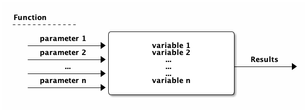

在訓練的過程中，我們根據每個function所輸入的參數(parameters)，調整function裡的變數值(這些最初是random得來的)，希望能得到與該輸入值(所有的parameters)所相對應的答案。

在傳統的程式設計觀點，輸入function的數值為參數；但在神經網路的觀點，輸入值為features，function稱為neuron，neuron裡的變數稱為parameters，所有neuron裡的parameter均為神經網路訓練過程中要調整的對象。
#+BEGIN_SRC ditaa :file images/neuron-dg.png
Neuron
-=------------
                   +------------------------+
       feature 1   |                        |
   --------------->|      parameter 1       |
       feature 2   |      parameter 2       |
   --------------->|          ...           |  Results
          ...      |          ...           +----------->
   --------------->|          ...           |
       feature n   |      parameter n       |
   --------------->|                        |
                   +------------------------+
#+END_SRC
#+CAPTION: Neuron
#+name: fig: Neuron
#+ATTR_HTML: :width 500
#+ATTR_LATEX: :width 500
#+ATTR_ORG: :width 500
#+RESULTS:
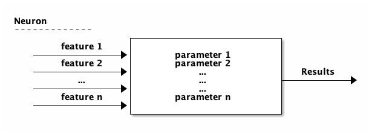
** Example of training
- 輸入image為rock
  #+CAPTION: Stone
  #+LABEL:fig:Stone
  #+name: fig:Stone
  #+ATTR_LATEX: :width 500
  #+ATTR_ORG: :width 500
  #+ATTR_HTML: :width 500
  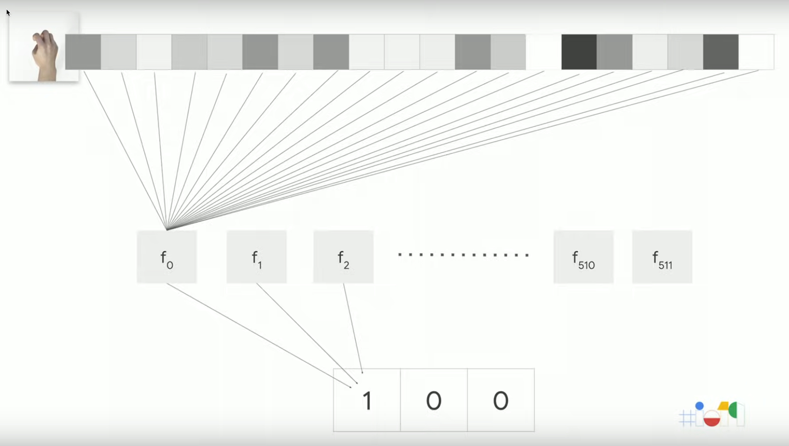
- 輸入image為paper
  #+CAPTION: Paper
  #+LABEL:fig:Paper
  #+name: fig:Paper
  #+ATTR_LATEX: :width 500
  #+ATTR_ORG: :width 500
  #+ATTR_HTML: :width 500
  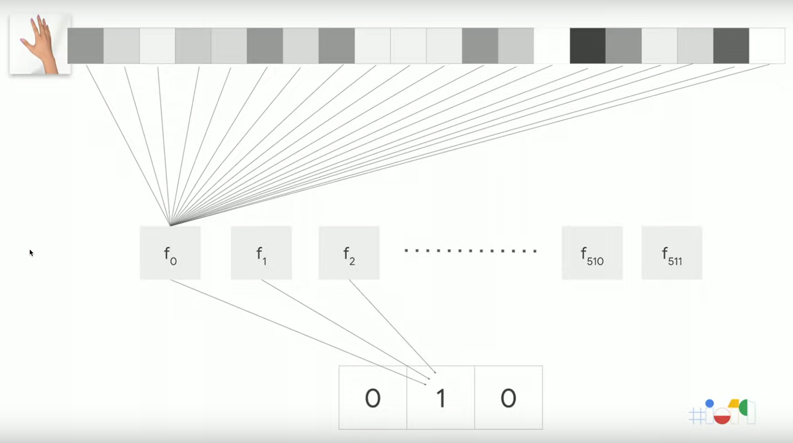

** Model v.s. Layer: Training step by step
- Input layer
  此的輸入為image，對model來說，其feature為150*150*3
  #+CAPTION: input_shape
  #+LABEL:fig:input_shape
  #+name: fig:input_shape
  #+ATTR_LATEX: :width 500
  #+ATTR_ORG: :width 500
  #+ATTR_HTML: :width 500
  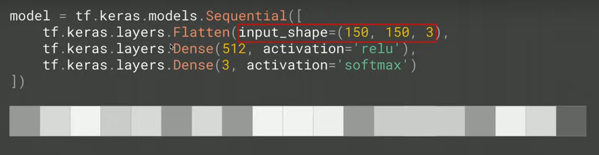
- Hidden layer
  中間層(hidden layer)有512個神經元，可視為512個function
  #+CAPTION: hidden_layer
  #+LABEL:fig:hidden_layer
  #+name: fig:hidden_layer
  #+ATTR_LATEX: :width 500
  #+ATTR_ORG: :width 500
  #+ATTR_HTML: :width 500
  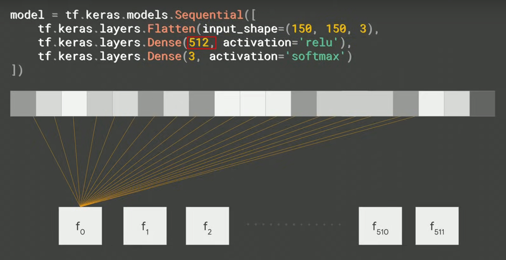
- Output layer
  輸出層(output layer)則輸出三種可能的答案
  #+CAPTION: output_layer
  #+LABEL:fig:output_layer
  #+name: fig:output_layer
  #+ATTR_LATEX: :width 500
  #+ATTR_ORG: :width 500
  #+ATTR_HTML: :width 500
  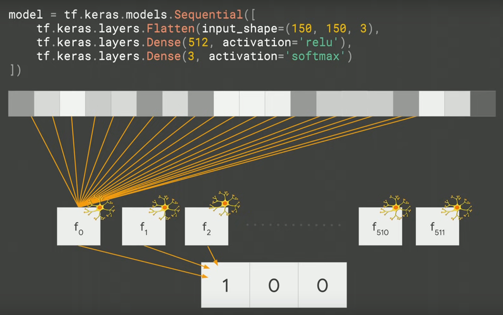
** compile v.s. fit
- compile: Compile與傳統程式設計概念不同，此處旨在訂定兩個model training中最重要的關鍵: loss function與optimizer。剛才提及每個function(或neuron)都對於產生答案(label)做出了貢獻，然而這個答案到底好或不好，必須要有一個評估機制，loss function的目的就在評估每一次所有neuron所產生的答案是否足夠好(以此例來看至少正確率必須高過1/3)，然後把評估結果丟給optimizer，由它來決定下一次猜測時neuron裡的parameters要如何調整。
- fit: 如此重複不斷的進行"輸入feature->猜測答案->評估答案->修正parameter->輸入features->猜測答案->評估答案->修正parameter...."，希望最終能找到各neuron中最佳的parameters值，每一次的訓練稱為一次epoch。這就是fit在做的事，也是實際訓練的動作，訓練所需時間視輸入值、model複雜程度與硬體效能而定，也許僅需數分鐘，也許要耗時數週。
#+CAPTION: compile-phase
#+LABEL:fig:compile-phase
#+name: fig:compile-phase
#+ATTR_LATEX: :width 500
#+ATTR_ORG: :width 500
#+ATTR_HTML: :width 500
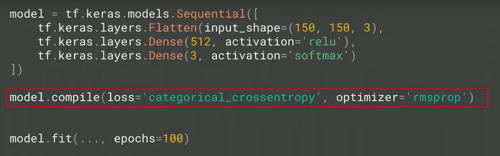

* Footnotes

[fn:1] [[https://github.com/rasbt/python-machine-learning-book-2nd-edition][python-machine-learning-book-2nd-edition]]

[fn:2] [[https://pyecontech.com/2020/03/24/svm/][[機器學習首部曲] 支援向量機 SVM]]

[fn:3] [[https://alankrantas.medium.com/kmeans-%E8%83%BD%E5%BE%9E%E8%B3%87%E6%96%99%E4%B8%AD%E6%89%BE%E5%87%BA-k-%E5%80%8B%E5%88%86%E9%A1%9E%E7%9A%84%E9%9D%9E%E7%9B%A3%E7%9D%A3%E5%BC%8F%E6%A9%9F%E5%99%A8%E5%AD%B8%E7%BF%92%E6%BC%94%E7%AE%97%E6%B3%95-%E6%89%80%E4%BB%A5%E5%AE%83%E5%88%B0%E5%BA%95%E6%9C%89%E5%95%A5%E7%94%A8-%E4%BD%BF%E7%94%A8-scikit-learn-%E8%88%87-python-5dd8c0c8b167][KMeans：能從資料中找出 K 個分類的非監督式機器學習演算法 — — 所以它到底有啥用？]]

[fn:4] [[https://ithelp.ithome.com.tw/articles/10291318][Day 19 聚類（集群）分析 Cluster Analysis]]

[fn:5] [[https://zh.oosga.com/docs/unsupervised-learning/][非監督式學習（Unsupervised Learning）的定義為何?
]]
[fn:6] [[https://u9534056.medium.com/%E6%A9%9F%E5%99%A8%E5%AD%B8%E7%BF%92%E4%BB%BB%E5%8B%99-%E7%9B%A3%E7%9D%A3%E5%AD%B8%E7%BF%92-%E5%8D%8A%E7%9B%A3%E7%9D%A3%E5%AD%B8%E7%BF%92-%E7%84%A1%E7%9B%A3%E7%9D%A3%E5%AD%B8%E7%BF%92-9b75972f91d6][機器學習任務：監督學習/半監督學習/無監督學習]]

[fn:7] [[https://www.books.com.tw/products/F014278520][Hands-On Machine Learning with Scikit-Learn, Keras, and Tensorflow: Concetsp, Tools, and Techniques to Build Intelligent Systems]]

[fn:8] [[https://youtu.be/LlKAna21fLE][A friendly introduction to linear algebra for ML (ML Tech Talks)]]
