:PROPERTIES:
:ID:       20221023T101534.642520
:ROAM_ALIASES: NLP
:END:
#+title: 自然語言處理
#+AUTHOR: 顏永進
#+TAGS: AI, Machine Learning
#+OPTIONS: toc:2 ^:nil num:5
#+OPTIONS: H:4
#+PROPERTY: header-args :python :python "/Users/letranger/Dropbox/notes/roam/venv/bin/python3" :eval never-export
#+HTML_HEAD: <link rel="stylesheet" type="text/css" href="../css/muse.css" />
#+HTML_HEAD_EXTRA: 
#+EXCLUDE_TAGS: noexport
#+begin_export html

#+end_export

* NLP 簡介
NLP，全名 Natural Language Processing（自然語言處理），是一門集電腦科學，人工智慧，語言學三者於一身的交叉性學科。其終極研究目標是讓電腦能夠處理甚至是“理解”人類的自然語言，進而説明人類解決一些現實生活中遇到的實際問題。這裡的語言“理解”是一個很抽象也很哲學的概念[fn:1]。

在 NLP 中，我們將對語言的“理解”定義為是學習一個能夠解決具體問題的複雜函數的過程。

對 NLP 的研究通常在 5 個 Level 上進行[fn:1]：
1) 語音／文本分析：包括語言識別技術、OCR 技術、分詞技術等
2) 詞形分析：例如分析一個 word 的前尾碼、詞根等
3) 語法分析：從語法結構上分析一個句子的構成
4) 語義分析：理解一個句子或單詞的語義
5) 篇章分析：理解一段篇章的含義
注意，雖然這 5 個 Level 在研究的物件和難度上是一種遞進的關係，但對這 5 個 Level 的研究並不一定是連續的——例如：我們可以跳過對一個句子語法結構的分析而直接去理解句子的語義。

簡介影片: [[https://www.youtube.com/watch?v=CMrHM8a3hqw][Natural Language Processing In 5 Minutes | What Is NLP And How Does It Work? | Simplilearn]]
DEMO: [[https://tts.yating.tw/#exp][雅婷文字轉語音]]

** 自然語言處理有哪些技術
大致包括如下技術[fn:2]:
1. 分詞(Word Segmentation或Word Breaker，WB)
   在英文文本當中每個詞之間都有間隔好分，但在中文文本當中一句話之間每個詞是沒有間隔的，所以需要對一個句子當中每個字進行切分，句子的基本語義單元就變成了詞，這就是分詞任務。
2. 句法分析（Parsing）
   句法分析指的是將句子中每個部分的組塊(也就是每個詞、字的歸屬類)標註出來。
   - 組塊分析:標出句子的短語塊,如“This is a dog(NP)” 超級標籤分析:給每個句子加上超級標籤，超級標籤是一個樹形結構圖
   - 成分句法分析:分析句子成分，給出一顆由終結符和非終結符構成的成分句法樹
   - 依存句法分析:分析句中詞的依存關係，給出一顆由詞語依存關係構成的依存句法樹。
3. 信息抽取（Information Extraction，IE）：命名實體識別和關係抽取（Named Entity Recognition & Relation Extraction，NER):我們從一段文本中抽取關鍵信息即從無結構的文本中抽取結構化的信息，
4. 詞性標註（Part Of Speech Tagging，POS）:對詞語的詞性進行標註
5. 指代消解（Coreference Resolution）:消除一些對文本處理沒有意義的指代名詞，減輕程序對語言的處理。
6. 詞義消歧（Word Sense Disambiguation，WSD）:一個詞他可能會有歧義，該任務是用來消除歧義的。
7. 機器翻譯（Machine Translation，MT）:要實現文本的自動翻譯
8. 自動文摘(Automatic Summarization):摘要是一大段文字，我們需要將裏面的梗提取出來然後縮短方便閱讀或方便提取信息。
9. 問答系統（Question Answering）:你提出一個問題機器給予你準確的答案
10. OCR:也屬於視覺模塊內容，將圖片當中的文字通過機器識別圖像翻譯成文本形式
11. 信息檢索(Information Retrieval，IR):用戶進行信息查詢和獲取的主要方式，是查找信息的方法和手段。
** 自然語言處理核心問題是什麼[fn:2]
- 文本分類
- 關鍵詞提取
- 情感分析
- 語義消歧
- 主題模型
- 機器翻譯
- 問題問答
- 漢語分詞
- 垂直領域的對話機器人
** 自然語言處理有哪些應用方向
- 文字朗讀（Text to speech）/語音合成（Speech synthesis）
- 語音識別（Speech recognition）
- 中文自動分詞（Chinese word segmentation）
- 詞性標註（Part-of-speech tagging）
- 句法分析（Parsing）
- 自然語言生成（Natural language generation）
- 文字分類（Text categorization）
- 資訊檢索（Information retrieval）
- 資訊抽取（Information extraction）
- 文字校對（Text-proofing）
- 問答系統（Question answering）
- 機器翻譯（Machine translation）
- 自動摘要（Automatic summarization）
- 文字蘊涵（Textual entailment）
- 命名實體辨識（Named entity recognition）
** NLP 學習路線
若要讓電腦理解人類的語言，以中文來說，分成兩步驟：第一步是斷詞、理解詞；第二步則是分析句子，包含語法及語義的自動解析。自然語言處理透過這兩個步驟，將複雜的語言轉化為電腦容易處理、計算的形式。早期是人工訂定規則，現在則是讓機器自己學習[fn:5]。

#+begin_quote
早期的方式是基於一套詞彙資料庫，用程式語言寫好人工訂定的規則，讓電腦依指令做出反應。但這種人工方式不可能包含所有語言的歧異性，例如，當同樣的詞在不同上下文產生不同意思，就會和原本的人工規則相互牴觸。1980 年代末期，自然語言處理引進機器學習 (Machine Learning) 的演算法，不再用程式語言命令電腦所有規則，而是建立演算法模型，讓電腦學會從訓練的資料中，尋找資料所含的特定模式和趨勢[fn:5]。
#+end_quote

要掌握自然語言處理，學習順序大致如下
1. 熟悉基本知識、基本操作
1. 如文本操作、正則、掌握一些基本文本處理框架英文有NLTK、spaCy，中文有中研院CKIP Transformers、CKIP Tagger、Jieba
1. 知道什麼是語言模型、利用語言模型來完成一些項目
1. 文本表示:將文本中的字符串轉化爲計算機當中的向量
1. 文本分類:分類模型傳統的一個解決方法就是標帶標註的語料，再特徵提取，然後訓分類器進行分類。這個分類器就會用比如說邏輯迴歸、貝葉斯、支持向量機、決策樹等等。
1. 主題模型:使用無監督學習的方式對文本中的隱含語義進行聚類的統計模型
1. seq2seq模型:通過深度神經網絡將一個序列作爲映射爲另外一個輸出的序列。
1. 文本生成:GAN文本生成，也叫機器人寫作。

* 近年 NLP 重要發展
本文前述內容主要涵蓋 RNN/LSTM 時代的 NLP 技術。自 2017 年起，NLP 領域經歷了數次典範轉移，以下簡介重要里程碑。
** Transformer 架構（2017）
Google 於 2017 年發表論文《Attention Is All You Need》，提出 Transformer 架構，以 *自注意力機制（Self-Attention）* 完全取代 RNN/LSTM 的循序處理方式。其核心優勢：
- *平行化計算*：不像 RNN 必須逐步處理序列，Transformer 可同時處理所有位置的 token，大幅加速訓練
- *長距離依賴*：Self-Attention 讓每個 token 直接關注序列中的任意其他 token，解決 RNN 的長距離遺忘問題
- 架構分為 Encoder（編碼器）與 Decoder（解碼器）兩部分，後續模型多擇一使用或兩者兼用

Transformer 已成為當代幾乎所有 NLP 模型的基礎架構。

** 預訓練語言模型
Transformer 催生了「先在大規模語料上預訓練（Pre-training），再針對下游任務微調（Fine-tuning）」的訓練範式。

*** BERT（2018）
Google 提出的 *Bidirectional Encoder Representations from Transformers*，採用 Transformer 的 Encoder 部分：
- 以「遮罩語言模型（Masked Language Model）」為預訓練目標：隨機遮蔽句中 15% 的 token，讓模型預測被遮蔽的詞
- 雙向理解上下文，在問答、文本分類、命名實體辨識等任務大幅刷新紀錄
- 衍生版本眾多：RoBERTa、ALBERT、DistilBERT 等

*** GPT 系列（2018–2024）
OpenAI 提出的 *Generative Pre-trained Transformer*，採用 Transformer 的 Decoder 部分：
- GPT-1（2018）：證明了大規模預訓練 + 微調的有效性
- GPT-2（2019）：展示零樣本（zero-shot）文本生成能力
- GPT-3（2020）：1,750 億參數，展現強大的少樣本學習（few-shot learning）與情境學習（in-context learning）能力
- GPT-4（2023）：多模態模型，同時處理文字與圖像，推理能力大幅提升

** 大型語言模型（LLM）時代
以 GPT-3 為起點，NLP 進入了大型語言模型（Large Language Model, LLM）時代。LLM 的特點是：
- *規模效應（Scaling Law）*：模型參數量、訓練資料量與計算量的增加，帶來能力的跳躍式提升
- *湧現能力（Emergent Abilities）*：模型規模達到一定程度後，會展現出未經明確訓練的能力（如邏輯推理、程式撰寫）
- 代表性模型：GPT-4（OpenAI）、Claude（Anthropic）、Gemini（Google）、LLaMA（Meta）

*** ChatGPT 與對話式 AI（2022–）
2022 年底 OpenAI 發布 ChatGPT，結合 LLM 與 *人類回饋的強化學習（RLHF）*，使模型能產生更符合人類期望的回答，掀起全球 AI 應用浪潮。

** Prompt Engineering 與 In-Context Learning
在 LLM 時代，使用者不再需要微調模型，而是透過設計適當的提示詞（Prompt）來引導模型完成任務：
- *Zero-shot*：直接描述任務，不提供範例
- *Few-shot*：在提示中提供少數範例，讓模型理解任務格式
- *Chain-of-Thought（CoT）*：引導模型逐步推理，提升複雜問題的正確率

** 檢索增強生成（RAG）
*Retrieval-Augmented Generation（RAG）* 結合資訊檢索與文本生成：
1. 根據使用者的問題，先從外部知識庫（文件、資料庫、網頁）檢索相關段落
2. 將檢索結果與問題一起送入 LLM 生成回答
此方法能有效減少 LLM 的幻覺（hallucination）問題，並讓模型能回答訓練資料中未包含的最新資訊。

** 現代 Tokenization
傳統的 NLP 以「詞」為基本單位（如本文前述的 Jieba 斷詞），但現代 LLM 多採用 *子詞（Subword）* 切分法：
- *BPE（Byte Pair Encoding）*：GPT 系列採用，透過統計合併高頻字元對來建立詞彙表
- *WordPiece*：BERT 採用，與 BPE 類似但以機率為合併依據
- *SentencePiece*：Google 開源工具，可直接處理原始文本（無需事先斷詞），支援多語言

子詞切分的優點是能在詞彙量有限的情況下處理任意未見過的詞（將其拆成已知的子詞組合），特別適合多語言場景。

** NLP 發展時間軸
| 年份 | 里程碑 | 說明 |
|------+------------------------------+----------------------------------------------|
| 2013 | Word2Vec | 以神經網路學習詞向量，開啟分散式語義表示時代 |
| 2017 | Transformer | 自注意力機制取代 RNN，成為新一代基礎架構 |
| 2018 | BERT / GPT-1 | 預訓練 + 微調範式確立 |
| 2018 | ELMo | 上下文相關的詞嵌入 |
| 2019 | GPT-2 / XLNet / RoBERTa | 預訓練模型快速迭代 |
| 2020 | GPT-3 | 千億參數，展現 few-shot 與 in-context learning |
| 2022 | ChatGPT | 對話式 AI 引爆全球應用 |
| 2023 | GPT-4 | 多模態 LLM |
| 2024 | 開源 LLM 蓬勃發展 | LLaMA 3、Mistral、Qwen 等 |

* NLP 資料預處理
情緒分析 (sentiment analysis) 又稱為意見探勘 (opinion mining). 是使用 "自然語言處理", 文字分析等方法, 找出作者某些話題上的態度, 情感, 評價或情緒.

情緒分析的商業價值, 可以提早得知顧客對公司或產品觀感, 以調整銷售策略方向.

IMDb 網路資料庫 (Internet Movie Database), 是一個電影相關的線上資料庫. IMDb 開始於 1990 年, 自 1998 年起成為亞馬遜旗下的網站, 至今已經累積大量的電影資訊. IMDb 共收錄了四百多萬作品資料.

IMDb 資料集共有 50,000 筆 "影評文字", 分為訓練資料與測試資料各 25,000 筆,
每一筆 "影評文字" 都被標記成 "正面評價" 或 "負面評價".

我們希望能建立一個模型, 經過大量 "影評文字" 訓練後, 此模型能用於預測 "影評文字" 是 "正面評價" 或 "負面評價".
#+CAPTION: 資料前處理
#+name: fig:TrainingPredict-overview
#+ATTR_LATEX: :width 400
#+ATTR_ORG: :width 400
#+ATTR_HTML: :width 400
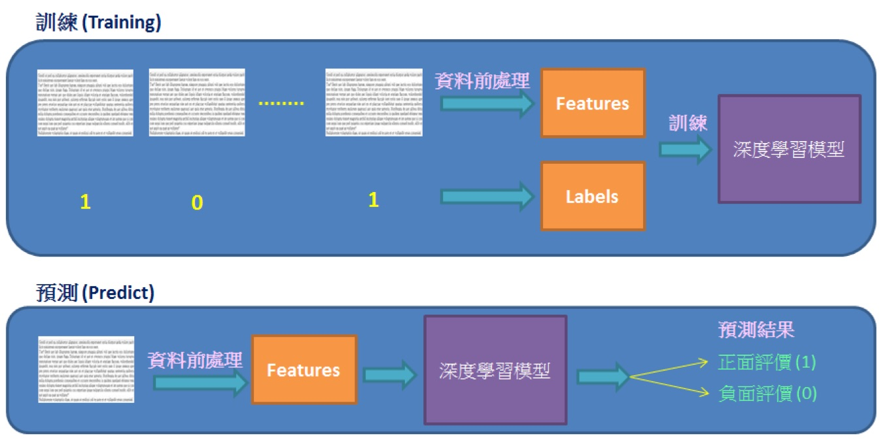
** IMDB
- num_words=10000 意味著只保留訓練集中最常出現的前 10000 個詞，不經常出現的單詞被拋棄—最終所有評論的維度保持相同。
- 變數 train_data,test_data 是電影評論的列表，每條評論由數字(對應單詞在詞典中出現的位置下標)列表組成。
- train_labels,test_labels 是 0,1 列表，0負面評論，1表示正面評論。

#+begin_src python -r -n :results output :exports both
from keras.datasets import imdb

(train_data,train_labels),(test_data,test_labels) = imdb.load_data(num_words=10000)
#+end_src
** Tokenization
Token 法就是將所有會用到的 Token 做成一個詞彙對照表（或稱為詞彙字典)，並用它來記錄每一個詞彙和其對應的數值，這樣我們就能照著這個對照表來將詞轉成數值。
- fit_on_text(texts): 使用一系列文檔來生成 token 詞典，texts 為 list 類，每個元素為一個文檔。
- texts_to_sequences(texts): 將多個文檔轉換為 word 下標的向量形式,shape 為[len(texts)，len(text)] -- (文檔數，每條文檔的長度)
- Tokenizer 對象.word_counts: 獲取字典{單詞:單詞出現次數}，將單詞（字符串）映射為它們在訓練期間出現的次數。僅在調用 fit_on_texts 之後設置。
- Tokenizer 對象.word_docs: 獲取字典{單詞:單詞出現次數}，將單詞（字符串）映射為它們在訓練期間所出現的文檔或文本的數量。僅在調用 fit_on_texts 之後設置。
- Tokenizer 對象.word_index: 獲取字典{單詞:單詞在字典中的索引值}，將單詞（字符串）映射為它們的排名或者索引。僅在調用 fit_on_texts 之後設置。
- Tokenizer 對象.index_word[index]: 獲取單詞（字符串），根據傳入單詞所在字典中的索引值來獲取該單詞。
- Tokenizer 對象.word_index[word]: 獲取單詞在字典中的索引值，根據傳入單詞，獲取單詞所在字典中的索引值。
- Tokenizer 對象.document_count: 獲取整數。分詞器被訓練的文檔（文本或者序列）數量。僅在調用 fit_on_texts 或 fit_on_sequences 之後設置。

#+begin_src python -r -n :results output :exports both
from tensorflow.keras.preprocessing.text import Tokenizer

samples = ['吃什麼?', '咖哩飯 還是 牛排 還是 麵包 還是 都 吃']
tokenizer = Tokenizer()
tokenizer.fit_on_texts(samples)
print('word_counts:', tokenizer.word_counts)
print('index_word:', tokenizer.index_word)
print('word_index:', tokenizer.word_index)

seq = tokenizer.texts_to_sequences(['吃 咖哩飯','牛排 和 麵包'])
print('texts_to_sequences: ',seq)
seq2 = tokenizer.texts_to_sequences([['吃','咖哩飯'],['牛排', '和','麵包']])
print('texts_to_sequences: ', seq2)
text = tokenizer.sequences_to_texts(seq)
print(text)
#+end_src

#+RESULTS:
: word_counts: OrderedDict([('吃什麼', 1), ('咖哩飯', 1), ('還是', 3), ('牛排', 1), ('麵包', 1), ('都', 1), ('吃', 1)])
: index_word: {1: '還是', 2: '吃什麼', 3: '咖哩飯', 4: '牛排', 5: '麵包', 6: '都', 7: '吃'}
: word_index: {'還是': 1, '吃什麼': 2, '咖哩飯': 3, '牛排': 4, '麵包': 5, '都': 6, '吃': 7}
: texts_to_sequences:  [[7, 3], []]
: texts_to_sequences:  [[7, 3], [4, 5]]
: ['吃 咖哩飯', '']

*** num_words
何時要設定？當字數太多時(例如，拿 wiki 的文章來分析...)
- num_words: None 或整數,個人理解就是對統計單詞出現數量後選擇次數多的前 n 個單詞，後面的單詞都不做處理。
- tokenizer.texts_to_sequences(texts): 使用字典將對應詞轉成 index。shape 為 (文檔數，每條文檔的長度)
- tokenizer.texts_to_matrix(texts): 轉成 one-hot，與前面的不同。shape 為[len(texts),num_words]
- tokenizer.word_counts: 單詞在所有文檔中的總數量，如果 num_words=4，應該選擇 some thing to
- tokenizer.word_docs: 單詞出現在文檔中的數量
- tokenizer.word_index: 單詞對應的 index
- tokenizer.index_docs: index 對應單詞出現在文檔中的數量

#+begin_src python -r -n :results output :exports both
from tensorflow.keras.preprocessing.text import Tokenizer

samples =['吃 什麼？','咖哩飯 還是 牛排 還是 麵包 還是 都 吃']
tokenizer = Tokenizer(num_words=3)
tokenizer.fit_on_texts(samples)
print(tokenizer.index_word)

seq= tokenizer.texts_to_sequences(['吃 咖哩飯 和 麵包'])
print(seq)
#+end_src

#+RESULTS:
: {1: '還是', 2: '吃', 3: '什麼？', 4: '咖哩飯', 5: '牛排', 6: '麵包', 7: '都'}
: [[2]]
** Sequence padding
在 NLP 中，文本一般是不定長的，所以在進行 batch 訓練之前，要先進行長度的統一，過長的句子可以通過 truncating 截斷到固定的長度，過短的句子可以通過 padding 增加到固定的長度，但是 padding 對應的字符只是為了統一長度，並沒有實際的價值，因此希望在之後的計算中屏蔽它們，這時候就需要 Mask[fn:3]。
#+begin_src python -r -n :results output :exports both
from tensorflow.keras.preprocessing.sequence import pad_sequences

seq= [[5,1], [2], [3, 5, 4, 7, 8]]

pad_seq = pad_sequences(seq, maxlen=4, dtype= 'int32', padding='pre', truncating='post', value=0)
print('pad_sequences:\n',pad_seq)

pad_seq = pad_sequences(seq, maxlen=4, dtype= 'int32', padding='post', truncating='post', value=-1)
print('pad_sequences:\n', pad_seq)
#+end_src

#+RESULTS:
: pad_sequences:
:  [[0 0 5 1]
:  [0 0 0 2]
:  [3 5 4 7]]
: pad_sequences:
:  [[ 5  1 -1 -1]
:  [ 2 -1 -1 -1]
:  [ 3  5  4  7]]
** one-hot encoding
#+begin_src python -r -n :results output :exports both
from tensorflow.keras.preprocessing.text import Tokenizer
from tensorflow.keras.preprocessing.sequence import pad_sequences
from tensorflow.keras.utils import to_categorical

num_classes = 10
convsat =['你好 哈囉', '什麼 怎麼', '你是誰 不告訴 你', '你 會做 什麼 都不會 會做', '什麼是 雞蛋 不知道 怎麼']

tokenizer = Tokenizer(num_words = num_classes, oov_token='N')
tokenizer.fit_on_texts(convsat)
print('tokenizer: ', tokenizer)

convsat_seq = tokenizer.texts_to_sequences(convsat)
print('texts_to_sequences(受限num_classes，未列入class者sequence為1):\n', convsat_seq)
convsat_seq = pad_sequences(convsat_seq)
print('pad_sequences:\n', convsat_seq)

convsat_one_hot = to_categorical(convsat_seq, num_classes=num_classes)
print('to_categorical:\n', convsat_one_hot)
#+end_src

#+RESULTS:
#+begin_example
tokenizer:  <keras_preprocessing.text.Tokenizer object at 0x103ba3160>
texts_to_sequences(受限num_classes，未列入class者sequence為1):
 [[6, 7], [2, 3], [8, 9, 4], [4, 5, 2, 1, 5], [1, 1, 1, 3]]
pad_sequences:
 [[0 0 0 6 7]
 [0 0 0 2 3]
 [0 0 8 9 4]
 [4 5 2 1 5]
 [0 1 1 1 3]]
to_categorical:
 [[[1. 0. 0. 0. 0. 0. 0. 0. 0. 0.]
  [1. 0. 0. 0. 0. 0. 0. 0. 0. 0.]
  [1. 0. 0. 0. 0. 0. 0. 0. 0. 0.]
  [0. 0. 0. 0. 0. 0. 1. 0. 0. 0.]
  [0. 0. 0. 0. 0. 0. 0. 1. 0. 0.]]

 [[1. 0. 0. 0. 0. 0. 0. 0. 0. 0.]
  [1. 0. 0. 0. 0. 0. 0. 0. 0. 0.]
  [1. 0. 0. 0. 0. 0. 0. 0. 0. 0.]
  [0. 0. 1. 0. 0. 0. 0. 0. 0. 0.]
  [0. 0. 0. 1. 0. 0. 0. 0. 0. 0.]]

 [[1. 0. 0. 0. 0. 0. 0. 0. 0. 0.]
  [1. 0. 0. 0. 0. 0. 0. 0. 0. 0.]
  [0. 0. 0. 0. 0. 0. 0. 0. 1. 0.]
  [0. 0. 0. 0. 0. 0. 0. 0. 0. 1.]
  [0. 0. 0. 0. 1. 0. 0. 0. 0. 0.]]

 [[0. 0. 0. 0. 1. 0. 0. 0. 0. 0.]
  [0. 0. 0. 0. 0. 1. 0. 0. 0. 0.]
  [0. 0. 1. 0. 0. 0. 0. 0. 0. 0.]
  [0. 1. 0. 0. 0. 0. 0. 0. 0. 0.]
  [0. 0. 0. 0. 0. 1. 0. 0. 0. 0.]]

 [[1. 0. 0. 0. 0. 0. 0. 0. 0. 0.]
  [0. 1. 0. 0. 0. 0. 0. 0. 0. 0.]
  [0. 1. 0. 0. 0. 0. 0. 0. 0. 0.]
  [0. 1. 0. 0. 0. 0. 0. 0. 0. 0.]
  [0. 0. 0. 1. 0. 0. 0. 0. 0. 0.]]]
#+end_example
** Multi-hot encoding
#+begin_src python -r -n :results output :exports both
from tensorflow.keras.preprocessing.text import Tokenizer

comment= ['真 好看 我 喜歡',  '還好 缺乏 一點 劇情', '有 一點 雷 個人 不 喜歡', '我 喜歡 但 我 朋友 都 不 愛']

tokenizer = Tokenizer(num_words=10)

tokenizer.fit_on_texts(comment)

comment_multi_hot= tokenizer.texts_to_matrix(comment, mode='binary')
print('texts_to_matrix\n', comment_multi_hot)

comment_multi_hot2= tokenizer.texts_to_matrix(comment, mode= 'count' )
print('texts_to_matrix\n', comment_multi_hot2)
#+end_src

#+RESULTS:
#+begin_example
texts_to_matrix
 [[0. 1. 1. 0. 0. 1. 1. 0. 0. 0.]
 [0. 0. 0. 1. 0. 0. 0. 1. 1. 1.]
 [0. 0. 1. 1. 1. 0. 0. 0. 0. 0.]
 [0. 1. 1. 0. 1. 0. 0. 0. 0. 0.]]
texts_to_matrix
 [[0. 1. 1. 0. 0. 1. 1. 0. 0. 0.]
 [0. 0. 0. 1. 0. 0. 0. 1. 1. 1.]
 [0. 0. 1. 1. 1. 0. 0. 0. 0. 0.]
 [0. 2. 1. 0. 1. 0. 0. 0. 0. 0.]]
#+end_example
** 資料預處理
不能直接將 list 型別的資料送到神經網路中訓練，必須將 list 型別轉換為 tensor 張量型別。
*** 有兩種轉換方式：
- 填充列表使每個列表長度都相同，然後轉換為整數型別的張量，形狀為(samples, word_indices),使用張量作為神經網路的第一層(Embedding 層，能處理這樣的整數型別張量)；
- 將列表進行 one-hot 編碼，轉換成 0、 1 向量。然後用 Dense 網路層作為神經網路的第一層，處理浮點型別向量資料。
#+begin_src python -r -n :results output :exports both
import numpy as np

def vectorize_sequences(sequences, dimension=10000):
    results = np.zeros((len(sequences), dimension)) #資料集長度，每個評論維度10000
    for i, sequence in enumerate(sequences):
        results[i, sequence] = 1 # one-hot
    return results

x_train = vectorize_sequences(train_data)
x_test = vectorize_sequences(test_data)
y_train = np.asarray(train_labels).astype('float32') # 向量化標籤資料
y_test = np.asarray(test_labels).astype('float32')
#+end_src
** 共同部分
#+begin_src python -r -n :results output :exports both
import random
import pandas as pd

## Read-in the reviews and print some basic descriptions of them

# Colab/Jupyter magic commands:
# !wget -q "http://ai.stanford.edu/~amaas/data/sentiment/aclImdb_v1.tar.gz"
# !tar xzf aclImdb_v1.tar.gz
import subprocess
subprocess.run(["wget", "-q", "http://ai.stanford.edu/~amaas/data/sentiment/aclImdb_v1.tar.gz"])
subprocess.run(["tar", "xzf", "aclImdb_v1.tar.gz"])
#+end_src
** Define Tokenization, Stop-word and Punctuation Removal Functions
#+begin_src python -r -n :results output :exports both
Nsamp = 1000 # number of samples to generate in each class -
maxtokens = 200 # the maximum number of tokens per document
maxtokenlen = 100 # the maximum length of each token
#+end_src
** Tokenization
#+begin_src python -r -n :results output :exports both
def tokenize(row):
    if row is None or row == '':
        tokens = ""
    else:
        tokens = row.split(" ")[:maxtokens]
    return tokens
#+end_src
** Use regular expressions to remove unnecessary characters
#+begin_src python -r -n :results output :exports both
import re

def reg_expressions(row):
    tokens = []
    try:
        for token in row:
            token = token.lower() # make all characters lower case
            token = re.sub(r'[\W\d]', "", token)
            token = token[:maxtokenlen] # truncate token
            tokens.append(token)
    except:
        token = ""
        tokens.append(token)
    return tokens

#+end_src
** Stop-word removal
Stop-words are words that are very common in text but offer no useful information that can be used to classify the text.
Words such as is, and, the, are are examples of stop-words.
The NLTK library contains a list of 127 English stop-words and can be used to filter our tokenized strings.
#+begin_src python -r -n :results output :exports both
import nltk

nltk.download('stopwords')
from nltk.corpus import stopwords
stopwords = stopwords.words('english')

# print(stopwords) # see default stopwords
# it may be beneficial to drop negation words from the removal list,
# as they can change the positive/negative meaning
# of a sentence
# stopwords.remove("no")
# stopwords.remove("nor")
# stopwords.remove("not")
#+end_src
#+begin_src python -r -n :results output :exports both
def stop_word_removal(row):
    token = [token for token in row if token not in stopwords]
    token = filter(None, token)
    return token
#+end_src

* 中文自然語言處理
中文 NLP 相較於英文有幾項獨特挑戰，以下分別說明。

** 中文 NLP 的獨特挑戰
*** 斷詞問題
英文單詞之間有空格自然分隔，但中文字與字之間沒有分隔符號，因此「斷詞（Word Segmentation）」是中文 NLP 的首要步驟。例如：
- 「下雨天留客天留我不留」可以有多種斷法，語意完全不同
- 「台北市長」→「台北/市長」或「台北市/長」
斷詞的好壞直接影響後續所有 NLP 任務的表現。

*** 繁體與簡體
中文存在繁體與簡體兩套書寫系統，且兩者並非單純的一對一對應（如：簡體「发」對應繁體「發」或「髮」）。許多中文 NLP 資源以簡體為主，處理繁體文本時需注意：
- 預訓練模型若以簡體語料訓練，直接用於繁體文本效果可能打折
- 繁簡轉換工具（如 OpenCC）可輔助，但無法處理用詞差異（如：簡體「软件」= 繁體「軟體」）
- 建議優先選用針對繁體訓練的模型（如 CKIP Transformers）

*** 無詞形變化
中文不像英文有時態（go/went/gone）、單複數（cat/cats）等詞形變化，因此不需要做詞幹提取（Stemming）或詞形還原（Lemmatization）。但中文的量詞、語氣助詞等帶來另一層處理複雜度。

** 中文斷詞工具
*** Jieba
最廣泛使用的開源中文斷詞工具，支援繁簡體：
#+begin_src python -r -n :results output :exports both
import jieba

# 精確模式
seg = jieba.cut("自然語言處理是人工智慧的重要領域", cut_all=False)
print("精確模式:", "/".join(seg))

# 全模式
seg = jieba.cut("自然語言處理是人工智慧的重要領域", cut_all=True)
print("全模式:", "/".join(seg))
#+end_src

*** CKIP（中研院）
中研院開發的繁體中文 NLP 工具，有兩個版本：
- *CkipTagger*（舊版）：基於 BiLSTM，提供斷詞、詞性標注、命名實體辨識
- *CKIP Transformers*（新版，推薦）：基於 Transformer 架構（ALBERT/BERT），效能更好

#+begin_src python -r -n :results output :exports both
# CKIP Transformers（新版，推薦使用）
from ckip_transformers.nlp import CkipWordSegmenter, CkipPosTagger, CkipNerChunker

# 初始化（首次使用會自動下載模型）
ws_driver = CkipWordSegmenter(model="bert-base")
pos_driver = CkipPosTagger(model="bert-base")
ner_driver = CkipNerChunker(model="bert-base")

text = ["自然語言處理是人工智慧的重要研究領域。"]

# 斷詞
ws_result = ws_driver(text)
print("斷詞:", ws_result)

# 詞性標注
pos_result = pos_driver(ws_result)
print("詞性:", pos_result)

# 命名實體辨識
ner_result = ner_driver(text)
print("NER:", ner_result)
#+end_src

** 中文預訓練模型
近年有許多針對中文訓練的預訓練語言模型：

*** BERT 系列（適合理解型任務：分類、問答、NER）
| 模型 | 來源 | 說明 |
|------------------+----------+----------------------------------------------|
| BERT-wwm | HFL 哈工大 | 全詞遮罩（Whole Word Masking），更適合中文 |
| MacBERT | HFL 哈工大 | 以同義詞替換取代 [MASK]，減少預訓練與微調差異 |
| ERNIE | 百度 | 融入知識圖譜的預訓練模型 |
| CKIP BERT | 中研院 | 專為繁體中文訓練，適合台灣應用場景 |

*** 生成式大型語言模型
| 模型 | 來源 | 說明 |
|------------------+----------+----------------------------------------------|
| Qwen（通義千問） | 阿里巴巴 | 開源中文 LLM，支援長文本與多模態 |
| ChatGLM | 清華/智譜 | 中英雙語對話模型，有開源版本 |
| Taiwan-LLaMA | 台大 | 基於 LLaMA 以繁體中文語料微調 |
| Breeze | 聯發科 | 針對繁體中文優化的開源 LLM |
| TAIDE | 國科會 | 台灣政府主導，基於 LLaMA 以繁體中文微調 |

*** 使用 Hugging Face 載入中文模型範例
#+begin_src python -r -n :results output :exports both
from transformers import AutoTokenizer, AutoModel

# 以 CKIP BERT 為例
tokenizer = AutoTokenizer.from_pretrained("ckiplab/bert-base-chinese")
model = AutoModel.from_pretrained("ckiplab/bert-base-chinese")

text = "自然語言處理是一門跨領域的學科"
inputs = tokenizer(text, return_tensors="pt")
outputs = model(**inputs)
print("輸出向量維度:", outputs.last_hidden_state.shape)
# (batch_size, sequence_length, hidden_size)
#+end_src

** 中文 NLP 常見應用
- *情感分析*：電商評論、社群媒體輿情監控
- *文本分類*：新聞分類、垃圾訊息過濾
- *命名實體辨識（NER）*：從文本中抽取人名、地名、機構名
- *機器翻譯*：中英互譯、中台語翻譯
- *文本摘要*：自動摘要新聞或文件
- *對話系統*：客服機器人、智慧助理

** 繁體中文資源與工具

*** 繁簡轉換：OpenCC
[[https://github.com/BYVoid/OpenCC][OpenCC]]（Open Chinese Convert）是開源的中文繁簡轉換工具，在處理簡體中文語料時經常用到：
#+begin_src python -r -n :results output :exports both
from opencc import OpenCC

# 簡體轉繁體（台灣用語）
s2tw = OpenCC('s2tw')
print(s2tw.convert("我们使用深度学习的算法来处理自然语言"))
# → 我們使用深度學習的算法來處理自然語言

# 簡體轉繁體（台灣用語 + 慣用詞轉換）
s2twp = OpenCC('s2twp')
print(s2twp.convert("我们使用深度学习的算法来处理自然语言"))
# → 我們使用深度學習的演算法來處理自然語言

# 繁體轉簡體
tw2s = OpenCC('tw2s')
print(tw2s.convert("我們使用深度學習的演算法來處理自然語言"))
# → 我们使用深度学习的演算法来处理自然语言
#+end_src

常用轉換模式：
| 模式 | 說明 |
|------+------|
| =s2t= | 簡體 → 繁體 |
| =s2tw= | 簡體 → 繁體（台灣） |
| =s2twp= | 簡體 → 繁體（台灣，含慣用詞轉換，推薦） |
| =t2s= | 繁體 → 簡體 |
| =tw2s= | 繁體（台灣）→ 簡體 |

安裝方式：
#+begin_src bash
pip install opencc-python-reimplemented
#+end_src

*** 繁體中文語料與資料集
以下是進行繁體中文 NLP 研究與應用常用的資源：
| 資源 | 說明 | 取得方式 |
|----------------------------+----------------------------------------------+----------------------|
| 中研院平衡語料庫 | 約五百萬詞的標注語料，含詞性標注 | 需向中研院申請授權 |
| 中研院詞知識庫（E-HowNet） | 中文詞彙語義知識庫 | 線上查詢 |
| PTT 語料 | 台灣最大 BBS 站文章，大量口語化繁體文本 | 需自行爬取或使用開源版 |
| 維基百科繁體中文 | 可做為預訓練語料 | Wikimedia Dumps 免費下載 |
| DRCD | 繁體中文閱讀理解資料集（類似 SQuAD） | GitHub 開源 |
| ASBC（中研院平衡語料庫） | 書面語為主的標注語料 | 需申請 |
| 教育部國語辭典 | 標準繁體中文詞彙定義 | 提供線上 API |

*** TAIDE 模型
[[https://taide.tw/][TAIDE]]（Trustworthy AI Dialogue Engine，可信任生成式 AI 對話引擎）是由台灣國科會主導開發的繁體中文大型語言模型。基於 LLaMA 架構，使用大量繁體中文語料進行預訓練與微調，目標是打造適合台灣本土需求的 AI 語言模型。

TAIDE 的特色：
- 以繁體中文為主要訓練語料，能理解台灣用語和文化脈絡
- 開源釋出，可在 Hugging Face 下載使用
- 提供多種版本（7B、8B），適合不同應用場景
- 支援對話、摘要、翻譯等多種 NLP 任務

以下示範如何使用 TAIDE 模型進行文字生成，讓初學者了解中文語言模型的基本用法：
#+begin_src python -r -n :results output :exports both
from transformers import AutoModelForCausalLM, AutoTokenizer
import torch

# 載入 TAIDE 模型與 tokenizer（首次執行會下載模型，約需 15GB 空間）
model_name = "taide/TAIDE-LX-7B-Chat"
tokenizer = AutoTokenizer.from_pretrained(model_name)
model = AutoModelForCausalLM.from_pretrained(
    model_name,
    torch_dtype=torch.float16,  # 使用半精度以節省記憶體
    device_map="auto"           # 自動分配到可用的 GPU
)

# 範例 1：請模型解釋概念
prompt = "[INST] 請用三句話簡單解釋什麼是自然語言處理 [/INST]"
inputs = tokenizer(prompt, return_tensors="pt").to(model.device)
outputs = model.generate(**inputs, max_new_tokens=200, temperature=0.7)
print("=== 概念解釋 ===")
print(tokenizer.decode(outputs[0], skip_special_tokens=True))

# 範例 2：文本摘要
article = "台積電今日宣布將在高雄設立新的晶圓廠，預計投資金額超過新台幣三千億元。新廠將採用先進的2奈米製程技術，預計2027年開始量產。此舉將為南台灣帶來大量就業機會，並進一步鞏固台灣在全球半導體產業的領導地位。"
prompt = f"[INST] 請將以下新聞摘要成一句話：\n{article} [/INST]"
inputs = tokenizer(prompt, return_tensors="pt").to(model.device)
outputs = model.generate(**inputs, max_new_tokens=100, temperature=0.3)
print("\n=== 文本摘要 ===")
print(tokenizer.decode(outputs[0], skip_special_tokens=True))

# 範例 3：情感分析
review = "這家餐廳的牛肉麵真的超好吃，湯頭濃郁，牛肉軟嫩，下次還會再來！"
prompt = f"[INST] 請判斷以下評論的情感是正面還是負面，並簡述理由：\n{review} [/INST]"
inputs = tokenizer(prompt, return_tensors="pt").to(model.device)
outputs = model.generate(**inputs, max_new_tokens=100, temperature=0.3)
print("\n=== 情感分析 ===")
print(tokenizer.decode(outputs[0], skip_special_tokens=True))
#+end_src

#+begin_quote
*注意*：TAIDE-LX-7B-Chat 模型約需 14GB GPU 記憶體（使用 float16）。若 GPU 記憶體不足，可改用量化版本：
#+end_quote

#+begin_src python -r -n :results output :exports both
# 使用 4-bit 量化載入，僅需約 4GB GPU 記憶體
from transformers import AutoModelForCausalLM, AutoTokenizer, BitsAndBytesConfig
import torch

quantization_config = BitsAndBytesConfig(
    load_in_4bit=True,
    bnb_4bit_compute_dtype=torch.float16
)

model_name = "taide/TAIDE-LX-7B-Chat"
tokenizer = AutoTokenizer.from_pretrained(model_name)
model = AutoModelForCausalLM.from_pretrained(
    model_name,
    quantization_config=quantization_config,
    device_map="auto"
)
#+end_src

** NLTK
[[file:NLTK.org][NLTK]]: NLP的處理工具

** 語料集
自然語言中，雖然算法、模型很重要，但沒有資料驅動還是什麼都做不了，尤其是文字不像圖片一樣不分國界，每個地方用的語言不同，所需要的資料也就不同，英文因為是世界語言，加上論文的發表大部分以研究英文為主，所以資料當然是最多，不過幸運地，中文的語料也算蠻多的，這邊列出幾個好用的中文資料集或預訓練模型[fn:9]
*** NLP-Chinese-Corpus
[[https://github.com/brightmart/nlp_chinese_corpus][NLP_Chinese-Corpus]] 是在github上由brightmart開源的中文語料統整，裡面包含了一些維基百科、新聞、社區問答等語料，比較多是通用型的中文語料，可以當作詞向量訓練的材料，或者其它應用
*** PTT-Gossiping-Corpus
[[https://github.com/zake7749/Gossiping-Chinese-Corpus][PTT-Gossiping-Corpus]]是由zake7749在github以及Kaggle上提供的繁體中文問答語料集，一個問句對應到一句鄉民回答，對於想實作中文Sequence2Sequence的朋友，會是蠻不錯的實驗語料
圖片截自zake7749/Gossiping-Chinese-Corpus 中的範例說明
*** Wiki-corpus
繁體中文的語料，通常就會想到PTT以及中文維基百科，而現在獲取中文維基百科的手段有很多種，維基百科本身也有提供API，大家可以視個人需求來拿到資料
*** Tencent AI LAB
騰訊AI實驗室非常佛心的釋出相當多有用的中文資料集，像是Dialogue Research中包含一些在聊天機器人領域上實用的中文語料，有興趣的朋友可以參考我這篇論文的介紹：Improving Open-Domain Dialogue Systems via Multi-Turn Incomplete Utterance Restoration此外，騰訊AI也有提供預訓練的中文詞向量模型，有興趣的朋友也能試試看
*** BERT
BERT就像詞向量模型一樣，需要大量的語料進行預訓練，好處是我們這種一般大眾可以直接使用一些科技巨擘所釋出的預訓練模型，像是Google, HuggingFace, 還有一些開源的github項目都有提供中文的BERT預訓練模型

* 文字的數學表示
語言由文字構成，利用「字詞」組合成各種意思。電腦透過三種手段來理解「字詞」：
1. 詞庫
1. 計數
1. 推論(word2vec)
** 詞庫
表達詞意的方式之一是利用辭典，例如，以辭典查「車」的字詞會有對應的解釋。
另一種方式是透過詞庫（thesaurus）型的辭典，將同義詞分在同一群中，如：
#+BEGIN_SRC dot :file ./images/thesaurus.png :cmdline -Kdot -Tpng
digraph wordThesaurus {
  rankdir=TD
  o1 [label="object" shape="record"]
  o2 [label="motor vehicle" shape="record"]
  o31 [label="car" shape="record"]
  o32 [label="go-kart" shape="record"]
  o33 [label="truck" shape="record"]
  o41 [label="SUV" shape="record"]
  o42 [label="compact" shape="record"]
  o43 [label="hatch-back" shape="record"]
  o1 -> o2
  o2 -> o31
  o2 -> o32
  o2 -> o33
  o31 -> o41
  o31 -> o42
  o31 -> o43
}
#+END_SRC

#+RESULTS:
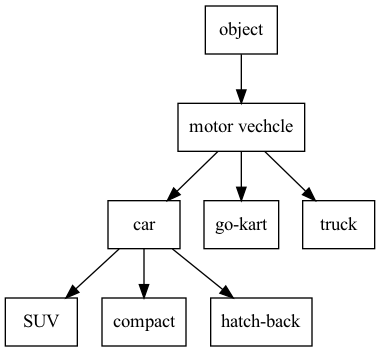

透過這種方式定義字詞間的關係。
*** WordNet
NLP中最有名的詞庫: WordNet，由普林斯頓大學於1985年開發。
詞庫的問題：
1. 難以因應時代變遷：舊詞與新詞（如，crowdfunding、比特幣）
1. 人工作業成本昂貴
1. 無法表現字詞的細微差異：vintage與retrospective
** 計數
語料庫(corpus):以研究自然語言處理或應用程式為目的所大量收集的文本資料。
** Python事前準備
#+begin_src python -r -n :results output :exports both
text = 'You say goodbye and I say hello.'
text = text.replace('.', ' .')
words = text.split(' ')
print(words)
word_to_id = {}
id_to_word = {}

for word in words:
    if word not in word_to_id:
        new_id = len(word_to_id)
        word_to_id[word] = new_id
        id_to_word[new_id] = word
print(word_to_id)
print(id_to_word)

corpus = [word_to_id[w] for w in words]
print(corpus) #文字句子轉數字表示
#+end_src

#+RESULTS:
: ['You', 'say', 'goodbye', 'and', 'I', 'say', 'hello', '.']
: {'You': 0, 'say': 1, 'goodbye': 2, 'and': 3, 'I': 4, 'hello': 5, '.': 6}
: {0: 'You', 1: 'say', 2: 'goodbye', 3: 'and', 4: 'I', 5: 'hello', 6: '.'}
: [0, 1, 2, 3, 4, 1, 5, 6]

corpus, word_to_id, id_to_word的產生可以寫成function
#+begin_src python -r -n :results output :exports both :session NLP-1
def preprocess(text):
    text = text.lower()
    text = text.replace('.', ' .')
    words = text.split(' ')

    word_to_id = {}
    id_to_word = {}
    for word in words:
        if word not in word_to_id:
            new_id = len(word_to_id)
            word_to_id[word] = new_id
            id_to_word[new_id] = word

    corpus = np.array([word_to_id[w] for w in words])

    return corpus, word_to_id, id_to_word
#+end_src

#+RESULTS:
: >>>
** 字詞的分散式表示
- RGB的向量表示可以設定各種顏色，可以從(R,G,B)=(201, 23, 30)大略猜出這是紅色系的顏色。
- 字詞的分散式表示就是希望能以向量來表達詞意
*** 分布假說(distributional hypothesis)
即，詞意是由周圍(前後)的字詞形成的。至於「周圍」的大小取決於window size，當window size=1，則取該字的前後一字詞為其上下文。
*** 共生矩陣
計算一個字周圍的字詞
#+begin_src python -r -n :results output :exports both
from nlputil import preprocess, create_co_matrix, ppmi

text = 'You say goodbye and I say hello.'
corpus, word_to_id, id_to_word = preprocess(text)
vocab_size = len(id_to_word)
C = create_co_matrix(corpus, vocab_size, window_size=1)
print(text)
print(corpus)
print(C)
#+end_src

#+RESULTS:
: You say goodbye and I say hello.
: [0 1 2 3 4 1 5 6]
: [[0 1 0 0 0 0 0]
:  [1 0 1 0 1 1 0]
:  [0 1 0 1 0 0 0]
:  [0 0 1 0 1 0 0]
:  [0 1 0 1 0 0 0]
:  [0 1 0 0 0 0 1]
:  [0 0 0 0 0 1 0]]
其意思為
|---------+-----+-----+---------+-----+---+-------+---|
|         | you | say | goodbye | and | I | hello | . |
|---------+-----+-----+---------+-----+---+-------+---|
| you     |   0 |   1 |       0 |   0 | 0 |     0 | 0 |
| say     |   1 |   0 |       1 |   0 | 1 |     1 | 0 |
| goodbye |   0 |   1 |       0 |   1 | 0 |     0 | 0 |
| and     |   0 |   0 |       1 |   0 | 1 |     0 | 0 |
| I       |   0 |   1 |       0 |   1 | 0 |     0 | 0 |
| hello   |   0 |   1 |       0 |   0 | 0 |     0 | 1 |
| .       |   0 |   0 |       0 |   0 | 0 |     1 | 0 |
|---------+-----+-----+---------+-----+---+-------+---|
如此解決了以向量表示字詞的目標。
** 計算向量間的相似度
$$similarity(x,y)=\frac{x\cdot{y}}{\lvert\lvert{x}\rvert\rvert\lvert\lvert{y}\rvert\rvert}=\frac{x_1y_1+\cdots+x_ny_n}{\sqrt{x_1^2+\cdots+x_n^2}\sqrt{y_1^2+\cdots+y_n^2}}$$
即，將向量正規化後取得內積，實作(假設x,y為numpy陣列):
#+begin_src python -r -n :results output :exports both
import numpy as np
def cos_similarity(x, y, eps=1e-8):
    '''計算餘弦相似度
    :param x: 向量
    :param y: 向量
    :param eps: 防止”除以0”的小數值
    :return:
    '''
    nx = x / (np.sqrt(np.sum(x ** 2)) + eps)
    ny = y / (np.sqrt(np.sum(y ** 2)) + eps)
    return np.dot(nx, ny)
#+end_src
上述程式在遇到零向量(向量元素皆為0)時會出現「除以0」的狀況，故加入一個epsilon解決問題。
這樣就能計算字詞間的相似度，例如在句子"You say goodbye and I say hello."中，You和I的相似度為:
#+begin_src python -r -n :results output :exports both
from nlputil import preprocess, create_co_matrix, ppmi, cos_similarity

text = 'You say goodbye and I say hello.'
corpus, word_to_id, id_to_word = preprocess(text)
vocab_size = len(id_to_word)
C = create_co_matrix(corpus, vocab_size, window_size=1)

c0 = C[word_to_id['you']]
c1 = C[word_to_id['i']]
print(cos_similarity(c0, c1))
#+end_src

#+RESULTS:
: 0.7071067691154799
** 相似詞排名
所有和 /you/ 的字詞相似度排名
#+begin_src python -r -n :results output :exports both
def most_similar(query, word_to_id, id_to_word, word_matrix, top=5):
    '''相似詞搜尋

    :param query: 查詢（文本）
    :param word_to_id: 將字詞轉換成字詞ID的字典
    :param id_to_word: 將字詞ID轉換成字詞的字典
    :param word_matrix: 整合詞向量的矩陣。用來儲存對應各列的詞向量    :param top: 要顯示到第幾名為止
    '''
    if query not in word_to_id:
        print('%s is not found' % query)
        return

    print('\n[query] ' + query)
    query_id = word_to_id[query]
    query_vec = word_matrix[query_id]

    vocab_size = len(id_to_word)

    similarity = np.zeros(vocab_size)
    for i in range(vocab_size):
        similarity[i] = cos_similarity(word_matrix[i], query_vec)

    count = 0
    for i in (-1 * similarity).argsort():
        if id_to_word[i] == query:
            continue
        print(' %s: %s' % (id_to_word[i], similarity[i]))

        count += 1
        if count >= top:
            return
#+end_src
結果
#+begin_src python -r -n :results output :exports both
from nlputil import preprocess, create_co_matrix, ppmi, most_similar

text = 'You say goodbye and I say hello.'
corpus, word_to_id, id_to_word = preprocess(text)
vocab_size = len(id_to_word)
C = create_co_matrix(corpus, vocab_size, window_size=1)

most_similar('you', word_to_id, id_to_word, C, top=5)
#+end_src

#+RESULTS:
:
: [query] you
:  goodbye: 0.7071067691154799
:  i: 0.7071067691154799
:  hello: 0.7071067691154799
:  say: 0.0
:  and: 0.0
** Pointwise Mutual Information (PMI)
從共生矩陣中看不出"...the car..."這種常見用法中the和car的強烈關聯性。
$$PMI(x,y)=\log_2\frac{P(x,y)}{P(x)P(y)}=\log_2\frac{\frac{C(x,y)}{N}}{\frac{C(x)}{N}\frac{C(y)}{N}}=\log_2\frac{C(x,y)\cdot N}{C(x)C(y)}$$
P(X)為字詞x在語料庫出現的機率、P(y)為字詞y在語料庫出現的機率、P(X,y)為字詞x與y同時在語料庫出現的機率。PMI越高、x,y關聯性越強。
#+begin_src python -r -n :results output :exports both
def ppmi(C, verbose=False, eps = 1e-8):
    '''建立PPMI（下一個正向點間互資訊）

    :param C: 共生矩陣
    :param verbose: 是否輸出執行狀況
    :return:
    '''
    M = np.zeros_like(C, dtype=np.float32)
    N = np.sum(C)
    S = np.sum(C, axis=0)
    total = C.shape[0] * C.shape[1]
    cnt = 0

    for i in range(C.shape[0]):
        for j in range(C.shape[1]):
            pmi = np.log2(C[i, j] * N / (S[j]*S[i]) + eps)
            M[i, j] = max(0, pmi)

            if verbose:
                cnt += 1
                if cnt % (total//100) == 0:
                    print('%.1f%% done' % (100*cnt/total))
    return M
#+end_src
結果
#+begin_src python -r -n :results output :exports both
from nlputil import preprocess, create_co_matrix, ppmi, most_similar

text = 'You say goodbye and I say hello.'
corpus, word_to_id, id_to_word = preprocess(text)
vocab_size = len(id_to_word)
C = create_co_matrix(corpus, vocab_size, window_size=1)
W = ppmi(C)
print(C)
print(W)
#+end_src

#+RESULTS:
#+begin_example
[[0 1 0 0 0 0 0]
 [1 0 1 0 1 1 0]
 [0 1 0 1 0 0 0]
 [0 0 1 0 1 0 0]
 [0 1 0 1 0 0 0]
 [0 1 0 0 0 0 1]
 [0 0 0 0 0 1 0]]
[[0.        1.8073549 0.        0.        0.        0.        0.       ]
 [1.8073549 0.        0.8073549 0.        0.8073549 0.8073549 0.       ]
 [0.        0.8073549 0.        1.8073549 0.        0.        0.       ]
 [0.        0.        1.8073549 0.        1.8073549 0.        0.       ]
 [0.        0.8073549 0.        1.8073549 0.        0.        0.       ]
 [0.        0.8073549 0.        0.        0.        0.        2.807355 ]
 [0.        0.        0.        0.        0.        2.807355  0.       ]]
#+end_example
** 降維
dimensionality reduction: 刪減向量的維度並 *儘量保留* 「重要資訊」。
如下圖:
#+CAPTION: 降維示意圖
#+LABEL:fig:dim-reduction
#+name: fig:dim-reduction
#+ATTR_LATEX: :width 500
#+ATTR_ORG: :width 300
#+ATTR_HTML: :width 500
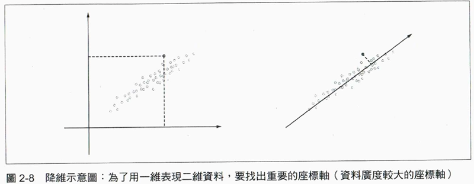
*** 奇異值分解(Singular Value Decomposition, SVD)
把任意矩陣分解成三個矩陣乘積：$A=U\Sigma V^T$ ，U與V為正交矩陣(orthogonal matrix)，其行矩陣彼此正交，S為對角矩陣(對角線以外全部為0)
#+CAPTION: SVD 分解示意圖
#+LABEL:fig:svd-decomposition
#+name: fig:svd-decomposition
#+ATTR_LATEX: :width 300
#+ATTR_ORG: :width 300
#+ATTR_HTML: :width 500
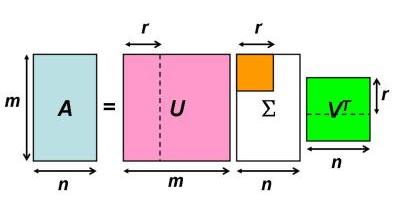
我們可以將SVD視為變換矩陣A的三個分解步驟：
1. 旋轉$V^T$
1. 伸縮$\Sigma$
1. 再旋轉$U$
#+CAPTION: SVD 旋轉與伸縮步驟
#+LABEL:fig:svd-rotation
#+name: fig:svd-rotation
#+ATTR_LATEX: :width 300
#+ATTR_ORG: :width 300
#+ATTR_HTML: :width 500
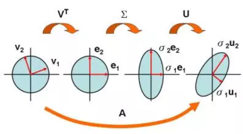
#+begin_src python -r -n :results output :exports both
# coding: utf-8
from nlputil import preprocess, create_co_matrix, ppmi
import matplotlib.pyplot as plt
import numpy as np
text = 'You say goodbye and I say hello.'
corpus, word_to_id, id_to_word = preprocess(text)
vocab_size = len(id_to_word)
C = create_co_matrix(corpus, vocab_size, window_size=1)
W = ppmi(C)

# SVD
U, S, V = np.linalg.svd(W)

np.set_printoptions(precision=3)  # 顯示3位有效數字
print(C[0])
print(W[0])
print(U[0])
# plot
for word, word_id in word_to_id.items():
    plt.annotate(word, (U[word_id, 0], U[word_id, 1]))
plt.scatter(U[:,0], U[:,1], alpha=0.5)

plt.savefig('images/SVD-1.png', dpi=300)
#+end_src

#+RESULTS:
: [0 1 0 0 0 0 0]
: [0.    1.807 0.    0.    0.    0.    0.   ]
: [ 3.409e-01 -1.110e-16 -1.205e-01 -4.163e-16 -9.323e-01 -1.110e-16
:  -2.426e-17]
: [ 0.    -0.598  0.     0.18   0.    -0.781  0.   ]
: [ 4.363e-01 -5.551e-17 -5.088e-01 -2.220e-16  2.253e-01 -1.388e-17
:  -7.071e-01]
: [ 1.665e-16 -4.978e-01  2.776e-17  6.804e-01 -1.110e-16  5.378e-01
:   7.467e-17]
利用SVD，可以把sparse vector W[0]轉變成dense vector U[0]，若要對U降維，則只要取U的前幾個元素，下圖為降成二維的結果。
#+CAPTION: SVD 二維降維結果
#+LABEL:fig:svd-2d
#+name: fig:svd-2d
#+ATTR_LATEX: :width 500
#+ATTR_ORG: :width 300
#+ATTR_HTML: :width 500
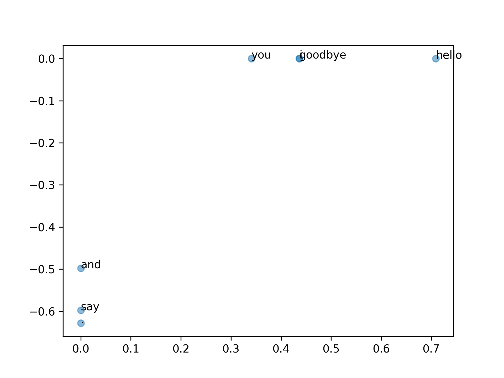
若降維成三維，結果如下
#+begin_src python -r -n :results output :exports both
# coding: utf-8
from nlputil import preprocess, create_co_matrix, ppmi
import matplotlib.pyplot as plt
import numpy as np
text = 'You say goodbye and I say hello.'
corpus, word_to_id, id_to_word = preprocess(text)
vocab_size = len(id_to_word)
C = create_co_matrix(corpus, vocab_size, window_size=1)
W = ppmi(C)

# SVD
U, S, V = np.linalg.svd(W)
# 3D
fig = plt.figure()
ax = fig.add_subplot(111, projection='3d')
UX = list(word_to_id.keys())
print(UX)
#ax.scatter(U[:,0],U[:,1],U[:,2], alpha=0.5)
for row, word in zip(U, UX):
    x = row[0]
    y = row[1]
    z = row[2]
    ax.scatter(x, y, z, alpha=0.5)
    #print(x, y, z)
    ax.text(x, y, z,  '%s' % (word), size=10, zorder=1,  color='k')

#plt.show()
plt.savefig('images/SVD-3D.png', dpi=300)
#+end_src

#+RESULTS:
: ['you', 'say', 'goodbye', 'and', 'i', 'hello', '.']
#+CAPTION: SVD 三維降維結果
#+LABEL:fig:svd-3d
#+name: fig:svd-3d
#+ATTR_LATEX: :width 500
#+ATTR_ORG: :width 300
#+ATTR_HTML: :width 500
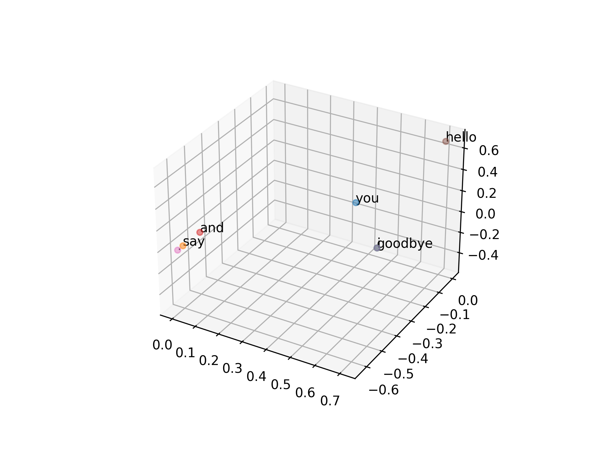
** 使用正式的語料庫試試: PTB
*** NLP中常用的語料庫(Penn Treebank)，目的是對語料進行標註(詞性及句法分析)，語料來源為1989年的華爾街日報，共1M words、2499篇文章。
*** 下載PTB
#+begin_src python -r -n :results output :exports both
# coding: utf-8
import sys
sys.path.append('..')
from dataset import ptb

corpus, word_to_id, id_to_word = ptb.load_data('train')

print('corpus size:', len(corpus))
print('corpus[:30]:', corpus[:30])
print()
print('id_to_word[0]:', id_to_word[0])
print('id_to_word[1]:', id_to_word[1])
print('id_to_word[2]:', id_to_word[2])
print()
print("word_to_id['car']:", word_to_id['car'])
print("word_to_id['happy']:", word_to_id['happy'])
print("word_to_id['lexus']:", word_to_id['lexus'])

#+end_src

#+RESULTS:
#+begin_example
corpus size: 929589
corpus[:30]: [ 0  1  2  3  4  5  6  7  8  9 10 11 12 13 14 15 16 17 18 19 20 21 22 23
 24 25 26 27 28 29]

id_to_word[0]: aer
id_to_word[1]: banknote
id_to_word[2]: berlitz

word_to_id['car']: 3856
word_to_id['happy']: 4428
word_to_id['lexus']: 7426
#+end_example
計算相似度
#+begin_src python -r -n :results output :exports both
# coding: utf-8
import numpy as np
from nlputil import preprocess, create_co_matrix, ppmi, most_similar
from dataset import ptb

window_size = 2
wordvec_size = 100

corpus, word_to_id, id_to_word = ptb.load_data('train')
vocab_size = len(word_to_id)
print('counting  co-occurrence ...')
C = create_co_matrix(corpus, vocab_size, window_size)
print('calculating PPMI ...')
W = ppmi(C, verbose=True)

print('calculating SVD ...')
try:
    # truncated SVD (fast!)
    from sklearn.utils.extmath import randomized_svd
    U, S, V = randomized_svd(W, n_components=wordvec_size, n_iter=5,
                             random_state=None)
except ImportError:
    # SVD (slow)
    U, S, V = np.linalg.svd(W)

word_vecs = U[:, :wordvec_size]

querys = ['you', 'year', 'car', 'toyota']
for query in querys:
    most_similar(query, word_to_id, id_to_word, word_vecs, top=5)
#+end_src
計算結果(要跑很久...)
[query] you
 i: 0.7198655605316162
 we: 0.6279044151306152
 do: 0.5669074654579163
 'll: 0.5507640242576599
 anybody: 0.5294491648674011

[query] year
 month: 0.722590446472168
 earlier: 0.6536098122596741
 quarter: 0.6418145895004272
 last: 0.6153697371482849
 fiscal: 0.581279993057251

[query] car
 auto: 0.5696402192115784
 truck: 0.5232617259025574
 luxury: 0.508746862411499
 vehicle: 0.49371591210365295
 domestic: 0.47702285647392273

[query] toyota
 motor: 0.7109977006912231
 nissan: 0.661170482635498
 motors: 0.6224923729896545
 lexus: 0.6070802211761475
 mazda: 0.6053721308708191
** 詞袋模型(Bag-of-words model)
詞袋模型（英語：Bag-of-words model）是個在自然語言處理和信息檢索(IR)下被簡化的表達模型。在此模型下，一段文本（比如一個句子或是一個文檔）可以用一個裝著這些詞的袋子來表示，這種表示方式不考慮文法以及詞的順序。

詞袋模型被廣泛應用在文件分類，詞出現的頻率可以用來當作訓練分類器的特徵
- https://en.wikipedia.org/wiki/Bag-of-words_model
#+begin_src python -r -n :results output :exports both
BoW1 = {"John":1,"likes":2,"to":1,"watch":1,"movies":2,"Mary":1,"too":1};
BoW2 = {"Mary":1,"also":1,"likes":1,"to":1,"watch":1,"football":1,"games":1};
BoW3 = {"John":1,"likes":3,"to":2,"watch":2,"movies":2,"Mary":2,"too":1,"also":1,"football":1,"games":1};
#+end_src
- 只有上述單字,且以 BoW3 的順序為基準
#+BEGIN_EXAMPLE
(1) BoW1 = [1, 2, 1, 1, 2, 1, 1, 0, 0, 0]
(2) BoW2 = [0, 1, 1, 1, 0, 1, 0, 1, 1, 1]
#+END_EXAMPLE
*** Bag-of-words model
To interpret the text by making a numerical representation of it.

One way to do this is by using something called a "bag-of-words" model.
This model simply counts the frequency of word tokens for each email and thereby represents it as a vector of these counts.

*** Assemble matrices function

The assemble_bag() function assembles a new dataframe containing all the unique words found in the text documents.
It counts the word frequency and then returns the new dataframe.
#+begin_src python -r -n :results output :exports both
def assemble_bag(data):
    used_tokens = []
    all_tokens = []

    for item in data:
        for token in item:
            if token in all_tokens:
                if token not in used_tokens:
                    used_tokens.append(token)
            else:
                all_tokens.append(token)

    df = pd.DataFrame(0, index = np.arange(len(data)), columns = used_tokens)

    for i, item in enumerate(data):
        for token in item:
            if token in used_tokens:
                df.iloc[i][token] += 1
    return df
#+end_src
*** Putting It All Together To Assemble Dataset
#+begin_src python -r -n :results output :exports both
import os
import numpy as np

# shuffle raw data first
def unison_shuffle_data(data, header):
    p = np.random.permutation(len(header))
    data = data[p]
    header = np.asarray(header)[p]
    return data, header
#+end_src
#+begin_src python -r -n :results output :exports both
# load data in appropriate form
def load_data(path):
    data, sentiments = [], []
    for folder, sentiment in (('neg', 0), ('pos', 1)):
        folder = os.path.join(path, folder)
        for name in os.listdir(folder):
            with open(os.path.join(folder, name), 'r') as reader:
                  text = reader.read()
            text = tokenize(text)
            text = stop_word_removal(text)
            text = reg_expressions(text)
            data.append(text)
            sentiments.append(sentiment)
    data_np = np.array(data)
    data, sentiments = unison_shuffle_data(data_np, sentiments)

    return data, sentiments

#+end_src

#+begin_src python -r -n :results output :exports both
train_path = os.path.join('aclImdb', 'train')
test_path = os.path.join('aclImdb', 'test')

raw_data, raw_header = load_data(train_path)

print(raw_data.shape)
print(len(raw_header))
#+end_src
#+begin_src python -r -n :results output :exports both
# Subsample required number of samples
random_indices = np.random.choice(range(len(raw_header)),size=(Nsamp*2,),replace=False)

data_train = raw_data[random_indices]
header = raw_header[random_indices]

print("DEBUG::data_train::")
print(data_train)
#+end_src
- Display sentiments and their frequencies in the dataset, to ensure it is roughly balanced between classes
#+begin_src python -r -n :results output :exports both
unique_elements, counts_elements = np.unique(header, return_counts=True)

print("Sentiments and their frequencies:")
print(unique_elements)
print(counts_elements)
#+end_src
*** Featurize and Create Labels
#+begin_src python -r -n :results output :exports both
MixedBagOfReviews = assemble_bag(data_train)

# this is the list of words in our bag-of-words model
predictors = [column for column in MixedBagOfReviews.columns]

# expand default pandas display options to
# make emails more clearly visible when printed
pd.set_option('display.max_colwidth', 300)

MixedBagOfReviews
# you could do print(MixedBagOfReviews),
# but Jupyter displays this nicer for pandas DataFrames
#+end_src
#+begin_src python -r -n :results output :exports both
# split into independent 70% training and 30% testing sets
data = MixedBagOfReviews.values

idx = int(0.7*data.shape[0])

# 70% of data for training
train_x = data[:idx,:]
train_y = header[:idx]

# remaining 30% for testing
test_x = data[idx:,:]
test_y = header[idx:]

print("train_x/train_y list details, to make sure it is of the right form:")
print(len(train_x))
print(train_x)
print(train_y[:5])
print(len(train_y))
#+end_src
*** fastText embedding vectors
**** TL for NLP: section3.1_Movies_Word_Embeddin
The following functions are used to extract fastText embedding vectors for each review
#+begin_src python -r -n :results output :exports both
import time
from gensim.models import FastText, KeyedVectors
import os

print(os.listdir('.'))

start=time.time()
FastText_embedding = KeyedVectors.load_word2vec_format("../input/jigsaw/wiki.en.vec")
end = time.time()
print("Loading the embedding took %d seconds"%(end-start))
#+end_src
#+begin_src python -r -n :results output :exports both
def handle_out_of_vocab(embedding,in_txt):
    out = None
    for word in in_txt:
        try:
            tmp = embedding[word]
            tmp = tmp.reshape(1,len(tmp))

            if out is None:
                out = tmp
            else:
                out = np.concatenate((out,tmp),axis=0)
        except:
            pass

    return out
#+end_src
#+begin_src python -r -n :results output :exports both
def assemble_embedding_vectors(data):
    out = None
    for item in data:
        tmp = handle_out_of_vocab(FastText_embedding,item)
        if tmp is not None:
            dim = tmp.shape[1]
            if out is not None:
                vec = np.mean(tmp,axis=0)
                vec = vec.reshape((1,dim))
                out = np.concatenate((out,vec),axis=0)
            else:
                out = np.mean(tmp,axis=0).reshape((1,dim))
        else:
            pass

    return out

#+end_src
#+begin_src python -r -n :results output :exports both

import numpy as np

# shuffle raw data first
def unison_shuffle_data(data, header):
    p = np.random.permutation(len(header))
    data = data[p]
    header = np.asarray(header)[p]
    return data, header

#+end_src

#+begin_src python -r -n :results output :exports both
# load data in appropriate form
def load_data(path):
    data, sentiments = [], []
    for folder, sentiment in (('neg', 0), ('pos', 1)):
        folder = os.path.join(path, folder)
        for name in os.listdir(folder):
            with open(os.path.join(folder, name), 'r') as reader:
                  text = reader.read()
            text = tokenize(text)
            text = stop_word_removal(text)
            text = reg_expressions(text)
            data.append(text)
            sentiments.append(sentiment)
    data_np = np.array(data)
    data, sentiments = unison_shuffle_data(data_np, sentiments)

    return data, sentiments

train_path = os.path.join('aclImdb', 'train')
test_path = os.path.join('aclImdb', 'test')
raw_data, raw_header = load_data(train_path)

print(raw_data.shape)
print(len(raw_header))
#+end_src

#+begin_src python -r -n :results output :exports both
# Subsample required number of samples
random_indices = np.random.choice(range(len(raw_header)),size=(Nsamp*2,),replace=False)
data_train = raw_data[random_indices]
header = raw_header[random_indices]

print("DEBUG::data_train::")
print(data_train)
#+end_src
- Display sentiments and their frequencies in the dataset, to ensure it is roughly balanced between classes
#+begin_src python -r -n :results output :exports both
unique_elements, counts_elements = np.unique(header, return_counts=True)

print("Sentiments and their frequencies:")
print(unique_elements)
print(counts_elements)
#+end_src

Machine learning models take vectors (arrays of numbers) as input.

When working with text, the first thing we must do come up with a strategy to convert strings to numbers (or to "vectorize" the text) before feeding it to the model.
** example
Consider the sentence
#+BEGIN_EXAMPLE
 The cat sat on the mat
#+END_EXAMPLE
The vocabulary (or unique words) in this sentence is (cat, mat, on, sat, the).
To represent each word, we will create a zero vector with length equal to the vocabulary, then place a one in the index that corresponds to the word.
#+CAPTION: Word Encoding
#+name: fig:Word-encoding-1
#+ATTR_LATEX: :width 300
#+ATTR_ORG: :width 300
#+ATTR_HTML: :width 300
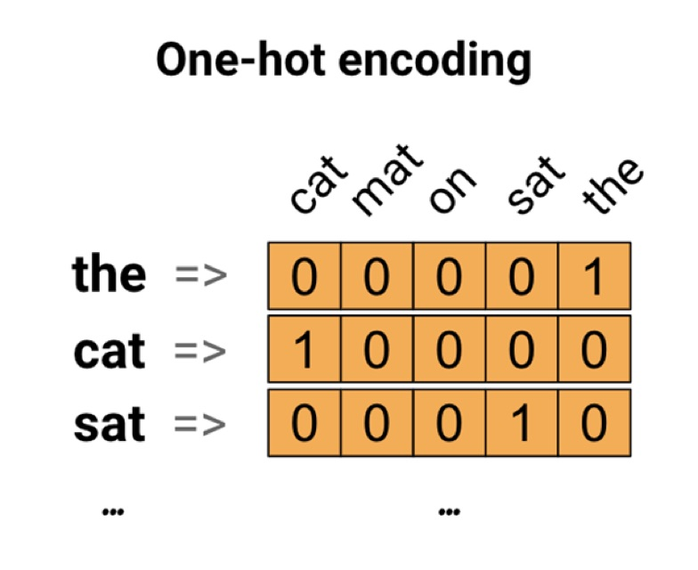
To create a vector that contains the encoding of the sentence, we could then concatenate the one-hot vectors for each word.

This approach is inefficient. A one-hot encoded vector is sparse (meaning, most indices are zero). Imagine we have 10,000 words in the vocabulary. To one-hot encode each word, we would create a vector where 99.99% of the elements are zero.

Continuing the example above, we could assign 1 to "cat", 2 to "mat", and so on.

We could then encode the sentence "The cat sat on the mat" as a dense vector like [5, 1, 4, 3, 5, 2].

This approach is efficient. Instead of a sparse vector, we now have a dense one (where all elements are full).

缺點有二:
1. The integer-encoding is arbitrary (it does not capture any relationship between words).
2. An integer-encoding can be challenging for a model to interpret. A linear classifier, for example, learns a single weight for each feature. Because there is no relationship between the similarity of any two words and the similarity of their encodings, this feature-weight combination is not meaningful.
** Word embedding
Word embeddings give us a way to use an efficient, dense representation in which similar words have a similar encoding.

Importantly, we do not have to specify this encoding by hand.

An embedding is a dense vector of floating point values (the length of the vector is a parameter you specify). Instead of specifying the values for the embedding manually, they are trainable parameters (weights learned by the model during training, in the same way a model learns weights for a dense layer). It is common to see word embeddings that are 8-dimensional (for small datasets), up to 1024-dimensions when working with large datasets.
A higher dimensional embedding can capture fine-grained relationships between words, but takes more data to learn.
#+CAPTION: Word Embedding
#+name: fig:Word-embedding-1
#+ATTR_LATEX: :width 300
#+ATTR_ORG: :width 300
#+ATTR_HTML: :width 300
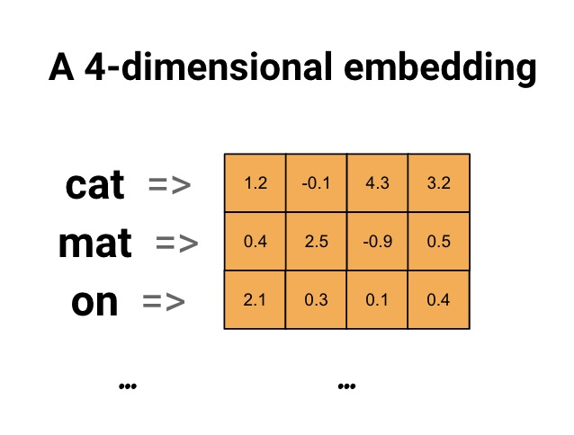

Each word is represented as a 4-dimensional vector of floating point values.
Another way to think of an embedding is as "lookup table".
After these weights have been learned, we can encode each word by looking up the dense vector it corresponds to in the table

*** Learning embeddings from scratch
https://www.tensorflow.org/tutorials/text/word_embeddings

* 推論法：word2vec
前章以「計數手法」取得字詞的分散式表示，本章要以「推論」取代「計數」，在推論中可以使用類神經網路，即word2vec。
** 計數 v.s. 推論
- 計數要建立共生矩陣，再套用到SVD獲得dense matrix，處理資料量為 $n\times n$ 的矩陣，花費 $O(n^2)$ 的時間成本。
- 推論(以類神經網路為例)一般使用小批次進行學習。
#+CAPTION: 計數與推論的比較
#+LABEL:fig:count-vs-inference
#+name: fig:count-vs-inference
#+ATTR_LATEX: :width 500
#+ATTR_ORG: :width 300
#+ATTR_HTML: :width 500
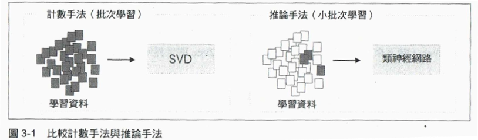
** 推論
以下圖為例，推論的工作是由you與goodbye推論出?會出現哪個字詞。
#+CAPTION: 推論範例
#+LABEL:fig:inference-example
#+name: fig:inference-example
#+ATTR_LATEX: :width 500
#+ATTR_ORG: :width 300
#+ATTR_HTML: :width 500

在推論中，將上下文輸入某一模型，然後輸出各字詞可能出現的機率
#+CAPTION: 推論模型輸出機率
#+LABEL:fig:inference-probability
#+name: fig:inference-probability
#+ATTR_LATEX: :width 500
#+ATTR_ORG: :width 300
#+ATTR_HTML: :width 500
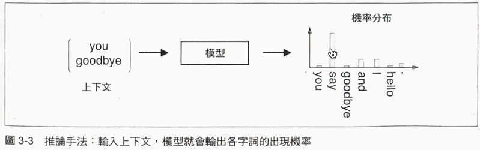
** 在類神經網路中表達字詞
類神經網路無法直接處理you、say等字詞，而是將這些字詞 *轉換* 為「固定長度的向量」，方法之一是使用one-hot-encoding。
如:
|---------+--------+------------------|
| 字詞    | 字詞ID | one-hot encoding |
|---------+--------+------------------|
| you     |      0 | (1,0,0,0,0,0,0)  |
| goodbye |      2 | (0,0,1,0,0,0,0)  |
|---------+--------+------------------|
*** 輸入層
字詞以one-hot encoding表示後，輸入層就如下圖所示，每個字詞為一個神經元
#+CAPTION: one-hot encoding 輸入層
#+LABEL:fig:onehot-input
#+name: fig:onehot-input
#+ATTR_LATEX: :width 500
#+ATTR_ORG: :width 300
#+ATTR_HTML: :width 500
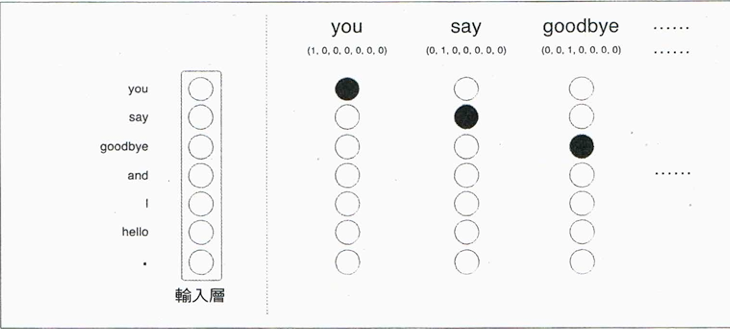
每個神經元(字詞)以 *全連接(full-connected)* 方式連至中間層，每個箭頭都有權重（參數)，將權重與輸入層的神經元加權求平均就得到中間層。此處的權重為一矩陣，此處略過bias的概念。
#+CAPTION: 權重矩陣示意圖
#+LABEL:fig:weight-matrix
#+name: fig:weight-matrix
#+ATTR_LATEX: :width 300
#+ATTR_ORG: :width 300
#+ATTR_HTML: :width 500
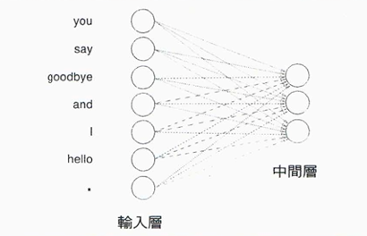
*** 輸入層至中間層的計算
#+begin_src python -r -n :results output :exports both
import numpy as np
from nlplayers import MatMul

c = np.array([[1, 0, 0, 0, 0, 0, 0]])
W = np.random.randn(7, 3)
layer = MatMul(W)
h = layer.forward(c)
print(h)
#+end_src

#+RESULTS:
: [[ 1.75309728  0.45025495 -1.25773857]]
下圖為上述程式以字詞 *you* 和weight矩陣運算後得到的vector。這裡使用MatMul層，以forword()進行正向傳播，MatMul的內容大致如下：
#+begin_src python -r -n :results output :exports both
class MatMul:
    def __init__(self, W):
        self.params = [W]
        self.grads = [np.zeros_like(W)]
        self.x = None

    def forward(self, x):
        W, = self.params
        out = np.dot(x, W)
        self.x = x
        return out

    def backward(self, dout):
        W, = self.params
        dx = np.dot(dout, W.T)
        dW = np.dot(self.x.T, dout)
        self.grads[0][...] = dW
        return dx
#+end_src
#+CAPTION: 字詞 you 與權重矩陣運算結果
#+LABEL:fig:word-you-weight
#+name: fig:word-you-weight
#+ATTR_LATEX: :width 500
#+ATTR_ORG: :width 300
#+ATTR_HTML: :width 500
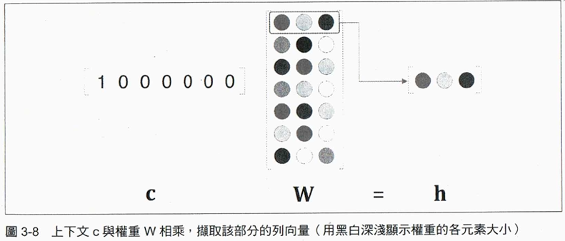
** CBOW模型
:PROPERTIES:
:ORDERED:  t
:END:
CBOW有兩個輸入層（即前後字詞、各自有其weight matrix），中間層的神經元由兩個輸入層的全連接轉換後求其平均，即第一個輸入層變成 $h_1$ 、第二個輸入層轉為 $h_2$ 、中間層為 $\frac{1}{2}(h_1+h_2)$ 。
#+CAPTION: CBOW 模型架構
#+LABEL:fig:cbow-architecture
#+name: fig:cbow-architecture
#+ATTR_LATEX: :width 500
#+ATTR_ORG: :width 300
#+ATTR_HTML: :width 500
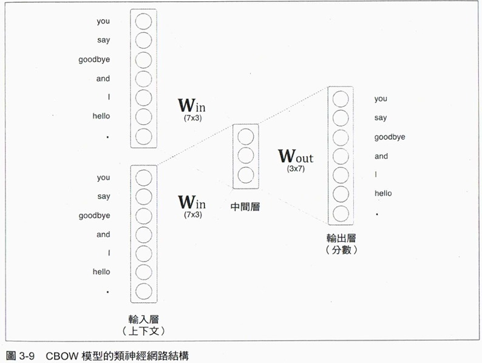

#+CAPTION: CBOW 模型計算流程
#+LABEL:fig:cbow-computation
#+name: fig:cbow-computation
#+ATTR_LATEX: :width 500
#+ATTR_ORG: :width 300
#+ATTR_HTML: :width 500
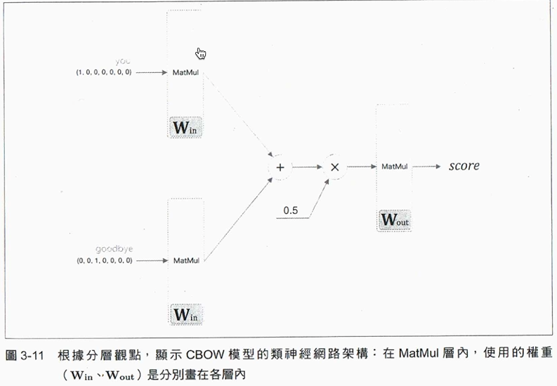

以輸入you、goodbye兩個字詞為輸入層來看，其計算方式如下：
#+begin_src python -r -n :results output :exports both
# coding: utf-8
import numpy as np
from common.layers import MatMul

# 樣本的上下文資料
c0 = np.array([[1, 0, 0, 0, 0, 0, 0]])
c1 = np.array([[0, 0, 1, 0, 0, 0, 0]])

# 初始化權重
W_in = np.random.randn(7, 3)
W_out = np.random.randn(3, 7)
# 產生各層
in_layer0 = MatMul(W_in)
in_layer1 = MatMul(W_in)
out_layer = MatMul(W_out)

# 正向傳播
h0 = in_layer0.forward(c0)
h1 = in_layer1.forward(c1)
h = 0.5 * (h0 + h1)
s = out_layer.forward(h)
print(s)

#+end_src

#+RESULTS:
: [[-0.72028045 -0.02070112  0.71300738  0.57026871 -0.4409504  -3.70044407
:   -0.27397258]]
** CBOW模型的學習
求出中間層的各神經元內容值後，再透過另一個輸出weight matrix加權計算即可得輸出層，最後經由Softmax函數將每一字詞的機率轉換為正解label，其流程如下所示：
#+CAPTION: CBOW 學習流程
#+LABEL:fig:cbow-learning
#+name: fig:cbow-learning
#+ATTR_LATEX: :width 500
#+ATTR_ORG: :width 300
#+ATTR_HTML: :width 500
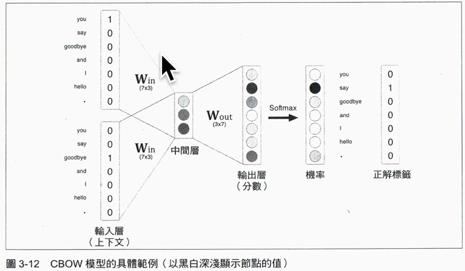
如上例，若前後文為you、goodbye，則其label應為say；在一個擁有優質weight matrix的類神經網路中，我們可以期待對應到正解的神經元「機率」變高。
這件事可以透過數學手段來解決:利用Softmax把分數轉成機率，從機率與label求出交叉熵誤差，把它當成損失函數(loss function)，學習目標就是找出能將 loss function 值最小化的那組 weight matrix。
#+CAPTION: Softmax 與交叉熵損失函數
#+LABEL:fig:softmax-crossentropy
#+name: fig:softmax-crossentropy
#+ATTR_LATEX: :width 500
#+ATTR_ORG: :width 300
#+ATTR_HTML: :width 500
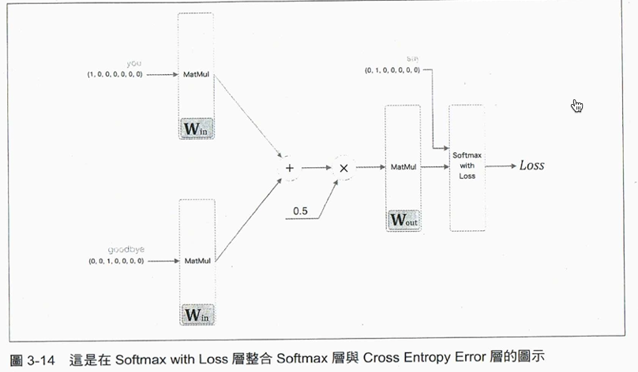

** 先找出上下文與目標對象
#+CAPTION: 上下文與目標對象
#+LABEL:fig:context-target
#+name: fig:context-target
#+ATTR_LATEX: :width 500
#+ATTR_ORG: :width 300
#+ATTR_HTML: :width 500
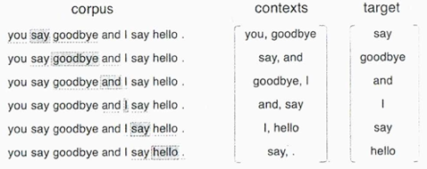
** 將上下文與目標以one-hot encoding編碼
#+CAPTION: 上下文與目標的 one-hot encoding
#+LABEL:fig:CTTGOneHotEncoding
#+name: fig:CTTGOneHotEncoding
#+ATTR_LATEX: :width 500
#+ATTR_ORG: :width 300
#+ATTR_HTML: :width 500
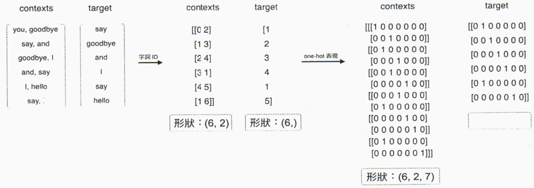
** 執行CBOW模型
#+begin_src python -r -n :results output :exports both
# coding: utf-8
import sys
sys.path.append('..')
import numpy as np
from common.layers import MatMul, SoftmaxWithLoss

class SimpleCBOW:
    def __init__(self, vocab_size, hidden_size):
        V, H = vocab_size, hidden_size

        # 初始化權重
        W_in = 0.01 * np.random.randn(V, H).astype('f')
        W_out = 0.01 * np.random.randn(H, V).astype('f')

        # 產生各層
        self.in_layer0 = MatMul(W_in)
        self.in_layer1 = MatMul(W_in)
        self.out_layer = MatMul(W_out)
        self.loss_layer = SoftmaxWithLoss()

        # 把全部的權重與梯度整合成清單
        layers = [self.in_layer0, self.in_layer1, self.out_layer]
        self.params, self.grads = [], []
        for layer in layers:
            self.params += layer.params
            self.grads += layer.grads

        # 在成員變數中，設定字詞的分散式表示
        self.word_vecs = W_in

    def forward(self, contexts, target):
        h0 = self.in_layer0.forward(contexts[:, 0])
        h1 = self.in_layer1.forward(contexts[:, 1])
        h = (h0 + h1) * 0.5
        score = self.out_layer.forward(h)
        loss = self.loss_layer.forward(score, target)
        return loss

    def backward(self, dout=1):
        ds = self.loss_layer.backward(dout)
        da = self.out_layer.backward(ds)
        da *= 0.5
        self.in_layer1.backward(da)
        self.in_layer0.backward(da)
        return None

#+end_src
*** forward()取得contexts與target兩個引數，回傳loss
- contexts為三維NumPy陣列，形狀為圖[[fig:CTTGOneHotEncoding]]中的(6, 2, 7)，表示有6個batch、上下文參考window size為2、one-hot encoding 向量長度為7。
- target為二維，假設形狀為(6, 7)
*** backward()執行反向傳播
反向傳播由圖[[fig:backward]]中的最右「1」開始，將之輸入Softmax with Loss層、再把Softmax with Loss層的反向輸出當作ds、將ds做為MatMul層的輸入。
#+CAPTION: 反向傳播流程
#+LABEL:fig:backward
#+name: fig:backward
#+ATTR_LATEX: :width 500
#+ATTR_ORG: :width 300
#+ATTR_HTML: :width 500
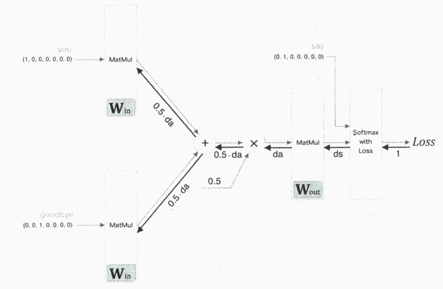
*** 學習
這段找別的書來看，這本書用太多自己寫的code，麻煩，意義不太大

* NLP實作
** IMDB 電影評論

參考來源：[[https://www.tensorflow.org/tutorials/keras/text_classification][TensorFlow 官方教學]]

IMDB 資料集已打包在 Keras 中，包含 50,000 則影評，每則已轉換為整數序列（每個整數對應字典中的一個單詞）。標籤為 0（負評）或 1（正評）。

以下程式碼完成：載入資料 → 補齊序列長度 → 建立模型 → 訓練 → 評估 → 畫出訓練曲線。

#+begin_src python -r -n :results output :exports both
# -*- coding: utf-8 -*-
import tensorflow as tf
from tensorflow import keras
import numpy as np
import matplotlib.pyplot as plt

print(f"TensorFlow 版本: {tf.__version__}")

# ===== 1. 載入 IMDB 資料集 =====
# num_words=10000：只保留最常見的 10,000 個詞，其餘用 <UNK> 代替
imdb = keras.datasets.imdb
(train_data, train_labels), (test_data, test_labels) = imdb.load_data(num_words=10000)

print(f"訓練資料: {len(train_data)} 筆, 測試資料: {len(test_data)} 筆")
print(f"第一筆評論長度: {len(train_data[0])} 個詞, 標籤: {train_labels[0]}")

# 建立「索引 → 單詞」的對照表，方便將數字序列還原成文字
word_index = imdb.get_word_index()
word_index = {k: (v + 3) for k, v in word_index.items()}
word_index["<PAD>"] = 0
word_index["<START>"] = 1
word_index["<UNK>"] = 2
word_index["<UNUSED>"] = 3
reverse_word_index = {v: k for k, v in word_index.items()}

def decode_review(text):
    """將整數序列還原成英文句子"""
    return ' '.join(reverse_word_index.get(i, '?') for i in text)

# 偷看第一筆評論的前 50 個詞
print(f"\n第一筆評論（前 50 詞）:\n{decode_review(train_data[0][:50])}...")

# ===== 2. 資料預處理：補齊序列長度 =====
# 每則評論長度不同，用 0 補齊到固定長度 256（太短補 0，太長截斷）
train_data = keras.preprocessing.sequence.pad_sequences(
    train_data, value=word_index["<PAD>"], padding='post', maxlen=256)
test_data = keras.preprocessing.sequence.pad_sequences(
    test_data, value=word_index["<PAD>"], padding='post', maxlen=256)

print(f"\n補齊後的形狀: 訓練 {train_data.shape}, 測試 {test_data.shape}")

# ===== 3. 建立模型 =====
# Embedding: 將每個詞對應到 16 維向量
# GlobalAveragePooling1D: 對所有詞向量取平均，壓縮成固定長度
# Dense(16, relu): 全連接層提取特徵
# Dense(1, sigmoid): 輸出 0~1 之間的機率（>0.5 判為正評）
model = keras.Sequential([
    keras.layers.Embedding(10000, 16),
    keras.layers.GlobalAveragePooling1D(),
    keras.layers.Dense(16, activation='relu'),
    keras.layers.Dense(1, activation='sigmoid')
])
model.summary()

# ===== 4. 編譯與訓練 =====
model.compile(optimizer='adam',
              loss='binary_crossentropy',
              metrics=['accuracy'])

# 從訓練集中切出 10,000 筆作為驗證集
x_val, partial_x_train = train_data[:10000], train_data[10000:]
y_val, partial_y_train = train_labels[:10000], train_labels[10000:]

history = model.fit(partial_x_train, partial_y_train,
                    epochs=40, batch_size=512,
                    validation_data=(x_val, y_val),
                    verbose=1)

# ===== 5. 評估模型 =====
loss, accuracy = model.evaluate(test_data, test_labels)
print(f"\n測試集 Loss: {loss:.4f}")
print(f"測試集 Accuracy: {accuracy:.4f}")

# ===== 6. 畫出訓練曲線 =====
hist = history.history
epochs = range(1, len(hist['accuracy']) + 1)

fig, axes = plt.subplots(1, 2, figsize=(12, 4))

# 左圖：損失值
axes[0].plot(epochs, hist['loss'], 'bo', label='訓練 loss')
axes[0].plot(epochs, hist['val_loss'], 'b-', label='驗證 loss')
axes[0].set_title('損失值變化')
axes[0].set_xlabel('Epoch')
axes[0].set_ylabel('Loss')
axes[0].legend()

# 右圖：準確率
axes[1].plot(epochs, hist['accuracy'], 'bo', label='訓練 acc')
axes[1].plot(epochs, hist['val_accuracy'], 'b-', label='驗證 acc')
axes[1].set_title('準確率變化')
axes[1].set_xlabel('Epoch')
axes[1].set_ylabel('Accuracy')
axes[1].legend(loc='lower right')

plt.tight_layout()
plt.savefig('images/imdb-text-classification.png', dpi=300)
print("\n訓練曲線已儲存")
#+end_src
** 假新聞分類
- 本段所有內容來自[[https://leemeng.tw/shortest-path-to-the-nlp-world-a-gentle-guide-of-natural-language-processing-and-deep-learning-for-everyone.html][進入 NLP 世界的最佳橋樑：寫給所有人的自然語言處理與深度學習入門指南]]
- [[https://www.kaggle.com/c/fake-news-pair-classification-challenge][WSDM - Fake News Classification]]
  此競賽的目的在於想辦法自動找出假新聞以節省人工檢查的成本。資料集則是由中國的手機新聞應用：今日頭條的母公司字節跳動所提出的。（知名的抖音也是由該公司的產品）[fn:6]
*** 資料集
訓練資料集（Training Set）約有 32 萬筆數據、測試資料集（Test Set）則約為 8 萬筆。
#+CAPTION: Kaggle 假新聞資料集
#+LABEL:fig:kaggle-fakenews-data
#+name: fig:kaggle-fakenews-data
#+ATTR_LATEX: :width 600
#+ATTR_ORG: :width 300
#+ATTR_HTML: :width 500
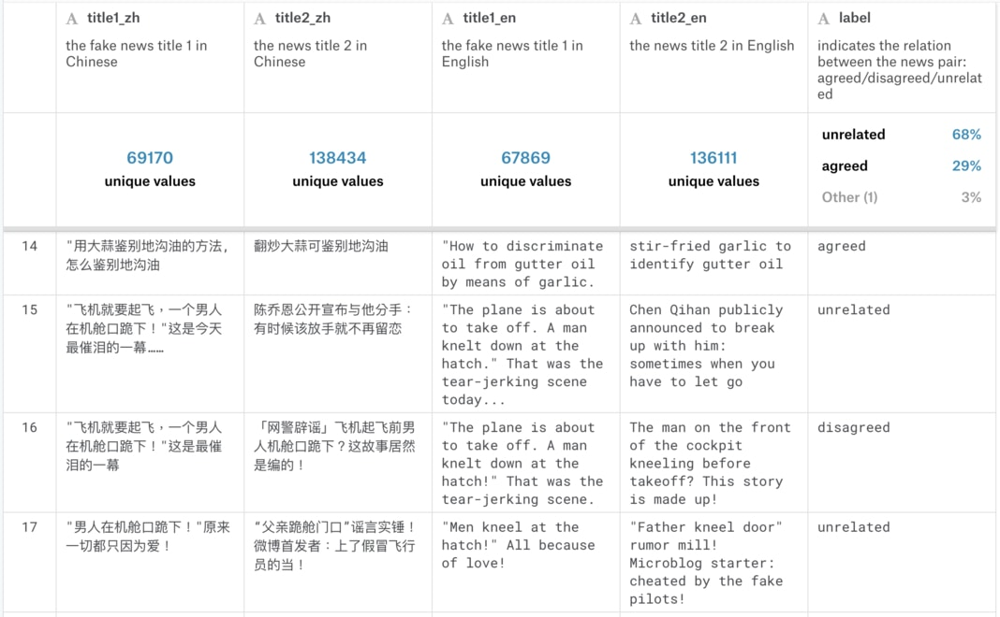
要了解此資料集，讓我們先專注在第一列（Row），大蒜與地溝油新聞的每一個欄位。
- 第一欄位 title1_zh 代表的是「已知假新聞」 A 的中文標題：用大蒜鉴别地沟油的方法,怎么鉴别地沟油
- 而第二欄位 title2_zh 則是一筆新的新聞 B 的中文標題，我們還不知道它的真偽：翻炒大蒜可鉴别地沟油
要判斷第二欄中的新聞標題是否為真，我們可以把它跟已知的第一篇假新聞做比較，分為 3 個類別：
- unrelated：B 跟 A 沒有關係
- agreed：B 同意 A 的敘述
- disagreed：B 不同意 A 的敘述
如果新聞 B 同意假新聞 A 的敘述的話，我們可以將 B 也視為一個假新聞；而如果 B 不同意假新聞 A 的敘述的話，我們可以放心地將 B 新聞釋出給一般大眾查看；如果 B 與 A 無關的話，可以考慮再進一步處理 B。
第 3、 4 欄位則為新聞標題的英文翻譯。而因為該翻譯為 *機器翻譯* ， *不一定能 100% 正確反映本來中文新聞想表達的意思* ，因此接下來的文章會忽視這兩個欄位，只使用簡體中文的新聞標題來訓練 NLP 模型。
*** 思路
現在任務目標: 要將有 32 萬筆數據的訓練資料集（Training Set）交給我們的 NLP 模型，讓它「閱讀」每一列裡頭的假新聞 A 與新聞 B 的標題並瞭解它們之間的關係（不相關、B 同意 A、B 不同意 A）。這是一個非常典型的機器學習（Machine Learning, ML）問題。我們當然希望不管使用什麼樣的模型，該模型都能夠幫我們減少人工檢查的成本，並同時最大化分類的準確度。
**** 觀察資料集
訓練集中的三個類別比例如下：
#+CAPTION: 假新聞分類比例分布
#+LABEL:fig:fakenews-dist
#+name: fig:fakenews-dist
#+ATTR_LATEX: :width 300
#+ATTR_ORG: :width 300
#+ATTR_HTML: :width 500
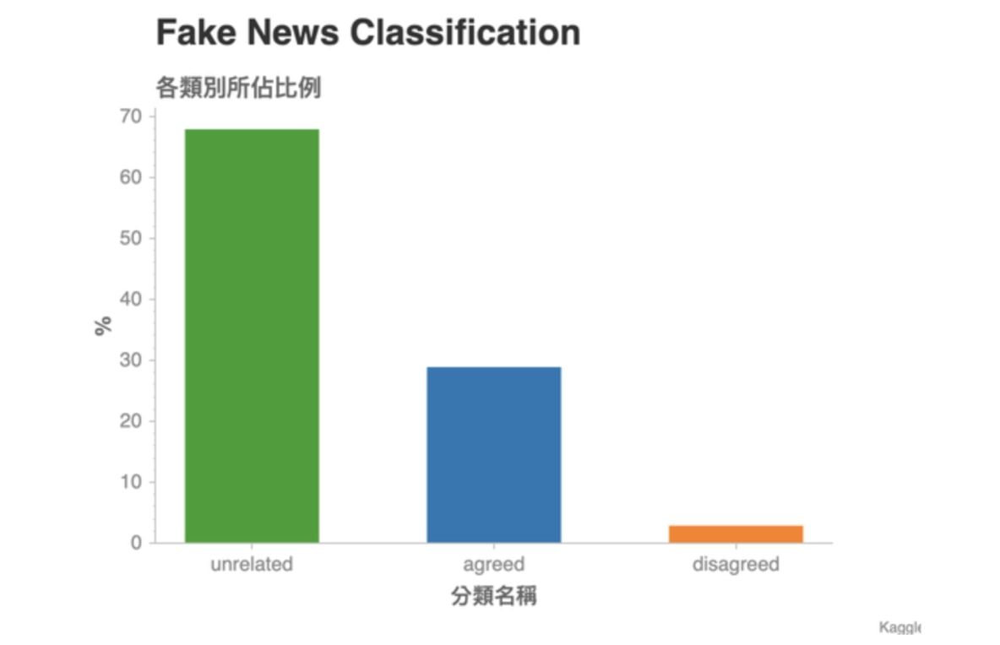
- 這張圖顯示了訓練資料集（Training Set）裏頭各個分類所佔的比例。是一個常見的 Unbalanced Dataset：特定的分類佔了數據的大半比例。
- 現在假設測試資料集（Test Set）的數據分佈跟訓練資料集相差不遠，且衡量一個分類模型的指標是準確度（Accuracy）：100 組成對新聞中，模型猜對幾組。
- 這時候如果要你用一個簡單法則來分類所有成對新聞，並同時最大化準確度，你會怎麼做？
- 對沒錯，就是全部猜 unrelated 就對了！
此競賽採用Weighted Categorization Accuracy做為效能評估依據:
$$ WeightedAccuracy(y, \hat{y}, \omega) = \frac{1}{n} \displaystyle{\sum_{i=1}^{n}} \frac{{\omega}_i(y_i=\hat{y}_i)}{\sum {\omega}_i} $$
where
- $y$ are ground truths
- $\hat y$ are the predicted results
- $\omega_i$ 為資料庫中第 $i$ 個項目的權重
*** 資料前處理：讓機器能夠處理文字
即，如何將
#+begin_verse
用大蒜鉴别地沟油的方法,怎么鉴别地沟油
#+end_verse
轉換成人腦不易理解，但很「機器友善」的數字序列（Sequence of Numbers）：
#+begin_verse
[217, 1268, 32, 1178, 25, 489, 116]
#+end_verse
資料型態轉換流程:
**** 讀入資料
先讓我們用 Pandas 將訓練資料集讀取進來
#+begin_src python -r -n :results output :exports both :session fakenews
import pandas as pd
train = pd.read_csv("./dataset/fakeNews.train.csv", index_col=0, encoding='utf-8', dtype=str)
#train = pd.read_csv(TRAIN_CSV_PATH, index_col=0)
print(train.head(3))
#+end_src

#+RESULTS:
:    tid1 tid2  ...                                          title2_en      label
: id            ...
: 0     0    1  ...  Police disprove "bird's nest congress each per...  unrelated
: 3     2    3  ...  Shenzhen's GDP outstrips Hong Kong? Shenzhen S...  unrelated
: 1     2    4  ...  The GDP overtopped Hong Kong? Shenzhen clarifi...  unrelated
:
: [3 rows x 7 columns]

為了畫面簡潔，讓我們只選取 2 個中文新聞標題以及分類結果（Label）的欄位：
#+begin_src python -r -n :results output :exports both :session fakenews
cols = ['title1_zh',
        'title2_zh',
        'label']
train = train.loc[:, cols]
print(train.columns)
print(train.head(3))
#+end_src

#+RESULTS:
: Index(['title1_zh', 'title2_zh', 'label'], dtype='object')
:                             title1_zh                  title2_zh      label
: id
: 0       2017养老保险又新增两项，农村老人人人可申领，你领到了吗   警方辟谣“鸟巢大会每人领5万” 仍有老人坚持进京  unrelated
: 3   "你不来深圳，早晚你儿子也要来"，不出10年深圳人均GDP将超香港  深圳GDP首超香港？深圳统计局辟谣：只是差距在缩小  unrelated
: 1   "你不来深圳，早晚你儿子也要来"，不出10年深圳人均GDP将超香港       GDP首超香港？深圳澄清：还差一点点……  unrelated

有了必要的欄位以後，我們可以開始進行數據的前處理了。
**** 用 Jieba 進行中文斷詞
文本分詞（Text Segmentation）是一個將一連串文字切割成多個有意義的單位的步驟。這單位可以是
- 一個中文漢字 / 英文字母（Character）
- 一個中文詞彙 / 英文單字（Word）
- 一個中文句子 / 英文句子（Sentence）
以英文來說，Word Segmentation 十分容易。通常只要依照空白分割，就能得到一個有意義的詞彙列表了（在這邊讓我們先無視標點符號）：
#+begin_src python -r -n :results output :exports both
text = 'I am Meng Lee, a data scientist based in Tokyo.'
words = text.split(' ')
print(words)
#+end_src
#+RESULTS:
: ['I', 'am', 'Meng', 'Lee,', 'a', 'data', 'scientist', 'based', 'in', 'Tokyo.']
但很明顯地，中文無法這樣做。這時候我們將藉助 Jieba 這個中文斷詞工具，來為一連串的文字做有意義的切割：
#+begin_src python -r -n :results output :exports both
import jieba.posseg as pseg

text = '我是李孟，在東京工作的數據科學家'
words = pseg.cut(text)
print([word for word in words])
#+end_src

#+RESULTS:
: [pair('我', 'r'), pair('是', 'v'), pair('李孟', 'nr'), pair('，', 'x'), pair('在', 'p'), pair('東京', 'ns'), pair('工作', 'vn'), pair('的', 'uj'), pair('數據', 'n'), pair('科學家', 'n')]
如上所示，Jieba 將我們的中文文本切成有意義的詞彙列表，並為每個詞彙附上對應的詞性（Flag）。
假設我們不需要標點符號，則只要將 flag == x 的詞彙去除即可。
#+begin_src python -r -n :results output :exports both
import jieba.posseg as pseg

text = '我是李孟，在東京工作的數據科學家'
words = pseg.cut(text)
print([(x.word, x.flag) for x in words])
#+end_src

#+RESULTS:
: [('我', 'r'), ('是', 'v'), ('李孟', 'nr'), ('，', 'x'), ('在', 'p'), ('東京', 'ns'), ('工作', 'vn'), ('的', 'uj'), ('數據', 'n'), ('科學家', 'n')]

我們可以寫一個很簡單的 Jieba 斷詞函式，此函式能將輸入的文本 text 斷詞，並回傳除了標點符號以外的詞彙列表：
#+begin_src python -r -n :results output :exports both :session fakenews
import jieba.posseg as pseg

def jieba_tokenizer(text):
    words = pseg.cut(text)
    return ' '.join([word for word, flag in words if flag != 'x'])

text = '我是李孟，在東京工作的數據科學家'
print(jieba_tokenizer(text))
#+end_src

#+RESULTS:
: Building prefix dict from the default dictionary ...
: Dumping model to file cache /var/folders/cb/t4v0kdcj6fj20jdzljy7y9240000gn/T/jieba.cache
: Loading model cost 0.706 seconds.
: Prefix dict has been built successfully.
: 我 是 李孟 在 東京 工作 的 數據 科學家

我們可以利用 Pandas 的 apply 函式，將 jieba_tokenizer 套用到所有新聞標題 A 以及 B 之上，做文本分詞：
#+begin_src python -r -n :results output :exports both :session fakenews
import pandas as pd
import jieba.posseg as pseg

train = pd.read_csv("./dataset/fakeNews.train.csv", index_col=0, encoding='utf-8', dtype=str)

cols = ['title1_zh',
        'title2_zh',
        'label']
train = train.loc[:, cols]

def jieba_tokenizer(text):
    words = pseg.cut(text)
    return ' '.join([word for word, flag in words if flag != 'x'])

print(train.columns)
train['title1_tokenized'] = train.loc[:, 'title1_zh'].astype(str).apply(jieba_tokenizer)
train['title2_tokenized'] = train.loc[:, 'title2_zh'].astype(str).apply(jieba_tokenizer)
print(train.columns)
#+end_src

#+RESULTS:
: Index(['title1_zh', 'title2_zh', 'label'], dtype='object')
: Index(['title1_zh', 'title2_zh', 'label', 'title1_tokenized',
:        'title2_tokenized'],
:       dtype='object')

新聞標題 A 的斷詞結果如下：
#+begin_src python -r -n :results output :exports both :session fakenews
print(train.iloc[:, [0, 3]].head())
#+end_src

#+RESULTS:
:                             title1_zh                                 title1_tokenized
: id
: 0       2017养老保险又新增两项，农村老人人人可申领，你领到了吗         2017 养老保险 又 新增 两项 农村 老人 人人 可 申领 你 领到 了 吗
: 3   "你不来深圳，早晚你儿子也要来"，不出10年深圳人均GDP将超香港  你 不 来 深圳 早晚 你 儿子 也 要 来 不出 10 年 深圳 人均 GDP 将 超 香港
: 1   "你不来深圳，早晚你儿子也要来"，不出10年深圳人均GDP将超香港  你 不 来 深圳 早晚 你 儿子 也 要 来 不出 10 年 深圳 人均 GDP 将 超 香港
: 2   "你不来深圳，早晚你儿子也要来"，不出10年深圳人均GDP将超香港  你 不 来 深圳 早晚 你 儿子 也 要 来 不出 10 年 深圳 人均 GDP 将 超 香港
: 9                "用大蒜鉴别地沟油的方法,怎么鉴别地沟油                       用 大蒜 鉴别 地沟油 的 方法 怎么 鉴别 地沟油

新聞標題 B 的結果則為：
#+begin_src python -r -n :results output :exports both :session fakenews
print(train.iloc[:, [1, 4]].head())
#+end_src

#+RESULTS:
:                      title2_zh                      title2_tokenized
: id
: 0     警方辟谣“鸟巢大会每人领5万” 仍有老人坚持进京     警方 辟谣 鸟巢 大会 每人 领 5 万 仍 有 老人 坚持 进京
: 3    深圳GDP首超香港？深圳统计局辟谣：只是差距在缩小    深圳 GDP 首 超 香港 深圳 统计局 辟谣 只是 差距 在 缩小
: 1         GDP首超香港？深圳澄清：还差一点点……              GDP 首 超 香港 深圳 澄清 还 差 一点点
: 2   去年深圳GDP首超香港？深圳统计局辟谣：还差611亿  去年 深圳 GDP 首 超 香港 深圳 统计局 辟谣 还 差 611 亿
: 9      吃了30年食用油才知道，一片大蒜轻松鉴别地沟油     吃 了 30 年 食用油 才 知道 一片 大蒜 轻松 鉴别 地沟油

**** 建立字典並將文本轉成數字序列
當我們將完整的新聞標題切成一個個有意義的詞彙（Token）以後，下一步就是將這些詞彙轉換成一個數字序列，方便電腦處理。
這些數字是所謂的索引（Index），分別對應到特定的詞彙。
假設我們現在就只有一個新聞標題：
#+begin_verse
狐狸被陌生人拍照
#+end_verse
我們首先會對此標題做斷詞，將句子分成多個有意義的詞彙：
#+begin_src python -r -n :results output :exports both :session fox
import jieba.posseg as pseg
text = '狐狸被陌生人拍照'
words = pseg.cut(text)
words = [w for w, f in words]
print(words)
#+end_src

#+RESULTS:
: ['狐狸', '被', '陌生人', '拍照']
有了詞彙的列表以後，我們可以建立一個字典 word_index。
該 dict 裏頭將上面的 4 個詞彙當作鍵值（Key），每個鍵值對應的值（Value）則為不重複的數字：
#+begin_src python -r -n :results output :exports both :session fox
word_index = {
    word: idx
    for idx, word in enumerate(words)
}
print(word_index)
#+end_src

#+RESULTS:
: {'狐狸': 0, '被': 1, '陌生人': 2, '拍照': 3}
有了這個字典以後，我們就能把該句子轉成一個數字序列：
#+begin_src python -r -n :results output :exports both :session fox
print(words)
print([word_index[w] for w in words])
#+end_src

#+RESULTS:
: ['狐狸', '被', '陌生人', '拍照']
: [0, 1, 2, 3]

如果來了一個新的句子：
#+begin_verse
陌生人被狐狸拍照
#+end_verse
我們也能利用手上已有的字典 word_index 如法炮製：
#+begin_src python -r -n :results output :exports both :session fox
text = '陌生人被狐狸拍照'
words = pseg.cut(text)
words = [w for w, f in words]
print(words)
print([word_index[w] for w in words])
#+end_src

#+RESULTS:
: ['陌生人', '被', '狐狸', '拍照']
: [2, 1, 0, 3]
在這個簡單的狐狸例子裡頭，word_index 就是我們的字典；我們利用該字典，將 1 句話轉成包含多個數字的序列，而每個數字實際上代表著一個 Token。
**** 如何將新聞標題轉為數字序列
1. 將已被斷詞的新聞標題 A 以及新聞標題 B 全部倒在一起
1. 建立一個空字典
1. 查看所有新聞標題，裏頭每出現一個字典裡頭沒有的詞彙，就為該詞彙指定一個字典裡頭還沒出現的索引數字，並將該詞彙放入字典
1. 利用建好的字典，將每個新聞標題裡頭包含的詞彙轉換成數字
***** 步驟1: 將已被斷詞的新聞標題 A 以及新聞標題 B 全部倒在一起
上述步驟幾乎是NLP的必要動作，許多套件都提供了相應的function，如Keras
#+begin_src python -r -n :results output :exports both :session fakenews
import keras
MAX_NUM_WORDS = 10000
tokenizer = keras.preprocessing.text.Tokenizer(num_words=MAX_NUM_WORDS)
#+end_src

#+RESULTS:

Tokenizer 顧名思義，即是將一段文字轉換成一系列的詞彙（Tokens），並為其建立字典。這邊的 num_words=10000 代表我們限制字典只能包含 10,000 個詞彙，一旦字典達到這個大小以後，剩餘的新詞彙都會被視為 Unknown，以避免字典過於龐大。

如同上述的步驟 1，我們得將新聞 A 及新聞 B 的標題全部聚集起來，為它們建立字典：
#+begin_src python -r -n :results output :exports both :session fakenews
corpus_x1 = train.title1_tokenized
corpus_x2 = train.title2_tokenized
corpus = pd.concat([
    corpus_x1, corpus_x2])
print(corpus.shape)
#+end_src

#+RESULTS:
: (641104,)

因為訓練集有大約 32 萬列（Row）的成對新聞（每一列包含 2 筆新聞：A & B），因此將所有新聞放在一起的話，就有 2 倍的大小。而這些文本的集合在習慣上被稱作語料庫（Text Corpus），代表著我們有的所有文本數據。以下是我們語料庫的一小部分：
#+begin_src python -r -n :results output :exports both :session fakenews
print(pd.DataFrame(corpus.iloc[14:19], columns=['title']))
#+end_src

#+RESULTS:
:                                          title
: id
: 15   飞机 就要 起飞 一个 男人 在 机舱 口 跪下 这 是 今天 最 催泪 的 一幕
: 17      飞机 就要 起飞 一个 男人 在 机舱 口 跪下 这 是 最 催泪 的 一幕
: 14                 男人 在 机舱 口 跪下 原来 一切 都 只 因为 爱
: 16   飞机 就要 起飞 一个 男人 在 机舱 口 跪下 这 是 今天 最 催泪 的 一幕
: 18  飞机 就要 起飞 一个 男人 在 机舱 口 跪下 这 是 见 过 最 催泪 的 一幕
***** 步驟2,3: 呼叫 tokenizer 為我們查看所有文本，並建立一個字典
#+begin_src python -r -n :results output :exports both :session fakenews
tokenizer.fit_on_texts(corpus)
#+end_src

#+RESULTS:

以我們的語料庫大小來說，這大約需時 10 秒鐘。而等到 tokenizer 建好字典以後，我們可以進行上述第 4 個步驟，請 tokenizer 利用內部生成的字典分別將我們的新聞標題 A 與 新聞 B 轉換成數字序列：
#+begin_src python -r -n :results output :exports both :session fakenews
x1_train = tokenizer.texts_to_sequences(corpus_x1)
x2_train = tokenizer.texts_to_sequences(corpus_x2)
print(len(x1_train))
print(x1_train[:1])
print(pd.DataFrame(corpus.iloc[:1], columns=['title']))
#+end_src

#+RESULTS:
: 320552
: [[217, 1268, 32, 1178, 5967, 25, 489, 2877, 116, 5559, 4, 1850, 2, 13]]
:                                        title
: id
: 0   2017 养老保险 又 新增 两项 农村 老人 人人 可 申领 你 领到 了 吗

x1_train 為一個 Python list，裡頭包含了每一筆假新聞標題 A 對應的數字序列。
讓我們利用 tokenizer.index_word 來將索引數字對應回本來的詞彙：
#+begin_src python -r -n :results output :exports both :session fakenews
for seq in x1_train[:1]:
    print([tokenizer.index_word[idx] for idx in seq])
#+end_src

#+RESULTS:
: ['2017', '养老保险', '又', '新增', '两项', '农村', '老人', '人人', '可', '申领', '你', '领到', '了', '吗']
**** 序列的 Zero Padding
雖然我們已經將每個新聞標題的文本轉為一行行的數字序列，你會發現每篇標題的序列長度並不相同：
#+begin_src python -r -n :results output :exports both :session fakenews
for seq in x1_train[:10]:
    print(len(seq), seq[:5], ' ...')
#+end_src

#+RESULTS:
#+begin_example
14 [217, 1268, 32, 1178, 5967]  ...
19 [4, 10, 47, 678, 2558]  ...
19 [4, 10, 47, 678, 2558]  ...
19 [4, 10, 47, 678, 2558]  ...
9 [31, 320, 3372, 3062, 1]  ...
19 [4, 10, 47, 678, 2558]  ...
6 [7, 2221, 1, 2072, 7]  ...
19 [4, 10, 47, 678, 2558]  ...
14 [1281, 1211, 427, 3, 3245]  ...
9 [31, 320, 3372, 3062, 1]  ...
#+end_example
而為了方便之後的 NLP 模型處理（見循環神經網路一章），一般會設定一個 MAX_SEQUENCE_LENGTH 來讓所有序列的長度一致。長度超過此數字的序列尾巴會被刪掉；而針對原來長度不足的序列，我們則會在詞彙前面補零。Keras 一樣有個方便函式 pad_sequences 來幫助我們完成這件工作：
#+begin_src python -r -n :results output :exports both :session fakenews
MAX_SEQUENCE_LENGTH = 20
x1_train = keras.preprocessing.sequence.pad_sequences(x1_train,
                   maxlen=MAX_SEQUENCE_LENGTH)

x2_train = keras.preprocessing.sequence.pad_sequences(x2_train,
                   maxlen=MAX_SEQUENCE_LENGTH)
for seq in x1_train[:3]:
    print(len(seq), seq[:5], ' ...')
for seq in x2_train[:3]:
    print(len(seq), seq[:5], ' ...')
print(f'Zero Padding後x1_train[0]的內容:{x1_train[0]}')
#+end_src

#+RESULTS:
: 20 [0 0 0 0 0]  ...
: 20 [  0   4  10  47 678]  ...
: 20 [  0   4  10  47 678]  ...
: 20 [0 0 0 0 0]  ...
: 20 [0 0 0 0 0]  ...
: 20 [0 0 0 0 0]  ...
: Zero Padding後x1_train[0]的內容:[   0    0    0    0    0    0  217 1268   32 1178 5967   25  489 2877
:   116 5559    4 1850    2   13]
其中，x1_train[0]因為長度不足20(只有14)，故前6項被補0，所有的新聞標題也是:
#+begin_src python -r -n :results output :exports both :session fakenews
for seq in x1_train + x2_train:
    assert len(seq) == 20

print("所有新聞標題的序列長度皆為 20 !")
#+end_src

#+RESULTS:
: 所有新聞標題的序列長度皆為 20 !
#+begin_src python -r -n :results output :exports both :session fakenews
print(x1_train[:3])
#+end_src

#+RESULTS:
: [[   0    0    0    0    0    0  217 1268   32 1178 5967   25  489 2877
:    116 5559    4 1850    2   13]
:  [   0    4   10   47  678 2558    4  166   34   17   47 5150   63   15
:    678 4502 3211   23  284 1181]
:  [   0    4   10   47  678 2558    4  166   34   17   47 5150   63   15
:    678 4502 3211   23  284 1181]]
接下來要處理label
**** 將正解做 One-hot Encoding
#+begin_src python -r -n :results output :exports both :session fakenews
print(train.label[:5])
#+end_src

#+RESULTS:
: id
: 0    unrelated
: 3    unrelated
: 1    unrelated
: 2    unrelated
: 9       agreed
: Name: label, dtype: object
label 的處理相對簡單。跟新聞標題相同，我們一樣需要一個字典將分類的文字轉換成索引：
#+begin_src python -r -n :results output :exports both :session fakenews
import numpy as np

# 定義每一個分類對應到的索引數字
label_to_index = {
    'unrelated': 0,
    'agreed': 1,
    'disagreed': 2
}

# 將分類標籤對應到剛定義的數字
y_train = train.label.apply(
    lambda x: label_to_index[x])

y_train = np.asarray(y_train).astype('float32')
print(y_train[:20])
#+end_src

#+RESULTS:
: [0. 0. 0. 0. 1. 0. 0. 0. 0. 1. 1. 1. 1. 1. 0. 2. 0. 0. 0. 0.]

現在每個分類的文字標籤都已經被轉成對應的數字，接著讓我們利用 Keras 做 One Hot Encoding：
#+begin_src python -r -n :results output :exports both :session fakenews
from keras.utils import to_categorical
y_train = to_categorical(y_train)
print(y_train[:5])
#+end_src

#+RESULTS:
: [[1. 0. 0.]
:  [1. 0. 0.]
:  [1. 0. 0.]
:  [1. 0. 0.]
:  [0. 1. 0.]]
上述矩陣的每一列即為 1 個 label，而你可以看到現在每個 label 都從 1 個數字變成一個 3 維的向量（Vector）。每 1 維度則對應到 1 個分類：
- [1, 0, 0] 代表 label 為 unrelated
- [0, 1, 0] 代表 label 為 agreed
- [0, 0, 1] 代表 label 為 disagreed
用這樣的方式表達 label 的好處是我們可以把分類結果想成機率分佈。[1, 0, 0] 就代表一組新聞標題 A、B 為 unrelated 的機率等於 100 %；假設預測的結果為[0.7, 0.2, 0.1]，則代表模型認為這 2 個新聞標題的關係有 70 % 的機率為 unrelated、20 % 的機率是 agreed 而 10 % 為 disagreed。
***** Why One-Hot Encoding?
轉換後有兩個優點
1.能夠處理非連續型的分類變量。
2.在一定程度上也擴充了特徵，讓特徵之間更稀疏。
**** 切割訓練資料集 & 驗證資料集
- 驗證集: 我們會反覆在 Train / Valid Set 上訓練並測試模型，最後用 Test Set 一決生死，至於驗證集的必要，簡而言之，當你多次利用驗證資料集的預測結果以修正模型，並讓它在該資料集表現更好時，過適（Overfitting）的風險就已經產生了。
- 測試集: 儘管你沒有直接讓模型看到驗證資料集（Validation Set）內的任何數據，你還是間接地洩漏了該資料集的重要資訊：你讓模型知道怎樣的參數設定會讓它在該資料集表現比較好，亦或表現較差。因此有一個完全跟模型訓練過程獨立的測試資料集（Test Set）就顯得重要許多了。
#+CAPTION: 訓練/驗證/測試資料集切割
#+LABEL:fig:train-valid-test-split
#+name: fig:train-valid-test-split
#+ATTR_LATEX: :width 300
#+ATTR_ORG: :width 300
#+ATTR_HTML: :width 500
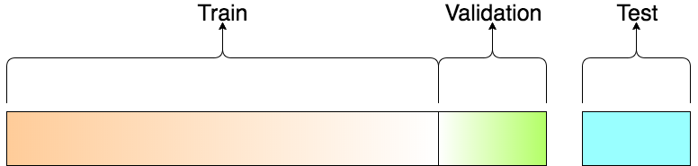
要切訓練資料集 / 驗證資料集，scikit-learn 中的 train_test_split 函式是一個不錯的選擇：
#+begin_src python -r -n :results output :exports both :session fakenews
from sklearn.model_selection import train_test_split

VALIDATION_RATIO = 0.1
# 小彩蛋
RANDOM_STATE = 9527

x1_train, x1_val, x2_train, x2_val, y_train, y_val = train_test_split(
        x1_train, x2_train, y_train,
        test_size=VALIDATION_RATIO,
        random_state=RANDOM_STATE
)
#+end_src

#+RESULTS:

在這邊，我們分別將新聞標題 A x1_train、新聞標題 B x2_train 以及分類標籤 y_train 都分成兩個部分：訓練部分 & 驗證部分。

以假新聞 A 的標題 x1_train 為例，本來完整 32 萬筆的 x1_train 會被分為包含 90 % 數據的訓練資料集 x1_train 以及 10 % 的驗證資料集 x1_val。

#+begin_src python -r -n :results output :exports both :session fakenews
print("Training Set")
print("-" * 10)
print(f"x1_train: {x1_train.shape}")
print(f"x2_train: {x2_train.shape}")
print(f"y_train : {y_train.shape}")

print("-" * 10)
print(f"x1_val:   {x1_val.shape}")
print(f"x2_val:   {x2_val.shape}")
print(f"y_val :   {y_val.shape}")
print("-" * 10)
print("Test Set")
#+end_src

#+RESULTS:
#+begin_example
Training Set
----------
x1_train: (288496, 20)
x2_train: (288496, 20)
y_train : (288496, 3)
----------
x1_val:   (32056, 20)
x2_val:   (32056, 20)
y_val :   (32056, 3)
----------
Test Set
#+end_example
我們可以看到，切割後的訓練資料集有 288,488 筆資料。每一筆資料裡頭，成對新聞標題 A & B 的長度皆為 20 個 Tokens，分類結果則有 3 個；驗證資料集的內容一模一樣，僅差在資料筆數較少（32,055 筆）。

到此為此，資料前處理大功告成！
*** [[id:263cb433-d0eb-4400-a373-35175c000c01][循環神經網路]]
*** 詞向量：將詞彙表達成有意義的向量¶
訓練資料集裡頭前 5 筆的假新聞標題 A：
#+begin_src python -r -n :results output :exports both :session fakenews
for i, seq in enumerate(x1_train[:5]):
    print(f"新聞標題 {i + 1}: ")
    print(seq)
    print()
print(x1_train.shape)
#+end_src

#+RESULTS:
#+begin_example
新聞標題 1:
[   0    0    0    0    0 4178 2972    9   80   87  717   18  474    4
  968    4  823   14 1436  721]

新聞標題 2:
[   0    0    0    0    0    0    0    0    0  411  308  809 3142   17
   90  434  191 3713    1    2]

新聞標題 3:
[   0    0    0    0    0    0    0    0    0    0    0 5212    5 8867
  793 1063 3626  642  337 1172]

新聞標題 4:
[   0    0    0    0    0    0    0    0    0    0    0    0    0    0
    0    0 2832  244  493  393]

新聞標題 5:
[   0    0    0    0    0    0    0    0  290  143 2523 2380   46 3120
   70  243  178 2238 3945 1082]

(288496, 20)
#+end_example

而我們在訓練資料集則總共有 288,488 筆新聞標題，每筆標題如同剛剛所說的，是一個包含 20 個數字的序列。我們可以用 tokenizer 裡頭的字典 index_word 還原文本看看：
#+begin_src python -r -n :results output :exports both :session fakenews
for i, seq in enumerate(x1_train[:5]):
    print(f"新聞標題 {i + 1}: ")
    print([tokenizer.index_word.get(idx, '') for idx in seq])
    print()
#+end_src

#+RESULTS:
#+begin_example
新聞標題 1:
['', '', '', '', '', '营养师', '补充', '这', '4', '种', '营养', '能', '帮', '你', '降血压', '你', '一样', '都', '不吃', '么']

新聞標題 2:
['', '', '', '', '', '', '', '', '', '刘涛', '现场', '痛哭', '发飙', '要', '离婚', '直接', '把', '旁边', '的', '了']

新聞標題 3:
['', '', '', '', '', '', '', '', '', '', '', 'nba', '被', '球星', '诞生', '火箭', '骑士', '同', '抢', '交易']

新聞標題 4:
['', '', '', '', '', '', '', '', '', '', '', '', '', '', '', '', '海口', '飞机', '撒药治', '白蛾']

新聞標題 5:
['', '', '', '', '', '', '', '', '网', '曝', '杜', '海涛', '与', '沈梦辰', '已', '分手', '疑似', '女方', '劈', '腿']
#+end_example
但事實上要讓神經網路能夠處理標題序列內的詞彙，我們要將它們表示成向量（更精準地說，是張量：Tensor），而不是一個單純數字。如果我們能做到這件事情，則 RNN 就能用以下的方式讀入我們的資料：
#+CAPTION: RNN 處理詞向量序列
#+LABEL:fig:rnn-process-vectors
#+name: fig:rnn-process-vectors
#+ATTR_LATEX: :width 300
#+ATTR_ORG: :width 300
#+ATTR_HTML: :width 500
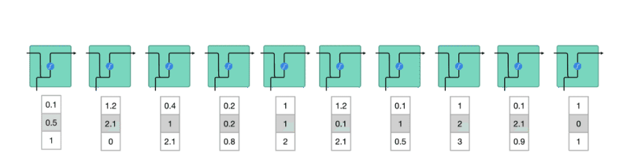

上圖中，在每個時間點被塞入 RNN 的「詞彙」不再是 1 個數字，而是一個 N 維向量（圖中 N 為 3），所以現在的問題變成：

「要怎麼將一個詞彙表示成一個 N 維向量 ？」

其中一個方法是我們隨便決定一個 N，然後為語料庫裡頭的每一個詞彙都指派一個隨機生成的 N 維向量。假設我們現在有 5 個詞彙：
- 野狼
- 老虎
- 狗
- 貓
- 喵咪

依照剛剛說的方法，我們可以設定 N = 2，並為每個詞彙隨機分配一個 2 維向量後將它們畫在一個平面空間裡頭：

#+CAPTION: 隨機詞向量分布
#+LABEL:fig:rndW2V
#+name: fig:rndW2V
#+ATTR_LATEX: :width 300
#+ATTR_ORG: :width 300
#+ATTR_HTML: :width 500
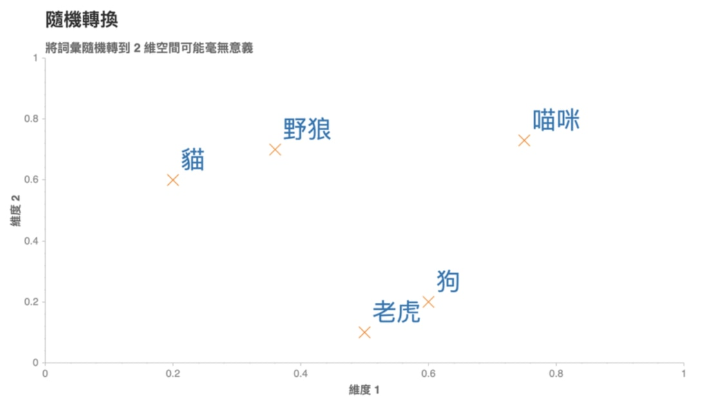

這些代表詞彙的向量被稱之為詞向量，但是你可以想像這樣的隨機轉換很沒意義。如圖[[fig:rndW2V]]我們就無法理解：
- 為何「狗」是跟「老虎」而不是跟同為犬科的「野狼」比較接近？
- 為何「貓」的維度 2 比「狗」高，但卻比「野狼」低？
- 維度 2 的值的大小到底代表什麼意義？
- 「喵咪」怎麼會在那裡？

這是因為我們只是將詞彙隨機地轉換到 2 維空間，並沒有讓這些轉換的結果（向量）反應出詞彙本身的語意（Semantic）。

一個理想的轉換應該是如圖[[fig:goodW2V]]：

#+CAPTION: 理想詞向量分布
#+LABEL:fig:goodW2V
#+name: fig:goodW2V
#+ATTR_LATEX: :width 300
#+ATTR_ORG: :width 300
#+ATTR_HTML: :width 500
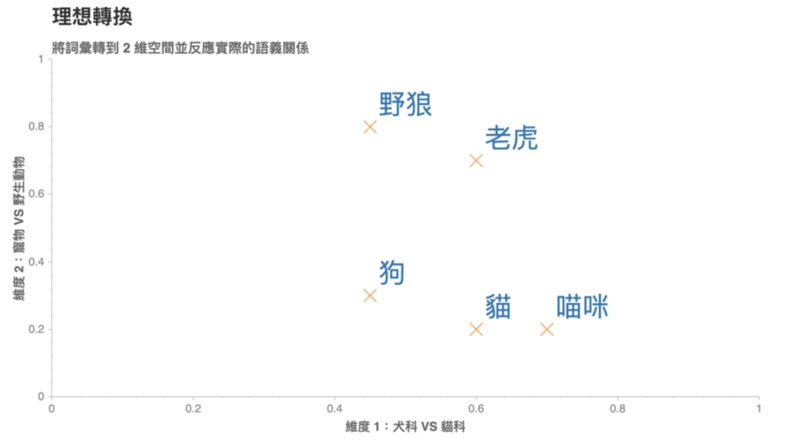

在這個 2 維空間裡頭，我們可以發現一個好的轉換有 2 個特性：
- 距離有意義：「喵咪」與意思相近的詞彙「貓」距離接近，而與較不相關的「狗」距離較遠
- 維度有意義：看看（狗, 貓）與（野狼, 老虎）這兩對組合，可以發現我們能將維度 1 解釋為貓科 VS 犬科；維度 2 解釋為寵物與野生動物

如果我們能把語料庫（Corpus）裏頭的每個詞彙都表示成一個像是這樣有意義的詞向量，神經網路就能幫我們找到潛藏在大量詞彙中的語義關係，並進一步改善 NLP 任務的精準度。

好消息是，大部分的情況我們並不需要自己手動設定每個詞彙的詞向量。我們可以隨機初始化所有詞向量（如前述的隨機轉換），並利用平常訓練神經網路的反向傳播算法（Backpropagation），讓神經網路自動學到一組適合當前 NLP 任務的詞向量（如上張圖的理想狀態）。

#+CAPTION: 反向傳播修正參數示意
#+LABEL:fig:bkpex
#+name: fig:bkpex
#+ATTR_LATEX: :width 300
#+ATTR_ORG: :width 300
#+ATTR_HTML: :width 500
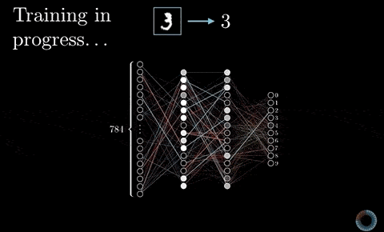

如圖[[fig:bkpex]]，反向傳播讓神經網路可以在訓練過程中修正參數，持續減少預測錯誤的可能性。

在 NLP 裏頭，這種將一個詞彙或句子轉換成一個實數詞向量（Vectors of real numbers）的技術被稱之為詞嵌入（Word Embedding）。

而在 Keras 裡頭，我們可以使用 Embedding 層來幫我們做到這件事情：
#+begin_src python -r -n :results output :exports both
from keras import layers
embedding_layer = layers.Embedding(
    MAX_NUM_WORDS, NUM_EMBEDDING_DIM)
#+end_src

- MAX_NUM_WORDS 是我們的字典大小（10,000 個詞彙）、NUM_EMBEDDING_DIM 則是詞向量的維度。常見的詞向量維度有 128、256 或甚至 1,024。
- Embedding 層一次接收 k 個長度任意的數字序列，並輸出 k 個長度相同的序列。輸出的序列中，每個元素不再是數字，而是一個 NUM_EMBEDDING_DIM 維的詞向量。

假如我們將第一筆（也就是 k = 1）假新聞標題 A 丟入 Embedding 層，並設定 NUM_EMBEDDING_DIM 為 3 的話，原來的標題 A：
#+begin_verse
新聞標題:
[
	0,
	0,
	0,
	185,
	300,
	72,
	4029,
	37,
	1,
	121,
	250,
	95,
	30,
	511,
	92,
	2358,
	33,
	2565,
	19,
	55,

]
#+end_verse
就會被轉換成類似以下的形式：
#+begin_verse
新聞標題:
[
	[0.212, 0.111, 0.666],
	[0.212, 0.111, 0.666],
	[0.212, 0.111, 0.666],
	[0.528, 0.344, 0.452],
	[0.163, 0.93, 0.58],
	[0.527, 0.262, 0.246],
	[0.077, 0.695, 0.776],
	[0.624, 0.962, 0.96],
	[0.456, 0.927, 0.404],
	[0.353, 0.119, 0.108],
	[0.805, 0.969, 0.725],
	[0.379, 0.265, 0.473],
	[0.436, 0.186, 0.738],
	[0.923, 0.287, 0.967],
	[0.477, 0.614, 0.838],
	[0.089, 0.328, 0.993],
	[0.887, 0.913, 0.885],
	[0.604, 0.118, 0.646],
	[0.907, 0.52, 0.437],
	[0.443, 0.432, 0.498],
]
#+end_verse
序列裡頭的每個數字（即詞彙）都被轉換成一個 3 維的詞向量，而相同數字則當然都會對應到同一個詞向量（如前 3 個 0 所對應到的詞向量）。
#+CAPTION: RNN 處理詞向量
#+LABEL:fig:rnn-process-vectors-2
#+name: fig:rnn-process-vectors-2
#+ATTR_LATEX: :width 300
#+ATTR_ORG: :width 300
#+ATTR_HTML: :width 500

有了這樣的轉換，我們就能將轉換後的詞向量丟入 RNN / LSTM 裏頭，讓模型逐步修正隨機初始化的詞向量，使得詞向量裡頭的值越來越有意義。

有了兩個新聞標題的詞向量，接著讓我們瞧瞧能夠處理這些數據的神經網路架構吧！
*** 一個神經網路，兩個新聞標題
一般來說，多數你見過的神經網路只會接受一個資料來源：
- 輸入一張圖片，判斷是狗還是貓
- 輸入一個音訊，將其轉成文字
- 輸入一篇新聞，判斷是娛樂還是運動新聞
#+CAPTION: 單一輸入的神經網路
#+LABEL:fig:one-data-source-nn
#+name: fig:one-data-source-nn
#+ATTR_LATEX: :width 300
#+ATTR_ORG: :width 300
#+ATTR_HTML: :width 500
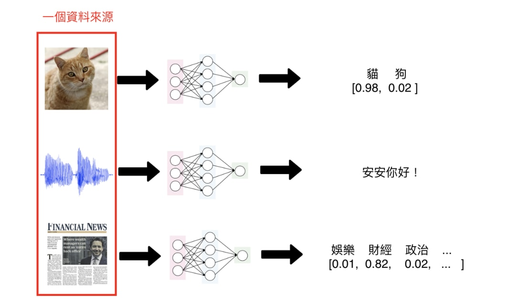

單一輸入的神經網路架構可以解決大部分的深度學習問題。但在這個 Kaggle 競賽裡頭，我們想要的是一個能夠讀入成對新聞標題，並判斷兩者之間關係的神經網路架構：
- 不相關（unrelated）
- 新聞 B 同意 A（agreed）
- 新聞 B 不同意 A（disagreed）
要怎麼做到這件事情呢？
我們可以使用孿生神經網路（Siamese Network）架構：

#+CAPTION: 使用孿生神經網路架構來處理同類型的 2 個新聞標題
#+LABEL:fig:siamese-network
#+name: fig:siamese-network
#+ATTR_LATEX: :width 300
#+ATTR_ORG: :width 300
#+ATTR_HTML: :width 500
[[file:images/siamese-network.jpg]]

所謂孿生神經網路指的是：一部份的神經網路（紅框部分）被重複用來處理多個不同的資料來源（在本篇中為 2 篇不同的新聞標題）。

而會想這樣做，是因為不管標題內容是新聞 A 還是新聞 B，其標題本身的語法 & 語義結構大同小異。
#+begin_comment
神經網路說到底，就跟其他機器學習方法相同，都是對輸入進行一連串有意義的數據轉換步驟。神經網路將輸入的數據轉換成更適合解決當前任務的數據格式，並利用轉換後的數據進行預測。
#+end_comment

以這樣的觀點來看的話，我們並不需要兩個不同的 LSTM 來分別將新聞 A 以及新聞 B 的詞向量做有意義的轉換，而是只需要讓標題 A 與標題 B 共享一個 LSTM 即可。畢竟，標題 A 跟標題 B 的數據結構很像。

如果我們只寫一個 Python 函式就能處理 2 個相同格式的輸入的話，為何要寫 2 個函式呢？孿生神經網路也是相同的概念。
*** 建立模型
深度學習以及 NLP 領域的學問博大精深，但一般來說，當你想要實際動手寫出一個神經網路的時候，有 3 個基本步驟可以 follow：
1. 定義神經網路的架構
1. 決定如何衡量模型的表現
1. 訓練模型並挑選最好的結果
#+CAPTION: 深度學習三步驟
#+LABEL:fig:dl-three-steps
#+name: fig:dl-three-steps
#+ATTR_LATEX: :width 300
#+ATTR_ORG: :width 300
#+ATTR_HTML: :width 500
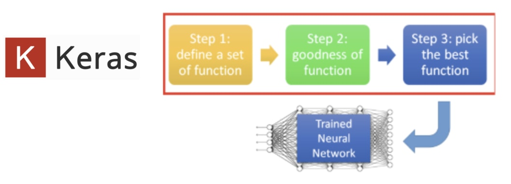
接下來你會看到，大約 80 % 的程式碼會花在實作第一個步驟。剩餘 2 個步驟在使用 Keras 的情況下非常容易就能實現；但後面我們也會談到，你將花 80 % 的時間在最後一個步驟上面。

首先，先讓我們進入第一步驟。
**** 定義神經網路的架構
在實作之前，先讓我們回顧一下前面段落看到的模型架構：
#+CAPTION: 孿生 LSTM 模型架構
#+LABEL:fig:siamese-network-detail
#+name: fig:siamese-network-detail
#+ATTR_LATEX: :width 300
#+ATTR_ORG: :width 300
#+ATTR_HTML: :width 500
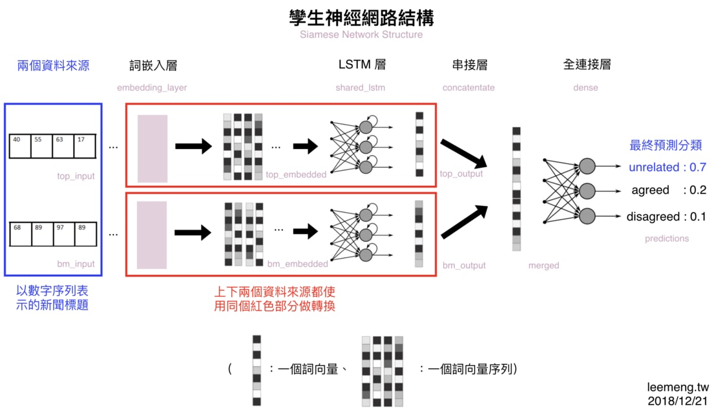

從左到右掃過一遍，你可以很清楚地發現我們需要以下 5 個元素來完成這個模型：
- 兩個新聞標題（兩個長度為 20 的數字序列）
- 一個詞嵌入層：將數字序列轉換為詞向量序列
- 一個 LSTM 層：讀入前層的詞向量並萃取標題語義
- 一個串接層：將兩個新聞標題的處理結果（也是向量）串接成一個向量
- 一個全連接層：將前層的向量轉換為 3 個分類的預測機率
有些層我們已經在前面章節看過 Keras 的實現，比方說詞嵌入層以及 LSTM 層。剩下的串接層以及全連結層在 Keras 也都有現成的模組可供使用。

另外值得一提的是，圖上的每個層（Layer）以及向量右下的灰字都對應了底下 Python 程式碼裡頭的變數名稱：

因此，如果等等你不了解底下某個特定的變數所代表的意義，可以回來利用這張架構圖來釐清概念。

以下就是此模型的 Keras 實作：
#+begin_src python -r -n :results output :exports both :session fakenews
# 基本參數設置，有幾個分類
NUM_CLASSES = 3

# 在語料庫裡有多少詞彙
MAX_NUM_WORDS = 10000

# 一個標題最長有幾個詞彙
MAX_SEQUENCE_LENGTH = 20

# 一個詞向量的維度
NUM_EMBEDDING_DIM = 256

# LSTM 輸出的向量維度
NUM_LSTM_UNITS = 128

# 建立孿生 LSTM 架構（Siamese LSTM）
from keras import Input
from keras.layers import Embedding, \
    LSTM, concatenate, Dense
from keras.models import Model

# 分別定義 2 個新聞標題 A & B 為模型輸入
# 兩個標題都是一個長度為 20 的數字序列
top_input = Input(
    shape=(MAX_SEQUENCE_LENGTH, ),
    dtype='int32')
bm_input = Input(
    shape=(MAX_SEQUENCE_LENGTH, ),
    dtype='int32')

# 詞嵌入層
# 經過詞嵌入層的轉換，兩個新聞標題都變成
# 一個詞向量的序列，而每個詞向量的維度
# 為 256
embedding_layer = Embedding(
    MAX_NUM_WORDS, NUM_EMBEDDING_DIM)
top_embedded = embedding_layer(
    top_input)
bm_embedded = embedding_layer(
    bm_input)

# LSTM 層
# 兩個新聞標題經過此層後
# 為一個 128 維度向量
shared_lstm = LSTM(NUM_LSTM_UNITS)
top_output = shared_lstm(top_embedded)
bm_output = shared_lstm(bm_embedded)

# 串接層將兩個新聞標題的結果串接單一向量
# 方便跟全連結層相連
merged = concatenate(
    [top_output, bm_output],
    axis=-1)

# 全連接層搭配 Softmax Activation
# 可以回傳 3 個成對標題
# 屬於各類別的可能機率
dense =  Dense(
    units=NUM_CLASSES,
    activation='softmax')
predictions = dense(merged)

# 我們的模型就是將數字序列的輸入，轉換
# 成 3 個分類的機率的所有步驟 / 層的總和
model = Model(
    inputs=[top_input, bm_input],
    outputs=predictions)

#+end_src

#+RESULTS:
: 2022-05-23 10:42:00.872716: I tensorflow/core/platform/cpu_feature_guard.cc:151] This TensorFlow binary is optimized with oneAPI Deep Neural Network Library (oneDNN) to use the following CPU instructions in performance-critical operations:  AVX2 FMA
: To enable them in other operations, rebuild TensorFlow with the appropriate compiler flags.

也可以透過keras的function將模型的架構圖畫出來
#+begin_src python -r -n :results output :exports both :session fakenews
from keras.utils import plot_model
plot_model(
    model,
    to_file='siameseModel.png',
    show_shapes=True,
    show_layer_names=False,
    rankdir='LR')
#+end_src

#+RESULTS:

#+CAPTION: Keras 孿生模型架構圖
#+LABEL:fig:siamese-model-plot
#+name: fig:siamese-model-plot
#+ATTR_LATEX: :width 300
#+ATTR_ORG: :width 300
#+ATTR_HTML: :width 500
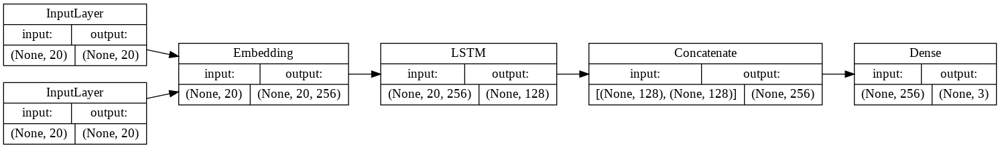

除了模型架構以外，我們還可以看到所有層的輸入 / 輸出張量（Tensor）的維度。在 Keras 裏頭，張量的第 1 個維度通常為樣本數（比方說 5 則新聞標題），而 None 則代表可以指定任意值。

最重要的是，這個用 Keras 定義出來的模型，跟我們之前想像中的孿生神經網路可以說是一模一樣：
**** 全連接層
全連接層顧名思義，代表該層的每個神經元（Neuron）都會跟前一層的所有神經元享有連結：
#+CAPTION: 全連接層示意圖
#+LABEL:fig:fully-connected
#+name: fig:fully-connected
#+ATTR_LATEX: :width 300
#+ATTR_ORG: :width 300
#+ATTR_HTML: :width 500
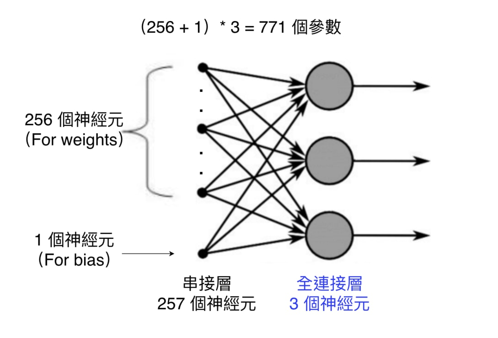
而為了確認我們計算的參數量無誤，還可以使用 model.summary() 來看每一層的參數量以及輸出的張量（Tensor）長相：
#+begin_src python -r -n :results output :exports both :session fakenews
print(model.summary())
#+end_src

#+RESULTS:
#+begin_example
Model: "model"
__________________________________________________________________________________________________
 Layer (type)                   Output Shape         Param #     Connected to
==================================================================================================
 input_1 (InputLayer)           [(None, 20)]         0           []

 input_2 (InputLayer)           [(None, 20)]         0           []

 embedding (Embedding)          (None, 20, 256)      2560000     ['input_1[0][0]',
                                                                  'input_2[0][0]']

 lstm (LSTM)                    (None, 128)          197120      ['embedding[0][0]',
                                                                  'embedding[1][0]']

 concatenate (Concatenate)      (None, 256)          0           ['lstm[0][0]',
                                                                  'lstm[1][0]']

 dense (Dense)                  (None, 3)            771         ['concatenate[0][0]']

==================================================================================================
Total params: 2,757,891
Trainable params: 2,757,891
Non-trainable params: 0
__________________________________________________________________________________________________
None
#+end_example

全連接層在最下面。而因為其與前一層「緊密」連接的緣故，它在 Keras 裏頭被稱為 Dense 層。它也是最早出現、最簡單的神經網路層之一。

Param # 則紀錄了每一層所包含的模型參數（Parameters）。在機器學習的過程中，這些參數都會不斷地被調整，直到能讓模型能做出很好的預測。詞嵌入層有最多的參數，因為我們要為 字典裡頭的每個詞彙都建立一個 256 維度的詞向量，因此參數量為 10,000 * 256。

這張表另外一個值得注意的地方是所有層的 Output Shape 的第一個維度都是 None。而 None 代表著可以是任意的數字。

在 Keras 裡頭，第一個維度代表著樣本數（#Samples），比方說前 9,527 筆新聞標題 A 的數字序列的 shape 應該要是 （9527, 20）：

而之所以每層的樣本數為 None 是因為 Keras 為了因應在不同場合會丟入不同數量的樣本需求。比方說，在訓練時你可能會一次丟 32 筆資料給模型訓練，但在預測的時候一次只丟 16 筆資料。

**** Softmax 函式

Softmax 函式一般都會被用在整個神經網路的最後一層上面，比方說我們這次的全連接層。

Softmax 函式能將某層中的所有神經元裡頭的數字作正規化（Normalization）：將它們全部壓縮到 0 到 1 之間的範圍，並讓它們的和等於 1。

#+CAPTION: Softmax 能將多個數字作正規化，讓它們的和為 1
#+LABEL:fig:softmax-normalization
#+name: fig:softmax-normalization
#+ATTR_LATEX: :width 300
#+ATTR_ORG: :width 300
#+ATTR_HTML: :width 500
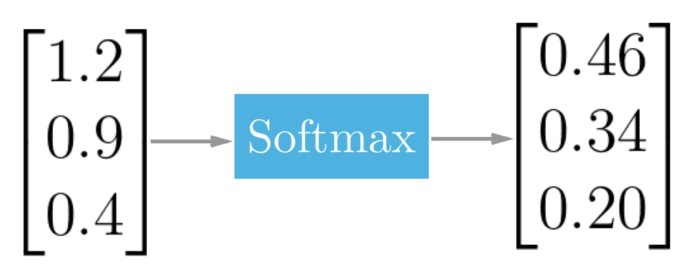

因為

- 所有數值都位於 0 到 1 之間
- 所有數值相加等於 1

這兩個條件恰好是機率（Probability）的定義，Softmax 函式的運算結果可以讓我們將每個神經元的值解釋為對應分類（Class）的發生機率。

以我們的假新聞分類任務來說的話，每個值就各代表以下分類的發生機率：

- 不相關： 0.46
- 新聞 B 同意新聞 A：0.34
- 新聞 B 不同意新聞 B：0.20

如果現在是在做預測且我們只能選出一個分類當作答案的話，我們可以說這次的分類結果最有可能是「不相關」這個類別，因為其發生機率最高。

在定義好模型以後，我們就可以進入下個步驟：定義衡量模型好壞的指標。
#+CAPTION: 損失函數示意圖
#+LABEL:fig:lfjpg
#+name: fig:lfjpg
#+ATTR_LATEX: :width 300
#+ATTR_ORG: :width 300
#+ATTR_HTML: :width 500
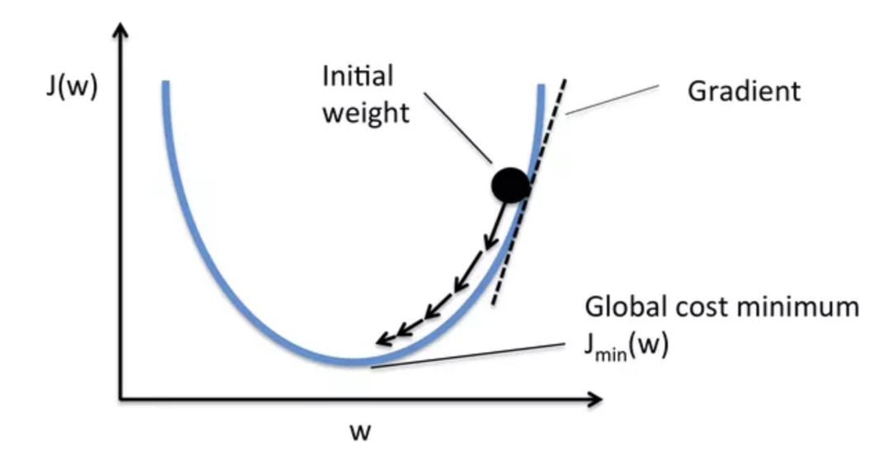
圖[[fig:lfjpg]]的拋物線即為損失函數 J(w)。當參數 w 有不同值時，損失函數的值也有所不同。模型會持續修正參數 w 以期最小化損失函數 （圖片來源）

那你會問，在假新聞分類裡頭，我們應該使用什麼損失函數呢？

我們在將正解做 One-hot Encoding 一節有稍微提到，我們會希望

- 正確的分類的機率分佈 P1（例：[1, 0, 0]）
- 模型預測出的機率分佈 P2（例：[0.7, 0.2, 0.1]）

這 2 個機率分佈的「差距」越小越好。而能計算 2 個機率分佈之間的差距的交叉熵（Cross Entropy）就是這次的分類問題中最適合的損失函數。

**** 評估模型效能

為了讓機器自動「學習」，我們得給它一個損失函數（Loss Function）。

給定一個正確解答 y 以及模型預測的結果 y_head，我們的模型透過損失函數就能自動計算出現在的預測結果跟正解的差距為多少。

透過損失函數的回饋，模型會盡全力修正參數，以期將此損失函數的值下降到最低（也就是讓預測結果 y_head 跟正解 y 越來越接近）。

#+CAPTION: 交叉熵能幫我們計算兩個機率分佈的差距，適合作為分類問題的損失函數
#+LABEL:fig:cross-entropy
#+name: fig:cross-entropy
#+ATTR_LATEX: :width 300
#+ATTR_ORG: :width 300
#+ATTR_HTML: :width 500
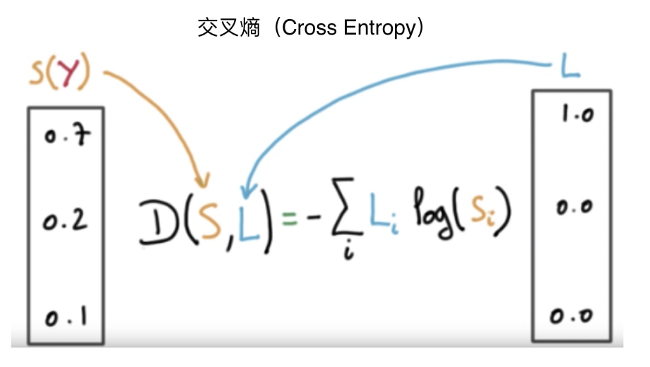
在 Keras 裏頭，我們可以這樣定義模型的損失函數：
#+begin_src python -r -n :results output :exports both :session fakenews
model.compile(
    optimizer='rmsprop',
    loss='categorical_crossentropy',
    metrics=['accuracy'])
#+end_src

#+RESULTS:

categorical_crossentropy 即是我們剛剛所說的交叉熵，而 accuracy 則是準確度，會被我們用來在訓練過程中了解模型的表現情況。

精準度的定義為：
#+begin_verse
# 模型預測正確的樣本數
-------------------
#     總樣本數
#+end_verse
雖然有了交叉熵來當作我們模型的損失函數，但是實際上模型要如何更新裡頭的參數呢？我們需要一個優化器（Optimizer）來做到這件事情。
#+CAPTION: 不同優化器透過調整參數來降低損失函數的情形，就像是在想辦法往溜滑梯的低處滑一樣
#+LABEL:fig:optimizer-loss
#+name: fig:optimizer-loss
#+ATTR_LATEX: :width 300
#+ATTR_ORG: :width 300
#+ATTR_HTML: :width 500
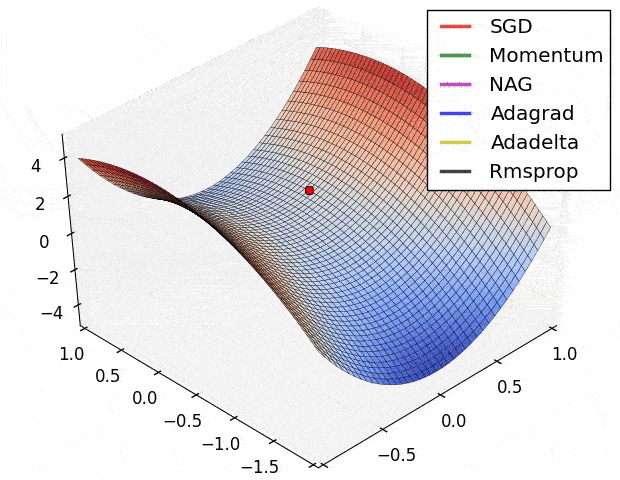

雖然我們有很多種優化器，但它們基本上都是從梯度下降法（Gradient Descent）延伸而來。

在上圖的不同位置，梯度下降法會重新計算每個參數對損失函數的梯度（斜率）。接著梯度下降法會利用該梯度來修正參數，使得使用新參數算出來的損失函數的值能夠持續往下降。

不同優化器則有各自往下滑的秘方，比方說自動調整 Learning rate。

現在就先讓我們使用 RMSProp 優化器。而在有了損失函數以及優化器以後，我們就可以正式開始訓練模型了！

**** 訓練模型並挑選最好的結果
這步驟很直觀，我們就是實際使用 model.fit 來訓練剛剛定義出來的孿生 LSTM 模型：
#+begin_src python -r -n :results output :exports both :session fakenews
# 決定一次要放多少成對標題給模型訓練
BATCH_SIZE = 512

# 決定模型要看整個訓練資料集幾遍
NUM_EPOCHS = 10

# 實際訓練模型
history = model.fit(
    # 輸入是兩個長度為 20 的數字序列
    x=[x1_train, x2_train],
    y=y_train,
    batch_size=BATCH_SIZE,
    epochs=NUM_EPOCHS,
    # 每個 epoch 完後計算驗證資料集
    # 上的 Loss 以及準確度
    validation_data=(
        [x1_val, x2_val],
        y_val
    ),
    # 每個 epoch 隨機調整訓練資料集
    # 裡頭的數據以讓訓練過程更穩定
    shuffle=True
)

#+end_src

#+RESULTS:
#+begin_example
Epoch 1/10
1/564 [..............................] - ETA: 24:28 - loss: 1.0995 - accuracy: 0.2832
2/564 [..............................] - ETA: 1:55 - loss: 1.0636 - accuracy: 0.4668
loss: 0.2228 - accuracy: 0.9103
...
564/564 [==============================] - 185s 329ms/step - loss: 0.2228 - accuracy: 0.9103 - val_loss: 0.3631 - val_accuracy: 0.8526
#+end_example

這邊特別值得拿出來提的是以下兩個參數：
- BATCH_SIZE
- NUM_EPOCHS
依照我們前面對損失函數（Loss Function）的說明，理論上模型是把訓練資料集裡頭的 32 萬筆資料全部看完一遍之後，再更新一次參數以降低損失函數。

但是這樣太曠日費時，訓練可能要花很久才能完成。
**** BATCH
實務上都是每次只放入幾筆訓練數據，讓模型看完這些資料後就做一次參數的更新。而這個「幾筆」，就是 BATCH_SIZE。

依照 BATCH_SIZE 的大小，梯度下降（Gradient Descent, 後稱 GD）可以概括為 3 個類別：
- GD（BATCH_SIZE = 訓練資料集大小，且這時不稱為 batch）
- Mini-batch GD（BATCH_SIZE 通常為一個較小的 2 的倍數）
- SGD（BATCH_SIZE = 1）
#+CAPTION: SGD 與 Mini-batch GD 比較
#+LABEL:fig:sgd-vs-minibatch
#+name: fig:sgd-vs-minibatch
#+ATTR_LATEX: :width 300
#+ATTR_ORG: :width 300
#+ATTR_HTML: :width 500
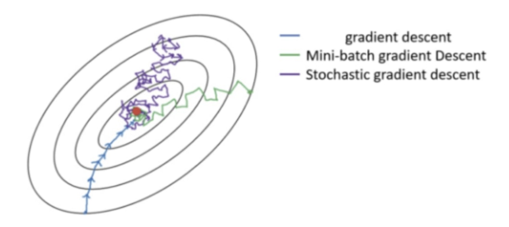
 想像損失函數是個越往裡面值就越低的碗，梯度下降就是要想辦法到達中心點 （圖片來源）

如上圖所示，下方的 GD 因為在每次更新參數前都會看完訓練資料集裡頭所有的數據，因此它更新參數的方向是最可靠的。但要往前走一步就就得看完 32 萬筆數據，未免成本也太大。

另一個極端是上方的 SGD：模型每看完 1 個訓練數據就嘗試更新權重，而因為單一一筆訓練數據並不能很好地代表整個訓練資料集，前進的方向非常不穩定。
#+CAPTION: Mini-batch 梯度下降
#+LABEL:fig:mini-batch
#+name: fig:mini-batch
#+ATTR_LATEX: :width 300
#+ATTR_ORG: :width 300
#+ATTR_HTML: :width 500
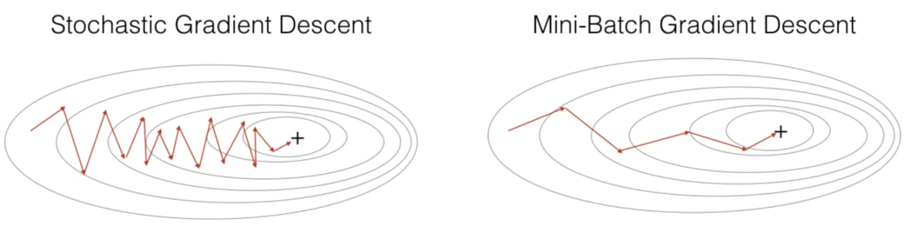

因此我們常常採用的是中庸之道： Mini-batch GD 的方式來訓練模型，而這靠的是指定 model.fit 函式裡頭的 batch_size。

NUM_EPOCHS 則很容易理解：你希望模型不只將 32 萬筆的訓練數據都看過一遍，而是每一筆資料還要多看過好幾次，以讓模型確確實實地從它們身上學到東西。NUM_EPOCHS = 10 的意思就代表模型會重複看整個訓練資料集 10 次。

接著讓我們看看 Keras 的訓練過程：

#+CAPTION: Keras 訓練過程
#+LABEL:fig:training-process
#+name: fig:training-process
#+ATTR_LATEX: :width 300
#+ATTR_ORG: :width 300
#+ATTR_HTML: :width 500
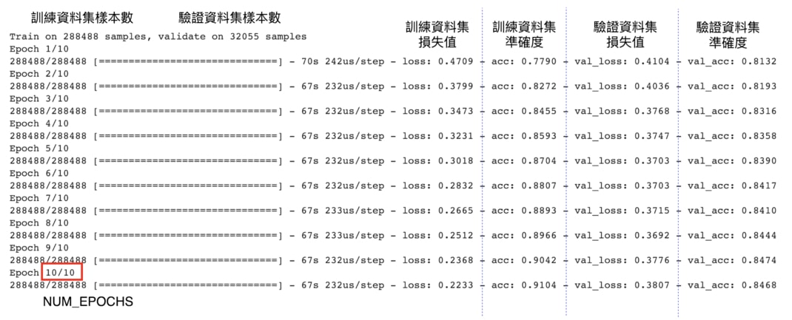

因為模型的目標就是要最小化損失函數（Loss Function），你可以觀察到當模型看過越多訓練資料集（Training Set）的數據以後，損失值（loss）就越低，分類的準確度（acc）則越高。

這代表我們的模型越來越熟悉訓練資料集裡頭的數據，因此在訓練資料集裡頭的表現越來越好。

如果依照準確度以及損失值分別畫圖的話則會長這樣：
#+CAPTION: 訓練結果 (準確度與損失)
#+LABEL:fig:training-result
#+name: fig:training-result
#+ATTR_LATEX: :width 300
#+ATTR_ORG: :width 300
#+ATTR_HTML: :width 500
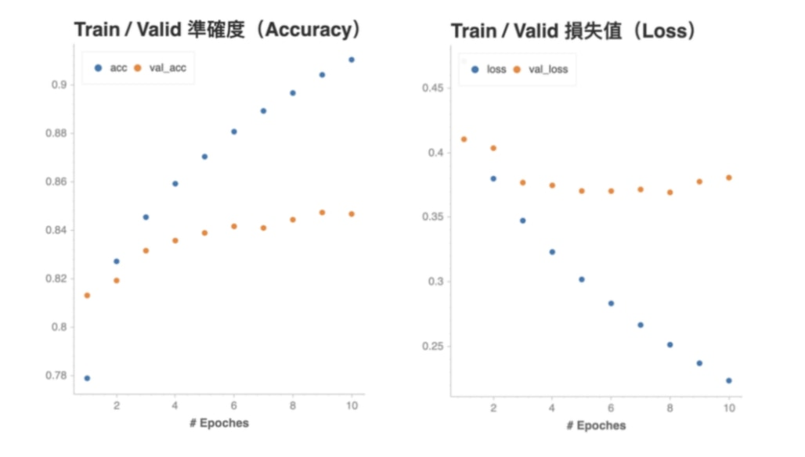

很明顯地，我們的神經網路有過適（Overfitting）的問題：儘管在訓練資料集表現得非常好（準確度超過 90 %、損失小於 0.2），在從沒看過的驗證資料集的表現就相對遜色不少。且在第 6 個 epoch 之後驗證資料集的準確度 val_acc 就沒什麼在上升，驗證集的損失 val_loss 則已經逐漸上升。

這代表模型利用從訓練資料集學到的模式（Pattern）還無法非常精準地預測沒見過的事物。

如同我們在這章節一開頭所說的，雖然第 3 步驟：「訓練模型並挑選最好的結果」的 Keras 實作非常簡單（基本上就是 model.fit( ...)），但實際上在一個機器學習 / 深度學習專案裡頭，你將會花 80 % 的時間在這個步驟裡頭調整參數，想辦法找到一個最棒的模型。

儘管如此，我們現在最想知道的還是這個模型在真實世界（也就是測試資料集）到底能表現多好，因此先讓我們試著拿這個簡單模型來做預測吧！
*** 進行預測並提交結果
就跟我們對訓練 / 驗證資料集做的資料前處理一樣，要對測試資料集（Test Set）做預測，我們得先將裡頭的文本數據通通轉換成能夠丟進模型的數字序列資料。
**** 首先，讓我們把測試資料集讀取進來：
#+begin_src python -r -n :results output :exports both :session fakenews
import pandas as pd
test = pd.read_csv("./dataset/fakenews.train.csv", index_col=0, encoding='utf-8', dtype=str)
print(test.head(3))
#+end_src

#+RESULTS:
:    tid1 tid2  ...                                          title2_en      label
: id            ...
: 0     0    1  ...  Police disprove "bird's nest congress each per...  unrelated
: 3     2    3  ...  Shenzhen's GDP outstrips Hong Kong? Shenzhen S...  unrelated
: 1     2    4  ...  The GDP overtopped Hong Kong? Shenzhen clarifi...  unrelated
:
: [3 rows x 7 columns]

測試資料集跟訓練資料集的唯一差別只在沒有 label 欄位，因此我們只需要將當初在資料前處理章節使用的步驟原封不動地套用在測試資料集即可。

你可以趁機複習一下有哪些步驟：
#+begin_src python -r -n :results output :exports both :session fakenews
# 以下步驟分別對新聞標題 A、B　進行文本斷詞 / Word Segmentation
# jieba在這裡會出問題，要加上astype(str)
test['title1_tokenized'] = test.loc[:, 'title1_zh'].astype(str).apply(jieba_tokenizer)
test['title2_tokenized'] = test.loc[:, 'title2_zh'].astype(str).apply(jieba_tokenizer)

# 將詞彙序列轉為索引數字的序列
x1_test = tokenizer.texts_to_sequences(test.title1_tokenized)
x2_test = tokenizer.texts_to_sequences(test.title2_tokenized)

# 為數字序列加入 zero padding
x1_test = keras.preprocessing.sequence.pad_sequences(
        x1_test, maxlen=MAX_SEQUENCE_LENGTH)
x2_test = keras.preprocessing.sequence.pad_sequences(
        x2_test, maxlen=MAX_SEQUENCE_LENGTH)

# 利用已訓練的模型做預測
predictions = model.predict([x1_test, x2_test])

print(predictions[5])
#+end_src

#+RESULTS:
: [8.7921888e-01 8.2681845e-06 1.2077282e-01]

跟我們之前討論過的一樣，模型針對每一筆成對新聞標題的輸入，會回傳給我們 3 個分類的機率值。

現在，我們只要將機率值最大的類別當作答案，並將這個結果轉回對應的文本標籤即可上傳到 Kaggle：

#+begin_src python -r -n :results output :exports both :session fakenews
index_to_label = {v: k for k, v in label_to_index.items()}

test['Category'] = [index_to_label[idx] for idx in np.argmax(predictions, axis=1)]

submission = test.loc[:, ['Category']].reset_index()

submission.columns = ['Id', 'Category']
print(submission.head())
#+end_src

#+RESULTS:
:    Id   Category
: 0   0  unrelated
: 1   3  unrelated
: 2   1  unrelated
: 3   2  unrelated
: 4   9     agreed

得到上面的 DataFrame 以後，我們可以將其儲存成 CSV 並上傳到 kaggle，而結果如下：
#+CAPTION: NLP 模型第一次的結果
#+LABEL:fig:first-submission
#+name: fig:first-submission
#+ATTR_LATEX: :width 300
#+ATTR_ORG: :width 300
#+ATTR_HTML: :width 500

如果你還記得我們在用直覺找出第一條底線的章節內容的話，就會知道這並不是應該多好的預測結果，但的確比多數票決好了一點點。

不過不需要操之過急，因為任何機器學習專案都是一個持續重複改善的迴圈。在第一次預測就做出完美結果的情況很少，重點是持續改善。

在第一次提交結果以後，我們還可以做非常多事情來嘗試改善模型效能：

- 改變字典詞彙量、序列長度
- 改變詞向量的維度
- 嘗試預先訓練的詞向量如 ELMo、GloVe
- 調整 LSTM 層的輸出維度
- 使用不同優化器、調整 Learning rate
- 改變神經網路架構如使用 GRU 層
- ...

能改善準確度的方式不少，但因為牽涉範圍太廣，請容許我把它們留給你當做回家作業。

走到這裡代表你已經完整地經歷了一個 NLP 專案所需要的大部分步驟。在下一節．讓我們回顧一下在這趟旅程中你所學到的東西。

* [作業] 毒舌美食家 AI：用 NLP 分析餐廳評論 :TNFSH:

#+begin_quote
*劇情設定*

夜市「黑暗料理之王」滷味攤的老闆娘，最近發現 Google 評論上出現了一堆負面評價，氣到差點把手機摔進滷汁裡（手機沒事，但據說滷汁因此更好喝了）。

她決定聘請你——一位會寫 Python 的高中生——開發一套「AI 美食評論分析系統」。目標：用自然語言處理技術分析評論，自動判斷是好評還是負評，並找出顧客最在意的關鍵字。

老闆娘的原話是：「我不管你用什麼結巴不結巴的，反正你給我巴結一點，明天之前給我結果，不然你的消費全部算原價。」
#+end_quote

** 評論資料
以下是老闆娘從各平台蒐集來的 20 則顧客評論，已經標記好正評（1）和負評（0）：

#+begin_src python -r -n :results output :exports both
reviews = [
    # (評論文字, 標籤：1=正評, 0=負評)
    ("滷味超入味，每一口都是幸福的味道，下次還要再來！", 1),
    ("老闆娘人超好，還多送了一份豆干，佛心來的", 1),
    ("這個辣度剛剛好，不會辣到懷疑人生，推薦必點鴨血", 1),
    ("排了半小時但值得，朋友吃完直接問我要不要再排一次", 1),
    ("價格實惠份量又大，學生黨的救星，吃飽只要一百塊", 1),
    ("百頁豆腐滷到入口即化，簡直是藝術品等級的滷味", 1),
    ("每次經過都忍不住買，這攤是我的錢包殺手", 1),
    ("湯頭濃郁不死鹹，可以喝三碗，冬天必備暖胃神器", 1),
    ("米血糕外酥內軟，老闆娘的手藝真的是祖傳的吧", 1),
    ("從高一吃到高三，畢業前一定要再來朝聖一次", 1),
    ("等了四十分鐘結果冷掉了，花錢買罪受", 0),
    ("太鹹了吧，吃完喝了三瓶水還是覺得嘴巴是鹹的", 0),
    ("蒼蠅比客人還多，衛生環境有待加強", 0),
    ("滷汁味道怪怪的，像是放了一個禮拜的感覺", 0),
    ("份量越來越少，價格越來越貴，通膨連滷味攤都不放過", 0),
    ("豆腐又硬又沒味道，到底有沒有在滷啊", 0),
    ("老闆態度很差，問個價錢就被翻白眼", 0),
    ("說好的加辣結果完全不辣，跟白開水一樣", 0),
    ("排隊排到天荒地老，結果東西普普通通", 0),
    ("買回家發現少了兩樣，打電話也沒人接，差評", 0),
]
#+end_src

** 任務
身為一個靠 NLP 技能賺免費滷味的高中生，請完成以下任務：

*** 任務一：斷詞與詞頻分析（40%）
用 =jieba= 將所有評論進行斷詞，並移除停用詞，然後分別統計正評和負評中出現頻率最高的前 10 個詞。

#+begin_src python -r -n :results output :exports both
import jieba
from collections import Counter

# 停用詞（可自行增減）
stop_words = set(['的', '了', '是', '在', '我', '也', '都', '有', '不',
                  '就', '還', '又', '但', '個', '和', '這', '那', '很',
                  '讓', '把', '被', '用', '到', '從', '一', '人', '來',
                  '要', '會', '去', '能', '說', '上', '為', '著', '沒',
                  '好', '過', '而', '再', '多', '給', '得', '以', '可以',
                  '每', '才', '只', '所', '次', '已', '吧', '啊', '嗎',
                  '吃', '買', '完', '比', '跟', '超', '結果', '還是'])

# 請完成：
# 1. 將正評和負評分開
# 2. 用 jieba.cut() 對每則評論斷詞
# 3. 移除停用詞和長度為 1 的詞
# 4. 用 Counter 分別統計正評、負評的詞頻
# 5. 印出正評和負評各自前 10 名的高頻詞
#+end_src

*** 任務二：詞頻視覺化（30%）
用 =matplotlib= 畫出正評和負評各自的「前 10 名高頻詞」長條圖，左右並排比較。

老闆娘最想知道的是：好評的人都在誇什麼？負評的人都在罵什麼？

#+begin_src python -r -n :results output :exports both
import matplotlib.pyplot as plt

plt.rcParams['font.sans-serif'] = ['Arial Unicode MS']
plt.rcParams['axes.unicode_minus'] = False

# 請完成：
# 1. 用 plt.subplot(1, 2, 1) 畫正評前 10 名高頻詞的橫向 bar chart
# 2. 用 plt.subplot(1, 2, 2) 畫負評前 10 名高頻詞的橫向 bar chart
# 3. 加上標題和軸標籤
# 4. plt.tight_layout() 讓排版不重疊
# 5. plt.savefig('images/nlp-homework-wordfreq.png', dpi=300)
#+end_src

*** 任務三：簡易情感分類器（30%）
根據你在任務一觀察到的正負評關鍵詞差異，設計一個簡單的「關鍵詞比對分類器」：給一個新的評論，計算其中出現了多少個正面高頻詞、多少個負面高頻詞，數量多的那方獲勝。

用你的分類器測試以下三則新評論：

#+begin_src python -r -n :results output :exports both
test_reviews = [
    "滷味入味好吃，老闆娘態度親切，份量十足",
    "等超久東西又冷掉，味道太鹹完全不行",
    "價格還行但環境不太乾淨，東西普通",
]

# 請完成：
# 1. 從任務一的結果中，取出正面和負面的高頻詞清單
# 2. 對每則新評論斷詞後，計算命中正面詞和負面詞的數量
# 3. 印出每則評論的判斷結果（正評/負評/無法判斷）及命中的關鍵詞
#+end_src

#+begin_quote
*思考題*（不計分，但回答得好老闆娘會多送你一份鴨血）：
1. 你的「關鍵詞比對法」和課堂上教的機器學習情感分析有什麼差別？
2. 如果評論寫「不難吃」（否定＋負面詞＝其實是正面意思），你的分類器會怎麼判？這種「否定反轉語意」的問題在 NLP 裡叫做 *Negation Handling*，是個至今仍然很有挑戰性的議題。
3. 如果老闆娘想分析 1000 則評論，你會怎麼改進你的方法？（提示：想想課堂上學過的 Bag-of-Words 和 Word Embedding）
#+end_quote

** 參考解答 :noexport:
*** 任務一解答
#+begin_src python -r -n :results output :exports both
import jieba
from collections import Counter

reviews = [
    ("滷味超入味，每一口都是幸福的味道，下次還要再來！", 1),
    ("老闆娘人超好，還多送了一份豆干，佛心來的", 1),
    ("這個辣度剛剛好，不會辣到懷疑人生，推薦必點鴨血", 1),
    ("排了半小時但值得，朋友吃完直接問我要不要再排一次", 1),
    ("價格實惠份量又大，學生黨的救星，吃飽只要一百塊", 1),
    ("百頁豆腐滷到入口即化，簡直是藝術品等級的滷味", 1),
    ("每次經過都忍不住買，這攤是我的錢包殺手", 1),
    ("湯頭濃郁不死鹹，可以喝三碗，冬天必備暖胃神器", 1),
    ("米血糕外酥內軟，老闆娘的手藝真的是祖傳的吧", 1),
    ("從高一吃到高三，畢業前一定要再來朝聖一次", 1),
    ("等了四十分鐘結果冷掉了，花錢買罪受", 0),
    ("太鹹了吧，吃完喝了三瓶水還是覺得嘴巴是鹹的", 0),
    ("蒼蠅比客人還多，衛生環境有待加強", 0),
    ("滷汁味道怪怪的，像是放了一個禮拜的感覺", 0),
    ("份量越來越少，價格越來越貴，通膨連滷味攤都不放過", 0),
    ("豆腐又硬又沒味道，到底有沒有在滷啊", 0),
    ("老闆態度很差，問個價錢就被翻白眼", 0),
    ("說好的加辣結果完全不辣，跟白開水一樣", 0),
    ("排隊排到天荒地老，結果東西普普通通", 0),
    ("買回家發現少了兩樣，打電話也沒人接，差評", 0),
]

stop_words = set(['的', '了', '是', '在', '我', '也', '都', '有', '不',
                  '就', '還', '又', '但', '個', '和', '這', '那', '很',
                  '讓', '把', '被', '用', '到', '從', '一', '人', '來',
                  '要', '會', '去', '能', '說', '上', '為', '著', '沒',
                  '好', '過', '而', '再', '多', '給', '得', '以', '可以',
                  '每', '才', '只', '所', '次', '已', '吧', '啊', '嗎',
                  '吃', '買', '完', '比', '跟', '超', '結果', '還是'])

# 分開正評和負評
pos_reviews = [r for r, label in reviews if label == 1]
neg_reviews = [r for r, label in reviews if label == 0]

def tokenize_reviews(review_list, stop_words):
    """斷詞並移除停用詞"""
    all_words = []
    for review in review_list:
        words = jieba.cut(review)
        for w in words:
            w = w.strip()
            if len(w) > 1 and w not in stop_words:
                all_words.append(w)
    return Counter(all_words)

pos_freq = tokenize_reviews(pos_reviews, stop_words)
neg_freq = tokenize_reviews(neg_reviews, stop_words)

print("=== 正評前 10 名高頻詞 ===")
for word, count in pos_freq.most_common(10):
    print(f"  {word}: {count}")

print("\n=== 負評前 10 名高頻詞 ===")
for word, count in neg_freq.most_common(10):
    print(f"  {word}: {count}")
#+end_src

*** 任務二解答
#+begin_src python -r -n :results output :exports both
import jieba
from collections import Counter
import matplotlib.pyplot as plt

plt.rcParams['font.sans-serif'] = ['Arial Unicode MS']
plt.rcParams['axes.unicode_minus'] = False

reviews = [
    ("滷味超入味，每一口都是幸福的味道，下次還要再來！", 1),
    ("老闆娘人超好，還多送了一份豆干，佛心來的", 1),
    ("這個辣度剛剛好，不會辣到懷疑人生，推薦必點鴨血", 1),
    ("排了半小時但值得，朋友吃完直接問我要不要再排一次", 1),
    ("價格實惠份量又大，學生黨的救星，吃飽只要一百塊", 1),
    ("百頁豆腐滷到入口即化，簡直是藝術品等級的滷味", 1),
    ("每次經過都忍不住買，這攤是我的錢包殺手", 1),
    ("湯頭濃郁不死鹹，可以喝三碗，冬天必備暖胃神器", 1),
    ("米血糕外酥內軟，老闆娘的手藝真的是祖傳的吧", 1),
    ("從高一吃到高三，畢業前一定要再來朝聖一次", 1),
    ("等了四十分鐘結果冷掉了，花錢買罪受", 0),
    ("太鹹了吧，吃完喝了三瓶水還是覺得嘴巴是鹹的", 0),
    ("蒼蠅比客人還多，衛生環境有待加強", 0),
    ("滷汁味道怪怪的，像是放了一個禮拜的感覺", 0),
    ("份量越來越少，價格越來越貴，通膨連滷味攤都不放過", 0),
    ("豆腐又硬又沒味道，到底有沒有在滷啊", 0),
    ("老闆態度很差，問個價錢就被翻白眼", 0),
    ("說好的加辣結果完全不辣，跟白開水一樣", 0),
    ("排隊排到天荒地老，結果東西普普通通", 0),
    ("買回家發現少了兩樣，打電話也沒人接，差評", 0),
]

stop_words = set(['的', '了', '是', '在', '我', '也', '都', '有', '不',
                  '就', '還', '又', '但', '個', '和', '這', '那', '很',
                  '讓', '把', '被', '用', '到', '從', '一', '人', '來',
                  '要', '會', '去', '能', '說', '上', '為', '著', '沒',
                  '好', '過', '而', '再', '多', '給', '得', '以', '可以',
                  '每', '才', '只', '所', '次', '已', '吧', '啊', '嗎',
                  '吃', '買', '完', '比', '跟', '超', '結果', '還是'])

pos_reviews = [r for r, label in reviews if label == 1]
neg_reviews = [r for r, label in reviews if label == 0]

def tokenize_reviews(review_list, stop_words):
    all_words = []
    for review in review_list:
        words = jieba.cut(review)
        for w in words:
            w = w.strip()
            if len(w) > 1 and w not in stop_words:
                all_words.append(w)
    return Counter(all_words)

pos_freq = tokenize_reviews(pos_reviews, stop_words)
neg_freq = tokenize_reviews(neg_reviews, stop_words)

# 畫圖
fig, (ax1, ax2) = plt.subplots(1, 2, figsize=(14, 6))

# 正評
pos_top10 = pos_freq.most_common(10)
pos_words = [w for w, c in pos_top10][::-1]
pos_counts = [c for w, c in pos_top10][::-1]
ax1.barh(pos_words, pos_counts, color='#4CAF50')
ax1.set_title('正評前 10 名高頻詞', fontsize=14)
ax1.set_xlabel('出現次數')

# 負評
neg_top10 = neg_freq.most_common(10)
neg_words = [w for w, c in neg_top10][::-1]
neg_counts = [c for w, c in neg_top10][::-1]
ax2.barh(neg_words, neg_counts, color='#F44336')
ax2.set_title('負評前 10 名高頻詞', fontsize=14)
ax2.set_xlabel('出現次數')

plt.suptitle('「黑暗料理之王」滷味攤 — 顧客評論詞頻分析', fontsize=16)
plt.tight_layout()
plt.savefig('images/nlp-homework-wordfreq.png', dpi=300)
print("圖表已儲存")
#+end_src

*** 任務三解答
#+begin_src python -r -n :results output :exports both
import jieba
from collections import Counter

reviews = [
    ("滷味超入味，每一口都是幸福的味道，下次還要再來！", 1),
    ("老闆娘人超好，還多送了一份豆干，佛心來的", 1),
    ("這個辣度剛剛好，不會辣到懷疑人生，推薦必點鴨血", 1),
    ("排了半小時但值得，朋友吃完直接問我要不要再排一次", 1),
    ("價格實惠份量又大，學生黨的救星，吃飽只要一百塊", 1),
    ("百頁豆腐滷到入口即化，簡直是藝術品等級的滷味", 1),
    ("每次經過都忍不住買，這攤是我的錢包殺手", 1),
    ("湯頭濃郁不死鹹，可以喝三碗，冬天必備暖胃神器", 1),
    ("米血糕外酥內軟，老闆娘的手藝真的是祖傳的吧", 1),
    ("從高一吃到高三，畢業前一定要再來朝聖一次", 1),
    ("等了四十分鐘結果冷掉了，花錢買罪受", 0),
    ("太鹹了吧，吃完喝了三瓶水還是覺得嘴巴是鹹的", 0),
    ("蒼蠅比客人還多，衛生環境有待加強", 0),
    ("滷汁味道怪怪的，像是放了一個禮拜的感覺", 0),
    ("份量越來越少，價格越來越貴，通膨連滷味攤都不放過", 0),
    ("豆腐又硬又沒味道，到底有沒有在滷啊", 0),
    ("老闆態度很差，問個價錢就被翻白眼", 0),
    ("說好的加辣結果完全不辣，跟白開水一樣", 0),
    ("排隊排到天荒地老，結果東西普普通通", 0),
    ("買回家發現少了兩樣，打電話也沒人接，差評", 0),
]

stop_words = set(['的', '了', '是', '在', '我', '也', '都', '有', '不',
                  '就', '還', '又', '但', '個', '和', '這', '那', '很',
                  '讓', '把', '被', '用', '到', '從', '一', '人', '來',
                  '要', '會', '去', '能', '說', '上', '為', '著', '沒',
                  '好', '過', '而', '再', '多', '給', '得', '以', '可以',
                  '每', '才', '只', '所', '次', '已', '吧', '啊', '嗎',
                  '吃', '買', '完', '比', '跟', '超', '結果', '還是'])

pos_reviews = [r for r, label in reviews if label == 1]
neg_reviews = [r for r, label in reviews if label == 0]

def tokenize_reviews(review_list, stop_words):
    all_words = []
    for review in review_list:
        words = jieba.cut(review)
        for w in words:
            w = w.strip()
            if len(w) > 1 and w not in stop_words:
                all_words.append(w)
    return Counter(all_words)

pos_freq = tokenize_reviews(pos_reviews, stop_words)
neg_freq = tokenize_reviews(neg_reviews, stop_words)

# 取正負評各自的高頻詞作為關鍵詞
pos_keywords = set([w for w, c in pos_freq.most_common(15)])
neg_keywords = set([w for w, c in neg_freq.most_common(15)])

# 移除兩邊都出現的詞（避免干擾）
common = pos_keywords & neg_keywords
pos_keywords -= common
neg_keywords -= common

print(f"正面關鍵詞: {pos_keywords}")
print(f"負面關鍵詞: {neg_keywords}")
print()

# 測試新評論
test_reviews = [
    "滷味入味好吃，老闆娘態度親切，份量十足",
    "等超久東西又冷掉，味道太鹹完全不行",
    "價格還行但環境不太乾淨，東西普通",
]

for review in test_reviews:
    words = set(jieba.cut(review))
    pos_hits = words & pos_keywords
    neg_hits = words & neg_keywords

    if len(pos_hits) > len(neg_hits):
        label = "正評"
    elif len(neg_hits) > len(pos_hits):
        label = "負評"
    else:
        label = "無法判斷"

    print(f"評論：{review}")
    print(f"  命中正面詞: {pos_hits if pos_hits else '無'}")
    print(f"  命中負面詞: {neg_hits if neg_hits else '無'}")
    print(f"  判斷結果：{label}")
    print()
#+end_src

* 教學資源
- [超讚][[https://leemeng.tw/shortest-path-to-the-nlp-world-a-gentle-guide-of-natural-language-processing-and-deep-learning-for-everyone.html][進入 NLP 世界的最佳橋樑：寫給所有人的自然語言處理與深度學習入門指南]]
- [[https://aiacademy.tw/what-is-nlp-natural-language-processing/][斷開中文的鎖鍊！自然語言處理 (NLP)是什麼？]]
- [[https://www.twblogs.net/a/5eb8fcf386ec4d39f335f108][Python 結巴分詞——自然語言處理之中文分詞器]]
- [[https://leemeng.tw/shortest-path-to-the-nlp-world-a-gentle-guide-of-natural-language-processing-and-deep-learning-for-everyone.html][進入 NLP 世界的最佳橋樑：寫給所有人的自然語言處理與深度學習入門指南 ]]
- [[https://mooc.nthu.edu.tw/classroom/chapter/170][2022-自學課程-從自然語言到文字探勘(7-12月) ]]
- [[https://huggingface.co/spaces/facebook/Hokkien_Translation?fbclid=IwAR26uyDhgybAqe5Xn3b3-N8GlC6bcoOzHbhsSPaZSDZaXbQjwME-GcUxwK0][英語->台語]]
** 3 門推薦的線上課程
  - 台大電機系李宏毅教授的深度學習課程: 奠定理論基礎
  - Coursera 的 Deep Learning 專項課程: 理論 70 % + 實作 30 %
  - [[https://www.oreilly.com/library/view/deep-learning-with/9781617294433VE/][Deep Learning with Python]]: 注重程式實作
** paper
*** Deep Learning and NLP
Deep Learning for Source Code Modeling and Generation: Models, Applications and Challenges
Triet H. M. Le, Hao Chen, M. Ali Babar
https://arxiv.org/abs/2002.05442

* Footnotes

[fn:1] [[https://www.cnblogs.com/iloveai/p/cs224d-lecture1-note.html][NLP簡介]]

[fn:2] [[https://www.twblogs.net/a/5f047c6c9644181341a1ea76][自然語言處理總概括]]

[fn:3][[https://www.gushiciku.cn/pl/pUAS/zh-hk][NLP中的Mask全解]]

[fn:4] [[http://puremonkey2010.blogspot.com/2017/09/toolkit-keras-imdb.html][Keras - IMDb 網路電影資料集 ]]

[fn:5] [[https://aiacademy.tw/what-is-nlp-natural-language-processing/][斷開中文的鎖鍊！自然語言處理 (NLP)是什麼？]]

[fn:6] [[https://leemeng.tw/shortest-path-to-the-nlp-world-a-gentle-guide-of-natural-language-processing-and-deep-learning-for-everyone.html][進入 NLP 世界的最佳橋樑：寫給所有人的自然語言處理與深度學習入門指南]]

[fn:7] [[https://www.ithome.com.tw/news/132838][千呼萬喚十多年！中研院終於開源釋出國產自動化中文斷詞工具，正式採用GPL 3.0釋出]]

[fn:8] [[https://blog.kennycoder.io/2020/02/12/Python-%E7%9F%A5%E5%90%8DJieba%E4%B8%AD%E6%96%87%E6%96%B7%E8%A9%9E%E5%B7%A5%E5%85%B7%E6%95%99%E5%AD%B8/][Python - 知名 Jieba 中文斷詞工具教學 ]]

[fn:9] [[https://medium.com/nlp-tsupei/%E5%BE%9E%E9%9B%B6%E9%96%8B%E5%A7%8B%E5%AD%B8%E7%BF%92%E8%87%AA%E7%84%B6%E8%AA%9E%E8%A8%80%E8%99%95%E7%90%86-a729bccecda][中文自然語言處理整理]]
