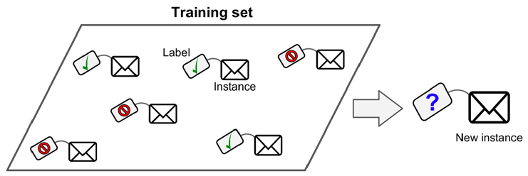
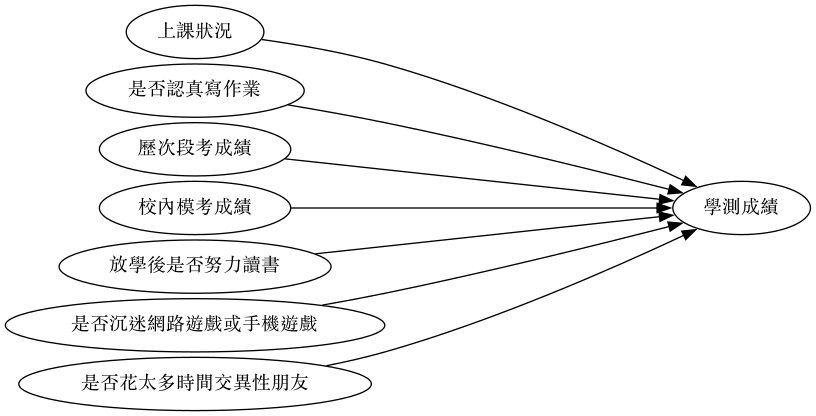
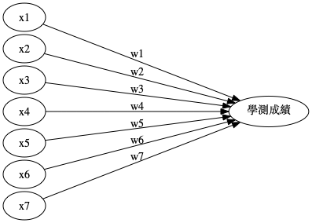

:PROPERTIES:
:ID:       20221023T101626.420918
:END:
#+title: 監督式學習

#+INCLUDE: ../pdf-m1.org
# -*- org-export-babel-evaluate: nil -*-
#+TAGS: AI, Machine Learning, SVM, RBM
#+OPTIONS: toc:2 ^:nil num:5
#+PROPERTY: header-args :eval never-export
#+HTML_HEAD: <link rel="stylesheet" type="text/css" href="../css/muse.css" />
#+HTML_HEAD_EXTRA: 
#+begin_export html

#+end_export

* Read :noexport:
- [[https://medium.com/udacity/shannon-entropy-information-gain-and-picking-balls-from-buckets-5810d35d54b4https://medium.com/udacity/shannon-entropy-information-gain-and-picking-balls-from-buckets-5810d35d54b4][熵及資訊獲利]]
- [[http://debussy.im.nuu.edu.tw/sjchen/MachineLearning/final/CLS_DT.pdf][決策樹學習： 聯合大學資管系]]

* 簡介
監督式學習獲得的結果可以是數值、也可以是類別，以結果分類，我們可以將監督式學分大致分為兩類：[[id:6ae7fb7a-0b38-4448-b19f-073d262513f2][迴歸]](結果為數值)與[[id:1592687a-cca7-4473-83a0-682a36394a28][分類]](結果為類別)。
#+CAPTION: AI, Machine Learning與Deep Learning
#+LABEL:fig:Labl
#+name: fig:Name
#+ATTR_LATEX: :width 300
#+ATTR_ORG: :width 300
#+ATTR_HTML: :width 500
[[file:images/AI,_Machine_Learning與Deep_Learning/2024-02-19_16-24-48_2024-02-19_16-23-09.png]]

** 監督式學習的主要類型
*** 分類(Cliasification)

分類問題也稱為離散(discrete)預測問題，因為每個分類都是一個離散群組。在監督式學習（supervised learning）中，提供給模型的訓練集（training set）包含了特徵（features）和標籤（labels）。特徵是用來描述資料的屬性，而標籤則是用來表示資料所屬的類別。模型透過學習這些特徵與標籤之間的關係，來預測新的資料點所屬的類別。

#+CAPTION: 典型的監督式學習：垃圾郵件分類
#+LABEL:fig:Labl
#+name: fig:Name
#+ATTR_LATEX: :width 300
#+ATTR_ORG: :width 300
#+ATTR_HTML: :width 500

監督式學習可再細分為以下兩類：
- Binary classification
- Multiclass classification

典型的分類案例: MNIST, IRIS
*** 迴歸(Regression)
另一種監督式學習為[[id:6ae7fb7a-0b38-4448-b19f-073d262513f2][迴歸]]（regression），即，根據一組預測特徵（predictor，如里程數、車齡、品牌）來預測目標數值（如二手車車價）[fn:1]，這個目標數值也是label。

部份迴歸演算法也可以用來分類，例如Logistic，它可以輸出一個數值，以這個數值來表示對應到特定類別的機率，例如，某封email為垃圾郵件的機率為20%、某張圖片為狗的機率為70%。

迴歸問題可再細分為兩類：
- Linear regression:
  * 假設輸入變量(x)與單一輸出變量(y)間存在線性關係，並以此建立模型。
  * 優點: 簡單、容易解釋
  * 缺點: 輸入與輸出變量關係為線性時會導致低度擬合
  * 例: 身高與體重間的關係
- Logistic regression
  * 也是線性方法，但使用logist function轉換輸出的預測結果，其輸出結果為類別機率(class probabilities)
  * 優點: 簡單、容易解釋
  * 缺點: 輸入與輸出變量關係為線性時無法處理分類問題

典型迴歸案例: Boston Housing Data

** 範例
*** 信用卡詐欺
以信用卡公司來說，信用卡詐欺可以透過各種資料對照評分，預測出該事件的分數。例如
- 地點：一個平時生活在台灣的用戶忽然在日本刷卡
- 時間：一個平時都是白天刷卡消費的用戶忽然在凌晨三點刷卡
這些事件都可以當成評分指標(特徵)，提供模型做為預測是否為信用卡詐欺的預測依據。
*** 影像辨識
典型的例子：資料為手寫數字的影像，這些影像會加上註解(label)，以指示其所代表的數字。只要有足夠的標記資料，監督式學習系統最終會辨識出與每個手寫數字關聯的像素和形狀類別。機器學習在影像辨識上的精準度目前已可超過人類的水準。
*** 學測成績
如果目標是要「預測學生學測總級分」，那麼，我們得先了解有那些因素會影響學生的學測成績，初步估計也許包括以下因素：
1. 上課狀況
1. 是否認真寫作業
1. 歷次段考成績
1. 校內模考成績
1. 回家後是否努力讀書
1. 是否沉迷網路遊戲或手機遊戲
1. 是否有男/女朋友

此時，我們的預測模型就如圖[[fig:exam-Network1]]所示
#+BEGIN_SRC dot :file images/exam-network1.png :cmdline -Kdot -Tpng
  digraph exam{
    rankdir=LR;
    nodesep=.05;
    graph[ranksep="3"]
    上課狀況        -> 學測成績
    是否認真寫作業       -> 學測成績
    歷次段考成績        -> 學測成績
    校內模考成績        -> 學測成績
    放學後是否努力讀書     -> 學測成績
    是否沉迷網路遊戲或手機遊戲 -> 學測成績
    是否花太多時間交異性朋友  -> 學測成績
  }
#+END_SRC

#+CAPTION: 學測成績預測模型#1
#+LABEL:fig:exam-Network1
#+name: fig:exam-Network1
#+ATTR_LATEX: :width 300
#+ATTR_ORG: :width 300
#+ATTR_HTML: :width 500

然而，上述因素只是一般性的文字描述，畢竟過於模糊而無法對之進行精確計算，所以，我們有必要再對其進行更精確的描述，此處的參數（即影響因素及相對權重）又稱為特徵值。此外，每個因素影響學測結果的程度理應會有所差異，因此也有必要對各因素賦予「加權」（也稱為權重），詳細考慮後的因素及加權列表如下。
#+CAPTION: 學測預測模型因素列表
|----+----------+----------------------------+------------------------------------+---------|
| no | 因素編號 | 模糊描述                   | 精確描述                           | 權重    |
|----+----------+----------------------------+------------------------------------+---------|
|  1 | \(x_1\)  | 上課狀況                   | 平均每次上課時認真聽講的時間百分比 | \(w_1\) |
|  2 | \(x_2\)  | 是否認真寫作業             | 作業平均成績                       | \(w_2\) |
|  3 | \(x_3\)  | 歷次段考成績               | 各科段考平均成績                   | \(w_3\) |
|  4 | \(x_4\)  | 校內模考成績               | 歷次模考平均成績                   | \(w_4\) |
|  5 | \(x_5\)  | 放學後是否努力讀書         | 放學後花在課業上的時間             | \(w_5\) |
|  6 | \(x_6\)  | 是否沉迷網路遊戲或手機遊戲 | 每天平均花在遊戲的時間             | \(w_6\) |
|  7 | \(x_7\)  | 是否花太多時間交異性朋友   | 有/無男女朋友                      | \(w_7\) |
|----+----------+----------------------------+------------------------------------+---------|

此時，我們的預測模型就如圖[[fig:exam-Network2]]所示，換言之，是在解下列方程式(也就是找出最好的、最適合的參數 $w_1, w_2, w_3, ..., w_7$ )：$$f(x)=x_1*w_1+x_2*w_2+x_3*w_3+...+x_7*w_7$$，

我們可以先針對這些特徵值對學生進行問卷調查，並追踪學生的學測成績，最後將取得的大量feature(7個等徵值)與label(學測成績)輸入到我們的函數模型（圖[[fig:exam-Network2]]）中，觀察計算結果與實際資料的吻合程度，藉由不斷的調整參數（$w_1, w_2, w_3, ..., w_7$ ，也稱為weight/權重）來控制函數，讓輸出的計算結果與實際答案完全吻合，以便求得最準確的函數。
#+BEGIN_SRC dot :file images/exam-network2.png :cmdline -Kdot -Tpng
  digraph exam2{
    rankdir=LR;
    nodesep=.05;
    graph[ranksep="3"]
    x1:上課認真聽講時間百分比 -> 學測成績[label = "w1"];
    x2:作業平均成績           -> 學測成績[label = "w2"];
    x3:各科段考平均成績       -> 學測成績[label = "w3"];
    x4:歷次模考平均成績       -> 學測成績[label = "w4"];
    x5:放學後讀書的時間       -> 學測成績[label = "w5"];
    x6:每天花在遊戲的時間     -> 學測成績[label = "w6"];
    x7:有無男女朋友          -> 學測成績[label = "w7"];
  }
#+END_SRC
#+CAPTION: 學測成績預測模型#2
#+LABEL:fig:exam-Network2
#+name: fig:exam-Network2
#+ATTR_LATEX: :width 300
#+ATTR_ORG: :width 300
#+ATTR_HTML: :width 500
#+RESULTS:

像這種透過比對現有資料不斷調整參數以便將模型預測誤差函數減至最小的學習過程稱為「監督式學習」。

在監督式學習中，我們利用已知輸入（各項特徵值）與正確輸出（學測成績），訓練模型自動找出最佳的權重組合，最終讓預測結果與實際成績的誤差降到最低。這也是許多成績預測、分數回歸、信用風險評分等問題的常見處理方式。

然而，同樣的問題，其實也可以用「非監督式學習」來分析。

在非監督式學習的情境下，假設我們並不知道每位學生的學測總級分，而只有他們的各種特徵資料（如上課狀況、是否認真寫作業、歷次段考成績等）。這時，我們可以將每位學生在這些特徵上的表現看作是在一個多維空間中的一個點。接著，利用**分類（clustering）**等非監督式演算法來分析所有學生在這個空間中的分布情形。例如，我們可以利用 K-means 分群等方法，將特徵類似的學生自動歸為同一類。這樣做的目的可能是：
- 找出哪些學生屬於「高風險群」或「高表現群」
- 協助老師針對不同群體設計差異化教學方案
- 發現成績與特徵間潛在的新關聯，作為後續進一步研究的基礎

總結來說，監督式學習與非監督式學習的差異如下：
- 監督式學習：有標籤（label），能直接預測學測分數。
- 非監督式學習：無標籤，能將學生依特徵自動分群，發掘潛在結構。

#+CAPTION: 監督式學習與非監督式學習在學測預測問題上的比較
|--------------------+-------------------------+-------------------------|
| 學習類型 | 輸入資料 | 目標／應用 |
|--------------------+-------------------------+-------------------------|
| 監督式學習 | 學生特徵+學測分數 | 建立預測分數的模型 |
| 非監督式學習 | 只有學生特徵 | 學生自動分群、找結構 |
|--------------------+-------------------------+-------------------------|

透過上述方法，我們就能針對不同問題、不同資料型態，選擇最合適的機器學習策略，進行分析與預測。

** 監督式學習的延伸應用
[[id:20221023T101626.420918][監督式學習]]主要分為[[id:1592687a-cca7-4473-83a0-682a36394a28][分類]]與[[id:6ae7fb7a-0b38-4448-b19f-073d262513f2][迴歸]]兩大類型，但實務上也有許多延伸應用，常見例子如下：
1. 序列生成（Sequence Generation）
   例如，給定一張圖片，自動產生一個描述標題，或是根據一段連續資料預測下一步的內容。例如，給定一段文字，預測下一個字或詞)，這類任務通常需要模型理解上下文關係，並生成符合語意的輸出。
2. 語法樹預測（Syntax Tree Prediction）
   輸入一個句子，模型會根據語意結構將其分解成對應的語法樹。
3. 物體偵測（Object Detection）
   對圖片進行分析，為圖中不同的物體畫出邊界框。這個任務通常結合分類與迴歸兩種技巧：先判斷每個候選區域屬於哪一類物體（分類），再預測邊界框的位置（迴歸）。
4. 圖像分割（Image Segmentation）
   對圖片進行像素級別的分析，將不同物體用遮罩區分開來。
5. 線性迴歸（Linear Regression）
   例如，根據過去幾天的空氣 PM2.5 數據，預測未來的 PM2.5 濃度。
6. 分類（Classification）
   - 二元分類（Binary Classification）：如垃圾郵件辨識。
   - 多類分類（Multi-class Classification）：如手語影像翻譯。

常見監督式學習演算法
- k 最近鄰（k-Nearest Neighbors, KNN）
- 樸素貝氏分類器（Naive Bayes Classifiers）
- 決策樹（Decision Tree）
- 神經網路與深度學習（Neural Networks, Deep Learning）
- 集成學習（Ensembles of Decision Trees）
- 線性模型（Linear Models）：如邏輯迴歸（Logistic Regression）

* 監督式學習流程與演算法
** 監督式學習流程
1. 準備學習對象的資料
2. 將資料分為輸入資料（特徵）與輸出資料（標籤、即該組特徵的答案）
3. 將特徵輸入類神經網路
4. 將類神經網路的預測結果與標籤進行比較、計算二者間的差異
5. 將4.的差異回饋給模型、依此更新模型中的參數
6. 回到3.
** 監督式學習演算法
*** K-nearest neighbors (KNN)
KNN藉由找出與新資料點最相近的 /k/ 個已具有label的資料點，讓這些資料點投票決定新資料點的label。
- 優點: 能處理更複雜的非線性關係，但仍可被解釋
- 缺點: 隨著資料與features的數量增加，KNN的效果也會降低； /k/ 值的選擇也會影響KNN的效果，太小的 /k/ 值會導致過度擬合、太高的 /k/ 值則會低度擬合。
- 應用: 經常用於推薦系統
*** Methods based on tree(Decision tree and Random Forest)
- Single decision tree: 遍歷所有訓練資枓來建立規則，但容易過度擬合
- Bagging: 將上述tree加入bootstrap aggregation(如bagging)，即，使用多次隨機實例採樣(multiple random samples of instances)，並為每次採樣建立一棵decision tree，並對每個資料實例進行預測，預測方式為透過平均每棵樹的預測結果，藉由這種方式可以解決decision tree容易過度擬合的問題。
- Random forest: 除了將資料實例進行採樣，也對每棵decision tree的分支條件中 *待預測label* 進行隨機採樣，而非使用所有的待預測label。透過這種方式，random forest可以建立出彼此相關性更低的decision，進而改善過度擬合與泛化誤差。
*** Boosting
同樣是建立許多樹，但是它 *依多建立每棵decision tree* , 利用前一棵decision所習得的資訊來改善下一棵decision tree的預測結果。是所有tree-based solution中表現最好的方式，也是許多machine learning比賽的常勝軍。
- 優點：performance佳，能處理資料缺失與特徵分類問題
- 缺點：可解釋性低
*** SVM(Support Vector Machines)
使用演算法和已知的label在空間中建構超平面來分類資料
*** 神經網路

* 監督式學習實作
- [[id:6ae7fb7a-0b38-4448-b19f-073d262513f2][迴歸]]
- [[id:1592687a-cca7-4473-83a0-682a36394a28][分類]]

* Footnotes

[fn:1] Hands-On Machine Learning with Scikit-Learn: Aurelien Geron

[fn:2] [[https://towardsai.net/p/programming/decision-trees-explained-with-a-practical-example-fe47872d3b53][Decision Trees Explained With a Practical Example]]

[fn:3] DEFINITION NOT FOUND.
