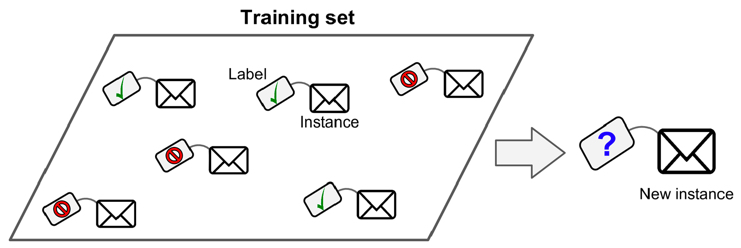
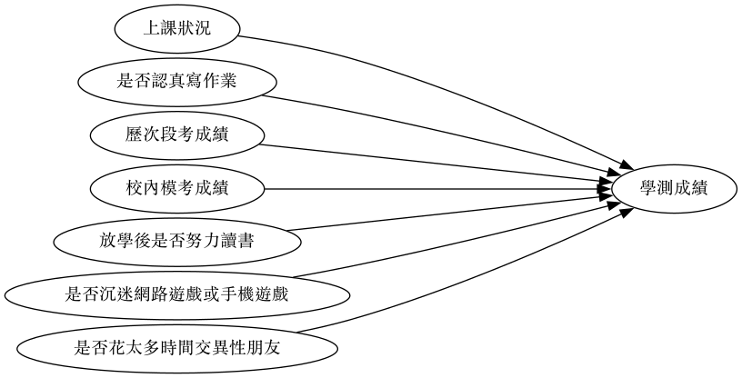
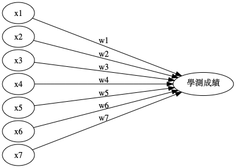

:PROPERTIES:
:ID:       20221023T101626.420918
:END:
#+title: 監督式學習
#+AUTHOR: 顏永進

#+INCLUDE: ../pdf-m1.org
# -*- org-export-babel-evaluate: nil -*-
#+TAGS: AI, Machine Learning, SVM, RBM
#+OPTIONS: toc:2 ^:nil num:5
#+PROPERTY: header-args :python :python "/Users/letranger/Dropbox/notes/roam/venv/bin/python3" :eval never-export
#+HTML_HEAD: <link rel="stylesheet" type="text/css" href="../css/muse.css" />
#+HTML_HEAD_EXTRA: 
#+begin_export html

#+end_export

* Read :noexport:
- [[https://medium.com/udacity/shannon-entropy-information-gain-and-picking-balls-from-buckets-5810d35d54b4][熵及資訊獲利]]
- [[http://debussy.im.nuu.edu.tw/sjchen/MachineLearning/final/CLS_DT.pdf][決策樹學習： 聯合大學資管系]]

* 簡介
監督式學習獲得的結果可以是數值、也可以是類別，以結果分類，我們可以將監督式學習大致分為兩類：[[id:6ae7fb7a-0b38-4448-b19f-073d262513f2][迴歸]](結果為數值)與[[id:1592687a-cca7-4473-83a0-682a36394a28][分類]](結果為類別)。
#+CAPTION: AI, Machine Learning與Deep Learning
#+LABEL:fig:ai-ml-dl
#+name: fig:ai-ml-dl
#+ATTR_LATEX: :width 300
#+ATTR_ORG: :width 300
#+ATTR_HTML: :width 500
[[file:images/AI,_Machine_Learning與Deep_Learning/2024-02-19_16-24-48_2024-02-19_16-23-09.png]]

** 監督式學習的主要類型
*** 分類(Classification)

分類問題也稱為離散(discrete)預測問題，因為每個分類都是一個離散群組。在監督式學習（supervised learning）中，提供給模型的訓練集（training set）包含了特徵（features）和標籤（labels）。特徵是用來描述資料的屬性，而標籤則是用來表示資料所屬的類別。模型透過學習這些特徵與標籤之間的關係，來預測新的資料點所屬的類別。

#+CAPTION: 典型的監督式學習：垃圾郵件分類
#+LABEL:fig:spam-classification
#+name: fig:spam-classification
#+ATTR_LATEX: :width 300
#+ATTR_ORG: :width 300
#+ATTR_HTML: :width 500

監督式學習可再細分為以下兩類：
- Binary classification
- Multiclass classification

典型的分類案例: MNIST, IRIS
*** 迴歸(Regression)
另一種監督式學習為[[id:6ae7fb7a-0b38-4448-b19f-073d262513f2][迴歸]]（regression），即，根據一組預測特徵（predictor，如里程數、車齡、品牌）來預測目標數值（如二手車車價）[fn:1]，這個目標數值也是label。

部份迴歸演算法也可以用來分類，例如Logistic，它可以輸出一個數值，以這個數值來表示對應到特定類別的機率，例如，某封email為垃圾郵件的機率為20%、某張圖片為狗的機率為70%。

迴歸問題可再細分為兩類：
- Linear regression:
  * 假設輸入變量(x)與單一輸出變量(y)間存在線性關係，並以此建立模型。
  * 優點: 簡單、容易解釋
  * 缺點: 當輸入與輸出變量間的關係為非線性時會導致低度擬合
  * 例: 身高與體重間的關係
- Logistic regression
  * 也是線性方法，但使用logistic function轉換輸出的預測結果，其輸出結果為類別機率(class probabilities)
  * 優點: 簡單、容易解釋
  * 缺點: 決策邊界為線性，當資料的分類邊界為非線性時表現較差

典型迴歸案例: Boston Housing Data

** 範例
*** 信用卡詐欺
以信用卡公司來說，信用卡詐欺可以透過各種資料對照評分，預測出該事件的分數。例如
- 地點：一個平時生活在台灣的用戶忽然在日本刷卡
- 時間：一個平時都是白天刷卡消費的用戶忽然在凌晨三點刷卡
這些事件都可以當成評分指標(特徵)，提供模型做為預測是否為信用卡詐欺的預測依據。
*** 影像辨識
典型的例子：資料為手寫數字的影像，這些影像會加上註解(label)，以指示其所代表的數字。只要有足夠的標記資料，監督式學習系統最終會辨識出與每個手寫數字關聯的像素和形狀類別。機器學習在影像辨識上的精準度目前已可超過人類的水準。
*** 學測成績
如果目標是要「預測學生學測總級分」，那麼，我們得先了解有那些因素會影響學生的學測成績，初步估計也許包括以下因素：
1. 上課狀況
1. 是否認真寫作業
1. 歷次段考成績
1. 校內模考成績
1. 回家後是否努力讀書
1. 是否沉迷網路遊戲或手機遊戲
1. 是否有男/女朋友

此時，我們的預測模型就如圖[[fig:exam-Network1]]所示
#+BEGIN_SRC dot :file images/exam-network1.png :cmdline -Kdot -Tpng
  digraph exam{
    rankdir=LR;
    nodesep=.05;
    graph[ranksep="3"]
    上課狀況        -> 學測成績
    是否認真寫作業       -> 學測成績
    歷次段考成績        -> 學測成績
    校內模考成績        -> 學測成績
    放學後是否努力讀書     -> 學測成績
    是否沉迷網路遊戲或手機遊戲 -> 學測成績
    是否花太多時間交異性朋友  -> 學測成績
  }
#+END_SRC

#+CAPTION: 學測成績預測模型#1
#+LABEL:fig:exam-Network1
#+name: fig:exam-Network1
#+ATTR_LATEX: :width 300
#+ATTR_ORG: :width 300
#+ATTR_HTML: :width 500

然而，上述因素只是一般性的文字描述，畢竟過於模糊而無法對之進行精確計算，所以，我們有必要再對其進行更精確的描述，此處的參數（即影響因素及相對權重）又稱為特徵值。此外，每個因素影響學測結果的程度理應會有所差異，因此也有必要對各因素賦予「加權」（也稱為權重），詳細考慮後的因素及加權列表如下。
#+CAPTION: 學測預測模型因素列表
|----+----------+----------------------------+------------------------------------+---------|
| no | 因素編號 | 模糊描述                   | 精確描述                           | 權重    |
|----+----------+----------------------------+------------------------------------+---------|
|  1 | \(x_1\)  | 上課狀況                   | 平均每次上課時認真聽講的時間百分比 | \(w_1\) |
|  2 | \(x_2\)  | 是否認真寫作業             | 作業平均成績                       | \(w_2\) |
|  3 | \(x_3\)  | 歷次段考成績               | 各科段考平均成績                   | \(w_3\) |
|  4 | \(x_4\)  | 校內模考成績               | 歷次模考平均成績                   | \(w_4\) |
|  5 | \(x_5\)  | 放學後是否努力讀書         | 放學後花在課業上的時間             | \(w_5\) |
|  6 | \(x_6\)  | 是否沉迷網路遊戲或手機遊戲 | 每天平均花在遊戲的時間             | \(w_6\) |
|  7 | \(x_7\)  | 是否花太多時間交異性朋友   | 有/無男女朋友                      | \(w_7\) |
|----+----------+----------------------------+------------------------------------+---------|

此時，我們的預測模型就如圖[[fig:exam-Network2]]所示，換言之，是在解下列方程式(也就是找出最好的、最適合的參數 $w_1, w_2, w_3, ..., w_7$ )：$$f(x)=x_1*w_1+x_2*w_2+x_3*w_3+...+x_7*w_7$$，

我們可以先針對這些特徵值對學生進行問卷調查，並追踪學生的學測成績，最後將取得的大量feature(7個特徵值)與label(學測成績)輸入到我們的函數模型（圖[[fig:exam-Network2]]）中，觀察計算結果與實際資料的吻合程度，藉由不斷的調整參數（$w_1, w_2, w_3, ..., w_7$ ，也稱為weight/權重）來控制函數，讓輸出的計算結果與實際答案完全吻合，以便求得最準確的函數。
#+BEGIN_SRC dot :file images/exam-network2.png :cmdline -Kdot -Tpng
  digraph exam2{
    rankdir=LR;
    nodesep=.05;
    graph[ranksep="3"]
    x1:上課認真聽講時間百分比 -> 學測成績[label = "w1"];
    x2:作業平均成績           -> 學測成績[label = "w2"];
    x3:各科段考平均成績       -> 學測成績[label = "w3"];
    x4:歷次模考平均成績       -> 學測成績[label = "w4"];
    x5:放學後讀書的時間       -> 學測成績[label = "w5"];
    x6:每天花在遊戲的時間     -> 學測成績[label = "w6"];
    x7:有無男女朋友          -> 學測成績[label = "w7"];
  }
#+END_SRC
#+CAPTION: 學測成績預測模型#2
#+LABEL:fig:exam-Network2
#+name: fig:exam-Network2
#+ATTR_LATEX: :width 300
#+ATTR_ORG: :width 300
#+ATTR_HTML: :width 500

像這種透過比對現有資料不斷調整參數以便將模型預測誤差函數減至最小的學習過程稱為「監督式學習」。

在監督式學習中，我們利用已知輸入（各項特徵值）與正確輸出（學測成績），訓練模型自動找出最佳的權重組合，最終讓預測結果與實際成績的誤差降到最低。這也是許多成績預測、分數回歸、信用風險評分等問題的常見處理方式。

然而，同樣的問題，其實也可以用「非監督式學習」來分析。

在非監督式學習的情境下，假設我們並不知道每位學生的學測總級分，而只有他們的各種特徵資料（如上課狀況、是否認真寫作業、歷次段考成績等）。這時，我們可以將每位學生在這些特徵上的表現看作是在一個多維空間中的一個點。接著，利用*分群（clustering）*等非監督式演算法來分析所有學生在這個空間中的分布情形。例如，我們可以利用 K-means 分群等方法，將特徵類似的學生自動歸為同一類。這樣做的目的可能是：
- 找出哪些學生屬於「高風險群」或「高表現群」
- 協助老師針對不同群體設計差異化教學方案
- 發現成績與特徵間潛在的新關聯，作為後續進一步研究的基礎

總結來說，監督式學習與非監督式學習的差異如下：
- 監督式學習：有標籤（label），能直接預測學測分數。
- 非監督式學習：無標籤，能將學生依特徵自動分群，發掘潛在結構。

#+CAPTION: 監督式學習與非監督式學習在學測預測問題上的比較
|--------------------+-------------------------+-------------------------|
| 學習類型 | 輸入資料 | 目標／應用 |
|--------------------+-------------------------+-------------------------|
| 監督式學習 | 學生特徵+學測分數 | 建立預測分數的模型 |
| 非監督式學習 | 只有學生特徵 | 學生自動分群、找結構 |
|--------------------+-------------------------+-------------------------|

透過上述方法，我們就能針對不同問題、不同資料型態，選擇最合適的機器學習策略，進行分析與預測。

** 監督式學習的延伸應用
[[id:20221023T101626.420918][監督式學習]]主要分為[[id:1592687a-cca7-4473-83a0-682a36394a28][分類]]與[[id:6ae7fb7a-0b38-4448-b19f-073d262513f2][迴歸]]兩大類型，但實務上也有許多延伸應用，常見例子如下：
1. 序列生成（Sequence Generation）
   例如，給定一張圖片，自動產生一個描述標題，或是根據一段連續資料預測下一步的內容。例如，給定一段文字，預測下一個字或詞，這類任務通常需要模型理解上下文關係，並生成符合語意的輸出。
2. 語法樹預測（Syntax Tree Prediction）
   輸入一個句子，模型會根據語意結構將其分解成對應的語法樹。
3. 物體偵測（Object Detection）
   對圖片進行分析，為圖中不同的物體畫出邊界框。這個任務通常結合分類與迴歸兩種技巧：先判斷每個候選區域屬於哪一類物體（分類），再預測邊界框的位置（迴歸）。
4. 圖像分割（Image Segmentation）
   對圖片進行像素級別的分析，將不同物體用遮罩區分開來。
5. 線性迴歸（Linear Regression）
   例如，根據過去幾天的空氣 PM2.5 數據，預測未來的 PM2.5 濃度。
6. 分類（Classification）
   - 二元分類（Binary Classification）：如垃圾郵件辨識。
   - 多類分類（Multi-class Classification）：如手語影像翻譯。

常見監督式學習演算法
- k 最近鄰（k-Nearest Neighbors, KNN）
- 樸素貝氏分類器（Naive Bayes Classifiers）
- 決策樹（Decision Tree）
- 神經網路與深度學習（Neural Networks, Deep Learning）
- 集成學習（Ensembles of Decision Trees）
- 線性模型（Linear Models）：如邏輯迴歸（Logistic Regression）

* 監督式學習流程與演算法
** 監督式學習流程
1. 準備學習對象的資料
2. 將資料分為輸入資料（特徵）與輸出資料（標籤、即該組特徵的答案）
3. 將特徵輸入類神經網路
4. 將類神經網路的預測結果與標籤進行比較、計算二者間的差異
5. 將4.的差異回饋給模型、依此更新模型中的參數
6. 回到3.
** 監督式學習演算法
*** K-nearest neighbors (KNN)
KNN藉由找出與新資料點最相近的 /k/ 個已具有label的資料點，讓這些資料點投票決定新資料點的label。
- 優點: 能處理更複雜的非線性關係，但仍可被解釋
- 缺點: 隨著資料與features的數量增加，KNN的效果也會降低； /k/ 值的選擇也會影響KNN的效果，太小的 /k/ 值會導致過度擬合、太高的 /k/ 值則會低度擬合。
- 應用: 經常用於推薦系統

#+begin_src python -r -n :results output :exports both
from sklearn.datasets import load_iris
from sklearn.model_selection import train_test_split
from sklearn.neighbors import KNeighborsClassifier
from sklearn.metrics import accuracy_score

X, y = load_iris(return_X_y=True)
X_train, X_test, y_train, y_test = train_test_split(X, y, test_size=0.3, random_state=42)

# 建立 KNN 模型（k=5）
knn = KNeighborsClassifier(n_neighbors=5)
knn.fit(X_train, y_train)

# 預測與評估
y_pred = knn.predict(X_test)
print(f"KNN (k=5) 準確率: {accuracy_score(y_test, y_pred):.4f}")

# 觀察不同 k 值對準確率的影響
for k in [1, 3, 5, 7, 9]:
    knn = KNeighborsClassifier(n_neighbors=k)
    knn.fit(X_train, y_train)
    score = knn.score(X_test, y_test)
    print(f"  k={k}: {score:.4f}")
#+end_src

*** 決策樹與隨機森林（Decision Tree and Random Forest）
**** 決策樹（Decision Tree）
決策樹透過一連串的「是/否」問題將資料逐步分割，最終達成分類或迴歸預測。其核心問題在於：每一步該選哪個特徵、用什麼條件來分割？這就需要「分裂準則」。

***** 分裂準則
- *熵（Entropy）*：衡量資料的混亂程度（不確定性）。若一組資料全部屬於同一類別，熵為 0（最純）；若各類別各佔一半，熵最大。
  $$H(S) = -\sum_{i=1}^{c} p_i \log_2 p_i$$
  其中 $p_i$ 為第 $i$ 類別在資料集 $S$ 中的比例，$c$ 為類別數。
- *資訊增益（Information Gain）*：分割前後熵的減少量。決策樹會選擇資訊增益最大的特徵進行分割。
  $$IG(S, A) = H(S) - \sum_{v \in \text{values}(A)} \frac{|S_v|}{|S|} H(S_v)$$
- *吉尼不純度（Gini Impurity）*：另一種衡量混亂程度的指標，計算更快。scikit-learn 的決策樹預設使用 Gini。
  $$Gini(S) = 1 - \sum_{i=1}^{c} p_i^2$$

決策樹的特點：
- 優點：直觀易懂、結果可解釋（可視覺化為樹狀圖）、不需特徵縮放
- 缺點：容易過度擬合（overfitting），尤其是樹的深度不加限制時

#+begin_src python -r -n :results output :exports both
from sklearn.datasets import load_iris
from sklearn.model_selection import train_test_split
from sklearn.tree import DecisionTreeClassifier, export_text
from sklearn.metrics import accuracy_score

X, y = load_iris(return_X_y=True)
feature_names = load_iris().feature_names
X_train, X_test, y_train, y_test = train_test_split(X, y, test_size=0.3, random_state=42)

# 建立決策樹（限制深度為 3，避免過度擬合）
dt = DecisionTreeClassifier(max_depth=3, random_state=42)
dt.fit(X_train, y_train)

y_pred = dt.predict(X_test)
print(f"Decision Tree 準確率: {accuracy_score(y_test, y_pred):.4f}")

# 印出決策樹的規則（可解釋性高）
print("\n決策樹規則:")
print(export_text(dt, feature_names=feature_names))
#+end_src

**** Bagging 與隨機森林
- *Bagging*（Bootstrap Aggregation）：使用多次隨機抽樣（有放回抽樣）建立多棵 decision tree，再透過平均（迴歸）或多數決（分類）彙整預測結果，藉此降低過度擬合。
- *Random Forest*：在 Bagging 的基礎上，每棵樹的每次分裂只從隨機挑選的部分特徵中選擇最佳分裂條件（而非使用所有特徵）。這使得各棵樹之間相關性更低，進一步改善泛化能力。
  - 優點：準確度高、不易過度擬合、能評估特徵重要性
  - 缺點：可解釋性較單棵決策樹低、訓練時間較長

#+begin_src python -r -n :results output :exports both
from sklearn.datasets import load_iris
from sklearn.model_selection import train_test_split
from sklearn.ensemble import RandomForestClassifier
from sklearn.metrics import accuracy_score

X, y = load_iris(return_X_y=True)
feature_names = load_iris().feature_names
X_train, X_test, y_train, y_test = train_test_split(X, y, test_size=0.3, random_state=42)

# 建立 Random Forest（100 棵樹）
rf = RandomForestClassifier(n_estimators=100, random_state=42)
rf.fit(X_train, y_train)

y_pred = rf.predict(X_test)
print(f"Random Forest 準確率: {accuracy_score(y_test, y_pred):.4f}")

# 顯示各特徵的重要性排名
print("\n特徵重要性:")
for name, imp in sorted(zip(feature_names, rf.feature_importances_),
                         key=lambda x: x[1], reverse=True):
    print(f"  {name}: {imp:.4f}")
#+end_src

*** Boosting
Boosting 同樣是建立許多樹，但它 *依序建立每棵 decision tree* ，每一棵新樹專注於修正前一棵樹的預測錯誤，逐步提升整體模型的表現。是所有 tree-based solution 中表現最好的方式，也是許多 machine learning 比賽的常勝軍。

常見的 Boosting 演算法：
| 演算法 | 特點 |
|--------------------+--------------------------------------------------------------|
| AdaBoost | 最早的 Boosting 方法，調高被前一輪分錯的樣本的權重 |
| Gradient Boosting | 每棵新樹擬合前一輪的殘差（residual），以梯度下降方式優化 |
| XGBoost | Gradient Boosting 的高效實作，加入正則化防止過度擬合，速度快 |
| LightGBM | 微軟開發，使用 leaf-wise 生長策略，處理大規模資料效率極高 |
| CatBoost | Yandex 開發，原生支援類別型特徵，不需額外編碼 |

- 優點：預測準確度高，能處理資料缺失與類別型特徵
- 缺點：可解釋性低、需要仔細調參、訓練時間較 Random Forest 長

#+begin_quote
在實務應用與 Kaggle 等機器學習競賽中，XGBoost 和 LightGBM 是最常被使用的演算法，處理結構化（表格）資料時，表現通常優於深度學習。
#+end_quote

#+begin_src python -r -n :results output :exports both
from sklearn.datasets import load_iris
from sklearn.model_selection import train_test_split
from sklearn.ensemble import GradientBoostingClassifier
from sklearn.metrics import accuracy_score

X, y = load_iris(return_X_y=True)
X_train, X_test, y_train, y_test = train_test_split(X, y, test_size=0.3, random_state=42)

# 建立 Gradient Boosting 模型
gb = GradientBoostingClassifier(
    n_estimators=100,    # 樹的數量
    learning_rate=0.1,   # 學習率（每棵樹的貢獻度）
    max_depth=3,         # 每棵樹的最大深度
    random_state=42
)
gb.fit(X_train, y_train)

y_pred = gb.predict(X_test)
print(f"Gradient Boosting 準確率: {accuracy_score(y_test, y_pred):.4f}")

# 觀察隨著樹的數量增加，訓練與測試準確率的變化
import numpy as np
train_scores = []
test_scores = []
for i, y_pred_train in enumerate(gb.staged_predict(X_train)):
    train_scores.append(accuracy_score(y_train, y_pred_train))
for i, y_pred_test in enumerate(gb.staged_predict(X_test)):
    test_scores.append(accuracy_score(y_test, y_pred_test))
print(f"第 10 棵樹時測試準確率: {test_scores[9]:.4f}")
print(f"第 50 棵樹時測試準確率: {test_scores[49]:.4f}")
print(f"第 100 棵樹時測試準確率: {test_scores[99]:.4f}")
#+end_src

*** SVM（Support Vector Machines）
支援向量機的核心概念是在特徵空間中找到一個「超平面（hyperplane）」來分隔不同類別的資料，並使這個超平面離最近的資料點（即支援向量）的距離（margin）最大化。

**** 核心概念
- *超平面（Hyperplane）*：在 n 維空間中，超平面是一個 n-1 維的分隔面。二維空間中就是一條線，三維空間中就是一個平面。
- *支援向量（Support Vectors）*：距離超平面最近的那些資料點，它們「支撐」住了超平面的位置。改變其他資料點不會影響超平面，但移動支援向量就會。
- *間距（Margin）*：超平面到最近支援向量的距離。SVM 的目標就是找到 margin 最大的超平面，因為 margin 越大，模型的泛化能力越好。

**** Kernel Trick
當資料在原始空間中無法被一個超平面線性分開時，SVM 可以透過 *核函數（Kernel Function）* 將資料映射到更高維的空間，使原本不可線性分割的資料變得可分割。常用的核函數包括：
| 核函數 | 說明 |
|------------------------+----------------------------------------------|
| 線性核（Linear） | 適用於線性可分的資料 |
| 多項式核（Polynomial） | 適用於中等複雜度的非線性邊界 |
| RBF（高斯核） | 最常用，適用於大多數非線性問題 |

- 優點：在高維空間表現良好、有堅實的數學理論基礎、不易過度擬合（尤其資料量不大時）
- 缺點：資料量大時訓練速度慢、對特徵縮放敏感、結果較難解釋

#+begin_src python -r -n :results output :exports both
from sklearn.datasets import load_iris
from sklearn.model_selection import train_test_split
from sklearn.svm import SVC
from sklearn.preprocessing import StandardScaler
from sklearn.metrics import accuracy_score

X, y = load_iris(return_X_y=True)
X_train, X_test, y_train, y_test = train_test_split(X, y, test_size=0.3, random_state=42)

# SVM 對特徵縮放敏感，先做標準化
scaler = StandardScaler()
X_train_scaled = scaler.fit_transform(X_train)
X_test_scaled = scaler.transform(X_test)

# 比較不同核函數的效果
for kernel in ['linear', 'poly', 'rbf']:
    svm = SVC(kernel=kernel, random_state=42)
    svm.fit(X_train_scaled, y_train)
    score = svm.score(X_test_scaled, y_test)
    print(f"SVM ({kernel:>6} kernel) 準確率: {score:.4f}")
#+end_src

*** 神經網路
神經網路透過多層的神經元（節點）對輸入資料進行非線性轉換，自動學習特徵表示，是深度學習的基礎。與上述傳統機器學習演算法相比，神經網路在影像、語音、自然語言等非結構化資料上表現尤為突出，但需要較多的訓練資料與運算資源。

以下使用 scikit-learn 的 =MLPClassifier= 示範最簡單的神經網路：

#+begin_src python -r -n :results output :exports both
from sklearn.datasets import load_iris
from sklearn.model_selection import train_test_split
from sklearn.neural_network import MLPClassifier
from sklearn.preprocessing import StandardScaler
from sklearn.metrics import accuracy_score

X, y = load_iris(return_X_y=True)
X_train, X_test, y_train, y_test = train_test_split(X, y, test_size=0.3, random_state=42)

# 神經網路同樣需要特徵標準化
scaler = StandardScaler()
X_train_scaled = scaler.fit_transform(X_train)
X_test_scaled = scaler.transform(X_test)

# 建立兩層隱藏層（各 10 個神經元）的神經網路
mlp = MLPClassifier(hidden_layer_sizes=(10, 10), max_iter=1000, random_state=42)
mlp.fit(X_train_scaled, y_train)

y_pred = mlp.predict(X_test_scaled)
print(f"Neural Network 準確率: {accuracy_score(y_test, y_pred):.4f}")
print(f"網路結構: 輸入層({X_train.shape[1]}) → 隱藏層(10) → 隱藏層(10) → 輸出層({len(set(y))})")
print(f"訓練迭代次數: {mlp.n_iter_}")
#+end_src

詳細內容請參閱：[[id:d6daa102-05bb-475d-b619-db8b61e86030][神經網路]]、[[id:20221023T101228.247381][深度學習]]

* 模型評估指標
監督式學習訓練出模型後，最重要的問題就是：模型預測得好不好？以下介紹常用的評估指標。

** 分類問題的評估指標
*** 混淆矩陣（Confusion Matrix）
混淆矩陣是評估分類模型的基礎，以二元分類為例：

|                | 預測為正（Positive） | 預測為負（Negative） |
|----------------+----------------------+----------------------|
| 實際為正       | TP（True Positive）  | FN（False Negative） |
| 實際為負       | FP（False Positive） | TN（True Negative）  |

- *TP*：正確預測為正例（如正確判定為垃圾郵件）
- *FP*：錯誤預測為正例（如把正常郵件誤判為垃圾郵件），又稱 Type I Error
- *FN*：錯誤預測為負例（如把垃圾郵件漏判為正常），又稱 Type II Error
- *TN*：正確預測為負例

*** 常用指標
| 指標 | 公式 | 意義 |
|---------------------+------------------------------------+----------------------------------------------|
| 準確率（Accuracy） | $\frac{TP + TN}{TP+TN+FP+FN}$ | 整體預測正確的比例 |
| 精確率（Precision） | $\frac{TP}{TP + FP}$ | 預測為正例中，實際為正例的比例 |
| 召回率（Recall） | $\frac{TP}{TP + FN}$ | 實際正例中，被正確預測出來的比例 |
| F1 Score | $2 \times \frac{Precision \times Recall}{Precision + Recall}$ | Precision 與 Recall 的調和平均數 |

#+begin_quote
*何時該看哪個指標？*
- 當各類別的資料量均衡時，Accuracy 是直觀的指標
- 當資料不平衡（如信用卡詐欺：99% 正常、1% 詐欺）時，Accuracy 會失真（全部猜正常就有 99% 準確率），此時應關注 Precision、Recall 和 F1 Score
- 醫療診斷重視 Recall（不能漏掉病人）；垃圾郵件過濾重視 Precision（不能誤刪正常郵件）
#+end_quote

*** ROC 曲線與 AUC
- *ROC 曲線*（Receiver Operating Characteristic）：以 FPR（False Positive Rate）為 x 軸、TPR（True Positive Rate，即 Recall）為 y 軸繪製的曲線。曲線越靠近左上角，模型越好。
- *AUC*（Area Under the ROC Curve）：ROC 曲線下的面積，範圍 0~1。AUC = 0.5 表示與隨機猜測無異，AUC = 1 表示完美分類。

** 迴歸問題的評估指標
| 指標 | 公式 | 說明 |
|---------+----------------------------------------------+--------------------------------------|
| MAE | $\frac{1}{n}\sum\vert y_i - \hat{y}_i \vert$ | 平均絕對誤差，直觀易懂 |
| MSE | $\frac{1}{n}\sum(y_i - \hat{y}_i)^2$ | 平均平方誤差，對大誤差懲罰更重 |
| RMSE | $\sqrt{MSE}$ | 均方根誤差，與原始資料同單位 |
| $R^2$ | $1 - \frac{\sum(y_i-\hat{y}_i)^2}{\sum(y_i-\bar{y})^2}$ | 決定係數，1 為完美，0 為與平均值預測一樣 |

** 交叉驗證（Cross-Validation）
僅用一次 train/test split 評估模型可能因為資料切分方式不同而產生偏差。 *K-Fold 交叉驗證* 將資料分成 K 份，每次取其中 1 份當測試集、其餘 K-1 份當訓練集，重複 K 次後取平均，能更可靠地估計模型效能。

#+begin_src python -r -n :results output :exports both
from sklearn.model_selection import cross_val_score
from sklearn.ensemble import RandomForestClassifier
from sklearn.datasets import load_iris

X, y = load_iris(return_X_y=True)
clf = RandomForestClassifier(n_estimators=100, random_state=42)

# 5-Fold 交叉驗證
scores = cross_val_score(clf, X, y, cv=5, scoring='accuracy')
print(f"每折準確率: {scores}")
print(f"平均準確率: {scores.mean():.4f} ± {scores.std():.4f}")
#+end_src

* 監督式學習實作
- [[id:6ae7fb7a-0b38-4448-b19f-073d262513f2][迴歸]]
- [[id:1592687a-cca7-4473-83a0-682a36394a28][分類]]

* Footnotes

[fn:1] Hands-On Machine Learning with Scikit-Learn: Aurelien Geron

