:PROPERTIES:
:ID:       20221023T103538.640537
:END:
#+title: 感知器
#+SUBTITLE: 台南一中AI選修教材 / 顏永進
#+AUTHOR: 顏永進

#+OPTIONS: toc:2 ^:nil num:3
#+OPTIONS: H:4
#+TAGS: Python, Basic
#+PROPERTY: header-args :python :python "/Users/letranger/Dropbox/notes/roam/venv/bin/python3" :eval never-export
#+include: ../pdf-m1.org
#+EXCLUDE_TAGS: noexport
#+HTML_HEAD: <link rel="stylesheet" type="text/css" href="../css/muse.css" />
#+HTML_HEAD_EXTRA: 
#+REVEAL_ROOT: https://cdn.jsdelivr.net/npm/reveal.js

#+begin_export html

#+end_export

* 感知器(Perceptron)

** 利用「資訊科成績預測PASS/FAIL」問題來說明感知器與神經網路 :noexport:
情境: 想知道會不會被當
#+CAPTION: 草圖
#+LABEL:fig:scorePerception
#+name: fig:scorePerception
#+ATTR_LATEX: :width 300
#+ATTR_ORG: :width 300
#+ATTR_HTML: :width 500
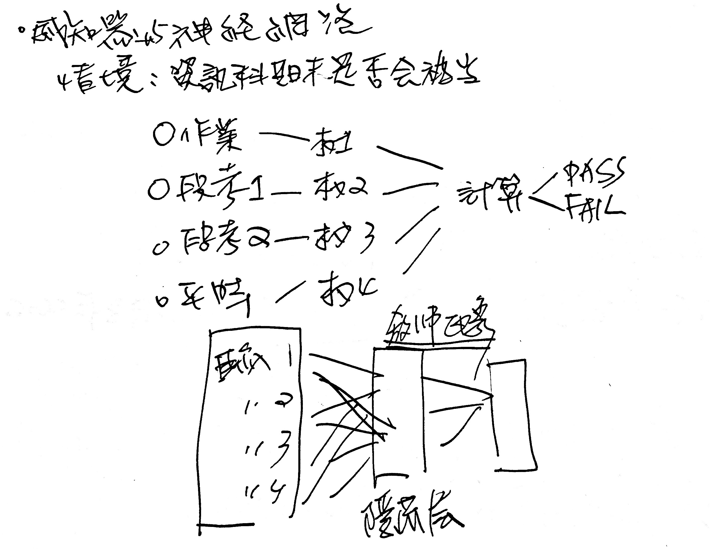

** 何謂感知器
#+begin_verse
Perceptron is a single layer neural network and a multi-layer perceptron is called Neural Networks([[id:d6daa102-05bb-475d-b619-db8b61e86030][神經網路]]).
#+end_verse
收到多個輸入訊號之後，再當作一個訊號輸出，如圖[[fig:perception]]所示，\(x_1, x_2\)為輸入訊號，\(y\)為輸出訊號，\(w_1, w_2\)代表權重(weight)，圖中的圓圈稱為「神經元」或稱作「節點」。神經元\(x_1, x_2\)的訊號是否會觸發神經元\(y\)使其輸出訊號則取決於\(w_1x_1+w_2x_2\)是否會超過某個臨界值\(\theta\)。
#+BEGIN_SRC dot :file images/sensor1.png :cmdline -Kdot -Tpng
digraph sensor1{
  rankdir=LR;
  x1[label=x1];
  x2[label=x2];
  y[label=y];
  x1 -> y[label = w1];
  x2 -> y[label = w2];
}
#+END_SRC
#+CAPTION: 收到兩組輸入訊號的感知器
#+LABEL:fig:perception
#+NAME: fig:perception
#+ATTR_LATEX: :width 100
#+ATTR_ORG: :width 100
#+ATTR_HTML: :width 200
#+RESULTS:
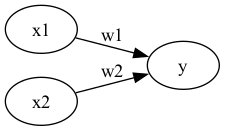

若以算式表示此一觸發條件則如公式[[eqn:perc-eq]]所示。
#+NAME: eqn:perc-eq
\begin{equation}
y =
\begin{cases}
0, & w_1x_1+w_2x_2 \leq 0 \\
1, & w_1x_1 + w_2x_2 > 0
\end{cases}
\end{equation}

** 感知器工作原理
*** Version #1: 使用weight
感知器(perceptron)是人造神經元(artificial neuron)的一種，也是最基本的一種。它接受一些輸入，產生一個輸出。
#+BEGIN_SRC dot :file ./images/perceptron-1.png :cmdline -Kdot -Tpng
digraph perceptron {
  rankdir=LR
  sigma [label="weighted\n sum"]
  output [label="output" shape="record"]
  x1 -> sigma [label = w1]
  x2 -> sigma [label = w2]
  sigma -> output
}
#+END_SRC
#+CAPTION: Perceptron version 1
#+LABEL:fig:Perceptron1
#+name: fig:Perceptron1
#+ATTR_LATEX: :width 200
#+ATTR_ORG: :width 200
#+ATTR_HTML: :width 400
#+RESULTS:
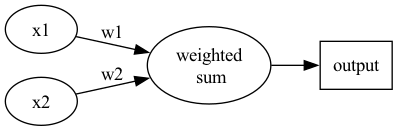
所謂「線性」，簡單來說就是「用一條直線（在二維平面上）或一個平面（在三維空間中）來切分資料」。如果資料可以被一條直線完美地分成兩群，就稱為「線性可分」。這種架構有以下限制：
- 這種架構的輸入/輸出關係為線性
- 神經網路中再多的線性perceptron疊加，結果等同於一條線，仍為線性
- 因此無法解決 *線性不可分* 的問題（也就是無法處理一條直線分不開的資料）
**** 線性可分 v.s. 線性不可分
#+CAPTION: 線性和非線性分類
#+LABEL:fig:linear-nonLinear
#+name: fig:linear-nonLinear
#+ATTR_LATEX: :width 200
#+ATTR_ORG: :width 200
#+ATTR_HTML: :width 400
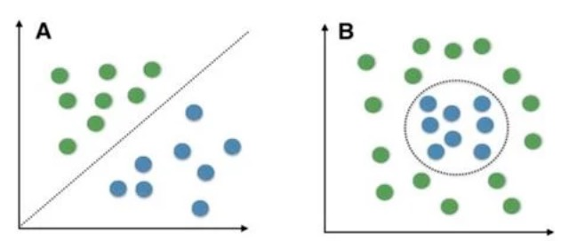

在圖[[fig:linear-nonLinear]]中，A為線性分類問題——就像一條馬路把兩區住戶分開，我們可以找到一條直線將兩類資料完美切開。B則為非線性分類問題——就像兩群人混雜在一起住，不管你怎麼畫，都找不到任何一條直線能把他們完全分開。對於B這類問題，必須使用非線性的核函數和其他非線性的分類算法和技術才能成功分類[fn:4]。
**** 低維映射至高維
可以透過一個非線性的映射將低維空間線性不可分的樣本轉換至高維空間，使其成為線性可分[fn:5]，例如:
#+CAPTION: Kernel function mapping
#+LABEL:fig:SVM-KF
#+name: fig:SVM-KF
#+ATTR_LATEX: :width 300
#+ATTR_ORG: :width 300
#+ATTR_HTML: :width 500
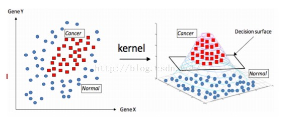
*** Version #2: 加入bias
#+BEGIN_SRC dot :file ./images/perceptron-2.png :cmdline -Kdot -Tpng
digraph perceptron {
  rankdir=LR
  sigma [label="weighted\n sum"]
  output [label="output" shape="record"]
  x1 -> sigma [label = w1]
  x2 -> sigma [label = w2]
  1 [label="1", color=gray, style=filled]
  1 -> sigma[label = b]
  sigma -> output
}
#+END_SRC
#+CAPTION: Perceptron version 2
#+LABEL:fig:Perceptron2
#+name: fig:Perceptron2
#+ATTR_LATEX: :width 200
#+ATTR_ORG: :width 200
#+ATTR_HTML: :width 400
#+RESULTS:
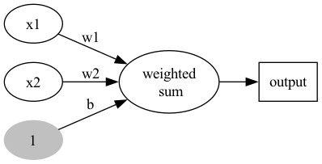
- 不加 bias 你的分類線(面)就必須過原點，這顯然是不靈活的
- 透過bias，可以將NN進行左右調整，以適應(fit)更多情況
- 可以將bias視為一個activate perceptron的threshold
- bias也可以視為當輸入均為0時的輸出值
- 從仿生學的角度，刺激生物神經元使它興奮需要刺激強度超過一定的閾值，同樣神經元模型也仿照這點設置了bias
*** Version #3: 加入activation function
加入activation function，至於為什麼要加這個，請直接看下一節的Story of gate。
#+BEGIN_SRC dot :file ./images/perceptron-3.png :cmdline -Kdot -Tpng
digraph perceptron {
  rankdir=LR
  sigma [label="weighted\n sum"]
  av [label="activation\n function"]
  output [label="output" shape="record"]
  x1 -> sigma [label = w1]
  x2 -> sigma [label = w2]
  1 [label="1", color=gray, style=filled]
  1 -> sigma[label = b]
  sigma -> av -> output
}
#+END_SRC
#+CAPTION: Perceptron version 3
#+LABEL:fig:Perceptron3
#+name: fig:Perceptron3
#+ATTR_LATEX: :width 300
#+ATTR_ORG: :width 300
#+ATTR_HTML: :width 500
#+RESULTS:
[[file:./images/perceptron-3.png]]

** 能做什麼
目前為止，感知器看起來就是個函數，有輸入、有處理、有輸出，這和AI有什麼關係呢？感知器能解決什麼問題？

感知器可以做最簡單的 *二元分類* ——也就是把資料分成兩群。例如，給定輸入後判斷「是」或「否」、「通過」或「不通過」。最經典的例子就是用感知器來實現邏輯閘（AND、OR、NAND），這些邏輯閘的輸出只有 0 和 1，正好就是一種二元分類問題。接下來我們就用邏輯閘來實際體驗感知器的威力！

* Story of gate: From perceptron to MLP
:PROPERTIES:
:CUSTOM_ID: FromPerceptronToMLP
:END:
接下來我們用最簡單的邏輯閘來示範感知器的實際運作——邏輯閘的輸入只有 0 和 1，非常適合驗證感知器是否能正確分類。

** OR gate實作
圖[[fig:orGate1]]中有四筆資料，有三個A、一個B，如何進行分類?
#+CAPTION: 分類任務:問題
#+LABEL:fig:orGate1
#+name: fig:orGate1
#+ATTR_LATEX: :width 100
#+ATTR_ORG: :width 100
#+ATTR_HTML: :width 300
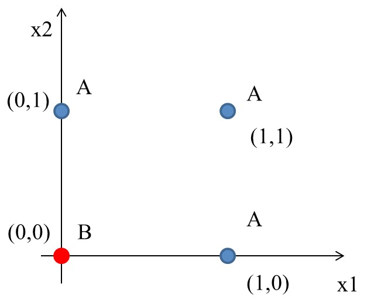
*** 想法
最簡單的分類方式是在A和B中間直接找條直線(\(w_1x_1+w_2x_2+b=0\))就可以將A和B完整切出兩個區塊，然後再搭配階梯函數(step function)將>0與<=0分別設為1與0，用來代表類別0與1。該直線方程式如下：
#+NAME: eqn:orRegFn
\begin{equation}
y = \begin{cases}
1, & w_1x_1 + w_2x_2-b>0 \\
0, & w_1x_1 + w_2x_2-b\leq0 \\
\end{cases}
\end{equation}
*** Solution
經過無數的嚐試錯誤，也許我們可以矇到一個如下的方程式
#+CAPTION: 分類任務:Solution
#+LABEL:fig:orGate2
#+name: fig:orGate2
#+ATTR_LATEX: :width 100
#+ATTR_ORG: :width 100
#+ATTR_HTML: :width 300
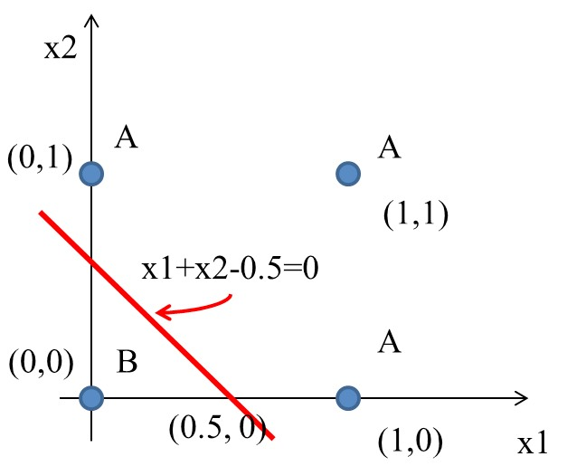

如果畫成Perceptron(version 3)的圖:
#+BEGIN_SRC dot :file ./images/orGatePerceptron.png :cmdline -Kdot -Tpng
digraph perceptron {
  rankdir=LR
  sigma [label="weighted\n sum"]
  output [label="output" shape="record"]
  x1 -> sigma [label = 1]
  x2 -> sigma [label = 1]
  1 -> sigma[label = -0.5]
  sigma -> "step\nfunction" -> output
}
#+END_SRC
#+CAPTION: Perceptron presentation
#+LABEL:fig:Perceptron4
#+name: fig:Perceptron4
#+ATTR_LATEX: :width 100
#+ATTR_ORG: :width 100
#+ATTR_HTML: :width 400
#+RESULTS:
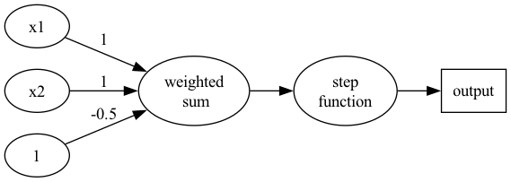

如果將圖[[fig:orGate2]]的四個點代入y(方程式[[eqn:orRegFn]]):
\begin{align*}
A(0,1) \rightarrow y &= f(0,1) = f(1\times0+1\times1-0.5) = f(0.5) = 1 \\
A(1,0) \rightarrow y &= f(1,0) = f(1\times1+1\times0-0.5) = f(0.5) = 1\\
A(1,1) \rightarrow y &= f(1,1) = f(1\times1+1\times1-0.5) = f(1.5) = 1\\
B(0,0) \rightarrow y &= f(0,0) = f(1\times0+1\times0-0.5) = f(-0.5) = 0\\
\end{align*}
*** OR gate
有點計概基礎的同學，應該可以發現圖[[fig:orGate1]]與OR邏輯閘一致，
#+CAPTION: OR邏輯閘
#+LABEL:fig:orGateImg
#+name: fig:orGateImg
#+ATTR_LATEX: :width 200
#+ATTR_ORG: :width 200
#+ATTR_HTML: :width 200
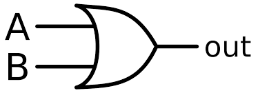

其真值表如下
|  A  |  B  | A OR B |
| <c> | <c> |  <c>   |
|-----+-----+--------|
|  0  |  0  |   0    |
|  0  |  1  |   1    |
|  1  |  0  |   1    |
|  1  |  1  |   1    |
*** Python實作
上述 OR gate的python實作如下
#+begin_src python -r -n :results output :exports both
import numpy as np  # 匯入 numpy，它是 Python 的數學神器，處理陣列運算超方便

# 階梯函數（step function）：輸入 >= 0 就回傳 1，否則回傳 0
# 就像一個超嚴格的門衛：夠格就放行(1)，不夠格就滾(0)
def step_function(x):
    return np.array(x >= 0, dtype=int)

# OR 感知器：模擬 OR 邏輯閘
# 只要有一個輸入是 1，就輸出 1（像「有沒有帶錢或帶卡？有一個就能買飲料」）
def OR(x1, x2):
    x = np.array([x1, x2])    # 把兩個輸入包成一個陣列
    w = np.array([1, 1])       # 權重：兩個輸入同等重要，各給 1
    b = -0.5                   # 偏移值（門檻）：加權總和要超過 0.5 才算「過關」
    y = np.sum(w*x) + b        # 計算加權總和：w1*x1 + w2*x2 + b
    return step_function(y)    # 丟給階梯函數，決定最終輸出 0 或 1

# 測試所有可能的輸入組合，驗證是否符合 OR 真值表
print("0 OR 0 -> ", OR(0,0))  # 0+0-0.5 = -0.5 < 0 → 輸出 0 ✓
print("0 OR 1 -> ", OR(0,1))  # 0+1-0.5 =  0.5 > 0 → 輸出 1 ✓
print("1 OR 0 -> ", OR(1,0))  # 1+0-0.5 =  0.5 > 0 → 輸出 1 ✓
print("1 OR 1 -> ", OR(1,1))  # 1+1-0.5 =  1.5 > 0 → 輸出 1 ✓
#+end_src

#+RESULTS:
: 0 OR 0 ->  0
: 0 OR 1 ->  1
: 1 OR 0 ->  1
: 1 OR 1 ->  1

** [課堂作業]AND、NAND Gate實作 :TNFSH:
上述範例中，我們以瞎貓精神找出了一組solution解決了OR gate的分類問題，請比照辦理，以Python實作出以下兩個gate: AND, NAND。
*** AND
已知AND gate真值表如下
|  A  |  B  | A AND B |
| <c> | <c> |   <c>   |
|-----+-----+---------|
|  0  |  0  |    0    |
|  0  |  1  |    0    |
|  1  |  0  |    0    |
|  1  |  1  |    1    |
|-----+-----+---------|

請仿照上面 OR gate 的程式碼，修改 =w= 和 =b= 來實作 AND gate。

提示：AND 要求兩個輸入都是 1 才輸出 1，所以門檻要比 OR 高。

#+begin_src python -r -n :results output :exports both
import numpy as np  # 匯入 numpy

# 階梯函數：老朋友了，>= 0 就輸出 1，否則 0
def step_function(x):
    return np.array(x >= 0, dtype=int)

# AND 感知器：兩個輸入都是 1 才輸出 1（像「要帶錢而且帶卡才能刷」）
def AND(x1, x2):
    x = np.array([x1, x2])        # 把兩個輸入包成陣列
    w = np.array([___, ___])       # 請填入權重（提示：跟 OR 一樣各 0.5 就行）
    b = ___                        # 請填入偏移值（提示：門檻要比 OR 高，想想為什麼）
    y = np.sum(w*x) + b            # 加權總和 = w1*x1 + w2*x2 + b
    return step_function(y)        # 過門檻就輸出 1，沒過就 0

# 測試四種輸入組合，對照 AND 真值表檢查
print("0 AND 0 -> ", AND(0,0))  # 預期 0
print("0 AND 1 -> ", AND(0,1))  # 預期 0
print("1 AND 0 -> ", AND(1,0))  # 預期 0
print("1 AND 1 -> ", AND(1,1))  # 預期 1（唯一輸出 1 的情況）
#+end_src

*正確答案（用來驗證）：*
#+begin_example
0 AND 0 ->  0
0 AND 1 ->  0
1 AND 0 ->  0
1 AND 1 ->  1

一組可行的答案：w=[0.5, 0.5], b=-0.7
#+end_example

*** NAND
已知NAND gate真值表如下
|  A  |  B  | A NAND B |
| <c> | <c> |   <c>    |
|-----+-----+----------|
|  0  |  0  |    1     |
|  0  |  1  |    1     |
|  1  |  0  |    1     |
|  1  |  1  |    0     |
|-----+-----+----------|

請把 AND gate 的權重和偏移值「全部反過來」試試看。

#+begin_src python -r -n :results output :exports both
import numpy as np  # 匯入 numpy

# 階梯函數：又是你，>= 0 → 1，< 0 → 0
def step_function(x):
    return np.array(x >= 0, dtype=int)

# NAND 感知器：AND 的相反！兩個都是 1 才輸出 0，其餘都是 1
# （像「兩個人都遲到才扣分，只要有一個準時就沒事」）
def NAND(x1, x2):
    x = np.array([x1, x2])        # 把兩個輸入包成陣列
    w = np.array([___, ___])       # 請填入權重（提示：把 AND 的權重「反過來」）
    b = ___                        # 偏移值也反過來
    y = np.sum(w*x) + b            # 加權總和
    return step_function(y)        # 階梯函數判定輸出

# 測試四種輸入組合，對照 NAND 真值表
print("0 NAND 0 -> ", NAND(0,0))  # 預期 1
print("0 NAND 1 -> ", NAND(0,1))  # 預期 1
print("1 NAND 0 -> ", NAND(1,0))  # 預期 1
print("1 NAND 1 -> ", NAND(1,1))  # 預期 0（唯一輸出 0 的情況）
#+end_src

*正確答案（用來驗證）：*
#+begin_example
0 NAND 0 ->  1
0 NAND 1 ->  1
1 NAND 0 ->  1
1 NAND 1 ->  0

一組可行的答案：w=[-0.5, -0.5], b=0.7（和 AND 完全相反！）
#+end_example

*** AND Gate Solution :noexport:
**** AND Gate Perceptron
#+BEGIN_SRC dot :file ./images/andGatePerceptron.png :cmdline -Kdot -Tpng
digraph perceptron {
  rankdir=LR
  sigma [label="weighted\n sum"]
  output [label="output" shape="record"]
  x1 -> sigma [label = 0.5]
  x2 -> sigma [label = 0.5]
  1 -> sigma[label = -0.7]
  sigma -> "step\nfunction" -> output
}
#+END_SRC
#+CAPTION: AND Perceptron presentation
#+LABEL:fig:andPerceptron
#+name: fig:andPerceptron
#+ATTR_LATEX: :width 300
#+ATTR_ORG: :width 300
#+ATTR_HTML: :width 500
#+RESULTS:
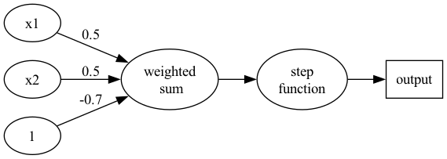
**** Python實作
#+begin_src python -r -n :results output :exports both
import numpy as np

def step_function(x):
    return np.array(x >= 0, dtype=int)

def AND(x1, x2):
    x = np.array([x1, x2])
    w = np.array([0.5, 0.5])
    b = -0.7
    y = np.sum(w*x) + b
    return(step_function(y))

print("0 AND 0 -> ",AND(0,0))
print("0 AND 1 -> ",AND(0,1))
print("1 AND 0 -> ",AND(1,0))
print("1 AND 1 -> ",AND(1,1))
#+end_src

#+RESULTS:
: 0 AND 0 ->  0
: 0 AND 1 ->  0
: 1 AND 0 ->  0
: 1 AND 1 ->  1
*** NAND Gate Solution :noexport:
**** NAND Gate Perceptron
#+BEGIN_SRC dot :file ./images/nandGatePerceptron.png :cmdline -Kdot -Tpng
digraph perceptron {
  rankdir=LR
  sigma [label="weighted\n sum"]
  output [label="output" shape="record"]
  x1 -> sigma [label = -0.5]
  x2 -> sigma [label = -0.5]
  1 -> sigma[label = 0.7]
  sigma -> "step\nfunction" -> output
}
#+END_SRC
#+CAPTION: NAND Perceptron presentation
#+LABEL:fig:nandPerceptron
#+name: fig:nandPerceptron
#+ATTR_LATEX: :width 300
#+ATTR_ORG: :width 300
#+ATTR_HTML: :width 500
#+RESULTS:

**** Python實作
#+BEGIN_SRC python -n -r :results output :exports both
import numpy as np

def step_function(x):
    return np.array(x >= 0, dtype=int)

def NAND(x1, x2):
    x = np.array([x1, x2])
    w = np.array([-0.5, -0.5])
    b = 0.7
    y = np.sum(w*x) + b
    return step_function(y)

print("0 NAND 0 -> ",NAND(0,0))
print("0 NAND 1 -> ",NAND(0,1))
print("1 NAND 0 -> ",NAND(1,0))
print("1 NAND 1 -> ",NAND(1,1))
#+END_SRC

#+RESULTS:
: 0 NAND 0 ->  1
: 0 NAND 1 ->  1
: 1 NAND 0 ->  1
: 1 NAND 1 ->  0

** 執行感知器: 邏輯閘實作 :noexport:
*** AND gate(版本#1：只設定權重)
以上述感知器的運作方式來模擬 AND 邏輯閘的功能，可由以下程式碼實現出來。
#+BEGIN_SRC python -n -r :results output :exports both
def AND(x1, x2):
    w1, w2, theta = 0.5, 0.5, 0.7
    tmp = x1*w1 + x2*w2
    if tmp <= theta:
        return 0
    else:
        return 1

print("AND(1, 0): ", AND(1,0))         (ref:run-and)
print("AND(1, 1): ", AND(1,1))
#+END_SRC

#+RESULTS:
: AND(1, 0):  0
: AND(1, 1):  1

如程式碼第[[(run-and)]]行所示，傳入\(1, 0\)為輸入訊號，而根據計算結果是否達到臨界值(\(\theta=0.7\))來決定最終的輸出訊號\(0\)。
*** AND gate(版本#2: 導入權重及偏移值)
在版本#1 的實作中，我們只透過輸入訊號與權重的計算來實現感知器的運作，事實上，這個感知器也可以用公式[[eqn:biasPerc-eq]]來表示，這裡利用\(b\)這個被稱作「偏移值」或「偏權值」的參數來控制神經元的觸發難度，此時的感知器如圖[[fig:biaspercep]]所示。
#+NAME: eqn:biasPerc-eq
\begin{equation}
y = \begin{cases}
0, & b+w_1x_1+w_2x_2 \leq 0 \\
1, & b+w_1x_1 + w_2x_2 > 0
\end{cases}
\end{equation}

#+BEGIN_SRC dot :file images/biassensor2.png :cmdline -Kdot -Tpng
digraph biasG{
  rankdir=LR;
  node[style=filled];
  one[label = 1];
  node[style=empty];
  x1[label = x1];
  x2[label = x2];
  one -> y[label = b];
  x1 -> y[label = w1];
  x2 -> y[label = w2];
}
#+END_SRC
#+CAPTION: 加入偏移值\(b\)的感知器
#+LABEL:fig:biaspercep
#+name: fig:biaspercep
#+ATTR_LATEX: :width 200
#+ATTR_ORG: :width 200
#+ATTR_HTML: :width 200
#+RESULTS:
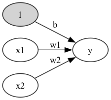

在圖[[fig:biaspercep]]中，增加了一個權重為\(b\)(輸入值為 1)的訊號，其作用與權重\(w_1\)及\(w_2\)不同：
- \(w_1\)與\(w_2\)的用來描述輸入訊號的重要程度;但是\(b\)的功能是調整輸入1的參數，
- 「偏移」意謂：在沒有輸入時，輸出究竟會產生多少偏移量(\(w_1\)與\(w_2\)均為零)。
- 由於偏移值的輸入訊號固定為 1，以圖形表示時，會用灰色填滿神經元，藉此區隔其他神經元。

以下為針對上述版本#1 的 AND 邏輯閘模擬程式碼進行的修正，將偏移值的機制加入感知器的運作流程中。
#+CAPTION: And Gate perceptron
#+LABEL:fig:andGatePerc
#+name: fig:andGatePerc
#+ATTR_LATEX: :width 300
#+ATTR_ORG: :width 300
#+ATTR_HTML: :width 500
#+RESULTS:
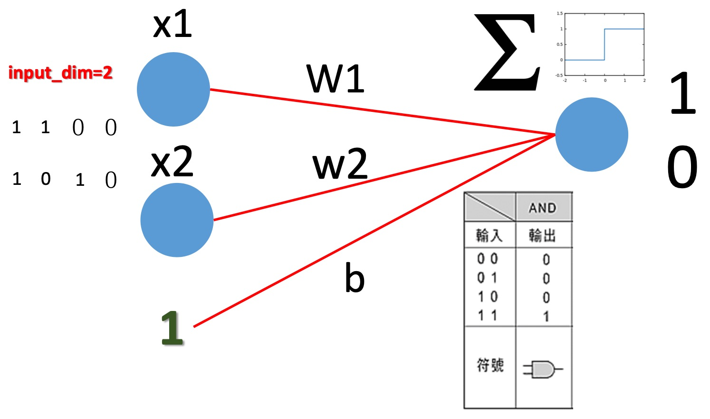
#+BEGIN_SRC python -n -r :results output :exports both
import numpy as np
def AND(x1, x2):
    x = np.array([x1, x2])
    w = np.array([0.5, 0.5])
    b = -0.7
    tmp = np.sum(w*x) + b
    if tmp <= 0:
        return 0
    else:
        return 1

print("1 AND 0 -> ",AND(1,0))
print("1 AND 1 -> ",AND(1,1))
#+END_SRC

#+RESULTS:
: 1 AND 0 ->  0
: 1 AND 1 ->  1
*** OR, NAND gates
同樣的感知器架構亦可實作出 OR 邏輯閘的功能：
#+BEGIN_SRC python -n -r :results output :exports both
import numpy as np
def OR(x1, x2):
    x = np.array([x1, x2])
    w = np.array([0.5, 0.5])
    b = -0.2
    tmp = np.sum(w*x) + b
    if tmp <= 0:
        return 0
    else:
        return 1

print("1 OR 0 -> ",OR(1,0))
print("1 OR 1 -> ",OR(1,1))
#+END_SRC

#+RESULTS:
: 1 OR 0 ->  1
: 1 OR 1 ->  1

也可實作出 NAND 邏輯閘的原理。

** MLP (Multilayer perceptron) :noexport:
#+CAPTION: MLP XOR Gate Solution
#+LABEL:fig:mlpXorGate
#+name: fig:mlpXorGate
#+ATTR_LATEX: :width 200
#+ATTR_ORG: :width 200
#+ATTR_HTML: :width 500
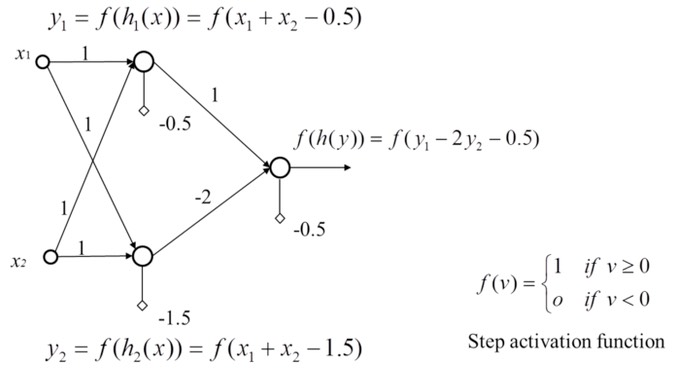

由XOR問題的例子可以知道，第一層兩個Perceptron在做的事情其實是將資料投影到另一個特徵空間去,最後再把\(h_1\)和\(h_2\)的結果當作另一個Perceptron的輸入，再做一個下一層的Perceptron就可以完美分類XOR問題。

上例其實就是一個Two-Layer Perceptrons，第一層的Perceptron輸出其實就是每個hidden node，所以如果hidden layer再多一層就是Three-Layer Perceptrons，所以很多層的Perceptrons組合起來就是多層感知機 (Multilayer perceptron, MLP)。MLP其實就是可以用多層和多個Perceptron來達到最後目的，有點像用很多個回歸方法/線性分類器一層一層疊加來達到目的。

中間一堆的hidden layer其實就是在做資料的特徵擷取，可以降維，也可以增加維度，而這個過程不是經驗法則去設計，而是由資料去學習得來，最後的輸出才是做分類，所以最後一層也可以用SVM來分類。

如果層數再多也可以稱為深度神經網路(deep neural network, DNN)，所以現在稱的DNN其實就是人工神經網路的MLP。有一說法是說因為MLP相關的神經網路在之前因為電腦限制所以performance一直都沒有很好的突破，所以相關研究沒有像SVM這麼的被接受，因此後來Deep learning的聲名大噪，MLP也換個較酷炫的名字(deep neural network)來反轉神經網路這個名稱的聲勢。

多層感知機是一種前向傳遞類神經網路，至少包含三層結構(輸入層、隱藏層和輸出層)，並且利用到「倒傳遞」的技術達到學習(model learning)的監督式學習，以上是傳統的定義。現在深度學習的發展，其實MLP是深度神經網路(deep neural network, DNN)的一種special case，概念基本上一樣，DNN只是在學習過程中多了一些手法和層數會更多更深[fn:1]。

本章參考來源:[[https://chih-sheng-huang821.medium.com/%E6%A9%9F%E5%99%A8%E5%AD%B8%E7%BF%92-%E7%A5%9E%E7%B6%93%E7%B6%B2%E8%B7%AF-%E5%A4%9A%E5%B1%A4%E6%84%9F%E7%9F%A5%E6%A9%9F-multilayer-perceptron-mlp-%E9%81%8B%E4%BD%9C%E6%96%B9%E5%BC%8F-f0e108e8b9af][機器學習- 神經網路(多層感知機 Multilayer perceptron, MLP)運作方式]]

* 單層感知器的極限與多層感知器: XOR Gate

** 一場差點殺死 AI 的學術恩怨

在講 XOR 之前，先來聽一個八點檔等級的 AI 歷史故事——因為 XOR 這個看起來人畜無害的小問題，曾經直接把整個 AI 領域打入冷宮長達十幾年。

*** 第一幕：天才登場（1957）
1957 年，美國心理學家 Frank Rosenblatt 在康乃爾大學發明了感知器，並用硬體實作出一台叫做 *Mark I Perceptron* 的機器（想看實機照片和內部線路？去[[file:20221023101139-人工智慧.org::#MarkIPerceptron][人工智慧：Mark I Perceptron]]瞧瞧）——它可以「學會」辨識簡單的圖形。這在當時簡直是科幻小說成真，媒體瘋狂報導，《紐約時報》甚至寫出了這樣的標題：

#+begin_quote
「海軍展示一台能像嬰兒一樣學習的機器」——The New York Times, 1958
#+end_quote

Rosenblatt 本人也相當樂觀，預言感知器未來能「走路、說話、看東西、寫字、自我複製，甚至意識到自己的存在」。以現在的眼光來看，這大概就像有人拿出一個計算機，然後宣布「它未來會統治世界」一樣。

*** 第二幕：殺手登場（1969）
好景不長。1969 年，MIT 的兩位大佬——Marvin Minsky 和 Seymour Papert——出版了一本叫做《Perceptrons》的書。這本書用嚴謹的數學證明了一件事：

#+begin_quote
單層感知器連 XOR 這麼簡單的問題都解不了。
#+end_quote

就是我們接下來要看的 XOR。一個只有四筆資料、兩個輸入的問題，感知器居然搞不定。Minsky 和 Papert 的結論很殘酷：感知器只能處理「線性可分」的問題，對於稍微複雜一點的問題就束手無策。

這本書的殺傷力有多大？幾乎所有研究經費都被砍光，整個神經網路領域進入了長達十多年的寒冬（AI Winter）。學者們紛紛轉向其他方向，神經網路變成學術界的髒字眼——提到它就像在說「地球是平的」一樣丟臉。

*** 第三幕：復仇者歸來（1986）
其實 Minsky 和 Papert 的書裡有一個關鍵的「但是」被大家忽略了——他們證明的是 *單層* 感知器的極限，並沒有說 *多層* 感知器不行。

1986 年，Rumelhart、Hinton 和 Williams 提出了 *反向傳播演算法*（Backpropagation），讓多層感知器（MLP）可以有效地學習。XOR？小菜一碟。更複雜的問題？也能搞定。神經網路終於翻身，從此一路進化到今天的深度學習。

*** 這個故事告訴我們什麼？
1. 一個「太簡單」的問題（XOR）可以改變整個領域的命運
2. 學術界的結論常被過度簡化——「感知器不行」被誤讀成「神經網路不行」
3. 被判死刑不代表真的死了，有時候只是還沒找到對的方法

接下來，就讓我們親眼看看 XOR 到底「難」在哪裡，以及多層感知器是怎麼破解它的。

** XOR 問題
XOR（互斥或，Exclusive OR）是電腦科學中的一種基本邏輯運算：當兩個輸入「不同」時輸出 1，「相同」時輸出 0。看起來很簡單，但它有一個致命的特性——XOR 的四個資料點無法被任何一條直線分開。這正是單層感知器的致命弱點，也是推動多層感知器（MLP）發展的關鍵問題。

XOR真值表如下:
|  A  |  B  | A XOR B |
| <c> | <c> |   <c>   |
|-----+-----+---------|
|  0  |  0  |    0    |
|  0  |  1  |    1    |
|  1  |  0  |    1    |
|  1  |  1  |    0    |
其輸入/輸出分佈圖為
#+CAPTION: XOR Gate
#+LABEL:fig:xorGate1
#+name: fig:xorGate1
#+ATTR_LATEX: :width 100
#+ATTR_ORG: :width 100
#+ATTR_HTML: :width 300
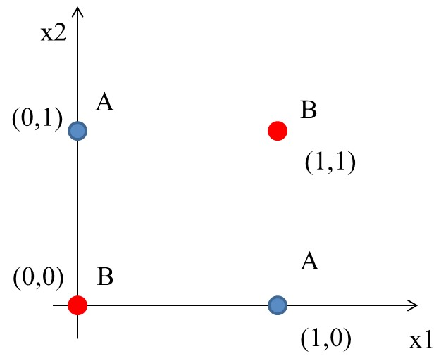

到目前為止，透過權重及偏權值可以設計 AND、NAND、OR, 但無法完成 XOR。顯然，若要再以感知器來模擬其運作原理，單層感知器已不敷使用。

*** 想法
這個時候一般線性的分類就沒有辦法很完美分割(如下圖)，所以就需要一些變形的方法來達到目的。
#+CAPTION: XOR Gate Solution ideas
#+LABEL:fig:xorGate2
#+name: fig:xorGate2
#+ATTR_LATEX: :width 200
#+ATTR_ORG: :width 200
#+ATTR_HTML: :width 400
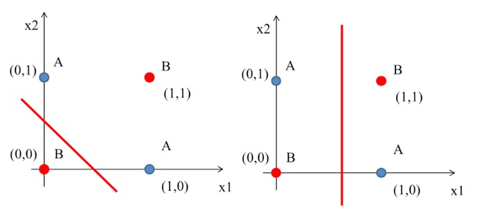

一條線分不開？那就用兩條！這就是多層感知器的核心概念——當一個感知器（一條線）無法解決問題時，我們可以用多個感知器（多條線）組合起來解決。

由XOR的電路實作(如圖[[fig:xor-gate0]])我們也可以發現同樣的原理。
#+CAPTION: XOR 邏輯閘的組合
#+LABEL:fig:xor-gate0
#+name: fig:xor-gate0
#+ATTR_LATEX: :width 300
#+ATTR_HTML: :width 400
#+ATTR_ORG: :width 300
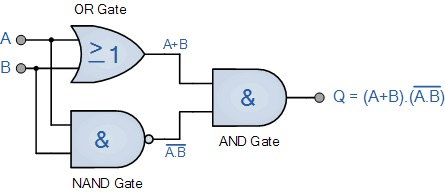

*** 多層感知器(MLP): XOR gate 實作
參考圖[[fig:xor-gate0]]的架構，我們可以藉由增加感知器的層數來實現 XOR 的功能，其結構如圖[[fig:TLayerSensor]]所示。
#+BEGIN_SRC dot :file images/2LayerSensor.png :cmdline -Kdot -Tpng
  digraph TLS{
    rankdir=LR;
    x1 -> NAND -> AND;
    x1 -> OR -> AND;
    x2 -> NAND;
    x2 -> OR;
  }
#+END_SRC
#+CAPTION: 多層感知器模擬 XOR 邏輯閘
#+LABEL:fig:TLayerSensor
#+name: fig:TLayerSensor
#+ATTR_LATEX: :width 300
#+ATTR_ORG: :width 300
#+ATTR_HTML: :width 300
#+RESULTS:
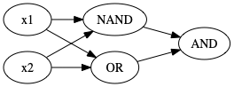

**** Solution
#+CAPTION: XOR Gate Solution: (1)
#+LABEL:fig:xorSolution1
#+name: fig:xorSolution1
#+ATTR_LATEX: :width 200
#+ATTR_ORG: :width 200
#+ATTR_HTML: :width 300
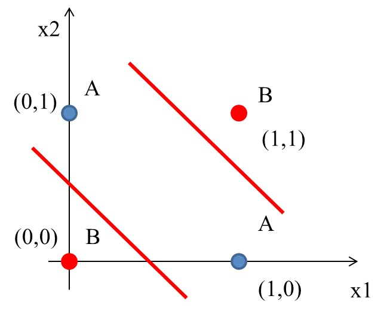

如前所述，一條線為一個perceptron，這裡會用到兩個
- \(h_1(x) = x_1 + x_2 - 0.5\)
- \(h_2(x) = x_1 + x_2 - 1.5\)
#+CAPTION: XOR Gate Solution: (2)
#+LABEL:fig:xorSolution2
#+name: fig:xorSolution2
#+ATTR_LATEX: :width 300
#+ATTR_ORG: :width 300
#+ATTR_HTML: :width 400
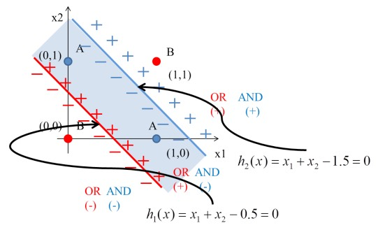

將圖[[fig:xorGate2]]的4個點代入\(h_1\):
\begin{align*}
h_1(0,0) &= f(1\times0+1\times0-0.5) = f(-0.5) = 0\\
h_1(0,1) &= f(1\times0+1\times1-0.5) = f(0.5) = 1\\
h_1(1,0) &= f(1\times1+1\times0-0.5) = f(0.5) = 1\\
h_1(1,1) &= f(1\times1+1\times1-0.5) = f(1.5) = 1\\
\end{align*}

將圖[[fig:xorGate2]]的4個點代入\(h_2\):
\begin{align*}
h_2(0,0) &= f(1\times0+1\times0-1.5) = f(-1.5) = 0\\
h_2(0,1) &= f(1\times0+1\times1-1.5) = f(-0.5) = 0\\
h_2(1,0) &= f(1\times1+1\times0-1.5) = f(-0.5) = 0\\
h_2(1,1) &= f(1\times1+1\times1-1.5) = f(0.5) = 1\\
\end{align*}

由上可知:
- (0, 0)
  - (0, 0)帶入第1個perceptron \(h_1(0,0)\)輸出-0.5
  - (0, 0)帶入第2個perceptron \(h_2(0,0)\)輸出-1.5
  - (-0.5, -1.5)再經由step function轉換輸出(0,0)
- (0, 1)
  - (0, 1)帶入第1個perceptron \(h_1(0,1)\)輸出0.5
  - (0, 1)帶入第2個perceptron \(h_2(0,1)\)輸出-0.5
  - (0.5, -0.5)再經由step function轉換輸出(1,0)
- (1, 0)
  - (1, 0)帶入第1個perceptron \(h_1(1,0)\)輸出0.5
  - (1, 0)帶入第2個perceptron \(h_2(1,0)\)輸出-0.5
  - (0.5, -0.5)再經由step function轉換輸出(1,0)
- (1, 1)
  - (1, 1)帶入第1個perceptron \(h_1(1,1)\)輸出1.5
  - (1, 1)帶入第2個perceptron \(h_2(1,1)\)輸出0.5
  - (1.5, 0.5)再經由step function轉換輸出(1,1)

即
\begin{align*}
data(0,0) &= f(h_1,h_2) = (0,0) \\
data(0,1) &= f(h_1,h_2) = (1,0) \\
data(1,0) &= f(h_1,h_2) = (1,0) \\
data(1,1) &= f(h_1,h_2) = (1,1) \\
\end{align*}

觀察轉換後的結果：原本在 \((x_1, x_2)\) 空間中，(0,0) 和 (1,1) 輸出為 0、(0,1) 和 (1,0) 輸出為 1，這四個點無法用一條直線分開。但經過隱藏層轉換到 \((h_1, h_2)\) 空間後，(0,0) 映射到 (0,0)、(0,1) 和 (1,0) 都映射到 (1,0)、(1,1) 映射到 (1,1)——此時這些點變成可以用一條直線分開了！這就是多層感知器的威力。

這相當於透過兩個perceptron將原本的輸入做特徵空間轉換，如圖[[fig:xorGateSolution3]]:
#+CAPTION: XOR Gate Solution: (3)
#+LABEL:fig:xorGateSolution3
#+name: fig:xorGateSolution3
#+ATTR_LATEX: :width 300
#+ATTR_ORG: :width 300
#+ATTR_HTML: :width 500
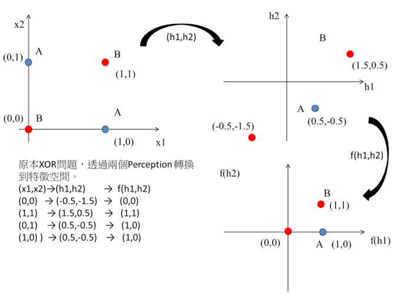

這個時候只要設計一個線性分類器就可以完美分割兩類的資料了阿，如圖[[fig:xorGateSolution4]]:
#+CAPTION: XOR Gate Solution: (4)
#+LABEL:fig:xorGateSolution4
#+name: fig:xorGateSolution4
#+ATTR_LATEX: :width 200
#+ATTR_ORG: :width 200
#+ATTR_HTML: :width 400
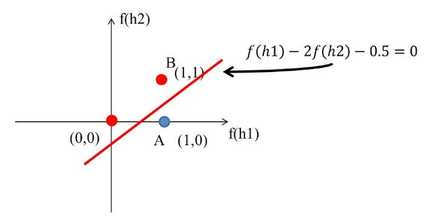

XOR問題的神經網路結構如下圖:
#+CAPTION: XOR Gate Solution: (5)
#+LABEL:fig:xorGateSolution5b
#+name: fig:xorGateSolution5b
#+ATTR_LATEX: :width 200
#+ATTR_ORG: :width 200
#+ATTR_HTML: :width 500

至於其實作程式碼則如下。
#+BEGIN_SRC python -n -r :results output :exports both
# XOR 邏輯閘模擬——用多層感知器（MLP）組合 NAND、OR、AND 來實現
# 這就是「一條線分不開，那就用兩條線」的具體實踐！
import numpy as np

# 老朋友階梯函數：>= 0 輸出 1，否則 0
def step_function(x):
    return np.array(x >= 0, dtype=int)

# AND 感知器：兩個都是 1 才輸出 1
def AND(x1, x2):
    x = np.array([x1, x2])
    w = np.array([0.5, 0.5])  # 權重各 0.5
    b = -0.7                   # 門檻 0.7，所以 0.5+0.5=1.0 才過關
    return step_function(np.sum(w*x) + b)

# OR 感知器：有一個是 1 就輸出 1
def OR(x1, x2):
    x = np.array([x1, x2])
    w = np.array([0.5, 0.5])  # 權重各 0.5
    b = -0.2                   # 門檻只有 0.2，一個 0.5 就能過
    return step_function(np.sum(w*x) + b)

# NAND 感知器：AND 的相反版（權重和偏移值全部反轉）
def NAND(x1, x2):
    x = np.array([x1, x2])
    w = np.array([-0.5, -0.5])  # 負權重：輸入越大，分數反而越低
    b = 0.7                      # 正偏移：預設就偏向輸出 1
    return step_function(np.sum(w*x) + b)

# XOR 感知器：重頭戲來了！組合三個閘來完成單層做不到的事
# 結構：x1, x2 → [NAND, OR]（第一層）→ AND（第二層）→ 輸出
def XOR(x1, x2):
    s1 = NAND(x1, x2)  # 第一層第 1 個神經元：除了 (1,1) 以外都輸出 1
    s2 = OR(x1, x2)    # 第一層第 2 個神經元：除了 (0,0) 以外都輸出 1
    y = AND(s1, s2)     # 第二層：只有 s1 和 s2 都是 1 才輸出 1
    return y            # 最終效果：「不同」才輸出 1，跟 XOR 一模一樣！

# 驗證所有組合
print("XOR(0,0): ", XOR(0,0))  # NAND=1, OR=0 → AND(1,0)=0 ✓
print("XOR(0,1): ", XOR(0,1))  # NAND=1, OR=1 → AND(1,1)=1 ✓
print("XOR(1,0): ", XOR(1,0))  # NAND=1, OR=1 → AND(1,1)=1 ✓
print("XOR(1,1): ", XOR(1,1))  # NAND=0, OR=1 → AND(0,1)=0 ✓
#+END_SRC

#+RESULTS[87f37ec3364308fc99ff6301646186c1497b27e8]:
: XOR(0,0):  0
: XOR(0,1):  1
: XOR(1,0):  1
: XOR(1,1):  0

**** Solution #2 :noexport:
藉由多層感知器處理同一問題，也就是利用feature transform的概念，將原本線性不可分的輸入資料映射到線性可分的特徵平面上，特徵轉換的效果也就是造就深層網路效果能優異的原因[fn:7]。如下圖是原本不可分的XOR例子：
#+CAPTION: 原始XOR分佈
#+LABEL:fig:xorOriginal
#+name: fig:xorOriginal
#+ATTR_LATEX: :width 200
#+ATTR_ORG: :width 200
#+ATTR_HTML: :width 400
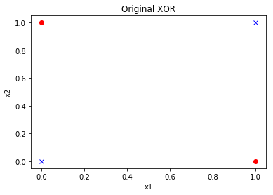

為了處理這個問題，我們只需要使用兩層感知器就可以做出XOR的效果，下圖是經過feature transform後四個點在y1-y2平面上的位置，我們可以輕易地使用圖中的綠色直線將兩個類別切開。所使用的感知器為：

- $w_1 = [0.2, -0.3], b_1 = 0.2$
- $w_2 = [-0.8, 1.1], b_2 = 1$
上述的四點在透過轉換後會得到另外四個新的點，對照的作法如下：
#+begin_src python -r -n :async :results output :exports both
# -*- coding: utf-8 -*-
import numpy as np

def Perceptron(w, x, b):
    return Sigmoid(np.dot(w, x) + b)

def Sigmoid(x):
    return 1/(1+np.exp(-x))

# 四個點
pts = np.array([[0, 0], [1, 1], [0, 1], [1, 0]])

# 指定w與b
w1 = [0.2, -0.3]
b1 = 0.2
w2 = [-0.8, 1.1]
b2 = 1

for pt in pts:
    # 計算feature transform後的輸出 (y1 and y2)
    if "y" not in dir():
        y = np.array([Perceptron(w1, pt, b1), Perceptron(w2, pt, b2)])
    else:
        y = np.row_stack((y, np.array([Perceptron(w1, pt, b1), Perceptron(w2, pt, b2)])))

print(y)
#+end_src

#+RESULTS:
: [[0.549834   0.73105858]
:  [0.52497919 0.78583498]
:  [0.47502081 0.89090318]
:  [0.59868766 0.549834  ]]

#+CAPTION: 轉換後的XOR分佈
#+LABEL:fig:xorTransformed
#+name: fig:xorTransformed
#+ATTR_LATEX: :width 200
#+ATTR_ORG: :width 200
#+ATTR_HTML: :width 400
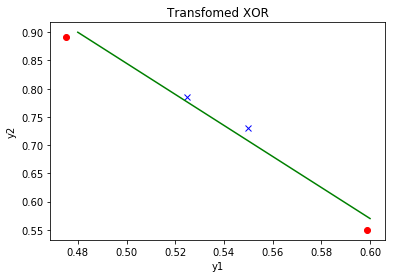

#+begin_src python -r -n :async :results output :exports none
# -*- coding: utf-8 -*-

import numpy as np
import matplotlib.pyplot as plt

def Perceptron(w, x, b):
    return Sigmoid(np.dot(w, x) + b)

def Sigmoid(x):
    return 1/(1+np.exp(-x))

# 畫出原始XOR
plt.figure()
pts = np.array([[0, 0], [1, 1], [0, 1], [1, 0]])
plt.title("Original XOR")
plt.xlabel("x1")
plt.ylabel("x2")
plt.plot(pts[0:2,0], pts[0:2,1], 'bx', pts[2:4,0], pts[2:4,1], 'ro');
# plt.show()

# 人為給定w與b
w1 = [0.2, -0.3]
b1 = 0.2
w2 = [-0.8, 1.1]
b2 = 1

for pt in pts:
    # 計算feature transform後的輸出 (y1 and y2)
    if "y" not in dir():
        y = np.array([Perceptron(w1, pt, b1), Perceptron(w2, pt, b2)])
    else:
        y = np.row_stack((y, np.array([Perceptron(w1, pt, b1), Perceptron(w2, pt, b2)])))

# 畫出轉換到y1-y2平面上的四個點
plt.figure()
plt.title("Transformed XOR")
plt.xlabel("y1")
plt.ylabel("y2")
plt.plot(y[0:2,0], y[0:2,1], 'bx', y[2:4,0], y[2:4,1], 'ro');

# 舉個能切割開兩類別的直線例子
plt.plot([0.48, 0.6], [0.9, 0.57], 'g-', linewidth=1.5)
#plt.savefig('images/perceptron-sl-2.png', dpi=300)
#+end_src

* 課堂練習 :TNFSH:
** 練習一：AI 預測你上課會不會睡著
老師受夠了在台上講課看到一片屍體的景象。他決定在每堂課前用感知器預測誰會睡著，然後把那些人叫到第一排坐（或者直接潑水，看老師心情）。

他偷偷蒐集了 8 位同學的資料：

| 同學 | 昨晚睡幾小時 | 今天喝幾杯咖啡 | 上課狀態 |
|------+--------------+----------------+----------|
| 阿明 |            8 |              2 | 清醒     |
| 小美 |            4 |              0 | 睡著     |
| 大雄 |            7 |              1 | 清醒     |
| 胖虎 |            3 |              1 | 睡著     |
| 靜香 |            6 |              2 | 清醒     |
| 小夫 |            5 |              0 | 睡著     |
| 阿福 |            4 |              2 | 清醒     |
| 魯夫 |            3 |              0 | 睡著     |

*** 範例：先用最簡單的方法試試
最直覺的做法：只看睡眠時數，忽略咖啡。如果睡超過 5.5 小時就算清醒。

#+begin_src python -r -n :results output :exports both
import numpy as np  # 匯入 numpy

# 階梯函數：>= 0 輸出 1（清醒），< 0 輸出 0（睡著）
def step_function(x):
    return np.array(x >= 0, dtype=int)

# 同學資料：每列 = [昨晚睡幾小時, 今天咖啡幾杯]
# 8 位同學的生活作息，老師偷偷記下來的（隱私什麼的先不管了）
X = np.array([[8,2], [4,0], [7,1], [3,1],
              [6,2], [5,0], [4,2], [3,0]])
# 標籤（正確答案）: 清醒=1, 睡著=0
y = np.array([1, 0, 1, 0, 1, 0, 1, 0])
names = ['阿明','小美','大雄','胖虎','靜香','小夫','阿福','魯夫']

# 設定感知器的權重和偏移值
# w=[1, 0] 表示：只看睡眠時數（權重=1），完全忽略咖啡（權重=0）
w = np.array([1, 0])
b = -5.5  # 門檻 5.5 小時（睡超過 5.5hr 才判定為清醒）

# 逐一預測每位同學的上課狀態
print("預測結果（只看睡眠時數）:")
for i in range(len(X)):
    # np.dot(w, X[i]) + b = 1*睡眠 + 0*咖啡 - 5.5 = 睡眠 - 5.5
    pred = step_function(np.dot(w, X[i]) + b)  # 過階梯函數得到 0 或 1
    label = '清醒' if pred == 1 else '睡著'     # 把 0/1 翻譯成人話
    correct = '○' if pred == y[i] else '×'      # 跟正確答案比對
    print(f"  {names[i]}（睡{X[i][0]}hr, 咖啡{X[i][1]}杯）→ {label} {correct}")
#+end_src

範例結果：7/8 正確。唯一被分錯的是阿福——他只睡 4 小時但靠 2 杯咖啡硬撐，你的感知器看不到咖啡的功勞。

*** 你的任務：讓感知器也看到咖啡
把範例程式碼複製過來，修改 =w= 和 =b= ，讓感知器 *同時考慮* 睡眠和咖啡，把 8 個人全部分對。

提示：
- 每 1 杯咖啡的提神效果大約等於多睡 2 小時，所以 w2（咖啡權重）應該是 w1 的 2 倍
- 決策邊界為 \(w_1 \times 睡眠時數 + w_2 \times 咖啡杯數 + b = 0\)

*正確答案（用來驗證）：*
#+begin_example
w=[1, 2], b=-6 可以全部分對（8/8）

  阿明（睡8hr, 咖啡2杯）→ 分數=6  → 清醒 ○
  小美（睡4hr, 咖啡0杯）→ 分數=-2 → 睡著 ○
  大雄（睡7hr, 咖啡1杯）→ 分數=3  → 清醒 ○
  胖虎（睡3hr, 咖啡1杯）→ 分數=-1 → 睡著 ○
  靜香（睡6hr, 咖啡2杯）→ 分數=4  → 清醒 ○
  小夫（睡5hr, 咖啡0杯）→ 分數=-1 → 睡著 ○
  阿福（睡4hr, 咖啡2杯）→ 分數=2  → 清醒 ○ ← 咖啡救了他！
  魯夫（睡3hr, 咖啡0杯）→ 分數=-3 → 睡著 ○
#+end_example

#+begin_src python -r -n :results output :exports both
import numpy as np          # 數學運算
import matplotlib.pyplot as plt  # 畫圖用（matplotlib 是 Python 的畫圖神器）

# 階梯函數
def step_function(x):
    return np.array(x >= 0, dtype=int)

# 同學資料 [昨晚睡幾小時, 今天咖啡幾杯]
X = np.array([[8,2], [4,0], [7,1], [3,1],
              [6,2], [5,0], [4,2], [3,0]])
# 標籤（正確答案）: 清醒=1, 睡著=0
y = np.array([1, 0, 1, 0, 1, 0, 1, 0])
names = ['阿明','小美','大雄','胖虎','靜香','小夫','阿福','魯夫']

# TODO: 修改 w 和 b，讓感知器同時考慮睡眠和咖啡
# 提示：咖啡的提神效果大約是睡眠的 2 倍，所以咖啡權重應該更大
w = np.array([___, ___])  # [睡眠權重, 咖啡權重]，請填入數字
b = ___                    # 偏移值（門檻），請填入數字

# 逐一測試每位同學
print("預測結果:")
for i in range(len(X)):
    # np.dot(w, X[i]) 計算內積 = w1*睡眠 + w2*咖啡
    pred = step_function(np.dot(w, X[i]) + b)  # 加上偏移值後過階梯函數
    label = '清醒' if pred == 1 else '睡著'
    correct = '○' if pred == y[i] else '×'
    print(f"  {names[i]}（睡{X[i][0]}hr, 咖啡{X[i][1]}杯）→ {label} {correct}")

# ===== 以下是畫圖部分 =====
plt.figure(figsize=(6, 5))            # 建立 6x5 吋的圖
awake = y == 1                         # 布林陣列：哪些人是清醒的
asleep = y == 0                        # 布林陣列：哪些人是睡著的
# 清醒的同學畫綠色圓點，睡著的畫紅色叉叉
plt.scatter(X[awake, 0], X[awake, 1], c='green', marker='o', s=100, label='清醒')
plt.scatter(X[asleep, 0], X[asleep, 1], c='red', marker='x', s=100, label='睡著')
# 在每個點旁邊標上名字
for i, name in enumerate(names):
    plt.annotate(name, (X[i,0]+0.1, X[i,1]+0.1))

# 畫決策邊界（就是那條把清醒和睡著分開的線）
# 數學：w1*x1 + w2*x2 + b = 0，移項得 x2 = -(w1*x1 + b)/w2
x1_line = np.linspace(2, 9, 100)              # x 軸上取 100 個均勻的點
x2_line = -(w[0] * x1_line + b) / w[1]        # 對應的 y 值
plt.plot(x1_line, x2_line, 'b--', linewidth=2, label='決策邊界')

plt.xlabel('昨晚睡幾小時')
plt.ylabel('今天咖啡幾杯')
plt.title('感知器預測：你會不會睡著？')
plt.legend()        # 顯示圖例
plt.grid(True)      # 顯示格線
plt.savefig("images/perceptron-sleep.png", dpi=300)  # 儲存圖片
#+end_src

*** 思考題
1. 如果你只用睡眠時數（w2 設為 0），能不能把 8 個人全部分對？哪個人會被分錯？為什麼？
2. 阿福只睡 4 小時但喝了 2 杯咖啡，居然保持清醒。你的感知器有抓到「咖啡續命」這個規律嗎？
3. 你自己昨晚睡幾小時、今天喝了幾杯咖啡？把自己的數值代入你的感知器，它預測你這堂課會不會睡著？

*** 參考解答 :noexport:
#+begin_src python -r -n :results output :exports both
import numpy as np
import matplotlib.pyplot as plt

def step_function(x):
    return np.array(x >= 0, dtype=int)

X = np.array([[8,2], [4,0], [7,1], [3,1],
              [6,2], [5,0], [4,2], [3,0]])
y = np.array([1, 0, 1, 0, 1, 0, 1, 0])
names = ['阿明','小美','大雄','胖虎','靜香','小夫','阿福','魯夫']

# 方法一：只看睡眠時數（忽略咖啡）
w1 = np.array([1, 0])
b1 = -5.5

print("=== 方法一：只看睡眠（w=[1,0], b=-5.5）===")
print("（邏輯：睡超過 5.5 小時就清醒）")
errors = 0
for i in range(len(X)):
    pred = step_function(np.dot(w1, X[i]) + b1)
    label = '清醒' if pred == 1 else '睡著'
    correct = '○' if pred == y[i] else '×'
    if pred != y[i]: errors += 1
    print(f"  {names[i]}（睡{X[i][0]}hr, 咖啡{X[i][1]}杯）→ {label} {correct}")
print(f"  正確率: {(8-errors)}/8 — 阿福被分錯了！他只睡 4 小時但靠咖啡撐住")

# 方法二：同時考慮睡眠和咖啡
w2 = np.array([1, 2])
b2 = -6

print(f"\n=== 方法二：睡眠+咖啡（w=[1,2], b=-6）===")
print("（邏輯：1hr 睡眠 = 1 分，1 杯咖啡 = 2 分，總分超過 6 就清醒）")
errors = 0
for i in range(len(X)):
    pred = step_function(np.dot(w2, X[i]) + b2)
    label = '清醒' if pred == 1 else '睡著'
    correct = '○' if pred == y[i] else '×'
    if pred != y[i]: errors += 1
    print(f"  {names[i]}（睡{X[i][0]}hr, 咖啡{X[i][1]}杯）→ {label} {correct}")
print(f"  正確率: {(8-errors)}/8 — 全部正確！咖啡的貢獻被抓到了")

# 繪製比較圖
fig, axes = plt.subplots(1, 2, figsize=(12, 5))
x1_line = np.linspace(2, 9, 100)

for ax, wi, bi, title in [(axes[0], w1, b1, '只看睡眠（7/8）'),
                           (axes[1], w2, b2, '睡眠＋咖啡（8/8）')]:
    awake = y == 1
    asleep = y == 0
    ax.scatter(X[awake, 0], X[awake, 1], c='green', marker='o', s=100, label='清醒')
    ax.scatter(X[asleep, 0], X[asleep, 1], c='red', marker='x', s=100, label='睡著')
    for i, name in enumerate(names):
        ax.annotate(name, (X[i,0]+0.1, X[i,1]+0.1))
    if wi[1] != 0:
        x2_line = -(wi[0] * x1_line + bi) / wi[1]
        ax.plot(x1_line, x2_line, 'b--', linewidth=2, label='決策邊界')
    else:
        ax.axvline(x=-bi/wi[0], color='b', linestyle='--', linewidth=2, label='決策邊界')
    ax.set_xlabel('昨晚睡幾小時')
    ax.set_ylabel('今天咖啡幾杯')
    ax.set_title(title)
    ax.legend()
    ax.grid(True)
    ax.set_xlim(2, 9)
    ax.set_ylim(-0.5, 3)

plt.tight_layout()
plt.savefig("images/perceptron-sleep-answer.png", dpi=300)

# 測試自己
print(f"\n=== 預測你自己 ===")
you = np.array([5, 1])
pred = step_function(np.dot(w2, you) + b2)
score = np.dot(w2, you) + b2
print(f"  你：睡 5 小時、喝 1 杯咖啡")
print(f"  分數 = 1×5 + 2×1 - 6 = {score}")
print(f"  預測：{'清醒（勉強）' if pred == 1 else '睡著（建議坐第一排）'}")
#+end_src

** 練習二：感知器學習演算法
在練習一中，我們靠「猜」來找權重。但感知器其實可以透過 *學習演算法* 自動找到適合的權重！

*** 感知器學習規則
感知器的學習過程就像「從錯誤中學習」：每次預測錯了，就稍微調整權重，讓下次更可能答對。具體步驟如下：
1. 初始化權重 \(w\) 和偏移值 \(b\) 為 0
2. 對每筆訓練資料 \((x, y_{true})\)：
   - 計算預測值 \(y_{pred} = step(w \cdot x + b)\)
   - 若預測錯誤（\(y_{pred} \neq y_{true}\)），更新權重：
     - \(w \leftarrow w + \eta \cdot (y_{true} - y_{pred}) \cdot x\)
     - \(b \leftarrow b + \eta \cdot (y_{true} - y_{pred})\)
   - 若預測正確，不做任何更新
3. 重複多次（稱為 epoch）直到全部正確

其中 \(\eta\)（eta）稱為 *學習率* ，控制每次調整的幅度。

*** 故事背景
期中考成績出來了。導師看著成績單，眉頭深鎖。

根據多年「偷窺學生」的經驗，導師發現一個殘酷的規律：學生期末會不會被當，跟他們 *每週滑手機的時數* 和 *每週讀書的時數* 高度相關。為了「提早關心」這些同學（翻譯：趁現在通知家長還來得及），導師決定建立一套 AI 預警系統。

以下是導師暗中觀察到的 6 位同學生活數據：

| 代號   | 每週滑手機(hr) | 每週讀書(hr) | 期末結果 |
|--------+----------------+--------------+----------|
| 小明   |             30 |            2 | 被當     |
| 學霸   |              5 |           25 | 存活     |
| 阿宅   |             25 |            5 | 被當     |
| 認真妹 |             10 |           20 | 存活     |
| 社畜   |             20 |           10 | 被當     |
| 覺醒者 |             15 |           15 | 存活     |

「社畜」是因為打工太多才一直滑手機不讀書的，但導師不管原因，只看結果。而「覺醒者」滑手機跟讀書時間一樣多，但因為讀書效率極高，勉強存活——屬於統計上的奇蹟。

*** 任務 A：執行學習演算法
請執行以下程式碼，觀察感知器如何 *自動* 找到權重，不用再像練習一那樣猜來猜去。

#+begin_src python -r -n :results output :exports both
import numpy as np  # 匯入 numpy

# 階梯函數：感知器的「判官」
def step_function(x):
    return np.array(x >= 0, dtype=int)

# 訓練資料：每列 = [每週滑手機hr, 每週讀書hr]
# 導師暗中觀察的 6 位同學（這種老師真的存在嗎？）
X = np.array([[30,2], [5,25], [25,5], [10,20], [20,10], [15,15]])
y = np.array([0, 1, 0, 1, 0, 1])  # 正確答案：0=被當, 1=存活
names = ['小明', '學霸', '阿宅', '認真妹', '社畜', '覺醒者']

# ===== 初始化：一切從零開始 =====
w = np.zeros(2)  # 權重初始為 [0, 0]（感知器一開始什麼都不知道）
b = 0.0          # 偏移值也從 0 開始
eta = 0.01       # 學習率：每次犯錯時調整的幅度（太大會暴走，太小會龜速）

# ===== 訓練過程：從錯誤中學習 =====
print(f"初始狀態: w=[{w[0]:.3f}, {w[1]:.3f}], b={b:.3f}")
for epoch in range(50):  # 最多跑 50 輪（epoch = 把所有資料看一遍）
    w_before, b_before = w.copy(), b  # 先記住這輪開始前的權重（等下比較用）
    errors = 0  # 這輪犯了幾次錯
    for xi, yi in zip(X, y):  # 逐筆看訓練資料
        y_pred = step_function(np.dot(w, xi) + b)  # 用目前的權重做預測
        error = yi - y_pred  # 算誤差：正確答案 - 預測值（0=猜對，非0=猜錯）
        if error != 0:  # 猜錯了！該調整了
            w = w + eta * error * xi  # 更新權重：往正確方向微調
            b = b + eta * error       # 更新偏移值
            errors += 1               # 錯誤數 +1
    # 印出前 5 輪或收斂那輪的狀態
    if epoch < 5 or errors == 0:
        changed = "（權重已更新）" if (not np.array_equal(w, w_before) or b != b_before) else "（無變化）"
        print(f"Epoch {epoch+1:2d}: w=[{w[0]:.3f}, {w[1]:.3f}], b={b:.3f}, 錯誤數={errors} {changed}")
    if errors == 0:  # 一整輪都沒犯錯 → 訓練完成！
        print("訓練完成！導師的 AI 預警系統上線了。")
        break

# ===== 用學到的權重預測每位同學 =====
print("\n=== 預測結果 ===")
for i in range(len(X)):
    pred = step_function(np.dot(w, X[i]) + b)  # 內積 + 偏移 → 階梯函數
    result = '存活' if pred == 1 else '被當'
    correct = '○' if pred == y[i] else '×'
    print(f"  {names[i]}: 滑手機{X[i][0]}hr 讀書{X[i][1]}hr → {result} {correct}")
#+end_src

執行後觀察：
1. =w[0]=（滑手機的權重）是正的還是負的？直覺上合理嗎？
2. =w[1]=（讀書的權重）是正的還是負的？為什麼？
3. 花了幾個 epoch 才全部答對？

*正確答案：*
#+begin_example
Epoch 6 收斂（6 個 epoch 就全部答對）
最終權重：w=[-0.300, 0.580], b=0.010

  w[0] = -0.300（負的）→ 滑手機越多，分數越低，越容易被當 ✓
  w[1] = 0.580（正的）→ 讀書越多，分數越高，越容易存活 ✓
  感知器自己學到了「滑手機有害、讀書有益」——跟導師的直覺完全一致
#+end_example

*** 任務 B：預測新同學的命運
導師又盯上了三位可疑人物。在上方程式碼的 *最後面* 加入以下程式碼，預測他們期末的下場：

#+begin_src python -n :results output :exports both
# （接續上方程式碼，請貼在最後面一起執行）
# 注意：這段需要用到上方已經訓練好的 w 和 b，所以要一起跑

# 三位新同學的資料：[每週滑手機hr, 每週讀書hr]
new_students = [
    ("邊緣人", [18, 12]),   # 滑手機略多於讀書，命運未卜
    ("佛系仔", [15, 16]),   # 幾乎一半一半，讀書只多 1 小時
    ("手遊王", [35, 1]),    # 不用預測你也知道結果了吧
]
print("\n=== 導師的黑名單預測 ===")
for name, data in new_students:
    x = np.array(data)               # 把資料轉成 numpy 陣列
    score = np.dot(w, x) + b         # 算分數 = w1*滑手機 + w2*讀書 + b
    pred = step_function(score)       # 分數 >= 0 → 存活(1)，< 0 → 被當(0)
    status = '存活' if pred == 1 else '被當'
    emoji = '安全過關' if pred == 1 else '準備叫家長'
    print(f"  {name}: 滑{data[0]}hr 讀{data[1]}hr → 分數={score:.2f} → {status}（{emoji}）")
#+end_src

觀察結果，回答：
1. 「邊緣人」被判存活還是被當？你覺得合理嗎？
2. 「佛系仔」讀書只比滑手機多 1 小時，AI 覺得他能活嗎？
3. 這三個人的「分數」有正有負——分數越大代表什麼？越小又代表什麼？

*正確答案：*
#+begin_example
  邊緣人: 滑18hr 讀12hr → 分數=1.57 → 存活（驚險過關）
  佛系仔: 滑15hr 讀16hr → 分數=4.79 → 存活（讀書權重比滑手機高，多讀 1 小時就夠了）
  手遊王: 滑35hr 讀1hr → 分數=-9.91 → 被當（毫無懸念，準備叫家長）

  分數的意義：
  > 0 → 存活（越大越安全）
  < 0 → 被當（越小越危險）
  ≈ 0 → 命懸一線
#+end_example

*** 任務 C：調整學習率
把任務 A 程式碼中的 =eta = 0.01= 分別改成 =0.001= 和 =0.1= ，重新執行，比較：
1. 各需要幾個 epoch 才完成訓練？
2. 學到的權重 =w= 值一樣嗎？
3. 是不是學習率越大越好？（提示：如果改成 =eta = 1.0= 會怎樣？）

*正確答案：*
#+begin_example
eta=0.001: 收斂 Epoch  6, w=[-0.030, 0.058], b=0.001
eta=0.010: 收斂 Epoch  6, w=[-0.300, 0.580], b=0.010
eta=0.100: 收斂 Epoch  6, w=[-3.000, 5.800], b=0.100
eta=1.000: 收斂 Epoch  6, w=[-30.00, 58.00], b=1.000

→ 四種學習率都在 Epoch 6 收斂（這筆資料太乖了）
→ 權重「方向」相同（w[0]<0, w[1]>0），「大小」跟 eta 成正比
→ 在更複雜的問題中，太大的 eta 可能讓權重來回震盪，反而無法收斂
#+end_example

*** 任務 D：畫出決策邊界
在任務 A 程式碼的最後面加入以下程式碼，把導師的 AI 預警系統「看得見」：

#+begin_src python -n :results output :exports both
# （接續任務 A 程式碼，請貼在最後面一起執行）
# 需要用到上方的 w, b, X, y, names

import matplotlib.pyplot as plt  # 匯入畫圖工具

# 建立一張 7x6 吋的圖
plt.figure(figsize=(7, 6))
survived = y == 1  # 布林遮罩：存活的同學
failed = y == 0    # 布林遮罩：被當的同學

# 畫散佈圖：存活=綠色圓點，被當=紅色叉叉
# zorder=5 讓點畫在最上層（不會被線蓋住）
plt.scatter(X[survived, 0], X[survived, 1], c='green', marker='o', s=120, label='存活', zorder=5)
plt.scatter(X[failed, 0], X[failed, 1], c='red', marker='x', s=120, linewidths=2, label='被當', zorder=5)

# 在每個點旁邊標上同學名字
for i, name in enumerate(names):
    plt.annotate(name, (X[i,0]+0.5, X[i,1]+0.5), fontsize=10)

# 畫決策邊界（生死線）
# 數學推導：w1*x1 + w2*x2 + b = 0 → x2 = -(w1*x1 + b) / w2
x1_line = np.linspace(0, 40, 100)  # x 軸（滑手機時數）取 100 個點
if w[1] != 0:  # 確認 w2 不是 0（除以 0 會爆炸）
    x2_line = -(w[0] * x1_line + b) / w[1]  # 算出對應的 y 值（讀書時數）
    plt.plot(x1_line, x2_line, 'b--', linewidth=2, label='決策邊界（生死線）')

plt.xlabel('每週滑手機時數')   # x 軸標籤
plt.ylabel('每週讀書時數')     # y 軸標籤
plt.title('導師的 AI 預警系統：期末生死分界線')
plt.legend()                    # 顯示圖例
plt.grid(True, alpha=0.3)      # 淡淡的格線
plt.xlim(0, 40)                # x 軸範圍
plt.ylim(0, 30)                # y 軸範圍
plt.savefig("images/perceptron-flunk.png", dpi=300)  # 存檔（dpi=300 高畫質）
print("決策邊界圖已儲存！")
print(f"生死線方程式: {w[0]:.3f} × 滑手機 + {w[1]:.3f} × 讀書 + {b:.3f} = 0")
#+end_src

看看那條「生死線」：線的哪一邊是安全區？哪一邊是危險區？你自己在圖上大概會落在哪裡？

*正確答案：*
#+begin_example
生死線方程式: -0.300 × 滑手機 + 0.580 × 讀書 + 0.010 = 0
→ 線的右上方（讀書多、滑手機少）= 安全區
→ 線的左下方（讀書少、滑手機多）= 危險區
#+end_example

*** 參考解答 :noexport:

#+begin_src python -r -n :results output :exports both
import numpy as np
import matplotlib.pyplot as plt

def step_function(x):
    return np.array(x >= 0, dtype=int)

X = np.array([[30,2], [5,25], [25,5], [10,20], [20,10], [15,15]])
y = np.array([0, 1, 0, 1, 0, 1])
names = ['小明', '學霸', '阿宅', '認真妹', '社畜', '覺醒者']

# 比較不同學習率
for eta in [0.001, 0.01, 0.1, 1.0]:
    w = np.zeros(2)
    b = 0.0
    converged = False
    for epoch in range(200):
        errors = 0
        for xi, yi in zip(X, y):
            y_pred = step_function(np.dot(w, xi) + b)
            error = yi - y_pred
            if error != 0:
                w = w + eta * error * xi
                b = b + eta * error
                errors += 1
        if errors == 0:
            print(f"eta={eta:5.3f}: 收斂於 Epoch {epoch+1:3d}, w=[{w[0]:.3f}, {w[1]:.3f}], b={b:.3f}")
            converged = True
            break
    if not converged:
        print(f"eta={eta:5.3f}: 200 epochs 未收斂, w=[{w[0]:.3f}, {w[1]:.3f}], b={b:.3f}")

# 用 eta=0.01 畫完整圖
w = np.zeros(2)
b = 0.0
eta = 0.01
for epoch in range(200):
    errors = 0
    for xi, yi in zip(X, y):
        y_pred = step_function(np.dot(w, xi) + b)
        error = yi - y_pred
        if error != 0:
            w = w + eta * error * xi
            b = b + eta * error
            errors += 1
    if errors == 0:
        break

fig, ax = plt.subplots(figsize=(7, 6))
survived = y == 1
failed = y == 0
ax.scatter(X[survived, 0], X[survived, 1], c='green', marker='o', s=120, label='存活', zorder=5)
ax.scatter(X[failed, 0], X[failed, 1], c='red', marker='x', s=120, linewidths=2, label='被當', zorder=5)

# 新同學
new_students = {"邊緣人": [18,12], "佛系仔": [15,16], "手遊王": [35,1]}
for name, data in new_students.items():
    x = np.array(data)
    pred = step_function(np.dot(w, x) + b)
    color = 'green' if pred == 1 else 'red'
    ax.scatter(data[0], data[1], c=color, marker='s', s=80, edgecolors='black', zorder=5)
    ax.annotate(name, (data[0]+0.5, data[1]+0.5), fontsize=9, style='italic')

for i, name in enumerate(names):
    ax.annotate(name, (X[i,0]+0.5, X[i,1]+0.5), fontsize=10)

x1_line = np.linspace(0, 40, 100)
if w[1] != 0:
    x2_line = -(w[0] * x1_line + b) / w[1]
    ax.plot(x1_line, x2_line, 'b--', linewidth=2, label='生死線')

ax.set_xlabel('每週滑手機時數')
ax.set_ylabel('每週讀書時數')
ax.set_title('導師的 AI 預警系統')
ax.legend()
ax.grid(True, alpha=0.3)
ax.set_xlim(0, 40)
ax.set_ylim(0, 30)
plt.savefig("images/perceptron-flunk-answer.png", dpi=300)

print(f"\n=== 解答 ===")
print(f"權重: w[0]={w[0]:.3f}(滑手機), w[1]={w[1]:.3f}(讀書), b={b:.3f}")
print(f"  → w[0] 是負的：滑手機越多，越容易被當（合理）")
print(f"  → w[1] 是正的：讀書越多，越容易存活（合理）")
print(f"\n學習率比較:")
print(f"  eta=0.001: 很慢才收斂，但穩定")
print(f"  eta=0.01:  適中，幾個 epoch 就收斂")
print(f"  eta=0.1:   更快收斂，權重值不同但都能正確分類")
print(f"  eta=1.0:   權重更新幅度太大，可能在邊界附近來回震盪，不一定能收斂")
print(f"\n分數的意義:")
print(f"  分數 > 0: 存活（分數越大越安全）")
print(f"  分數 < 0: 被當（分數越小越危險）")
print(f"  分數 ≈ 0: 在生死邊緣，命懸一線")
#+end_src

* 以感知器解決分類問題(監督式學習範例) :noexport:
:PROPERTIES:
:CUSTOM_ID: PerceptronDemo
:END:
從「鳶尾花資料集」取出兩類花(Setosa, Versicolor)，藉由不同的兩個屬性（花萼長、花瓣長）對其進行分類，如圖[[fig:02_06]]。

#+BEGIN_SRC python -n -r :results output :exports both
  # coding: utf-8
  import numpy as np
  import pandas as pd
  import matplotlib.pyplot as plt
  from matplotlib.colors import ListedColormap
  ### 感知器模型
  class Perceptron(object):
      """Perceptron classifier.
      參數：
      ------------
      eta : float: 學習率 (0.0 ~ 1.0)
      n_iter : int: 訓練次數
        Passes over the training dataset.
      random_state : int
      屬性
      -----------
      w_ : 1d-array: 訓練後的權重
        Weights after fitting.
      errors_ : list: 每次訓練的錯誤次數

      """
      def __init__(self, eta=0.01, n_iter=50, random_state=1):
          self.eta = eta
          self.n_iter = n_iter
          self.random_state = random_state

      def fit(self, X, y):
          """Fit training data.
          Parameters
          ----------
          X : {array-like}, shape = [n_samples, n_features]
            Training vectors, where n_samples is the number of samples and
            n_features is the number of features.
          y : array-like, shape = [n_samples]
            Target values.

          Returns
          -------
          self : object

          """
          rgen = np.random.RandomState(self.random_state)
          self.w_ = rgen.normal(loc=0.0, scale=0.01, size=1 + X.shape[1])
          self.errors_ = []

          for _ in range(self.n_iter):
              errors = 0
              for xi, target in zip(X, y):
                  update = self.eta * (target - self.predict(xi))
                  self.w_[1:] += update * xi
                  self.w_[0] += update
                  errors += int(update != 0.0)
              self.errors_.append(errors)
          return self

      def net_input(self, X):
          """Calculate net input"""
          return np.dot(X, self.w_[1:]) + self.w_[0]

      def predict(self, X):
          """Return class label after unit step"""
          return np.where(self.net_input(X) >= 0.0, 1, -1)

  v1 = np.array([1, 2, 3])
  v2 = 0.5 * v1
  np.arccos(v1.dot(v2) / (np.linalg.norm(v1) * np.linalg.norm(v2)))

  # 讀入訓練集資料
  df = pd.read_csv('https://archive.ics.uci.edu/ml/'
          'machine-learning-databases/iris/iris.data', header=None)
  print(df.tail())

  # select setosa and versicolor
  y = df.iloc[0:100, 4].values
  y = np.where(y == 'Iris-setosa', -1, 1)

  # extract sepal length and petal length
  X = df.iloc[0:100, [0, 2]].values

  # plot data
  plt.clf()
  plt.scatter(X[:50, 0], X[:50, 1],
              color='red', marker='o', label='setosa')
  plt.scatter(X[50:100, 0], X[50:100, 1],
              color='blue', marker='x', label='versicolor')

  plt.xlabel('sepal length [cm]')
  plt.ylabel('petal length [cm]')
  plt.legend(loc='upper left')

  plt.savefig('02_06.png', dpi=300)
  # plt.show()

  # 訓練感知器模型
  ppn = Perceptron(eta=0.1, n_iter=10)
  ppn.fit(X, y)
  plt.clf()
  plt.plot(range(1, len(ppn.errors_) + 1), ppn.errors_, marker='o')
  plt.xlabel('Epochs')
  plt.ylabel('Number of updates')

  plt.savefig('02_07.png', dpi=300)
  #plt.show()

  # ### A function for plotting decision regions
  def plot_decision_regions(X, y, classifier, resolution=0.02):

      # setup marker generator and color map
      markers = ('s', 'x', 'o', '^', 'v')
      colors = ('red', 'blue', 'lightgreen', 'gray', 'cyan')
      cmap = ListedColormap(colors[:len(np.unique(y))])

      # plot the decision surface
      x1_min, x1_max = X[:, 0].min() - 1, X[:, 0].max() + 1
      x2_min, x2_max = X[:, 1].min() - 1, X[:, 1].max() + 1
      xx1, xx2 = np.meshgrid(np.arange(x1_min, x1_max, resolution),
                             np.arange(x2_min, x2_max, resolution))
      Z = classifier.predict(np.array([xx1.ravel(), xx2.ravel()]).T)
      Z = Z.reshape(xx1.shape)
      plt.contourf(xx1, xx2, Z, alpha=0.3, cmap=cmap)
      plt.xlim(xx1.min(), xx1.max())
      plt.ylim(xx2.min(), xx2.max())

      # plot class samples
      for idx, cl in enumerate(np.unique(y)):
          plt.scatter(x=X[y == cl, 0],
                      y=X[y == cl, 1],
                      alpha=0.8,
                      c=colors[idx],
                      marker=markers[idx],
                      label=cl,
                      edgecolor='black')
  plt.clf()
  plot_decision_regions(X, y, classifier=ppn)
  plt.xlabel('sepal length [cm]')
  plt.ylabel('petal length [cm]')
  plt.legend(loc='upper left')

  plt.savefig('02_08.png', dpi=300)
  #plt.show()

#+END_SRC

#+RESULTS:
:        0    1    2    3               4
: 145  6.7  3.0  5.2  2.3  Iris-virginica
: 146  6.3  2.5  5.0  1.9  Iris-virginica
: 147  6.5  3.0  5.2  2.0  Iris-virginica
: 148  6.2  3.4  5.4  2.3  Iris-virginica
: 149  5.9  3.0  5.1  1.8  Iris-virginica

#+CAPTION: 待分類的兩種花依其不同屬性之分佈狀況
#+LABEL:fig:02_06
#+name: fig:02_06
#+ATTR_LATEX: :width 300
#+ATTR_ORG: :width 300
#+ATTR_HTML: :width 500
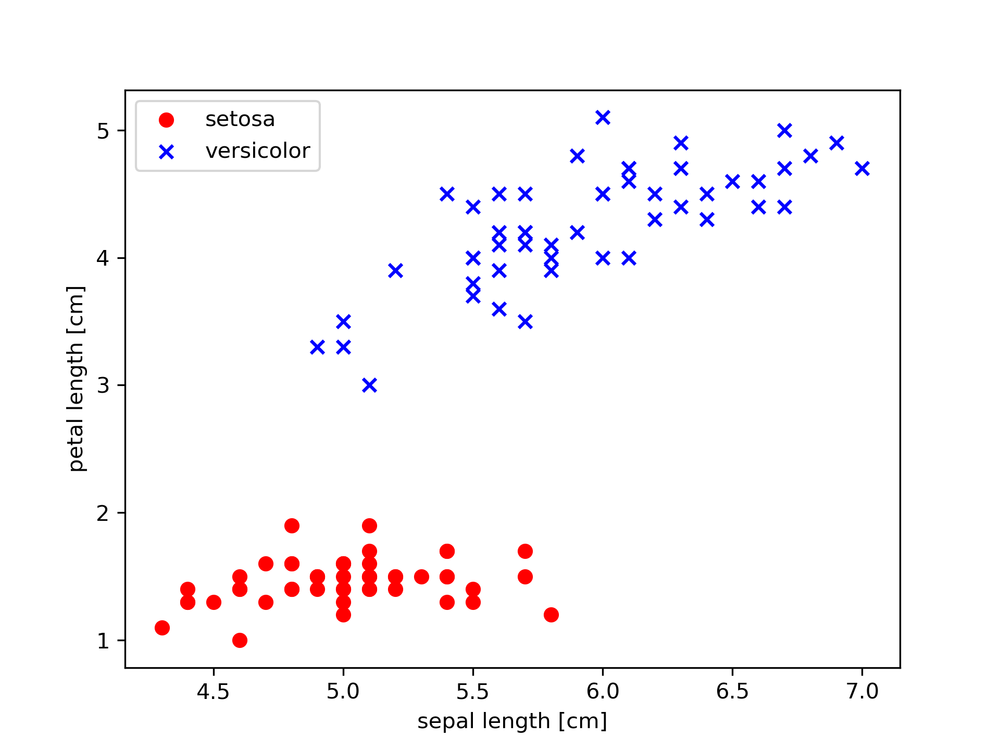

#+CAPTION: 感知器訓練過程
#+LABEL:fig:02_07
#+name: fig:02_07
#+ATTR_LATEX: :width 300
#+ATTR_ORG: :width 300
#+ATTR_HTML: :width 500
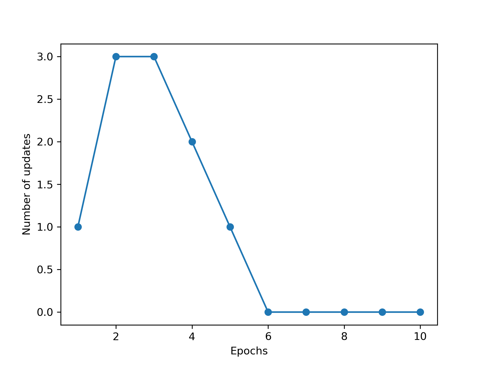

#+CAPTION: 訓練後的分類結果
#+LABEL:fig:02_08
#+name: fig:02_08
#+ATTR_LATEX: :width 300
#+ATTR_ORG: :width 300
#+ATTR_HTML: :width 500
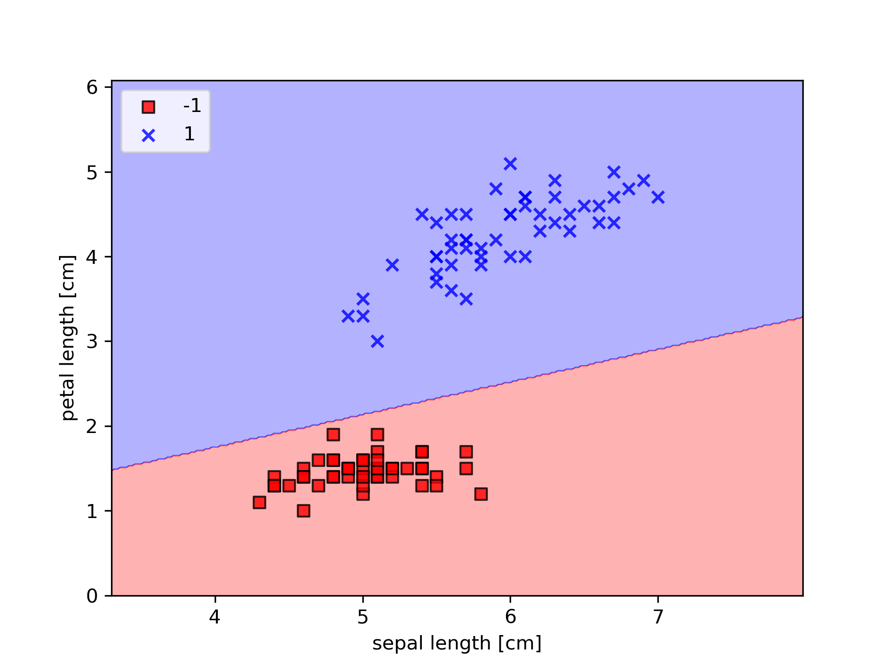

* 待用 :noexport:
#+CAPTION: MLP解決XOR Gate
#+LABEL:fig:xor-gate
#+name: fig:xor-gate
#+ATTR_LATEX: :width 300
#+ATTR_ORG: :width 300
#+ATTR_HTML: :width 500
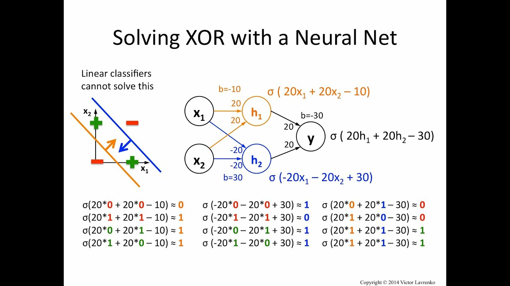

#+CAPTION: Linearly Separable
#+LABEL:fig:linearlySeparable
#+name: fig:linearlySeparable
#+ATTR_LATEX: :width 300
#+ATTR_ORG: :width 300
#+ATTR_HTML: :width 500
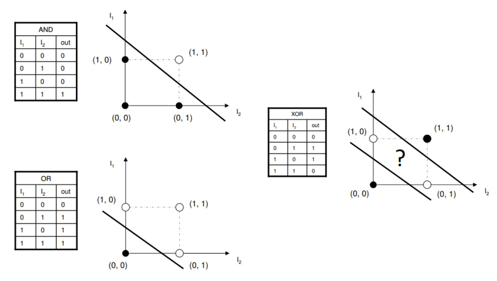

* Footnotes

[fn:4] [[https://kknews.cc/code/o8qaazo.html][機器學習：Python測試線性可分性的方法]]

[fn:5] [[https://s-top.github.io/blog/2018-04-19-svm][Support Vector Machine（全面推导）]]

