:PROPERTIES:
:ID:       d6daa102-05bb-475d-b619-db8b61e86030
:ROAM_ALIASES: Neural-Network
:END:
#+title: 神經網路
#+AUTHOR: 顏永進
# -*- org-export-babel-evaluate: nil -*-
#+INCLUDE: ../pdf.org
#+PROPERTY: header-args :python :python "/Users/letranger/Dropbox/notes/roam/venv/bin/python3" :eval never-export
#+TAGS: AI, Python
#+EXCLUDE_TAGS: noexport
#+OPTIONS: toc:2 ^:nil num:3
#+OPTIONS: H:4
#+LATEX:\newpage
#+HTML_HEAD: <link rel="stylesheet" type="text/css" href="../css/muse.css" />
#+HTML_HEAD_EXTRA: 
#+begin_export html

#+end_export

* 機器如何辨識圖像
:PROPERTIES:
:ID:       da15978e-768b-4d4e-ac51-5ff75446e642
:END:
#+CAPTION: 貓狗特徵如何區別
#+LABEL:fig:cat-dog-features
#+name: fig:cat-dog-features
#+ATTR_LATEX: :width 300
#+ATTR_ORG: :width 300
#+ATTR_HTML: :width 500

機器是如何能區分貓狗的圖片？現在這似乎是個十分尋常簡單的能力，就和電腦能計算加減乘除那樣。然而在機器學習成熟前，這卻是個十分困難的問題。在回答這個問題之前，我們先來看一個更簡單的圖形識別問題：讓電腦來讀入「／」及「＼」兩個圖像並進行識別。

** 「／」v.s.「＼」
首先要先理解，電腦眼中的圖像皆是由像素(pixel)組成，我們先假設「／」及「＼」兩個圖像在電腦眼中其實是如以下的矩陣所示：其中+1表示有像素存在，反之則以-1表示。
#+LABEL:fig:slash-pixel-matrix
#+name: fig:slash-pixel-matrix
#+ATTR_LATEX: :width 300
#+ATTR_ORG: :width 300
#+ATTR_HTML: :width 500
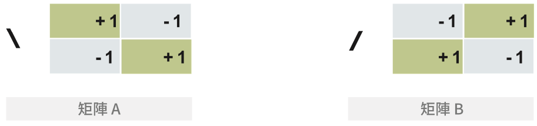

如同我們之前在[[id:20221023T101626.420918][監督式學習]]中的[[id:1592687a-cca7-4473-83a0-682a36394a28][分類]]和[[id:6ae7fb7a-0b38-4448-b19f-073d262513f2][迴歸]]所做的，我們希望能找到一個機制，將矩陣A、B當成輸入，最後希望能輸出0、1來代表「／」、「＼」，講白了，我們其實一直在做的事情都是找到一個這樣的函數：
 - 若輸入矩陣A，則函數傳回
   #+LABEL:fig:input-matrix-A
   #+name: fig:input-matrix-A
   #+ATTR_LATEX: :width 200
   #+ATTR_ORG: :width 200
   #+ATTR_HTML: :width 400
   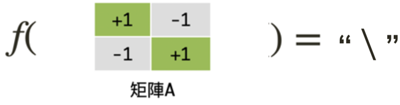
- 若輸入矩陣B，則函數傳回
  #+LABEL:fig:input-matrix-B
  #+name: fig:input-matrix-B
  #+ATTR_LATEX: :width 200
  #+ATTR_ORG: :width 200
  #+ATTR_HTML: :width 400
  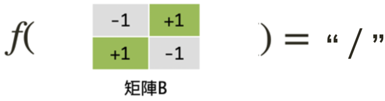

能做到這點，也許我們將來就能找出這種函數:
#+ATTR_LATEX: :width 200
#+ATTR_ORG: :width 200
#+ATTR_HTML: :width 400
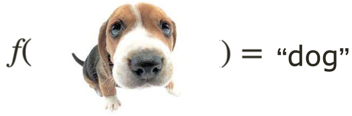

或是這種函數
#+ATTR_LATEX: :width 200
#+ATTR_ORG: :width 200
#+ATTR_HTML: :width 400
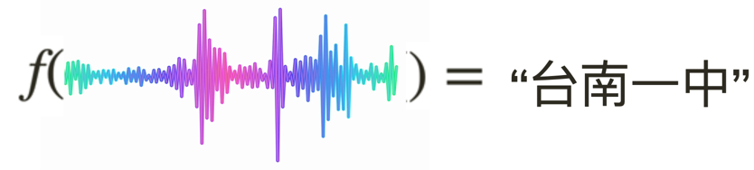

也就是語音辨識，甚至是找出這類函數：
#+ATTR_LATEX: :width 200
#+ATTR_ORG: :width 200
#+ATTR_HTML: :width 400
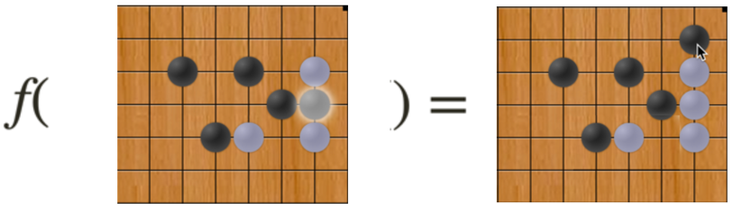

這雖然只是五子棋，但我們也向AlphaGo邁進一小步了。

** 將待解問題數學化
在繼續做夢之前，讓我們回到現實，怎麼找出這個函數：
#+CAPTION: 目標函數
#+LABEL:fig:target-function
#+name: fig:target-function
#+ATTR_LATEX: :width 200
#+ATTR_ORG: :width 200
#+ATTR_HTML: :width 400
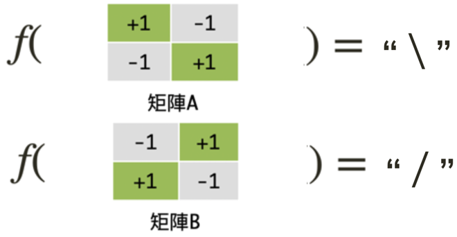

如何藉由數學運算來將上述兩個矩陣區分為「／」及「＼」兩個圖像？似乎把矩陣裡的數值進行相加或相乘都無法達到要求，因為兩個矩陣元素相加或相乘的結果都相同。顯然我們需要引入額外的變數來協助：加入另一個新的矩陣來與這兩個矩陣進行運算。
#+LABEL:fig:matrix-K-intro
#+name: fig:matrix-K-intro
#+ATTR_LATEX: :width 100
#+ATTR_ORG: :width 100
#+ATTR_HTML: :width 120
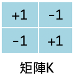

經由如下的矩陣計算，我們可以初步擬定一條分類規則：若是運算所得值大於0，則此圖像為＼；若是運算所得值小於0，則判定為／。
#+LABEL:fig:conv-classify-rule
#+name: fig:conv-classify-rule
#+ATTR_LATEX: :width 300
#+ATTR_ORG: :width 300
#+ATTR_HTML: :width 500
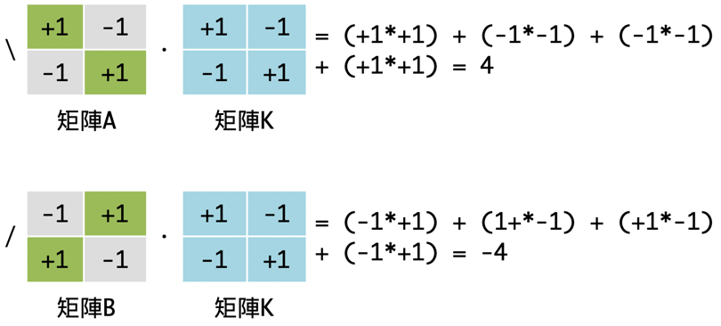

然而，若是電腦所讀入的「／」及「＼」兩符號書寫過於潦草，那麼我們的判斷是否仍然正確呢？假設所讀入的「＼」圖像在右上角的彎曲幅度過大，以致於佔去了三個像素（如下圖矩陣A）；而「／」圖像又因寫的太短，僅佔了左下角一個像素（如下圖矩陣B）。經由如下的計算結果，我們發現仍可將二者進行正確分類。此時，我們可以宣稱這個方法是強韌的(robust)。
#+LABEL:fig:robust-classify
#+name: fig:robust-classify
#+ATTR_LATEX: :width 300
#+ATTR_ORG: :width 300
#+ATTR_HTML: :width 500
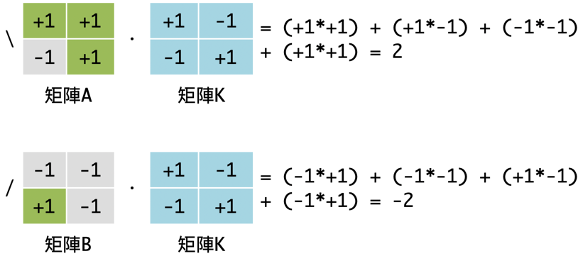

在上述範例中：
- 矩陣K對矩陣A、B所進行的運算即為卷積(convolution)，矩陣K在[[id:20221023T101414.457264][卷積神經網路]]中稱之為卷積核(convolution kernel)，其作用即在於萃取出資料特徵。藉此，我們達成了利用數學運算來擷取圖像特徵，也可以理解到為何深度學習能夠過濾資料雜訊而完成圖像識別。
- 計算得到結果後，我們私自擬定一條分類規則：若是運算所得值大於0，則此圖像為＼；若是運算所得值小於0，則判定為／。在神經網路中，這就是[[id:d3bcc30a-3d94-4a3c-8e66-baaac7325c75][激勵函數]]([[id:d3bcc30a-3d94-4a3c-8e66-baaac7325c75][Activation Function]])。

至此，你有沒有一種[[https://zh.wikipedia.org/zh-tw/%E6%97%A2%E8%A6%96%E6%84%9F][Déjà vu]]的感覺？沒錯，我們實作出了一個[[id:20221023T103538.640537][感知器]](如圖[[fig:perceptron-struct]])：
- 矩陣A就是感知器的輸入值
- 矩陣K裡的值就是感知器中的weight和bias
- 決定何時輸出"\"、何時輸出"\"的功能其實就是[[id:d3bcc30a-3d94-4a3c-8e66-baaac7325c75][激勵函數]]
#+CAPTION: 感知器基本結構
#+LABEL:fig:perceptron-struct
#+name: fig:perceptron-struct
#+ATTR_LATEX: :width 300
#+ATTR_ORG: :width 300
#+ATTR_HTML: :width 500
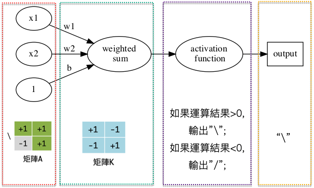

而[[id:20221023T103538.640537][感知器]]只是神經網路中的基本元素。

** [課堂作業]如何辨識「及」 :TNFSH:
:PROPERTIES:
:ID:       407bb0b4-adc6-4619-a08d-6c488eb9b308
:END:
思考一下，如果你想要區分「及」兩個符號(如右圖)，你要如何訂制你的卷積核？你的方法夠強韌嗎？
#+LABEL:fig:homework-recognize
#+name: fig:homework-recognize
#+ATTR_LATEX: :width 200
#+ATTR_ORG: :width 200
#+ATTR_HTML: :width 300
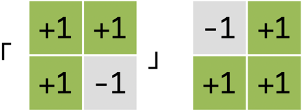

* 照片分類任務的兩個難題
** 缺乏可用特徵值
回顧[[id:20221023T101626.420918][監督式學習]]中的[[id:1592687a-cca7-4473-83a0-682a36394a28][分類]]任務中，我們為每張照片中的動物手動定義了不同的特徵，並賦予不同動物不同數值，最後利用這些特徵值來進行分類預測。
#+LABEL:fig:animal-features
#+name: fig:animal-features
#+ATTR_LATEX: :width 300
#+ATTR_ORG: :width 300
#+ATTR_HTML: :width 500
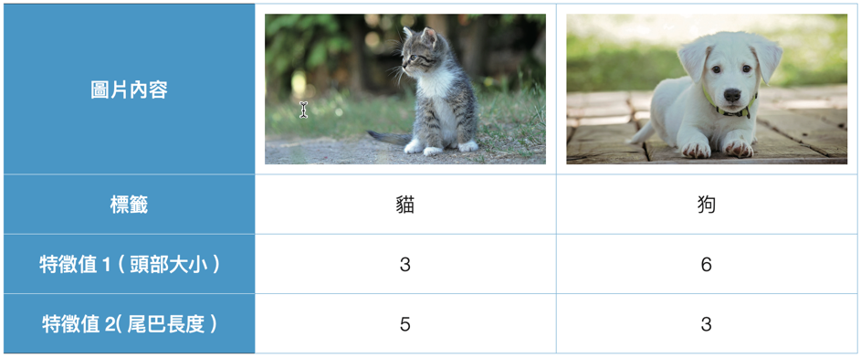

就連在[[file:20231204210821-分類.org::#IRIS-KNN][KNN分類器:IRIS]]的任務中，鳶尾花的資料集也是友善的自帶花萼和花瓣資料才來要求我們完成分類工作。
#+ATTR_LATEX: :width 200
#+ATTR_ORG: :width 200
#+ATTR_HTML: :width 300
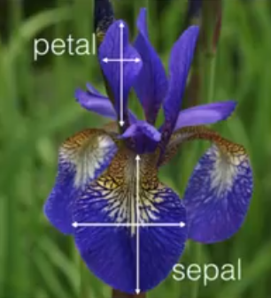

但是，如果我們要辨別的是全新的照片呢？難道我們要進行下圖這種分類時都要手動生成相對應的特徵？所以在輸入照片後還要再手動丈量所需特徵值(頭部及尾巴佔身體比例)？如果是，這種能力也太廢了點。
#+ATTR_LATEX: :width 200
#+ATTR_ORG: :width 200
#+ATTR_HTML: :width 400

至此我們發現了真正要實作照片辨識時的第一個問題：缺乏特徵值。

** 缺乏適當參數
在[[id:da15978e-768b-4d4e-ac51-5ff75446e642][機器如何辨識圖像]]一節中，我們想出了利用另一個新矩陣K來從兩張影像的矩陣抽取出特徵。
#+LABEL:fig:matrix-K-detail
#+name: fig:matrix-K-detail
#+ATTR_LATEX: :width 100
#+ATTR_ORG: :width 100
#+ATTR_HTML: :width 120

如果你有認真做完[[id:407bb0b4-adc6-4619-a08d-6c488eb9b308][課堂作業 - 如何辨識「及」]]，你大概會發現這個矩陣K並不是那麼好踹出來的，而且我們花了這麼多精力踹出一個矩陣也只能抽取出原圖的一個特徵，難道這就是機器學習的玩法？

* 類神經網路
:PROPERTIES:
:ID:       56483fdc-98a3-4606-884f-5165eb4be80d
:END:
** 概念
類神經網路的機制解決了前述兩大問題，方法是效法人類腦神經系統的運作。

在生物神經系統的結構中，神經元(Neuron)之間互相連結，由外部神經元接收信號，再逐層傳導至其他神經元，最後作出反應。
#+CAPTION: 神經元與神經網路
#+name: fig:Neuron-1
#+ATTR_LATEX: :width 300
#+ATTR_ORG: :width 300
#+ATTR_HTML: :width 500
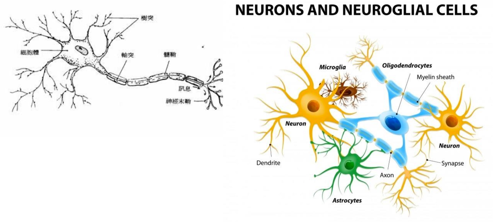

類神經網絡是一種機器學習機制，它模仿人類大腦的學習方法。人類的大腦從外界接受刺激，並處理這些輸入（通過神經元處理），最終產生輸出[fn:1]。當任務變得複雜的時候，大腦會使用多個神經元來形成一個複雜的網絡，並在神經元之間傳遞訊息，人工神經網絡就是模仿這種處理機制的一種算法。

圖[[fig:ThreeLayerNT]]為典型的三層類神經網路，輸入層(layer 0)有 2 個神經元，兩個隱藏層(layer 1, layer 2)各有3個(a1, a2, a3)及2個(b1, b2)神經元(灰色圓圈為bias)，輸出層(layer 3)則有兩個神經元。

#+BEGIN_SRC dot :file images/3LayerNetwork.png :cmdline -Kdot -Tpng
  digraph threeLayerNetwork{
  rankdir=LR
  splines=line
        nodesep=.05;
        node [label=""];
        subgraph cluster_0 {
                 color=white;
                 node [style=solid,color=blue4, shape=circle];
                 x3[label = x1];
                 x1[label = x2];
                 node [style=filled,color=gray, shape=circle];
                 x2[label = 1];
                 label = "layer 0";
        }
        subgraph cluster_1 {
                 color=white;
                 node [style=filled,color=gray, shape=circle];
                 a12[label = 1];
                 node [style=solid,color=red2, shape=circle];
                 a22[label = a2];
                 a32[label = a3];
                 a42[label = a1];
                 label = "layer 1";
        }
        subgraph cluster_2 {
                 color=white;
                 node [style=solid,color=red2, shape=circle];
                 a13[label = b2];
                 a23[label = b1];
                 node [style=filled,color=gray, shape=circle];
                 a33[label = 1];
                 label = "layer 2";
        }
        subgraph cluster_3 {
                 color=white;
                 node [style=solid,color=seagreen2, shape=circle];
                 O1[label = y1];
                 O2[label = y2];
                 label="layer 3";
        }

        x1 -> a22;
        x1 -> a32;
        x1 -> a42;

        x2 -> a22;
        x2 -> a32;
        x2 -> a42;

        x3 -> a22;
        x3 -> a32;
        x3 -> a42;

        a12 -> a13;
        a22 -> a13;
        a32 -> a13;
        a42 -> a13;

        a12 -> a23;
        a22 -> a23;
        a32 -> a23;
        a42 -> a23;

        a13 -> O1
        a23 -> O1
        a33 -> O1

        a13 -> O2
        a23 -> O2
        a33 -> O2

  }
#+END_SRC
#+CAPTION: 三層神經網路
#+name: fig:ThreeLayerNT
#+ATTR_LATEX: :width 300
#+ATTR_ORG: :width 300
#+ATTR_HTML: :width 400
#+RESULTS:
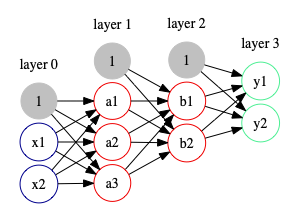

神經網絡的基礎模型是[[id:20221023T103538.640537][感知器]](perceptron)，因此神經網絡也可以叫做多層感知器(Multi-layer Perceptron)，簡稱MLP[fn:2]。

我們可以把圖[[fig:ThreeLayerNT]]中的每個神經元都視為一個抽象的[[id:20221023T103538.640537][感知器]]實作，如圖[[fig:Perceptron]]，每個神經元都自前方取得輸入資料，經過一番計算後，再將輸出結果傳給後方的神經元，當成後方神經元的輸入。這種訊息在神經網路中傳遞的方式稱為前向傳播(forward propagation)，而實際神經網路中各層的神經元的訊息傳遞則是透過矩陣相乘來進行。

#+CAPTION: 神經元/感知器
#+name: fig:Perceptron
#+ATTR_LATEX: :width 200
#+ATTR_ORG: :width 200
#+ATTR_HTML: :width 400
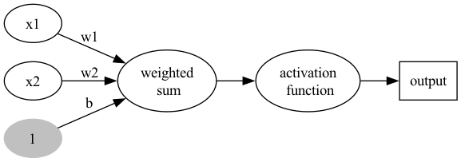

- [[https://www.youtube.com/watch?v=6MmGNZsA5nI&t=4s][前向傳播]]

** 解決第一個問題
如前所述，一個[[id:20221023T103538.640537][感知器]]可以抽取出一份輸入資料的特徵值，那麼，再看一下圖[[fig:ThreeLayerNT]]中的forward propagation
- 第0層(layer 0)裡的兩個神經元(x1, x2)在取得原始資料後，就能抽取出其中的兩項特徵值，而這兩項特徵值就當成(layer 2)的輸入來源
- 第1層(layer 1)裡的三個神經元(a1, a2, a3)則可抽取出來源資料的三項特徵值(可視為更高階或更抽象的特徵)，而這三項特徵值再當成layer 2的輸入
- 第2層(layer 2)裡面的兩個神經元(b1, b2)繼續抽取出更抽象的兩項特徵值經過計算送往layer 3
- 第3層(layer 3)在收到layer 2傳來的結果後，經過內部運算並輸出預測結果。

#+CAPTION: Forward propagation
#+LABEL:fig:ForwardPropagation
#+name: fig:ForwardPropagation
#+ATTR_LATEX: :width 200
#+ATTR_ORG: :width 200
#+ATTR_HTML: :width 400
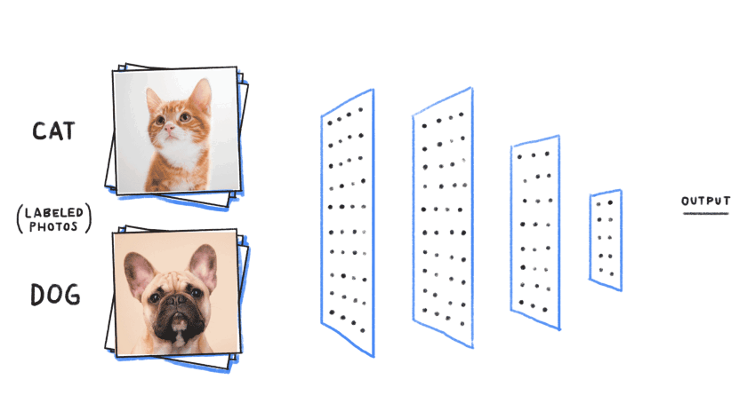

藉由這樣的設計，在進行照片分類時，如果我們在每一層都塞入512個神經元，那光是透過第一層就能由每張照片中抽取出512種不同特徵值了，如此就解決了我們面臨的第一個問題：缺乏可用特徵值。

** 解決第二個問題
然而如果事情有這麼簡單，機器學習也不至於在1970年代邁入寒冬。還記得[[id:407bb0b4-adc6-4619-a08d-6c488eb9b308][課堂作業 - 如何辨識「及」]]吧，裡面只有一個要處理的矩陣K，一共只有4個要踹出來的數值，想像一下有512個神經元，裡面有512個矩陣K，每個矩陣也不用太大，只要3\times3就好(9個參數)，那光第一層我們就要處理多少參數呢...顯然，要踹出合適的所有參數值不是人力所能及的工作。

神經網路解決這個問題的方式非常的率性且不負責任：隨機!!
#+ATTR_LATEX: :width 100
#+ATTR_ORG: :width 100
#+ATTR_HTML: :width 100

是的，就如同考試時你面對陌生選擇題的反應，神經網路也決定這麼幹，隨便丟一些數值填到矩陣中當成第一批參數。事實上，同樣的策略我們在[[id:7cd4a142-4cd9-46b6-b9a4-2ad750ae622f][線性迴歸:年齡身高預測/隨機的力量]]裡已經玩過了，當初在找出方程式的最佳參數組合時，我們也是閉上眼睛隨便選一組。不管整個網路中有多少參數，當我們隨機設定好了所有參數的最初值後，整個神經網就可以運作了，嗯...至少已經可以依照前向傳播的流程輸出第一個預測結果了，你看，我們已經朝完美的人工智慧跨近一大步了-_-
#+ATTR_LATEX: :width 300
#+ATTR_ORG: :width 300
#+ATTR_HTML: :width 400
[[file:images/類神經網路/2024-02-18_10-23-40_2024-02-18_10-20-52.png]]

接下來的流程其實和[[id:6ae7fb7a-0b38-4448-b19f-073d262513f2][迴歸]]有點類似，我們評估預測結果的品質，然後回頭修正參數，只是這次的工程有點浩大，我們要修正所有的參數，這個回頭修正所有參數的過程稱為反向傳播(backward propagation)。

#+CAPTION: Back Propagation
#+LABEL:fig:BackPropagation
#+name: fig:BackPropagation
#+ATTR_LATEX: :width 200
#+ATTR_ORG: :width 200
#+ATTR_HTML: :width 400
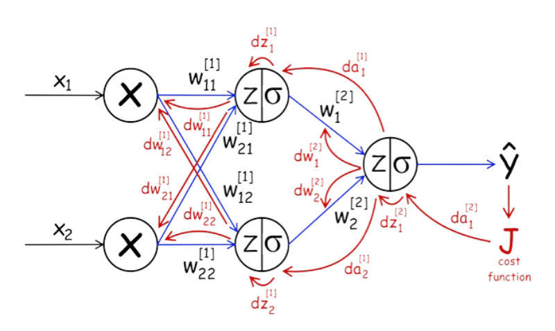

第一次以隨機設定的參數跑出來的結果肯定是慘不忍睹的，因為它的原則就是「有就好」，就好像某些政黨在成立之初找不到信徒，所以什麼殺人犯或貪污犯，只要你肯入黨就照單全收，因為只要親近黨主席，這些人最終都會變成好人。

好吧，扯遠了，反正神經網路的第一輪預測品質基本上就是瞎猜，不過沒關係，就像我們在[[id:6ae7fb7a-0b38-4448-b19f-073d262513f2][迴歸]]裡做的事一樣，我們每次都會評估預測品質，在這裡我們用損失函數(loss function, 也就是圖[[fig:BackPropagation]]裡的cost function, J)來評估預測品質，當評估結果未達標準，我們就回頭修正參數。在[[id:6ae7fb7a-0b38-4448-b19f-073d262513f2][迴歸]]這一章[[id:e02d602e-c9a4-4a8b-8e5b-336dcac6cc63][保持距離以測安全]]裡的例子裡，我們只要修正一個參數($\hat{y} = w * x$ 裡的$w$)，用的方法是找出參數的切線斜率，決定修正方向。二者的最終目標其實是一樣的：讓預測誤差達到最小化。
#+CAPTION: 決定w應往哪個方向移動
#+name: fig:carLoss2
#+ATTR_LATEX: :width 400
#+ATTR_ORG: :width 400
#+ATTR_HTML: :width 500
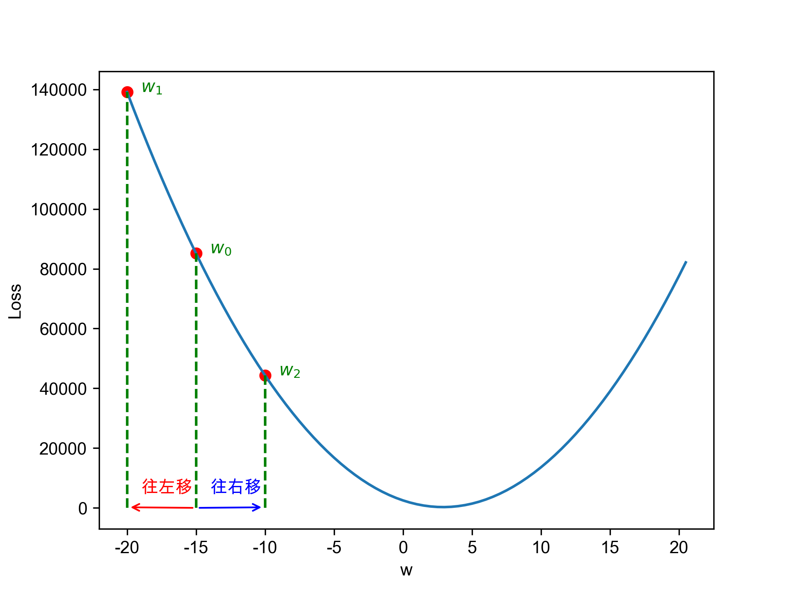

面對動輒成千上萬的參數，神經網路採用「隨機梯度下降法（Stochastic Gradient Descent，SGD）」來找出各個參數的梯度(我們可以先把它當成前例中的切線斜率)，然後沿著梯度方向修正各個參數，從最後一層反向修正回到第一層(就是反向傳播在做的事)，於是我們就有了第二個版本的參數值了(第一個版本就是隨機指定的)。

然後呢?就再從頭玩一次啊：以一批原始資料(圖片)當成輸入再跑一次正向傳播，得到預測、評估預測品質、再反向傳播回去修正所有參數，得到第三個版本的參數值...，只要你時間夠多，你可以一直玩下去，這就是神經網路學習的奧義了...

什麼？你問「隨機梯度下降法」原理？這個等我學完偏微分以後再解釋給你聽....QQ

** 神經網路如何學習(正經版)
*** 基本步驟
利用隨機梯度下降法(SGD)求梯度並更新 weight 和 bias 參數
1. 從訓練資料中隨機選擇一部分資料
2. 利用前向傳播，求出預測的輸出值，以損失函數(loss Function)計算預測值與真實答案(label)的誤差，再利用用反向傳播方法，求各參數的梯度。
3. 將所有權重參數沿其各自的梯度方向進行微小更新
4. 重複以上步驟(epoch=100, 500, 1000, ...)直到誤差最小化
   (http://www.feiguyunai.com/index.php/2019/03/31/python-ml-24th-backp/)
*** 誤差函數（Error / Loss Function）
神經網路需要一把「尺」來衡量預測結果有多離譜，這把尺就是誤差函數（又稱損失函數 loss function）。誤差的基本概念很直覺：

#+begin_quote
誤差 = 真實答案(\(y\)) - 模型預測值(\(\hat{y}\))
#+end_quote

但我們通常不會直接用「相減」來衡量，因為正負誤差會互相抵消。實務上會根據問題類型選用不同的損失函數：

- *迴歸問題*（預測連續數值，如房價、成績）：使用均方誤差（MSE）
  - $E=\frac{1}{2}\sum\limits^{n}_{i=1}(y_i - \hat{y}_i)^2$
  - 白話：把每筆資料的誤差平方後加總，這樣正負誤差就不會抵消了
- *分類問題*（預測類別，如辨識數字 0~9）：使用交叉熵（Cross Entropy）
  - $E=-\sum\limits_{i=1}^{n}\hat{y}_i*\log{y_i}$
  - 白話：當模型對的答案很有信心時，誤差很小；反之，信心滿滿卻猜錯時，誤差會爆炸性的大——就像老師改考卷時，如果學生自信滿滿的寫錯答案，扣分會特別狠
*** 學習步驟
#+CAPTION: 簡化版神經元
#+LABEL:fig:ANN-1
#+name: fig:ANN-1
#+ATTR_LATEX: :width 300
#+ATTR_HTML: :width 500
#+ATTR_ORG: :width 300
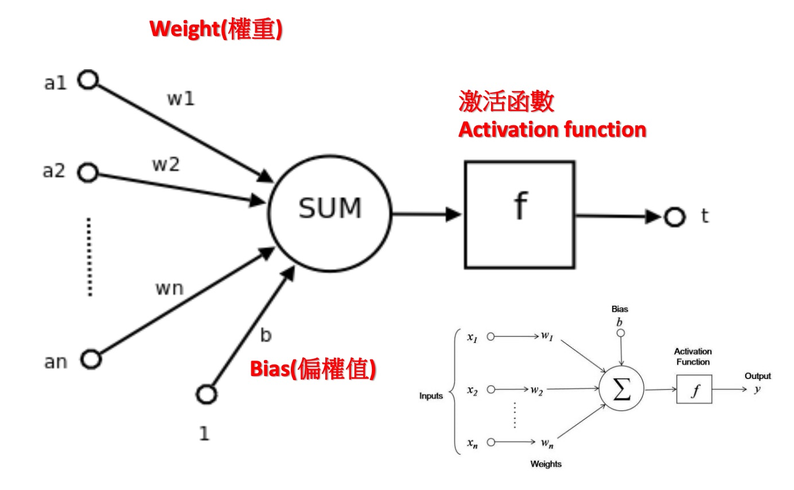

以上面這個簡化版的神經元為例：
1. 隨機指定weight與bias的值。
2. 計算出模型結果值
3. 計算出誤差：即計算結果與真實值之差異
   #+CAPTION: 類神經網路
   #+LABEL:fig:ANN-4
   #+name: fig:ANN-4
   #+ATTR_LATEX: :width 300
   #+ATTR_HTML: :width 500
   #+ATTR_ORG: :width 300
   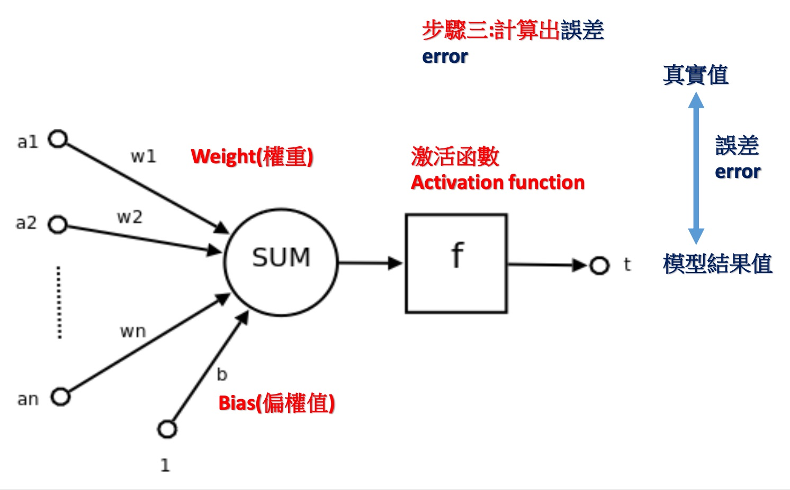
4. 定義 weight 與 bias 的更新策略(update the weights and bias)，其更新策略為從錯誤中學習。學習規則為
   - $\Delta w=\eta X^T (\hat{y} - y)$: $w$(新的)=$w$(前一回)+$\Delta w$(誤差變動)
   - $\Delta b=\eta (\hat{y} - y)$: $b$(新的)=$b$(前一回)+$\Delta b$(誤差變動)
   - $\eta$ = 學習率
5. 使用新的 weight 與 bias，計算直到誤差很小(定義何時結束)
   #+CAPTION: 類神經網路
   #+LABEL:fig:ANN-5
   #+name: fig:ANN-5
   #+ATTR_LATEX: :width 300
   #+ATTR_ORG: :width 400
   #+ATTR_HTML: :width 500
   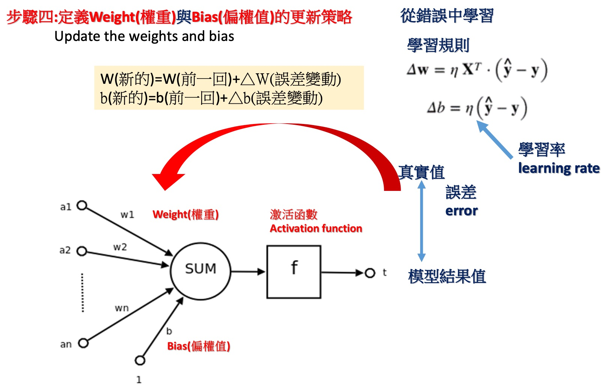

** 神經網路的輸出層
神經網路可以用來解決分類問題與迴歸問題，端視輸出層所使用的活化函數，解決迴歸問題時使用恆等函數，而分類問題則使用 /softmax 函數/ 。恆等函數對於輸入的內容完全不做任何處理，直接輸出，其神經網路的結構如圖[[fig:ID-Network]]所示。
#+BEGIN_SRC dot :file images/identity-network.png :cmdline -Kdot -Tpng
  digraph IDNT{
    rankdir=LR;
    a3 -> y3[label = "delta()"];
    a2 -> y2[label = "delta()"];
    a1 -> y1[label = "delta()"];
  }
#+END_SRC
#+CAPTION: 恆等函數神經網路圖
#+LABEL:fig:ID-Network
#+name: fig:ID-Network
#+ATTR_LATEX: :width 200
#+ATTR_ORG: :width 300
#+ATTR_HTML: :width 300
#+RESULTS:
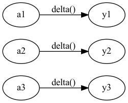

而分類問題使用的 softmax 函數則如公式[[eqn:softmaxEQ]]所示，\(exp(x)\)為代表\(e^x\)的指標函數，輸出層有 n 個節點，而每個節點收到的訊息\(y_k\)來自前一層以箭頭連接的所有訊號輸入，由公式[[eqn:softmaxEQ]]的分母也可以看出，輸出的各個神經元會依以「依各節點訊號量比例」的模式影響下一層的輸入。

#+NAME: eqn:softmaxEQ
\begin{equation}
y_k = \frac{exp(a_k)}{\sum\limits_{i=1}^{n}exp(a_i)}
\end{equation}

#+BEGIN_SRC dot :file ./softmax-network.png :cmdline -Kdot -Tpng
  digraph SMNT{
    rankdir=LR;
    nodesep=.05;
    graph[ranksep="3"]
    a2 -> y1[label = "softmax()"];
    a2 -> y3[label = "softmax()"];
    a2 -> y2[label = "softmax()"];
    a1 -> y1[label = "softmax()"];
    a1 -> y2[label = "softmax()"];
    a1 -> y3[label = "softmax()"];
    a3 -> y1[label = "softmax()"];
    a3 -> y2[label = "softmax()"];
    a3 -> y3[label = "softmax()"];
  }
#+END_SRC
#+CAPTION: softmax 函數神經網路圖
#+LABEL:fig:SM-Network
#+name: fig:SM-Network
#+ATTR_LATEX: :width 300
#+ATTR_ORG: :width 300
#+ATTR_HTML: :width 400
#+RESULTS[e3ebde6d480b9ed778ad70f1b20abfa0e10d9c6a]:
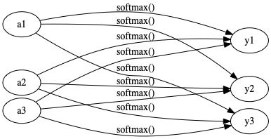

至於 softmax 的 python 實作則如下程式碼所示，為了避免因矩陣 a 的值過大而導致指數函數運算出現溢位，程式碼第[[(softmax-overflow1)]]行的內容也可以改由第[[(softmax-overflow2)]]行替代。
#+BEGIN_SRC python -n -r :results output :exports both
# softmax 函數：把一堆數字變成「機率」，全部加起來剛好等於 1
import numpy as np                          # 匯入 numpy，數學運算的瑞士刀
def softmax(a):
    exp_a = np.exp(a)                          # 對每個元素取 e 的次方 (ref:softmax-overflow1)
    #exp_a = np.exp(a - np.max(a))             # 防溢位版本：先減最大值 (ref:softmax-overflow2)
    sum_exp_a = np.sum(exp_a)               # 把所有 e 的次方加起來，當分母
    y = exp_a / sum_exp_a                   # 每個值除以總和 → 變成機率（0~1 之間）
    return(y)
a = np.array([0.3, 2.9, 4.0])              # 隨便給三個數字當輸入測試
print(softmax(a))                           # 印出結果：三個機率值，加起來 = 1
#+END_SRC
#+RESULTS[9b5650732ffe10ce57211c01e6a3b218dc3f4922]:
: [0.01821127 0.24519181 0.73659691]

*** softmax 函數的特色
softmax 的輸出為介於 0 到 1 間的實數，此外，其輸出總和為 1，這個性質使得 softmax 函數的輸出也可解釋為「機率」。例如，前節程式碼的輸出結果為[0.01821127 0.24519181 0.73659691]，從以機率的角度我們可以說：分類的結果有 1.8%的機率為第 0 類；有 24.52%的機率為第 1 類；有 73.66%的機率為第 2 類。換言之，使用 softmax 函數可以針對問題提出對應的機率。

softmax 函數的另一個特色是其輸出結果仍保持與輸入訊息一致的大小關係，這是因為指數函數\(y=exp(x)\)為單調遞增函數。一般而言，神經網路會把輸出最大神經元的類別當作辨識結果，然而，因為 softmax 不影響大小順序，所以一般會省略 softmax 函數。

輸出層的節點數量取決於要解決的問題，例如，如果要解決的問題為「判斷一個手寫數字的結果」，則輸出層會有 10 個節點(分別代表 0~9)，而輸出訊息最大的結點則為最有可能的答案類別。

* 深度神經網路(DNN)
深度神經網路(Deep Neural Network, DNN)，顧名思義就是有很多層的神經網路。然而，幾層才算是多呢？一般來說有1-2個隱藏層的神經網絡就可以叫做多層，準確的說是(淺層)神經網絡(Shallow Neural Networks)。隨著隱藏層的增多，更深的神經網絡(一般來說超過3層)就都叫做深度神經網路[fn:2]。而那些以深度神經網路為模型的機器學習就是我們耳熟能詳的[[id:20221023T101228.247381][深度學習]]。

** 學習與參數:以迴歸問題為例
想像一個國中的數學問題：在平面上畫出\(y=2x+3\)的直線，如圖[[fig:findUnknownfx]]左的直線(\(y=ax+b\))，決定這條直線的因素有二：斜率\(a\)與截距\(b\)，這兩項因素即可視為該直線的參數，像這種由已知參數去畫出對映直線的問題稱之為順向問題；反之，如果目前只知道平面上有幾個點，希望能畫出最符合的這些點的線，這種問題就稱為逆向問題。像圖[[fig:findUnknownfx]]右圖的紅線明顯就不是一條最符合的線，而解決這個問題就變成透過「尋找最佳參數」來畫出最理想的迴歸線，神經網路便是希望能藉由網路模型的不斷學習來找出最佳參數。
#+BEGIN_SRC python -n -r :results output :exports both
import numpy as np                          # 匯入 numpy，處理數值陣列的好幫手
import matplotlib.pylab as plt              # 匯入 matplotlib，Python 的畫圖神器

def f(x):                                   # 定義一個已知函數 y = 3x + 2
    return 3*x+2

x = np.arange(-5.0, 5.0, 0.1)              # 產生 -5 到 5 之間、間隔 0.1 的一堆 x 值
y = f(x)                                    # 把所有 x 丟進函數算出對應的 y
plt.figure(figsize=(10, 5))                 # 建立一張寬 10 高 5 的圖
plt.subplot(1, 2, 1) ## 左圖：已知函數 y=3x+2  # 1 列 2 欄的第 1 張子圖
plt.plot(x, y)                              # 畫出 y = 3x + 2 這條直線
plt.ylim(-30, 30)                           # y 軸範圍設定在 -30 到 30
plt.axvline(0, color='k', linestyle='--')   # 畫 y 軸（垂直虛線）
plt.axhline(0, color='k', linestyle='--')   # 畫 x 軸（水平虛線）
plt.xlabel('x')                             # x 軸標籤
plt.ylabel('y')                             # y 軸標籤
plt.title('順向問題: y = 3x + 2')           # 順向問題：已知公式，畫出圖形
plt.subplot(1, 2, 2) ## 右圖：已知點，求未知函數  # 1 列 2 欄的第 2 張子圖
plt.axvline(0, color='k', linestyle='--')   # 畫 y 軸
plt.axhline(0, color='k', linestyle='--')   # 畫 x 軸
plt.ylim(-30, 30)                           # y 軸範圍
plt.plot(2, 8, "o")                         # 在 (2, 8) 畫一個點
plt.plot(-2, -7, "o")                       # 在 (-2, -7) 畫一個點
plt.plot(4, 25, "o")                        # 在 (4, 25) 畫一個點
plt.plot(-4, -24, "o")                      # 在 (-4, -24) 畫一個點

def f1(x):                                  # 定義一條「猜的線」y = 12x + 29
    return 12*x+29                          # （這條猜得很離譜，故意的）

y1 = f1(x)                                 # 用猜的函數算出 y 值
plt.plot(x, y1, color='r')                 # 用紅色畫出這條「瞎猜的線」
plt.xlabel('x')                             # x 軸標籤
plt.ylabel('y')                             # y 軸標籤
plt.title('逆向問題: 找最佳直線')           # 逆向問題：已知幾個點，找出最適合的直線
plt.tight_layout()                          # 自動調整子圖間距，避免文字重疊
plt.savefig("images/simplefx-1.png")        # 把圖存成檔案
print("圖片已儲存")                         # 告訴你圖片存好了
#+END_SRC
#+CAPTION: 由已知函數畫出直線與由已知點找未知函數
#+LABEL:fig:findUnknownfx
#+name: fig:findUnknownfx
#+ATTR_LATEX: :width 400
#+ATTR_ORG: :width 300
#+ATTR_HTML: :width 500
#+RESULTS:
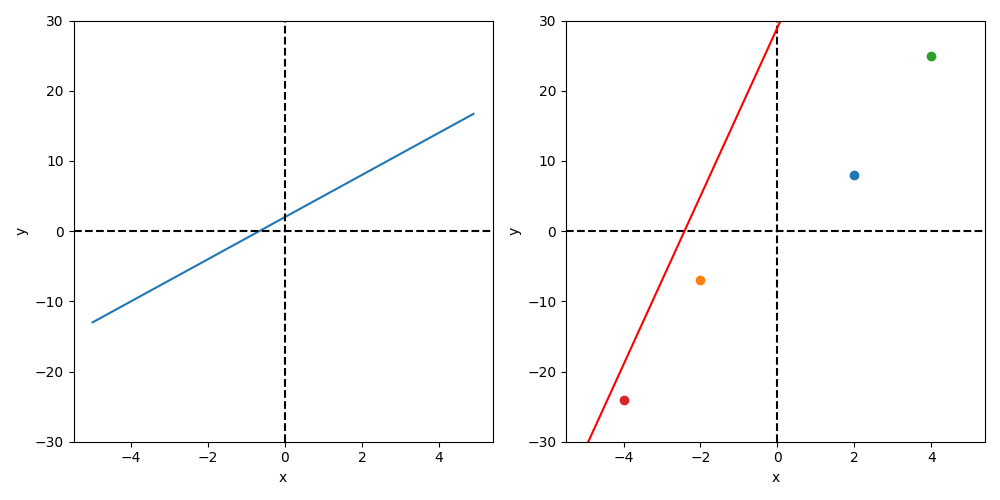

同理，如果我們將解題目標改變為「預測學生學測總級分」，那麼，我們得先了解有那些因素會影響學生的學測成績，初步估計也許包括以下因素：
1. 上課狀況
1. 是否認真寫作業
1. 歷次段考成績
1. 校內模考成績
1. 回家後是否努力讀書
1. 是否沉迷網路遊戲或手機遊戲
1. 是否有男/女朋友

此時，我們的預測模型就如圖[[fig:exam-Network1]]所示
#+BEGIN_SRC dot :file ./exam-network1.png :cmdline -Kdot -Tpng
  digraph exam{
    rankdir=LR;
    nodesep=.05;
    graph[ranksep="3"]
    上課狀況        -> 學測成績
    是否認真寫作業       -> 學測成績
    歷次段考成績        -> 學測成績
    校內模考成績        -> 學測成績
    放學後是否努力讀書     -> 學測成績
    是否沉迷網路遊戲或手機遊戲 -> 學測成績
    是否花太多時間交異性朋友  -> 學測成績
  }
#+END_SRC

#+CAPTION: 學測成績預測模型#1
#+LABEL:fig:exam-Network1
#+name: fig:exam-Network1
#+ATTR_LATEX: :width 300
#+ATTR_ORG: :width 300
#+ATTR_HTML: :width 500
[[file:images/exam-Network1.png]]

然而，上述因素只是一般性的文字描述，畢竟過於模糊而無法對之進行精確計算，所以，我們有必要再對其進行更精確的描述，此處的參數（即影響因素及相對權重）又稱為特徵值。此外，每個因素影響學測結果的程度理應會有所差異，因此也有必要對各因素賦予「加權」（也稱為權重），詳細考慮後的因素及加權列表如下。
#+CAPTION: 學測預測模型因素列表
|----+----------+----------------------------+------------------------------------+---------|
| no | 因素編號 | 模糊描述                   | 精確描述                           | 權重    |
|----+----------+----------------------------+------------------------------------+---------|
|  1 | \(x_1\)  | 上課狀況                   | 平均每次上課時認真聽講的時間百分比 | \(w_1\) |
|  2 | \(x_2\)  | 是否認真寫作業             | 作業平均成績                       | \(w_2\) |
|  3 | \(x_3\)  | 歷次段考成績               | 各科段考平均成績                   | \(w_3\) |
|  4 | \(x_4\)  | 校內模考成績               | 歷次模考平均成績                   | \(w_4\) |
|  5 | \(x_5\)  | 放學後是否努力讀書         | 放學後花在課業上的時間             | \(w_5\) |
|  6 | \(x_6\)  | 是否沉迷網路遊戲或手機遊戲 | 每天平均花在遊戲的時間             | \(w_6\) |
|  7 | \(x_7\)  | 是否花太多時間交異性朋友   | 有/無男女朋友                      | \(w_7\) |
|----+----------+----------------------------+------------------------------------+---------|

此時，我們的預測模型就如圖[[fig:exam-Network2]]所示，換言之，是在解一個\(f(x)=x_1*w_1+x_2*w_2+x_3*w_3+...+x_7*w_7\)的函式問題。我們可以先針對這些特徵值對學生進行問卷調查，並追踪學生的學測成績，最後將取得的大量的特徵值輸入到到我們的函數模型（圖[[fig:exam-Network2]]）中，觀察計算結果與實際資料的吻合程度，藉由不斷的調整參數（權重）來控制函數，讓輸出的計算結果與實際答案完全吻合，以便求得最準確的函數。
#+BEGIN_SRC dot :file images/exam-network2.png :cmdline -Kdot -Tpng
  digraph exam2{
    rankdir=LR;
    nodesep=.05;
    graph[ranksep="3"]
    x1:上課認真聽講時間百分比 -> 學測成績[label = "w1"];
    x2:作業平均成績           -> 學測成績[label = "w2"];
    x3:各科段考平均成績       -> 學測成績[label = "w3"];
    x4:歷次模考平均成績       -> 學測成績[label = "w4"];
    x5:放學後讀書的時間       -> 學測成績[label = "w5"];
    x6:每天花在遊戲的時間     -> 學測成績[label = "w6"];
    x7:有無男女朋友          -> 學測成績[label = "w7"];
  }
#+END_SRC
#+CAPTION: 學測成績預測模型#2
#+LABEL:fig:exam-Network2
#+name: fig:exam-Network2
#+ATTR_LATEX: :width 300
#+ATTR_ORG: :width 300
#+ATTR_HTML: :width 500
#+RESULTS:
[[file:images/exam-network2p.png]]

然而，無論我們事前研究分析調查的再如何嚴謹，實際的計算結果與真實分數總會存在誤差，如表[[tbl-diffBtDM]]，分別觀察這些誤差值並不容易看出吻合程度，但如果將個別的誤差平方後加總，則可以得到一個明確的誤差函數=\(3^2+(-3)^2+(-2)^2+(-2)^2...\)，至此，解題的任務便轉為：找出能讓誤差函數最小化的一組參數。
#+NAME: tbl-diffBtDM
#+LABEL:tbl-diffBtDM
#+CAPTION: 誤差的計算
|------+--------+--------+--------+--------+-----|
|      | 學生 A | 學生 B | 學生 C | 學生 D | ... |
| <c>  |  <c>   |  <c>   |  <c>   |  <c>   | <c> |
|------+--------+--------+--------+--------+-----|
| 資料 |   70   |   65   |   68   |   50   | ... |
| 模型 |   67   |   68   |   70   |   52   | ... |
|------+--------+--------+--------+--------+-----|
| 誤差 |   3    |   -3   |   -2   |   -2   | ... |
|------+--------+--------+--------+--------+-----|

** 如何調整參數
前節提及，為了能找到最理想的預測函數，我們可以不斷調整權重來把誤差函數降到最低。實務上，我們可以每次以最細微的調幅逐一調整（增加或減少）權重值來試圖減小損失函數，直到其無法再減少為止，此種方式稱為「坡度法」，而這種每次稍微調整一點點再觀察結果變化的手段稱為微分；若是同時微幅調整所有權重以將損失函數降到最低，這種方式則稱為「梯度下降法」。然而類似梯度法並不保證能找到將損失函數降到最小的權重組合，如圖[[fig:dotAB]]所示，以梯度法可能只會找到 A 點這個局部最小值，然而全體的最小值其實發生在 B 點。
#+CAPTION: 極小值與最小值的差異
#+name: fig:dotAB
#+ATTR_LATEX: :width 300
#+ATTR_ORG: :width 300
#+ATTR_HTML: :width 500
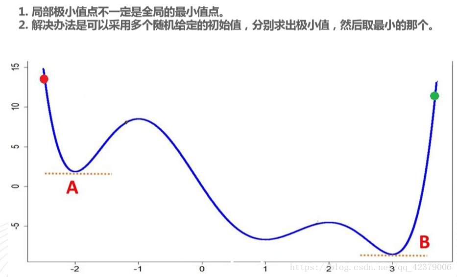

** 模型的極限
在我們透過問卷取得大量的資料後，想像一下我們以這些資料來做為調整模型參數的依據，最後，我們如何評估這個模型的效能呢？一般來說，我們會把資料分成兩部份：
1. 訓練資料: 用來給模型(神經網路)調整或學習參數
2. 測試資料: 用來給模型(神經網路)測試或檢驗模型的效能。

之所以用不同的資料進行訓練與測試，是為了避免「過擬合」的狀況，即，因為測試資料與訓練資料一致，導致測試結果十分完美，然而，一旦把模型拿來應用到新的資料上（或是實際應用模型到真實世界中）時，反而效果會不如預期。

過擬合就好比學生在學習時只死記課本的習題，對於其他題型完全不予理會，如果考試也考課本的習題，考試成績自然優異，然而如果考試時題型略做變化，則考試結果就可能十分悲慘。

實際進行測試時，可以將資料分成數組，將其中一組當成測試資料。例如，分為A、B、C、D 4組，然後輪流拿這4組資料中的一組做為測試資料進行 4 次相同的測試，目的在於提升模型的「泛化能力」，也就是減少其過擬合的可能性。

** 神經網路為什麼要有那麼多層
前節提及，我們的預測模型就如圖[[fig:exam-Network2]]所示，換言之，是在解一個\(f(x)=x_1*w_1+x_2*w_2+x_3*w_3+...+x_7*w_7\)的函式問題，那麼，為了能找到最理想的預測函數，可否把函數變的更加複雜，例如，將函數變為二次函數或更複雜的函數以提升預測的精準度？實則，這種社會科學的問題並不如自然科學的物理現象可以用明確的公式來解決，神經網路採用的是以組合的方式來將函數複雜化，例如，把圖[[fig:exam-Network2]]變為下圖的樣式，如此藉由改變各因素以及權值的組合，等於建立了許多新的特徵值，也增加了模型的複雜度。

#+BEGIN_SRC dot :file images/exam-Network3.png :cmdline -Kdot -Tpng
digraph exam3 {
    rankdir=LR;
    nodesep=.05;
    graph[ranksep="3"]
    x4[label = "..."];
    x1[label = "上課認真聽講時間百分比"];
    x2[label = "作業平均成績"];
    x3[label = "各科段考平均成績"];
    o1[label = "新的特徵值之2"];
    o2[label = "新的特徵值之3"];
    o4[label = "....."];
    o3[label = "新的特徵值之1"];
    output[label = "學測成績"];
    x1 -> o3[label = w11]; x1-> o1[label = w12]; x1 -> o2[label = w13]; x1 -> o4[label = w14];
    x2 -> o3[label = w21]; x2-> o1[label = w22]; x2 -> o2[label = w23]; x2 -> o4[label = w24];
    x3 -> o3[label = w31]; x3-> o1[label = w32]; x3 -> o2[label = w33]; x3 -> o4[label = w34];
    x4 -> o3[label = w41]; x4-> o1[label = w42]; x4 -> o2[label = w43]; x4 -> o4[label = w44];
    o3 -> output[label = w51];
    o1 -> output[label = w52];
    o2 -> output[label = w53];
    o4 -> output[label = w54];
}
#+END_SRC
#+CAPTION: 學測成績預測模型#3
#+LABEL:fig:exam-Network3
#+NAME:fig:exam-Network3
#+ATTR_LATEX: :width 400
#+ATTR_ORG: :width 300
#+ATTR_HTML: :width 500
#+RESULTS:
[[file:images/exam-network3p.png]]

然而，如果只是以這種「新增特徵值組合與權重」進而產生新特徵值的方式來改變模型，看起來好像變複雜了，但真的有用嗎？讓我們用數學來驗證。

*** 為什麼「只加層數」沒有用：數學證明

以圖[[fig:exam-Network3]]為例，最後對學測成績 \(\hat{y}\) 的預測為：
$$\hat{y}=y_1w_8+y_2w_9+y_3w_{10}$$

其中隱藏層的三個節點分別是：
\begin{eqnarray}
y_1 &=& x_1w_{11} + x_2w_{21} + x_3w_{31} \\
y_2 &=& x_3w_{32} + x_4w_{42} + x_5w_{52} + x_6w_{62} \\
y_3 &=& x_5w_{53} + x_6w_{63} + x_7w_{73}
\end{eqnarray}

如果我們把 \(y_1, y_2, y_3\) 代入 \(\hat{y}\) 中：
\begin{equation*}
\begin{split}
\hat{y} =& y_1w_8+y_2w_9+y_3w_{10} \\
        =& (x_1w_{11} + x_2w_{21} + x_3w_{31})w_8 \\
         &+ (x_3w_{32} + x_4w_{42} + x_5w_{52} + x_6w_{62})w_9 \\
         &+ (x_5w_{53} + x_6w_{63} + x_7w_{73})w_{10} \\
        =& x_1w_{11}w_8 + x_2w_{21}w_8 + x_3w_{31}w_8 \\
         &+ x_3w_{32}w_9 + x_4w_{42}w_9 + x_5w_{52}w_9 + x_6w_{62}w_9 \\
         &+ x_5w_{53}w_{10} + x_6w_{63}w_{10} + x_7w_{73}w_{10} \\
\end{split}
\end{equation*}

最後整理一下，你會發現不管看起來像幾層，都能化簡成這個樣子：
\begin{equation*}
\begin{split}
\hat{y} =& x_1\times(w_{11}w_8) \\
         &+ x_2\times(w_{21}w_8) \\
         &+ x_3\times(w_{31}w_8+w_{32}w_9) \\
         &+ x_4\times(w_{42}w_9) \\
         &+ x_5\times(w_{52}w_9 + w_{53}w_{10}) \\
         &+ x_6\times(w_{62}w_9 + w_{63}w_{10})\\
         &+ x_7\times(w_{73}w_{10})
\end{split}
\end{equation*}

結果就是跟 \(f(x)=x_1 \cdot w_1'+x_2 \cdot w_2'+x_3 \cdot w_3'+\dots+x_7 \cdot w_7'\) 一模一樣——本質上還是一層！括號裡的權重乘積不過是一個新的常數罷了。

#+begin_quote
結論：不管你疊了多少層，只要每一層都是純線性運算（加權求和），最後的結果永遠等同於單層。堆再多層也是白搭，就像把一條直線折了很多次攤開來……還是一條直線。
#+end_quote

*** 解法：加入啟動函數

為了有效讓模型更加複雜，我們需要在每一層的輸出加入非線性轉換——也就是[[id:d3bcc30a-3d94-4a3c-8e66-baaac7325c75][啟動函數（Activation Function）]]，如圖[[fig:ReLUFunction]]中的 ReLU，加入後的模型結構如圖[[fig:exam-Network4]]所示。

#+CAPTION: ReLU 函數圖
#+LABEL:fig:ReLUFunction
#+name: fig:ReLUFunction
#+ATTR_LATEX: :width 300
#+ATTR_ORG: :width 300
#+ATTR_HTML: :width 500
[[file:images/ReLUPlot.png]]

#+begin_src plantuml :file images/exam-network4p.png
@startuml
storage 學測成績
storage x1
storage x2
storage x3
storage x4
storage x5
storage x6
storage x7
storage reLU1 as "reLU" #aliceblue;line:blue;line.dotted;text:blue
storage reLU2 as "reLU" #aliceblue;line:blue;line.dotted;text:blue
storage reLU3 as "reLU" #aliceblue;line:blue;line.dotted;text:blue

storage y1
storage y2
storage y3
storage reLU4 as "reLU" #aliceblue;line:blue;line.dotted;text:blue
storage reLU5 as "reLU" #aliceblue;line:blue;line.dotted;text:blue
storage reLU6 as "reLU" #aliceblue;line:blue;line.dotted;text:blue
reLU1 -[dashed]-|> y1
reLU2 -[dashed]-|> y2
reLU3 -[dashed]-|> y3

x1 --|> reLU1 : w11
x2 --|> reLU1 : w21
x3 --|> reLU1 : w31
x3 --|> reLU2 : w32
x4 --|> reLU2 : w42
x5 --|> reLU2 : w52
x5 --|> reLU3 : w53
x6 --|> reLU2 : w62
x6 --|> reLU3 : w63
x7 --|> reLU3 : w73

y1 --|> reLU4 : w8
y2 --|> reLU5 : w9
y3 --|> reLU6 : w10

reLU4 -[dashed]-|> 學測成績
reLU5 -[dashed]-|> 學測成績
reLU6 -[dashed]-|> 學測成績

@enduml
#+end_src
#+CAPTION: 學測成績預測模型#4
#+LABEL:fig:exam-Network4
#+name: fig:exam-Network4
#+ATTR_LATEX: :width 500
#+ATTR_ORG: :width 100
#+ATTR_HTML: :width 500
#+RESULTS:
[[file:images/exam-network4p.png]]

* DNN實作: 辨識手寫數字
使用神經網路解決問題分為兩個步驟：「學習」與「推論」，學習指使用訓練資料進行權重參數的學習；而推論指使用學習過的參數進行資料分類。

MNIST 是機器學習領域中相當著名的資料集，號稱機器學習領域的「Hello world.」，其重要性不言可喻。MNIST 資料集由 0~9 的數字影像構成(如圖[[fig:MNIST-set]])，共計 60000 張訓練影像、10000 張測試影像。一般的 MNIST 資料集的用法為：使用訓練影像進行學習，再利用學習後的模型預測能否正確分類測試影像。
#+CAPTION: MNIST 資料集內容範例
#+name: fig:MNIST-set
#+ATTR_LATEX: :width 200
#+ATTR_ORG: :width 300
#+ATTR_HTML: :width 300
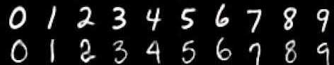

** 用 Keras 實作 MNIST 分類（精簡版）
此處以最簡單的 DNN 作為範例，使用 Keras 的 Sequential 模型。重點觀念：
- 用 =.add()= 一層一層將神經網路疊起
- 第一層要指定輸入維度（=input_shape=）
- 最後一層的 =units= 要等於分類數量（此例為 10）
- 最後一層的激活函數使用 =softmax=（輸出各類別的機率）

#+BEGIN_SRC python -r -n :results output :exports both
import numpy as np                          # 匯入 numpy：矩陣運算核心
from keras.datasets import mnist            # 匯入 MNIST 資料集（手寫數字 0~9）
from keras.utils import to_categorical      # 匯入 one-hot 編碼工具
from keras.models import Sequential         # 匯入 Sequential 模型（像疊積木一樣一層一層堆）
from keras.layers import Dense, Input       # Dense = 全連接層，Input = 輸入層

# === 1. 載入並預處理資料 ===
(x_train, y_train), (x_test, y_test) = mnist.load_data()  # 下載 MNIST，自動分成訓練/測試
# 將 28x28 圖片攤平為 784 維向量（28*28=784），並正規化到 0~1（除以 255）
x_train = x_train.reshape(-1, 784).astype('float32') / 255  # -1 表示「自動算出有幾張圖」
x_test = x_test.reshape(-1, 784).astype('float32') / 255    # 測試資料也做一樣的處理
# 標籤轉為 one-hot encoding（例如 5 → [0,0,0,0,0,1,0,0,0,0]，讓模型能算機率）
y_train = to_categorical(y_train, 10)       # 10 個類別（數字 0~9）
y_test = to_categorical(y_test, 10)

# === 2. 建立模型（3 層隱藏層，每層 500 個神經元）===
model = Sequential()                        # 建立一個空的 Sequential 模型
model.add(Input(shape=(784,)))              # 告訴模型：輸入是 784 維的向量
model.add(Dense(500, activation='relu'))    # 第 1 層隱藏層：500 個神經元，用 ReLU 激勵
model.add(Dense(500, activation='relu'))    # 第 2 層隱藏層：再 500 個
model.add(Dense(500, activation='relu'))    # 第 3 層隱藏層：又 500 個（深度就是這樣疊出來的）
model.add(Dense(10, activation='softmax'))  # 輸出層：10 個神經元對應 0~9，用 softmax 輸出機率
model.summary()                             # 印出模型結構摘要（看看總共有多少參數要訓練）

# === 3. 編譯與訓練 ===
# 優化器用 adam（目前最受歡迎的優化演算法），損失函數用 categorical_crossentropy（多分類標配）
model.compile(loss='categorical_crossentropy', optimizer='adam', metrics=['accuracy'])
# 開始訓練！batch_size=1000 表示每次餵 1000 張圖，epochs=20 表示全部資料跑 20 輪
model.fit(x_train, y_train, batch_size=1000, epochs=20, verbose=2)

# === 4. 評估結果 ===
score = model.evaluate(x_train, y_train, verbose=0)   # 用訓練集自我檢測（通常會很高）
print(f'\n訓練集準確率: {score[1]:.4f}')
score = model.evaluate(x_test, y_test, verbose=0)     # 用測試集檢測（這才是真本事）
print(f'測試集準確率: {score[1]:.4f}')                 # 如果兩者差太多，可能過度配適了
#+END_SRC

#+RESULTS:
#+begin_example
...略...
訓練集準確率: 0.9982
測試集準確率: 0.9823
#+end_example

** Python手刻
*** 準備 MNIST 資料
準備資料是訓練模型的第一步，基礎資料可以是網上公開的資料集，也可以是自己的資料集。視覺、語音、語言等各種型別的資料在網上都能找到相應的資料集。

MNIST 資料集來自美國國家標準與技術研究所, National Institute of Standards and Technology (NIST). 訓練集 (training set) 由來自 250 個不同人手寫的數字構成, 其中 50% 是高中學生, 50% 來自人口普查局 (the Census Bureau) 的工作人員. 測試集(test set) 也是同樣比例的手寫數字資料。MNIST 資料集可在 http://yann.lecun.com/exdb/mnist/ 獲取, 它包含了四個部分:
1. Training set images: train-images-idx3-ubyte.gz (9.9 MB, 解壓後 47 MB, 包含 60,000 個樣本)
2. Training set labels: train-labels-idx1-ubyte.gz (29 KB, 解壓後 60 KB, 包含 60,000 個標籤)
3. Test set images: t10k-images-idx3-ubyte.gz (1.6 MB, 解壓後 7.8 MB, 包含 10,000 個樣本)
4. Test set labels: t10k-labels-idx1-ubyte.gz (5KB, 解壓後 10 KB, 包含 10,000 個標籤)

MNIST 資料集是一個適合拿來當作 TensorFlow 的練習素材，在 Tensorflow 的現有套件中，也已經有內建好的 MNIST 資料集，我們只要在安裝好 TensorFlow 的 Python 環境中執行以下程式碼，即可將 MNIST 資料成功讀取進來。
#+BEGIN_SRC python -n -r :async :results output :exports both :session pm
import tensorflow as tf                     # 匯入 TensorFlow，深度學習界的重量級框架
mnist = tf.keras.datasets.mnist             # 取得 Keras 內建的 MNIST 資料集模組
(x_train, y_train), (x_test, y_test) = mnist.load_data() # 下載並拆成訓練/測試兩組 (ref:get-keras-mnist)
#+END_SRC

#+RESULTS:

在訓練模型之前，需要將樣本資料劃分為訓練集、測試集，有些情況下還會劃分為訓練集、測試集、驗證集。由上述程式第[[(get-keras-mnist)]]行可知，下載後的 MNIST 資料分成訓練資料(training data)與測試資料(testing data)，其中 x 為圖片、y為所對應數字。
#+BEGIN_SRC python -n -r :async :results output :exports both :session pm
import tensorflow as tf                     # 匯入 TensorFlow
mnist = tf.keras.datasets.mnist             # 取得 MNIST 資料集模組
(x_train, y_train), (x_test, y_test) = mnist.load_data()  # 下載資料
# ======================================================
# 判斷資料形狀（看看資料長什麼樣子）
print(x_train.shape)                        # 訓練集：(60000, 28, 28) → 6 萬張 28x28 的圖
print(x_test.shape)                         # 測試集：(10000, 28, 28) → 1 萬張
# 第一個 label 的內容（這張圖代表哪個數字？）
print(y_train[0])                           # 印出第一張圖的正確答案
# 顯示影像內容
import matplotlib.pylab as plt              # 匯入畫圖工具
img = x_train[0]                            # 取出第一張訓練圖片
plt.imshow(img)                             # 把它顯示出來（會看到一個手寫數字）
#plt.savefig("MNIST-Image.png")
#+END_SRC
#+RESULTS[301ed277c778e588011f39c44ec8462a701a3a8f]:
: (60000, 28, 28)
: (10000, 28, 28)
: 5

由上述程式輸出結果可以看到載入的 x 為大小為 28*28 的圖片共 60000 張，每一筆 MNIST 資料的照片(x)由 784 個 pixels 組成（28*28），照片內容如圖[[fig:MNIST-Image]]，訓練集的標籤(y)則為其對應的數字(0～9)，此例為 5。
#+CAPTION: MNIST 影像示例
#+name: fig:MNIST-Image
#+ATTR_LATEX: :width 100px
#+ATTR_ORG: :width 300
#+ATTR_HTML: :width 300
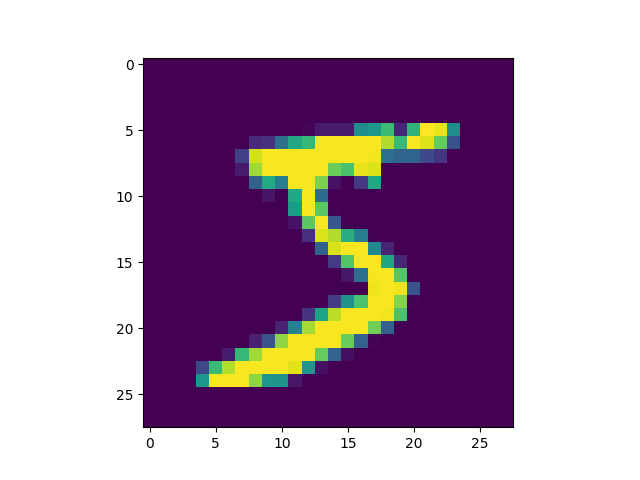

x 的影像資料為灰階影像，每個像素的數值介於 0~255 之間，矩陣裡每一項的資料則是代表每個 pixel 顏色深淺的數值，如下圖[[fig:MNIST-Matrix]]所示：
#+CAPTION: MNIST 資料矩陣
#+name: fig:MNIST-Matrix
#+ATTR_LATEX: :width 200
#+ATTR_ORG: :width 300
#+ATTR_HTML: :width 500
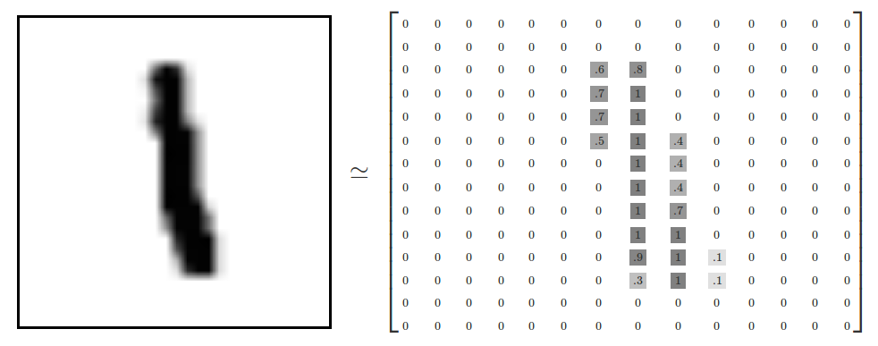

載入的 y 為所對應的數字 0~9，在這我們要運用 keras 中的 np\under{}utils.to\under{}categorical 將 y 轉成 one-hot 的形式，將他轉為一個 10 維的 vector，例如：我們所拿到的資料為 y=3，經過 np_utils.to_categorical，會轉換為 y=[0,0,0,1,0,0,0,0,0,0]。這部份的轉換程式碼如下：
#+BEGIN_SRC python -n -r :async :results output :exports both :session pm
from keras.datasets import mnist            # 匯入 MNIST 資料集
from keras.utils import to_categorical      # 匯入 one-hot 編碼轉換工具

import tensorflow as tf
mnist = tf.keras.datasets.mnist
(x_train, y_train), (x_test, y_test) = mnist.load_data()  # 下載資料
# =====================================
# 將圖片轉換為一個 60000*784 的向量，並且標準化
x_train = x_train.reshape(x_train.shape[0], 28*28)  # 把 28x28 的 2D 圖片攤平成 784 的 1D 向量
x_test = x_test.reshape(x_test.shape[0], 28*28)     # 測試集也攤平
x_train = x_train.astype('float32')         # 轉成浮點數（整數沒辦法存小數點）
x_test = x_test.astype('float32')
x_train = x_train/255                       # 正規化：像素值從 0~255 壓縮到 0~1（讓神經網路更好學習）
x_test = x_test/255
# 將 y 轉換成 one-hot encoding（例如 5 → [0,0,0,0,0,1,0,0,0,0]）
y_train = to_categorical(y_train, 10)       # 10 個類別，對應數字 0~9
y_test = to_categorical(y_test, 10)
# 回傳處理完的資料，看看第一筆長什麼樣
print(y_train[0])                           # 印出第一筆標籤的 one-hot 結果

import numpy as np
np.set_printoptions(precision=2, linewidth=np.inf)  # 設定印出格式：小數 2 位、不換行
print(x_train[0].reshape(28, 28))           # 把攤平的圖片還原成 28x28 印出來看看
#+END_SRC

#+RESULTS[c45bb1bd15ec5aacfdcc5b8fdfd319b4d98b163d]:
#+begin_example
[0. 0. 0. 0. 0. 1. 0. 0. 0. 0.]
[[0.   0.   0.   0.   0.   0.   0.   0.   0.   0.   0.   0.   0.   0.   0.   0.   0.   0.   0.   0.   0.   0.   0.   0.   0.   0.   0.   0.  ]
 [0.   0.   0.   0.   0.   0.   0.   0.   0.   0.   0.   0.   0.   0.   0.   0.   0.   0.   0.   0.   0.   0.   0.   0.   0.   0.   0.   0.  ]
 [0.   0.   0.   0.   0.   0.   0.   0.   0.   0.   0.   0.   0.   0.   0.   0.   0.   0.   0.   0.   0.   0.   0.   0.   0.   0.   0.   0.  ]
 [0.   0.   0.   0.   0.   0.   0.   0.   0.   0.   0.   0.   0.   0.   0.   0.   0.   0.   0.   0.   0.   0.   0.   0.   0.   0.   0.   0.  ]
 [0.   0.   0.   0.   0.   0.   0.   0.   0.   0.   0.   0.   0.   0.   0.   0.   0.   0.   0.   0.   0.   0.   0.   0.   0.   0.   0.   0.  ]
 [0.   0.   0.   0.   0.   0.   0.   0.   0.   0.   0.   0.   0.01 0.07 0.07 0.07 0.49 0.53 0.69 0.1  0.65 1.   0.97 0.5  0.   0.   0.   0.  ]
 [0.   0.   0.   0.   0.   0.   0.   0.   0.12 0.14 0.37 0.6  0.67 0.99 0.99 0.99 0.99 0.99 0.88 0.67 0.99 0.95 0.76 0.25 0.   0.   0.   0.  ]
 [0.   0.   0.   0.   0.   0.   0.   0.19 0.93 0.99 0.99 0.99 0.99 0.99 0.99 0.99 0.99 0.98 0.36 0.32 0.32 0.22 0.15 0.   0.   0.   0.   0.  ]
 [0.   0.   0.   0.   0.   0.   0.   0.07 0.86 0.99 0.99 0.99 0.99 0.99 0.78 0.71 0.97 0.95 0.   0.   0.   0.   0.   0.   0.   0.   0.   0.  ]
 [0.   0.   0.   0.   0.   0.   0.   0.   0.31 0.61 0.42 0.99 0.99 0.8  0.04 0.   0.17 0.6  0.   0.   0.   0.   0.   0.   0.   0.   0.   0.  ]
 [0.   0.   0.   0.   0.   0.   0.   0.   0.   0.05 0.   0.6  0.99 0.35 0.   0.   0.   0.   0.   0.   0.   0.   0.   0.   0.   0.   0.   0.  ]
 [0.   0.   0.   0.   0.   0.   0.   0.   0.   0.   0.   0.55 0.99 0.75 0.01 0.   0.   0.   0.   0.   0.   0.   0.   0.   0.   0.   0.   0.  ]
 [0.   0.   0.   0.   0.   0.   0.   0.   0.   0.   0.   0.04 0.75 0.99 0.27 0.   0.   0.   0.   0.   0.   0.   0.   0.   0.   0.   0.   0.  ]
 [0.   0.   0.   0.   0.   0.   0.   0.   0.   0.   0.   0.   0.14 0.95 0.88 0.63 0.42 0.   0.   0.   0.   0.   0.   0.   0.   0.   0.   0.  ]
 [0.   0.   0.   0.   0.   0.   0.   0.   0.   0.   0.   0.   0.   0.32 0.94 0.99 0.99 0.47 0.1  0.   0.   0.   0.   0.   0.   0.   0.   0.  ]
 [0.   0.   0.   0.   0.   0.   0.   0.   0.   0.   0.   0.   0.   0.   0.18 0.73 0.99 0.99 0.59 0.11 0.   0.   0.   0.   0.   0.   0.   0.  ]
 [0.   0.   0.   0.   0.   0.   0.   0.   0.   0.   0.   0.   0.   0.   0.   0.06 0.36 0.99 0.99 0.73 0.   0.   0.   0.   0.   0.   0.   0.  ]
 [0.   0.   0.   0.   0.   0.   0.   0.   0.   0.   0.   0.   0.   0.   0.   0.   0.   0.98 0.99 0.98 0.25 0.   0.   0.   0.   0.   0.   0.  ]
 [0.   0.   0.   0.   0.   0.   0.   0.   0.   0.   0.   0.   0.   0.   0.18 0.51 0.72 0.99 0.99 0.81 0.01 0.   0.   0.   0.   0.   0.   0.  ]
 [0.   0.   0.   0.   0.   0.   0.   0.   0.   0.   0.   0.   0.15 0.58 0.9  0.99 0.99 0.99 0.98 0.71 0.   0.   0.   0.   0.   0.   0.   0.  ]
 [0.   0.   0.   0.   0.   0.   0.   0.   0.   0.   0.09 0.45 0.87 0.99 0.99 0.99 0.99 0.79 0.31 0.   0.   0.   0.   0.   0.   0.   0.   0.  ]
 [0.   0.   0.   0.   0.   0.   0.   0.   0.09 0.26 0.84 0.99 0.99 0.99 0.99 0.78 0.32 0.01 0.   0.   0.   0.   0.   0.   0.   0.   0.   0.  ]
 [0.   0.   0.   0.   0.   0.   0.07 0.67 0.86 0.99 0.99 0.99 0.99 0.76 0.31 0.04 0.   0.   0.   0.   0.   0.   0.   0.   0.   0.   0.   0.  ]
 [0.   0.   0.   0.   0.22 0.67 0.89 0.99 0.99 0.99 0.99 0.96 0.52 0.04 0.   0.   0.   0.   0.   0.   0.   0.   0.   0.   0.   0.   0.   0.  ]
 [0.   0.   0.   0.   0.53 0.99 0.99 0.99 0.83 0.53 0.52 0.06 0.   0.   0.   0.   0.   0.   0.   0.   0.   0.   0.   0.   0.   0.   0.   0.  ]
 [0.   0.   0.   0.   0.   0.   0.   0.   0.   0.   0.   0.   0.   0.   0.   0.   0.   0.   0.   0.   0.   0.   0.   0.   0.   0.   0.   0.  ]
 [0.   0.   0.   0.   0.   0.   0.   0.   0.   0.   0.   0.   0.   0.   0.   0.   0.   0.   0.   0.   0.   0.   0.   0.   0.   0.   0.   0.  ]
 [0.   0.   0.   0.   0.   0.   0.   0.   0.   0.   0.   0.   0.   0.   0.   0.   0.   0.   0.   0.   0.   0.   0.   0.   0.   0.   0.   0.  ]]
#+end_example
#+CAPTION: x_train[0].reshape(28, 28)
#+LABEL:fig:x-train-0-reshape
#+name: fig:x-train-0-reshape
#+ATTR_LATEX: :width 300
#+ATTR_ORG: :width 300
#+ATTR_HTML: :width 1000
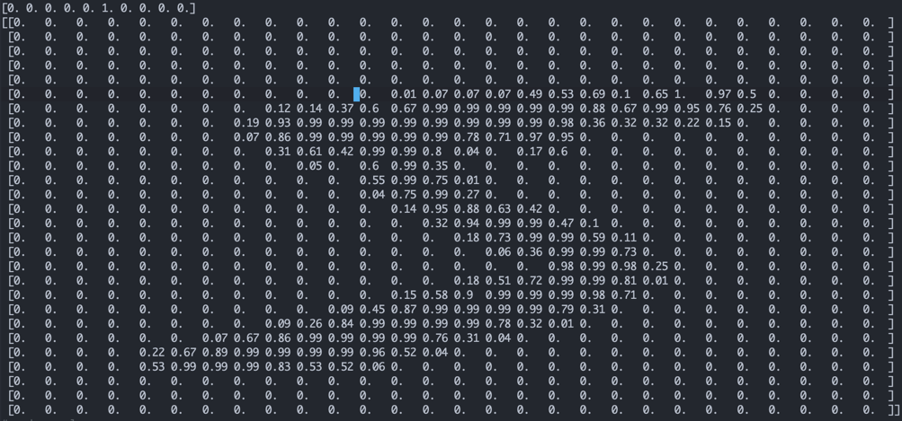

*** MNIST 的推論處理

如圖[[fig:MNIST-NeuralNet]]所示，MNIST 的推論神經網路最前端的輸入層有 784 (\(28*28=784\))個神經元，最後的輸出端有 10 個神經元(\(0~9\)個數字)，至於中間的隱藏層有兩個，第 1 個隱藏層有 50 個神經元，第 2 層有 100 個。此處的 50、100 可以設定為任意數（如，也可以是 128、64）。
#+CAPTION: MNIST-NeuralNet
#+name: fig:MNIST-NeuralNet
#+ATTR_LATEX: :width 400px
#+ATTR_ORG: :width 300
#+ATTR_HTML: :width 500
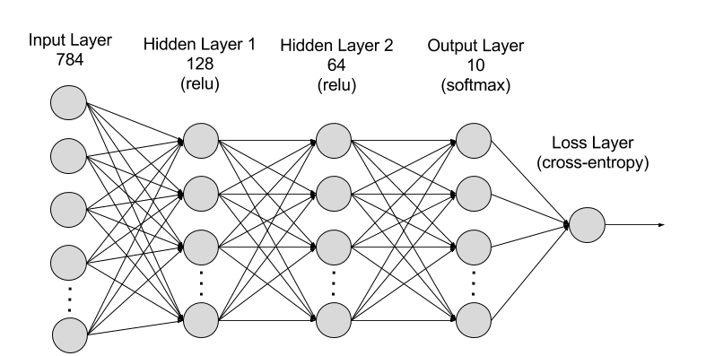

以下用純 numpy 手刻一個三層神經網路來進行 MNIST 推論。流程為：先用 Keras 快速訓練一組權重，再把權重取出，用我們自己寫的前向傳播函數來預測。這樣你就能看到「神經網路推論」背後其實就是一連串的矩陣乘法 + 激勵函數。

#+BEGIN_SRC python -n -r :results output :exports both
import numpy as np                          # 匯入 numpy，我們要用它來做矩陣乘法
from keras.datasets.mnist import load_data  # 匯入 MNIST 資料集的載入功能
from keras.models import Sequential         # 匯入 Keras 的 Sequential 模型
from keras.layers import Dense, Input       # Dense = 全連接層, Input = 輸入層
from keras.utils import to_categorical      # one-hot 編碼轉換工具

# === Step 1: 先用 Keras 快速訓練一個模型，把學到的權重偷出來 ===
(X_train, y_train), (X_test, y_test) = load_data()         # 下載 MNIST 資料
X_train_flat = X_train.reshape(-1, 784).astype('float32') / 255  # 攤平 + 正規化訓練圖片
X_test_flat = X_test.reshape(-1, 784).astype('float32') / 255   # 攤平 + 正規化測試圖片
y_train_oh = to_categorical(y_train, 10)    # 標籤轉 one-hot（Keras 訓練時需要）

# 建立一個三層神經網路（隱藏層用 sigmoid，輸出層用 softmax）
model = Sequential([
    Input(shape=(784,)),                     # 輸入：784 個像素值
    Dense(50, activation='sigmoid'),         # 第 1 隱藏層：50 個神經元
    Dense(100, activation='sigmoid'),        # 第 2 隱藏層：100 個神經元
    Dense(10, activation='softmax')          # 輸出層：10 個神經元（對應 0~9）
])
model.compile(optimizer='adam', loss='categorical_crossentropy', metrics=['accuracy'])
model.fit(X_train_flat, y_train_oh, epochs=5, batch_size=128, verbose=0)  # 安靜地訓練 5 輪

# 取出 Keras 訓練好的權重（就像偷看老師的答案本）
weights = {}
w = model.get_weights()  # 回傳一個 list：[W1, b1, W2, b2, W3, b3]
weights['W1'], weights['b1'] = w[0], w[1]   # 第 1 層的權重矩陣和偏差
weights['W2'], weights['b2'] = w[2], w[3]   # 第 2 層的權重矩陣和偏差
weights['W3'], weights['b3'] = w[4], w[5]   # 第 3 層（輸出層）的權重矩陣和偏差

# === Step 2: 用純 numpy 進行前向傳播（自己手刻推論，不靠 Keras）===
def sigmoid(x):                             # sigmoid 激勵函數：把任何數壓到 0~1 之間
    return 1 / (1 + np.exp(-np.clip(x, -500, 500)))  # clip 防止數字太大導致爆炸

def softmax(x):                              # softmax：把分數變成機率 (ref:softmax-fn)
    c = np.max(x)                            # 找出最大值
    exp_x = np.exp(x - c)                   # 先減最大值再取指數（防止數字太大溢位）
    return exp_x / np.sum(exp_x)            # 除以總和，讓所有值加起來 = 1

def predict(network, x):                     # 前向傳播函數：一路算到底 (ref:MNIST-predict)
    W1, W2, W3 = network['W1'], network['W2'], network['W3']  # 取出三層的權重
    b1, b2, b3 = network['b1'], network['b2'], network['b3']  # 取出三層的偏差
    a1 = np.dot(x, W1) + b1                  # 第 1 層：輸入 x 權重矩陣 + 偏差（矩陣乘法！）
    z1 = sigmoid(a1)                          # 第 1 層：通過 sigmoid 激勵函數
    a2 = np.dot(z1, W2) + b2                 # 第 2 層：上一層輸出 x 權重 + 偏差
    z2 = sigmoid(a2)                          # 第 2 層：再通過 sigmoid
    a3 = np.dot(z2, W3) + b3                 # 輸出層：最後一次矩陣乘法
    y = softmax(a3)                           # 輸出層：用 softmax 把結果變成 10 個機率
    return y                                  # 回傳：每個數字（0~9）的預測機率

# === Step 3: 拿 10000 張測試圖片逐一預測，算準確率 ===
accuracy_cnt = 0                             # 答對的計數器
for i in range(len(X_test_flat)):            # 跑過每一張測試圖片
    y = predict(weights, X_test_flat[i])      # 丟進去預測，得到 10 個機率 (ref:y-predict)
    p = np.argmax(y)                          # 取機率最高的那個數字當答案 (ref:np-argmax)
    if p == y_test[i]:                        # 如果預測對了
        accuracy_cnt += 1                     # 答對數 +1
print(f'手刻推論準確率：{accuracy_cnt / len(X_test_flat):.4f}')  # 算出正確率

# 看看第一筆預測的機率分佈（每個數字各有多少機率）
y0 = predict(weights, X_test_flat[0])        # 預測第一張測試圖
np.set_printoptions(precision=4, suppress=True)  # 設定印出格式：4 位小數
print(f'第一筆預測機率: {y0}')               # 印出 10 個數字各自的機率
print(f'預測結果: {np.argmax(y0)}, 正確答案: {y_test[0]}')  # 看看猜對了沒
#+END_SRC

#+RESULTS:
: 手刻推論準確率：0.9600
: 第一筆預測機率: [0.0004 0.0011 0.9859 ...]
: 預測結果: 7, 正確答案: 7

上述程式中，predict 函數(第[[(MNIST-predict)]]行)透過矩陣相乘運算完成神經網路的前向傳播。程式碼第[[(y-predict)]]行為神經網路針對輸入圖片的預測結果，傳回值為各數字的機率陣列；而第[[(np-argmax)]]行的 =np.argmax(y)= 會傳回機率最高的索引，即為預測的數字。
*** Python 與神經網路運算的批次處理

前節程式碼中最後以 for 迴圈來逐一處理預測結果與比較，輸入(X)為單一圖片，其處理程序如圖[[fig:MNIST-single]]所示：
#+CAPTION: MNIST-單一處理架構
#+name: fig:MNIST-single
#+ATTR_LATEX: :width 300
#+ATTR_ORG: :width 300
#+ATTR_HTML: :width 500
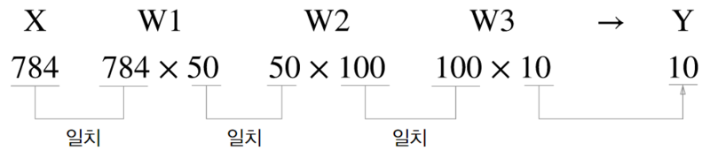

事實上，在使用批次處理（如一次處理 100 張圖）反而能大幅縮短每張圖片的處理時間，因為多數處理數值運算的函式庫都會針對大型陣列運算進行最佳化，尤其是透過 GPU 來處理時更是如此，這時，傳送單張圖片反而成為效能瓶頸，以批次處理則可減輕匯流排頻寬負擔。若以每次處理 100 張為例，其處理程序則如圖[[fig:MNIST-batch]]所示。
#+CAPTION: MNIST-批次處理架構
#+name: fig:MNIST-batch
#+ATTR_LATEX: :width 300
#+ATTR_ORG: :width 300
#+ATTR_HTML: :width 500
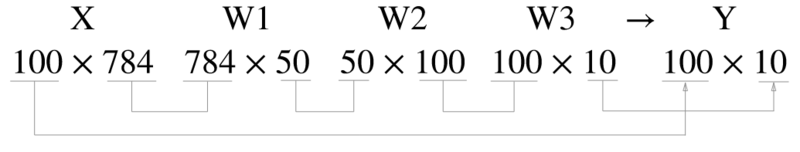

至於批次運算的概念如下：與其一張一張送進 predict 函數，不如一次送入一整批（例如 100 張）。由於 numpy 對大型矩陣運算有最佳化，批次處理在 GPU 上更是快到飛起來。概念程式碼如下（延續前節的 predict 函數與 weights 變數）：
#+begin_example
# 批次處理架構（概念示意）——一次處理一批圖片，比一張一張快超多
batch_size = 100                             # 每批 100 張圖片
accuracy_cnt = 0                             # 答對計數器歸零
for i in range(0, len(X_test_flat), batch_size):  # 每次跳 100 步（0, 100, 200, ...）
    x_batch = X_test_flat[i:i+batch_size]    # 一次切出 100 張圖片（形狀：100x784）
    # 注意：此處的 predict 需支援矩陣輸入（不是單張圖片，而是一整批）
    y_batch = predict(weights, x_batch)      # 一口氣預測 100 張，回傳 100 組機率
    p = np.argmax(y_batch, axis=1)           # axis=1 表示「每一列」取最大值的索引
    accuracy_cnt += np.sum(p == y_test[i:i+batch_size])  # 統計這批裡面答對幾題
print(f'批次處理準確率：{accuracy_cnt / len(X_test_flat):.4f}')  # 結果跟逐筆一樣，但速度快很多
#+end_example

其中關鍵在於：=x_batch= 的形狀為 (100, 784)，經過矩陣乘法後一次就能得到 100 筆預測結果，效率遠高於逐筆處理。

上面我們用 numpy 手刻了整個前向傳播流程——雖然能幫助理解神經網路的運作原理，但每次都要自己寫矩陣運算、管理權重，實在太痛苦了。前面的 Keras 精簡版已經展示了更方便的做法：只要 =.add()= 幾行就能堆出一個神經網路。

至於如何訓練更好的模型（處理過度配適、選擇優化器、嘗試不同問題類型），我們會在[[file:20221023101228-深度學習.org][深度學習]]中深入探討。

* DNN的進化之路 :Keras:noexport:
這是個比較囉唆且完整的版本，裡面包含詳細的程式說明。
** 簡介
此例以Keras套件建立一個深度學習模型，用以解決手寫數字的辨識。Keras 是 Python 的深度學習框架，提供一種便利的方式來定義和訓練幾乎所有類型的深度學習模型。
*** 優點
- 相同的程式碼可在 CPU 或 GPU 上執行
- 內建程式庫支援了卷積神經網路(用於電腦視覺)、循環神經網路(用於序列資料處理)，以及二者的任何組合。
- Keras 可以使用最少的程式碼，花最少的時間，就能建立深度學習模型，並進行培訓、評估準確率；相對的，如果使用 TensorFlow，則需要更多程式碼，花費更多時間。
- 採用寬鬆的 MIT 授權條款，所以可以自由使用在商業專案上。

Keras 是一個 model-level 模型級的深度學習程式庫，Keras 只處理模型的建立、訓練、預測等功能。深度學習程式庫的運作（如張量運算），Keras 必須配合使用「後端引擎」(backend Engine)進行運算。目前 Keras 提供了兩種 backend engine：Theano 與 TensorFlow。其基本架構如下圖所示：

#+BEGIN_SRC ditaa :file KerasArch.png
  +----------------------------+
  |            Keras           |
  +----------------------------+
  | TensorFlow/Theano/CNTK/... |
  +------------+---------------+
  | CUDA/cuDNN |  BLAS, Eigen  |
  +------------+---------------+
  |     GPU    |     CPU       |
  +------------+---------------+
#+END_SRC
#+CAPTION: 深度學習軟硬體架構
#+name: fig:KerasArch
#+ATTR_LATEX: :width 360
#+ATTR_HTML: :width 360
#+ATTR_ORG: :width 360
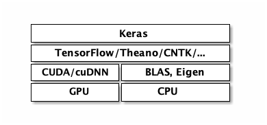

由圖[[fig:KerasArch]]可看出，Keras 並未被綁定在特定張量程式庫中，而是改以模組方式處理，目前可用的後端引擎有 Montreal 大學 MILA 實驗室的 Theano、Google 的 TensorFlow、Microsoft 的 CNTK...等，這些後端引擎在應用不同硬體(CPU/GPU)時則會採用不同的低階程式庫(CUDA/Eigen)。

** 機器學習模型設計模式
開發一個機器學習模型的流程大致如下：
1. 定義問題並建立資料集
2. 選擇一種評量成功的準則(metrics)
3. 決定驗證(validation)程序
4. 準備資料：定義訓練資料：即 input tensor 和 target tensors(label tensors)
5. 開發出優於基準(baseline)的模型：定義神經網路模型的 layers，以便將 input tensor 對應到預測值
6. 選擇 loss function, optimizer 和監控的評量準則(metrics)來建立學習過程
7. 呼叫模型中的 fit()方法來迭代訓練資料
8. 擴大規模：開發一個過度適配的模型
9. 常規化模型並調整參數

*** 定義問題並建立資料集

進行模型建構之初，我們首先要評估的是：
- 輸入資料是什麼？想要預測什麼？有什麼樣的訓練資料，就只能學習預測該類問題。例如，手上只有電影評論和情緒標註資料，就只能學習對電影評論的情緒分類。
- 面臨什麼樣的問題？是二元分類？多類別分類？純量迴歸？向量迴歸？多類別多標籤？分群？生成式學習？增強式學習？不同的問題類型會引導我們如何選擇模型架構與損失函數。

在確認上述兩項問題後，我們是基於以下兩個假設來進行模型的建立：

- 假設機器可以根據給定的輸入資料預測結果
- 假設手上的資料能提供足夠的資訊，讓機器能學習到輸入與輸出間的關係

在真正建構出一個可用模型之前，上述兩個假設依然只是假設，必須經過驗證後才能確定成立與否。重點是：並非所有的問題都能透過模型來解決，例如：試圖以最近的歷史價格來預測股票市場的走勢就很難成功，因為光是參考歷史價格並不足以提供預測股價所需資訊。

另一種要特別留意的問題類型為非平穩問題(nonstationary problems)，例如分析服裝的銷售/推薦，這當中存在的最大問題在於人們購買的衣服種類會隨季節而變化，所以服裝購買在幾個月內是非平穩現象，建立的模型內容會隨著時間而變化。在這種情況下，解決方法有：

- 不斷以最近的資料重新訓練模型，或
- 在相對平穩的時間區間(具有規律的週期間)收集資料，以購買衣服為例，應該以年為單位進行資料收集才足以補捉到季節變化的規律。

最後，切記：機器學習只能用於學習訓練資料中已存在的模式，也就是只能認出以前見過的模式。通常我們所謂以過去的資料預測未來，是假設未來的行為在過去曾發生過，但實際情況則未必如此。
*** 選擇一種評量成功的準則(metrics)
選好評量成功的準則，才有選擇損失函數的依據。在 Keras 中，所謂選擇評量準則，就是在 compile 時選擇適當的 metrics 參數。大概的選擇原則如下：
- 二元分類問題：accuracy 和 ROC AUC(area under the receiver operating characteristic curve)為兩種常用的度量。
- 類別不均(class-imbalanced)問題：使用 precision 和 recall 來做度量。
- 排名問題或多標籤問題：使用平均精度
- 少見的問題：自行定義指標
*** 決定驗證(validation)程序
一旦決定目標，就要決定驗證學習進度的方法，三種常見的驗證方法如下所述，但在大多數情況下，第一個方法就有不錯的效能。
- Simple hold-out: 資料量大時適用
- K-fold cross validation: 樣本資料不夠多時用
- Iterated K-fold validation with shuffling: 資料量非常少時用
*** 準備資料
一旦知道要訓練什麼、要優化什麼、以及如評估效能，就可以著手準備建構模型，但首先要把資料整理成可以輸入神經網路的格式（張量），以監督式學習而言，其輸入的訓練資料會有以下兩類：即 input tensor 和 target tensors(label tensors)
*** 開發優於基準(baseline)的模型
此階段的目標在於實現統計功效(statistical power)，以 MNIST 資料集為例，任何準確度大於 0.1 的模型都可以說具有統計功效的（因為一共有 10 個答案類別）；而在 IMDB 範例中，只要準確度大於 0.5 即算。雖然 baseline 是一個很低的標準，但我們不見得都能實現這個目標，如果在嚐試過多個合理架構後模型表現仍無法優於隨機基準能力，則很有可能問題出在輸入資料，也許輸入資料沒有所需答案。

如果一切順利，則接下來我們要做出三個關鍵選擇來建構第一個模型：

- 選擇最後一層的啟動函數：這將為神經網路建立輸出的形式。例如，IMDB 分類最後使用 sigmoid 分成兩個值、MNIST 則以 softmax 分為 10 類。
- 損失函數：要配合問題類型，如 IMDB 使用 binary_crossentropy、迴歸則使用 mse。
- 優化器設定：大多數情況下，rmsprop 可做為預設選項搭配預設學習率

下表為選擇啟動函數與損失函數的參考

| 問題類型                                | 輸出層啟動函數 | 損失函數                          |
|-----------------------------------------+----------------+-----------------------------------|
| Binary classification                   | Sigmoid        | binary_crossentropy        |
| Multiclass, single-label classification | softmax        | categorical_crossentropy   |
| Multiclass, multi-label classification  | sigmoid        | binary_crossentropy        |
| Regression to arbitrary values          | None           | mse                               |
| Regression to values between 0 and 1    | sigmoid        | mse or binary_crossentropy |
*** 擴大規模：開發一個過度適配的模型
一旦成功建構了一個超越 baseline 的模型，問題就變成：這個模型夠不夠強大？有沒有足夠的 layer 和參數來正確模擬手上的問題？例如，只有兩個 units 的單隱藏層也許有辨識 MNIST 的統計功效，但不足以很好的解決該問題。而機器學習就是在最佳化和普適性之間做取捨，理想的模型是介於 underfitting 和 overfitting 的交界、介於模型太小(undercapacity)和模型太大(overcapacity)之間，要找出這個位置，勢必要先越過它再回來。所以，要搞清楚需要多大的模型，就要開發一個太大的模型，有幾種方法可以達到這點：
- 加入更多的 layer
- 增加每一層的 capacity
- 訓練更多的週期
*** 常規化模型並調整參數
這裡會花掉最多時間：要反覆修改模型、訓練模型、評估驗證資料，然後再次修改，以下有幾種做法：

- 加入 dropout
- 嘗試不同架構：新增或刪除 layer
- 添加 L1 或 L2 regularization，或同時使用
- 嘗試使用不同的超參數，如每一層的 units 數或優化器的學習率
- 著重於特徵工程，如加入新特徵、刪除似乎沒用的特徵
一旦開發出令人滿意的模型配置，就可以在所有可用資料(訓練和驗證)上訓練最終產出的模型，並在測試集上最後一次評估它。

** 基本流程
在 Keras 定義 model 有兩種方法：
- Sequential class: 適用於線性堆疊的模型
- functional API: 適用任何有向無環的神經網路架構

以下為建立 sequential model 的例子：
*** 建立模型
#+BEGIN_SRC python -r -n :async :results output :exports both :session pilot-mnist
from keras import models
from keras import layers

model = models.Sequential()
# 定義輸入維度
model.add(layers.Input(shape=(784,)))
# 新增一個輸出為32維的Dense layer
model.add(layers.Dense(32, activation='relu'))
# 接收來自上層32維的輸入，輸出一個10維的資料
model.add(layers.Dense(10, activation='softmax'))
#+END_SRC

#+RESULTS:

若使用 API 來定義相同的模型，其語法如下：
#+BEGIN_SRC python -r -n :async :results output :exports both :session pilot-mnist
from keras import models
from keras import layers

input_tensor = layers.Input(shape=(784,))
x = layers.Dense(32, activation='relu')(input_tensor)
output_tensor = layers.Dense(10, activation='softmax')(x)
model = models.Model(inputs=input_tensor, outputs=output_tensor)
#+END_SRC

#+RESULTS:

*** 編譯模型
一旦建立好模型架構，則無論是使用 Sequential 或 API，其餘步驟均相同。神經網路是在編譯(model.compile)時建立的，我們可以在其中指定使用的 optimizer 和 loss function，以及訓練期間監看的評量準則(metrics)，典型的範例如下：
#+BEGIN_SRC python -r -n :async :results output :exports both :session pilot-mnist
from keras import optimizers
model.compile(optimizer=optimizers.RMSprop(learning_rate=0.001), loss='mse', metrics=['accuracy'])
#+END_SRC
MacOS系統(M1/M2 CPU)下的加速運算方式: [[https://stackoverflow.com/questions/77222463/is-there-a-way-to-change-adam-to-legacy-when-using-mac-m1-m2-in-tensorflow][stackoverflow]]
*** 訓練模型
最後，整個學習程序經由 fit()將輸入資料以 Numpy 陣列的形式傳給模型：
#+BEGIN_SRC python -r -n :async :results output :exports both :session pilot-mnist
model.fit(input_tensor, target_tensor, batch_size=128, epochs=10)
#+END_SRC

** 以 Keras 實作 MNist 手寫數字辨識資料集
*** 讀入資料與預處理
MNist 手寫數字辨識資料集是由 Yann LeCun 所蒐集，他也是 CNN 的創始人。MNist 資料集共有訓練資料集 60000 筆、測試資料集 10000 筆，每筆資料都由一 28*28 的 image 以及相對應的 label 組成。
**** 完整程式碼概覽
#+BEGIN_SRC python -r -n :results output :exports both :session keras-mnist
### 1. 下載MNist資料 ###
### 1.1 滙入Keras及相關所需資源
import numpy as np # 支援維度陣列之矩陣運算
import pandas as pd
from keras.utils import to_categorical # 要將table轉為one-hot encoding

np.random.seed(10) #讓每次產生的亂數一致

### 1.2 匯入Keras模組以下載MNist資料集###
from keras.datasets import mnist
### 1.3 讀取MNist資料集###
(x_train_image, y_train_label), (x_test_image, y_test_label) = mnist.load_data()

### 1.4 查看MNist資料集筆數###
print('4. 查看MNist資料集筆數')
print('train data=', len(x_train_image))
print(' test data=', len(x_test_image))

### 2.  查看訓練資料###
### 2.1 輸出訓練資料格式###
print('2.1 查看訓練資料格式')
print('train image=', x_train_image.shape)
print(' test image=', y_train_label.shape)

### 2.2 定義plot_image函數顯示數字影像###
import matplotlib.pyplot as plt
def plot_image(imgname, image):
    fig = plt.gcf() #設定圖形大小
    fig.set_size_inches(2,2)
    plt.imshow(image, cmap='binary') #cmap參數設定為binary以黑白灰階顯示
    # plt.show() #for jupyter or colab
    plt.plot()
    plt.savefig(imgname+".png")

### 2.3 執行plot_image函數查看第0筆數字影像及對應label###
plot_image("Keras-mnist-0", x_train_image[0])
print(y_train_label[0])

### 3. 查看多筆資料###
### 3.1 建立plot_images_labels_prediction()函式###
def plot_images_labels_prediction(imgname, images, labels, prediction, idx, num = 10):
    fig = plt.gcf()
    fig.set_size_inches(8,4) # 設定顯示圖形大小
    if num>25: num=25 # 顯示資料筆數上限
    for i in range(0, num):
        ax=plt.subplot(2,5,1+i) # 此處顯示10筆圖形，2*5個
        ax.imshow(images[idx], cmap='binary') # 畫圖
        title= "label=" +str(labels[idx]) # 加入子圖形title
        if len(prediction)>0:
            title+=",predict="+str(prediction[idx]) # 標題title加入預測結果
        ax.set_title(title,fontsize=10)
        ax.set_xticks([]);ax.set_yticks([]) #不顯示刻度
        idx+=1
    #plt.show()
    #plt.plot()
    plt.savefig(imgname+".png")

### 3.2 執行plot_images_labels_prediction函數查看多筆images及labels
plot_images_labels_prediction("Keras-mnist-1",x_train_image,y_train_label,[],0,10)

### 4. 多層感知器(Multilayer perception, MLP)模型資料預處理###
### 4.1 以reshape轉換image矩陣
x_Train = x_train_image.reshape(60000, 784).astype('float32')
x_Test = x_test_image.reshape(10000, 784).astype('float32')
print(x_Train.shape)
print(x_Test.shape)

### 4.2 將影像之數字矩陣正規化###
x_Train_normalize = x_Train/ 255
x_Test_normalize = x_Test/ 255

### 4.3 原始label欄位###
print(y_train_label[:5]) # 輸出前5筆

### 4.4 進行One-hot encoding###
y_TrainOneHot = to_categorical(y_train_label)
y_TestOneHot = to_categorical(y_test_label)
### 4.5 轉換後之label欄位###
print(y_TrainOneHot[:5]) # 輸出前5筆
#+END_SRC

#+RESULTS:
: Downloading data from https://storage.googleapis.com/tensorflow/tf-keras-datasets/mnist.npz
#+CAPTION: MNist 第一筆資料影像
#+LABEL:fig:Keras-mnist-0
#+name: fig:Keras-mnist-0
#+ATTR_LATEX: :width 50
#+ATTR_ORG: :width 150
#+ATTR_HTML: :width 100
#+RESULTS:
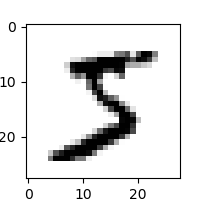

#+CAPTION: MNist 前十筆資料影像
#+LABEL:fig:Keras-mnist-1
#+name: fig:Keras-mnist-1
#+ATTR_LATEX: :width 400
#+ATTR_ORG: :width 400
#+ATTR_HTML: :width 300
#+RESULTS:
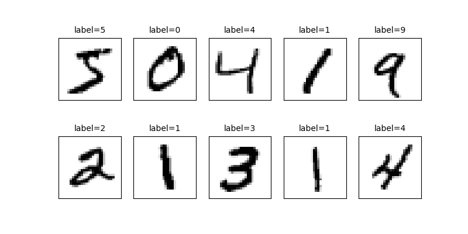
*** Keras MLP 辨識 MNist
**** 模型架構
MNist 的 MLP 模型分為三層（如圖[[fig:MNist-MLP-1]]）：
- *輸入層*：784 個神經元（28×28 像素攤平），接收手寫圖片
- *隱藏層*：256 個神經元（層數和神經元數由設計者決定）
- *輸出層*：10 個神經元，分別代表 0~9 的預測機率

#+CAPTION: MNist MLP 模型
#+LABEL:fig:MNist-MLP-1
#+name: fig:MNist-MLP-1
#+ATTR_LATEX: :width 400
#+ATTR_ORG: :width 400
#+ATTR_HTML: :width 500
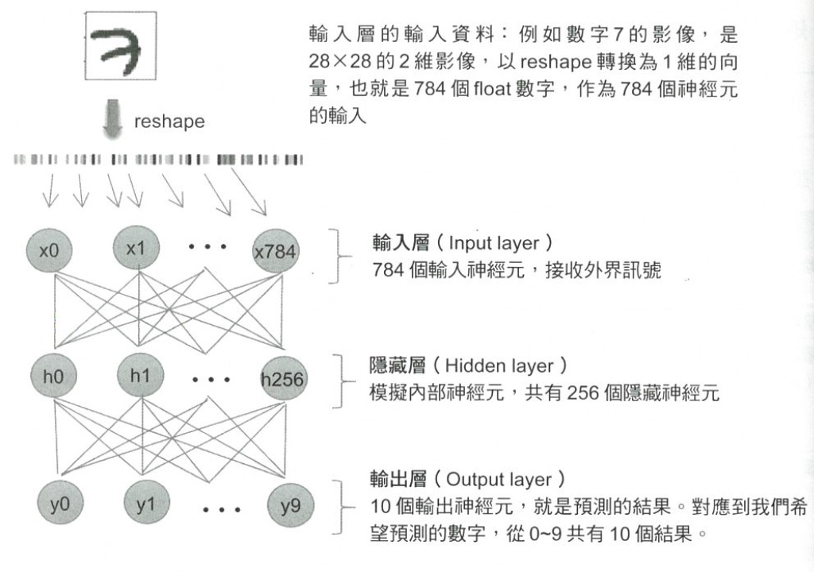

模型建立後，流程為：訓練（用 60000 筆資料學習權重）→ 預測（用學到的權重辨識新的手寫數字）。
*** MLP 模型的建立步驟
上面的「完整程式碼概覽」已展示了所有步驟，這裡逐步說明每個步驟在做什麼。

**** 資料預處理（Preprocess）
1. *讀取 MNIST 資料*：Keras 內建 =mnist.load_data()=，自動下載並拆分為訓練集（60000 筆）與測試集（10000 筆）
2. *Reshape*：將 28×28 的圖片矩陣攤平為 784 維向量，因竹為 MLP 的輸入必須是一維的
3. *正規化*：把像素值從 0~255 縮放到 0~1（除以 255），讓梯度下降收斂更快
4. *One-hot encoding*：將標籤數字轉為 10 維向量，例如 =5= → =[0,0,0,0,0,1,0,0,0,0]=

**** 建立模型
用 Keras 建立 MLP 模型只需要幾行：
#+begin_example
model = Sequential()
model.add(Dense(units=256, input_dim=784, activation='relu'))   # 隱藏層
model.add(Dense(units=10, activation='softmax'))                # 輸出層
#+end_example

其中 =Dense= 是「全連接層」，上下層的所有神經元互相連接。用 =model.summary()= 可以查看模型的參數量：

| 層           | 輸出形狀     | 參數數量                                                                        |
|--------------+--------------+---------------------------------------------------------------------------------|
| 隱藏層(Dense) | (None, 256) | 784×256 + 256 = 200960                                                         |
| 輸出層(Dense) | (None, 10)  | 256×10 + 10 = 2570                                                              |
|--------------+--------------+---------------------------------------------------------------------------------|
| 總計          |              | 203530                                                                          |

參數量的計算公式為：Param = 上一層神經元數 × 本層神經元數 + 本層神經元數（bias）。

**** 編譯與訓練[fn:3]
=model.compile()= 設定訓練策略：
- *optimizer*（優化器）：決定如何更新權重，常用 ='adam'=
- *loss*（損失函數）：多分類用 =categorical_crossentropy=，二分類用 =binary_crossentropy=，迴歸用 =mse=
- *metrics*：分類問題通常設 =['accuracy']=

=model.fit()= 開始訓練：
- =validation_split=0.2=：保留 20% 資料做驗證（偵測 overfitting）
- =epochs=20=：整批資料跑 20 輪

**** 完整執行（訓練 + 視覺化 + 儲存模型）
以下是完整的可執行程式碼，包含資料預處理、模型建立、訓練、視覺化、評估與模型儲存：
#+BEGIN_SRC python -r -n :results output :exports both :session mnist-mlp
import numpy as np
import matplotlib.pyplot as plt
from keras.utils import to_categorical
from keras.datasets import mnist
from keras.models import Sequential
from keras.layers import Dense, Input

# === 1. 資料預處理 ===
np.random.seed(10)
(x_train_image, y_train_label), (x_test_image, y_test_label) = mnist.load_data()
x_Train_normalize = x_train_image.reshape(60000, 784).astype('float32') / 255
x_Test_normalize = x_test_image.reshape(10000, 784).astype('float32') / 255
y_TrainOneHot = to_categorical(y_train_label)
y_TestOneHot = to_categorical(y_test_label)

# === 2. 建立模型（隱藏層 256 個神經元）===
model = Sequential()
model.add(Input(shape=(784,)))
model.add(Dense(256, kernel_initializer='normal', activation='relu'))
model.add(Dense(10, kernel_initializer='normal', activation='softmax'))

# === 3. 編譯與訓練 ===
model.compile(loss='categorical_crossentropy', optimizer='adam', metrics=['accuracy'])
train_history = model.fit(x_Train_normalize, y_TrainOneHot,
                          validation_split=0.2, epochs=20, verbose=2)

# === 4. 繪製訓練曲線 ===
def show_train_history(train_history, train, validation):
    plt.plot(train_history.history[train])
    plt.plot(train_history.history[validation])
    plt.title('Train History')
    plt.ylabel(train)
    plt.xlabel('Epoch')
    plt.legend(['train', 'validation'], loc='upper left')

show_train_history(train_history, 'accuracy', 'val_accuracy')
plt.savefig("Keras-MNist-Train-1.png")
plt.clf()
show_train_history(train_history, 'loss', 'val_loss')
plt.savefig("Keras-MNist-Train-2.png")
plt.clf()

# === 5. 評估與儲存 ===
scores = model.evaluate(x_Test_normalize, y_TestOneHot, verbose=0)
print(f'測試集準確率: {scores[1]:.4f}')
model.save('Keras_MNist_model.keras')
#+END_SRC

#+RESULTS:
#+begin_example
Epoch 1/20
1500/1500 - 2s - loss: 0.2700 - accuracy: 0.9242 - val_loss: 0.1371 - val_accuracy: 0.9592 - 2s/epoch - 1ms/step
...略...
Epoch 20/20
1500/1500 - 1s - loss: 0.0044 - accuracy: 0.9986 - val_loss: 0.1325 - val_accuracy: 0.9768 - 1s/epoch - 993us/step
1/1 [==============================] - 0s 15ms/step
test before save model:  [[0. 0. 0. 0. 0. 0. 0. 1. 0. 0.]
 [0. 0. 1. 0. 0. 0. 0. 0. 0. 0.]
 [0. 1. 0. 0. 0. 0. 0. 0. 0. 0.]
 [1. 0. 0. 0. 0. 0. 0. 0. 0. 0.]
 [0. 0. 0. 0. 1. 0. 0. 0. 0. 0.]]
313/313 [==============================] - 0s 447us/step - loss: 0.1032 - accuracy: 0.9802
accuracy [0.10324574261903763, 0.9801999926567078]
accuracy 0.9801999926567078
#+end_example

#+CAPTION: Keras Mnist Model 訓練#1: accuracy
#+LABEL:fig:Keras-MNist-Train-1
#+name: fig:Keras-MNist-Train-1
#+ATTR_LATEX: :width 300
#+ATTR_HTML: :width 400
#+ATTR_ORG: :width 300
#+RESULTS:
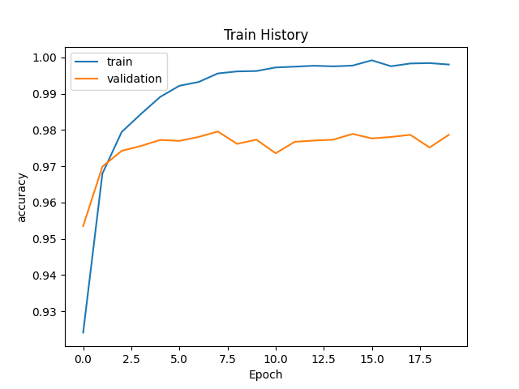

圖[[fig:Keras-MNist-Train-1]]為執行 10 次週期後的預測精確度變化，可以看出以下現象：
1) 訓練與驗證的精確率均隨訓練週期增加而提高
2) 訓練精確度較驗證精確度高，原因是用來評估訓練精確率的資料已在訓練階段用過了；而用來評估驗證精確率的資料則否；這就類似，考試時考學過的練習題，學生得分較高。
3) 驗證精確率雖然低，但較符合現實情況，即，考試時考學生沒有做過的題目。
4) 如果訓練精確率持續增高，但驗證精確率卻無法提升，可能是出現過度擬合(overfitting)的現象。
#+CAPTION: Keras Mnist Model 訓練#1: loss function
#+LABEL:fig:Keras-MNist-Train-2
#+name: fig:Keras-MNist-Train-2
#+ATTR_LATEX: :width 300
#+ATTR_HTML: :width 400
#+ATTR_ORG: :width 300
#+RESULTS:
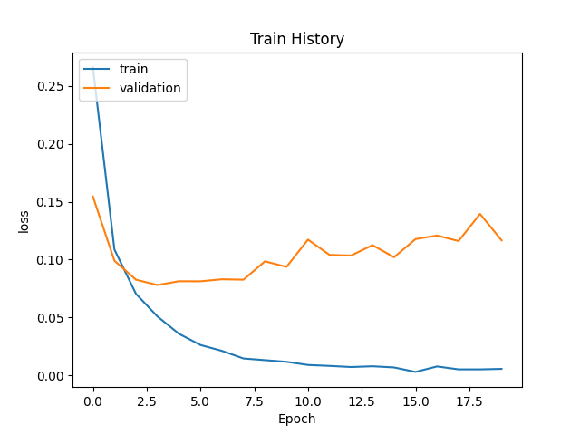

由圖[[fig:Keras-MNist-Train-2]]亦可看出，訓練誤差與驗證誤差亦隨週期增加而降低，且訓練誤差最終低於驗證誤差。

訓練完成後，再以測試資料來評估模型準確率。
**** 進行預測
模型在訓練、驗證、測試後，即可以此訓練完之模型進行預測，預測方式如下：
#+BEGIN_SRC python -r -n :results output :exports both :session mnist-mlp
# 接續前一段 session，使用已訓練的 model 進行預測
import numpy as np
from keras.datasets import mnist
import matplotlib.pyplot as plt
from keras.models import load_model

(x_train_image, y_train_label), (x_test_image, y_test_label) = mnist.load_data()
x_Test = x_test_image.reshape(10000, 784).astype('float32')

# 載入儲存的模型
model = load_model('Keras_MNist_model.keras')
predict_x = model.predict(x_Test, verbose=0)
prediction = np.argmax(predict_x, axis=1)

# 繪製 10 筆預測結果
fig = plt.gcf()
fig.set_size_inches(8, 4)
for i in range(10):
    idx = 340 + i
    ax = plt.subplot(2, 5, 1 + i)
    ax.imshow(x_test_image[idx], cmap='binary')
    title = f"label={y_test_label[idx]}\npredict={prediction[idx]}"
    ax.set_title(title, fontsize=10)
    ax.set_xticks([]); ax.set_yticks([])
plt.tight_layout()
plt.savefig("images/Keras-MNist-Train-3.png")
#+END_SRC

#+RESULTS:
: 313/313 [==============================] - 0s 396us/step

#+CAPTION: Keras-MNist-Train-3
#+LABEL:fig:Keras-MNist-Train-3
#+name: fig:Keras-MNist-Train-3
#+ATTR_LATEX: :width 300
#+ATTR_ORG: :width 300
#+ATTR_HTML: :width 500
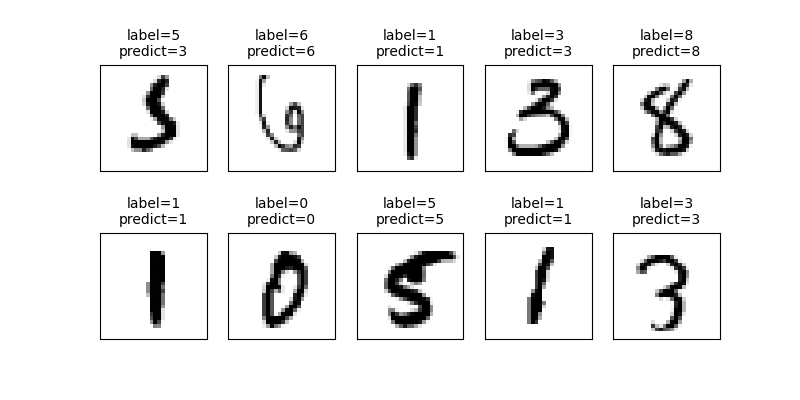

上述程式碼將訓練好後儲存的模型取出，拿 10 筆記錄去預測，發現第一筆有誤（真實值 label 為 5、預測值為 3）。
**** 顯示混淆矩陣(confusion matrix)

若想進一步得知哪些數字容易被混淆，可以使用混淆矩陣(confusion matrix, 也稱為誤差矩陣 error matrix)。實務上可以利用 pandas crosstab 來建立，程式碼如下：
#+BEGIN_SRC python -r -n :results output :exports both :session mnist-mlp
# 接續前段 session 的 prediction 和 y_test_label
import pandas as pd
confuse = pd.crosstab(y_test_label, prediction, rownames=['label'], colnames=['predict'])
print(confuse)
#+END_SRC

#+RESULTS:
#+begin_example
313/313 [==============================] - 0s 398us/step
predict    0     1     2    3    4    5    6     7    8    9
label
0        971     1     0    0    1    0    3     1    2    1
1          0  1130     2    0    0    0    0     1    2    0
2          4     1  1006    3    2    0    3     7    5    1
3          1     0     6  988    0    6    0     4    3    2
4          2     2     3    0  954    1    3     1    2   14
5          3     1     1    6    1  873    3     0    2    2
6          3     3     1    1    2    4  943     0    1    0
7          1     7     8    1    1    0    0  1004    2    4
8          3     0     3    5    3    3    1     3  952    1
9          3     3     0    2    5    3    0     5    0  988
#+end_example

由輸出結果可以得知，5容易被誤判為 3。若想進一步得知到底有那幾張圖為上述狀況，則可以加入限制條件，程式碼如下：
#+BEGIN_SRC python -r -n :results output :exports both :session mnist-mlp
# 接續前段 session，找出被誤判為 3 的 5
df = pd.DataFrame({'label': y_test_label, 'predict': prediction})
print(df[(df.label == 5) & (df.predict == 3)])

# 顯示第 340 筆被誤判的圖片
plt.figure(figsize=(2, 2))
plt.imshow(x_test_image[340], cmap='binary')
plt.savefig("images/Keras-MNist-Train-4.png")
#+END_SRC

#+RESULTS:
: 1/313 [..............................] - ETA: 9s
119/313 [==========>...................] - ETA: 0s
245/313 [======================>.......] - ETA: 0s
313/313 [==============================] - 0s 407us/step
:       label  predict
: 340       5        3
: 1393      5        3
: 2035      5        3
: 2597      5        3
: 4360      5        3
: 5937      5        3
#+CAPTION: Keras Mnist Model 訓練#1: error sample
#+LABEL:fig:Keras-MNist-Train-4
#+name: fig:Keras-MNist-Train-4
#+ATTR_LATEX: :width 100
#+ATTR_HTML: :width 100
#+ATTR_ORG: :width 100
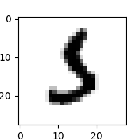

** 強化 MLP 辨識 solution #1: 增加隱藏層神經元數

為了增加 MLP 的準確率，其中一種方法可以增加隱藏層的神經元數至 1000 個，程式碼如下：
#+BEGIN_SRC python -r -n :async :results output :exports both :session mnist-mlp
from keras.utils import to_categorical
import keras
import numpy as np # 支援維度陣列之矩陣運算
np.random.seed(10) #讓每次產生的亂數一致

from keras.datasets import mnist
(x_train_image, y_train_label), (x_test_image, y_test_label) = mnist.load_data()
x_Train = x_train_image.reshape(60000, 784).astype('float32')
x_Test = x_test_image.reshape(10000, 784).astype('float32')
x_Train_normalize = x_Train/ 255
x_Test_normalize = x_Test/ 255
y_TrainOneHot = to_categorical(y_train_label)
y_TestOneHot = to_categorical(y_test_label)

from keras.models import Sequential
from keras.layers import Dense
model = Sequential()
#=====增加神經元數
model.add(Dense(units=1000, input_dim=784, kernel_initializer='normal', activation='relu'))
model.add(Dense(units=10, kernel_initializer='normal', activation='softmax'))
print(model.summary())
#=====查看訓練過程及結果
model.compile(loss='categorical_crossentropy', optimizer='adam', metrics=['accuracy'])
train_history = model.fit(x=x_Train_normalize, y=y_TrainOneHot,
                                validation_split=0.2, epochs=10, verbose=2)
import matplotlib.pyplot as plt
def show_train_history(train_history, train, validation):
    plt.plot(train_history.history[train])
    plt.plot(train_history.history[validation])
    plt.title('Train History')
    plt.ylabel(train)
    plt.xlabel('Epoch')
    plt.legend(['train','validation'], loc='upper left')
show_train_history(train_history, 'accuracy', 'val_accuracy')
plt.savefig("images/Keras-MNist-Train-5.png")
plt.clf()
show_train_history(train_history, 'loss', 'val_loss')
plt.savefig("images/Keras-MNist-Train-6.png") #
# 以測試資料評估精確率
scores = model.evaluate(x_Test_normalize, y_TestOneHot)
print('accuracy',scores[1])

model.save('Keras_MNist_model-1.keras')
del model  # deletes the existing model
#+END_SRC

#+CAPTION: Keras Mnist Model 訓練#2: accuracy
#+LABEL:fig:Keras-MNist-Train-5
#+name: fig:Keras-MNist-Train-5
#+ATTR_LATEX: :width 400
#+ATTR_HTML: :width 400
#+ATTR_ORG: :width 400
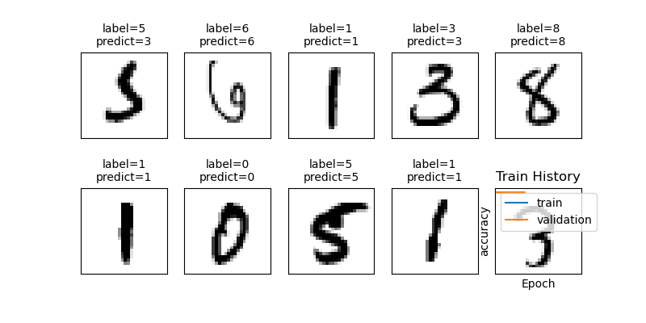
#+CAPTION: Keras Mnist Model 訓練#2: loss information
#+LABEL:fig:Keras-MNist-Train-6
#+name: fig:Keras-MNist-Train-6
#+ATTR_LATEX: :width 400
#+ATTR_HTML: :width 400
#+ATTR_ORG: :width 400
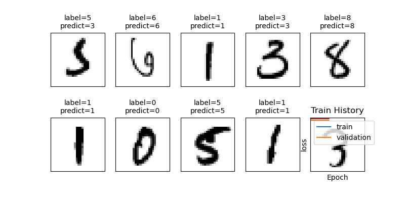

將神經元數增加至 1000 後，精確率由 0.97 提升至 0.98。但測驗準確率仍未提升，可見 overfitting 仍然嚴重。

** 強化 MLP 辨識 solution #2: 加入 DropOut 以避免 overfitting

為解決 Overfitting 問題，此處再加入 Dropout(0.5)指令，其功能為在每次訓練迭代時，會隨機地在隱藏層中放棄 50%的神經元，以避免 overfitting，程式碼如下：
#+BEGIN_SRC python -r -n :async :results output :exports both :session mnist-mlp
from keras.utils import to_categorical
import numpy as np # 支援維度陣列之矩陣運算

np.random.seed(10) #讓每次產生的亂數一致
from keras.datasets import mnist
(x_train_image, y_train_label), (x_test_image, y_test_label) = mnist.load_data()
x_Train = x_train_image.reshape(60000, 784).astype('float32')
x_Test = x_test_image.reshape(10000, 784).astype('float32')
x_Train_normalize = x_Train/ 255
x_Test_normalize = x_Test/ 255
y_TrainOneHot = to_categorical(y_train_label)
y_TestOneHot = to_categorical(y_test_label)

from keras.models import Sequential
from keras.layers import Dense
model = Sequential()
#=====增加神經元數
model.add(Dense(units=1000, input_dim=784, kernel_initializer='normal', activation='relu'))
#=====加入Dropout
from keras.layers import Dropout
model.add(Dropout(0.5))
#=====加入輸出層
model.add(Dense(units=10, kernel_initializer='normal', activation='softmax'))
print(model.summary())
#=====訓練模型、查看結果
model.compile(loss='categorical_crossentropy', optimizer='adam', metrics=['accuracy'])
train_history = model.fit(x=x_Train_normalize, y=y_TrainOneHot,
                              validation_split=0.2, epochs=10, verbose=2)
import matplotlib.pyplot as plt
def show_train_history(train_history, train, validation):
    plt.plot(train_history.history[train])
    plt.plot(train_history.history[validation])
    plt.title('Train History')
    plt.ylabel(train)
    plt.xlabel('Epoch')
    plt.legend(['train','validation'], loc='upper left')
show_train_history(train_history, 'accuracy', 'val_accuracy')
plt.savefig("images/Keras-MNist-Train-7.png")
plt.clf()
show_train_history(train_history, 'loss', 'val_loss')
plt.savefig("images/Keras-MNist-Train-8.png") #
# 以測試資料評估精確率
scores = model.evaluate(x_Test_normalize, y_TestOneHot)
print('accuracy=',scores[1])
# 進行預測
predict_x=model.predict(x_Test)
prediction=np.argmax(predict_x,axis=1)
# 輸出confusion matrix
import pandas as pd
pd.crosstab(y_test_label,prediction,
            rownames=['label'],colnames=['predict'])

# 儲存訓練好的模式
model.save('Keras_MNist_model-2.keras')
del model  # deletes the existing model
#+END_SRC

#+RESULTS:
#+begin_example
Model: "sequential_5"
_________________________________________________________________
 Layer (type)                Output Shape              Param #
=================================================================
 dense_10 (Dense)            (None, 1000)              785000

 dropout_1 (Dropout)         (None, 1000)              0

 dense_11 (Dense)            (None, 10)                10010

=================================================================
Total params: 795010 (3.03 MB)
Trainable params: 795010 (3.03 MB)
Non-trainable params: 0 (0.00 Byte)
_________________________________________________________________
None
Epoch 1/10
1500/1500 - 3s - loss: 0.2691 - accuracy: 0.9188 - val_loss: 0.1277 - val_accuracy: 0.9624 - 3s/epoch - 2ms/step
...略...
Epoch 10/10
1500/1500 - 3s - loss: 0.0506 - accuracy: 0.9836 - val_loss: 0.0848 - val_accuracy: 0.9799 - 3s/epoch - 2ms/step
313/313 [==============================] - 0s 859us/step - loss: 0.0696 - accuracy: 0.9825
accuracy= 0.9825000166893005
313/313 [==============================] - 0s 831us/step
#+end_example

由訓練過程可以看出，驗證精確率(0.9805)已接近訓練精確率(0.9838)，可見已改善了 overfitting 問題。

#+CAPTION: Keras Mnist Model 訓練#3: accuracy
#+LABEL:fig:Keras-MNist-Train-7
#+name: fig:Keras-MNist-Train-7
#+ATTR_LATEX: :width 400
#+ATTR_HTML: :width 400
#+ATTR_ORG: :width 400
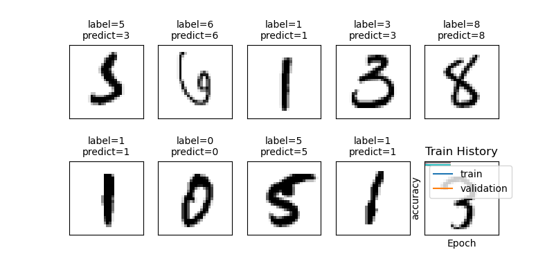
#+CAPTION: Keras Mnist Model 訓練#3: loss information
#+LABEL:fig:Keras-MNist-Train-8
#+name: fig:Keras-MNist-Train-8
#+ATTR_LATEX: :width 400
#+ATTR_HTML: :width 400
#+ATTR_ORG: :width 400
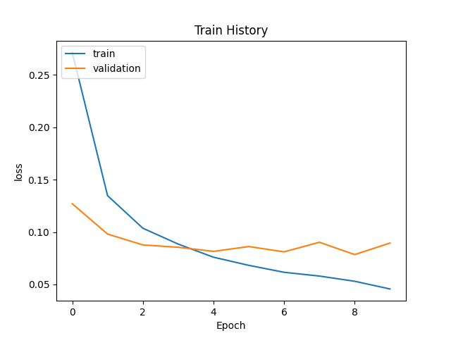

由圖[[fig:Keras-MNist-Train-7]]也可看出，驗證精確率已隨訓練週期提高，驗證誤差也隨訓練週期降低。

** 強化 MLP 辨識 solution #3: 增加隱藏層層數

本例 MLP 模型的預測能力仍有改善空間：增加隱藏層層數。以下程式碼將隱藏層數提高至 2 層：

#+BEGIN_SRC python -r -n :async :results output :exports both :session mnist-mlp
from keras.utils import to_categorical
import numpy as np # 支援維度陣列之矩陣運算

np.random.seed(10) #讓每次產生的亂數一致
from keras.datasets import mnist
(x_train_image, y_train_label), (x_test_image, y_test_label) = mnist.load_data()
x_Train = x_train_image.reshape(60000, 784).astype('float32')
x_Test = x_test_image.reshape(10000, 784).astype('float32')
x_Train_normalize = x_Train/ 255
x_Test_normalize = x_Test/ 255
y_TrainOneHot = to_categorical(y_train_label)
y_TestOneHot = to_categorical(y_test_label)

from keras.models import Sequential
from keras.layers import Dense
from keras.layers import Dropout

model = Sequential()
#=====增加第1層隱藏層神經元數
model.add(Dense(units=1000, input_dim=784, kernel_initializer='normal', activation='relu'))
#=====加入Dropout
model.add(Dropout(0.5))
#=====增加第2層隱藏層
model.add(Dense(units=1000, kernel_initializer='normal', activation='relu'))
#=====加入第2層Dropout
model.add(Dropout(0.5))
#=====加入輸出層
model.add(Dense(units=10, kernel_initializer='normal', activation='softmax'))
print(model.summary())
#=====訓練模型、查看結果
model.compile(loss='categorical_crossentropy', optimizer='adam', metrics=['accuracy'])
train_history = model.fit(x=x_Train_normalize, y=y_TrainOneHot,
                          validation_split=0.2, epochs=10, verbose=2)
import matplotlib.pyplot as plt
def show_train_history(train_history, train, validation):
    plt.plot(train_history.history[train])
    plt.plot(train_history.history[validation])
    plt.title('Train History')
    plt.ylabel(train)
    plt.xlabel('Epoch')
    plt.legend(['train','validation'], loc='upper left')
show_train_history(train_history, 'accuracy', 'val_accuracy')
plt.savefig("images/Keras-MNist-Train-9.png")
plt.clf()
show_train_history(train_history, 'loss', 'val_loss')
plt.savefig("images/Keras-MNist-Train-a.png") #
# 以測試資料評估精確率
scores = model.evaluate(x_Test_normalize, y_TestOneHot)
print('accuracy=',scores[1])
# 進行預測
predict_x=model.predict(x_Test)
prediction=np.argmax(predict_x,axis=1)

# 輸出confusion matrix
import pandas as pd
pd.crosstab(y_test_label,prediction,
            rownames=['label'],colnames=['predict'])
# 儲存訓練好的模式
model.save('Keras_MNist_model-3.keras')
del model  # deletes the existing model
#+END_SRC

#+RESULTS:
#+begin_example
Model: "sequential_6"
_________________________________________________________________
 Layer (type)                Output Shape              Param #
=================================================================
 dense_12 (Dense)            (None, 1000)              785000

 dropout_2 (Dropout)         (None, 1000)              0

 dense_13 (Dense)            (None, 1000)              1001000

 dropout_3 (Dropout)         (None, 1000)              0

 dense_14 (Dense)            (None, 10)                10010

=================================================================
Total params: 1796010 (6.85 MB)
Trainable params: 1796010 (6.85 MB)
Non-trainable params: 0 (0.00 Byte)
_________________________________________________________________
None
Epoch 1/10
1500/1500 - 6s - loss: 0.3203 - accuracy: 0.9016 - val_loss: 0.1277 - val_accuracy: 0.9622 - 6s/epoch - 4ms/step
...略...
Epoch 10/10
1500/1500 - 6s - loss: 0.1013 - accuracy: 0.9726 - val_loss: 0.0961 - val_accuracy: 0.9758 - 6s/epoch - 4ms/step
313/313 [==============================] - 1s 2ms/step - loss: 0.0871 - accuracy: 0.9769
accuracy= 0.9768999814987183
313/313 [==============================] - 1s 2ms/step
#+end_example

#+CAPTION: Keras Mnist Model 訓練#3: accuracy
#+LABEL:fig:Keras-MNist-Train-9
#+name: fig:Keras-MNist-Train-9
#+ATTR_LATEX: :width 400
#+ATTR_HTML: :width 400
#+ATTR_ORG: :width 400
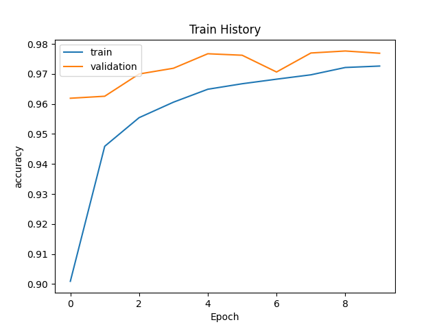
#+CAPTION: Keras Mnist Model 訓練#3: loss information
#+LABEL:fig:Keras-MNist-Train-a
#+name: fig:Keras-MNist-Train-a
#+ATTR_LATEX: :width 400
#+ATTR_HTML: :width 400
#+ATTR_ORG: :width 400
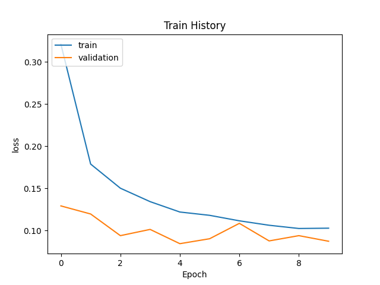

由訓練成果判斷，雖然精確率並未提升，但是由圖[[fig:Keras-MNist-Train-9]]可以看出驗證精確率已經比訓練精確率高，已確實可以解決 overfitting 的問題。

隨著 MLP 模型的改進，雖然精確率可逐步提升，也可藉由加入 Dropout 解決 overfitting 的問題，但 MLP 仍有其極限，如果要進一步提升準確率，就要使用卷積神經網路 CNN (convolutional neural network)。

* 課堂練習 :TNFSH:
** 練習一：神經網路的「開悟」之旅——用 numpy 手刻 XOR
還記得在感知器課程中，單層感知器被 XOR 問題打趴在地上嗎？今天我們要見證「多一層神經元」帶來的奇蹟——從「做不到」到「輕鬆搞定」，這就是深度學習的威力。

*** 範例
以下程式碼用純 numpy 建立了一個兩層神經網路，直接給定可行的權重（不訓練），用前向傳播來解 XOR：

#+begin_src python -r -n :results output :exports both
import numpy as np                          # 匯入 numpy，做矩陣運算的神兵利器

def sigmoid(x):                             # sigmoid 函數：把任何數壓到 0~1 之間
    return 1 / (1 + np.exp(-x))             # 公式：1 / (1 + e^(-x))

# XOR 的四筆資料（XOR = 兩個輸入不同時輸出 1，相同時輸出 0）
X = np.array([[0,0], [0,1], [1,0], [1,1]])  # 四種輸入組合
y_true = np.array([0, 1, 1, 0])             # XOR 的正確答案

# === 已知可行的權重（不是訓練出來的，是人工精心設計的）===
# 隱藏層: 2 個神經元，各自負責不同的邏輯判斷
W1 = np.array([[20, 20],    # 第 1 個隱藏神經元的權重 → 模擬 OR gate（有 1 就亮）
               [-20, -20]]) # 第 2 個隱藏神經元的權重 → 模擬 NAND gate（不能兩個都是 1）
b1 = np.array([-10, 30])    # 兩個隱藏神經元的偏差值

# 輸出層: 1 個神經元（把 OR 和 NAND 的結果結合起來 → 就是 XOR！）
W2 = np.array([[20], [20]]) # 輸出層的權重：兩個隱藏神經元都要滿足才過關
b2 = np.array([-30])        # 輸出層的偏差值

# === 前向傳播（資料從輸入層 → 隱藏層 → 輸出層，一路往前算）===
print("=== XOR 前向傳播 ===\n")
for i in range(len(X)):                      # 跑四種輸入組合
    z1 = np.dot(X[i], W1.T) + b1            # 隱藏層的加權和：輸入 x 權重 + 偏差
    a1 = sigmoid(z1)                          # 通過 sigmoid，壓到 0~1
    z2 = np.dot(a1, W2) + b2                 # 輸出層的加權和：隱藏層輸出 x 權重 + 偏差
    a2 = sigmoid(z2)                          # 再通過 sigmoid，得到最終輸出
    pred = 1 if a2[0] > 0.5 else 0           # 大於 0.5 判定為 1，否則為 0
    print(f"輸入: {X[i]} → 隱藏層: [{a1[0]:.4f}, {a1[1]:.4f}] → 輸出: {a2[0]:.4f} → 預測={pred}, 正確={y_true[i]}")
#+end_src

#+RESULTS:
: === XOR 前向傳播 ===
:
: 輸入: [0 0] → 隱藏層: [0.0000, 1.0000] → 輸出: 0.0000 → 預測=0, 正確=0
: 輸入: [0 1] → 隱藏層: [1.0000, 1.0000] → 輸出: 1.0000 → 預測=1, 正確=1
: 輸入: [1 0] → 隱藏層: [1.0000, 1.0000] → 輸出: 1.0000 → 預測=1, 正確=1
: 輸入: [1 1] → 隱藏層: [1.0000, 0.0000] → 輸出: 0.0000 → 預測=0, 正確=0

*** 你的任務
在一所學校裡，下課時間的玩樂規則如下：
- 天氣好(1) 且 沒有考試(1) → 去操場玩(1)
- 天氣好(1) 且 有考試(0) → 去操場玩(1)（反正考不好也不差這一次）
- 天氣差(0) 且 沒有考試(1) → 去操場玩(1)（下雨也要玩）
- 天氣差(0) 且 有考試(0) → 乖乖讀書(0)（下雨又要考試，命運在呼喚你）

這其實就是 OR gate！請修改上面的範例，把 XOR 的權重改成能解 OR 問題的權重。

提示：OR gate 比 XOR 簡單多了，你只需要一層就夠（但為了練習，還是用兩層網路來做）。

**** 預期輸出
#+begin_example
輸入: [0 0] → 預測=0, 正確=0  （天氣差+有考試 → 讀書）
輸入: [0 1] → 預測=1, 正確=1  （天氣差+沒考試 → 玩）
輸入: [1 0] → 預測=1, 正確=1  （天氣好+有考試 → 還是玩）
輸入: [1 1] → 預測=1, 正確=1  （天氣好+沒考試 → 當然玩）
#+end_example

*** 參考解答 :noexport:
#+begin_src python -r -n :results output :exports both
import numpy as np

def sigmoid(x):
    return 1 / (1 + np.exp(-x))

X = np.array([[0,0], [0,1], [1,0], [1,1]])
y_true = np.array([0, 1, 1, 1])  # OR gate 的真值表

# OR gate 只需要第一層就能解
# 隱藏層神經元 1: 做 OR 運算
W1 = np.array([[20, 20],     # OR: 20*x1 + 20*x2 - 10
               [0, 0]])      # 第 2 個神經元不用（填 0）
b1 = np.array([-10, 0])

# 輸出層: 直接取隱藏層第 1 個神經元的結果
W2 = np.array([[20], [0]])
b2 = np.array([-10])

print("=== OR gate（下課要不要去操場）===\n")
for i in range(len(X)):
    z1 = np.dot(X[i], W1.T) + b1
    a1 = sigmoid(z1)
    z2 = np.dot(a1, W2) + b2
    a2 = sigmoid(z2)
    pred = 1 if a2[0] > 0.5 else 0
    weather = "天氣好" if X[i][0] else "天氣差"
    exam = "沒考試" if X[i][1] else "有考試"
    result = "去操場玩" if pred else "乖乖讀書"
    print(f"  {weather}+{exam} → 預測={pred}, 正確={y_true[i]} → {result}")
#+end_src

** 練習二：用 Keras 預測「誰會被當」——你的第一個深度學習模型
學校裡每次段考完，老師都要判斷誰需要補考。現在你要訓練一個神經網路，根據平時表現來預測誰會被當掉。如果你的模型夠準，也許未來就不用考試了——讓 AI 直接判你死刑。

*** 範例
以下程式碼用 Keras 建立了一個「會不會被當」的預測模型，訓練資料是 10 位同學的作業和出席分數：

#+begin_src python -r -n :results output :exports both
import numpy as np                          # 匯入 numpy
from keras.models import Sequential         # 匯入 Sequential 模型（堆積木式建模）
from keras.layers import Dense, Input       # Dense = 全連接層, Input = 輸入層

# === 訓練資料：10 位同學的 [作業分數, 出席率] ===
# 作業分數: 0~100, 出席率: 0~100
X_train = np.array([
    [90, 95], [30, 40], [85, 80], [20, 30], [70, 75],
    [40, 50], [80, 85], [25, 20], [75, 70], [35, 45]
], dtype='float32') / 100.0                 # 除以 100 正規化到 0~1（讓模型更好訓練）

# 標籤: 1=過關, 0=被當（這就是我們要預測的答案）
y_train = np.array([1, 0, 1, 0, 1, 0, 1, 0, 1, 0], dtype='float32')

# === 建立模型（超簡單的三層結構）===
model = Sequential()                        # 建立空模型
model.add(Input(shape=(2,)))               # 輸入層：2 個特徵（作業分數、出席率）
model.add(Dense(4, activation='relu'))     # 隱藏層：4 個神經元，用 ReLU 激勵
model.add(Dense(1, activation='sigmoid')) # 輸出層：1 個神經元，sigmoid 輸出 0~1 的機率

# === 編譯與訓練 ===
# binary_crossentropy = 二元分類專用損失函數（過關 or 被當，只有兩種結果）
model.compile(optimizer='adam', loss='binary_crossentropy', metrics=['accuracy'])
history = model.fit(X_train, y_train, epochs=200, verbose=0)  # 安靜地訓練 200 輪
print(f"訓練完成！最終 accuracy: {history.history['accuracy'][-1]:.1%}")

# === 預測三位新同學（模型從沒看過這些資料）===
new_students = np.array([[60, 70], [45, 50], [80, 90]], dtype='float32') / 100.0  # 一樣要正規化
preds = model.predict(new_students, verbose=0)  # 丟進模型預測，回傳過關機率
names = ["小明(作業60/出席70)", "小華(作業45/出席50)", "小美(作業80/出席90)"]
print("\n預測結果：")
for name, p in zip(names, preds):            # zip 把名字和預測結果配對
    verdict = "過關" if p[0] > 0.5 else "被當"  # 機率 > 0.5 就判過關
    emoji = "OK" if p[0] > 0.5 else "GG"        # 加個小標記
    print(f"  {name} → {p[0]:.3f} → {verdict} {emoji}")
#+end_src

#+RESULTS:
#+begin_example
訓練完成！最終 accuracy: 100.0%

預測結果：
  小明(作業60/出席70) → 0.703 → 過關 OK
  小華(作業45/出席50) → 0.187 → 被當 GG
  小美(作業80/出席90) → 0.953 → 過關 OK
#+end_example

*** 你的任務
請修改上面的程式碼，把預測目標從「會不會被當」改成「會不會考上第一志願」。

修改要求：
1. 把輸入特徵改為 =[模考成績, 每天讀書時數]=（模考成績 0~100，每天讀書時數 0~10）
2. 自己編造至少 10 筆訓練資料（合理即可，例如模考 90 分 + 每天讀 8 小時 → 上榜）
3. 注意：讀書時數的範圍是 0~10，正規化時要除以 10 而非 100
4. 預測以下三位同學是否考上：模考 75/每天讀 5 小時、模考 40/每天讀 2 小時、模考 85/每天讀 7 小時

**** 預期輸出格式
#+begin_example
訓練完成！最終 accuracy: 100.0%

預測結果：
  模考75/讀5hr → 0.xxx → 上榜/落榜
  模考40/讀2hr → 0.xxx → 上榜/落榜
  模考85/讀7hr → 0.xxx → 上榜/落榜
#+end_example

（具體的預測數值會因你編造的訓練資料和隨機種子而不同，但大方向應該是：模考 75/讀 5hr 在邊緣、模考 40/讀 2hr 應落榜、模考 85/讀 7hr 應上榜）

*** 參考解答 :noexport:
#+begin_src python -r -n :results output :exports both
import numpy as np
from keras.models import Sequential
from keras.layers import Dense, Input

# 訓練資料：[模考成績/100, 每天讀書時數/10]
X_train = np.array([
    [92, 8], [35, 1], [88, 7], [40, 2], [78, 6],
    [45, 3], [82, 7], [30, 1], [70, 5], [50, 2],
    [95, 9], [55, 3]
], dtype='float32')
# 正規化：模考/100, 讀書時數/10
X_train[:, 0] /= 100.0
X_train[:, 1] /= 10.0

y_train = np.array([1, 0, 1, 0, 1, 0, 1, 0, 1, 0, 1, 0], dtype='float32')

model = Sequential()
model.add(Input(shape=(2,)))
model.add(Dense(4, activation='relu'))
model.add(Dense(1, activation='sigmoid'))
model.compile(optimizer='adam', loss='binary_crossentropy', metrics=['accuracy'])
history = model.fit(X_train, y_train, epochs=300, verbose=0)
print(f"訓練完成！最終 accuracy: {history.history['accuracy'][-1]:.1%}")

# 預測
new = np.array([[75, 5], [40, 2], [85, 7]], dtype='float32')
new[:, 0] /= 100.0
new[:, 1] /= 10.0
preds = model.predict(new, verbose=0)
cases = ["模考75/讀5hr", "模考40/讀2hr", "模考85/讀7hr"]
print("\n預測結果：")
for case, p in zip(cases, preds):
    verdict = "上榜" if p[0] > 0.5 else "落榜"
    print(f"  {case} → {p[0]:.3f} → {verdict}")
#+end_src

* Footnotes

[fn:1] [[https://kknews.cc/code/o8m4gpq.html][五分鐘理解深度學習中激活函數以及不同激活函數的使用場景]]

[fn:2] [[https://kknews.cc/zh-tw/tech/b4zkbom.html][主流的深度學習模型有哪些？]]

