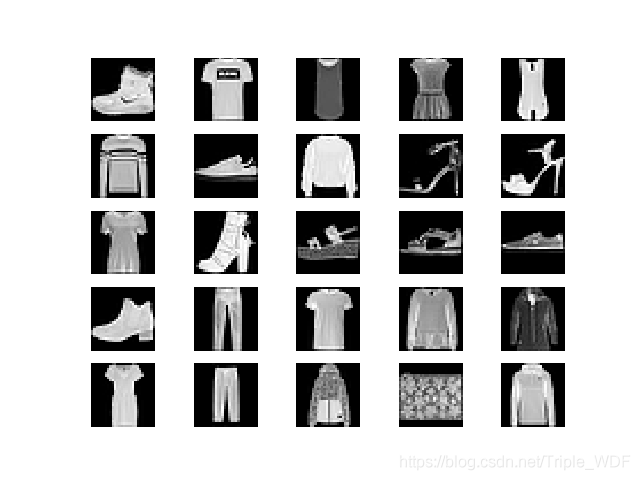
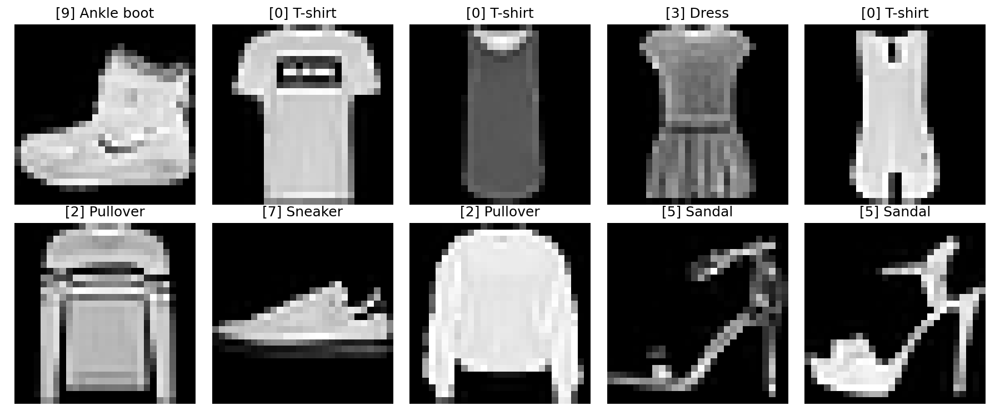
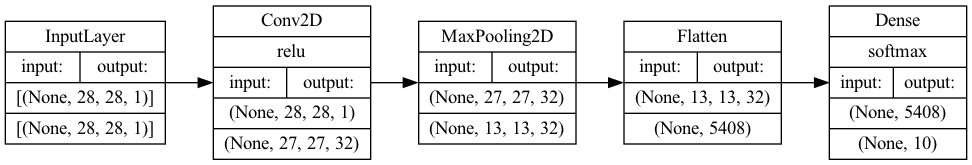
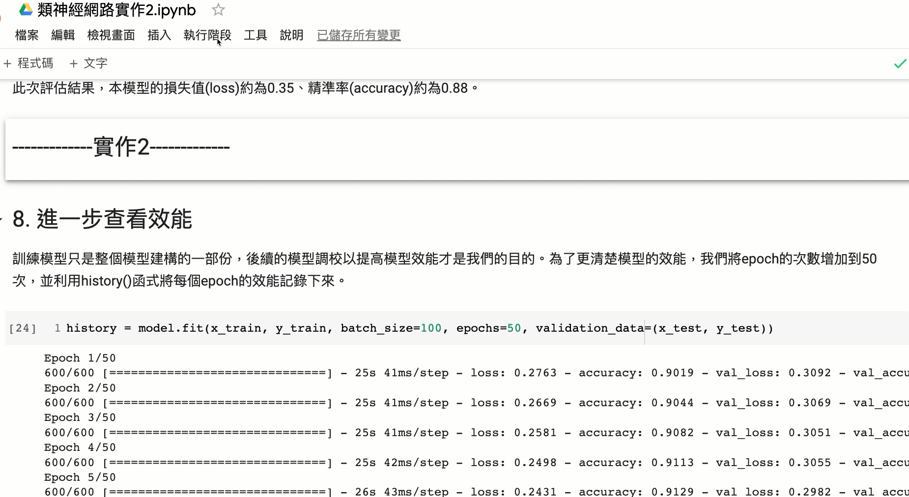
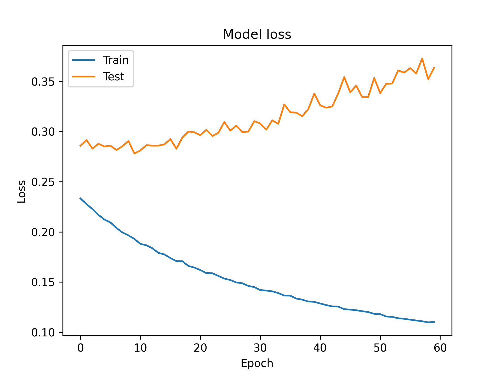
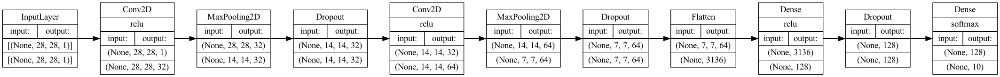
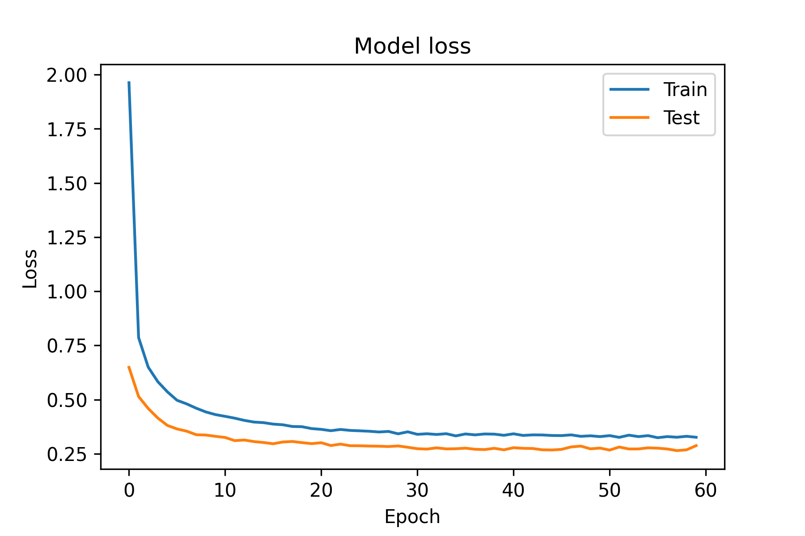

:PROPERTIES:
:ID:       31d6a744-f7f7-47e4-ae33-3f9fa91c33bb
:END:
#+title: CNN實作
#+SUBTITLE: 台南一中AI選修教材 / 顏永進
#+AUTHOR: 顏永進
#+HTML_HEAD: <link rel="stylesheet" type="text/css" href="../css/muse.css" />
#+HTML_HEAD: 
#+TAGS: AI
#+INCLUDE: ../pdf.org
#+OPTIONS: toc:2     ^:nil num:5
#+PROPERTY: header-args :python :python "/Users/letranger/Dropbox/notes/roam/venv/bin/python3" :eval never-export
#+EXCLUDE_TAGS: noexport
#+latex:\newpage
#+begin_export html

<!-- Google tag (gtag.js) -->

#+end_export

* CNN-Fashion-MNIST實作1
:PROPERTIES:
:ID:       faad1625-50cf-4dc6-aab2-9fa5a7967a0d
:END:
** 任務說明(資料集簡介)
*** 資料集
Fashion-MNIST是一個替代MNIST手寫數字集的圖像資料集。 它是由Zalando（一家德國的時尚科技公司）旗下的研究部門提供。其涵蓋了來自10種類別的共7萬個不同商品的正面圖片。Fashion-MNIST的大小、格式和訓練集/測試集劃分與原始的MNIST完全一致。60000/10000的訓練測試資料劃分，28x28的灰度圖片。你可以直接用它來測試你的機器學習和深度學習演算法性能，且不需要改動任何的程式碼[fn:1]。
*** 資料庫類別：
每個訓練和測試樣本都按照以下類別進行了標註：
|----------+----------------------|
| 標註編號 | 描述                 |
|----------+----------------------|
|        0 | T-shirt/top（T恤）   |
|        1 | Trouser（褲子）      |
|        2 | Pullover（套頭毛衣） |
|        3 | Dress（裙子）        |
|        4 | Coat（外套）         |
|        5 | Sandal（涼鞋）       |
|        6 | Shirt（襯衫）        |
|        7 | Sneaker（運動鞋）    |
|        8 | Bag（包包）          |
|        9 | Ankle boot（短靴）   |
|----------+----------------------|
這個資料集的樣子大致如下:
#+ATTR_LATEX: :width 500
#+ATTR_ORG: :width 500
#+ATTR_HTML: :width 500

數據集一共包含60000個訓練樣本和10000個測試樣本：
- 訓練數據，用來訓練模型；
- 測試數據，用來衡量最優模型的性能。
*** 為什麼不用更常見的MNIST手寫數字資料集
取代MNIST資料集的原因由如下幾個：
- MNIST太簡單了。很多深度學習演算法在測試集上的精準率已經達到99.6%！不妨看看我們基於scikit-learn上對經典機器學習演算法的評測 和這段程式碼： "Most pairs of MNIST digits can be distinguished pretty well by just one pixel"（翻譯：大多數MNIST只需要一個像素就可以區分開！）
- MNIST被用爛了。 參考："Ian Goodfellow wants people to move away from mnist"（翻譯：Ian Goodfellow希望人們不要再用MNIST了。）
- MNIST數字識別的任務不代表現代機器學習。 參考："François Cholle: Ideas on MNIST do not transfer to real CV" （翻譯：在MNIST上看似有效的想法沒法遷移到真正的機器視覺問題上。）
*** 任務
我們的任務是利用[[id:20221023T101228.247381][深度學習]]的方法建立一個[[id:20221023T101414.457264][卷積神經網路]]模型來識別出每張圖片屬於哪一個類別，在 *實作1* 中，我們打算建立一個最基本的CNN模型，只包含
- 一個卷積層
- 一個池化層
- 一個全連接層
就以這三個最基本的結構來測試[[id:20221023T101414.457264][卷積神經網路]]的圖形辨識能力。
*** 語言與程式庫
有很多函式庫和模組可以用來建立卷積神經網路 (CNN) 模型。一些受歡迎的選項包括 TensorFlow、Keras、PyTorch 和 scikit-learn。這些函式庫每個都有自己的優點和缺點，你選擇哪一個取決於你的特定需求和喜好。一般來說，TensorFlow 和 Keras 是初學者的好選擇，而 PyTorch 是一個更進階的選項，適合用於研發。scikit-learn 是一個機器學習函式庫，包含了許多用於訓練和評估機器學習模型（包括 CNN）的有用工具。你可以閱讀更多關於這些函式庫及其功能的信息，幫助你選擇適合你項目的選項。

在這個例子中我們將使用Python + TensorFlow函式庫來打造模型，雖然Python是在人工智慧領域應用最廣的語言，但其實只要上述介紹的函式庫支援，使用其他語言一樣可行，例如C/C++、Java、Go、R、Ruby以及Swift等等。

** 下載資料集/分割資料集
要使用TensorFlow函式庫，TensorFlow函式庫提供了十分方便的資料集下載函式(load_data())，只需一行指令便可下載Fashion-MNIST的60000張訓練集圖片和10000張測試集圖片。

- 程式中的x_train便是訓練集的60000張圖片，這是numpy格式的陣列(numpy.ndarray)，從其shape屬性可以得知這些圖片均為28x28的灰階圖片(如果是彩色則會是28X28X3)
- 至於y_train則是60000張x_train的標籤(或是類別)，這是60000X1的陣列，每張照片對映到一個代表類別的數字
#+name: session_init
#+begin_src python  -r -n :results output :exports both :session fashion :async
import tensorflow as tf

# 從網路下載資料集
(x_train, y_train), (x_test, y_test) = tf.keras.datasets.fashion_mnist.load_data()

print("訓練集圖片矩陣形狀(維度):", x_train.shape)
print("訓練集標籤矩陣形狀(維度):", y_train.shape)
#+end_src

#+RESULTS: session_init
: 訓練集圖片矩陣形狀(維度): (60000, 28, 28)
: 訓練集標籤矩陣形狀(維度): (60000,)

** 觀察資料集內容
那麼，資料集中的圖片與標籤實際內容又是如何呢？我們可以先挑第一張來看看：
#+begin_src python -r -n :results output :exports both :session fashion :async
print("第一張圖:")
for row in x_train[0]:
    for item in row:
        print('{0:3d} '.format(item), end='')
    print()
#+end_src

#+RESULTS:
#+begin_example
第一張圖:
  0   0   0   0   0   0   0   0   0   0   0   0   0   0   0   0   0   0   0   0   0   0   0   0   0   0   0   0
  0   0   0   0   0   0   0   0   0   0   0   0   0   0   0   0   0   0   0   0   0   0   0   0   0   0   0   0
  0   0   0   0   0   0   0   0   0   0   0   0   0   0   0   0   0   0   0   0   0   0   0   0   0   0   0   0
  0   0   0   0   0   0   0   0   0   0   0   0   1   0   0  13  73   0   0   1   4   0   0   0   0   1   1   0
  0   0   0   0   0   0   0   0   0   0   0   0   3   0  36 136 127  62  54   0   0   0   1   3   4   0   0   3
  0   0   0   0   0   0   0   0   0   0   0   0   6   0 102 204 176 134 144 123  23   0   0   0   0  12  10   0
  0   0   0   0   0   0   0   0   0   0   0   0   0   0 155 236 207 178 107 156 161 109  64  23  77 130  72  15
  0   0   0   0   0   0   0   0   0   0   0   1   0  69 207 223 218 216 216 163 127 121 122 146 141  88 172  66
  0   0   0   0   0   0   0   0   0   1   1   1   0 200 232 232 233 229 223 223 215 213 164 127 123 196 229   0
  0   0   0   0   0   0   0   0   0   0   0   0   0 183 225 216 223 228 235 227 224 222 224 221 223 245 173   0
  0   0   0   0   0   0   0   0   0   0   0   0   0 193 228 218 213 198 180 212 210 211 213 223 220 243 202   0
  0   0   0   0   0   0   0   0   0   1   3   0  12 219 220 212 218 192 169 227 208 218 224 212 226 197 209  52
  0   0   0   0   0   0   0   0   0   0   6   0  99 244 222 220 218 203 198 221 215 213 222 220 245 119 167  56
  0   0   0   0   0   0   0   0   0   4   0   0  55 236 228 230 228 240 232 213 218 223 234 217 217 209  92   0
  0   0   1   4   6   7   2   0   0   0   0   0 237 226 217 223 222 219 222 221 216 223 229 215 218 255  77   0
  0   3   0   0   0   0   0   0   0  62 145 204 228 207 213 221 218 208 211 218 224 223 219 215 224 244 159   0
  0   0   0   0  18  44  82 107 189 228 220 222 217 226 200 205 211 230 224 234 176 188 250 248 233 238 215   0
  0  57 187 208 224 221 224 208 204 214 208 209 200 159 245 193 206 223 255 255 221 234 221 211 220 232 246   0
  3 202 228 224 221 211 211 214 205 205 205 220 240  80 150 255 229 221 188 154 191 210 204 209 222 228 225   0
 98 233 198 210 222 229 229 234 249 220 194 215 217 241  65  73 106 117 168 219 221 215 217 223 223 224 229  29
 75 204 212 204 193 205 211 225 216 185 197 206 198 213 240 195 227 245 239 223 218 212 209 222 220 221 230  67
 48 203 183 194 213 197 185 190 194 192 202 214 219 221 220 236 225 216 199 206 186 181 177 172 181 205 206 115
  0 122 219 193 179 171 183 196 204 210 213 207 211 210 200 196 194 191 195 191 198 192 176 156 167 177 210  92
  0   0  74 189 212 191 175 172 175 181 185 188 189 188 193 198 204 209 210 210 211 188 188 194 192 216 170   0
  2   0   0   0  66 200 222 237 239 242 246 243 244 221 220 193 191 179 182 182 181 176 166 168  99  58   0   0
  0   0   0   0   0   0   0  40  61  44  72  41  35   0   0   0   0   0   0   0   0   0   0   0   0   0   0   0
  0   0   0   0   0   0   0   0   0   0   0   0   0   0   0   0   0   0   0   0   0   0   0   0   0   0   0   0
  0   0   0   0   0   0   0   0   0   0   0   0   0   0   0   0   0   0   0   0   0   0   0   0   0   0   0   0
#+end_example
以print輸出後可以看出這是一個28X28的二維矩陣，矩陣中的每個數值都是介於0到255間的整數，分別代表了每個點的不同灰階數值，先不管數值為何，我們可以隱約看出非零數值所組成的區域似乎是鞋子的形狀。如果將這些數值以圖片方式呈現，就能更清楚看出原始圖片的樣子：
#+begin_src python -r -n :results output :exports both :session fashion :async
import matplotlib.pyplot as plt

fig, axes = plt.subplots(2, 5, figsize=(12, 5))
fm_labels_short = ["T-shirt", "Trouser", "Pullover", "Dress", "Coat",
                   "Sandal", "Shirt", "Sneaker", "Bag", "Ankle boot"]
for i, ax in enumerate(axes.flat):
    ax.imshow(x_train[i], cmap='gray')
    ax.set_title(f"[{y_train[i]}] {fm_labels_short[y_train[i]]}")
    ax.axis('off')
plt.tight_layout()
plt.savefig('images/fashion-mnist-samples.png', dpi=150)
#+end_src

#+RESULTS:

#+ATTR_LATEX: :width 500
#+ATTR_ORG: :width 500
#+ATTR_HTML: :width 500

#+begin_src python -r -n :results output :exports both :session fashion :async
print(y_train[0])
#+end_src

#+RESULTS:
: 9

查了上面的對照表，發現分類9果然是短靴。當然，如果覺得常常要這樣對照太麻煩，也可以像底下這樣直接建一個矩陣來儲存實際分類。
#+begin_src python -r -n :results output :exports both :session fashion :async
fm_labels = ["T-shirt/top/T恤",      # index 0
             "Trouser/褲子",         # index 1
             "Pullover/套頭毛衣",     # index 2
             "Dress/裙子",           # index 3
             "Coat/外套",            # index 4
             "Sandal/涼鞋",          # index 5
             "Shirt/襯衫",           # index 6
             "Sneaker/運動鞋",       # index 7
             "Bag/包包",             # index 8
             "Ankle boot/短靴"]      # index 9

print(fm_labels[y_train[0]])
#+end_src

#+RESULTS:
: Ankle boot/短靴

** 將資料標準化/歸一化
資料標準化為資料前處理(data preprocessing)的一部份，為什麼資料在送進模型之前還要再處理過呢？

機器學習的核心是由資料去找出特徵與規則，是以資料的品質、特徵的選取決定了機器學習的上限，模型(Model)只是逼近這個上限[fn:2]。然而我們所收集到的資料多是是從使用者的角度下去規劃，不一定是最適合數學模型存取的樣子[fn:3]，而為了讓模型能夠發揮最大的效能，我們要先針對資料中的遺失值、異常值做處理，同時也要對資料進行標準化，讓資料更適合數學模型中。

例如：
- 在學生成績的資料集中，A生英文分數較B生高5分；B生數學成績較A生高5分，若要評比兩人的整體學業能力，還是要先分析此次考試的英、數成績分佈
- 又如，在房價資料集中，特徵值包括了樓層、房屋坪數、屋齡、當地犯罪率等，這些特徵值不僅數值大小存在差異，單位也不同，要放在一個模型中一起計算，可以將所有特徵值按比例縮放成為0~1間的數值，去掉單位特性。
很多演算法對資料範圍非常的敏感，例如，有的分類器需要計算樣本間的距離(如KNN)，一個特徵值的範圍非常大，那麼距離計算通常就會取決於這個特徵，若情況是範圍小的特徵比較重要的話，就會與我們所要的結果是相反的[fn:4]。為了要讓模型訓練的更強大，最好是對資料特徵數值進行調節，使得資料更適合這些演算法。

資料的標準化可分為兩個類型：
- Normalization (min-max normalization): 即將資料按照比例縮放,使之落入一個特定的區間(如0~1或-1~1)，例如$x'=\frac{x-min(x)}{max(x)-min(x)}$
- Standardization (standard deviation normalization): 即將資料減去平均數在除以標準差，使資料的分佈成為平均數為0、標準差為1的常態分佈，例如$z=\frac{x-\mu}{\sigma}$，這麼做的用途是因為很多數學分析方法都有資料常態假設。

此外，在標準化之前必須要把資料先分割好，然後再分別對訓練集與測試集做標準化,不然會有資料泄漏(data leakage)的問題，如果在未分割前就把所有資料標準化，那麼這些數值就會隱含著所有資料(包含測試集)的分佈訊息，進而影響模型[fn:5]。

理論上，對資料進行標準化可以提高模型的訓練速度與預測效能，但有些時候標準化並非必要程序，也不一定能發揮其優勢，應視模型與目標決定是否進行標準化。例如[fn:6]：
- 機率模型不需要標準化，因為這種模型不關心變數的取值，而是關心變數的分佈和變數之間的條件機率[fn:6]
- 神經網路需要標準化處理，一般變數的取值在-1到1之間，這樣做是為了弱化某些變數的值較大而對模型產生影響。一般神經網路中的隱藏層採用tanh啟動函數比sigmod啟動函數要好些，因為tanh雙曲正切函數的取值[-1,1]之間，均值為0。
- 在K近鄰演算法中，如果不對解釋變數進行標準化，那麼具有小數量級的解釋變數的影響就會微乎其微。
*** 實作
許多AI函式庫提供了方便的標準化函數，例如
#+begin_src python -r -n :results output :exports both :eval no
from sklearn import preprocessing
x_scaled = preprocessing.scale(x)
#+end_src

但在此例中，圖像的數值均介於0-255，但是在神經網路中數值越大收斂越慢，且會受到極端值的影響，使訓練效果不佳，故直接除以255也可以達到標準化的目的，讓所有數值介於0-1之間。
#+begin_src python -r -n :results output :exports both :session fashion :async
x_train = x_train.astype('float32') / 255
x_test = x_test.astype('float32') / 255
#+end_src

#+RESULTS:
驗證一下標準化後的數值是否都落在0到1之間：
#+begin_src python -r -n :results output :exports both :session fashion :async
print("標準化後數值範圍:")
print(f"  最小值: {x_train.min()}")
print(f"  最大值: {x_train.max()}")
print(f"  資料型態: {x_train.dtype}")
#+end_src

#+RESULTS:
: 標準化後數值範圍:
:   最小值: 0.0
:   最大值: 1.0
:   資料型態: float32

** 建立模型
做好資料預處理，接下來就能動手建立模型了，在這裡我們使用Keras這個基於TensorFlow所開發的深度學習函式庫，Keras提供了許多簡單易用的模型建構函式，十分適合快速建立模型，讓使用者不用太過關注底層細節。 底下是一個非常基本的卷積神經網路模型:

- 第一層為卷積層，有32個神經元，便用2X2的卷積核，也就是第4行中的kernel_size=2，啟動函數則是常見的relu，這層同時也負責接收資料，在這裡需將資料的形狀明確定義清楚，這裡為28,28,1，是因為這是灰階，如果是彩色圖片，則是28,28,3，代表每個點有RGB三種頻色。
- 第二層為池化層，使用2X2的池化核，也就是程式中的第6行
- 第8行的Flatten函式負責將資料送至輸出層之前先對資料進行攤平處理
- 最後一層為輸出層，也是全連接層(Dense)，這層有10個神經元，使用softmax這個激活函數來計算這張圖片可能屬於哪一個類別的機率值
#+begin_src python -r -n :results output :exports both :session fashion :async
#建構模型
model = tf.keras.Sequential()
#輸入層/卷積層
model.add(tf.keras.layers.Conv2D(filters=32, kernel_size=2, activation='relu', input_shape=(28,28,1)))
#池化層
model.add(tf.keras.layers.MaxPooling2D(pool_size=2))
#攤平
model.add(tf.keras.layers.Flatten())
#全連接層/輸出層
model.add(tf.keras.layers.Dense(10, activation='softmax'))
#+end_src

#+RESULTS:
: 2022-12-16 09:12:30.811271: I tensorflow/core/platform/cpu_feature_guard.cc:151] This TensorFlow binary is optimized with oneAPI Deep Neural Network Library (oneDNN) to use the following CPU instructions in performance-critical operations:  AVX2 FMA
: To enable them in other operations, rebuild TensorFlow with the appropriate compiler flags.

在CoLab上執行剛才的程式碼並不會有任何輸出，我們可以藉由summary函式來查看模型的基本架構。透過summary()函式，keras會幫我們算出這個模型裡有多少需要計算的權重參數，目前有54,250個。
#+begin_src python -r -n :results output :exports both :session fashion :async
model.summary()
#+end_src

#+RESULTS:
#+begin_example
Model: "sequential"
_________________________________________________________________
 Layer (type)                Output Shape              Param #
=================================================================
 conv2d (Conv2D)             (None, 27, 27, 32)        160

 max_pooling2d (MaxPooling2D  (None, 13, 13, 32)       0
 )

 flatten (Flatten)           (None, 5408)              0

 dense (Dense)               (None, 10)                54090

=================================================================
Total params: 54,250
Trainable params: 54,250
Non-trainable params: 0
_________________________________________________________________
#+end_example
TensorFlow另外提供了一個讓模型更佳視覺化的工具：plot_model()函式，這個函式可以將模型的結構以更具體的圖形來表達。我們不但可以從中看出模型的架構，還能看出資料在不同模型間的維度變化，例如輸入層的圖像原本為28*28，經過卷積層卷積計算後就變成27*27，再經過池化層池化後就剩13*13.
#+begin_src python -r -n :results output :exports both :session fashion :async
tf.keras.utils.plot_model(
    model,
    to_file='images/model-1.png',
    show_shapes=True,
    show_dtype=None,
    show_layer_names=None,
    rankdir='LR',
    expand_nested=True,
    dpi=96,
    layer_range=None,
    show_layer_activations=True
)
#+end_src

#+RESULTS:

#+CAPTION: CNN模型架構（實作1）
#+LABEL:fig:model-1
#+name: fig:model-1
#+ATTR_LATEX: :width 500
#+ATTR_ORG: :width 500
#+ATTR_HTML: :width 500

** 模型編譯
在正式訓練模型之前，我們要先對模型進行編譯(compile)，這裡主要是要宣告等下要訓練模型的三個重要方法：如何找到所有參數的最佳值(optimizer)、如何評估預測結果(loss)、如何評估模型整體效能(metrics)。
Keras用compile函式來指定這三個方法：
- loss: 即損失函數，其實就是去比較模型的預測結果與真實答案的差異，顯然這個數值越小越好。損失函數的類型很多，因為此次任務為分類預測，而且資料的標籤尚未進行one-hot-encoding轉換(留在實作2)，所以我們選擇sparse_categorical_crossentropy做為loss function。
- optimizer: 即優化器，我們在國中應該都學過就是微積分找極值，而在深度學習中就是改良找極值的方式去做到最佳化的，我們叫這種方式為梯度下降(Gradient Descent)[fn:7]。和損失函數一樣，可用的optimizer方法也有很多，這裡我們直接選擇最常用的adam。
- metrics: 即效能指標，這是評估模型整體效能的標準，這個數值越高，表示模型的預測效能越好。我們使用最常用的accuracy，也就是模型正確預測的機率
#+begin_src python -r -n :results output :exports both :session fashion :async
model.compile(loss='sparse_categorical_crossentropy', optimizer='adam', metrics=['accuracy'])
#+end_src

#+RESULTS:

Keras中可用的損失函數可以從官網[[https://keras.io/api/losses/][Keras API reference / Losses]]找到、可用的優化器也可以從官網[[https://keras.io/api/optimizers/][Keras API reference / Optimizers]]查到，至於可用的模型效能指標則在[[https://keras.io/api/metrics/][Keras API reference / Metrics]]。

** 模型訓練
建立完模型架構後就可以開始訓練，所謂訓練就是將資料丟進模型中，讓模型(透過優化器)找出模型中每個參數（上面的Trainable params，共有54,250個)的最佳數值。Keras使用fit函式來進行訓練，訓練時要宣告以下兩個參數值：
- epochs: 所有的資料全都被用來訓練模型一次稱為1個epoch，如果一個資料集很小（只有100張圖)，那麼把這100張圖全部丟進模型訓練就完成了一個epoch的訓練。至於這整個流程應該重複幾次則沒有一定標準，一個簡單的判斷標準是：如果損失函數已經無法隨著epoch的重複而降低，則重複再多次也是罔然。
- batch_size: 由於訓練的資料集一般數量都極為龐大，不太可能一口氣全部丟進模型中去訓練 ，因為電腦的記憶體畢竟有限，batch_size就是用來指定每次要丟入模型中去訓練的資料數量。這個資料集共有60,000張圖，如果我們決定每次丟100張圖，則每個epoch就要分600次(60,000/100)次完成，每一次以一個batch的資料進行訓練稱為一次迭代(iteration)，模型每完成一次迭代的訓練，就會修正下一次訓練參數的方向。

Epoch、batch_size與iteration的數學關係如下：
#+begin_verse
iteration = (資料集大小/batch_size)*epoch
#+end_verse
以剛才的例子，如果epochs=5、batch_size=100，則iteration大小為600*5=3000次。即換句話說，batch_size越大、iteration也就越小。

Batch Size的大小影響模型的最佳化程度和速度，但如何設定batch_size最好並沒有一定的標準，需考慮模型的建立目標、學習率(learning rate, 不在本單元介紹內容)、訓練集與測試集的比例與訓練時使用的設備。原則上，batch size增加雖有助於提高訓練速度，但可能會降低模型泛化(generalization)能力而導致過擬合；若batch size太小(例如batch_size=1)，則模型訓練會花費較多時間，也會導致模型難以收歛。

在這個例子中我們利用Keras的fit函數來進行模型的訓練，其中batch size設為100、epoch設為5
#+begin_src python -r -n :results output :exports both :session fashion :async
model.fit(x_train, y_train, batch_size=100, epochs=5)
#+end_src

#+RESULTS:
#+begin_example
Epoch 1/5
600/600 [==============================] - 7s 11ms/step - loss: 0.2756 - accuracy: 0.9023
Epoch 2/5
600/600 [==============================] - 7s 12ms/step - loss: 0.2634 - accuracy: 0.9067
Epoch 3/5
600/600 [==============================] - 7s 12ms/step - loss: 0.2541 - accuracy: 0.9089
Epoch 4/5
600/600 [==============================] - 7s 11ms/step - loss: 0.2455 - accuracy: 0.9126
Epoch 5/5
600/600 [==============================] - 7s 11ms/step - loss: 0.2392 - accuracy: 0.9143
#+end_example

此處的batch size與epoch都屬於超參數，是由訓練者自行設定而非模型自己學習得來。Batch Size的選擇，會影響梯度下降的方向。
*** Batch size 怎麼選？[fn:8][fn:9]
- *太小*（例如 batch_size=1）：每次只看一個樣本就修正方向，梯度隨機性太高，模型像無頭蒼蠅一樣橫衝直撞，難以收斂，訓練也非常慢。
- *太大*（例如 batch_size=整個資料集）：方向倒是很穩定，但記憶體可能會先爆掉；而且梯度方向幾乎不再變化，模型容易卡在局部最小值，泛化能力反而下降。
- *如何平衡*：在合理範圍內增大 batch size 可以加速訓練、穩定梯度方向，但超過某個臨界點後效益就會遞減。實務上常見的 batch size 為 32、64、128，需要根據資料量與硬體記憶體做調整，沒有萬用的最佳值。
** 測試性能
訓練完模型後，我們就可以直接拿模型來預測一下效果，並且評估模型的整體效能。
我們拿測試集資料來考核一下這個新出爐的模型，使用keras的predict()函式來進行預測的第一張。
predict()預測的對象是整個測試集的資料，取出第一張的預測結果方式如下：
#+begin_src python -r -n :results output :exports both :session fashion :async
# 拿模型來預測測試集第0張的圖片並對照答案
pred = model.predict(x_test)[0]
print(pred)
#+end_src

#+RESULTS:
: [1.0484946e-06 1.5833010e-09 9.3383994e-07 4.2176248e-07 1.5503476e-06
:  3.2520618e-03 5.2338710e-06 4.1659037e-03 2.4713489e-04 9.9232578e-01]

可以看出這個結果是10個小數，代表模型認為這張圖為對10個分類的可能性(以科學記號表示)，這10個可能性總和為1，這便是softmax函數的輸出樣貌。看的出來最後一個類別的數值最大(0.99）。那麼，這張圖的正確類別是什麼呢？我們可以將答案y_test[0]輸出，結果發現為9，表示這次的預測是正確的。

最後，我們還能利用evaluate()函式對模型的整體效能進行評估：
#+begin_src python -r -n :results output :exports both :session fashion :async
score = model.evaluate(x_test, y_test)
print('loss:', score[0])
print('accuracy:', score[1])
#+end_src

#+RESULTS:
: 313/313 [==============================] - 1s 1ms/step - loss: 0.2894 - accuracy: 0.8950
: loss: 0.28943511843681335
: accuracy: 0.8949999809265137

evaluate()會傳回loss與accuracy兩個值[fn:10]:
- loss是依我們在compile模型時設定的損失函數計算得來的損失值，loss越低，模型越好（當模型沒有過擬合時）。它不是一個百分比，而是一次epoch中訓練集樣本或驗證集樣本所有error的和。通過損失函數的計算，從而更新我們的模型參數，目標是為了減小最佳化誤差(Optimization error)，即在損失函數與最佳化演算法的共同作用下，減小模型的經驗風險。
- accuracy則是模型在資料集上的預測精準率，目標是對模型的效果進行度量。在分類問題中，精準率的定義簡單粗暴，就是看預測的類別是否和真實的類別一致。accuracy是當模型的參數學習得到並固定後來計算得到的。通過比較真實標籤和預測標籤來確定的0-1損失。它是一個百分比值。

此次評估結果，本模型的損失值(loss)約為0.34、精準率(accuracy)約為0.90。

模型的訓練是通過減少loss為目的的，即最小化loss function，至於最小化後的模型表現如何則由accuracy來做為效能指標。如神經網路中採用反向傳播對模型參數求導。loss隱含著每一次最佳化迭代後模型表現的好壞。最佳化訓練的目標是loss值，而不是accuracy，因為loss function可以求導最佳化，而accuracy不能夠求導。
*** loss與accuracy的關係[fn:11]
清楚了定義之後，仔細思考就會發現其中的問題，因為精準率是輸出最大的機率，因此0.9的機率值和0.5的機率值效果是等價的，只要保證他們是最大機率即可！請看下面的例子：
比如我們現在預測貓和狗的類別，
有一個樣本預測輸出是[0.1, 0.9], 它的交叉熵損失為loss = -1* log(0.9) = 0.046, 預測結果為：狗
另一個樣本的預測輸出是[0.4, 0.6], 它的交叉熵損失為loss = -1 * log(0.6) = 0.222, 預測結果為：狗
可以看出兩個樣本都預測的為狗，但是他們的交叉熵損失差別很大。因此我們在訓練時，可能會出現精準率和交叉熵同時上升的情況。
*** 為什麼要用兩個指標[fn:11]
既然精準率和損失都是評價模型好壞的，那麼用一個不行嗎？為什麼要用兩個並不完全等價的評價指標呢？
這是因為，在分類問題中，可能精準率更加的直觀，也更具有可解釋性，更重要，但是它不可微，無法直接用於網路訓練，因為反向傳播演算法要求損失函數是可微的。而損失函數一個很好的性質就是可微，可以求梯度，運用反向傳播更新參數。即首選損失不能直接最佳化(比如精準率)時，可以使用與真實度量類似的損失函數。 損失函數的可微性，使得可以採用多種方式進行最佳化求解，例如牛頓法、梯度下降法、極大似然估計等。另外在分類任務中，使用accuracy可以，但是在回歸任務中，accuracy便不再可用，只能使用loss。

通過模型在 dev/test 集上的 accuracy ，計算模型正確分類的樣本數與總樣本數之比以衡量模型的效果，目標是對模型的效果進行度量。
通過損失函數的計算，更新模型參數，目標是為了減小最佳化誤差(Optimization error)，即在損失函數與最佳化演算法的共同作用下，減小模型的經驗風險。
總結精準度和交叉熵會出現以下情況：

如果正確標籤的機率降低，但這個標籤依然是機率最高的，會出現損失增加但精準度不變的結果。
如果資料集的標籤很不平均，比如90%是類別A，那麼模型一味增加預測A的比例，可能會讓精準度上升，但loss可能也會以更大幅度上升（cross entropy的幅度可以很大）
如果模型非常自信，大多數正確標籤的機率都接近1，那如果出現一個錯誤，精準率可能只會降低很少，但交叉熵可能會非常高。
*** 關於loss與accuracy的另一種比諭說法[fn:12]
一個更通俗的例子是：一個數學老師，在努力提高同學們的平均分，但期末考核的指標卻是及格率（60分及格）。假如平均分是100分（也就意味著所有同學都考到了100分），那麼自然及格率是100%，這是最理想的。但現實不一定這麼美好，平均分越高，只要平均分還沒有達到100，那麼及格率卻不一定越高，比如兩個人分別考40和90，那麼平均分就是65，及格率只有50%；如果兩個人的成績都是60，平均分就是60，及格率卻有100%。這也就是說，平均分可以作為一個目標，但這個目標並不直接跟考核目標掛鉤。

那麼，為了提升最後的考核目標，這個老師應該怎麼做呢？很顯然，首先看看所有學生中，哪些同學已經及格了，及格的同學先不管他們，而針對不及格的同學進行補課加強，這樣一來，原則上來說有很多不及格的同學都能考上60分了，也有可能一些本來及格的同學考不夠60分了，但這個過程可以迭代，最終使得大家都在60分以上，當然，最終的平均分不一定很高，但沒辦法，誰叫考核目標是及格率呢？

* CNN-Fashion-MNIST實作2
:PROPERTIES:
:ID:       511b9ae8-81bb-4bcd-a50c-a0cf96719a77
:END:
在實作1中我們以卷積層、池化層、激活函數與全連接層建構出最簡單的模型，同時評估了一下整體的效能。
但是，這個模型到底夠不夠好？實際上線時效能如何？這些才是我們真正關心的，這也是在實作2這個單元中我們要探究的問題。
在實作2裡，我們要再進一步詳細的評估模型的效能，接下來變更模型的架構，最後再次評估模型的成效，看看我們重新設計的架構是否有助於優化模型。
** 進一步查看效能
訓練模型只是整個模型建構的一部份，後續的模型調校以提高模型效能才是我們的目的。為了更清楚模型的效能，我們將epoch的次數增加到50次，以測試集這個模型在訓練過程中沒有看過的資料(x_test, y_test)來驗證一下模型效能，並將每個epoch的效能驗證結果(就是後面的validation_data)記錄下來，全部先存到history中。

這次的訓練會花掉比實作1更多時間，建議訓練前先打開colab加速器。
#+ATTR_LATEX: :width 400
#+ATTR_ORG: :width 400
#+ATTR_HTML: :width 500

#+begin_src python -r -n :results output :exports both :session fashion :async
history = model.fit(x_train, y_train, batch_size=100, epochs=60,
                   validation_data=(x_test, y_test))
#+end_src

#+RESULTS:
#+begin_example
Epoch 1/60
600/600 [==============================] - 7s 12ms/step - loss: 0.2333 - accuracy: 0.9170 - val_loss: 0.2860 - val_accuracy: 0.8968
Epoch 2/60
600/600 [==============================] - 7s 12ms/step - loss: 0.2277 - accuracy: 0.9181 - val_loss: 0.2916 - val_accuracy: 0.8970
Epoch 3/60
600/600 [==============================] - 8s 13ms/step - loss: 0.2228 - accuracy: 0.9202 - val_loss: 0.2830 - val_accuracy: 0.8983
...（中間省略）...
Epoch 58/60
600/600 [==============================] - 7s 12ms/step - loss: 0.1109 - accuracy: 0.9604 - val_loss: 0.3729 - val_accuracy: 0.8952
Epoch 59/60
600/600 [==============================] - 8s 13ms/step - loss: 0.1098 - accuracy: 0.9610 - val_loss: 0.3523 - val_accuracy: 0.9003
Epoch 60/60
600/600 [==============================] - 7s 12ms/step - loss: 0.1103 - accuracy: 0.9608 - val_loss: 0.3637 - val_accuracy: 0.8952
#+end_example
由程式的輸出結果可以看出，loss與val_loss這兩個矩陣內各有60個數值
#+begin_src python -r -n :results output :exports both :session fashion :async
print(len(history.history['loss']))
print(len(history.history['val_loss']))
#+end_src
以print()函式將其內容輸出，其內容就是60次epoch訓練時每一次的模型損失值
#+begin_src python -r -n :results output :exports both :session fashion :async
print('train loss:',history.history['loss'])
print('test loss:',history.history['val_loss'])
#+end_src
接下來將每次的損失值(loss)由歷史記錄中取出，畫成折線圖
#+begin_src python -r -n :results output :exports both :session fashion :async
import matplotlib.pyplot as plt
#取出每次的訓練資料損失值
plt.plot(history.history['loss'])
#取出每次的測試資料損失值
plt.plot(history.history['val_loss'])
#加上標題
plt.title('Model loss')
#加上y軸標籤
plt.ylabel('Loss')
#加上x軸標籤
plt.xlabel('Epoch')
#顯示折線的名稱
plt.legend(['Train', 'Test'])
#顯示折線圖
plt.savefig('images/cnn-eva-2.png', dpi=300)
#plt.show()
#+end_src

#+RESULTS:
: DEPRECATION WARNING: The system version of Tk is deprecated and may be removed in a future release. Please don't rely on it. Set TK_SILENCE_DEPRECATION=1 to suppress this warning.

如圖所示，雖然模型在訓練資料集的損失值隨著訓練次數(epoch)的增加而降低，然而模型對測試資集的損失值卻不減反增，這表示這個模型對於陌生的資料效果不佳，這就是就是所謂的過擬合(overfitting)現象。
接下來我們打算進一步改善一下這個模型。
#+ATTR_LATEX: :width 400
#+ATTR_ORG: :width 400
#+ATTR_HTML: :width 500

** 轉換label資料格式
首先要解決的是資料集的標籤表示法。這個模型的任務是進行分類，在資料集中以數字0~9來表示10種不同的分類，雖然從精準率看來效能還可以，但這種表示法隱含了一些問題。我們以數字來表示分類，這會讓模型誤會這些分類是連續、有序的，也就是說，第2類比第1類大，第3類到第5類的距離等於第5類到第7類的距離，這顯然是荒謬錯誤的。
解決這個問題的方式是使用one-hot encoding(獨熱編碼)，方法是使用N個位元來表示N個類別，以這個資料集為例，原本的的類別和轉換過後的分別如下:
- 0: 0000000001
- 1: 0000000010
- 2: 0000000100
- 3: 0000001000
- ...
- 9: 1000000000
這樣轉換，除了解決原本的分類變成數值的問題，如果是對特徵值進行one-hot encoding轉換，則在一定程度上也會起到擴充特徵的作用。但是這種編碼也有其應用上的限制，例如，當類別數量很龐大時，使用one-hot encoding就會導致特徵空間變成非常大，形成一個高維的稀疏矩陣。這種情況下就要使用主成分分析(PCA, Principal Component Analysis)來對資料維度進行縮減，也就是降維。

Keras提供的to_categorical()函式可以讓我們簡單快速的對資枓集中的分類進行one-hot encoding轉換，從下例中也可以看到原始資料與轉換後資料的比對。
#+begin_src python -r -n :results output :exports both :session fashion :async
from tensorflow.keras.utils import to_categorical
print('第一張圖的類別(轉換前):',y_train[0])
# 將label進行one-hot encoding轉換
y_train = to_categorical(y_train)
y_test = to_categorical(y_test)
print('第一張圖的類別(轉換後):',y_train[0])
# model.compile的loss改為'categorical_crossentropy'
#+end_src

#+RESULTS:
: 第一張圖的類別(轉換前): 9
: 第一張圖的類別(轉換後): [0. 0. 0. 0. 0. 0. 0. 0. 0. 1.]

此外，由於分類改為one-hot encoding，故後續的模型編譯所使用的loss function就可以改選categorical_crossentropy。
** 增加卷積層、池化層、Dropout層以及全連接層
接下來我們試著增加模型中卷積層、池化層與全連接層的層數，同時為了解決過擬合的問題，我們也在各層中加入Dropout層，其目的是隨機丟掉(重置)一些神經元的參數，Dropout()裡的數值為所要丟棄的神經元百分比。
#+begin_src python -r -n :results output :exports both :session fashion :async
model = tf.keras.Sequential()
# 輸入層/第1個卷積層
model.add(tf.keras.layers.Conv2D(filters=32, kernel_size=3, padding='same', activation='relu', input_shape=(28,28,1)))
# 第1個池化層
model.add(tf.keras.layers.MaxPooling2D(pool_size=2))
# 第1個Dropout層
model.add(tf.keras.layers.Dropout(0.5))
# 第2個卷積層
model.add(tf.keras.layers.Conv2D(filters=64, kernel_size=5, padding='same', activation='relu'))
# 第2個池化層
model.add(tf.keras.layers.MaxPooling2D(pool_size=2))
# 第2個Dropout層
model.add(tf.keras.layers.Dropout(0.5))
# 攤平
model.add(tf.keras.layers.Flatten())
# 第一個全連接層
model.add(tf.keras.layers.Dense(128, activation='relu'))
# 第3個Dropout層
model.add(tf.keras.layers.Dropout(0.5))
# 第2個全連接層/輸出層
model.add(tf.keras.layers.Dense(10, activation='softmax'))
#+end_src
建立完新模型，我們可以再用summary()函式查看新的模型架構，對比右邊的實作1原始模型，可以看出此新模型所需訓練的權重參數由原來的54,250個增加到454,410個
#+begin_src python -r -n :results output :exports both :session fashion :async
# 查看模型結構
model.summary()
#+end_src
#+RESULTS:
#+begin_example
Model: "sequential_1"
_________________________________________________________________
 Layer (type)                Output Shape              Param #
=================================================================
 conv2d_1 (Conv2D)           (None, 28, 28, 32)        320

 max_pooling2d_1 (MaxPooling  (None, 14, 14, 32)       0
 2D)

 dropout (Dropout)           (None, 14, 14, 32)        0

 conv2d_2 (Conv2D)           (None, 14, 14, 64)        51264

 max_pooling2d_2 (MaxPooling  (None, 7, 7, 64)         0
 2D)

 dropout_1 (Dropout)         (None, 7, 7, 64)          0

 flatten_1 (Flatten)         (None, 3136)              0

 dense_1 (Dense)             (None, 128)               401536

 dropout_2 (Dropout)         (None, 128)               0

 dense_2 (Dense)             (None, 10)                1290

=================================================================
Total params: 454,410
Trainable params: 454,410
Non-trainable params: 0
_________________________________________________________________
#+end_example
如同實作1以tf.keras.utils.plot_model()函式查看圖形化模型架構
#+begin_src python -r -n :results output :exports both :session fashion :async
tf.keras.utils.plot_model(
    model,
    to_file='images/model-2.png',
    show_shapes=True,
    show_dtype=None,
    show_layer_names=None,
    rankdir='LR',
    expand_nested=True,
    dpi=96,
    layer_range=None,
    show_layer_activations=True
)
#+end_src
#+ATTR_LATEX: :width 800
#+ATTR_ORG: :width 800
#+ATTR_HTML: :width 500

** 測試性能
接下來便是對這個修改過後的模型進行編譯及訓練
#+begin_src python -r -n :results output :exports both :session fashion :async
model.compile(loss='categorical_crossentropy', optimizer='adam', metrics=['accuracy'])
history = model.fit(x_train, y_train, batch_size=100, epochs=50,
                   validation_data=(x_test, y_test))
#+end_src

#+RESULTS:
#+begin_example
Epoch 1/50
600/600 [==============================] - 46s 76ms/step - loss: 0.6692 - accuracy: 0.7549 - val_loss: 0.4094 - val_accuracy: 0.8506
Epoch 2/50
600/600 [==============================] - 49s 81ms/step - loss: 0.4468 - accuracy: 0.8389 - val_loss: 0.3485 - val_accuracy: 0.8720
Epoch 3/50
600/600 [==============================] - 44s 74ms/step - loss: 0.3956 - accuracy: 0.8575 - val_loss: 0.3261 - val_accuracy: 0.8821
...（中間省略）...
Epoch 48/50
600/600 [==============================] - 42s 70ms/step - loss: 0.2243 - accuracy: 0.9162 - val_loss: 0.2124 - val_accuracy: 0.9244
Epoch 49/50
600/600 [==============================] - 41s 69ms/step - loss: 0.2254 - accuracy: 0.9151 - val_loss: 0.2122 - val_accuracy: 0.9225
Epoch 50/50
600/600 [==============================] - 42s 70ms/step - loss: 0.2273 - accuracy: 0.9143 - val_loss: 0.2091 - val_accuracy: 0.9236
#+end_example
** 再查看效能
完成訓練後再將各個epoch的loss變化畫成折線圖，由圖中的折線變化可以看出，不但整體loss降低，模型也沒有再出現過擬合的現象，模型對於訓練集與測試集資料的損失值都隨著訓練次數而不斷下降
#+begin_src python -r -n :results output :exports both  :session fashion :async
import matplotlib.pyplot as plt
#train loss
plt.plot(history.history['loss'])
#test loss
plt.plot(history.history['val_loss'])
#標題
plt.title('Model loss')
#y軸標籤
plt.ylabel('Loss')
#x軸標籤
plt.xlabel('Epoch')
#顯示折線的名稱
plt.legend(['Train', 'Test'])
#顯示折線圖
plt.savefig('images/cnn-eva-3.png', dpi=300)
#+end_src

#+RESULTS:

#+CAPTION: 改良後CNN模型損失值變化（實作2）
#+LABEL:fig:cnn-eva-3
#+name: fig:cnn-eva-3
#+ATTR_LATEX: :width 300
#+ATTR_ORG: :width 300
#+ATTR_HTML: :width 500

最後輸出model的整體loss與accuracy
#+begin_src python -r -n :results output :exports both :session fashion :async
score = model.evaluate(x_test, y_test)
print('loss:', score[0])
print('accuracy:', score[1])
#+end_src

#+RESULTS:
: 313/313 [==============================] - 3s 6ms/step - loss: 0.2091 - accuracy: 0.9236
: loss: 0.2090652883052826
: accuracy: 0.9236000180244446
** 有沒有其他的效能提升建議
- 以Keras的ImageDataGenerator多產生額外的影像資料(旋轉、偏移、放大、縮小)，增加變異性[fn:13]
- 加入驗證集
- 改變batch size、epoch、optimizer

* 課堂練習
** 練習一：換個資料集——MNIST 手寫數字辨識
Fashion-MNIST 跟經典的 MNIST 手寫數字資料集格式完全一樣（都是 28×28 灰階圖、10 個類別），只是一個認衣服、一個認數字。既然我們已經會辨識衣服了，何不試試看辨識數字有多簡單？

底下是一個精簡版的 Fashion-MNIST CNN 流水線，從載入到評估一氣呵成：
#+begin_src python -r -n :results output :exports both :session ex1 :async
import tensorflow as tf

# 載入資料集
(x_train, y_train), (x_test, y_test) = tf.keras.datasets.fashion_mnist.load_data()

# 標準化
x_train = x_train.astype('float32') / 255
x_test = x_test.astype('float32') / 255

# 類別名稱
labels = ["T-shirt", "Trouser", "Pullover", "Dress", "Coat",
          "Sandal", "Shirt", "Sneaker", "Bag", "Ankle boot"]

# 建立模型
model = tf.keras.Sequential([
    tf.keras.layers.Conv2D(32, kernel_size=2, activation='relu', input_shape=(28,28,1)),
    tf.keras.layers.MaxPooling2D(pool_size=2),
    tf.keras.layers.Flatten(),
    tf.keras.layers.Dense(10, activation='softmax')
])

# 編譯
model.compile(loss='sparse_categorical_crossentropy', optimizer='adam', metrics=['accuracy'])

# 訓練
model.fit(x_train, y_train, batch_size=100, epochs=5, verbose=1)

# 評估
score = model.evaluate(x_test, y_test)
print(f'\n測試集 loss: {score[0]:.4f}')
print(f'測試集 accuracy: {score[1]:.4f}')
#+end_src

*** 你的任務
請修改上面的程式碼，把資料集從 =fashion_mnist= 改成 =mnist=（手寫數字 0-9）。你只需要改兩個地方：
1. 載入資料集那行：把 =fashion_mnist= 改成 =mnist=
2. 類別名稱：改成 =["0", "1", "2", "3", "4", "5", "6", "7", "8", "9"]=

*** 預期輸出
你應該會發現測試集的 accuracy 從 Fashion-MNIST 的 ~90% 直接跳到 ~99%。原因很簡單：辨識手寫數字比辨識衣服容易太多了——這也是為什麼 MNIST 被嫌棄「太簡單」而被 Fashion-MNIST 取代的原因。

#+begin_example
測試集 loss: 0.05xx
測試集 accuracy: 0.98xx
#+end_example

*** 參考解答                                                     :noexport:
#+begin_src python -r -n :results output :exports both :session ex1_ans :async
import tensorflow as tf

# 改這行：fashion_mnist → mnist
(x_train, y_train), (x_test, y_test) = tf.keras.datasets.mnist.load_data()

x_train = x_train.astype('float32') / 255
x_test = x_test.astype('float32') / 255

# 改這行：類別名稱改為數字
labels = ["0", "1", "2", "3", "4", "5", "6", "7", "8", "9"]

model = tf.keras.Sequential([
    tf.keras.layers.Conv2D(32, kernel_size=2, activation='relu', input_shape=(28,28,1)),
    tf.keras.layers.MaxPooling2D(pool_size=2),
    tf.keras.layers.Flatten(),
    tf.keras.layers.Dense(10, activation='softmax')
])

model.compile(loss='sparse_categorical_crossentropy', optimizer='adam', metrics=['accuracy'])
model.fit(x_train, y_train, batch_size=100, epochs=5, verbose=1)

score = model.evaluate(x_test, y_test)
print(f'\n測試集 loss: {score[0]:.4f}')
print(f'測試集 accuracy: {score[1]:.4f}')
#+end_src

** 練習二：模型改造——你能讓準確率超過 92% 嗎？
實作 1 的基礎模型（1 個卷積層 + 1 個池化層 + 1 個全連接層）在 Fashion-MNIST 上大約只能拿到 ~90% 的 accuracy。但我們在實作 2 看到，加深模型架構可以把準確率提升到 ~92%。現在輪到你自己動手改造模型了。

底下是基礎模型，請你改造它：
#+begin_src python -r -n :results output :exports both :session ex2 :async
import tensorflow as tf

(x_train, y_train), (x_test, y_test) = tf.keras.datasets.fashion_mnist.load_data()
x_train = x_train.astype('float32') / 255
x_test = x_test.astype('float32') / 255

# === 請修改以下模型架構 ===
model = tf.keras.Sequential([
    tf.keras.layers.Conv2D(32, kernel_size=2, activation='relu', input_shape=(28,28,1)),
    tf.keras.layers.MaxPooling2D(pool_size=2),
    # TODO: 在這裡加入更多層
    tf.keras.layers.Flatten(),
    tf.keras.layers.Dense(10, activation='softmax')
])
# === 修改到此為止 ===

model.compile(loss='sparse_categorical_crossentropy', optimizer='adam', metrics=['accuracy'])
model.fit(x_train, y_train, batch_size=100, epochs=10, verbose=1)

model.summary()
score = model.evaluate(x_test, y_test)
print(f'\n測試集 loss: {score[0]:.4f}')
print(f'測試集 accuracy: {score[1]:.4f}')
#+end_src

*** 你的任務
在模型中加入以下三樣東西（提示：加在 =# TODO= 那行的位置）：
1. 第二組卷積 + 池化：=Conv2D(64, kernel_size=2, activation='relu')= 接 =MaxPooling2D(pool_size=2)=
2. 一個 Dropout 層：=Dropout(0.25)=（隨機丟掉 25% 的神經元，防止過擬合）
3. 一個隱藏的全連接層：在 Flatten 之後、輸出層之前加一個 =Dense(128, activation='relu')=

*** 預期輸出
改造後的 model.summary() 應該會顯示更多層和更多參數，val_accuracy 應該會提升到 ~91-92%。

#+begin_example
測試集 loss: 0.2xxx
測試集 accuracy: 0.91xx
#+end_example

*** 參考解答                                                     :noexport:
#+begin_src python -r -n :results output :exports both :session ex2_ans :async
import tensorflow as tf

(x_train, y_train), (x_test, y_test) = tf.keras.datasets.fashion_mnist.load_data()
x_train = x_train.astype('float32') / 255
x_test = x_test.astype('float32') / 255

model = tf.keras.Sequential([
    tf.keras.layers.Conv2D(32, kernel_size=2, activation='relu', input_shape=(28,28,1)),
    tf.keras.layers.MaxPooling2D(pool_size=2),
    # 加入第二組卷積+池化
    tf.keras.layers.Conv2D(64, kernel_size=2, activation='relu'),
    tf.keras.layers.MaxPooling2D(pool_size=2),
    # 加入 Dropout 防止過擬合
    tf.keras.layers.Dropout(0.25),
    tf.keras.layers.Flatten(),
    # 加入隱藏的全連接層
    tf.keras.layers.Dense(128, activation='relu'),
    tf.keras.layers.Dense(10, activation='softmax')
])

model.compile(loss='sparse_categorical_crossentropy', optimizer='adam', metrics=['accuracy'])
model.fit(x_train, y_train, batch_size=100, epochs=10, verbose=1)

model.summary()
score = model.evaluate(x_test, y_test)
print(f'\n測試集 loss: {score[0]:.4f}')
print(f'測試集 accuracy: {score[1]:.4f}')
#+end_src

* Footnotes

[fn:1] [[https://github.com/zalandoresearch/fashion-mnist/blob/master/README.zh-CN.md][zalandoresearch/fashion-mnist]]

[fn:2] [[https://medium.com/jameslearningnote/%E8%B3%87%E6%96%99%E5%88%86%E6%9E%90-%E6%A9%9F%E5%99%A8%E5%AD%B8%E7%BF%92-%E7%AC%AC2-4%E8%AC%9B-%E8%B3%87%E6%96%99%E5%89%8D%E8%99%95%E7%90%86-missing-data-one-hot-encoding-feature-scaling-3b70a7839b4a][[資料分析&機器學習] 第2.4講：資料前處理(Missing data, One-hot encoding, Feature Scaling)]]

[fn:3] [[https://edge.aif.tw/before-data-preprocessing/][你的資料不是資料：從資料到模型不能省略的關鍵步驟]]

[fn:4] [[https://ithelp.ithome.com.tw/articles/10240494][[Day 5] 資料清理&前處理]]

[fn:5] [[https://ithelp.ithome.com.tw/articles/10276190][ standardize VS normalize ]]

[fn:6] [[https://blog.csdn.net/zenghaitao0128/article/details/78361038][機器學習——標準化/歸一化的目的和作用]]

[fn:7] [[https://ithelp.ithome.com.tw/articles/10288343][day3】來辨識圖像-深度神經網路(Deep Neural Network) ]]

[fn:8] [[https://www.cupoy.com/qa/club/ai_tw/0000016D6BA22D97000000016375706F795F72656C656173654B5741535354434C5542/0000017D085DB5E3000000026375706F795F72656C656173655155455354][【QA】Batch Size 是甚麼? 會對訓練有何影響?]]

[fn:9] [[https://blog.csdn.net/weixin_45928096/article/details/123643006][batchsize太小的缺點&隨著batchsize逐漸增大的優缺點&如何平衡batchsize的大小]]

[fn:10] [[https://xujinzh.github.io/2020/03/26/ml-nn-loss-accuracy/][機器學習神經網路模型loss和accuracy的理解]]

[fn:11] [[https://blog.csdn.net/u014421797/article/details/104689384][精準率Accuracy與損失函數Loss的關係]]

[fn:12] [[https://posts.careerengine.us/p/5d8ae5b6c3fc0e7547c35006][深度學習中loss和accuracy的關係?]]

[fn:13] [[https://syshen.medium.com/%E6%94%B9%E5%96%84-cnn-%E8%BE%A8%E8%AD%98%E7%8E%87-dac9fce59b63][改善 CNN 辨識率]]

[fn:16] 李紀人,黃詩峰等編著.第十章 運行系統設計及數據標準語共用技術水利應用指南. 中國水利水電出版社, 2003年04月第1版.

[fn:15] [[https://wiki.mbalib.com/zh-tw/%E6%95%B0%E6%8D%AE%E6%A0%87%E5%87%86%E5%8C%96#_note-li][數據標準化]]

[fn:14] [[https://medium.com/ai%E5%8F%8D%E6%96%97%E5%9F%8E/preprocessing-data-%E6%95%B8%E6%93%9A%E7%89%B9%E5%BE%B5%E6%A8%99%E6%BA%96%E5%8C%96%E5%92%8C%E6%AD%B8%E4%B8%80%E5%8C%96-9bd3e5a8f2fc][Preprocessing Data : 數據特徵標準化和歸一化]]
