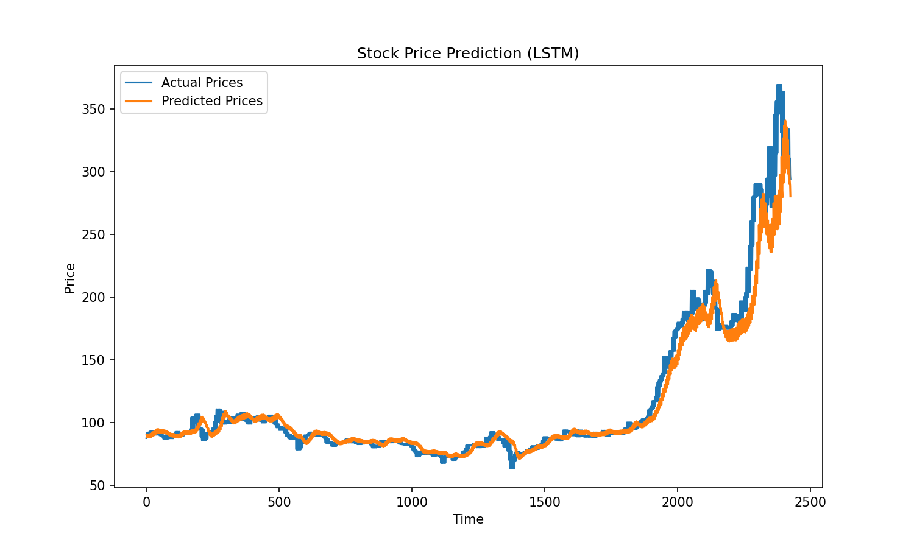

:PROPERTIES:
:ID:       ea0b9a66-128a-453d-8c8a-5364cb6af1df
:END:
#+title: 當AI遇上股票
#+AUTHOR: 顏永進
# -*- org-export-babel-evaluate: nil -*-
#+TAGS: AI, stock, 股票
#+OPTIONS: toc:2 ^:nil num:5
#+PROPERTY: header-args :python :python "/Users/letranger/Dropbox/notes/roam/venv/bin/python3" :eval never-export
#+HTML_HEAD: <link rel="stylesheet" type="text/css" href="../css/muse.css" />
#+HTML_HEAD_EXTRA: 

#+EXCLUDE_TAGS: noexport
#+begin_export html

#+end_export

以下範例均假設於Google Colab上執行，若於本機IDE(如PyCharm、Spyder)上執行，則部份指令執行方式要略做修正。

* CNN-1: 以AI預測股價-隔日漲跌
[[https://colab.research.google.com/drive/1YMzBxndwnKamoJGX3rVvlO43drpl6GWz?usp=sharing][當AI遇上股票-CNN-1.ipynb]]
** 安裝相關套件
#+begin_src shell -r -n :results output :exports both
pip install yfinance
#+end_src
** 下載股價資訊
#+begin_src python -r -n :results output :exports both :session cnn1 :async
import yfinance as yf

df = yf.Ticker('2330.TW').history(period='10y')
print(type(df))
#+end_src

*** 查看下載的資料集
#+begin_src python -r -n :results output :exports both :session cnn1 :async
print(df[:5])
#+end_src
*** 取出需要的收盤價
從陣列中讀出收盤價
#+begin_src python -r -n :results output :exports both :session cnn1 :async
data = df.filter(['Close'])
print(data.head())
#+end_src
** 觀察原始資料/日K圖
#+begin_src python -r -n :results output :exports both :session cnn1 :async
import matplotlib.pyplot as plt
plt.clf()
plt.plot(data.Close)
plt.show()
#+end_src
** 將資料標準化
#+begin_src python -r -n :results output :exports both :session cnn1 :async
from sklearn.preprocessing import MinMaxScaler
scaler = MinMaxScaler(feature_range=(0, 1))
sc_data = scaler.fit_transform(data.values)

sc_data #變成numpy array
#+end_src
** 建立、分割資料
*** 建立資料集及標籤
#+begin_src python -r -n :results output :exports both :session cnn1 :async
import numpy as np

# 以前N天的股價來預測未來股價
previousNDays = 10
x_data, y_data = [], []
for i in range(len(sc_data) - previousNDays):
  x = sc_data[i:i+previousNDays]
  y = sc_data[i+previousNDays]
  x_data.append(x)
  y_data.append(y)
#因為等一下要送進tensorflow，所以先轉成numpy的陣列格式
x_data, y_data = np.array(x_data), np.array(y_data)

print(x_data.shape)
print(y_data.shape)
#+end_src
*** 分割訓練集與測試集
#+begin_src python -r -n :results output :exports both :session cnn1 :async
ratio = 0.8
train_size = round(len(x_data) * ratio)
print(train_size)
# 第0筆到第train_size-1筆的資料分割為訓練集
x_train, y_train = x_data[:train_size], y_data[:train_size]
# 第train_size筆到最後一筆的資料分割為測試集
x_test, y_test = x_data[train_size:], y_data[train_size:]
#from sklearn.model_selection import train_test_split
#x_train, x_test, y_train, y_test = train_test_split(x_data, y_data, test_size=0.2)
print(x_train.shape)
print(y_train.shape)
print(x_test.shape)
print(y_test.shape)
#+end_src
** 建立、編譯、訓練模型
*** 建立模型
#+begin_src python -r -n :results output :exports both :session cnn1 :async
# CNN模型
import tensorflow as tf
from tensorflow.keras import layers

#建構CNN模型
model = tf.keras.Sequential([
    layers.Input(shape=(previousNDays, 1, 1)),
    #卷積層：用 3 天的窗格掃描股價模式
    layers.Conv2D(filters=512, kernel_size=(3, 1), activation='relu'),
    #攤平
    layers.Flatten(),
    #全連接層/輸出層（回歸問題不加激活函數）
    layers.Dense(1)
])
#+end_src
#+begin_src python -r -n :results output :exports both :session cnn1 :async
model.summary()
#+end_src
*** 編譯模型
#+begin_src python -r -n :results output :exports both :session cnn1 :async
model.compile(loss='mse', optimizer='adam', metrics=['mae'])
#+end_src
*** 訓練模型
#+begin_src python -r -n :results output :exports both :session cnn1 :async
model.fit(x_train, y_train,
          validation_split=0.2,
          batch_size=200, epochs=20)
#+end_src
** 性能測試
*** loss
#+begin_src python -r -n :results output :exports both :session cnn1 :async
score = model.evaluate(x_test, y_test)
print('loss:', score[0])
print('mae:', score[1])
#+end_src
*** predict
#+begin_src python -r -n :results output :exports both :session cnn1 :async
predict = model.predict(x_test)
predict = scaler.inverse_transform(predict)
predict = np.reshape(predict, (predict.size,))
ans = scaler.inverse_transform(y_test)
ans = np.reshape(ans, (ans.size,))
print(predict[:3])
print(ans[:3])
#+end_src
*** plot
#+begin_src python -r -n :results output :exports both :session cnn1 :async
plt.clf()
plt.plot(predict, label='Predicted')
plt.plot(ans, label='Actual')
plt.legend()
plt.show()
#+end_src

** 能怎麼胡搞
- 多讀些原始資料
- 用更多特徵值來預測
- 用更多/更少天數來預測
- 變更模型架構
- 變更訓練集:測試集比例
- 增加epoch

* CNN-2: 以AI預測股價-隔日漲跌
[[https://colab.research.google.com/drive/11CXwpdKtfCB0q3mejuRv5yQA0xKsWlgJ?usp=sharing][當AI遇上股票-CNN-2.ipynb]]
** 安裝相關套件
#+begin_src shell -r -n :results output :exports both
pip install yfinance
#+end_src
** 下載股價資訊
#+begin_src python -r -n :results output :exports both :session cnn2 :async
import yfinance as yf

df = yf.Ticker('2330.TW').history(period='10y')
print(type(df))
#+end_src
*** 查看下載的資料集
#+begin_src python -r -n :results output :exports both :session cnn2 :async
print(df[:5])
#+end_src
*** 取出需要的特徵值
此次將成交量納入考慮
#+begin_src python -r -n :results output :exports both :session cnn2 :async
data = df.filter(['Close', 'Volume'])
print(data.head())
#+end_src
** 觀察原始資料/日K圖
#+begin_src python -r -n :results output :exports both :session cnn2 :async
import matplotlib.pyplot as plt
plt.clf()
plt.plot(data.Close)
plt.show()
plt.clf()
plt.plot(data.Volume)
plt.show()
#+end_src
** 將資料標準化
#+begin_src python -r -n :results output :exports both :session cnn2 :async
from sklearn.preprocessing import MinMaxScaler
scalerX = MinMaxScaler(feature_range=(0, 1))
scalerY = MinMaxScaler(feature_range=(0, 1))
all_x = data[['Volume', 'Close']]
all_y = data['Close']
print(all_x.shape)
print(all_y.shape)
scal_all_x = scalerX.fit_transform(all_x.values)
scal_all_y = scalerY.fit_transform(all_y.values.reshape(-1, 1))
#+end_src
** 建立、分割資料
*** 建立資料集及標籤
#+begin_src python -r -n :results output :exports both :session cnn2 :async
import numpy as np

# 以前N天的股價來預測未來股價
previousNDays = 10
x_data, y_data = [], []
for i in range(len(scal_all_x) - previousNDays):
  x = scal_all_x[i:i+previousNDays]
  y = scal_all_y[i+previousNDays]
  x_data.append(x)
  y_data.append(y)
#因為等一下要送進tensorflow
x_data, y_data = np.array(x_data), np.array(y_data)

print(x_data.shape)
print(y_data.shape)
#+end_src
*** 分割訓練集與測試集
#+begin_src python -r -n :results output :exports both :session cnn2 :async
ratio = 0.8
train_size = round(len(x_data) * ratio)
print(train_size)
x_train, y_train = x_data[:train_size], y_data[:train_size]
x_test, y_test = x_data[train_size:], y_data[train_size:]

print(x_train.shape)
print(y_train.shape)
print(x_test.shape)
print(y_test.shape)
#+end_src
** 建立、編譯、訓練模型
*** 建立模型
#+begin_src python -r -n :results output :exports both :session cnn2 :async
# CNN模型
import tensorflow as tf
from tensorflow.keras import layers

#建構CNN模型
model = tf.keras.Sequential([
    layers.Input(shape=(previousNDays, 2, 1)),
    #第一個卷積層
    layers.Conv2D(filters=512, kernel_size=(3, 1), activation='relu'),
    #第二個卷積層
    layers.Conv2D(filters=512, kernel_size=(3, 1), activation='relu'),
    #攤平
    layers.Flatten(),
    #全連接層/輸出層（回歸問題不加激活函數）
    layers.Dense(1)
])
#+end_src
#+begin_src python -r -n :results output :exports both :session cnn2 :async
model.summary()
#+end_src
*** 編譯模型
#+begin_src python -r -n :results output :exports both :session cnn2 :async
model.compile(loss='mse', optimizer='adam', metrics=['mae'])
#+end_src
*** 訓練模型
#+begin_src python -r -n :results output :exports both :session cnn2 :async
model.fit(x_train, y_train,
          validation_split=0.2,
          batch_size=200, epochs=20)
#+end_src
** 性能測試
*** loss
#+begin_src python -r -n :results output :exports both :session cnn2 :async
score = model.evaluate(x_test, y_test)
print('loss:', score[0])
print('mae:', score[1])
#+end_src
*** predict
#+begin_src python -r -n :results output :exports both :session cnn2 :async
predict = model.predict(x_test)
predict = scalerY.inverse_transform(predict)
predict = np.reshape(predict, (predict.size,))
ans = scalerY.inverse_transform(y_test)
ans = np.reshape(ans, (ans.size,))
print(predict[:3])
print(ans[:3])
#+end_src
*** plot
#+begin_src python -r -n :results output :exports both :session cnn2 :async
plt.clf()
plt.plot(predict, label='Predicted')
plt.plot(ans, label='Actual')
plt.legend()
plt.show()
#+end_src
** 能怎麼胡搞
- 多讀些原始資料
- 用更多特徵值來預測
- 用更多/更少天數來預測
- 變更模型架構
- 變更訓練集:測試集比例
- 增加epoch

* CNN-3 以AI預測股價-後5日漲跌
為了讓大家都能交出作業，這裡提供一個利用CNN模型的程式參考範例
- 程式每抓取股票的兩個特徵值
- 每次預測後5天的股價
請各組自行修改測試
#+begin_src python -r -n :results output :exports both :session cnn3 :async
import yfinance as yf
df = yf.Ticker('3260.TWO').history(period='10y')
#挑兩個特徵值
data = df.filter(['Open', 'Close'])

from sklearn.preprocessing import MinMaxScaler
#資料標準化
scaler = MinMaxScaler(feature_range=(0, 1))
sc_data = scaler.fit_transform(data.values)

import numpy as np
import tensorflow as tf
from tensorflow.keras import layers

featureDays = 10 #拿來預測的天數
days = 5 #要生成的天數

x_data, y_data = [], []
for i in range(len(sc_data) - featureDays - days + 1):
  x = sc_data[i:i+featureDays, :]
  y = sc_data[i+featureDays: i+featureDays+days, 1]
  x_data.append(x)
  y_data.append(y)

x_data = np.array(x_data).reshape(-1, featureDays, 2, 1)  # 調整形狀以適應Conv2D
y_data = np.array(y_data)

#訓練集、測試集比例
ratio = 0.8
train_size = round(len(x_data) * ratio)
print(train_size)
x_train, y_train = x_data[:train_size], y_data[:train_size]
x_test, y_test = x_data[train_size:], y_data[train_size:]

#建構CNN模型
model = tf.keras.Sequential([
    layers.Input(shape=(featureDays, 2, 1)),
    layers.Conv2D(filters=512, kernel_size=(3, 1), activation='relu'),
    layers.Flatten(),
    #輸出層：預測 days 天的收盤價（回歸問題不加激活函數）
    layers.Dense(days)
])

model.compile(loss='huber_loss', optimizer='RMSprop', metrics=['mae'])
history = model.fit(x_train, y_train, batch_size=100, epochs=20, validation_data=(x_test, y_test))

#評估、預測
score = model.evaluate(x_test, y_test)
print('loss:', score[0])
print('mae:', score[1])

predict = model.predict(x_test)
print(predict.shape)
print(predict)

#還原scale
predict_expanded = np.zeros((predict.shape[0], predict.shape[1], 2))
predict_expanded[:, :, 1] = predict

predicted_prices = np.zeros((predict.shape[0], predict.shape[1]))
for i in range(predict.shape[1]):
    predicted_prices[:, i] = scaler.inverse_transform(predict_expanded[:, i])[:, 1]

print(predicted_prices.shape)
print(predicted_prices)
#+end_src

* LSTM: 以AI預測股價-後5日漲跌
** 參考程式碼
#+begin_src shell -r -n :results output :exports both
source /Users/letranger/Dropbox/notes/roam/venv/bin/activate
pip3 install yfinance
#+end_src

#+begin_src python -r -n :results output :exports both :session lstm1 :async
import yfinance as yf
from sklearn.preprocessing import MinMaxScaler
import numpy as np
import tensorflow as tf
from tensorflow.keras import layers
import matplotlib.pyplot as plt

df = yf.Ticker('3260.TWO').history(period='10y')

#挑兩個特徵值
data = df.filter(['Open', 'Close'])

# 標準化（LSTM 對數值範圍敏感，不標準化訓練會不穩定）
scaler = MinMaxScaler(feature_range=(0, 1))
sc_data = scaler.fit_transform(data.values)

featureDays = 10 #拿來預測的天數
days = 5 #要生成的天數

x_data, y_data = [], []
for i in range(len(sc_data) - featureDays - days + 1):
    x = sc_data[i:(i + featureDays), :]
    y = sc_data[(i + featureDays):(i + featureDays + days), 1]
    x_data.append(x)
    y_data.append(y)

x_data, y_data = np.array(x_data), np.array(y_data)

# 訓練集與測試集
train_size = int(len(x_data) * 0.8)
x_train, x_test = x_data[:train_size], x_data[train_size:]
y_train, y_test = y_data[:train_size], y_data[train_size:]

model = tf.keras.Sequential([
    layers.Input(shape=(featureDays, 2)),
    layers.LSTM(50, return_sequences=True),
    layers.LSTM(50, return_sequences=False),
    layers.Dense(25),
    layers.Dense(days)
])

model.compile(optimizer='adam', loss='mean_squared_error')

history = model.fit(x_train, y_train, batch_size=32, epochs=20, validation_data=(x_test, y_test))

test_loss = model.evaluate(x_test, y_test)
print('Test loss:', test_loss)

predictions = model.predict(x_test)

# 還原 scale（只取 Close 欄位）
pred_expanded = np.zeros((predictions.shape[0], predictions.shape[1], 2))
pred_expanded[:, :, 1] = predictions
predicted_prices = np.zeros((predictions.shape[0], predictions.shape[1]))
for i in range(predictions.shape[1]):
    predicted_prices[:, i] = scaler.inverse_transform(pred_expanded[:, i])[:, 1]

actual_expanded = np.zeros((y_test.shape[0], y_test.shape[1], 2))
actual_expanded[:, :, 1] = y_test
actual_prices = np.zeros((y_test.shape[0], y_test.shape[1]))
for i in range(y_test.shape[1]):
    actual_prices[:, i] = scaler.inverse_transform(actual_expanded[:, i])[:, 1]

# 預測與實際價格比較
plt.clf()
plt.figure(figsize=(10, 6))
plt.plot(actual_prices.flatten(), label='Actual Prices')
plt.plot(predicted_prices.flatten(), label='Predicted Prices')
plt.title('Stock Price Prediction (LSTM)')
plt.xlabel('Time')
plt.ylabel('Price')
plt.legend()
plt.savefig('images/stock-lstm-predict.png', dpi=150)

#+end_src

#+RESULTS:
#+begin_example
Epoch 1/20
61/61 ━━━━━━━━━━━━━━━━━━━━ 10s 25ms/step - loss: 0.0011 - val_loss: 0.0016
Epoch 2/20
61/61 ━━━━━━━━━━━━━━━━━━━━ 1s 11ms/step - loss: 1.2689e-04 - val_loss: 0.0022
Epoch 3/20
61/61 ━━━━━━━━━━━━━━━━━━━━ 1s 10ms/step - loss: 1.2404e-04 - val_loss: 0.0023
Epoch 4/20
61/61 ━━━━━━━━━━━━━━━━━━━━ 1s 10ms/step - loss: 1.2142e-04 - val_loss: 0.0031
Epoch 5/20
61/61 ━━━━━━━━━━━━━━━━━━━━ 1s 10ms/step - loss: 1.2933e-04 - val_loss: 0.0026
Epoch 6/20
61/61 ━━━━━━━━━━━━━━━━━━━━ 1s 10ms/step - loss: 1.1857e-04 - val_loss: 0.0027
Epoch 7/20
61/61 ━━━━━━━━━━━━━━━━━━━━ 1s 10ms/step - loss: 1.1924e-04 - val_loss: 0.0033
Epoch 8/20
61/61 ━━━━━━━━━━━━━━━━━━━━ 1s 11ms/step - loss: 1.1724e-04 - val_loss: 0.0037
Epoch 9/20
61/61 ━━━━━━━━━━━━━━━━━━━━ 1s 10ms/step - loss: 1.1271e-04 - val_loss: 0.0026
Epoch 10/20
61/61 ━━━━━━━━━━━━━━━━━━━━ 1s 11ms/step - loss: 1.1221e-04 - val_loss: 0.0033
Epoch 11/20
61/61 ━━━━━━━━━━━━━━━━━━━━ 1s 10ms/step - loss: 1.1019e-04 - val_loss: 0.0032
Epoch 12/20
61/61 ━━━━━━━━━━━━━━━━━━━━ 1s 10ms/step - loss: 1.1679e-04 - val_loss: 0.0035
Epoch 13/20
61/61 ━━━━━━━━━━━━━━━━━━━━ 1s 11ms/step - loss: 1.1922e-04 - val_loss: 0.0035
Epoch 14/20
61/61 ━━━━━━━━━━━━━━━━━━━━ 1s 10ms/step - loss: 1.0940e-04 - val_loss: 0.0030
Epoch 15/20
61/61 ━━━━━━━━━━━━━━━━━━━━ 1s 10ms/step - loss: 1.0044e-04 - val_loss: 0.0036
Epoch 16/20
61/61 ━━━━━━━━━━━━━━━━━━━━ 1s 9ms/step - loss: 1.0892e-04 - val_loss: 0.0024
Epoch 17/20
61/61 ━━━━━━━━━━━━━━━━━━━━ 1s 10ms/step - loss: 9.5314e-05 - val_loss: 0.0023
Epoch 18/20
61/61 ━━━━━━━━━━━━━━━━━━━━ 1s 11ms/step - loss: 9.4052e-05 - val_loss: 0.0020
Epoch 19/20
61/61 ━━━━━━━━━━━━━━━━━━━━ 1s 10ms/step - loss: 9.4383e-05 - val_loss: 0.0026
Epoch 20/20
61/61 ━━━━━━━━━━━━━━━━━━━━ 1s 11ms/step - loss: 9.5867e-05 - val_loss: 0.0020
16/16 ━━━━━━━━━━━━━━━━━━━━ 0s 5ms/step - loss: 0.0020
Test loss: 0.0020242715254426003
16/16 ━━━━━━━━━━━━━━━━━━━━ 1s 46ms/step
#+end_example

#+ATTR_HTML: :width 700

** 能怎麼胡搞
- 多讀些原始資料
- 用更多特徵值來預測
- 用更多/更少天數來預測
- 變更模型架構
- 變更訓練集:測試集比例
- 增加epoch
