:PROPERTIES:
:ID:       263cb433-d0eb-4400-a373-35175c000c01
:ROAM_ALIASES: RNN
:ROAM_ALIASES: LSTM
:ROAM_ALIASES: GRU
:END:
#+TITLE: 時間序列的預言者：如何通過 RNN、LSTM 和 GRU 預測未來

# -*- org-export-babel-evaluate: nil -*-
#+INCLUDE: ../pdf.org
#+PROPERTY: header-args :eval never-export
#+TAGS: AI, Python
#+EXCLUDE_TAGS: noexport
#+OPTIONS: toc:2 ^:nil num:3
#+OPTIONS: H:4
#+LATEX:\newpage
#+HTML_HEAD: <link rel="stylesheet" type="text/css" href="../css/muse.css" />
#+HTML_HEAD_EXTRA: 
#+begin_export html

#+end_export

* 為此 org 啟用 venv :noexport:
#+begin_src shell -r -n :results output :exports both
source ./venv/bin/activate
#+end_src

#+RESULTS:

#+begin_src shell -r -n :results output :exports no
python3 -m venv ./venv
source ./venv/bin/activate
echo $VIRTUAL_ENV
ls venv

python3 -m pip install -U matplotlib
python3 -m pip install -U ace_tools
python3 -m pip install -U seaborn
python3 -m pip install -U statsmodels
python3 -m pip install -U tensorflow
python3 -m pip install -U graphviz
#+end_src

#+BEGIN_SRC emacs-lisp :exports no
(pyvenv-activate "./venv")
(setq org-babel-python-command "./venv/bin/python3")
#+END_SRC

#+RESULTS:
: ./venv/bin/python3

* CNN的限制 :noexport:
在[[id:20221023T101414.457264][卷積神經網路]]中，我們提過CNN的想法源自於對人類大腦認知方式的模仿，當我們辨識一個圖像，會先注意到顏色鮮明的點、線、面，之後將它們構成一個個不同的形狀(眼睛、鼻子、嘴巴 ...)，這種抽象化的過程就是 CNN 演算法建立模型的方式。其過程如圖[[fig:CNN-1]][fn:1]。

#+CAPTION: CNN 概念
#+LABEL:fig:CNN-1
#+name: fig:CNN-1
#+ATTR_LATEX: :width 500
#+ATTR_ORG: :width 500
#+ATTR_HTML: :width 500
#+RESULTS:
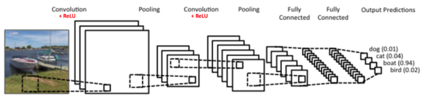

至於圖片中的每一個特徵則是利用卷積核來取得(如圖[[fig:CNN-arch]])，換言之，CNN其實是在模擬人類的眼睛。也就是說，CNN的設計是為了處理靜態的、空間上有結構的資料，例如圖像、影像等，它所關注的是資料間的空間關係，例如圖[[fig:CNN-arch]]中卷積核(紅色矩陣)中各個pixel與隣近pixel間的關係。
#+CAPTION: CNN原理
#+LABEL:fig:CNN-arch
#+name: fig:CNN-arch
#+ATTR_LATEX: :width 300
#+ATTR_ORG: :width 300
#+ATTR_HTML: :width 500
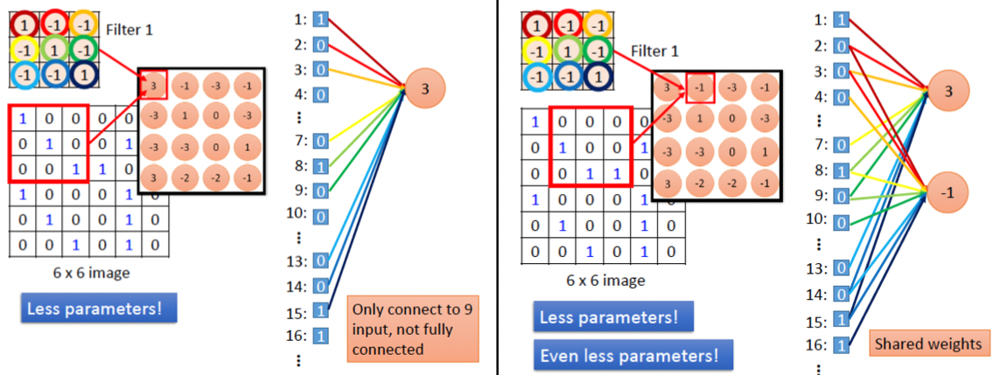

萬一我們所要處理的資料並不是一張張的圖、而是一系列連續性、有時間順序的資料呢？例如：
- 一篇文章: 也許我們想生成這篇文章的摘要
- 一段時間內蒐集一的某地PM 2.5數值: 也許我們想預測該地下週的PM 2.5
- 一段演講錄音: 也許我們想生成逐字稿
你會發現，這類資料其實不太適合用眼睛，可能更適合用耳朵(關注連續資料間的關係)，所以拿CNN來分析這類資料大概是用錯了工具。

那麼，哪一種模型比較適合模擬出人類的耳朵功能？這是本節的討論重點。

* 遞迴神經網路(Recurrent Neural Network, RNN)
:PROPERTIES:
:ID:       2a1d5d4d-3569-406b-ac13-355acafd5da8
:END:
遞迴神經網絡（RNN）是一種專門設計來處理序列資料的人工神經網絡。序列資料指的是那些隨時間連續出現的資料，比如語言（單詞組成的句子）、影片（一連串的影像畫面），或者是音樂（一連串的音符）。

想像你利用每天晚上睡前花30分鐘追劇，每當新的一集開始時，你通常還會記得上一集發生了什麼。RNN也是這樣工作的：它在處理資料（例如一句話中的每個單詞）時，會記得之前的資訊，並利用這些資訊來幫助理解或預測下一步會發生什麼。

那RNN是如何做到這點的呢?這種“記憶”是通過網絡中的循環連接實現的。這些連接使得訊息可以在模型的一層之間前後流動，就像你在看連續劇時保持對劇情的記憶一樣。以下就拿股價預測來做為例子。

** 一個預測股價的RNN模型-1
:PROPERTIES:
:ID:       9ae4fff3-e029-42c4-8eaf-df5efcc1fd42
:END:
這裡我們用一個很簡單(**實際上會賠死**)的RNN模型來預測明天股價的漲跌情況，這個模型的重點在於示範RNN模型如何輸入一段連續資料，最後生成預測結果，至於預測結果我們先不要去嫌棄它Q_Q。如同在CNN中我們以數字來表達影像中的像素(pixel)，在這裡我們也將股票的漲、跌以數字表達：
1. 跌：0
2. 平盤: 0.5
3. 漲：1
這樣一來，我們就可以用數字來表示股價的漲跌情況。這個簡化版的RNN模型目的是輸入某檔股票的過去(昨天、今天)股價漲跌情況，然後預測明天的股價漲跌情況。那我們要如何用RNN來實作這個模型呢？讓我們先來認識一下最簡單的RNN模型(如圖[[fig:SimpleRNN-0]])：

#+begin_src dot :file ./images/simple_RNN-0.png :exports none :results none
digraph simple_rnn {
  rankdir=LR;
  node [shape=circle, width=0.8, fontsize=14, style=filled, fontname="DejaVu Sans"];
  input [label=輸入, fillcolor="orange"];
  A [label=A, fillcolor="lightgreen"];
  output [label=輸出, fillcolor="orange"];

  input -> A [label=<W1 >];
  A -> A [label=<W2 >, dir="back", arrowsize="0.8", color="red"];
  A -> output [label=<W3 >, color="blue"];
}
#+end_src
#+CAPTION: 一個簡單的RNN模型
#+LABEL:fig:SimpleRNN-0
#+name: fig:SimpleRNN-0
#+ATTR_LATEX: :width 300
#+ATTR_ORG: :width 300
#+ATTR_HTML: :width 300
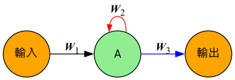

圖[[fig:SimpleRNN-0]]告訴我們，RNN模型有三個主要部分：
1. **輸入層** ：這是我們將股價漲跌情況輸入到模型中的地方。
2. **隱藏層** ：這是模型的核心部分，通常用一個或多個神經元來處理輸入資料。在這個例子中，我們用一個神經元A來表示。
3. **輸出層** ：這是模型的結果輸出部分，通常用來預測股價漲跌情況。

圖[[fig:SimpleRNN-0]]中的神經元A每次輸出的結果都會影響到下一次的輸入(參考圖中的紅色箭頭h)。這個特性使得RNN能夠記住之前的資訊，並將其用於當前的計算。這裡的 $w_1, w_2, w_3$ 是權重，用來調整輸入、隱藏層與輸出層之間的連接強度。事實上，圖[[fig:SimpleRNN-0]]只是簡化過的架構，實際上它大致長得像圖[[fig:SimpleRNN-1]]。

#+begin_src dot :file ./images/simple_RNN-1.png :exports none :results none
digraph simple_rnn {
  rankdir=LR;
  node [shape=circle, width=0.8, fontsize=14, style=filled, fontname="DejaVu Sans"];
  input [label=輸入, fillcolor="orange"];
  ReLU [label=tanh, fillcolor="lightgreen"];
  output [label=輸出, fillcolor="orange"];
  node [shape=square, width=0.3, fontsize=10, style=filled, fontname="DejaVu Sans"];
  b1 [label=<b1>, fillcolor="lightblue"];
  b2 [label=<b2>, fillcolor="lightblue"];

  input -> b1 [label=<W1 >];
  b1 -> ReLU [minlen=1];
  ReLU -> ReLU [label=<W2 >, dir="back", arrowsize="0.8", color="red"];
  ReLU -> b2 [label=<W3 >, color="blue"];
  b2 -> output [color="blue"];
}
#+end_src
#+CAPTION: 一個簡單的RNN模型
#+LABEL:fig:SimpleRNN-1
#+name: fig:SimpleRNN-1
#+ATTR_LATEX: :width 400
#+ATTR_ORG: :width 400
#+ATTR_HTML: :width 400
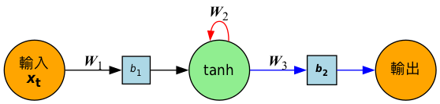

神經元A實際進行了以下運算：
$$h_t​=f(w_1​x_t​+w_2​h_{t−1}​+b_1)$$
其中：
- $h_t$ ：神經元A在時間點 $t$ 的輸出（也就是對「今天」的股價漲跌的 **預測結果** ）
- $x_t$ ：在時間點 $t$ 的輸入（也就是「今天」的外部訊號，例如今天的股價 **實際漲跌情況** ）
- $h_{t-1}$ ：在時間點 $t-1$ 的輸出（也就是「昨天」的狀態/股價漲跌情況）
- $w_1, w_2$ ：權重（實際上是矩陣，這裡用簡化的一維符號），分別調整輸入與前一時刻狀態的影響力
- $b_1$ ：偏差項
- $f$ ：激活函數（activation function），RNN常用的激活函數為tanh，目的在於引入非線性特性，使模型能學習更複雜的模式。

RNN的激活函數也有人用Sigmoid，較少用ReLU，原因是tanh 輸出區間在 [-1, 1]，便於梯度傳遞（不會無限放大），而ReLU 可能導致梯度爆炸或消失得更嚴重（RNN 訓練已經容易爆炸或消失） 等。在後面的例子中為了簡化運算流程，仍採用ReLU。

** RNN的運作方式
圖[[fig:SimpleRNN-1]]模型的運作方式就像一個簡單的線性迴歸模型，只不過它有一個循環連接，使得它能夠記住之前的輸入資訊。這樣的設計使得RNN能夠處理序列資料，並在每次迭代中更新自己的狀態。

是不是有點抽象？其實這種「把上次的輸出當成下一次的輸入」的概念很簡單，只要你有點程式設計的概念大概都不陌生，就是「遞迴」的概念。讓我們來複習一下這個「計算n!」的程式：
#+begin_src python -r -n :results output :exports both
def factorial(n):
    """
    階乘遞迴範例：
    n! = n × (n-1) × (n-2) × ... × 1
    """
    if n <= 1:
        return 1
    # 本次答案 = 當下 n * 上一步的答案
    return n * factorial(n-1)

# 範例
print(factorial(3))  # 輸出 6

#+end_src

#+RESULTS:
: 6

在上述的遞迴程式中，每次在計算n!時，都會先計算n-1的階乘，然後將結果乘以n。這樣的遞迴過程就像RNN一樣，每次都會將上一次的輸出作為下一次的輸入。RNN與遞迴的比較如表[[tab:rnn-recursion]]所示，n! 的每一步都要先算出前一步的結果，RNN 也一樣，每個時刻的狀態都要用到上一次的狀態。兩者本質上都是『遞迴』的概念。

#+CAPTION: 類比對照表
#+NAME: tab:rnn-recursion
| 遞迴型態   | 當下輸出 | 上一步遞迴 | 計算方式                               |
|------------+----------+------------+----------------------------------------|
| 階乘       | n!       | (n-1)!     | n! = n × (n-1)!                        |
| RNN hidden | $h_t$    | $h_{t-1}$  | $h_t = f(w_1 x_t + w_2 h_{t-1} + b_1)$ |

** 一個預測股價的RNN模型-2
現在讓我們再回頭來看一下我們的股價預測模型。預測明天的股價漲跌情況的流程如下：
1. 首先要知道 *昨天* 的股價漲跌情況，這樣我們就可以將昨天的股價漲跌情況輸入到模型中，然後模型會根據這個輸入和它的內部權重($w_1, w_2, w_3$)來計算出一個輸出值，這個輸出值就是 *今天* 股價漲跌情況的預測結果。
2. 接下來輸入 *今天* 的股價漲跌情況，模型會將這個值與昨天的預測結果一起計算，然後產生 *明天* 的股價漲跌預測結果。

假設昨天和今天的股價都維持平盤，則我們可以先輸入昨天的股價漲跌情況(0.5)到模型中：

#+begin_src dot :file ./images/simple_RNN-2.png :exports none :results none
digraph simple_rnn {
  rankdir=LR;
  node [shape=circle, width=0.8, fontsize=14, style=filled, fontname="DejaVu Sans"];
  input [label=<昨天>, fillcolor="orange"];
  ReLU [label=<ReLU>, image="images/relu.png", shape=box, width=0.8, height=0.8, fixedsize=true, fillcolor="lightgreen"];
  output [label=今天, fillcolor="orange"];
  node [shape=square, width=0.3, fontsize=10, style=filled, fontname="DejaVu Sans"];
  b1 [label=<b1 +0>, fillcolor="lightblue"];
  b2 [label=<b2>, fillcolor="lightblue"];

  input -> b1 [label=<W1 × 1.8>];
  b1 -> ReLU [minlen=1];
  ReLU -> ReLU [label=<W2 × -0.5>, dir="back", arrowsize="1", minlen=4, color="red"];
  ReLU -> b2 [label=<W3 × 1.1>, color="blue"];
  b2 -> output [color="blue"];

}
#+end_src

#+CAPTION: 輸入昨天股價漲跌情況到模型中
#+LABEL:fig:SimpleRNN-2
#+name: fig:SimpleRNN-2
#+ATTR_LATEX: :width 400
#+ATTR_ORG: :width 400
#+ATTR_HTML: :width 400
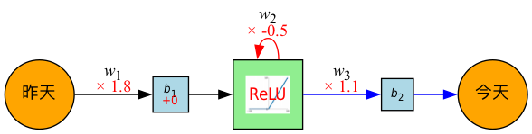

在輸入昨天股價漲跌情況後，模型會將這個值(0.5)乘上權重 $w_1$（1.8），再加上偏差 $b_1$（+0）。這樣可以得到：
$$z=0.5×1.8+0=0.9$$
接著，這個值會通過 ReLU 函數 進行處理。由於 ReLU 的定義是將輸入值小於 0 的部分設為 0，否則保留原值，因此 $0.9$ 通過 ReLU 後仍然是 $0.9$。

接下來，這個值（$0.9$）會：
1. 一方面進入自循環路徑(圖[[fig:SimpleRNN-2]]中的紅色箭頭)與 $w_2$ 進行運算，影響下一次預測
1. 另一方面作為本次隱藏狀態 $h_t$，再乘上權重 $w_3$，加上偏差 $b_2$，產生最後的輸出 $y_t=h_t×w_3+b_2$ ，即圖[[fig:SimpleRNN-3]]中的藍色箭頭

如果 $b_2=0$，那麼 $y_t = 0.99$，這個值（$y_t=0.9\times1.1+0=0.99$）就是模型對今天股價漲跌情況的預測結果。

#+begin_src dot :file ./images/simple_RNN-3.png :exports none :results none
digraph simple_rnn {
  rankdir=LR;
  node [shape=circle, width=0.8, fontsize=14, style=filled, fontname="DejaVu Sans"];
  input [label=<昨天 (0.5)>, fillcolor="orange"];
  ReLU [label=<0.9>, image="images/relu.png", shape=box, width=0.8, height=0.8, fixedsize=true, fillcolor="lightgreen"];
  output [label=<今天 (0.99)>, fillcolor="orange"];
  node [shape=square, width=0.3, fontsize=10, style=filled, fontname="DejaVu Sans"];
  b1 [label=<b1 +0>, fillcolor="lightblue"];
  b2 [label=<b2>, fillcolor="lightblue"];

  input -> b1 [label=<W1 × 1.8>];
  b1 -> ReLU [minlen=1];
  ReLU -> ReLU [label=<W2 × -0.5>, dir="back", arrowsize="1", minlen=4, color="red"];
  ReLU -> b2 [label=<W3 × 1.1>, color="blue"];
  b2 -> output [color="blue"];

}
#+end_src

#+CAPTION: 輸入昨天股價漲跌情況後得到今天股價漲跌預測
#+LABEL:fig:SimpleRNN-3
#+name: fig:SimpleRNN-3
#+ATTR_LATEX: :width 200
#+ATTR_ORG: :width 400
#+ATTR_HTML: :width 400
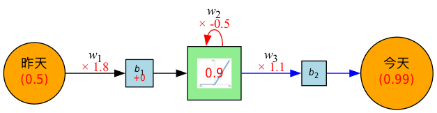

但是我們對於今天的股價預測並不感興趣，因為我們已知今天的實際漲跌情況是「平盤、也就是 0.5」。為了預測明天的股價，我們要輸入兩項資訊給模型：
1. 剛才用模型以 「昨天的資料」預測出的「今天」股價漲跌，也就圖[[fig:SimpleRNN-3]]中紅色箭頭儲存起來的 0.9。在RNN模型中，它有個特殊名詞叫「隱藏狀態(hidden status)」，這是上一個時間點的隱藏狀態，記做 $h_{t-1}$，。
2. 「今天的實際漲跌」（也就是平盤：0.5)，將它做為新的輸入 $x_t$。

整個預測過程分為以下兩步，對應模型如圖[[fig:SimpleRNN-4]]所示：
#+begin_src dot :file ./images/simple_RNN-4.png :exports none :results none
digraph simple_rnn {
  rankdir=LR;
  node [shape=circle, width=0.8, fontsize=14, style=filled, fontname="DejaVu Sans"];
  input [label=<今天 (0.5)>, fillcolor="orange"];
  ReLU [label=<0.45>, image="images/relu.png", shape=box, width=0.8, height=0.8, fixedsize=true, fillcolor="lightgreen"];
  output [label=<明天 (0.495)>, fillcolor="orange"];
  node [shape=square, width=0.3, fontsize=10, style=filled, fontname="DejaVu Sans"];
  b1 [label=<b1 +0>, fillcolor="lightblue"];
  b2 [label=<b2>, fillcolor="lightblue"];

  input -> b1 [label=<W1 × 1.8>];
  b1 -> ReLU [minlen=1];
  ReLU -> ReLU [label=<W2 × -0.5>, dir="back", arrowsize="1", minlen=4];
  ReLU -> b2 [label=<W3 × 1.1>];
  b2 -> output;

}
#+end_src
#+CAPTION: 輸入今股價漲跌情況後得到明天股價漲跌預測
#+LABEL:fig:SimpleRNN-4
#+name: fig:SimpleRNN-4
#+ATTR_LATEX: :width 200
#+ATTR_ORG: :width 400
#+ATTR_HTML: :width 400
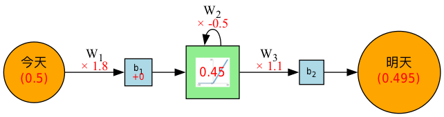
1. 先算出「明天的隱藏狀態」: $h_{t+1}=ReLU(x_t×w_1+h_t×w_2+b_1)$，其中
   - $x_t = 0.5$（今天的實際漲跌）
   - $h_t = 0.9$（模型對今天的預測結果）
   得到：$$ h_{t+1}=ReLU(0.5×1.8+0.9×(−0.5)+0)=ReLU(0.45)=0.45 $$
2. 再算「明天的最終輸出」 $y_{t+1}=h_{t+1}×w_3+b_2$，其中
   - $h_{t+1} = 0.45$
   - $w_3 = 1.1$
   - $b_2 = 0$
   $$y_{t+1}=0.45×1.1+0=0.495$$
   所以模型預測「明天」的股價漲跌情況為 $0.495$。

** 小結
本節我們用「預測股價漲跌」這個例子，說明了 RNN（遞迴神經網路）如何利用前一次的預測結果和新的實際資料，反覆計算並持續更新自己的隱藏狀態，讓模型能夠處理像時間序列這樣有「過去影響未來」特性的資料。就像追劇需要記住前情提要一樣，RNN 也能「記憶」過去的資訊，把昨天和今天的情況，合併用來推估明天的走勢。

此處我們用的是極簡單的模型（實際上預測股價可不能這麼天真 XD），這個例子清楚展現了RNN的「狀態遞傳」與「遞迴計算」的本質，為進一步學習更複雜的序列模型（像是 LSTM 或 GRU）打下基礎。

* CNN vs. RNN  :noexport:
:PROPERTIES:
:ID:       efb58965-cb64-4874-8e25-69fecf5176af
:END:
回顧我們熟悉的[[id:20221023T101414.457264][CNN]]神經網路(如圖[[fig:SimpleCNN-1]])，資料一律由模型的左側layer往右側傳送；而圖[[fig:SimpleRNN-5]]的RNN則有點不同，每一層的神經元在將資料往右傳遞的同時，還偷偷留了一份給 **自己** (參考圖中的紅色實線) ，這裡說的自己不是真正的自己，而是 **下一個回合的自己** )  。

#+begin_src dot :file ./images/SimpleCNN-1.png :exports none :results none
digraph cnn_mlp {
  rankdir=LR;

  // 中文層名稱
  input_label   [label="輸入層", shape=plaintext, fontsize=16];
  h1_label      [label="隱藏層1", shape=plaintext, fontsize=16];
  h2_label      [label="隱藏層2", shape=plaintext, fontsize=16];
  output_label  [label="輸出層", shape=plaintext, fontsize=16];

  // 設定神經元大小參數
  node [shape=circle, style=filled, width=1, fixedsize=true, fontsize=16];

  // 輸入層
  x1 [label=<x3>, fillcolor="palegreen"];
  x2 [label=<x2>, fillcolor="palegreen"];
  x3 [label=<x1>, fillcolor="palegreen"];

  // 隱藏層1
  h1_1 [label=<h13>, fillcolor="lavender"];
  h1_2 [label=<h12>, fillcolor="lavender"];
  h1_3 [label=<h11>, fillcolor="lavender"];

  // 隱藏層2
  h2_1 [label=<h22>, fillcolor="thistle"];
  h2_2 [label=<h21>, fillcolor="thistle"];

  // 輸出層
  y1 [label=<y1>, fillcolor="lightsalmon"];
  y2 [label=<y2>, fillcolor="lightsalmon"];

  // fully connected edges
  x1 -> h1_1; x1 -> h1_2; x1 -> h1_3;
  x2 -> h1_1; x2 -> h1_2; x2 -> h1_3;
  x3 -> h1_1; x3 -> h1_2; x3 -> h1_3;

  h1_1 -> h2_1; h1_1 -> h2_2;
  h1_2 -> h2_1; h1_2 -> h2_2;
  h1_3 -> h2_1; h1_3 -> h2_2;

  h2_1 -> y1; h2_1 -> y2;
  h2_2 -> y1; h2_2 -> y2;

  // 每層名稱跟該層神經元同 rank
  {rank=same; input_label; x1; x2; x3;}
  {rank=same; h1_label; h1_1; h1_2; h1_3;}
  {rank=same; h2_label; h2_1; h2_2;}
  {rank=same; output_label; y1; y2;}

  // 用 invisible edge 將 label 固定在上方
  input_label -> x3 [style=invis];
  input_label -> x2 [style=invis];
  input_label -> x1 [style=invis];

  h1_label -> h1_3 [style=invis];
  h1_label -> h1_2 [style=invis];
  h1_label -> h1_1 [style=invis];

  h2_label -> h2_2 [style=invis];
  h2_label -> h2_1 [style=invis];

  output_label -> y2 [style=invis];
  output_label -> y1 [style=invis];
}
#+end_src
#+CAPTION: CNN模型架構
#+LABEL:fig:SimpleCNN-1
#+name: fig:SimpleCNN-1
#+ATTR_LATEX: :width 200
#+ATTR_ORG: :width 400
#+ATTR_HTML: :width 400
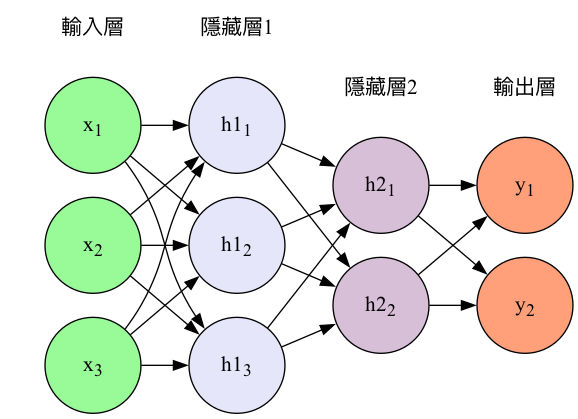

#+CAPTION: 一個簡單的RNN模型
#+LABEL:fig:SimpleRNN-5
#+name: fig:SimpleRNN-5
#+ATTR_LATEX: :width 200
#+ATTR_ORG: :width 300
#+ATTR_HTML: :width 300

在前節中提及RNN的模型架構如圖[[fig:SimpleRNN-5]]所示，事實上，我們平常更常看到的RNN模型是如圖[[fig:SimpleRNN-6]]所示的展開架構:
#+begin_src dot :file ./images/SimpleRNN-2.png :exports none :results none
digraph unrolled_rnn {
  rankdir=LR;

  // 未展開（左側）
  y      [label=y, color=orange, fontcolor=orange, fontsize=16, shape=plaintext];
  h      [label=h, style=filled, fillcolor="lavender", shape=circle, fontsize=16, width=1.0, fixedsize=true];
  x      [label=x, color=seagreen, fontcolor=seagreen, fontsize=16, shape=plaintext];

  // 展開箭頭
  h -> h_t_1 [label=<<B>展開</B>>, color=gray, fontcolor=black, penwidth=3, fontsize=14, arrowhead=normal, arrowsize=2, style=dotted];

  // === time t-1 ===
  x_t_1 [label=<xt-1>, color=seagreen, fontcolor=seagreen, fontsize=16, shape=plaintext];
  h_t_1 [label=<ht-1>, style=filled, fillcolor="lavender", shape=circle, fontsize=16, width=1.0, fixedsize=true];
  y_t_1 [label=<yt-1>, color=orange, fontcolor=orange, fontsize=16, shape=plaintext];

  // === time t ===
  x_t   [label=<xt>, color=seagreen, fontcolor=seagreen, fontsize=16, shape=plaintext];
  h_t   [label=<ht>, style=filled, fillcolor="lavender", shape=circle, fontsize=16, width=1.0, fixedsize=true];
  y_t   [label=<yt>, color=orange, fontcolor=orange, fontsize=16, shape=plaintext];

  // === time t+1 ===
  x_t1  [label=<xt+1>, color=seagreen, fontcolor=seagreen, fontsize=16, shape=plaintext];
  h_t1  [label=<ht+1>, style=filled, fillcolor="lavender", shape=circle, fontsize=16, width=1.0, fixedsize=true];
  y_t1  [label=<yt+1>, color=orange, fontcolor=orange, fontsize=16, shape=plaintext];

  // 排版：同一個 time step 垂直對齊（由下到上）
  {rank=same; x; h; y;}
  {rank=same; x_t_1; h_t_1; y_t_1;}
  {rank=same; x_t;   h_t;   y_t;}
  {rank=same; x_t1;  h_t1;  y_t1;}

  // 邊：由下到上
  h     -> x     [label=<w>, color="seagreen", dir="back"];
  h     -> h     [label=<w>, dir="back", arrowsize="1", color="red"];
  y     -> h     [label=<w>, dir="back", color="orange"];

  h_t_1 -> x_t_1 [label=<wy>, color="seagreen", dir="back"];
  h_t_1 -> h_t   [label=<wh>, color="crimson"];
  y_t_1 -> h_t_1 [label=<wx>, color="orange", dir="back"];

  h_t   -> x_t   [label=<wx>, color="seagreen"];
  h_t   -> h_t1  [label=<wh>, color="crimson"];
  y_t   -> h_t   [label=<wy>, color="orange", dir="back"];

  h_t1  -> x_t1  [label=<wx>, color="seagreen", dir="back"];
  y_t1  -> h_t1  [label=<wy>, color="orange", dir="back"];
}
#+end_src
#+CAPTION: RNN模型的展開架構
#+LABEL:fig:SimpleRNN-6
#+name: fig:SimpleRNN-6
#+ATTR_LATEX: :width 200
#+ATTR_ORG: :width 400
#+ATTR_HTML: :width 500
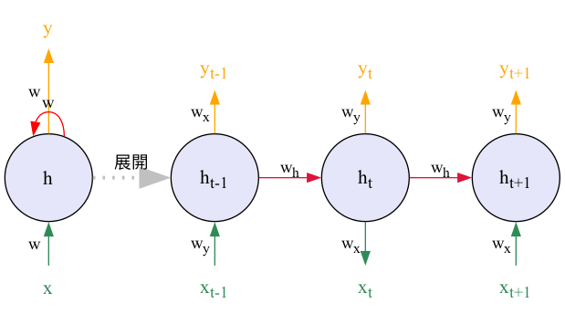

要看懂圖[[fig:SimpleRNN-6]]，你只要搞清楚三件事:
1. RNN不像[[id:20221023T101414.457264][CNN]]那樣每次讀入一整張圖，RNN會逐一處理輸入序列的每個時刻，而不是一次性將整串資料全部計算完。例如，第1次(也就是第1個時間點($t_0$)讀入$x_0$、第2次(也就是第2個時間點($t_1$)讀入$x_1$...
2. 圖中右側「展開後」的三神經元其實是 **同一個參數集合的重複應用、不是三個獨立神經元** ，這三個神經元其實只是同一個 RNN 單元，在不同時間步上被 **重複使用** ，並且權重參數完全共用。三個神經元分別代表不同時間點的神經元，我們可以由 $h_{t-1}, h_{t}, h_{t+1}$ 和 $x_{t-1}, x_{t}, x_{t+1}$ 觀察出同樣的意思。
3. 原本常見的資料在模型中傳遞方向是由左而右，在圖[[fig:SimpleRNN-6]]中這我們用“自下而上”來代表每個時間點的輸入（下方），輸出（上方），這只是圖的表示方法，不影響實際運算。也就是說輸入資料是底下的$x_t$、輸出為上面的$h_t$。

圖[[fig:SimpleRNN-6]]右側的詳細運作流程如下：
1. 在第1個時間點($t-1$)取得輸入($x_{t-1}$)後，神經元會針對 $x_{t-1}$ 進行運算，更新自己的「隱藏狀態」(這個就是會影響「下一個自己」的關鍵)，然後輸出結果$h_{t-1}$
2. 在第2個時間點($t$)取得輸入($x_{t}$)後，利用剛才(時間點$t-1$)更新的「隱藏狀態」來運算$x_t$，然後再次更新自己的狀態並輸出結果$h_t$
3. 最後，在第3個時間點($t+1$)取得輸入($x_{t+1}$)後，利用剛才(時間點$t$)更新的「隱藏狀態」來運算$x_{t+1}$，然後再次更新自己的狀態並輸出結果$h_{t+1}$

整個資料讀取、處理、傳遞的流程大致如下圖所示：

#+CAPTION: RNN的運作流程
#+LABEL:fig:Labl
#+name: fig:Name
#+ATTR_LATEX: :width 200
#+ATTR_ORG: :width 300
#+ATTR_HTML: :width 500
file:images/RNN/2024-05-10_13-00-27_Fully_connected_Recurrent_Neural_Network.webp

上面提及RNN的「記憶」能力是由神經元的「隱藏狀態」實作出來，在上述例子中我們每次儲存一個數值來代表股價的漲跌(如0.5)。實際上，這種狀態以一個隱藏向量(hidden vector)的形式存在於神經元中，如圖[[fig:rnn-cell-2]]中的$h_{t}$)。事實上，這個向量可以是一個很大的數組，例如以一個300維的向量來表示輸入的文字或圖像的特徵。

#+CAPTION: RNN神經元
#+LABEL:fig:rnn-cell-2
#+name: fig:rnn-cell-2
#+ATTR_LATEX: :width 200
#+ATTR_ORG: :width 300
#+ATTR_HTML: :width 500
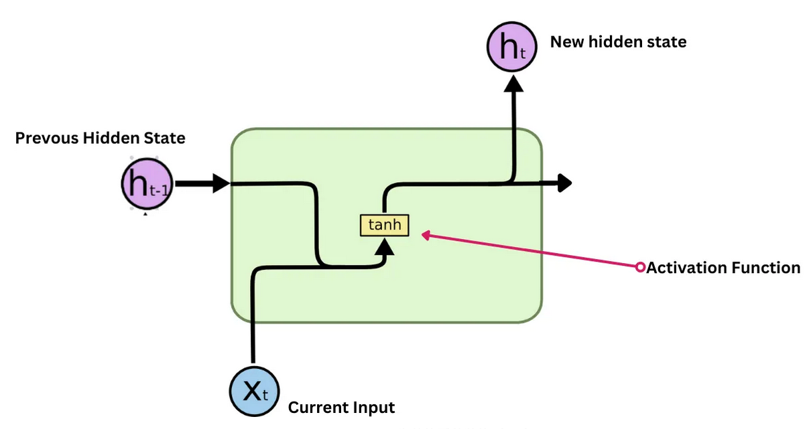

最後一個問題：像是圖[[fig:SimpleRNN-4]]中的那些權重是如何得來的呢？還記得在CNN中我們提到的「訓練」嗎？RNN也是透過類似的方式來學習這些權重。它會在訓練過程中不斷調整這些權重，以便更好地預測序列資料中的模式。這個過程通常使用一種叫做反向傳播（backpropagation）的技術，這樣RNN就能夠學習如何根據過去的輸入和隱藏狀態來預測未來的輸出。

雖然在上述例子中，我們假設RNN的輸入序列是股價漲跌情況，但實際上這個序列可以是任何有時間順序的資料，例如文字、音頻或其他類型的序列資料。RNN的設計使它能夠捕捉這些資料中的時間依賴性，從而更好地理解和預測未來的趨勢。用個具體一點的例子，假設我們假設剛剛的序列 X 實際上是一個內容如下的英文問句：
#+begin_src python -r -n :results output :exports both
X = [ What, time, is, it, ? ]
#+end_src
而且 RNN 已經處理完前兩個元素 What 和 time 了。

則接下來 RNN 會這樣處理剩下的句子：
#+CAPTION: RNN如何處理自然語言
#+LABEL:fig:Labl
#+name: fig:Name
#+ATTR_LATEX: :width 200
#+ATTR_ORG: :width 300
#+ATTR_HTML: :width 500
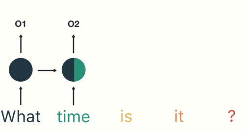

如同我們由左到右逐字閱讀這段文字同時不斷地更新你腦中的記憶狀態，RNN也是以相同的原理在做這件事。RNN的這種設計使它特別適合於像語言翻譯、語音識別或任何需要考慮過去資訊以更好地理解當前情境的任務。例如，在翻譯句子時，理解前面的詞可以幫助更準確地翻譯後面的詞。

但是，RNN也有一些限制，比如它們很難處理很長的序列，因為過長時間的記憶會逐漸消失。這就像如果你試圖回憶幾個月前看的某集連續劇的細節，可能會比較困難。這個問題在後來被一種叫做LSTM的更進階版本的RNN解決。

總之，RNN是一種強大的工具，專門用於處理和預測序列資料中的模式，就像我們用記憶來理解和預測日常生活中的事件一樣。

* RNN實作#1
** RNN的程式運作示例
RNN的運作概念非常簡單，就是在每個時間點 t，RNN 會讀入一個新的序列資料 input_t，並利用這個資料以及自己的記憶狀態 state_t 來產生一個輸出 output_t。這個過程可以用下面的程式碼來表示：
#+begin_src python -r -n :results output :exports both
def f(input_t, state_t): # f 函式是神經元的運算，也是利用遞迴的方式來處理序列資料
    return input_t + state_t
state_t = 0 # 初始化細胞的狀態
for input_t in input_sequence:
    output_t = f(input_t, state_t) # f 函式是神經元的運算
    state_t = output_t # 更新細胞的狀態
#+end_src
在 RNN 每次讀入任何新的序列資料前，細胞 A 中的記憶狀態 state_t 都會被初始化為 0。

接著在每個時間點 t，RNN 會重複以下步驟：
- 讀入 input_sequence 序列中的一個新元素 input_t
- 利用 f 函式將當前細胞的狀態 state_t 以及輸入 input_t 做些處理產生 output_t
- 輸出 output_t 並同時更新自己的狀態 state_t

面對一個如下的簡易RNN，要如何將神經元當下的記憶 state_t 與輸入 input_t 結合，才能產生最有意義的輸出 output_t 呢？
#+begin_src python -r -n :results output :exports both
state_t = 0
# 細胞 A 會重複執行以下處理
for input_t in input_sequence:
    output_t = f(input_t, state_t)
    state_t = output_t
#+end_src

RNN神經元在時間點t的輸出 $h_t$ 由以下公式計算:
$$ h_t = f(W_x \cdot X_t + W_h \cdot h_{t-1} + b) $$

在 SimpleRNN 的神經元中，這個函數 $f$ 的實作很簡單，這也導致了其記憶狀態 state_t 沒辦法很好地「記住」前面處理過的序列元素，因而造成 RNN 在處理後來的元素時，就已經把前面重要的資訊給忘記了，也就是只有短期記憶，沒有長期記憶。長短期記憶（Long Short-Term Memory, 後簡稱 LSTM）就是被設計來解決 RNN 的這個問題。
** RNN的程式模型架構
RNN的模型架構非常簡單，只需要一個 RNN 層即可。以 Keras 為例，建立一個 RNN 層只需要建立一個 SimpleRNN 層即可。在[[file:20221023101139-人工智慧.org][人工智慧]]一節中介紹AI在各產業的應用時，我們曾舉例說明利用AI可以對機器進行預測性維護，以下就是一個簡單的 RNN 預測維護模型：
#+begin_src python -r -n :results output :exports both
import tensorflow as tf
from tensorflow.keras import layers, models

# 模型輸入層 (4個節點)
inputs = layers.Input(shape=(1, 4))

# 隱藏層 (RNN層, 2個節點，對應h1, h2)
hidden = layers.SimpleRNN(units=2, activation='tanh', return_sequences=False)(inputs)

# 模型輸出層 (2個節點)
outputs = layers.Dense(units=2, activation='linear')(hidden)

# 建立並編譯模型
model = models.Model(inputs=inputs, outputs=outputs)
model.compile(optimizer='adam', loss='mse')

# 顯示模型結構
from tensorflow.keras.utils import plot_model

plot_model(
    model,
    to_file='./images/rnnmodel.png',        # 輸出的檔名
    show_shapes=True,           # 在圖中顯示 shape
    show_layer_names=True,      # 顯示層的名稱
    rankdir='TB'                # TB=上下展開, LR=左右展開
)
# 總參數數量
total_params = model.count_params()
# 可訓練參數
trainable_params = int(
    sum([tf.keras.backend.count_params(w) for w in model.trainable_weights])
)
# 非可訓練參數
non_trainable_params = int(
    sum([tf.keras.backend.count_params(w) for w in model.non_trainable_weights])
)

# 格式化顯示
print(f"Total params: {total_params} ({total_params*4/1024:.2f} B)")
print(f"Trainable params: {trainable_params} ({trainable_params*4/1024:.2f} B)")
print(f"Non-trainable params: {non_trainable_params} ({non_trainable_params*4/1024:.2f} B)")

#+end_src

#+RESULTS:
: Total params: 20 (0.08 B)
: Trainable params: 20 (0.08 B)
: Non-trainable params: 0 (0.00 B)

#+CAPTION: RNN模型架構
#+LABEL:fig:Labl
#+name: fig:Name
#+ATTR_LATEX: :width 300
#+ATTR_ORG: :width 300
#+ATTR_HTML: :width 300
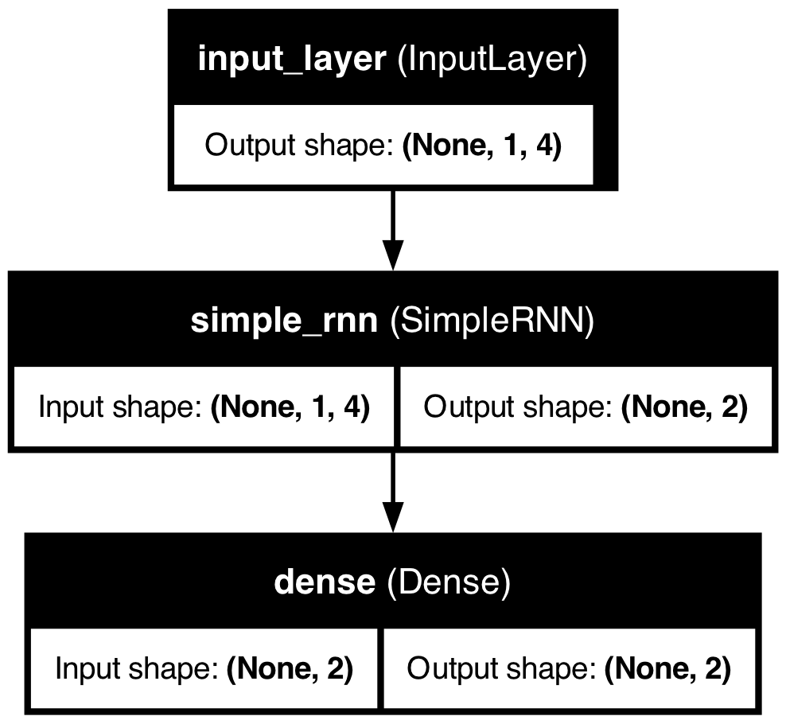

上述模型架構的資料流向如下：
#+BEGIN_SRC plantuml :file rnn_model.png
@startuml
left to right direction
hide empty description
skinparam componentStyle rectangle

package "RNN Network" {
  rectangle Input {
    node "● x1" as i1
    node "● x2" as i2
    node "● x3" as i3
    node "● x4" as i4
  }

  rectangle Hidden {
    node "● h1" as h1
    node "● h2" as h2
  }

  rectangle Output {
    node "● y1" as o1
    node "● y2" as o2
  }

  ' 輸入層與隱藏層的連接 (綠色)
  i1 -[#green]-> h1
  i2 -[#green]-> h1
  i3 -[#green]-> h1
  i4 -[#green]-> h1

  i1 -[#green]-> h2
  i2 -[#green]-> h2
  i3 -[#green]-> h2
  i4 -[#green]-> h2

  ' 隱藏層內循環 (橘色)
  h1 -[#orange]-> h1 : recurrent
  h2 -[#orange]-> h2 : recurrent
  h1 -[#orange,bold,dashed]-> h2 : interaction
  h2 -[#orange,bold,dashed]-> h1

  ' 隱藏層與輸出層的連接 (藍色)
  h1 -[#blue]-> o1
  h1 -[#blue]-> o2
  h2 -[#blue]-> o1
  h2 -[#blue]-> o2
}

@enduml
#+END_SRC

#+CAPTION: RNN架構
#+LABEL:fig:RNN-arch-0
#+name: fig:RNN-arch-0
#+ATTR_LATEX: :width 300
#+ATTR_ORG: :width 300
#+ATTR_HTML: :width 500
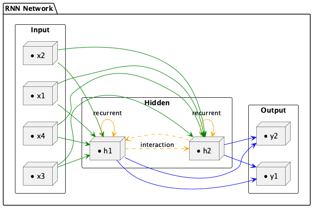

#+begin_src dot :file ./images/RNN-flow.png :exports none :results none
digraph simple_rnn_full {
  rankdir=LR;
  nodesep=0.1;
  ranksep=0.4;
  // Layer: Input
  node [shape=ellipse, style=filled, fillcolor="#E9F8D8", fontname="DejaVu Sans", fontsize=14, width=1.0, fixedsize=true];
  x1 [label=<x1>];
  x2 [label=<x2>];
  x3 [label=<x3>];
  x4 [label=<x4>];

  // Layer: Hidden
  node [shape=box, style=filled, fillcolor="#D9E8FA", fontname="DejaVu Sans", fontsize=12, width=1.1, fixedsize=true];
  h1 [label=<h1>, image="images/relu.png"];
  h2 [label=<h2>, image="images/relu.png"];

  nodesep=0.1;
  node [shape=ellipse, style=filled, fillcolor="#FFDAB9", fontname="DejaVu Sans", fontsize=14, width=1.0, fixedsize=true];
  y1 [label=<y1>];
  y2 [label=<y2>];

  // Bias nodes (for style)
  node [shape=square, style=filled, fillcolor="#BFE3FF", width=0.3, fontsize=10];
  b1 [label=<b1>];
  b2 [label=<b2>];

  // ----- Input to Hidden -----
  edge [color=seagreen, fontcolor=seagreen, fontsize=11];
  x1 -> h1 [label=<× w11>];
  x1 -> h2 [label=<× w21>];
  x2 -> h1 [label=<× w12>];
  x2 -> h2 [label=<× w22>];
  x3 -> h1 [label=<× w13>];
  x3 -> h2 [label=<× w23>];
  x4 -> h1 [label=<× w14>];
  x4 -> h2 [label=<× w24>];

  // Bias to hidden
  b1 -> h1 [label=<+ b1>, color="gray50", fontcolor="red"];
  b2 -> h2 [label=<+ b2>, color="gray50", fontcolor="red"];

  // ----- Recurrent -----
  edge [color="crimson", style="dashed", fontcolor="crimson", fontsize=11];
  h1 -> h1 [label=<recurrent>, dir="back", minlen=5];
  h2 -> h2 [label=<recurrent>, dir="back", minlen=3];

  // Hidden to hidden interaction (optional)
  edge [color="orange", style="dotted", fontcolor="orange", fontsize=11];
  h2 -> h1 [label=<interaction>, minlen=5];
  h1 -> h2 [label=<interaction>, minlen=5];

  // ----- Hidden to Output -----
  edge [color="royalblue", fontcolor="royalblue", fontsize=11, style=solid];
  h1 -> y1 [label=<× wy1>];
  h1 -> y2 [label=<× wy2>];
  h2 -> y1 [label=<× wy1>];
  h2 -> y2 [label=<× wy2>];

  // --- Layer alignment ---
  {rank=same; x1; x2; x3; x4;}
  {rank=same; h1; h2;}
  {rank=same; y1; y2;}
}
#+end_src
#+CAPTION: Caption
#+LABEL:fig:Labl
#+name: fig:Name
#+ATTR_LATEX: :width 300
#+ATTR_ORG: :width 300
#+ATTR_HTML: :width 500
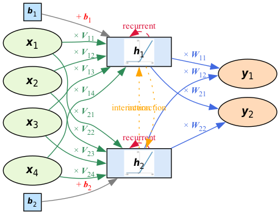

這個RNN模型的架構可分為四個主要部分，特別適合應用於工廠設備的預測性維護場景：
1. 輸入層：
   模型輸入層包含四個節點，機器感測器每分鐘會收到下列資料：
   - 溫度（Temperature）
   - 壓力（Pressure）
   - 振動幅度（Vibration）
   - 電流（Current）
   這些感測器數據能夠即時反映設備運作狀態，是判斷異常與劣化趨勢的第一手依據。
2. 隱藏層（RNN層）：
   隱藏層由兩個RNN單元（h1、h2）組成，能夠捕捉時間序列資料的動態變化。RNN特有的「記憶能力」可根據歷史感測數據（如過去的震動紀錄、轉速變化）與當前輸入，判斷設備狀態變化趨勢，進而識別異常徵兆。
3. 輸出層：
    輸出層同樣設計為兩個節點：
    1. y1：預測設備未來一段時間內出現故障的風險機率（例如馬達即將故障、異常發熱等）。
    2. y2：預測是否需維修（建議立即維護/可繼續運行）
4. 偏置節點：
   每個RNN隱藏單元均設有對應的偏置（b1、b2），用於調整輸出，增強模型彈性與表現力。

這個模型的設計能夠有效地處理時間序列資料，並根據歷史數據預測設備的未來狀態，特別適合用於工廠設備的預測性維護。透過這樣的模型，工廠可以提前識別設備異常，降低突發停機風險，提高生產效率。

* RNN實作#2
** 匯入與資料產生
#+begin_src python -r -n :results output :exports both
import numpy as np
import matplotlib.pyplot as plt

# 1. 生成 sin(x) + cos(x) 並加入雜訊的時間序列資料
def generate_sin_cos_data(total_length=3000, noise_std=0.1):
    x = np.linspace(0, total_length * 0.1, total_length)
    clean = np.sin(x) + np.cos(x * 0.5)  # 不同頻率增加變化性
    noise = np.random.normal(0, noise_std, size=clean.shape)
    noisy_data = clean + noise
    return x, noisy_data.reshape(-1, 1), clean.reshape(-1, 1)

# 2. 繪圖展示 sin + cos 波型（含雜訊）
x, noisy_data, clean_data = generate_sin_cos_data()

plt.figure(figsize=(12, 4))
plt.plot(x, clean_data, label='Clean sin(x) + cos(0.5x)', alpha=0.6)
plt.plot(x, noisy_data, label='Noisy signal', alpha=0.8)
plt.title("Time Series: sin(x) + cos(0.5x) with Noise")
plt.xlabel("x")
plt.ylabel("Value")
plt.legend()
plt.grid(True)
plt.tight_layout()
plt.show()
#+end_src
** 前處理與序列資料製作
#+begin_src python -r -n :results output :exports both
import tensorflow as tf
from tensorflow import keras
from sklearn.preprocessing import MinMaxScaler

# 標準化
scaler = MinMaxScaler()
scaled = scaler.fit_transform(noisy_data)

# 建立序列
def create_sequences(data, seq_len=20):
    X, y = [], []
    for i in range(len(data) - seq_len):
        X.append(data[i:i+seq_len])
        y.append(data[i+seq_len])
    return np.array(X), np.array(y)

SEQ_LEN = 20
X, y = create_sequences(scaled, SEQ_LEN)

# 分訓練與測試集
split = int(len(X) * 0.8)
X_train, y_train = X[:split], y[:split]
X_test, y_test = X[split:], y[split:]

#+end_src
** 建立RNN模型
#+begin_src python -r -n :results output :exports both
model = keras.models.Sequential([
    keras.layers.SimpleRNN(1, input_shape=[None, 1])  # 預設 activation='tanh'
])
model.compile(loss='mse', optimizer='adam')
model.summary()
#+end_src

在 Keras 中，input_shape=[None, 1] 的意思是：
| 維度 | 代表什麼              | 解釋                                                       |
| None | 時間步長（timesteps） | 不指定具體長度，代表可以處理「任意長度」的序列             |
| 1    | 每個時間點的特徵數    | 這裡是一個數字（例如只有一個值：sin+cos），所以是 1 維特徵 |
在 Keras RNN 中，每筆資料會被視為一個 3 維陣列：
#+begin_src python -r -n :results output :exports both
[樣本數, 時間步長 (None), 特徵數]
#+end_src
舉個例子：
#+begin_src python -r -n :results output :exports both
X.shape = (1000, 20, 1)
#+end_src
| 維度 | 代表                 | 舉例                         |
| 1000 | 有 1000 筆序列       | 訓練樣本數                   |
|   20 | 每筆序列長度是 20 步 | 每筆是一段長度 20 的時間序列 |
|    1 | 每步只有 1 個數字    | 像是 sin 值、溫度、股價      |
我們現在只知道每個時間點有 1 個特徵（像是溫度），但不知道資料序列會多長，因此時間的維度就交給模型在運作時決定，所以寫 None。」
** 訓練模型
#+begin_src python -r -n :results output :exports both
model.fit(X_train, y_train, epochs=20)
#+end_src
** 評估預測效果並繪圖
幾種RNN模型的評估指標如下：
1. MSE（均方誤差，Mean Squared Error）, 是預測值與實際值之間的平均平方差，越小越好, 單位是平方的數值。計算公式如下：
   $$ MSE = \frac{1}{n} \sum_{i=1}^{n} (y_i - \hat{y}_i)^2 $$
   其中，$y_i$是實際值，$\hat{y}_i$是預測值，$n$是樣本數。
1. MAE（平均絕對誤差，Mean Absolute Error）, 是預測值與實際值之間的平均絕對差，越小越好, 單位與資料本身一致, 優點是不容易被極端值影響。計算公式如下：
   $$ MAE = \frac{1}{n} \sum_{i=1}^{n} |y_i - \hat{y}_i| $$
   其中，$y_i$是實際值，$\hat{y}_i$是預測值，$n$是樣本數。
1. RMSE（均方根誤差，Root Mean Squared Error）, 是預測值與實際值之間的均方根誤差，越小越好, 單位是平方根的數值，常用在實際工程應用。 計算公式如下：
   $$ RMSE = \sqrt{\frac{1}{n} \sum_{i=1}^{n} (y_i - \hat{y}_i)^2} $$
   其中，$y_i$是實際值，$\hat{y}_i$是預測值，$n$是樣本數。
1. $R^2$（決定係數，Coefficient of Determination），是用來評估模型預測能力的指標，值介於0~1之間，越接近1表示模型越好。$R^2$的計算公式如下：
   $$ R^2 = 1 - \frac{\sum_{i=1}^{n} (y_i - \hat{y}_i)^2}{\sum_{i=1}^{n} (y_i - \bar{y})^2} $$

#+begin_src python -r -n :results output :exports both
predicted = model.predict(X_test)
# 還原回原始數值
predicted_inv = scaler.inverse_transform(predicted)
actual_inv = scaler.inverse_transform(y_test)

plt.figure(figsize=(12, 4))
plt.plot(actual_inv, label='Clean Target', alpha=0.6)
plt.plot(predicted_inv, label='Predicted', alpha=0.8)
plt.title("Keras SimpleRNN Prediction")
plt.xlabel("Time step")
plt.ylabel("Value")
plt.legend()
plt.grid(True)
plt.show()

#+end_src
** 提升效能
*** 增加隱藏層神經元數量
#+begin_src python -r -n :results output :exports both
keras.layers.SimpleRNN(8, input_shape=[None, 1])
#+end_src
*** 增加隱藏層數量
例如：SimpleRNN層、Dense層、Dropout層
**** SimpleRNN層
#+begin_src python -r -n :results output :exports both
model = keras.models.Sequential([
    keras.layers.SimpleRNN(4, return_sequences=True, input_shape=[None, 1]),  # 第一層要回傳序列
    keras.layers.SimpleRNN(4),  # 第二層直接接收整段序列資訊
    keras.layers.Dense(1)
])
#+end_src
return_sequences=True：告訴第一層 RNN 回傳「每個時間步的輸出」，否則下一層 RNN 沒辦法處理。
**** Dense層
#+begin_src python -r -n :results output :exports both
model = keras.models.Sequential([
    keras.layers.SimpleRNN(4, input_shape=[None, 1]),  # 增加容量
    keras.layers.Dense(1)  # 加輸出層
])
#+end_src
**** Dropout層
#+begin_src python -r -n :results output :exports both
model = keras.models.Sequential([
    keras.layers.SimpleRNN(4, return_sequences=True, input_shape=[None, 1]),
    keras.layers.SimpleRNN(4),
    keras.layers.Dropout(0.2),
    keras.layers.Dense(1)
])
#+end_src
*** 增加訓練次數

* RNN實作#3

* LSTM
RNN的一個主要問題是，當序列變得很長時，它們很難記住遠處的資訊。這是因為在 RNN 中，每個時間點的輸出都是由當前輸入和上一個時間點的輸出共同決定的。這意味著當序列變得很長時，RNN 會遺忘遠處的資訊，導致模型無法很好地理解整個序列。

為了加強這種RNN的「記憶能力」，人們開發各種各樣的變形體，如非常著名的Long Short-term Memory(LSTM)，用於解決「長期及遠距離的依賴關係」。

** LSTM的運作原理
想象你有一個書包（LSTM的內部結構），你可以決定在上課前放入什麼書籍、何時取出某本書，或者甚至決定更新裡面的某些書，你每天上學就利用書包裡的書來學習新的知識。LSTM也有類似的機制來處理信息，這些機制就是一個個的閘門(Gate)。

LSTM利用一個新的機制：記憶狀態（Cell State ）來達到保留長期記憶，如圖[[fig:RNNLSTM]]所示，我們可以想像LSTM將RNN的隱藏狀態拆成兩部份：記憶狀態的變化較慢，能儘量保留先前的記憶、而隱藏狀態則隨輸入不同而有較多變化。

#+CAPTION: RNN v.s. LSTM
#+LABEL:fig:RNNLSTM
#+name: fig:RNNLSTM
#+ATTR_LATEX: :width 200
#+ATTR_ORG: :width 300
#+ATTR_HTML: :width 500
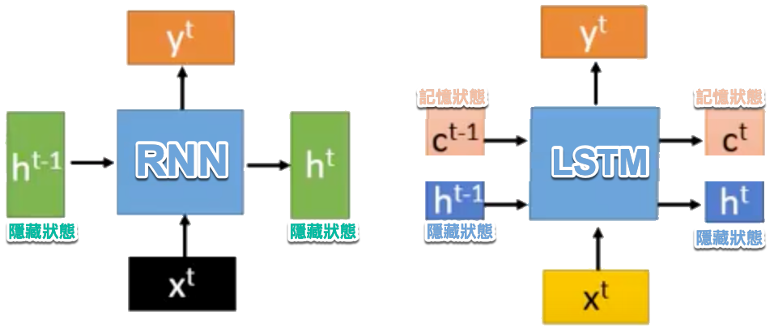

除了記憶狀態，LSTM還多了三個閘門來管控資訊的保留與遺忘：遺忘閘（forget gate）、輸入閘（input gate）、輸出閘（output gate）。其相應功能大致如下(參考圖[[fig:LSTM]])：
1.	遺忘閘（forget gate）：控制模型中有哪些資訊可以被遺忘。
2.	輸入閘（input gate）：控制當前的輸入資訊能對記憶狀態產生多大的影響。
3.	輸出閘（output gate）：控制記憶狀態中的哪些資訊可以被傳遞到隱藏狀態並往後傳遞。

#+CAPTION: LSTM
#+LABEL:fig:LSTM
#+name: fig:LSTM
#+ATTR_LATEX: :width 200
#+ATTR_ORG: :width 300
#+ATTR_HTML: :width 500
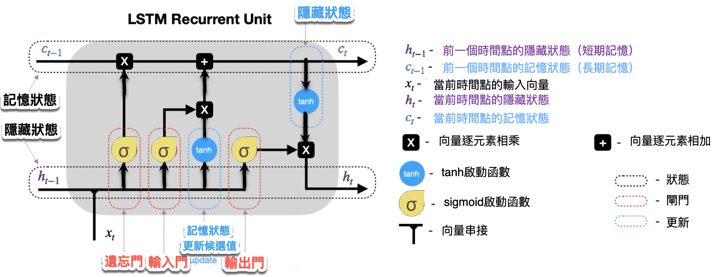

典型的LSTM架構如圖[[fig:LSTM]]所示，可以看出除了原本的資料輸入(input)，LSTM還多了三個輸入，分別是input(模型輸入），forget gate(遺忘閘)，input gate(輸入閘)，以及output gate(輸出閘)。因此相比普通的神經網路，LSTM的參數量是它們的4倍。這3個閘訊號都是處於0～1之間的實數，1代表完全打開，0代表關閉。

1. 遺忘閘（Forget Gate）：這就像是你決定從書包中拿掉不再需要的書。在LSTM中，遺忘閘會查看新的輸入信息和當前的記憶，然後決定保留哪些記憶（有用的）或者遺忘哪些（不再重要的）。
2. 輸入閘（Input Gate）：這是決定將哪些新書放入書包。LSTM會評估當前的輸入（例如新的單詞或資料點），並決定應該添加哪些信息到記憶中，這有助於更新記憶內容。
3. 輸出閘（Output Gate）：決定從書包中拿出哪本書來使用。根據需要的話題或任務，LSTM會決定哪些記憶是目前有用的，然後基於這些記憶提供輸出信息。
4. 記憶單元（Memory Cell）：這是LSTM的核心，它負責記錄和更新所有的記憶。記憶單元是一個長期的記憶存儲，可以通過遺忘閘和輸入閘來更新。LSTM 中的 Memory Cell（也就是記憶狀態，通常記為 Cₜ）的核心功能，就是要 跨時間步保持資訊的狀態，這也是它的關鍵設計。

圖[[fig:LSTM]]為時間點t時資料在神經元中流動示意，進一步的處理流程如下所述：
- LSTM神經元於時間點t收到三項輸入資料：
  1. x_t：代表當前時間點的輸入資料。
  2. h_(t-1)：上一時間點的隱藏狀態。
  3. c_(t-1)：上一時間點的記憶狀態。
- LSTM神經元於時間點t輸出兩項資料：
  1. c_t：代表當前的記憶狀態，c_t的值來自以下兩部份：
  2. 輸出閘：決定有多少來自c_t的資訊可以傳遞到h_t。

#+BEGIN_SRC plantuml :file lstm_model.png
@startuml
left to right direction
hide empty description
skinparam componentStyle rectangle

rectangle "LSTM Cell" {
  top to bottom direction
  rectangle "LSTM Gates" as lstm{
    rectangle "Input Gate" as ig
    rectangle "Forget Gate" as fg
    rectangle "Output Gate" as og
    rectangle "Memory Cell" as mc

    ' 記憶單元自我循環箭頭（表示 Cₜ₋₁ → Cₜ）
    mc -[#black,bold]-> mc : Cₜ₋₁ → Cₜ
  }

  ' 閘控控制（外部訊號進入）
  ig <-[#blue]- "xₜ, hₜ₋₁ = Signal control the \ninput gate\n(Other port of the network)"
  fg <-[#blue]- "xₜ, hₜ₋₁ = Signal control the \nforget gate\n(Other port of the network)"
  og <-[#blue]- "xₜ, hₜ₋₁ = Signal control \nthe output gate\n(Other port of the network)"

  ' 外部輸入從下方進入
  lstm <-[#red]- "input from port of the network"
}

' 外部輸出從上方離開
"output to port of the network" <-[#red]- lstm

' 記憶資料流（黑色）
ig -[#black]-> mc
fg -[#black]-> mc
mc -[#black]-> og
mc -[#black]-> fg

@enduml
#+END_SRC

#+CAPTION: LSTM架構
#+LABEL:fig:LSTM-arch-0
#+name: fig:LSTM-arch-0
#+ATTR_LATEX: :width 400
#+ATTR_ORG: :width 400
#+ATTR_HTML: :width 600
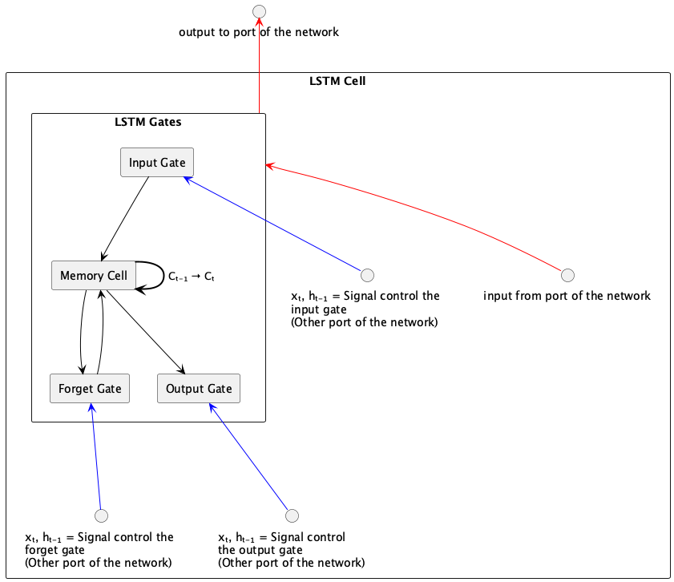

進一步從時間序列的角度來看，LSTM運作過程中的資料流向如下：
- 遺忘閘(Forget Gate)：該閘決定在特定時間點(timestamp, 例如圖[[fig:LSTM-arch-1]]中的$t$ )，前一個時間點($t-1$) 的模型記憶(也就是狀態, state)是否會被記住保留參與這個時間點的運算，或是直接被遺忘。當遺忘閘打開時，前一刻的記憶會被保留，當遺忘閘關閉時，前一刻的記憶就會被清空。換句話說，就讓模型具備選擇性遺忘部份訊息的能力，這個機制可以由激活函數sigmoid來實作，其中0代表完全忘記，1代表完全記住。
- 輸入閘(Input Gate): 決定目前這個時間點有哪些神經元的輸入($x$)中有哪些是足夠重要到可以保留下來加入「目前狀態」中，因為在序列輸入中，並不是每個時刻的輸入的資訊都是同等重要的，當輸入完全沒有用時，輸入閘關閉，也就是此時刻的輸入資訊被丟棄了。這個機制同樣也可以由sigmoid 激活函數來實作，sigmoid產生的值介於0到1之間，可以被看作是一個閘控信號，這個閘控信號​和tanh函數生成的候選隱藏狀態相乘，確定了從候選狀態中將多少資訊添加到當前的單元狀態​中。
- 輸出閘(Output Gate): 決定目前神經元的狀態中有哪一部分可以輸出(流向下一個狀態)，同樣由激活函數來sigmoid來決定，這個輸出會通過tanh函數來調整，因為Tanh能夠將單元狀態的值正規化到-1到1之間，這有助於控制神經網路的激活範圍。再由Tanh來提供輸出權重。
- 記憶單元(Memory Cell): 這是LSTM的核心，它負責記錄和更新所有的記憶。記憶單元是一個長期的記憶存儲，可以通過遺忘閘和輸入閘來更新。LSTM 中的 Memory Cell（也就是記憶狀態，通常記為 Cₜ）的核心功能，就是要 跨時間步保持資訊的狀態，這也是它的關鍵設計。在數學公式中，LSTM 的記憶更新如下：$C_t=f_t \times C_{t−1}+i_t \times \tilde{C}_t$，其中：
   A) $f_t$ ：忘記閘輸出（控制保留多少舊記憶）
   B) $C_{t-1}$ ：上一個時間步的記憶狀態
   C) $i_t$ ：輸入閘輸出（控制加入多少新資訊）
   D) $\tilde{C}_t$ ：由當前輸入與前一隱藏狀態計算出的新候選記憶

#+CAPTION: LSTM運作原理
#+LABEL:fig:LSTM-arch-1
#+name: fig:LSTM-arch-1
#+ATTR_LATEX: :width 200
#+ATTR_ORG: :width 300
#+ATTR_HTML: :width 500
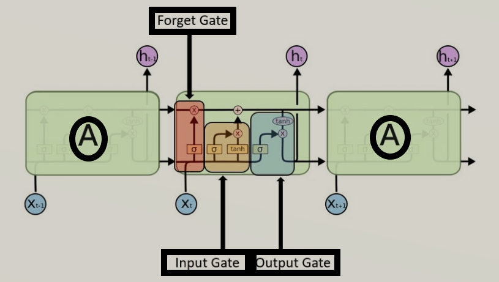

因為這樣的機制，讓 LSTM 即使面對很長的序列資料也能有效處理，不遺忘以前的記憶。因為效果卓越，LSTM 非常廣泛地被使用。事實上，當有人跟你說他用 RNN 做了什麼 NLP 專案時，有 9 成機率他是使用 LSTM 或是 GRU（LSTM 的改良版，只使用 2 個閘閘） 來實作，而不是使用最簡單的 SimpleRNN。

** LSTM的程式運作示例
LSTM 的設計引入了三個「閘」（gate）：
- **遺忘閘 forget gate**：決定應該忘記多少過去的記憶
- **輸入閘 input gate**：決定應該加入多少新的資訊進入記憶
- **輸出閘 output gate**：決定應該輸出多少目前的記憶內容

此外，LSTM 維持了兩種狀態：
- **cell state（長期記憶）C_t**：透過閘控機制被有選擇地保留或更新
- **hidden state（短期輸出）h_t**：實際傳給下一層網路的輸出

其計算過程可以用以下簡化版 Python 表示：
#+begin_src python -r -n :results output :exports both
def lstm_step(x_t, h_t_prev, c_t_prev):
    forget_gate = sigmoid(W_f @ x_t + U_f @ h_t_prev + b_f)
    input_gate = sigmoid(W_i @ x_t + U_i @ h_t_prev + b_i)
    output_gate = sigmoid(W_o @ x_t + U_o @ h_t_prev + b_o)
    candidate = tanh(W_c @ x_t + U_c @ h_t_prev + b_c)

    c_t = forget_gate * c_t_prev + input_gate * candidate
    h_t = output_gate * tanh(c_t)
    return h_t, c_t

h_t, c_t = 0, 0  # 初始化
for x_t in input_sequence:
    h_t, c_t = lstm_step(x_t, h_t, c_t)
#+end_src

LSTM 解決了 RNN 無法長期保留資訊的問題，特別適用於像語言模型、機器翻譯、長時間序列預測等任務。

** LSTM的程式模型架構
LSTM 是一種改良版的 RNN，可記住更長期的資訊。只需將 SimpleRNN 改為 LSTM 層即可。以下是一個 LSTM 模型的寫法：
#+begin_src python -r -n :results output :exports both
import tensorflow as tf
from tensorflow.keras import layers, models

# 模型輸入層 (4個節點)
inputs = layers.Input(shape=(1, 4))

# 隱藏層 (LSTM層, 2個單元)
hidden = layers.LSTM(units=2, activation='tanh', return_sequences=False)(inputs)

# 模型輸出層 (2個節點)
outputs = layers.Dense(units=2, activation='linear')(hidden)

# 建立並編譯模型
model = models.Model(inputs=inputs, outputs=outputs)
model.compile(optimizer='adam', loss='mse')

# 顯示模型結構
model.summary()
#+end_src

#+RESULTS:
#+begin_example
Model: "functional"
┏----------------━━━━━━━━━━━━━━━━━━┳━━━━━━━━━━━━━━━━━━━━━━━━┳━━━━━━━━━━━━━━━┓
| Layer (type)                    | Output Shape           |       Param # |
━━━━━━━━━━━━━━━━━━━━━━━━━━━━━━━━━╇━━━━━━━━━━━━━━━━━━━━━━━━╇━━━━━━━━━━━━━━━┩
│ input_layer (InputLayer)        │ (None, 1, 4)           │             0 │
+─────────────────────────────────┼────────────────────────┼───────────────┤
│ lstm (LSTM)                     │ (None, 2)              │            56 │
+─────────────────────────────────┼────────────────────────┼───────────────┤
│ dense (Dense)                   │ (None, 2)              │             6 │
└─────────────────────────────────┴────────────────────────┴───────────────┘
 Total params: 62 (248.00 B)
 Trainable params: 62 (248.00 B)
 Non-trainable params: 0 (0.00 B)
#+end_example

** 實作: 以AI預測股價-隔日漲跌
[[https://colab.research.google.com/drive/1IehBuskagMTm6RK6WB-dsf3NPZKTNVqs?usp=sharing][當AI遇上股票-LSTM.ipynb]]
*** 安裝相關套件
#+begin_src shell -r -n :results output :exports both
pip install yfinance
#+end_src
*** 下載股價資訊
#+begin_src python -r -n :results output :exports both
import yfinance as yf

df = yf.Ticker('2330.TW').history(period='10y')
print(type(df))
#+end_src
**** 查看下載的資料集
#+begin_src python -r -n :results output :exports both :session stock :async
df
#print(df[:5])
#+end_src
**** 取出需要的特徵值
此次將成交量納入考慮
#+begin_src python -r -n :results output :exports both
data = df.filter(['Close'])
data
#+end_src
*** 觀察原始資料/日K圖
#+begin_src python -r -n :results output :exports both
import matplotlib.pyplot as plt
plt.clf()
plt.plot(data.Close)
plt.show()
#+end_src
*** 將資料標準化
#+begin_src python -r -n :results output :exports both
from sklearn.preprocessing import MinMaxScaler
scaler = MinMaxScaler(feature_range=(0, 1))
sc_data = scaler.fit_transform(data.values)

sc_data #變成numpy array
#+end_src
*** 建立、分割資料
**** 建立資料集及標籤
#+begin_src python -r -n :results output :exports both
import numpy as np

featureDays = 10
x_data, y_data = [], []
for i in range(len(sc_data) - featureDays):
  x = sc_data[i:i+featureDays]
  y = sc_data[i+featureDays]
  x_data.append(x)
  y_data.append(y)

x_data, y_data = np.array(x_data), np.array(y_data)

print(x_data.shape)
print(y_data.shape)
print(len(x_data)) #全部資料筆數
#+end_src
**** 分割訓練集與測試集
#+begin_src python -r -n :results output :exports both
ratio = 0.8
train_size = round(len(x_data) * ratio)
print(train_size)
x_train, y_train = x_data[:train_size], y_data[:train_size]
x_test, y_test = x_data[train_size:], y_data[train_size:]

print(x_train.shape)
print(y_train.shape)
print(x_test.shape)
print(y_test.shape)
#+end_src
*** 建立、編譯、訓練模型
**** 建立模型
#+begin_src python -r -n :results output :exports both
import tensorflow as tf
#建構LSTM模型
model = tf.keras.Sequential()
# LSTM層
model.add(tf.keras.layers.LSTM(units=64, unroll = False, input_shape=(featureDays,1)))
# Dense層
model.add(tf.keras.layers.Dense(units=1))
#+end_src
#+begin_src python -r -n :results output :exports both
model.summary()
#+end_src
**** 編譯模型
#+begin_src python -r -n :results output :exports both
model.compile(loss='mse', optimizer='adam', metrics=['accuracy'])
#+end_src
**** 訓練模型
#+begin_src python -r -n :results output :exports both
model.fit(x_train, y_train,
          validation_split=0.2,
          batch_size=200, epochs=20)
#+end_src
*** 性能測試
**** loss
#+begin_src python -r -n :results output :exports both
score = model.evaluate(x_test, y_test)
print('loss:', score[0])
#+end_src
**** predict
#+begin_src python -r -n :results output :exports both
predict = model.predict(x_test)
predict = scaler.inverse_transform(predict)
predict = np.reshape(predict, (predict.size,))
ans = scaler.inverse_transform(y_test)
ans = np.reshape(ans, (ans.size,))
print(predict[:3])
print(ans[:3])
#+end_src
**** plot
#+begin_src python -r -n :results output :exports both
plt.plot(predict)
plt.plot(ans)
plt.show()
#+end_src

* RNN學習資源
- [[https://www.youtube.com/watch?v=6AW80qmaAOk][10分鐘了解RNN的基本概念 ]]
- [[https://www.youtube.com/watch?v=zXLAeat_b7g][從頭寫出 RNN (PyTorch) 完整介紹 [手寫數字辨識]]]
- [[https://www.youtube.com/watch?v=AsNTP8Kwu80][解說的很清楚的RNN教學影片]]
- [[https://www.youtube.com/watch?v=ubDtr6dh0c8][我的第一支快速利用TensorFlow 2.0利用RNN進行文本分類(第一部分) ]]
- [[https://www.youtube.com/watch?v=SyYIuVJ9BhQ][我的第一支快速利用TensorFlow 2.0利用RNN進行文本分類(第二部分)]]

* 待用 :noexport:
** 待用1
RNN 能夠處理「任意個數的輸入序列」，所以十分適合用在「語言塑模」或「語音辨識」。理論上，RNN 可以用來處理任何問題，因為它已被證明具有「圖靈完備性」(Turing-Complete)。以循環關係的函數表示 RNN 可將其視為 \(S_t=f(S_{t-1},X_t)\)，這裡的\(S_t\)表示第\(t\)步的狀態，它是由函數\(f\)對上一步(\(t-1\))的狀態(即\(S_{t-1}\))與這一步的輸入\(X_t\)所計算出來的結果，這裡的函數\(f\)可以是任何可微分的函數，如\(S_t=tang(S_{t-1}*W+X_t*U)\)。
正因為每個狀態都會與之前所有的計算有關，其所代表的重要含義為：隨著時間的推移，RNNs 可以說是有記憶力的，因為狀態 S 包含了之前所有步驟的資訊。

語言塑模的目標是計算「字的序列」的機率，這在「語音辨識」、OCR、「機器翻譯」、「拼字校正」上都非常重要。以「字」為基準的「語言模型」是由「字的序列」來定義機率分佈，給定一個長度為\(m\)的字序列，它會為整個字序列給定一個機率\(P(w_1,...,w_m)\)，其「聯合機率」(joint probability)可以由公式[[eqn:JointProbability]]中的連鎖規則(chain rule)計算出來：
#+NAME: eqn:JointProbability
\begin{equation}
P(w_1,...,w_m)=P(w_1)P(w_2|w_1)P(w3|w_2,w_1)...P(w_m|w_1,...,w_{m-1})
\end{equation}

這個聯合機率一般是基於一個「獨立性假設」(independence assumption)，即，第 i 個字只會相依於它之前的 n-1 個字，如果我們的模型是連續 n 個字的聯合機率，就稱為「n元」(n-gram)。例：
- 1-gram / unigram: "The", "quick", "brown" and "fox"
- 2-grams / bigram: "The quick", "quick brown" and "brown fox"
- 3-grams / trigram: "The quick brown" and "quick brown fox"
- 4-grams: "The quick brown fox"

現在，如果我們有一個巨大的語料庫(corpus of text)，我們就可以用一個特定的 n(通常為 2-4)搜尋所有「n元」在「語料庫」中出現的次數，進而在「給定前 n-1 個字的前提下」，估計出每個 n 元中最後一個字出現的機率。
** LSTM
#+CAPTION: Caption
#+LABEL:fig:Labl
#+name: fig:Name
#+ATTR_LATEX: :width 300
#+ATTR_ORG: :width 300
#+ATTR_HTML: :width 500
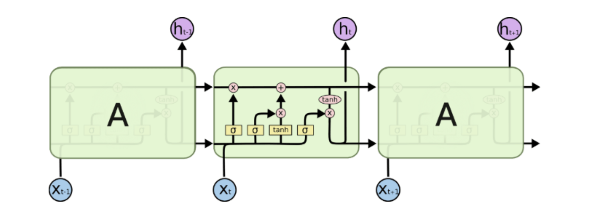

基本上一個 LSTM 細胞裡頭會有 3 個閘閘（Gates）來控制細胞在不同時間點的記憶狀態：

- Forget Gate：決定細胞是否要遺忘目前的記憶狀態
- Input Gate：決定目前輸入有沒有重要到值得處理
- Output Gate：決定更新後的記憶狀態有多少要輸出

透過這些閘閘控管機制，LSTM 可以將很久以前的記憶狀態儲存下來，在需要的時候再次拿出來使用。值得一提的是，這些閘閘的參數也都是神經網路自己訓練出來的。

#+CAPTION: LSTM 細胞頂端那條 cell state 正代表著細胞記憶的轉換過程
#+LABEL:fig:Labl
#+name: fig:Name
#+ATTR_LATEX: :width 200
#+ATTR_ORG: :width 300
#+ATTR_HTML: :width 500
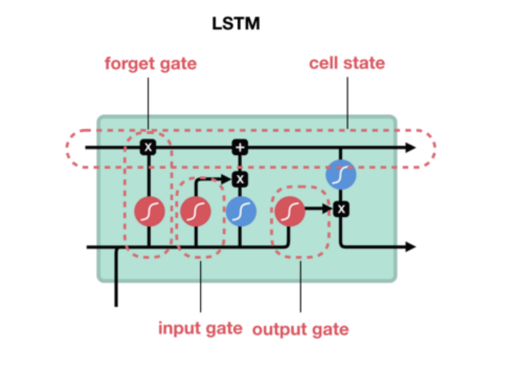

想像 LSTM 細胞裡頭的記憶狀態是一個包裹，上面那條直線就代表著一個輸送帶。

LSTM 可以把任意時間點的記憶狀態（包裹）放上該輸送帶，然後在未來的某個時間點將其原封不動地取下來使用。
#+CAPTION: Caption
#+LABEL:fig:Labl
#+name: fig:Name
#+ATTR_LATEX: :width 200
#+ATTR_ORG: :width 300
#+ATTR_HTML: :width 500

** Bi-directional RNN:
另一個循環網路的變種 - 雙向循環網路(Bi-directional RNN)也是現階段自然語言處理和語音分析中的重要模型。開發雙向循環網路的原因是語言/語音的構成取決於上下文，即「現在」依託於「過去」和「未來」。單向的循環網路僅著重於從「過去」推出「現在」，而無法對「未來」的依賴性有效的建模。
** RNN: Recurrent Neural Network，Recursive neural networks。
雖然很多時候我們把這兩種網路都叫做RNN，但事實上這兩種網路的結構事實上是不同的。而我們常常把兩個網路放在一起的原因是：它們都可以處理有序列的問題，比如時間序列等。

舉個最簡單的例子，我們預測股票走勢用RNN就比普通的DNN效果要好，原因是股票走勢和時間相關，今天的價格和昨天、上周、上個月都有關係。而RNN有「記憶」能力，可以「模擬」資料間的依賴關係(Dependency)。
** RNN
RNN 是一種有「記憶力」的神經網路，其最為人所知的形式如下：
#+CAPTION: Caption
#+LABEL:fig:Labl
#+name: fig:Name
#+ATTR_LATEX: :width 500
#+ATTR_ORG: :width 300
#+ATTR_HTML: :width 500
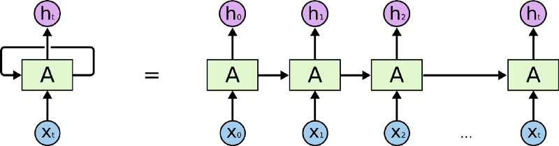
如同上圖等號左側所示，RNN 跟一般深度學習中常見的前饋神經網路（Feedforward Neural Network, 後簡稱 FFNN）最不一樣的地方在於它有一個迴圈（Loop）。
要了解這個迴圈在 RNN 裏頭怎麼運作，現在讓我們想像有一個輸入序列 X（Input Sequence）其長相如下：
$$ X = [ x_0, x_1, x_2, \dots x_t ]$$
1. 不同於 FFNN，RNN 在第一個時間點 $t_0$ 並不會直接把整個序列 $x$ 讀入。反之，在第一個時間點 $t_0$，它只將該序列中的第一個元素 $x_0$ 讀入中間的細胞 A。細胞 A 則會針對 $x_0$ 做些處理以後，更新自己的「狀態」並輸出第一個結果 $h_0$ 。
2. 在下個時間點 $t_1$，RNN 如法炮製，讀入序列 $x$ 中的下一個元素 $x_1$，並利用剛剛處理完 $x_0$ 得到的細胞狀態，處理 $x_1$ 並更新自己的狀態（也被稱為記憶），接著輸出另個結果 $h_1$。
3. 剩下的 $x_t$ 都會被以同樣的方式處理。但不管輸入的序列 $x$ 有多長，RNN 的本體從頭到尾都是等號左邊的樣子：迴圈代表細胞 A 利用「上」一個時間點（比方說 $t_1$）儲存的狀態，來處理當下的輸入（比方說 $x_2$ ）。

但如果你將不同時間點（$t_0$, $t_1$ ...）的 RNN 以及它的輸入一起截圖，並把所有截圖從左到右一字排開的話，就會長得像等號右邊的形式。將 RNN 以右邊的形式表示的話，你可以很清楚地了解，當輸入序列越長，向右展開的 RNN 也就越長。（模型也就需要訓練更久時間，這也是為何我們在資料前處理時設定了序列的最長長度）

為了確保你 100 % 理解 RNN，讓我們假設剛剛的序列 X 實際上是一個內容如下的英文問句：
#+begin_src python -r -n :results output :exports both
X = [ What, time, is, it, ? ]
#+end_src
而且 RNN 已經處理完前兩個元素 What 和 time 了。

則接下來 RNN 會這樣處理剩下的句子：
#+CAPTION: Caption
#+LABEL:fig:Labl
#+name: fig:Name
#+ATTR_LATEX: :width 300
#+ATTR_ORG: :width 300
#+ATTR_HTML: :width 500

就像你現在閱讀這段話一樣，你是由左到右逐字在大腦裡處理我現在寫的文字，同時不斷地更新你腦中的記憶狀態。

每當下個詞彙映入眼中，你腦中的處理都會跟以下兩者相關：
- 前面所有已讀的詞彙
- 目前腦中的記憶狀態

當然，實際人腦的閱讀機制更為複雜，但RNN的運作原理大致上就是這樣。RNN 會將每個時間點的輸入（$x_t$）和前一個時間點的狀態（$h_{t-1}$）結合起來，然後經過一個非線性函數（通常是 tanh 或 ReLU）來更新當前的狀態（$h_t$）。這樣的設計使得 RNN 能夠捕捉到序列中長期依賴的關係。

* 這裡只是用來測試org-mode中的圖片顯示功能 :noexport:
** 原圖
#+CAPTION: ReLU 函數的小icon，用來測試 org-mode 中圖片顯示功能
#+LABEL:fig:Labl
#+name: fig:Name
#+ATTR_LATEX: :width 20
#+ATTR_ORG: :width 20
#+ATTR_HTML: :width 20
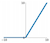
** plantuml
#+BEGIN_SRC plantuml :file neural_network_with_img.png
@startuml
skinparam linetype polyline
left to right direction
skinparam defaultTextAlignment center
skinparam RectangleBorderThickness 0

rectangle "Input Layer" {
    circle "x₁" as x1 #dodgerblue
    circle "x₂" as x2 #dodgerblue
}

rectangle "Hidden Layer" {
    circle "h₁" as h1 #tomato
    circle "h₂" as h2 #tomato
}

rectangle "Output Layer" {
    circle "y" as y #seagreen
}

x1 --> h1 : "w₁₁"
x1 --> h2 : "w₁₂"
x2 --> h1 : "w₂₁"
x2 --> h2 : "w₂₂"
h1 --> y : "v₁"
h2 --> y : "v₂"
@enduml
#+END_SRC

#+RESULTS:
[[file:neural_network_with_img.png]]
** digraph
#+begin_src dot :file ./images/three_layer_net.png :exports results
digraph simple_rnn {
  rankdir=LR;
  node [shape=circle, width=0.8, fontsize=16, style=filled, fontname="DejaVu Sans"];
  input [label=輸入, fillcolor="orange"];
  output [label=輸出, fillcolor="orange"];
  ReLU [label=ReLU, fillcolor="lightgreen"];

  input -> ReLU [label=<W1 (×1.8)>];
  ReLU -> output [label=<W3 (×1.1)>];
  ReLU -> ReLU [label=<W2 (×0.5)>, dir="back", arrowsize="1", minlen=12];

}
#+end_src
#+RESULTS:
[[file:three_layer_net.png]]

#+begin_src shell -r -n :results output :exports both

#+end_src

#+RESULTS:
: Collecting graphviz
:   Downloading graphviz-0.21-py3-none-any.whl.metadata (12 kB)
: Downloading graphviz-0.21-py3-none-any.whl (47 kB)
: Installing collected packages: graphviz
: Successfully installed graphviz-0.21

#+begin_src python -r -n :results output :exports both
from graphviz import Digraph

font_choice = 'DejaVu Sans'

dot = Digraph(format='png')
dot.attr('node', fontname=font_choice)

dot.attr(rankdir='LR', nodesep='0.8')
dot.attr('node', shape='circle', width='0.8', fontsize='14', style='filled', fillcolor='orange')

# nodes
dot.node('x', 'x', fillcolor='orange')
dot.node('h', 'h', fillcolor='lightgreen')
dot.node('y', 'y', fillcolor='deepskyblue')

# edge: input to hidden
dot.edge('x', 'h', label='W')
# edge: hidden to output
dot.edge('h', 'y', label='Wy')
# edge: hidden state recurrent (self-loop)
dot.edge('h', 'h', label='W', dir='both', arrowtail='loop', arrowsize='0.8')

dot.render('simple_rnn', view=True)
#+end_src

#+RESULTS:

* Footnotes

[fn:1] [[https://ithelp.ithome.com.tw/articles/10191820][Day 06：處理影像的利器 -- 卷積神經網路(Convolutional Neural Network)]]

