:PROPERTIES:
:ID:       263cb433-d0eb-4400-a373-35175c000c01
:ROAM_ALIASES: RNN LSTM GRU
:END:
#+TITLE: 時間序列的預言者：如何以RNN預測未來
#+AUTHOR: 顏永進

# -*- org-export-babel-evaluate: nil -*-
#+INCLUDE: ../pdf-m1.org
#+PROPERTY: header-args :python :python "/Users/letranger/Dropbox/notes/roam/venv/bin/python3" :eval never-export
#+TAGS: AI, Python
#+EXCLUDE_TAGS: noexport
#+OPTIONS: toc:2 ^:nil num:3
#+OPTIONS: H:4
#+LATEX:\newpage
#+HTML_HEAD: <link rel="stylesheet" type="text/css" href="../css/muse.css" />
#+HTML_HEAD_EXTRA: 
#+begin_export html

#+end_export

* 為此 org 啟用 venv :noexport:
#+begin_src shell -r -n :results output :exports both
source ./venv/bin/activate
#+end_src

#+RESULTS:

#+begin_src shell -r -n :results output :exports none
python3 -m venv ./venv
source ./venv/bin/activate
echo $VIRTUAL_ENV
ls venv

python3 -m pip install -U matplotlib
python3 -m pip install -U ace_tools
python3 -m pip install -U seaborn
python3 -m pip install -U statsmodels
python3 -m pip install -U tensorflow
python3 -m pip install -U graphviz
python3 -m pip install -U pillow
#+end_src

#+RESULTS:
#+begin_example
/Users/letranger/Dropbox/notes/roam/venv
bin
include
lib
list
pyvenv.cfg
share
Requirement already satisfied: matplotlib in ./venv/lib/python3.12/site-packages (3.10.7)
Requirement already satisfied: contourpy>=1.0.1 in ./venv/lib/python3.12/site-packages (from matplotlib) (1.3.1)
Requirement already satisfied: cycler>=0.10 in ./venv/lib/python3.12/site-packages (from matplotlib) (0.12.1)
Requirement already satisfied: fonttools>=4.22.0 in ./venv/lib/python3.12/site-packages (from matplotlib) (4.55.0)
Requirement already satisfied: kiwisolver>=1.3.1 in ./venv/lib/python3.12/site-packages (from matplotlib) (1.4.7)
Requirement already satisfied: numpy>=1.23 in ./venv/lib/python3.12/site-packages (from matplotlib) (1.26.4)
Requirement already satisfied: packaging>=20.0 in ./venv/lib/python3.12/site-packages (from matplotlib) (24.1)
Requirement already satisfied: pillow>=8 in ./venv/lib/python3.12/site-packages (from matplotlib) (10.4.0)
Requirement already satisfied: pyparsing>=3 in ./venv/lib/python3.12/site-packages (from matplotlib) (3.1.2)
Requirement already satisfied: python-dateutil>=2.7 in ./venv/lib/python3.12/site-packages (from matplotlib) (2.9.0.post0)
Requirement already satisfied: six>=1.5 in ./venv/lib/python3.12/site-packages (from python-dateutil>=2.7->matplotlib) (1.16.0)
Requirement already satisfied: ace_tools in ./venv/lib/python3.12/site-packages (0.0)
Requirement already satisfied: seaborn in ./venv/lib/python3.12/site-packages (0.13.2)
Requirement already satisfied: numpy!=1.24.0,>=1.20 in ./venv/lib/python3.12/site-packages (from seaborn) (1.26.4)
Requirement already satisfied: pandas>=1.2 in ./venv/lib/python3.12/site-packages (from seaborn) (2.2.3)
Requirement already satisfied: matplotlib!=3.6.1,>=3.4 in ./venv/lib/python3.12/site-packages (from seaborn) (3.10.7)
Requirement already satisfied: contourpy>=1.0.1 in ./venv/lib/python3.12/site-packages (from matplotlib!=3.6.1,>=3.4->seaborn) (1.3.1)
Requirement already satisfied: cycler>=0.10 in ./venv/lib/python3.12/site-packages (from matplotlib!=3.6.1,>=3.4->seaborn) (0.12.1)
Requirement already satisfied: fonttools>=4.22.0 in ./venv/lib/python3.12/site-packages (from matplotlib!=3.6.1,>=3.4->seaborn) (4.55.0)
Requirement already satisfied: kiwisolver>=1.3.1 in ./venv/lib/python3.12/site-packages (from matplotlib!=3.6.1,>=3.4->seaborn) (1.4.7)
Requirement already satisfied: packaging>=20.0 in ./venv/lib/python3.12/site-packages (from matplotlib!=3.6.1,>=3.4->seaborn) (24.1)
Requirement already satisfied: pillow>=8 in ./venv/lib/python3.12/site-packages (from matplotlib!=3.6.1,>=3.4->seaborn) (10.4.0)
Requirement already satisfied: pyparsing>=3 in ./venv/lib/python3.12/site-packages (from matplotlib!=3.6.1,>=3.4->seaborn) (3.1.2)
Requirement already satisfied: python-dateutil>=2.7 in ./venv/lib/python3.12/site-packages (from matplotlib!=3.6.1,>=3.4->seaborn) (2.9.0.post0)
Requirement already satisfied: pytz>=2020.1 in ./venv/lib/python3.12/site-packages (from pandas>=1.2->seaborn) (2024.1)
Requirement already satisfied: tzdata>=2022.7 in ./venv/lib/python3.12/site-packages (from pandas>=1.2->seaborn) (2024.1)
Requirement already satisfied: six>=1.5 in ./venv/lib/python3.12/site-packages (from python-dateutil>=2.7->matplotlib!=3.6.1,>=3.4->seaborn) (1.16.0)
Requirement already satisfied: statsmodels in ./venv/lib/python3.12/site-packages (0.14.5)
Requirement already satisfied: numpy<3,>=1.22.3 in ./venv/lib/python3.12/site-packages (from statsmodels) (1.26.4)
Requirement already satisfied: scipy!=1.9.2,>=1.8 in ./venv/lib/python3.12/site-packages (from statsmodels) (1.13.1)
Requirement already satisfied: pandas!=2.1.0,>=1.4 in ./venv/lib/python3.12/site-packages (from statsmodels) (2.2.3)
Requirement already satisfied: patsy>=0.5.6 in ./venv/lib/python3.12/site-packages (from statsmodels) (1.0.1)
Requirement already satisfied: packaging>=21.3 in ./venv/lib/python3.12/site-packages (from statsmodels) (24.1)
Requirement already satisfied: python-dateutil>=2.8.2 in ./venv/lib/python3.12/site-packages (from pandas!=2.1.0,>=1.4->statsmodels) (2.9.0.post0)
Requirement already satisfied: pytz>=2020.1 in ./venv/lib/python3.12/site-packages (from pandas!=2.1.0,>=1.4->statsmodels) (2024.1)
Requirement already satisfied: tzdata>=2022.7 in ./venv/lib/python3.12/site-packages (from pandas!=2.1.0,>=1.4->statsmodels) (2024.1)
Requirement already satisfied: six>=1.5 in ./venv/lib/python3.12/site-packages (from python-dateutil>=2.8.2->pandas!=2.1.0,>=1.4->statsmodels) (1.16.0)
Requirement already satisfied: tensorflow in ./venv/lib/python3.12/site-packages (2.20.0)
Requirement already satisfied: absl-py>=1.0.0 in ./venv/lib/python3.12/site-packages (from tensorflow) (2.1.0)
Requirement already satisfied: astunparse>=1.6.0 in ./venv/lib/python3.12/site-packages (from tensorflow) (1.6.3)
Requirement already satisfied: flatbuffers>=24.3.25 in ./venv/lib/python3.12/site-packages (from tensorflow) (24.3.25)
Requirement already satisfied: gast!=0.5.0,!=0.5.1,!=0.5.2,>=0.2.1 in ./venv/lib/python3.12/site-packages (from tensorflow) (0.6.0)
Requirement already satisfied: google_pasta>=0.1.1 in ./venv/lib/python3.12/site-packages (from tensorflow) (0.2.0)
Requirement already satisfied: libclang>=13.0.0 in ./venv/lib/python3.12/site-packages (from tensorflow) (18.1.1)
Requirement already satisfied: opt_einsum>=2.3.2 in ./venv/lib/python3.12/site-packages (from tensorflow) (3.4.0)
Requirement already satisfied: packaging in ./venv/lib/python3.12/site-packages (from tensorflow) (24.1)
Requirement already satisfied: protobuf>=5.28.0 in ./venv/lib/python3.12/site-packages (from tensorflow) (6.32.0)
Requirement already satisfied: requests<3,>=2.21.0 in ./venv/lib/python3.12/site-packages (from tensorflow) (2.32.3)
Requirement already satisfied: setuptools in ./venv/lib/python3.12/site-packages (from tensorflow) (80.9.0)
Requirement already satisfied: six>=1.12.0 in ./venv/lib/python3.12/site-packages (from tensorflow) (1.16.0)
Requirement already satisfied: termcolor>=1.1.0 in ./venv/lib/python3.12/site-packages (from tensorflow) (2.5.0)
Requirement already satisfied: typing_extensions>=3.6.6 in ./venv/lib/python3.12/site-packages (from tensorflow) (4.12.2)
Requirement already satisfied: wrapt>=1.11.0 in ./venv/lib/python3.12/site-packages (from tensorflow) (1.16.0)
Requirement already satisfied: grpcio<2.0,>=1.24.3 in ./venv/lib/python3.12/site-packages (from tensorflow) (1.64.1)
Requirement already satisfied: tensorboard~=2.20.0 in ./venv/lib/python3.12/site-packages (from tensorflow) (2.20.0)
Requirement already satisfied: keras>=3.10.0 in ./venv/lib/python3.12/site-packages (from tensorflow) (3.11.2)
Requirement already satisfied: numpy>=1.26.0 in ./venv/lib/python3.12/site-packages (from tensorflow) (1.26.4)
Requirement already satisfied: h5py>=3.11.0 in ./venv/lib/python3.12/site-packages (from tensorflow) (3.13.0)
Requirement already satisfied: ml_dtypes<1.0.0,>=0.5.1 in ./venv/lib/python3.12/site-packages (from tensorflow) (0.5.1)
Requirement already satisfied: charset-normalizer<4,>=2 in ./venv/lib/python3.12/site-packages (from requests<3,>=2.21.0->tensorflow) (3.3.2)
Requirement already satisfied: idna<4,>=2.5 in ./venv/lib/python3.12/site-packages (from requests<3,>=2.21.0->tensorflow) (3.7)
Requirement already satisfied: urllib3<3,>=1.21.1 in ./venv/lib/python3.12/site-packages (from requests<3,>=2.21.0->tensorflow) (2.2.1)
Requirement already satisfied: certifi>=2017.4.17 in ./venv/lib/python3.12/site-packages (from requests<3,>=2.21.0->tensorflow) (2024.6.2)
Requirement already satisfied: markdown>=2.6.8 in ./venv/lib/python3.12/site-packages (from tensorboard~=2.20.0->tensorflow) (3.7)
Requirement already satisfied: pillow in ./venv/lib/python3.12/site-packages (from tensorboard~=2.20.0->tensorflow) (10.4.0)
Requirement already satisfied: tensorboard-data-server<0.8.0,>=0.7.0 in ./venv/lib/python3.12/site-packages (from tensorboard~=2.20.0->tensorflow) (0.7.2)
Requirement already satisfied: werkzeug>=1.0.1 in ./venv/lib/python3.12/site-packages (from tensorboard~=2.20.0->tensorflow) (3.1.3)
Requirement already satisfied: wheel<1.0,>=0.23.0 in ./venv/lib/python3.12/site-packages (from astunparse>=1.6.0->tensorflow) (0.45.1)
Requirement already satisfied: rich in ./venv/lib/python3.12/site-packages (from keras>=3.10.0->tensorflow) (13.7.1)
Requirement already satisfied: namex in ./venv/lib/python3.12/site-packages (from keras>=3.10.0->tensorflow) (0.0.8)
Requirement already satisfied: optree in ./venv/lib/python3.12/site-packages (from keras>=3.10.0->tensorflow) (0.14.0)
Requirement already satisfied: MarkupSafe>=2.1.1 in ./venv/lib/python3.12/site-packages (from werkzeug>=1.0.1->tensorboard~=2.20.0->tensorflow) (3.0.2)
Requirement already satisfied: markdown-it-py>=2.2.0 in ./venv/lib/python3.12/site-packages (from rich->keras>=3.10.0->tensorflow) (3.0.0)
Requirement already satisfied: pygments<3.0.0,>=2.13.0 in ./venv/lib/python3.12/site-packages (from rich->keras>=3.10.0->tensorflow) (2.18.0)
Requirement already satisfied: mdurl~=0.1 in ./venv/lib/python3.12/site-packages (from markdown-it-py>=2.2.0->rich->keras>=3.10.0->tensorflow) (0.1.2)
Requirement already satisfied: graphviz in ./venv/lib/python3.12/site-packages (0.21)
Requirement already satisfied: pillow in ./venv/lib/python3.12/site-packages (10.4.0)
Collecting pillow
  Downloading pillow-12.0.0-cp312-cp312-macosx_11_0_arm64.whl.metadata (8.8 kB)
Downloading pillow-12.0.0-cp312-cp312-macosx_11_0_arm64.whl (4.7 MB)
   ━━━━━━━━━━━━━━━━━━━━━━━━━━━━━━━━━━━━━━━━ 4.7/4.7 MB 3.3 MB/s  0:00:01
Installing collected packages: pillow
  Attempting uninstall: pillow
    Found existing installation: pillow 10.4.0
    Uninstalling pillow-10.4.0:
      Successfully uninstalled pillow-10.4.0
Successfully installed pillow-12.0.0
#+end_example

#+BEGIN_SRC emacs-lisp :exports none
(pyvenv-activate "./venv")
(setq org-babel-python-command "./venv/bin/python3")
#+END_SRC

#+RESULTS:
: ./venv/bin/python3

* CNN的限制
在前面介紹[[id:20221023T101414.457264][CNN]]的章節中，我們提過[[id:20221023T101414.457264][CNN]]的想法源自於對人類大腦認知方式的模仿，當我們辨識一個圖像，會先注意到顏色鮮明的點、線、面，之後將它們構成一個個不同的形狀(眼睛、鼻子、嘴巴 ...)，這種抽象化的過程就是 CNN 演算法建立模型的方式。其過程如圖[[fig:CNN-1]][fn:1]。

#+CAPTION: CNN 概念
#+LABEL:fig:CNN-1
#+name: fig:CNN-1
#+ATTR_LATEX: :width 500
#+ATTR_ORG: :width 500
#+ATTR_HTML: :width 500
#+RESULTS:
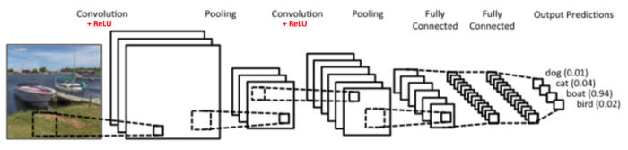

至於圖片中的每一個特徵則是利用卷積核來取得(如圖[[fig:CNN-arch]])，換言之，[[id:20221023T101414.457264][CNN]]其實是在模擬人類的眼睛。也就是說，[[id:20221023T101414.457264][CNN]]的設計是為了處理靜態的、空間上有結構的資料，例如圖像、影像等，它所關注的是資料間的空間關係，例如圖[[fig:CNN-arch]]中卷積核(紅色矩陣)中各個pixel與鄰近pixel間的關係。
#+CAPTION: CNN原理
#+LABEL:fig:CNN-arch
#+name: fig:CNN-arch
#+ATTR_LATEX: :width 300
#+ATTR_ORG: :width 300
#+ATTR_HTML: :width 500
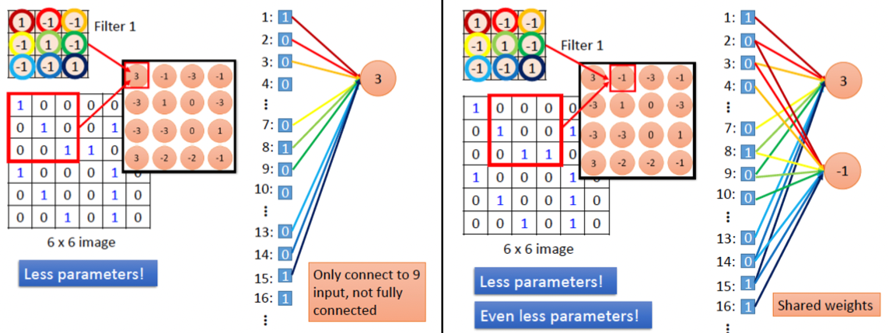

萬一我們所要處理的資料並不是一張張的圖、而是一系列連續性、有時間順序的資料呢？例如：
- 一篇文章: 也許我們想生成這篇文章的摘要
- 一段時間內蒐集的某地PM 2.5數值: 也許我們想預測該地下週的PM 2.5
- 一段演講錄音: 也許我們想生成逐字稿
你會發現，這類資料其實不太適合用眼睛，可能更適合用耳朵(關注連續資料間的關係)，所以拿[[id:20221023T101414.457264][CNN]]來分析這類資料大概是用錯了工具。

那麼，哪一種模型比較適合模擬出人類的耳朵功能？這是本節的討論重點。

* RNN
** RNN的基本概念
回顧我們熟悉的[[id:20221023T101414.457264][CNN]]神經網路(如圖[[fig:SimpleCNN-1]])，資料一律由模型的左側layer往右側傳送；而圖[[fig:SimpleRNN-5]]的RNN則有點不同，每一層的神經元在將資料往右傳遞的同時，還偷偷留了一份給 **自己** (參考圖中的紅色實線) ，這裡說的自己不是真正的自己，而是 **下一個回合的自己** )  。

#+begin_src dot :file ./images/SimpleCNN-1.png :exports none :results none
digraph cnn_mlp {
  rankdir=LR;

  // 中文層名稱
  input_label   [label="輸入層", shape=plaintext, fontsize=16];
  h1_label      [label="隱藏層1", shape=plaintext, fontsize=16];
  h2_label      [label="隱藏層2", shape=plaintext, fontsize=16];
  output_label  [label="輸出層", shape=plaintext, fontsize=16];

  // 設定神經元大小參數
  node [shape=circle, style=filled, width=1, fixedsize=true, fontsize=16];

  // 輸入層
  x1 [label=<x3>, fillcolor="palegreen"];
  x2 [label=<x2>, fillcolor="palegreen"];
  x3 [label=<x1>, fillcolor="palegreen"];

  // 隱藏層1
  h1_1 [label=<h13>, fillcolor="lavender"];
  h1_2 [label=<h12>, fillcolor="lavender"];
  h1_3 [label=<h11>, fillcolor="lavender"];

  // 隱藏層2
  h2_1 [label=<h22>, fillcolor="thistle"];
  h2_2 [label=<h21>, fillcolor="thistle"];

  // 輸出層
  y1 [label=<y1>, fillcolor="lightsalmon"];
  y2 [label=<y2>, fillcolor="lightsalmon"];

  // fully connected edges
  x1 -> h1_1; x1 -> h1_2; x1 -> h1_3;
  x2 -> h1_1; x2 -> h1_2; x2 -> h1_3;
  x3 -> h1_1; x3 -> h1_2; x3 -> h1_3;

  h1_1 -> h2_1; h1_1 -> h2_2;
  h1_2 -> h2_1; h1_2 -> h2_2;
  h1_3 -> h2_1; h1_3 -> h2_2;

  h2_1 -> y1; h2_1 -> y2;
  h2_2 -> y1; h2_2 -> y2;

  // 每層名稱跟該層神經元同 rank
  {rank=same; input_label; x1; x2; x3;}
  {rank=same; h1_label; h1_1; h1_2; h1_3;}
  {rank=same; h2_label; h2_1; h2_2;}
  {rank=same; output_label; y1; y2;}

  // 用 invisible edge 將 label 固定在上方
  input_label -> x3 [style=invis];
  input_label -> x2 [style=invis];
  input_label -> x1 [style=invis];

  h1_label -> h1_3 [style=invis];
  h1_label -> h1_2 [style=invis];
  h1_label -> h1_1 [style=invis];

  h2_label -> h2_2 [style=invis];
  h2_label -> h2_1 [style=invis];

  output_label -> y2 [style=invis];
  output_label -> y1 [style=invis];
}
#+end_src
#+CAPTION: CNN模型架構
#+LABEL:fig:SimpleCNN-1
#+name: fig:SimpleCNN-1
#+ATTR_LATEX: :width 200
#+ATTR_ORG: :width 400
#+ATTR_HTML: :width 400
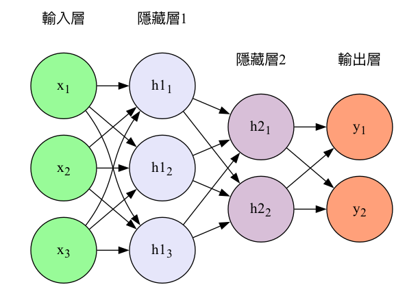

#+CAPTION: 一個簡單的RNN模型
#+LABEL:fig:SimpleRNN-5
#+name: fig:SimpleRNN-5
#+ATTR_LATEX: :width 200
#+ATTR_ORG: :width 300
#+ATTR_HTML: :width 300
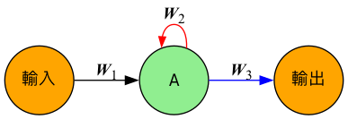

事實上，比起圖[[fig:SimpleRNN-5]]，我們平常更常看到的RNN模型是如圖[[fig:SimpleRNN-6]]所示的展開架構:
#+begin_src dot :file ./images/SimpleRNN-2.png :exports none :results none
digraph unrolled_rnn {
  rankdir=LR;

  // 未展開（左側）
  y      [label=y, color=orange, fontcolor=orange, fontsize=16, shape=plaintext];
  h      [label=h, style=filled, fillcolor="lavender", shape=circle, fontsize=16, width=1.0, fixedsize=true];
  x      [label=x, color=seagreen, fontcolor=seagreen, fontsize=16, shape=plaintext];

  // 展開箭頭
  h -> h_t_1 [label=<<B>展開</B>>, color=gray, fontcolor=black, penwidth=3, fontsize=14, arrowhead=normal, arrowsize=2, style=dotted];

  // === time t-1 ===
  x_t_1 [label=<xt-1>, color=seagreen, fontcolor=seagreen, fontsize=16, shape=plaintext];
  h_t_1 [label=<ht-1>, style=filled, fillcolor="lavender", shape=circle, fontsize=16, width=1.0, fixedsize=true];
  y_t_1 [label=<yt-1>, color=orange, fontcolor=orange, fontsize=16, shape=plaintext];

  // === time t ===
  x_t   [label=<xt>, color=seagreen, fontcolor=seagreen, fontsize=16, shape=plaintext];
  h_t   [label=<ht>, style=filled, fillcolor="lavender", shape=circle, fontsize=16, width=1.0, fixedsize=true];
  y_t   [label=<yt>, color=orange, fontcolor=orange, fontsize=16, shape=plaintext];

  // === time t+1 ===
  x_t1  [label=<xt+1>, color=seagreen, fontcolor=seagreen, fontsize=16, shape=plaintext];
  h_t1  [label=<ht+1>, style=filled, fillcolor="lavender", shape=circle, fontsize=16, width=1.0, fixedsize=true];
  y_t1  [label=<yt+1>, color=orange, fontcolor=orange, fontsize=16, shape=plaintext];

  // 排版：同一個 time step 垂直對齊（由下到上）
  {rank=same; x; h; y;}
  {rank=same; x_t_1; h_t_1; y_t_1;}
  {rank=same; x_t;   h_t;   y_t;}
  {rank=same; x_t1;  h_t1;  y_t1;}

  // 邊：由下到上
  h     -> x     [label=<w>, color="seagreen", dir="back"];
  h     -> h     [label=<w>, dir="back", arrowsize="1", color="red"];
  y     -> h     [label=<w>, dir="back", color="orange"];

  h_t_1 -> x_t_1 [label=<wy>, color="seagreen", dir="back"];
  h_t_1 -> h_t   [label=<wh>, color="crimson"];
  y_t_1 -> h_t_1 [label=<wx>, color="orange", dir="back"];

  h_t   -> x_t   [label=<wx>, color="seagreen"];
  h_t   -> h_t1  [label=<wh>, color="crimson"];
  y_t   -> h_t   [label=<wy>, color="orange", dir="back"];

  h_t1  -> x_t1  [label=<wx>, color="seagreen", dir="back"];
  y_t1  -> h_t1  [label=<wy>, color="orange", dir="back"];
}
#+end_src
#+CAPTION: RNN模型的展開架構
#+LABEL:fig:SimpleRNN-6
#+name: fig:SimpleRNN-6
#+ATTR_LATEX: :width 200
#+ATTR_ORG: :width 400
#+ATTR_HTML: :width 500
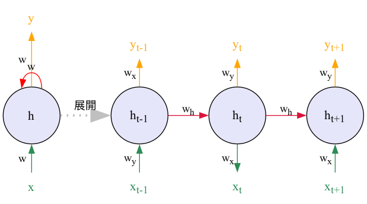

要看懂圖[[fig:SimpleRNN-6]]，你只要搞清楚三件事:
1. 不像[[id:20221023T101414.457264][CNN]]那樣每次讀入一整張圖，RNN會 **逐步讀入** 一連串有時間順序的資料，如文字、每天的PM 2.5數值、每秒的股價變化等，而不是一次性將整串資料全部計算完。第1次(也就是第1個時間點($t_0$)讀入$x_0$、第2次(也就是第2個時間點($t_1$)讀入$x_1$...
3. 原本常見的資料在模型中傳遞方向是由左而右，在圖[[fig:SimpleRNN-6]]中這我們用“自下而上”來代表每個時間點的輸入（下方），輸出（上方），這只是圖的表示方法，不影響實際運算。也就是說輸入資料是底下的$x_t$、輸出為上面的$h_t$。
2. 圖[[fig:SimpleRNN-6]]中右側「展開後」的三個神經元其實是 **同一個神經元** 在不同時間點的重複使用。這裡的重點是: **三個神經元分別代表不同時間點的神經元** ，而 $x_{t-1}, x_{t}, x_{t+1}$ 則代表在不同時間點的輸入；$y_{t-1}, y_{t}, y_{t+1}$ 則代表在不同時間點的輸出。至於 $h_{t-1}, h_{t}, h_{t+1}$ 則較為複雜，我們稍後再說明。

** RNN神經元內部結構
為了讓大家能更清楚地了解RNN的運作原理，我們將圖[[fig:SimpleRNN-6]]中的RNN神經元進一步展開，如圖[[fig:RNN-Cell-1]]所示:

#+begin_src dot :file ./images/s-rnn-node.png :exports none :results none
digraph unrolled_rnn {
  rankdir=LR;
  node [fontname="Arial", fontsize=32, style=filled];   // 節點字體放大
  edge [fontname="Arial", fontsize=24, penwidth=3];     // 邊上權重文字放大

  // === time t-1 ===
  x_t  [label=<<I>x</I>t>, style=filled, fillcolor="green", shape=circle, width=1.0, fixedsize=true];
  add [label=<+>, style=filled, fillcolor="lavender", shape=circle,  width=0.3, fixedsize=true];
  h_t_1  [label=<<I>h</I>t-1>, style=filled, fillcolor="orange", shape=circle,  width=1.0, fixedsize=true];

  // === time t ===
  ReLU [label=<ReLU>, image="images/relu.png", shape=box, width=1, height=1, fixedsize=true, fillcolor="lightgreen",fontsize=24];

  // === time t+1 ===
  h_t  [label=<<I>h</I>t>, style=filled, fillcolor="orange", shape=circle,  width=1.0, fixedsize=true];
  tmpht  [label=<>, style=invis, fillcolor="lavender", shape=circle, width=0, fixedsize=false];
  y_t  [label=<<I>y</I>t>, style=filled, fillcolor="green", shape=circle,  width=1.0, fixedsize=true];

  // 排版：同一個 time step 垂直對齊（由下到上）
  {rank=same; x_t; add; }
  {rank=same; tmpht;  y_t;}

  // 邊：由下到上
  add -> x_t [label=<<I>w</I>x>, color="seagreen", dir="back", minlen=4];
  add -> ReLU  [label=<>, color="black"];
  h_t_1 -> add [label=<<I>w</I>h>, color="orange", minlen=2];

  ReLU   -> tmpht  [label=<>, color="orange", dir="none"];

  tmpht  -> h_t  [label=<>, color="orange", minlen=2];
  y_t  -> tmpht  [label=<<I>w</I>y>, color="seagreen", dir="back", minlen=4];

}
#+end_src
#+begin_src python :results none :exports none :file ./images/s-rnn-node-1.png
from PIL import Image, ImageDraw, ImageFont

# 讀取原始圖片
import os
im = Image.open(os.path.expanduser("~/Dropbox/notes/roam/images/s-rnn-node.png")).convert("RGBA")
overlay = Image.new("RGBA", im.size, (0,0,0,0))
draw = ImageDraw.Draw(overlay)

# 畫圓角矩形 - 調整座標和大小
# 座標格式: [left, top, right, bottom]
# 根據您的圖表，調整這些座標來框住 add, ReLU, tmpht
draw.rounded_rectangle([200, 220, 700, 380], radius=25,
                      fill=(47,127,106,60),
                      outline=(47,127,106,180),
                      width=3)

# 寫字（可選）
try:
    # 嘗試使用系統字體
    font = ImageFont.truetype("/System/Library/Fonts/Arial.ttf", 36)
except:
    # 如果找不到字體，使用預設字體
    font = ImageFont.load_default()

# 先畫白色背景
draw.rectangle([290, 210, 460, 240], fill=(255,255,255,255))
# 再畫黑色文字
draw.text((300, 204), "RNN cell", fill=(0,0,0,255), font=font)

# 合成圖片
out = Image.alpha_composite(im, overlay)
out.save(os.path.expanduser("~/Dropbox/notes/roam/images/s-rnn-node-1.png"))
print("已生成: ~/Dropbox/notes/roam/images/s-rnn-node-1.png")
#+end_src
#+CAPTION: RNN神經元的內部結構
#+LABEL:fig:RNN-Cell-1
#+name: fig:RNN-Cell-1
#+ATTR_LATEX: :width 400
#+ATTR_ORG: :width 400
#+ATTR_HTML: :width 500
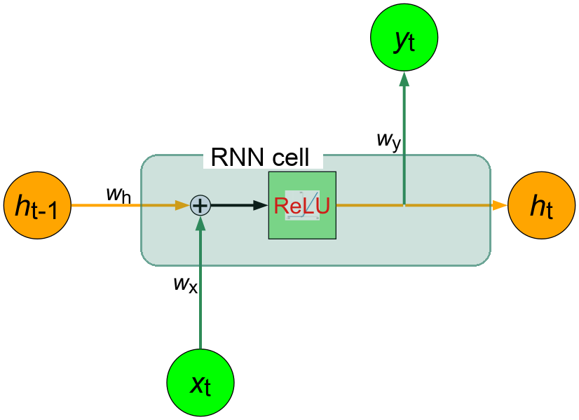

這個神經元在時間點t時會接收兩個輸入、並產生兩個輸出:
1. 輸入:
   - $\boldsymbol{x_t}$: 來自外部的輸入，也就是時間點 \(t\) 時的股價 **實際漲跌**
   - $\boldsymbol{h_{t-1}}$: 來自上一個時間點的「隱藏狀態」，代表時間點t之前的股價漲跌資訊
2. 輸出:
   - $\boldsymbol{h_t}​=f(\boldsymbol{W_xx_t}​+\boldsymbol{W_h​h_{t−1}}​+b_1)$: 到時間點 \(t\) 為止的「隱藏狀態」
   - $\boldsymbol{y_t}​=\boldsymbol{W_yh_t}​$: 時間點t的股價漲跌的預測結果）

其中：
- $\boldsymbol{W_h, W_x, W_y}$ ：權重（實際上是矩陣，這裡用簡化的一維符號），分別調整輸入與前一時刻狀態的影響力
- $b_1, b_2$ ：偏差項，但在後續的示範中我們會省略它們以簡化計算
- $f$ ：激活函數（activation function），RNN常用的激活函數為 **tanh** ，目的在於引入非線性特性，使模型能學習更複雜的模式。

這些權重是怎麼來的呢？還記得在[[id:20221023T101414.457264][CNN]]中我們提到的「訓練」嗎？RNN也是透過類似的方式來學習這些權重。它會在訓練過程中不斷調整這些權重，以便更好地預測序列資料中的模式。這個過程通常使用一種叫做反向傳播（backpropagation）的技術，這樣RNN就能夠學習如何根據過去的輸入和隱藏狀態來預測未來的輸出。

至於RNN中的啟動函數，較常見的是使用tanh，也有人用Sigmoid，較少用ReLU，原因是tanh 輸出區間在 [-1, 1]，便於梯度傳遞（不會無限放大），而ReLU 可能導致梯度爆炸或消失得更嚴重。但是為了簡化以下的計算過程，讓大家能專注在RNN的運作原理，在接下來的示範中，我們會省略偏差項 $b_1$，也將啟動函數 $f$ 改為更簡單的ReLU，以便於理解。

接下來，我們就陸續將昨日與今日的股價漲跌狀況輸入這個模型中，並詳細解說RNN的運算過程。

* 以RNN預測股價漲跌情況
:PROPERTIES:
:ID:       2a1d5d4d-3569-406b-ac13-355acafd5da8
:END:
我們以圖[[fig:RNN-Cell-1]]的RNN為基礎，來設計一個簡單的RNN模型，用以預測股價的漲跌情況。這裡我們用一個很簡單(**實際上會賠死**)的RNN模型來預測明天股價的漲跌情況，這個模型的重點在於示範RNN模型如何輸入一段連續資料，最後生成預測結果，至於預測結果我們先不要去嫌棄它Q_Q。

以下三種不同的數值分別代表每日的股價變化情況：
1. 上漲: yₜ ≥ 0.75
2. 平盤: 0.25 < Xₜ < 0.75
3. 下跌: Xₜ ≤ 0.25

然後，我們假設已知前兩天的股價變化情況，並希望RNN能夠根據這些資訊來預測明天的股價變化情況（此處的三個時間點請對照圖[[fig:SimpleRNN-6]]）:
1. 昨天：平盤 (0.5)
2. 今天：上漲 (1)

** 輸入昨天的股價漲跌情況（目前的時間點t=1代表的是昨天）
首先，我們假定這個RNN是已經訓練好的模型，所以已經擁有以下的權重值:
- \(w_x = 1.8\)
- \(w_h = -0.5\)
- \(w_y = 1.1\)
此外，因為這是模型的初始階段，我們還沒有任何歷史資訊可以使用，於是我們將「隱藏狀態」\(h_{t-1}\)的值設為0。

接下來就可以開始將資料輸入到RNN模型中，而昨天的股價漲跌情況是「平盤(0.5)」，因此我們將\(x_{t} = 0.5\)輸入到RNN模型中。

現在，圖[[fig:RNN-Cell-1]]中的RNN神經元大概如下所示:

#+begin_src dot :file ./images/s-rnn-node.png :exports none :results none
digraph unrolled_rnn {
  rankdir=LR;
  node [fontname="Arial", fontsize=28, style=filled];   // 節點字體放大
  edge [fontname="Arial", fontsize=24, penwidth=3];     // 邊上權重文字放大

  // === time t-1 ===
  x_t  [label=<<I>x</I>t 0.5>, style=filled, fillcolor="green", shape=circle, width=1.0, fixedsize=true];
  add [label=<+>, style=filled, fillcolor="lavender", shape=circle,  width=0.3, fixedsize=true];
  h_t_1  [label=<<I>h</I>t-1 0>, style=filled, fillcolor="orange", shape=circle,  width=1.0, fixedsize=true];

  // === time t ===
  ReLU [label=<ReLU>, image="images/relu.png", shape=box, width=1, height=1, fixedsize=true, fillcolor="lightgreen",fontsize=24];

  // === time t+1 ===
  h_t  [label=<<I>h</I>t>, style=filled, fillcolor="orange", shape=circle,  width=1.0, fixedsize=true];
  tmpht  [label=<>, style=invis, fillcolor="lavender", shape=circle, width=0, fixedsize=false];
  y_t  [label=<<I>y</I>t>, style=filled, fillcolor="green", shape=circle,  width=1.0, fixedsize=true];

  // 排版：同一個 time step 垂直對齊（由下到上）
  {rank=same; x_t; add; }
  {rank=same; tmpht;  y_t;}

  // 邊：由下到上
  add -> x_t [label=<<I>w</I>x=1.8>, color="seagreen", dir="back", minlen=4];
  add -> ReLU  [label=<>, color="black"];
  h_t_1 -> add [label=<<I>w</I>h=-0.5>, color="orange", minlen=2];

  ReLU   -> tmpht  [label=<>, color="orange", dir="none"];

  tmpht  -> h_t  [label=<>, color="orange", minlen=2];
  y_t  -> tmpht  [label=<<I>w</I>y=1.1>, color="seagreen", dir="back", minlen=4];

}
#+end_src
#+begin_src python :results none :exports none :file ./images/s-rnn-node-2.png
from PIL import Image, ImageDraw, ImageFont

# 讀取原始圖片
import os
im = Image.open(os.path.expanduser("~/Dropbox/notes/roam/images/s-rnn-node.png")).convert("RGBA")
overlay = Image.new("RGBA", im.size, (0,0,0,0))
draw = ImageDraw.Draw(overlay)

# 畫圓角矩形 - 調整座標和大小
# 座標格式: [left, top, right, bottom]
# 根據您的圖表，調整這些座標來框住 add, ReLU, tmpht
draw.rounded_rectangle([200, 220, 700, 380], radius=25,
                      fill=(47,127,106,60),
                      outline=(47,127,106,180),
                      width=3)

# 寫字（可選）
try:
    # 嘗試使用系統字體
    font = ImageFont.truetype("/System/Library/Fonts/Arial.ttf", 36)
except:
    # 如果找不到字體，使用預設字體
    font = ImageFont.load_default()

# 先畫白色背景
draw.rectangle([290, 210, 460, 240], fill=(255,255,255,255))
# 再畫黑色文字
draw.text((300, 204), "RNN cell", fill=(0,0,0,255), font=font)

# 合成圖片
out = Image.alpha_composite(im, overlay)
out.save(os.path.expanduser("~/Dropbox/notes/roam/images/s-rnn-node-2.png"))
print("已生成: ~/Dropbox/notes/roam/images/s-rnn-node-2.png")
#+end_src
#+CAPTION: 輸入昨天的股價漲跌情況後的RNN神經元的內部結構
#+LABEL:fig:RNN-Cell-2
#+name: fig:RNN-Cell-2
#+ATTR_LATEX: :width 400
#+ATTR_ORG: :width 400
#+ATTR_HTML: :width 500

接下來就開始計算RNN的輸出結果:
1. 計算加權和\(z\)。因為沒有前天的股價資訊可用，所以我們將隱藏狀態\(h_{t-1}\)設為0):
   \[
   \text{z} = (w_x \cdot x_t) + (w_h \cdot h_{t-1}) = (1.8 \cdot 0.5) + (-0.5 \cdot 0) = 0.9 + 0 = 0.9
   \]
2. 計算隱藏狀態。由於此處使用ReLU激活函數，而ReLU的定義為 \( \text{ReLU}(z) = \max(0, z) \)，也就是當輸入大於0時，輸出等於輸入，否則輸出為0。因此:
   \[
   h_t = \text{ReLU}(\text{z}) = \text{ReLU}(0.9) = 0.9
   \]
3. 計算輸出:
   \[
   y_t = w_y \cdot h_t = 1.1 \cdot 0.9 = 0.99
   \]
4. 總結:
   - 隱藏狀態 \(h_t = 0.9\)
   - 預測輸出 \(y_t = 0.99\)

現在，我們已經完成了將昨天的股價漲跌情況輸入RNN模型，並計算出隱藏狀態和預測輸出。對應的神經元內部結構如圖[[fig:RNN-Cell-3]]所示。

#+begin_src dot :file ./images/s-rnn-node.png :exports none :results none
digraph unrolled_rnn {
  rankdir=LR;
  node [fontname="Arial", fontsize=28, style=filled];   // 節點字體放大
  edge [fontname="Arial", fontsize=24, penwidth=3];     // 邊上權重文字放大

  // === time t-1 ===
  x_t  [label=<<I>x</I>t 0.5>, style=filled, fillcolor="green", shape=circle, width=1.0, fixedsize=true];
  add [label=<+>, style=filled, fillcolor="lavender", shape=circle,  width=0.3, fixedsize=true];
  h_t_1  [label=<<I>h</I>t-1 0>, style=filled, fillcolor="orange", shape=circle,  width=1.0, fixedsize=true];

  // === time t ===
  ReLU [label=<ReLU>, image="images/relu.png", shape=box, width=1, height=1, fixedsize=true, fillcolor="lightgreen",fontsize=24];

  // === time t+1 ===
  h_t  [label=<<I>h</I>t 0.9>, style=filled, fillcolor="orange", shape=circle,  width=1.0, fixedsize=true];
  tmpht  [label=<>, style=invis, fillcolor="lavender", shape=circle, width=0, fixedsize=false];
  y_t  [label=<<I>y</I>t 0.99>, style=filled, fillcolor="green", shape=circle,  width=1.0, fixedsize=true];

  // 排版：同一個 time step 垂直對齊（由下到上）
  {rank=same; x_t; add; }
  {rank=same; tmpht;  y_t;}

  // 邊：由下到上
  add -> x_t [label=<<I>w</I>x=1.8>, color="seagreen", dir="back", minlen=4];
  add -> ReLU  [label=<>, color="black"];
  h_t_1 -> add [label=<<I>w</I>h=-0.5>, color="orange", minlen=2];

  ReLU   -> tmpht  [label=<>, color="orange", dir="none"];

  tmpht  -> h_t  [label=<>, color="orange", minlen=2];
  y_t  -> tmpht  [label=<<I>w</I>y=1.1>, color="seagreen", dir="back", minlen=4];

}
#+end_src
#+begin_src python :results none :exports none :file ./images/s-rnn-node-3.png
from PIL import Image, ImageDraw, ImageFont

# 讀取原始圖片
import os
im = Image.open(os.path.expanduser("~/Dropbox/notes/roam/images/s-rnn-node.png")).convert("RGBA")
overlay = Image.new("RGBA", im.size, (0,0,0,0))
draw = ImageDraw.Draw(overlay)

# 畫圓角矩形 - 調整座標和大小
# 座標格式: [left, top, right, bottom]
# 根據您的圖表，調整這些座標來框住 add, ReLU, tmpht
draw.rounded_rectangle([200, 220, 700, 380], radius=25,
                      fill=(47,127,106,60),
                      outline=(47,127,106,180),
                      width=3)

# 寫字（可選）
try:
    # 嘗試使用系統字體
    font = ImageFont.truetype("/System/Library/Fonts/Arial.ttf", 36)
except:
    # 如果找不到字體，使用預設字體
    font = ImageFont.load_default()

# 先畫白色背景
draw.rectangle([290, 210, 460, 240], fill=(255,255,255,255))
# 再畫黑色文字
draw.text((300, 204), "RNN cell", fill=(0,0,0,255), font=font)

# 合成圖片
out = Image.alpha_composite(im, overlay)
out.save(os.path.expanduser("~/Dropbox/notes/roam/images/s-rnn-node-3.png"))
print("已生成: ~/Dropbox/notes/roam/images/s-rnn-node-3.png")
#+end_src
#+CAPTION: 計算完昨天的股價漲跌情況後的RNN神經元的內部結構
#+LABEL:fig:RNN-Cell-3
#+name: fig:RNN-Cell-3
#+ATTR_LATEX: :width 400
#+ATTR_ORG: :width 400
#+ATTR_HTML: :width 500
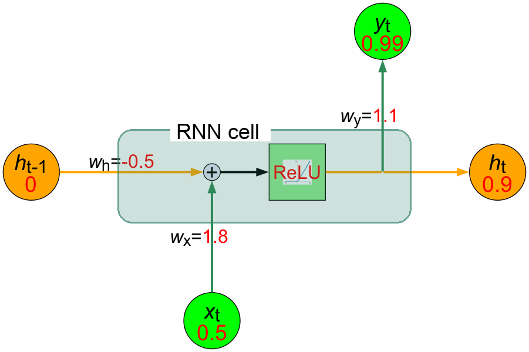

** 輸入今天的股價漲跌情況（目前的時間點t=2代表的是今天）
在完成昨天的股價漲跌情況輸入後，接下來我們將今天的股價漲跌情況輸入RNN模型中。也就：
1. 昨天計算出的隱藏狀態\(h_t = 0.9\)將作為今天的「前一時間點隱藏狀態」\(h_{t-1}\)使用。
2. 根據前面的假設，今天的股價是「上漲(1)」，因此我們將\(x_{t} = 1\)輸入到RNN模型中。

現在，我們看到的神經元內部結構大概如下所示:

#+begin_src dot :file ./images/s-rnn-node.png :exports none :results none
digraph unrolled_rnn {
  rankdir=LR;
  node [fontname="Arial", fontsize=28, style=filled];   // 節點字體放大
  edge [fontname="Arial", fontsize=24, penwidth=3];     // 邊上權重文字放大

  // === time t-1 ===
  x_t  [label=<<I>x</I>t 1>, style=filled, fillcolor="green", shape=circle, width=1.0, fixedsize=true];
  add [label=<+>, style=filled, fillcolor="lavender", shape=circle,  width=0.3, fixedsize=true];
  h_t_1  [label=<<I>h</I>t-1 0.9>, style=filled, fillcolor="orange", shape=circle,  width=1.0, fixedsize=true];

  // === time t ===
  ReLU [label=<ReLU>, image="images/relu.png", shape=box, width=1, height=1, fixedsize=true, fillcolor="lightgreen",fontsize=24];

  // === time t+1 ===
  h_t  [label=<<I>h</I>t>, style=filled, fillcolor="orange", shape=circle,  width=1.0, fixedsize=true];
  tmpht  [label=<>, style=invis, fillcolor="lavender", shape=circle, width=0, fixedsize=false];
  y_t  [label=<<I>y</I>t>, style=filled, fillcolor="green", shape=circle,  width=1.0, fixedsize=true];

  // 排版：同一個 time step 垂直對齊（由下到上）
  {rank=same; x_t; add; }
  {rank=same; tmpht;  y_t;}

  // 邊：由下到上
  add -> x_t [label=<<I>w</I>x=1.8>, color="seagreen", dir="back", minlen=4];
  add -> ReLU  [label=<>, color="black"];
  h_t_1 -> add [label=<<I>w</I>h=-0.5>, color="orange", minlen=2];

  ReLU   -> tmpht  [label=<>, color="orange", dir="none"];

  tmpht  -> h_t  [label=<>, color="orange", minlen=2];
  y_t  -> tmpht  [label=<<I>w</I>y=1.1>, color="seagreen", dir="back", minlen=4];

}
#+end_src
#+begin_src python :results none :exports none :file ./images/s-rnn-node-4.png
from PIL import Image, ImageDraw, ImageFont

# 讀取原始圖片
import os
im = Image.open(os.path.expanduser("~/Dropbox/notes/roam/images/s-rnn-node.png")).convert("RGBA")
overlay = Image.new("RGBA", im.size, (0,0,0,0))
draw = ImageDraw.Draw(overlay)

# 畫圓角矩形 - 調整座標和大小
# 座標格式: [left, top, right, bottom]
# 根據您的圖表，調整這些座標來框住 add, ReLU, tmpht
draw.rounded_rectangle([200, 220, 700, 380], radius=25,
                      fill=(47,127,106,60),
                      outline=(47,127,106,180),
                      width=3)

# 寫字（可選）
try:
    # 嘗試使用系統字體
    font = ImageFont.truetype("/System/Library/Fonts/Arial.ttf", 36)
except:
    # 如果找不到字體，使用預設字體
    font = ImageFont.load_default()

# 先畫白色背景
draw.rectangle([290, 210, 460, 240], fill=(255,255,255,255))
# 再畫黑色文字
draw.text((300, 204), "RNN cell", fill=(0,0,0,255), font=font)

# 合成圖片
out = Image.alpha_composite(im, overlay)
out.save(os.path.expanduser("~/Dropbox/notes/roam/images/s-rnn-node-4.png"))
print("已生成: ~/Dropbox/notes/roam/images/s-rnn-node-4.png")
#+end_src
#+CAPTION: 輸入今天的股價漲跌情況後的RNN神經元的內部結構
#+LABEL:fig:RNN-Cell-4
#+name: fig:RNN-Cell-4
#+ATTR_LATEX: :width 400
#+ATTR_ORG: :width 400
#+ATTR_HTML: :width 500
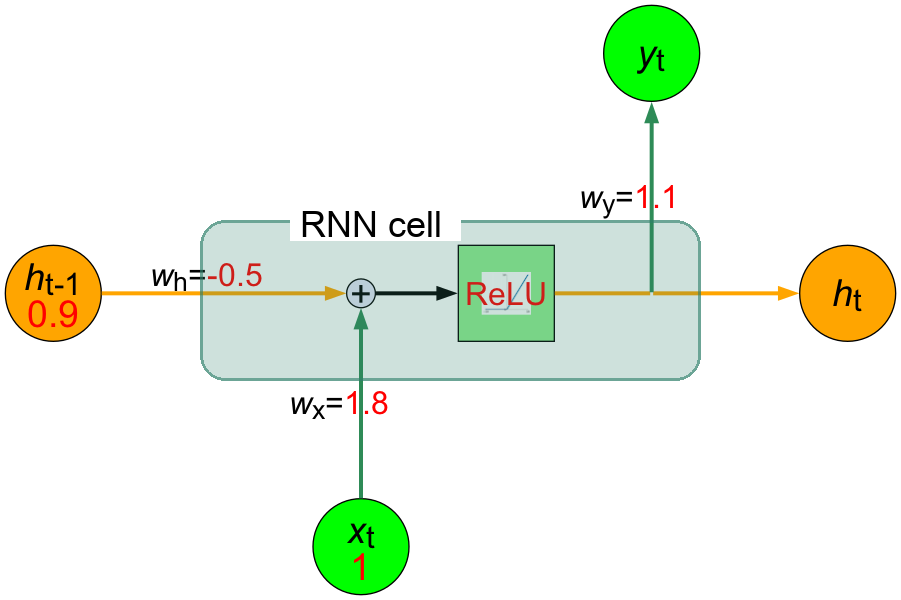

接下來就繼續計算時間點t的輸出結果:
1. 計算加權和\(z\):
   \[
   \text{z} = (w_x \cdot x_t) + (w_h \cdot h_{t-1}) = (1.8 \cdot 1) + (-0.5 \cdot 0.9) = 1.8 - 0.45 = 1.35
   \]
2. 計算隱藏狀態:
   \[
   h_t = \text{ReLU}(\text{z}) = \text{ReLU}(1.35) = 1.35
   \]
3. 計算輸出:
   \[
   y_t = w_y \cdot h_t = 1.1 \cdot 1.35 = 1.485
   \]
4. 總結:
   - 隱藏狀態 \(h_t = 1.35\)
   - 預測輸出 \(y_t = 1.485\)

現在，我們已經完成了將今天的股價漲跌情況輸入RNN模型，並計算出隱藏狀態和對明天股價的預測輸出。對應的神經元內部結構如圖[[fig:RNN-Cell-5]]所示。

#+begin_src dot :file ./images/s-rnn-node.png :exports none :results none
digraph unrolled_rnn {
  rankdir=LR;
  node [fontname="Arial", fontsize=26, style=filled];   // 節點字體放大
  edge [fontname="Arial", fontsize=24, penwidth=3];     // 邊上權重文字放大

  // === time t-1 ===
  x_t  [label=<<I>x</I>t 1>, style=filled, fillcolor="green", shape=circle, width=1.0, fixedsize=true];
  add [label=<+>, style=filled, fillcolor="lavender", shape=circle,  width=0.3, fixedsize=true];
  h_t_1  [label=<<I>h</I>t-1 0.9>, style=filled, fillcolor="orange", shape=circle,  width=1.0, fixedsize=true];

  // === time t ===
  ReLU [label=<ReLU>, image="images/relu.png", shape=box, width=1, height=1, fixedsize=true, fillcolor="lightgreen",fontsize=24];

  // === time t+1 ===
  h_t  [label=<<I>h</I>t 1.35>, style=filled, fillcolor="orange", shape=circle,  width=1.0, fixedsize=true];
  tmpht  [label=<>, style=invis, fillcolor="lavender", shape=circle, width=0, fixedsize=false];
  y_t  [label=<<I>y</I>t 1.485>, style=filled, fillcolor="green", shape=circle,  width=1.0, fixedsize=true];

  // 排版：同一個 time step 垂直對齊（由下到上）
  {rank=same; x_t; add; }
  {rank=same; tmpht;  y_t;}

  // 邊：由下到上
  add -> x_t [label=<<I>w</I>x=1.8>, color="seagreen", dir="back", minlen=4];
  add -> ReLU  [label=<>, color="black"];
  h_t_1 -> add [label=<<I>w</I>h=-0.5>, color="orange", minlen=2];

  ReLU   -> tmpht  [label=<>, color="orange", dir="none"];

  tmpht  -> h_t  [label=<>, color="orange", minlen=2];
  y_t  -> tmpht  [label=<<I>w</I>y=1.1>, color="seagreen", dir="back", minlen=4];

}
#+end_src
#+begin_src python :results none :exports none :file ./images/s-rnn-node-5.png
from PIL import Image, ImageDraw, ImageFont

# 讀取原始圖片
import os
im = Image.open(os.path.expanduser("~/Dropbox/notes/roam/images/s-rnn-node.png")).convert("RGBA")
overlay = Image.new("RGBA", im.size, (0,0,0,0))
draw = ImageDraw.Draw(overlay)

# 畫圓角矩形 - 調整座標和大小
# 座標格式: [left, top, right, bottom]
# 根據您的圖表，調整這些座標來框住 add, ReLU, tmpht
draw.rounded_rectangle([200, 220, 700, 380], radius=25,
                      fill=(47,127,106,60),
                      outline=(47,127,106,180),
                      width=3)

# 寫字（可選）
try:
    # 嘗試使用系統字體
    font = ImageFont.truetype("/System/Library/Fonts/Arial.ttf", 36)
except:
    # 如果找不到字體，使用預設字體
    font = ImageFont.load_default()

# 先畫白色背景
draw.rectangle([290, 210, 460, 240], fill=(255,255,255,255))
# 再畫黑色文字
draw.text((300, 204), "RNN cell", fill=(0,0,0,255), font=font)

# 合成圖片
out = Image.alpha_composite(im, overlay)
out.save(os.path.expanduser("~/Dropbox/notes/roam/images/s-rnn-node-5.png"))
print("已生成: ~/Dropbox/notes/roam/images/s-rnn-node-5.png")
#+end_src
#+CAPTION: 計算完今天的股價漲跌情況後的RNN神經元的內部結構
#+LABEL:fig:RNN-Cell-5
#+name: fig:RNN-Cell-5
#+ATTR_LATEX: :width 400
#+ATTR_ORG: :width 400
#+ATTR_HTML: :width 500

RNN模型對於明天股價的預測結果是1.485，再參考我們之前對於股價漲跌情況的定義（yₜ ≥ 0.75 視為上漲、0.25 < yₜ < 0.75 視為平盤、yₜ ≤ 0.25 視為下跌），我們可以解讀為RNN模型預測明天的股價會上漲。

對於啟動函數有概念的讀者，應該會留意到在輸出層其實應該要再加入一個啟動函數（例如 Sigmoid 函數），將輸出值壓縮到0到1之間，這樣才能更合理地對應到「漲」、「跌」、「平盤」這三種情況的機率分布。不過為了簡化計算過程，我們在這個例子中省略了這個步驟。

** 小結
本節我們用「預測股價漲跌」這個例子，說明了 RNN（遞迴神經網路）如何利用前一次的預測結果和新的實際資料，反覆計算並持續更新自己的隱藏狀態，讓模型能夠處理像時間序列這樣有「過去影響未來」特性的資料。就像追劇需要記住前情提要一樣，RNN 也能「記憶」過去的資訊，把昨天和今天的情況，合併用來推估明天的走勢。

此處我們用的是極簡單的模型（實際上預測股價可不能這麼天真 XD），這個例子清楚展現了RNN的「狀態遞傳」與「遞迴計算」的本質，為進一步學習更複雜的序列模型（像是 LSTM 或 GRU）打下基礎。

* 其他類型的時間序列資料
在上面的例子中，神經元每次輸入的資料\(x_t\)可以是很簡單的一個數值，例如一個股價的漲跌情況(例如上漲0.5、下跌0.3等)，而神經元會根據這些輸入資料以及過去的「隱藏狀態」\(h_{t-1}\)來計算出當前的「隱藏狀態」\(h_{t}\)和輸出結果\(y_{t}\)。這樣，RNN就能夠捕捉到股價變化的時間依賴性，從而更好地預測未來的股價走勢。

然而每次的輸入資料\(x_t\)並不一定只能是一個數值，它也可以是一個很大的數組，例如一個300維的向量，用來表示輸入的文字或圖像的特徵。

雖然在上述例子中，我們假設RNN的輸入序列是股價漲跌情況，但實際上這個序列可以是任何有時間順序的資料，例如文字、音頻或其他類型的序列資料。RNN的設計使它能夠捕捉這些資料中的時間依賴性，從而更好地理解和預測未來的趨勢。用個具體一點的例子，假設我們假設剛剛的序列 X 實際上是一個內容如下的英文問句：
#+begin_example
X = [ What, time, is, it, ? ]
#+end_example
而且 RNN 已經處理完前兩個元素 What 和 time 了。

則接下來 RNN 會這樣處理剩下的句子：
#+CAPTION: RNN如何處理自然語言
#+LABEL:fig:RNN-NLP-1
#+name: fig:RNN-NLP-1
#+ATTR_LATEX: :width 200
#+ATTR_ORG: :width 300
#+ATTR_HTML: :width 500
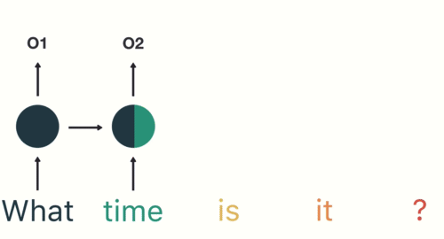

如同我們由左到右逐字閱讀這段文字同時不斷地更新你腦中的記憶狀態，RNN也是以相同的原理在做這件事。RNN的這種設計使它特別適合於像語言翻譯、語音識別或任何需要考慮過去資訊以更好地理解當前情境的任務。例如，在翻譯句子時，理解前面的詞可以幫助更準確地翻譯後面的詞。

但是，RNN也有一些限制，比如它們很難處理很長的序列，因為過長時間的記憶會逐漸消失。這就像如果你試圖回憶幾個月前看的某集連續劇的細節，可能會比較困難。這個問題在後來被一種叫做LSTM的更進階版本的RNN解決。

總之，RNN是一種強大的工具，專門用於處理和預測序列資料中的模式，就像我們用記憶來理解和預測日常生活中的事件一樣。

* 一個簡單的RNN程式架構範例
在上面的例子中，我們已經介紹了RNN的基本概念和運作方式。這樣的RNN要如何實作出來呢？或者說，我們如何將這些概念轉化為程式碼？在本節中，我們將使用Python實作出一個最簡單的RNN模型，並用它來預測股價漲跌。
** RNN的程式運作示例
RNN的運作概念非常簡單，就是在每個時間點 $t$，RNN 會讀入一個新的序列資料 $input_t$，並利用這個資料以及自己的記憶狀態 $state_t$ 來產生一個輸出 $output_t$。

上述過程可以用下面的程式碼來表示：
#+begin_src python -r -n :results output :exports both
def f(input_t, state_t): # f 函式是神經元的運算，也是利用遞迴的方式來處理序列資料
    return input_t + state_t

state_t = 0 # 初始化細胞的狀態

for input_t in input_sequence:
    output_t = f(input_t, state_t) # f 函式是神經元的運算
    state_t = output_t # 更新細胞的狀態
#+end_src
在 RNN 每次讀入任何新的序列資料前，細胞 A 中的記憶狀態 $state_t$ 都會被初始化為 0。

接著在每個時間點 t，RNN 會重複以下步驟：
- 讀入 $input_{sequence}$ 序列中的一個新元素 $input_t$
- 利用 f 函式將當前細胞的狀態 $state_t$ 以及輸入 $input_t$ 做些處理產生 $output_t$
- 輸出 $output_t$ 並同時更新自己的狀態 $state_t$

那麼，有了如下這個簡易版的RNN，要如何將神經元當下的記憶 $state_t$ 與輸入 $input_t$ 結合，才能產生最有意義的輸出 $output_t$ 呢？
#+begin_src python -r -n :results output :exports both
state_t = 0
# 細胞 A 會重複執行以下處理
for input_t in input_sequence:
    output_t = f(input_t, state_t)
    state_t = output_t
#+end_src

RNN神經元在時間點t的輸出 $h_t$ 由以下公式計算:
$$ h_t = f(W_x \cdot X_t + W_h \cdot h_{t-1} + b) $$

在 SimpleRNN 的神經元中，這個函數 $f$ 的實作很簡單，這也導致了其記憶狀態 $state_t$ 沒辦法很好地「記住」前面處理過的序列元素，因而造成 RNN 在處理後來的元素時，就已經把前面重要的資訊給忘記了，也就是只有短期記憶，沒有長期記憶。長短期記憶（Long Short-Term Memory, 後簡稱 LSTM）就是被設計來解決 RNN 的這個問題。

** RNN的程式模型架構
當然，實際應用RNN模型時我們不可能使用自己手刻的這種陽春版RNN，而是會使用像是 TensorFlow 或 PyTorch 這樣的深度學習框架來建立更複雜的模型。這些框架提供了許多現成的 RNN 模組，可以讓我們更輕鬆地建立和訓練 RNN 模型。

以下是一個使用TensorFlow框架建立 RNN 模型的範例。不同於前面的股價漲跌預測例子中每次只輸入一個數值，在這個範例中，模型每次會輸入一組包含4個特徵的資料，在應用到不同領域時，這些特徵可以代表不同的意義。例如：
1. 在股價預測中，這些特徵可以是股價、成交量、其他技術指標等多種資訊的組合，而RNN模型會根據這些特徵來預測未來的股價走勢。
2. 在一個工廠的設備監控系統中，這些特徵可以是溫度、壓力、振動等多種感測器數據的組合，此時RNN模型可以用來預測設備是否會發生故障。

我們使用TensorFlow的 Keras API 來建立這個模型，RNN的模型架構非常簡單：建立一個 SimpleRNN 層，然後接上一個全連接層（Dense layer）來產生最終的輸出。

#+begin_src python -r -n :results output :exports none
import tensorflow as tf
from tensorflow.keras import layers, models

# 模型輸入層 (4個節點)
inputs = layers.Input(shape=(1, 4))

# 隱藏層 (RNN層, 2個節點，對應h1, h2)
hidden = layers.SimpleRNN(units=2, activation='tanh', return_sequences=False)(inputs)

# 模型輸出層 (2個節點)
outputs = layers.Dense(units=2, activation='linear')(hidden)

# 建立並編譯模型
model = models.Model(inputs=inputs, outputs=outputs)
model.compile(optimizer='adam', loss='mse')

# 顯示模型結構
from tensorflow.keras.utils import plot_model

plot_model(
    model,
    to_file='./images/rnnmodel.png',        # 輸出的檔名
    show_shapes=True,           # 在圖中顯示 shape
    show_layer_names=True,      # 顯示層的名稱
    rankdir='TB'                # TB=上下展開, LR=左右展開
)
# 總參數數量
total_params = model.count_params()
# 可訓練參數
trainable_params = int(
    sum([tf.keras.backend.count_params(w) for w in model.trainable_weights])
)
# 非可訓練參數
non_trainable_params = int(
    sum([tf.keras.backend.count_params(w) for w in model.non_trainable_weights])
)

# 格式化顯示
print(f"Total params: {total_params} ({total_params*4/1024:.2f} B)")
print(f"Trainable params: {trainable_params} ({trainable_params*4/1024:.2f} B)")
print(f"Non-trainable params: {non_trainable_params} ({non_trainable_params*4/1024:.2f} B)")

#+end_src

#+RESULTS:
: Total params: 20 (0.08 B)
: Trainable params: 20 (0.08 B)
: Non-trainable params: 0 (0.00 B)

這個模型的架構如圖[[fig:TNN-Archtecture]]所示：

#+CAPTION: RNN模型架構
#+LABEL:fig:TNN-Archtecture
#+name: fig:TNN-Archtecture
#+ATTR_LATEX: :width 300
#+ATTR_ORG: :width 300
#+ATTR_HTML: :width 300
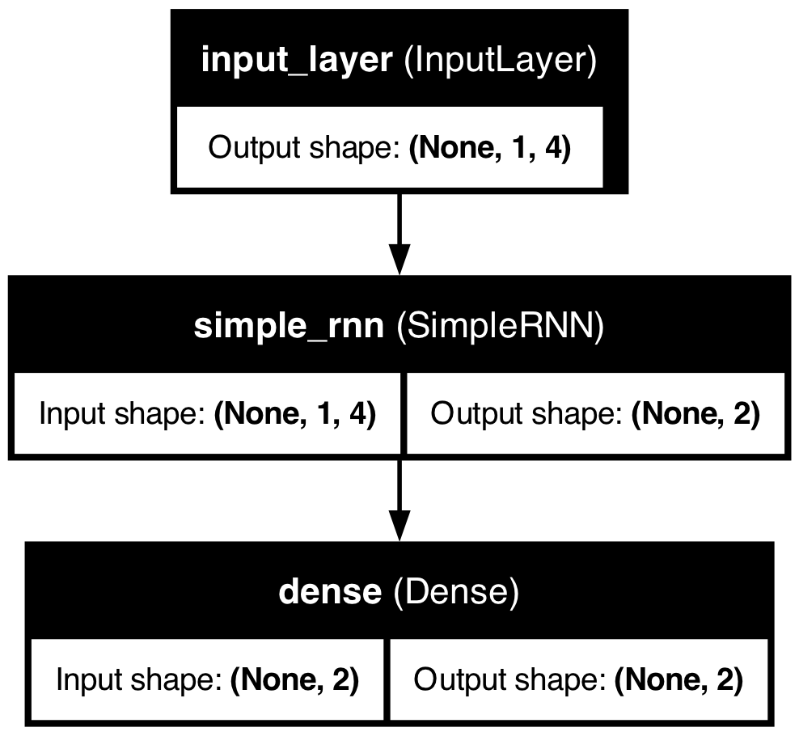

上述模型架構的資料流向如下：
#+BEGIN_SRC plantuml :file rnn_model.png
@startuml
left to right direction
hide empty description
skinparam componentStyle rectangle

package "RNN Network" {
  rectangle Input {
    node "<I><B>x</B></I>2" as i2
    node "<I><B>x</B></I>1" as i1
    node "<I><B>x</B></I>4" as i4
    node "<I><B>x</B></I>3" as i3
  }

  rectangle Hidden {
    node "<I><B>h</B><I>1" as h1
    node "<I><B>h</B><I>2" as h2
  }

  rectangle Output {
    node "<I><B>y</B><I>2" as o2
    node "<I><B>y</B><I>1" as o1
  }

  ' 輸入層與隱藏層的連接 (綠色)
  i1 -[#green]-> h1
  i2 -[#green]-> h1
  i3 -[#green]-> h1
  i4 -[#green]-> h1

  i1 -[#green]-> h2
  i2 -[#green]-> h2
  i3 -[#green]-> h2
  i4 -[#green]-> h2

  ' 隱藏層內循環 (橘色)
  h1 -[#orange]-> h1 : recurrent
  h2 -[#orange]-> h2 : recurrent
  h1 -[#orange,bold,dashed]-> h2 : interaction
  h2 -[#orange,bold,dashed]-> h1

  ' 隱藏層與輸出層的連接 (藍色)
  h1 -[#blue]-> o1
  h1 -[#blue]-> o2
  h2 -[#blue]-> o1
  h2 -[#blue]-> o2
}

@enduml
#+END_SRC

#+CAPTION: RNN架構
#+LABEL:fig:RNN-arch-0
#+name: fig:RNN-arch-0
#+ATTR_LATEX: :width 300
#+ATTR_ORG: :width 300
#+ATTR_HTML: :width 500
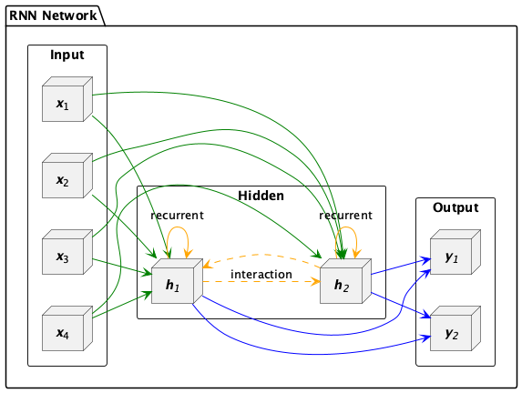

或如下圖
#+begin_src dot :file ./images/RNN-flow.png :exports none :results none
digraph simple_rnn_full {
  rankdir=LR;
  nodesep=0.1;
  ranksep=0.4;
  // Layer: Input
  node [shape=ellipse, style=filled, fillcolor="#E9F8D8", fontname="DejaVu Sans", fontsize=14, width=1.0, fixedsize=true];
  x1 [label=<<I><B>x</B></I>1>];
  x4 [label=<<I><B>x</B></I>4>];
  x2 [label=<<I><B>x</B></I>2>];
  x3 [label=<<I><B>x</B></I>3>];

  // Layer: Hidden
  node [shape=box, style=filled, fillcolor="#D9E8FA", fontname="DejaVu Sans", fontsize=12, width=1.1, fixedsize=true];
  h2 [label=<<I><B>h</B></I>2>, image="images/relu.png"];
  h1 [label=<<I><B>h</B></I>1>, image="images/relu.png"];

  nodesep=0.1;
  node [shape=ellipse, style=filled, fillcolor="#FFDAB9", fontname="DejaVu Sans", fontsize=14, width=1.0, fixedsize=true];
  y1 [label=<<I><B>y</B></I>1>];
  y2 [label=<<I><B>y</B></I>2>];

  // Bias nodes (for style)
  node [shape=square, style=filled, fillcolor="#BFE3FF", width=0.3, fontsize=10];
  b1 [label=<<I><B>b</B></I>1>];
  b2 [label=<<I><B>b</B></I>2>];

  // ----- Input to Hidden -----
  edge [color=seagreen, fontcolor=seagreen, fontsize=11];
  x1 -> h1 [label=<× <B><I>V</I></B>11>];
  x1 -> h2 [label=<× <B><I>V</I></B>21>];
  x2 -> h1 [label=<× <B><I>V</I></B>12>];
  x2 -> h2 [label=<× <B><I>V</I></B>22>];
  x3 -> h1 [label=<× <B><I>V</I></B>13>];
  x3 -> h2 [label=<× <B><I>V</I></B>23>];
  x4 -> h1 [label=<× <B><I>V</I></B>14>];
  x4 -> h2 [label=<× <B><I>V</I></B>24>];

  // Bias to hidden
  b1 -> h1 [label=<+ <B><I>b</I></B>1>, color="gray50", fontcolor="red"];
  b2 -> h2 [label=<+ <B><I>b</I></B>2>, color="gray50", fontcolor="red"];

  // ----- Recurrent -----
  edge [color="crimson", style="dashed", fontcolor="crimson", fontsize=11];
  h1 -> h1 [label=<recurrent>, dir="back", minlen=5];
  h2 -> h2 [label=<recurrent>, dir="back", minlen=3];

  // Hidden to hidden interaction (optional)
  edge [color="orange", style="dotted", fontcolor="orange", fontsize=11];
  h2 -> h1 [label=<interaction>, minlen=5];
  h1 -> h2 [label=<interaction>, minlen=5];

  // ----- Hidden to Output -----
  edge [color="royalblue", fontcolor="royalblue", fontsize=11, style=solid];
  h1 -> y1 [label=<× <B><I>W</I></B>11>];
  h1 -> y2 [label=<× <B><I>W</I></B>21>];
  h2 -> y1 [label=<× <B><I>W</I></B>12>];
  h2 -> y2 [label=<× <B><I>W</I></B>22>];

  // --- Layer alignment ---
  {rank=same; x1; x2; x3; x4;}
  {rank=same; h1; h2;}
  {rank=same; y1; y2;}
}
#+end_src
#+CAPTION: RNN資料流向圖
#+LABEL:fig:RNN-flow
#+name: fig:RNN-flow
#+ATTR_LATEX: :width 300
#+ATTR_ORG: :width 300
#+ATTR_HTML: :width 500
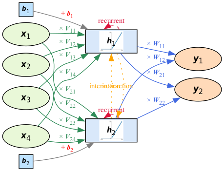

這個RNN模型的架構可分為四個主要部分，以工廠設備的預測性維護場景為例，模型的各層功能說明如下：
1. 輸入層：
   模型輸入層包含四個節點，機器感測器每分鐘會收到下列資料：
   - 溫度（Temperature）
   - 壓力（Pressure）
   - 振動幅度（Vibration）
   - 電流（Current）
   這些感測器數據能夠即時反映設備運作狀態，是判斷異常與劣化趨勢的第一手依據。
2. 隱藏層（RNN層）：
   隱藏層由兩個RNN單元（$h_1$、$h_2$）組成，能夠捕捉時間序列資料的動態變化。RNN特有的「記憶能力」可根據歷史感測數據（如過去的震動紀錄、轉速變化）與當前輸入，判斷設備狀態變化趨勢，進而識別異常徵兆。
3. 輸出層：
   輸出層同樣設計為兩個節點：
   1. $y_1$ ：預測設備未來一段時間內出現故障的風險機率（例如馬達即將故障、異常發熱等）。
   2. $y_2$ ：預測是否需維修（建議立即維護/可繼續運行）
4. 偏置節點：
   每個RNN隱藏單元均設有對應的偏置（$b_1$、$b_2$），用於調整輸出，增強模型彈性與表現力。

這個模型的設計能夠有效地處理時間序列資料，並根據歷史數據預測設備的未來狀態，特別適合用於工廠設備的預測性維護。透過這樣的模型，工廠可以提前識別設備異常，降低突發停機風險，提高生產效率。

#+begin_src dot :file ./images/rnn-cell-4-3-1.png :results file :exports results
digraph RNN_Cell {
  rankdir=LR;
  fontname="Arial";
  node [fontname="Arial", style=filled, fontsize=18];

  // === 節點定義 ===
  // 輸入層 (4 維)
  x_t [label=<<b>xt</b> (4 維)>, shape=circle, fillcolor="#b2df8a", width=1.2];

  // 隱藏層前一時刻 (h_{t-1})
  h_prev [label=<<b>ht-1</b> (3 維)>, shape=circle, fillcolor="#fdb462", width=1.2];

  // 權重矩陣
  W_x [label=<<b>Wx</b> (3×4)>, shape=box, fillcolor="#ffffb3", width=1.4, height=0.8];
  W_h [label=<<b>Wh</b> (3×3)>, shape=box, fillcolor="#ffffb3", width=1.4, height=0.8];
  sum [label=<<b>+</b>>, shape=circle, fillcolor="#eeeeee", width=0.4];
  act [label=<<b>tanh / ReLU</b>>, shape=box, fillcolor="#fb9a99", width=1.8, height=0.8];

  // 隱藏層輸出 (h_t)
  h_t [label=<<b>ht</b> (3 維)>, shape=circle, fillcolor="#fdb462", width=1.2];

  // 輸出層權重
  W_y [label=<<b>Wy</b> (1×3)>, shape=box, fillcolor="#ccebc5", width=1.4, height=0.8];

  // 輸出層輸出
  y_t [label=<<b>yt</b> (1 維)>, shape=circle, fillcolor="#80b1d3", width=1.2];

  // === 邊與連線 ===
  x_t   -> W_x [label="", penwidth=2, color="#4daf4a"];
  W_x   -> sum [penwidth=2, color="#4daf4a"];

  h_prev -> W_h [penwidth=2, color="#ff7f00"];
  W_h    -> sum [penwidth=2, color="#ff7f00"];

  sum -> act [penwidth=2, color="gray40"];
  act -> h_t [penwidth=2, color="#e31a1c"];

  h_t -> W_y [penwidth=2, color="#377eb8"];
  W_y -> y_t [penwidth=2, color="#377eb8"];

  // === 排版控制 ===
  {rank=same; x_t; W_x;}
  {rank=same; h_prev; W_h;}
  {rank=same; y_t;}
}
#+end_src

#+RESULTS:
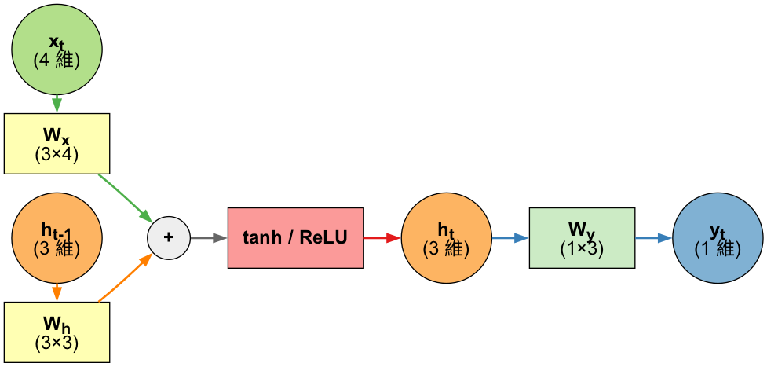

#+CAPTION: RNN單元內部結構（4-3-1架構）
#+LABEL:fig:RNN-cell-4-3-1
#+name: fig:RNN-cell-4-3-1
#+ATTR_LATEX: :width 300
#+ATTR_ORG: :width 300
#+ATTR_HTML: :width 500

* RNN模型的實作範例：從訓練到預測
上述的程式架構只是展示了RNN模型的基本結構，實際應用中我們還需要進行資料準備、模型訓練以及預測等步驟。接下來，我們將實作一個簡單的RNN模型，使用Keras來預測時間序列資料。這個例子將展示如何生成一組帶有雜訊的sin(x) + cos(0.5x)時間序列資料，並使用RNN來預測未來的值。

我們的目的是用一個簡單的 RNN（SimpleRNN）模型，學會預測一段帶雜訊的週期性時間序列的未來值。我們先以人工方式生成一個簡單的、有規律的序列資料( $sin(x)+cos(0.5x)$ 加入高斯雜訊)，然後用 RNN 模型來預測這個序列的未來值。

程式預計的生成結果如圖[[fig:RNNPredictionDemo]]，其中的藍色線條是實際的資料，而橘色線條則是模型預測的結果。為了更清楚地展示預測效果，我們將只放大最後300個點。

#+CAPTION: RNN模型預測結果（局部放大）
#+LABEL:fig:RNNPredictionDemo
#+name: fig:RNNPredictionDemo
#+ATTR_LATEX: :width 400
#+ATTR_ORG: :width 400
#+ATTR_HTML: :width 600
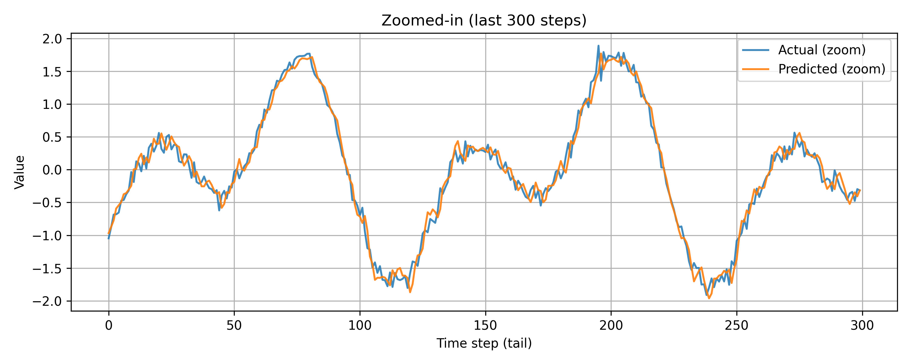

** 先繪製四合一總覽圖 :noexport:
#+begin_src shell -r -n :results output :exports both
source ./venv/bin/activate
#+end_src

#+begin_src shell -r -n :results output :exports both
pwd
./venv/bin/python3 -m pip install matplotlib numpy scikit-learn tensorflow
#+end_src

#+begin_src emacs-lisp
(setq org-babel-python-command "./venv/bin/python3")
#+end_src
#+RESULTS:
: ./venv/bin/python3

#+begin_src python -r -n :results output :exports both
import numpy as np
import matplotlib.pyplot as plt
from sklearn.metrics import mean_squared_error, mean_absolute_error, r2_score

# 可選：固定隨機種子以利重現
np.random.seed(42)
import tensorflow as tf
tf.random.set_seed(42)

# ====== 若前面尚未執行資料產生與前處理，取消下方註解 ======
import numpy as np
import matplotlib.pyplot as plt
from sklearn.preprocessing import MinMaxScaler
def generate_sin_cos_data(total_length=3000, noise_std=0.1):
    x = np.linspace(0, total_length * 0.1, total_length)
    clean = np.sin(x) + np.cos(x * 0.5)
    noise = np.random.normal(0, noise_std, size=clean.shape)
    noisy_data = clean + noise
    return x, noisy_data.reshape(-1, 1), clean.reshape(-1, 1)
x, noisy_data, clean_data = generate_sin_cos_data()
from sklearn.preprocessing import MinMaxScaler
scaler = MinMaxScaler()
scaled = scaler.fit_transform(noisy_data)
def create_sequences(data, seq_len=20):
    X, y = [], []
    for i in range(len(data) - seq_len):
        X.append(data[i:i+seq_len])
        y.append(data[i+seq_len])
    return np.array(X), np.array(y)
SEQ_LEN = 20
X, y = create_sequences(scaled, SEQ_LEN)
split = int(len(X) * 0.8)
X_train, y_train = X[:split], y[:split]
X_test, y_test   = X[split:], y[split:]

# ====== 建立/訓練模型（在你的基礎上小幅強化）======
from tensorflow import keras
model = keras.models.Sequential([
    keras.layers.Input(shape=(None, 1)),
    keras.layers.SimpleRNN(8),
    keras.layers.Dense(1)
])
model.compile(loss='mse', optimizer='adam')
history = model.fit(X_train, y_train, epochs=30, batch_size=64,
                    validation_split=0.1, verbose=0)

# ====== 推論與反標準化 ======
pred_test = model.predict(X_test, verbose=0)
pred_test_inv = scaler.inverse_transform(pred_test)
actual_test_inv = scaler.inverse_transform(y_test)

# ====== 評估指標 ======
mse  = mean_squared_error(actual_test_inv, pred_test_inv)
mae  = mean_absolute_error(actual_test_inv, pred_test_inv)
rmse = np.sqrt(mse)
r2   = r2_score(actual_test_inv, pred_test_inv)

# ====== 只畫第三張：局部放大（最後 300 個點）======
import matplotlib.pyplot as plt

zoom_n = 300
plt.figure(figsize=(10, 4))
plt.plot(actual_test_inv[-zoom_n:], label='Actual (zoom)', alpha=0.85)
plt.plot(pred_test_inv[-zoom_n:], label='Predicted (zoom)', alpha=0.9)
plt.title(f"SimpleRNN Prediction (Zoomed-in, last {zoom_n} steps)")
plt.xlabel("Time step (tail)")
plt.ylabel("Value")
plt.grid(True)
plt.legend(loc='upper right')

# 存檔
plt.tight_layout()
plt.savefig("images/rnn_zoom.png", dpi=300)
plt.show()

'''
# ====== 作圖（2×2）======
import matplotlib.gridspec as gridspec
fig = plt.figure(figsize=(14, 8))
gs = gridspec.GridSpec(2, 2, figure=fig, hspace=0.28, wspace=0.18)

# 1) 左上：資料概況（抽一段較短區間提高辨識度）
ax1 = fig.add_subplot(gs[0, 0])
show_n = 600
ax1.plot(x[:show_n], clean_data[:show_n], label='Clean sin(x)+cos(0.5x)', alpha=0.7)
ax1.plot(x[:show_n], noisy_data[:show_n], label='Noisy signal', alpha=0.9)
ax1.set_title("Data Overview (Clean vs. Noisy)")
ax1.set_xlabel("x")
ax1.set_ylabel("Value")
ax1.grid(True)
ax1.legend(loc='upper right')

# 2) 右上：測試集預測（整段）
ax2 = fig.add_subplot(gs[0, 1])
ax2.plot(actual_test_inv, label='Actual', alpha=0.85)
ax2.plot(pred_test_inv, label='Predicted', alpha=0.9)
ax2.set_title("Test Prediction (SimpleRNN)")
ax2.set_xlabel("Time step (test)")
ax2.set_ylabel("Value")
ax2.grid(True)
ax2.legend(loc='upper right')

# 在右上角加指標框
metrics_text = f"MSE={mse:.4f}\nMAE={mae:.4f}\nRMSE={rmse:.4f}\n$R^2$={r2:.4f}"
ax2.text(0.02, 0.98, metrics_text, transform=ax2.transAxes,
         va='top', ha='left', fontsize=10,
         bbox=dict(boxstyle='round,pad=0.35', fc='white', ec='gray', alpha=0.9))

# 3) 左下：局部放大（最後 300 個點）
ax3 = fig.add_subplot(gs[1, 0])
zoom_n = 300
ax3.plot(actual_test_inv[-zoom_n:], label='Actual (zoom)', alpha=0.85)
ax3.plot(pred_test_inv[-zoom_n:], label='Predicted (zoom)', alpha=0.9)
ax3.set_title(f"Zoomed-in (last {zoom_n} steps)")
ax3.set_xlabel("Time step (tail)")
ax3.set_ylabel("Value")
ax3.grid(True)
ax3.legend(loc='upper right')

# 4) 右下：學習曲線（Train/Val Loss）
ax4 = fig.add_subplot(gs[1, 1])
ax4.plot(history.history['loss'], label='Train Loss')
if 'val_loss' in history.history:
    ax4.plot(history.history['val_loss'], label='Val Loss')
ax4.set_title("Learning Curve")
ax4.set_xlabel("Epoch")
ax4.set_ylabel("MSE Loss")
ax4.grid(True)
ax4.legend(loc='upper right')

fig.suptitle("SimpleRNN on sin(x)+cos(0.5x): Overview", y=0.98, fontsize=14)
plt.tight_layout(rect=[0, 0, 1, 0.96])
plt.savefig("images/rnn_overview.png", dpi=300)
plt.show()
'''
#+end_src

** 匯入與資料產生
首先以這段程式碼生成一個帶有雜訊的時間序列資料，這些是訓練模型所需的資料。這裡我們生成的時間序列資料是 $sin(x) + cos(0.5x)$，並加入高斯雜訊來模擬實際情況中的雜訊干擾，這樣的資料可以幫助模型學習如何從雜訊中提取有用的信號。
#+begin_src python -r -n :results output :exports both :session rnn_session
import numpy as np
import matplotlib.pyplot as plt

# 1. 生成 sin(x) + cos(x) 並加入雜訊的時間序列資料
def generate_sin_cos_data(total_length=3000, noise_std=0.1):
    x = np.linspace(0, total_length * 0.1, total_length)
    clean = np.sin(x) + np.cos(x * 0.5)  # 不同頻率增加變化性
    noise = np.random.normal(0, noise_std, size=clean.shape)
    noisy_data = clean + noise
    return x, noisy_data.reshape(-1, 1), clean.reshape(-1, 1)

# 2. 繪圖展示 sin + cos 波型（含雜訊）
x, noisy_data, clean_data = generate_sin_cos_data()

plt.figure(figsize=(12, 4))
plt.plot(x, clean_data, label='Clean sin(x) + cos(0.5x)', alpha=0.6)
plt.plot(x, noisy_data, label='Noisy signal', alpha=0.8)
plt.title("Time Series: sin(x) + cos(0.5x) with Noise")
plt.xlabel("x")
plt.ylabel("Value")
plt.legend()
plt.grid(True)
plt.tight_layout()
plt.savefig("images/rnn_data.png", dpi=300)
#plt.show()
#+end_src
生成的時間序列資料如圖[[fig:rnn_train_data]]所示，資料總數共 3000 個點，這些資料是我們用來訓練 RNN 模型的基礎。
#+CAPTION: 時間序列資料生成與展示
#+LABEL:fig:rnn_train_data
#+name: fig:rnn_train_data
#+ATTR_LATEX: :width 300
#+ATTR_ORG: :width 300
#+ATTR_HTML: :width 600
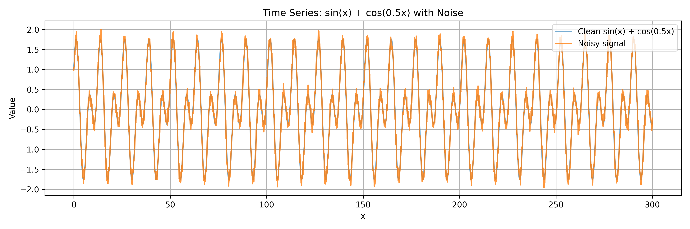

** 前處理與序列資料製作
接下來我們對生成的時間序列資料進行標準化處理，把資料轉換為適合 RNN 模型訓練的序列格式。這裡我們使用 **MinMaxScaler** 來將資料縮放到 [0, 1] 範圍內，然後建立一個長度為 20 的序列資料集。進行標準化的目的在於提高模型的訓練效率和預測準確度，因為 RNN 模型對於輸入資料的尺度非常敏感，在將資料縮放到 [0, 1] 範圍內後，可以幫助模型更快地收斂。

#+begin_src python -r -n :results output :exports both :session rnn_session
import tensorflow as tf
from tensorflow import keras
from sklearn.preprocessing import MinMaxScaler

# 標準化
scaler = MinMaxScaler()
scaled = scaler.fit_transform(noisy_data)

# 建立序列
def create_sequences(data, seq_len=20):
    X, y = [], []
    for i in range(len(data) - seq_len):
        X.append(data[i:i+seq_len])
        y.append(data[i+seq_len])
    return np.array(X), np.array(y)

SEQ_LEN = 20
X, y = create_sequences(scaled, SEQ_LEN)

# 分訓練與測試集
split = int(len(X) * 0.8)
X_train, y_train = X[:split], y[:split]
X_test, y_test = X[split:], y[split:]

print(f"X_train shape: {X_train.shape}, y_train shape: {y_train.shape}")
print(f"X_test shape: {X_test.shape}, y_test shape: {y_test.shape}")

# 輸出X_train和y_train的前5筆資料
print("X_train sample (first 2 sequences):")
print(X_train[:2])
print("Y_train sample (first 2 values):")
print(y_train[:2])
#+end_src
以下是這個訓練資料(X_train, Y_train)的形狀和前兩筆資料的輸出結果：藉由這些資料，我們想告訴想告訴模型：如果你看到類似的這樣20筆資料，那麼，接下來的第21筆資料應該是什麼樣子。

#+RESULTS:
#+begin_example
X_train shape: (2384, 20, 1), y_train shape: (2384, 1)
X_test shape: (596, 20, 1), y_test shape: (596, 1)
X_train sample (first 2 sequences):
[[[0.73592459]
  [0.75703221]
  [0.76230877]
  [0.81056956]
  [0.81595172]
  [0.85598213]
  [0.83727388]
  [0.88166678]
  [0.95565607]
  [0.89441307]
  [0.89788997]
  [0.91241336]
  [0.94591805]
  [0.98031334]
  [0.90012658]
  [0.96128886]
  [0.90676585]
  [0.87651928]
  [0.92046898]
  [0.90352297]]

 [[0.75703221]
  [0.76230877]
  [0.81056956]
  [0.81595172]
  [0.85598213]
  [0.83727388]
  [0.88166678]
  [0.95565607]
  [0.89441307]
  [0.89788997]
  [0.91241336]
  [0.94591805]
  [0.98031334]
  [0.90012658]
  [0.96128886]
  [0.90676585]
  [0.87651928]
  [0.92046898]
  [0.90352297]
  [0.8413003 ]]]
Y_train sample (first 2 values):
[[0.8413003 ]
 [0.82853204]]
#+end_example

** 建立RNN模型
許多框架都支援RNN模型，例如 TensorFlow、PyTorch 等。這裡我們使用 TensorFlow的 Keras API 來建立一個簡單的 RNN 模型。

我們使用 Keras 的 `SimpleRNN` 層來建立一個簡單的 RNN 模型，然後對模型進行編譯（compile），這裡的「編譯」和以往我們熟悉的那種「寫完程式後編譯、執行」的概念不同，這裡的編譯是指設定損失函數和優化器等參數，以便模型能夠進行訓練。

#+begin_src python -r -n :results output :exports both :session rnn_session
model = keras.models.Sequential([
    keras.layers.Input(shape=(None, 1)),
    keras.layers.SimpleRNN(1)  # 預設 activation='tanh'
])
model.compile(loss='mse', optimizer='adam')
model.summary()
#+end_src

#+RESULTS:

Model: "sequential"
|------------------------------------+--------------+---------|
| Layer (type)                       | Output Shape | Param # |
|------------------------------------+--------------+---------|
| simple_rnn (SimpleRNN) │ (None, 1) |            3 |         |
|------------------------------------+--------------+---------|

 Total params: 3 (12.00 B)
 Trainable params: 3 (12.00 B)
 Non-trainable params: 0 (0.00 B)

在 Keras 中，=Input(shape=(None, 1))= 的意思是：
| 維度 | 代表什麼              | 解釋                                                       |
|------|---------------------|----------------------------------------------------------|
| None | 時間步長（timesteps） | 不指定具體長度，代表可以處理「任意長度」的序列             |
| 1    | 每個時間點的特徵數    | 這裡是一個數字（例如只有一個值：sin+cos），所以是 1 維特徵 |

在 Keras RNN 中，每筆資料會被視為一個 3 維陣列：
#+begin_example
[樣本數, 時間步長 (None), 特徵數]
#+end_example
舉個例子：
#+begin_example
X.shape = (1000, 20, 1)
#+end_example
| 維度 | 代表                 | 舉例                         |
|------|--------------------|------------------------------|
| 1000 | 有 1000 筆序列       | 訓練樣本數                   |
|   20 | 每筆序列長度是 20 步 | 每筆是一段長度 20 的時間序列 |
|    1 | 每步只有 1 個數字    | 像是 sin 值、溫度、股價      |
我們現在只知道每個時間點有 1 個特徵（像是溫度），但不知道資料序列會多長，因此時間的維度就交給模型在運作時決定，所以寫 None。」

好吧，其實我們是知道的(在這個例子中是 20 步長的序列)，但這是這樣寫是為了讓模型能夠處理任意長度的序列資料這樣的設計可以讓模型在訓練時自動學習時間序列的長度和特徵數量。

** 訓練模型
接下來，我們將使用訓練資料來訓練這個 RNN 模型。這裡我們使用 `fit` 方法來進行訓練，並設定訓練的輪數（epochs）為 20 次。每次訓練都會更新模型的權重，以便模型能夠更好地預測未來的值。參數verbose=2表示在訓練過程中輸出詳細的訓練進度，你也可以將其設為 1 或 0 來調整輸出細節。
#+begin_src python -r -n :results output :exports both :session rnn_session
model.fit(X_train, y_train, epochs=20, verbose=2)
#+end_src

#+RESULTS:
#+begin_example
Epoch 1/20
75/75 - 0s - 5ms/step - loss: 0.0055
Epoch 2/20
75/75 - 0s - 5ms/step - loss: 0.0055
Epoch 3/20
75/75 - 0s - 4ms/step - loss: 0.0054
Epoch 4/20
75/75 - 0s - 4ms/step - loss: 0.0054
Epoch 5/20
75/75 - 0s - 5ms/step - loss: 0.0054
Epoch 6/20
75/75 - 0s - 4ms/step - loss: 0.0053
Epoch 7/20
75/75 - 0s - 4ms/step - loss: 0.0053
Epoch 8/20
75/75 - 0s - 4ms/step - loss: 0.0053
Epoch 9/20
75/75 - 0s - 4ms/step - loss: 0.0052
Epoch 10/20
75/75 - 0s - 5ms/step - loss: 0.0052
Epoch 11/20
75/75 - 0s - 4ms/step - loss: 0.0051
Epoch 12/20
75/75 - 0s - 5ms/step - loss: 0.0051
Epoch 13/20
75/75 - 0s - 4ms/step - loss: 0.0051
Epoch 14/20
75/75 - 0s - 5ms/step - loss: 0.0050
Epoch 15/20
75/75 - 0s - 4ms/step - loss: 0.0050
Epoch 16/20
75/75 - 0s - 4ms/step - loss: 0.0050
Epoch 17/20
75/75 - 0s - 3ms/step - loss: 0.0049
Epoch 18/20
75/75 - 0s - 807us/step - loss: 0.0049
Epoch 19/20
75/75 - 0s - 671us/step - loss: 0.0049
Epoch 20/20
75/75 - 0s - 749us/step - loss: 0.0048
#+end_example

** 評估預測效果並繪圖
模型訓練完後總要評估一下預測效果，這裡我們使用測試資料來評估模型的預測能力。首先，我們使用 `predict` 方法來獲取模型對測試資料的預測結果，然後將預測結果還原回原始數值範圍。接著，我們將實際值和預測值繪製在同一張圖上，以便直觀地比較模型的預測效果。

#+begin_src python -r -n :results output :exports both :session rnn_session
predicted = model.predict(X_test)
# 還原回原始數值
predicted_inv = scaler.inverse_transform(predicted)
actual_inv = scaler.inverse_transform(y_test)

plt.figure(figsize=(12, 4))
plt.plot(actual_inv, label='Clean Target', alpha=0.6)
plt.plot(predicted_inv, label='Predicted', alpha=0.8)
plt.title("Keras SimpleRNN Prediction")
plt.xlabel("Time step")
plt.ylabel("Value")
plt.legend()
plt.grid(True)
plt.savefig("images/rnn_prediction.png", dpi=300)
#plt.show()
#+end_src

#+CAPTION: RNN模型預測結果
#+LABEL:fig:rnn_prediction
#+name: fig:rnn_prediction
#+ATTR_LATEX: :width 300
#+ATTR_ORG: :width 300
#+ATTR_HTML: :width 600
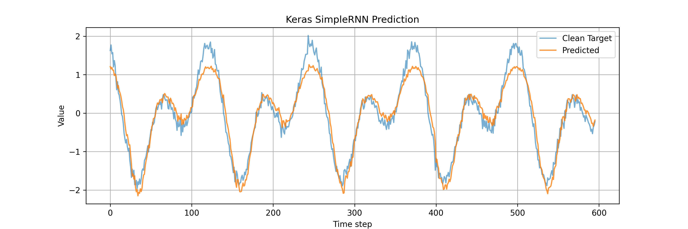

由上圖大致可以看出，模型對於時間序列的預測效果還不錯，雖然有些波動，但整體趨勢是正確的。

但是，所謂「不錯」到底是到什麼程度呢？這裡我們需要使用一些評估指標來量化模型的預測效果。一般在評估這種數值預測模型時，我們會使用均方誤差（MSE）、平均絕對誤差（MAE）、均方根誤差（RMSE）和決定係數（$R^2$）等指標來衡量模型的預測效果。幾種RNN模型的評估指標如下：

1. MSE（均方誤差，Mean Squared Error）, 是預測值與實際值之間的平均平方差，越小越好, 單位是平方的數值。計算公式如下：
   $$ MSE = \frac{1}{n} \sum_{i=1}^{n} (y_i - \hat{y}_i)^2 $$
   其中，$y_i$是實際值，$\hat{y}_i$是預測值，$n$是樣本數。
1. MAE（平均絕對誤差，Mean Absolute Error）, 是預測值與實際值之間的平均絕對差，越小越好, 單位與資料本身一致, 優點是不容易被極端值影響。計算公式如下：
   $$ MAE = \frac{1}{n} \sum_{i=1}^{n} |y_i - \hat{y}_i| $$
   其中，$y_i$是實際值，$\hat{y}_i$是預測值，$n$是樣本數。
1. RMSE（均方根誤差，Root Mean Squared Error）, 是預測值與實際值之間的均方根誤差，越小越好, 單位是平方根的數值，常用在實際工程應用。 計算公式如下：
   $$ RMSE = \sqrt{\frac{1}{n} \sum_{i=1}^{n} (y_i - \hat{y}_i)^2} $$
   其中，$y_i$是實際值，$\hat{y}_i$是預測值，$n$是樣本數。
1. $R^2$（決定係數，Coefficient of Determination），是用來評估模型預測能力的指標，值介於0~1之間，越接近1表示模型越好。$R^2$的計算公式如下：
   $$ R^2 = 1 - \frac{\sum_{i=1}^{n} (y_i - \hat{y}_i)^2}{\sum_{i=1}^{n} (y_i - \bar{y})^2} $$

#+begin_src python -r -n :results output :exports both :session rnn_session
import numpy as np
from sklearn.metrics import mean_squared_error, mean_absolute_error, r2_score

# 計算各種評估指標
mse  = mean_squared_error(actual_inv, predicted_inv)
mae  = mean_absolute_error(actual_inv, predicted_inv)
rmse = np.sqrt(mse)
r2   = r2_score(actual_inv, predicted_inv)

# 直接輸出結果
print("=== 評估指標 ===")
print(f"MSE  : {mse:.6f}")
print(f"MAE  : {mae:.6f}")
print(f"RMSE : {rmse:.6f}")
print(f"R^2  : {r2:.6f}")
#+end_src

#+RESULTS:
: === 評估指標 ===
: MSE  : 0.073513
: MAE  : 0.218703
: RMSE : 0.271133
: R^2  : 0.926007

這些評估結果足夠好了嗎？能不能再提升？當然可以！在實際應用中，我們通常會嘗試不同的模型架構和參數來進一步提升預測效果。例如:
*** 增加隱藏層神經元數量
#+begin_src python -r -n :results output :exports both
keras.layers.SimpleRNN(8)  # 把神經元從 1 個增加到 8 個
#+end_src
*** 增加隱藏層數量
例如：SimpleRNN層、Dense層、Dropout層
**** SimpleRNN層
這個層是 RNN 的核心部分，負責處理序列資料。你可以增加這個層的神經元數量來提高模型的容量，讓模型能夠學習更複雜的模式。
#+begin_src python -r -n :results output :exports both
model = keras.models.Sequential([
    keras.layers.Input(shape=(None, 1)),
    keras.layers.SimpleRNN(4, return_sequences=True),  # 第一層要回傳序列
    keras.layers.SimpleRNN(4),  # 第二層直接接收整段序列資訊
    keras.layers.Dense(1)
])
#+end_src
=return_sequences=True= ：告訴第一層 RNN 回傳「每個時間步的輸出」，否則下一層 RNN 沒辦法處理。
**** Dense層
這個層可以增加模型的容量，讓模型能夠學習更複雜的模式。Dense層會將上一層的輸出進行線性變換，並加上偏置項，然後通過激活函數（默認是ReLU）來產生輸出。
#+begin_src python -r -n :results output :exports both
model = keras.models.Sequential([
    keras.layers.Input(shape=(None, 1)),
    keras.layers.SimpleRNN(4),  # 增加容量
    keras.layers.Dense(1)  # 加輸出層
])
#+end_src
**** Dropout層
這個層可以幫助減少過擬合，特別是在訓練資料較少的情況下。Dropout層會隨機丟棄一部分神經元的輸出，以防止模型過度依賴某些特定的神經元。
#+begin_src python -r -n :results output :exports both
model = keras.models.Sequential([
    keras.layers.Input(shape=(None, 1)),
    keras.layers.SimpleRNN(4, return_sequences=True),
    keras.layers.SimpleRNN(4),
    keras.layers.Dropout(0.2),
    keras.layers.Dense(1)
])
#+end_src
*** 增加訓練次數
也就是增加 epochs 的數量，讓模型有更多機會學習資料中的模式。

** 標準的評估結果呈現方式
在輸出模型預測結果時，通常會將實際值和預測值繪製在同一張圖上，以便直觀地比較模型的預測效果。這樣的圖表可以幫助我們更好地理解模型的預測能力和局限性。

#+begin_src python -r -n :results output :exports none :session rnn_session
import numpy as np
import matplotlib.pyplot as plt
from sklearn.metrics import mean_squared_error, mean_absolute_error, r2_score

# 可選：固定隨機種子以利重現
np.random.seed(42)
import tensorflow as tf
tf.random.set_seed(42)

# ====== 若前面尚未執行資料產生與前處理，取消下方註解 ======
import numpy as np
import matplotlib.pyplot as plt
from sklearn.preprocessing import MinMaxScaler
def generate_sin_cos_data(total_length=3000, noise_std=0.1):
    x = np.linspace(0, total_length * 0.1, total_length)
    clean = np.sin(x) + np.cos(x * 0.5)
    noise = np.random.normal(0, noise_std, size=clean.shape)
    noisy_data = clean + noise
    return x, noisy_data.reshape(-1, 1), clean.reshape(-1, 1)
x, noisy_data, clean_data = generate_sin_cos_data()
from sklearn.preprocessing import MinMaxScaler
scaler = MinMaxScaler()
scaled = scaler.fit_transform(noisy_data)
def create_sequences(data, seq_len=20):
    X, y = [], []
    for i in range(len(data) - seq_len):
        X.append(data[i:i+seq_len])
        y.append(data[i+seq_len])
    return np.array(X), np.array(y)
SEQ_LEN = 20
X, y = create_sequences(scaled, SEQ_LEN)
split = int(len(X) * 0.8)
X_train, y_train = X[:split], y[:split]
X_test, y_test   = X[split:], y[split:]

# ====== 建立/訓練模型（在你的基礎上小幅強化）======
from tensorflow import keras
model = keras.models.Sequential([
    keras.layers.Input(shape=(None, 1)),
    keras.layers.SimpleRNN(8),
    keras.layers.Dense(1)
])
model.compile(loss='mse', optimizer='adam')
history = model.fit(X_train, y_train, epochs=30, batch_size=64,
                    validation_split=0.1, verbose=0)

# ====== 推論與反標準化 ======
pred_test = model.predict(X_test, verbose=0)
pred_test_inv = scaler.inverse_transform(pred_test)
actual_test_inv = scaler.inverse_transform(y_test)

# ====== 評估指標 ======
mse  = mean_squared_error(actual_test_inv, pred_test_inv)
mae  = mean_absolute_error(actual_test_inv, pred_test_inv)
rmse = np.sqrt(mse)
r2   = r2_score(actual_test_inv, pred_test_inv)

# ====== 作圖（2×2）======
import matplotlib.gridspec as gridspec
fig = plt.figure(figsize=(14, 8))
gs = gridspec.GridSpec(2, 2, figure=fig, hspace=0.28, wspace=0.18)

# 1) 左上：資料概況（抽一段較短區間提高辨識度）
ax1 = fig.add_subplot(gs[0, 0])
show_n = 600
ax1.plot(x[:show_n], clean_data[:show_n], label='Clean sin(x)+cos(0.5x)', alpha=0.7)
ax1.plot(x[:show_n], noisy_data[:show_n], label='Noisy signal', alpha=0.9)
ax1.set_title("Data Overview (Clean vs. Noisy)")
ax1.set_xlabel("x")
ax1.set_ylabel("Value")
ax1.grid(True)
ax1.legend(loc='upper right')

# 2) 右上：測試集預測（整段）
ax2 = fig.add_subplot(gs[0, 1])
ax2.plot(actual_test_inv, label='Actual', alpha=0.85)
ax2.plot(pred_test_inv, label='Predicted', alpha=0.9)
ax2.set_title("Test Prediction (SimpleRNN)")
ax2.set_xlabel("Time step (test)")
ax2.set_ylabel("Value")
ax2.grid(True)
ax2.legend(loc='upper right')

# 在右上角加指標框
metrics_text = f"MSE={mse:.4f}\nMAE={mae:.4f}\nRMSE={rmse:.4f}\n$R^2$={r2:.4f}"
ax2.text(0.02, 0.98, metrics_text, transform=ax2.transAxes,
         va='top', ha='left', fontsize=10,
         bbox=dict(boxstyle='round,pad=0.35', fc='white', ec='gray', alpha=0.9))

# 3) 左下：局部放大（最後 300 個點）
ax3 = fig.add_subplot(gs[1, 0])
zoom_n = 300
ax3.plot(actual_test_inv[-zoom_n:], label='Actual (zoom)', alpha=0.85)
ax3.plot(pred_test_inv[-zoom_n:], label='Predicted (zoom)', alpha=0.9)
ax3.set_title(f"Zoomed-in (last {zoom_n} steps)")
ax3.set_xlabel("Time step (tail)")
ax3.set_ylabel("Value")
ax3.grid(True)
ax3.legend(loc='upper right')

# 4) 右下：學習曲線（Train/Val Loss）
ax4 = fig.add_subplot(gs[1, 1])
ax4.plot(history.history['loss'], label='Train Loss')
if 'val_loss' in history.history:
    ax4.plot(history.history['val_loss'], label='Val Loss')
ax4.set_title("Learning Curve")
ax4.set_xlabel("Epoch")
ax4.set_ylabel("MSE Loss")
ax4.grid(True)
ax4.legend(loc='upper right')

fig.suptitle("SimpleRNN on sin(x)+cos(0.5x): Overview", y=0.98, fontsize=14)
plt.tight_layout(rect=[0, 0, 1, 0.96])
plt.savefig("images/rnn_detail.png", dpi=300)
#plt.show()
#+end_src

#+CAPTION: RNN模型詳細預測結果
#+LABEL:fig:rnn_evaluation
#+name: fig:rnn_evaluation
#+ATTR_LATEX: :width 300
#+ATTR_ORG: :width 300
#+ATTR_HTML: :width 800
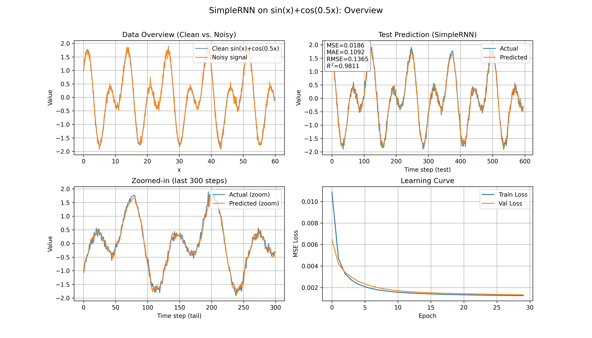

同學們可以把重點放在圖[[fig:rnn_evaluation]]的第4張子圖上，這是模型的學習曲線（Learning Curve），它顯示了訓練過程中損失函數（Loss）的變化情況。從圖中可以看出，隨著訓練次數(Epoch)的增加，模型的損失逐漸減少，這表明模型在學習資料中的模式。

** 好像有哪裡不對勁？
這麼一個簡單的模型就能達到這麼好的預測效果？真的嗎？

其實我們在過程中是有點作弊的：
1. 首先，我們的資料是從一個已知的數學函數（sin+cos）生成的，所以模型能夠很容易地學習到這個模式。
2. 其次，也是最重要的一點，我們每個預估點都是從20筆「正確」的資料中預估出來的，就算其中有某些資料預測錯誤，仍不影響接下來的預測(因為下一個預估值仍是依據正確的20筆資料)，但這不是我們實際需要的預測，通常提及預測，我們需要的是「未來一週的PM 2.5變化」或是「未來一個月的股價走勢」。也就是說，我們需要的預測是基於「未來的資料」來預測「未來的值」，而不是基於「過去的資料」來預測「過去的值」。

你要不要改一下上面的程式碼，讓模型預測「未來的值」呢？這樣就能更真實地模擬實際應用中的情況了。

** RNN的運作流程
如果我們將圖[[fig:SimpleRNN-6]]左側的RNN神經元放大來看(如圖[[fig:rnn-cell-2]])，會發現它其實包含了三組權重:
1. 來自外部輸入$x_{t}$ 的權重 $w_{x}$
2. 來自「上一個時間點的自己」(時間點 $t-1$ )所傳來的「隱藏狀態」$h_{t-1}$ 的權重 $w_{h}$
3. 輸出結果 $h_{t}$ 的權重 $w_{y}$
#+CAPTION: RNN神經元
#+LABEL:fig:rnn-cell-2
#+name: fig:rnn-cell-2
#+ATTR_LATEX: :width 200
#+ATTR_ORG: :width 300
#+ATTR_HTML: :width 500
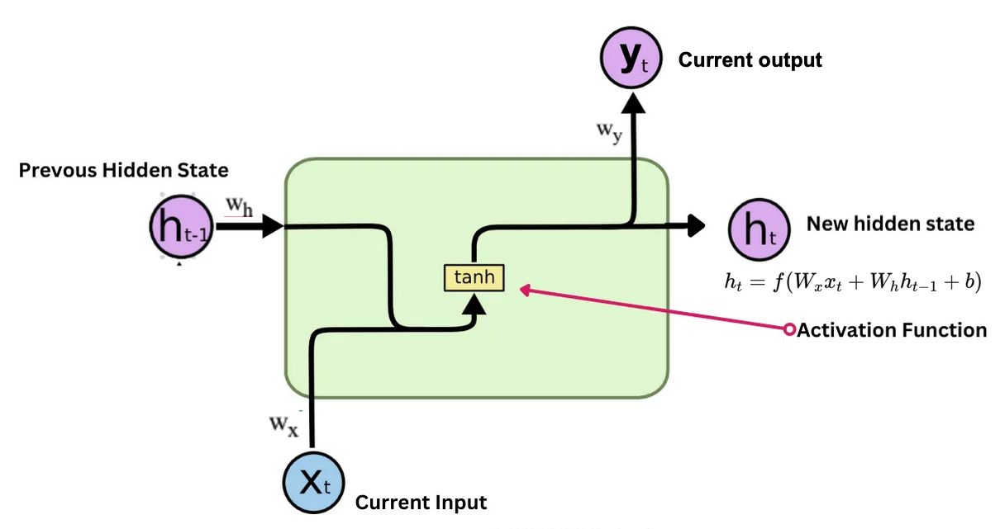

圖[[fig:rnn-cell-2]]代表的是一個時間點\(t\)的RNN神經元狀態，在這個時間點下，他是如何讀入資料？又是如何處理資料並產生輸出的呢？我們可以透過以下步驟來理解:
1. 首先，這個神經元在時間點\(t\)會收到兩項資訊:
   - 來自外部的輸入\(x_{t}\)
   - 來自「上一個時間點(\(t-1\))的自己」所傳來的「隱藏狀態」$h_{t-1}$
2. 接下來我們來看一下這個神經元的第一項輸出\(h_t\)，上面的兩項輸入會經過各自的權重( $w_{x}$ 和 $w_{h}$ )進行加權處理，然後將加權後的結果相加，形成一個新的總和，我們暫且把這個和叫做\(z_{t}\)，其計算方式如下（為了簡化計算過程，此處省略了偏差項bias）:
   \[
   z_{t} = w_{x} \cdot x_{t} + w_{h} \cdot h_{t-1}
   \]
   可以看出，這個總和\(z_{t}\)同時包含了來自當前輸入\(x_{t}\)的資訊以及來自過去時間點的歷史資訊\(h_{t-1}\)。然後，這個總和\(z_{t}\)會經過一個非線性激活函數(例如ReLU、tanh等)進行處理，產生這個時間點的輸出\(h_{t}\)，其計算方式如下:
   \[
   h_{t} = \text{activation}(z_{t})
   \]
   也就是說，其實完整的計算過程可以寫成:
   \[
   h_{t} = \text{activation}(w_{x} \cdot x_{t} + w_{h} \cdot h_{t-1})
   \]
   這個\(h_t\)就是要傳遞給下一個時間點的「隱藏狀態」。
3. 接下來我們來看這個神經元的第二項輸出\(y_t\)，它是將剛剛計算出來的\(h_{t}\)經過另一組權重$w_{y}$進行加權處理後產生的，而最終在輸出前通常也會經過一個激活函數(例如softmax、sigmoid等)來產生最終的輸出結果，其計算方式如下(同樣省略了偏差項bias):
   \[
   y_{t} = w_{y} \cdot h_{t}
   \]
   這個\(y_t\)就是這個時間點的最終輸出結果，可以用來進行後續的任務(例如分類、回歸等)。
   其實，不是每個時間點都會有這個輸出\(y_t\)，有些RNN模型只在序列的最後一個時間點才會產生輸出，而有些則會在每個時間點都產生輸出，這取決於具體的應用場景和模型設計。
   例如，在做機器翻譯的任務中，RNN通常會在每個時間點都產生一個輸出，對應到翻譯後的每個單詞；而在做股價預測的任務中，RNN可能只在最後一個時間點產生一個輸出，對應到未來某一天的股價預測。
8. 這樣所提到的計算過程會一直重複下去，每個時間點的神經元都會按照上述步驟來處理輸入資料並產生輸出結果，直到整個序列資料被完全處理完畢為止。

* 作業：RNN 大挑戰
** 作業一：氣溫預測器 — 你比氣象局準嗎？
在教材中我們用 $sin(x)+cos(0.5x)$ 來訓練 RNN，但那畢竟是假資料。現在請你用 RNN 來預測「真正的」時間序列 — 一整年的每日氣溫變化！

以下範例程式會生成一年份的模擬氣溫資料（有季節變化 + 隨機天氣擾動），並用 SimpleRNN 來預測氣溫：

#+begin_src python -r -n :results output :exports both :session hw1
import numpy as np
import matplotlib.pyplot as plt
from sklearn.preprocessing import MinMaxScaler
import tensorflow as tf
from tensorflow import keras

np.random.seed(42)
tf.random.set_seed(42)

# 生成一年份模擬氣溫（365天）
days = np.arange(365)
# 基礎溫度：夏天熱、冬天冷（用 cos 模擬季節）
base_temp = 25 - 10 * np.cos(2 * np.pi * days / 365)
# 加入每日隨機擾動
noise = np.random.normal(0, 2, size=365)
temperature = base_temp + noise

# 標準化
scaler = MinMaxScaler()
temp_scaled = scaler.fit_transform(temperature.reshape(-1, 1))

# 建立序列（用過去 14 天預測明天）
SEQ_LEN = 14
X, y = [], []
for i in range(len(temp_scaled) - SEQ_LEN):
    X.append(temp_scaled[i:i+SEQ_LEN])
    y.append(temp_scaled[i+SEQ_LEN])
X, y = np.array(X), np.array(y)

# 分訓練/測試集（前 80% 訓練，後 20% 測試）
split = int(len(X) * 0.8)
X_train, y_train = X[:split], y[:split]
X_test, y_test = X[split:], y[split:]

# 建立 SimpleRNN 模型
model = keras.models.Sequential([
    keras.layers.Input(shape=(SEQ_LEN, 1)),
    keras.layers.SimpleRNN(1),
])
model.compile(loss='mse', optimizer='adam', metrics=['mae'])
model.fit(X_train, y_train, epochs=20, verbose=0)

# 預測並還原
pred = model.predict(X_test, verbose=0)
pred_inv = scaler.inverse_transform(pred)
actual_inv = scaler.inverse_transform(y_test)

# 畫圖
plt.figure(figsize=(10, 4))
plt.plot(actual_inv, label='Actual', alpha=0.7)
plt.plot(pred_inv, label='Predicted', alpha=0.9)
plt.title('Temperature Prediction (SimpleRNN, 1 neuron)')
plt.xlabel('Day')
plt.ylabel('Temperature (°C)')
plt.legend()
plt.grid(True)
plt.tight_layout()
plt.savefig('images/hw_rnn_temp.png', dpi=150)

from sklearn.metrics import mean_absolute_error
mae = mean_absolute_error(actual_inv, pred_inv)
print(f"MAE: {mae:.2f} °C")
#+end_src

*** 你的任務
上面的模型只用了 *1 個神經元* ，預測效果當然不太好。請修改模型架構，讓 MAE（平均絕對誤差）降到 *3.0°C 以下* 。

提示：
- 可以增加 SimpleRNN 的神經元數量
- 可以堆疊多層 SimpleRNN（記得第一層要加 =return_sequences=True= ）
- 可以加 Dense 層
- 可以調整 epochs 數量

*** 預期輸出
#+begin_example
MAE: 2.xx °C （只要低於 3.0 就算過關）
#+end_example

*** 參考解答 :noexport:
#+begin_src python -r -n :results output :exports both :session hw1_ans
import numpy as np
import matplotlib.pyplot as plt
from sklearn.preprocessing import MinMaxScaler
import tensorflow as tf
from tensorflow import keras

np.random.seed(42)
tf.random.set_seed(42)

days = np.arange(365)
base_temp = 25 - 10 * np.cos(2 * np.pi * days / 365)
noise = np.random.normal(0, 2, size=365)
temperature = base_temp + noise

scaler = MinMaxScaler()
temp_scaled = scaler.fit_transform(temperature.reshape(-1, 1))

SEQ_LEN = 14
X, y = [], []
for i in range(len(temp_scaled) - SEQ_LEN):
    X.append(temp_scaled[i:i+SEQ_LEN])
    y.append(temp_scaled[i+SEQ_LEN])
X, y = np.array(X), np.array(y)

split = int(len(X) * 0.8)
X_train, y_train = X[:split], y[:split]
X_test, y_test = X[split:], y[split:]

model = keras.models.Sequential([
    keras.layers.Input(shape=(SEQ_LEN, 1)),
    keras.layers.SimpleRNN(16, return_sequences=True),
    keras.layers.SimpleRNN(8),
    keras.layers.Dense(1)
])
model.compile(loss='mse', optimizer='adam', metrics=['mae'])
model.fit(X_train, y_train, epochs=50, verbose=0)

pred = model.predict(X_test, verbose=0)
pred_inv = scaler.inverse_transform(pred)
actual_inv = scaler.inverse_transform(y_test)

from sklearn.metrics import mean_absolute_error
mae = mean_absolute_error(actual_inv, pred_inv)
print(f"MAE: {mae:.2f} °C")
#+end_src

** 作業二：手算 RNN — 當人體 GPU
在教材中，我們用 $w_x=1.8$, $w_h=-0.5$, $w_y=1.1$ 這組權重，從「昨天平盤(0.5)」和「今天上漲(1)」預測出明天的股價。

現在換一組全新的設定：
- 權重：$w_x = 2.0$, $w_h = 0.3$, $w_y = 0.8$
- 激活函數：ReLU
- 初始隱藏狀態：$h_{t-1} = 0$
- 三天的股價變化序列：$x_1 = 0.2$（下跌）, $x_2 = 0.6$（平盤）, $x_3 = 0.9$（上漲）

*** 你的任務
請用紙筆（或計算機）手算以下內容，寫出每一步的計算過程：
1. 依序輸入 $x_1, x_2, x_3$，計算每個時間點的隱藏狀態 $h_t$ 和輸出 $y_t$
2. 根據最終的 $y_3$ 值，判斷模型預測「後天」的股價是上漲、平盤還是下跌
   - 上漲：$y_t \geq 0.75$
   - 平盤：$0.25 < y_t < 0.75$
   - 下跌：$y_t \leq 0.25$

*** 預期輸出
#+begin_example
=== 時間點 1 (x₁ = 0.2) ===
z₁ = w_x × x₁ + w_h × h₀ = ???
h₁ = ReLU(z₁) = ???
y₁ = w_y × h₁ = ???

=== 時間點 2 (x₂ = 0.6) ===
z₂ = w_x × x₂ + w_h × h₁ = ???
h₂ = ReLU(z₂) = ???
y₂ = w_y × h₂ = ???

=== 時間點 3 (x₃ = 0.9) ===
z₃ = w_x × x₃ + w_h × h₂ = ???
h₃ = ReLU(z₃) = ???
y₃ = w_y × h₃ = ???

預測結果：??? (上漲/平盤/下跌)
#+end_example

*** 參考解答 :noexport:
#+begin_example
=== 時間點 1 (x₁ = 0.2) ===
z₁ = 2.0 × 0.2 + 0.3 × 0 = 0.4
h₁ = ReLU(0.4) = 0.4
y₁ = 0.8 × 0.4 = 0.32

=== 時間點 2 (x₂ = 0.6) ===
z₂ = 2.0 × 0.6 + 0.3 × 0.4 = 1.32
h₂ = ReLU(1.32) = 1.32
y₂ = 0.8 × 1.32 = 1.056

=== 時間點 3 (x₃ = 0.9) ===
z₃ = 2.0 × 0.9 + 0.3 × 1.32 = 2.196
h₃ = ReLU(2.196) = 2.196
y₃ = 0.8 × 2.196 = 1.7568

預測結果：上漲（y₃ = 1.7568 ≥ 0.75）
#+end_example

** 作業三：序列長度大對決 — 記憶力比拚
RNN 號稱有「記憶力」，但記憶力到底有多強？讓我們來實驗看看：用不同的序列長度（也就是「看幾天前的資料來預測」）訓練模型，看看哪個長度的效果最好。

以下範例用 =SEQ_LEN=5= 來訓練：

#+begin_src python -r -n :results output :exports both :session hw3
import numpy as np
import matplotlib.pyplot as plt
from sklearn.preprocessing import MinMaxScaler
from sklearn.metrics import mean_absolute_error
import tensorflow as tf
from tensorflow import keras

np.random.seed(42)
tf.random.set_seed(42)

# 生成資料
x_vals = np.linspace(0, 300, 3000)
data = (np.sin(x_vals) + np.cos(x_vals * 0.5)).reshape(-1, 1)
noise = np.random.normal(0, 0.1, size=data.shape)
data_noisy = data + noise

scaler = MinMaxScaler()
scaled = scaler.fit_transform(data_noisy)

def train_and_evaluate(seq_len):
    """用指定的序列長度訓練 RNN 並回傳 MAE"""
    X, y = [], []
    for i in range(len(scaled) - seq_len):
        X.append(scaled[i:i+seq_len])
        y.append(scaled[i+seq_len])
    X, y = np.array(X), np.array(y)

    split = int(len(X) * 0.8)
    X_train, y_train = X[:split], y[:split]
    X_test, y_test = X[split:], y[split:]

    model = keras.models.Sequential([
        keras.layers.Input(shape=(seq_len, 1)),
        keras.layers.SimpleRNN(4),
        keras.layers.Dense(1)
    ])
    model.compile(loss='mse', optimizer='adam')
    model.fit(X_train, y_train, epochs=20, verbose=0)

    pred = scaler.inverse_transform(model.predict(X_test, verbose=0))
    actual = scaler.inverse_transform(y_test)
    return mean_absolute_error(actual, pred)

# 只測試 SEQ_LEN = 5
mae = train_and_evaluate(5)
print(f"SEQ_LEN=5, MAE={mae:.4f}")
#+end_src

*** 你的任務
請修改上面的程式，測試以下四種序列長度：=SEQ_LEN = 5, 10, 20, 50= ，並比較它們的 MAE。

提示：用迴圈跑四次 =train_and_evaluate()= 就好了。

*** 預期輸出
#+begin_example
SEQ_LEN= 5, MAE=0.xxxx
SEQ_LEN=10, MAE=0.xxxx
SEQ_LEN=20, MAE=0.xxxx
SEQ_LEN=50, MAE=0.xxxx

最佳序列長度：xx
#+end_example
（通常 SEQ_LEN=20 左右效果最好，太短記不住、太長反而學不好）

*** 參考解答 :noexport:
#+begin_src python -r -n :results output :exports both :session hw3_ans
import numpy as np
import matplotlib.pyplot as plt
from sklearn.preprocessing import MinMaxScaler
from sklearn.metrics import mean_absolute_error
import tensorflow as tf
from tensorflow import keras

np.random.seed(42)
tf.random.set_seed(42)

x_vals = np.linspace(0, 300, 3000)
data = (np.sin(x_vals) + np.cos(x_vals * 0.5)).reshape(-1, 1)
noise = np.random.normal(0, 0.1, size=data.shape)
data_noisy = data + noise

scaler = MinMaxScaler()
scaled = scaler.fit_transform(data_noisy)

def train_and_evaluate(seq_len):
    X, y = [], []
    for i in range(len(scaled) - seq_len):
        X.append(scaled[i:i+seq_len])
        y.append(scaled[i+seq_len])
    X, y = np.array(X), np.array(y)

    split = int(len(X) * 0.8)
    X_train, y_train = X[:split], y[:split]
    X_test, y_test = X[split:], y[split:]

    model = keras.models.Sequential([
        keras.layers.Input(shape=(seq_len, 1)),
        keras.layers.SimpleRNN(4),
        keras.layers.Dense(1)
    ])
    model.compile(loss='mse', optimizer='adam')
    model.fit(X_train, y_train, epochs=20, verbose=0)

    pred = scaler.inverse_transform(model.predict(X_test, verbose=0))
    actual = scaler.inverse_transform(y_test)
    return mean_absolute_error(actual, pred)

results = {}
for seq_len in [5, 10, 20, 50]:
    mae = train_and_evaluate(seq_len)
    results[seq_len] = mae
    print(f"SEQ_LEN={seq_len:2d}, MAE={mae:.4f}")

best = min(results, key=results.get)
print(f"\n最佳序列長度：{best}")
#+end_src

* RNN學習資源
- [[https://www.youtube.com/watch?v=6AW80qmaAOk][10分鐘了解RNN的基本概念 ]]
- [[https://www.youtube.com/watch?v=zXLAeat_b7g][從頭寫出 RNN (PyTorch) 完整介紹 [手寫數字辨識]]]
- [[https://www.youtube.com/watch?v=AsNTP8Kwu80][解說的很清楚的RNN教學影片]]
- [[https://www.youtube.com/watch?v=YCzL96nL7j0][解說的很詳細的LSTM教學影片]]
- [[https://www.youtube.com/watch?v=ubDtr6dh0c8][我的第一支快速利用TensorFlow 2.0利用RNN進行文本分類(第一部分) ]]
- [[https://www.youtube.com/watch?v=SyYIuVJ9BhQ][我的第一支快速利用TensorFlow 2.0利用RNN進行文本分類(第二部分)]]

* 待用 :noexport:
** tmp
讓我們先來認識一下最簡單的RNN模型(如圖[[fig:SimpleRNN-0]])：

#+begin_src dot :file ./images/simple_RNN-0.png :exports none :results none
digraph simple_rnn {
  rankdir=LR;
  node [shape=circle, width=0.8, fontsize=14, style=filled, fontname="DejaVu Sans"];
  input [label=輸入, fillcolor="orange"];
  A [label=A, fillcolor="lightgreen"];
  output [label=輸出, fillcolor="orange"];

  input ->  A [label=<<B><I>W</I></B>1 >];
  A ->      A [label=<<B><I>W</I></B>2 >, dir="back", arrowsize="0.8", color="red"];
  A -> output [label=<<B><I>W</I></B>3 >, color="blue"];
}
#+end_src
#+CAPTION: 一個簡單的RNN模型
#+LABEL:fig:SimpleRNN-0
#+name: fig:SimpleRNN-0
#+ATTR_LATEX: :width 300
#+ATTR_ORG: :width 300
#+ATTR_HTML: :width 300

圖[[fig:SimpleRNN-0]]告訴我們，RNN模型有三個主要部分：
1. **輸入層** ：這是我們將股價漲跌情況輸入到模型中的地方。
2. **隱藏層** ：這是模型的核心部分，通常用一個或多個神經元來處理輸入資料。在這個例子中，我們用一個神經元A來表示。
3. **輸出層** ：這是模型的結果輸出部分，通常用來預測股價漲跌情況。

圖[[fig:SimpleRNN-0]]中的神經元A每次輸出的結果都會影響到下一次的輸入(參考圖中的紅色箭頭h)。這個特性使得RNN能夠記住之前的資訊，再把這些資訊加入當前的計算中。這裡的 $W_1, W_2, W_3$ 是權重，用來調整輸入、隱藏層與輸出層之間的連接強度，這些權重會在訓練過程中不斷調整，以便模型能更準確地預測股價漲跌情況。

圖[[fig:SimpleRNN-0]]只是簡化過的架構，它大致的內部結構如圖[[fig:SimpleRNN-1]]所示。也就是除了輸入、輸出外，還包含了激活函數(activation function)以及偏差項(bias)：

#+begin_src dot :file ./images/simple_RNN-1.png :exports none :results none
digraph simple_rnn {
  rankdir=LR;
  node [shape=circle, width=0.8, fontsize=14, style=filled, fontname="DejaVu Sans"];
  input [label=<輸入 <B><I>x</I>t</B>>, fillcolor="orange"];
  ReLU [label=tanh, fillcolor="lightgreen"];
  output [label=輸出, fillcolor="orange"];
  node [shape=square, width=0.3, fontsize=10, style=filled, fontname="DejaVu Sans"];
  b1 [label=<<I>b</I>1>, fillcolor="lightblue"];
  b2 [label=<<B><I>b</I>2</B>>, fillcolor="lightblue"];

  input -> b1 [label=<<B><I>W</I></B>1 >];
  b1 -> ReLU [minlen=1];
  ReLU -> ReLU [label=<<B><I>W</I></B>2 >, dir="back", arrowsize="0.8", color="red"];
  ReLU -> b2   [label=<<B><I>W</I></B>3 >, color="blue"];
  b2 -> output [color="blue"];
}
#+end_src
#+CAPTION: 一個簡單的RNN模型
#+LABEL:fig:SimpleRNN-1
#+name: fig:SimpleRNN-1
#+ATTR_LATEX: :width 400
#+ATTR_ORG: :width 400
#+ATTR_HTML: :width 500
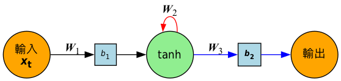

神經元A實際進行了以下運算：
$$\boldsymbol{h_t}​=f(\boldsymbol{W_1x_t}​+\boldsymbol{W_2​h_{t−1}}​+b_1)$$
其中：
- $\boldsymbol{h_t}$ ：神經元A在時間點 $t$ 的輸出（也就是對「今天」的股價漲跌的 **預測結果** ）
- $\boldsymbol{x_t}$ ：在時間點 $t$ 的輸入（也就是「今天」的外部訊號，例如今天的股價 **實際漲跌情況** ）
- $\boldsymbol{h_{t-1}}$ ：在時間點 $t-1$ 的輸出（也就是「昨天」的狀態/股價漲跌情況）
- $\boldsymbol{W_1, W_2}$ ：權重（實際上是矩陣，這裡用簡化的一維符號），分別調整輸入與前一時刻狀態的影響力
- $b_1, b_2$ ：偏差項
- $f$ ：激活函數（activation function），RNN常用的激活函數為 **tanh** ，目的在於引入非線性特性，使模型能學習更複雜的模式。

RNN的激活函數也有人用Sigmoid，較少用ReLU，原因是：
- tanh： 輸出區間在 [-1, 1]，便於梯度傳遞（不會無限放大），有助於數值的穩定，但在長序列時仍可能面臨梯度消失問題。
- ReLU： 輸出區間在 [0, ∞)，計算效率高且能減少梯度消失問題，但可能導致「神經元死亡」（輸出恆為0），且不適合處理負值輸入。

為了簡化計算過程，讓大家能專注在RNN的運作原理，在接下來的示範中，我們會省略偏差項 $b_1$，也將啟動函數 $f$ 改為更簡單的ReLU，以便於理解。

** RNN的運作流程
如果我們將圖[[fig:SimpleRNN-6]]左側的RNN神經元放大來看(如圖[[fig:rnn-cell-2]])，會發現它其實包含了三組權重:
1. 來自外部輸入$x_{t}$ 的權重 $w_{x}$
2. 來自「上一個時間點的自己」(時間點 $t-1$ )所傳來的「隱藏狀態」$h_{t-1}$ 的權重 $w_{h}$
3. 輸出結果 $h_{t}$ 的權重 $w_{y}$
#+CAPTION: RNN神經元
#+LABEL:fig:rnn-cell-2
#+name: fig:rnn-cell-2
#+ATTR_LATEX: :width 200
#+ATTR_ORG: :width 300
#+ATTR_HTML: :width 500

圖[[fig:rnn-cell-2]]代表的是一個時間點\(t\)的RNN神經元狀態，在這個時間點下，他是如何讀入資料？又是如何處理資料並產生輸出的呢？我們可以透過以下步驟來理解:
1. 首先，這個神經元在時間點\(t\)會收到兩項資訊:
   - 來自外部的輸入\(x_{t}\)
   - 來自「上一個時間點(\(t-1\))的自己」所傳來的「隱藏狀態」$h_{t-1}$
2. 接下來我們來看一下這個神經元的第一項輸出\(h_t\)，上面的兩項輸入會經過各自的權重( $w_{x}$ 和 $w_{h}$ )進行加權處理，然後將加權後的結果相加，形成一個新的總和，我們暫且把這個和叫做\(z_{t}\)，其計算方式如下（為了簡化計算過程，此處省略了偏差項bias）:
   \[
   z_{t} = w_{x} \cdot x_{t} + w_{h} \cdot h_{t-1}
   \]
   可以看出，這個總和\(z_{t}\)同時包含了來自當前輸入\(x_{t}\)的資訊以及來自過去時間點的歷史資訊\(h_{t-1}\)。然後，這個總和\(z_{t}\)會經過一個非線性激活函數(例如ReLU、tanh等)進行處理，產生這個時間點的輸出\(h_{t}\)，其計算方式如下:
   \[
   h_{t} = \text{activation}(z_{t})
   \]
   也就是說，其實完整的計算過程可以寫成:
   \[
   h_{t} = \text{activation}(w_{x} \cdot x_{t} + w_{h} \cdot h_{t-1})
   \]
   這個\(h_t\)就是要傳遞給下一個時間點的「隱藏狀態」。
3. 接下來我們來看這個神經元的第二項輸出\(y_t\)，它是將剛剛計算出來的\(h_{t}\)經過另一組權重$w_{y}$進行加權處理後產生的，而最終在輸出前通常也會經過一個激活函數(例如softmax、sigmoid等)來產生最終的輸出結果，其計算方式如下(同樣省略了偏差項bias):
   \[
   y_{t} = w_{y} \cdot h_{t}
   \]
   這個\(y_t\)就是這個時間點的最終輸出結果，可以用來進行後續的任務(例如分類、回歸等)。
   其實，不是每個時間點都會有這個輸出\(y_t\)，有些RNN模型只在序列的最後一個時間點才會產生輸出，而有些則會在每個時間點都產生輸出，這取決於具體的應用場景和模型設計。
   例如，在做機器翻譯的任務中，RNN通常會在每個時間點都產生一個輸出，對應到翻譯後的每個單詞；而在做股價預測的任務中，RNN可能只在最後一個時間點產生一個輸出，對應到未來某一天的股價預測。
8. 這樣所提到的計算過程會一直重複下去，每個時間點的神經元都會按照上述步驟來處理輸入資料並產生輸出結果，直到整個序列資料被完全處理完畢為止。

** RNN的運作方式
圖[[fig:SimpleRNN-1]]模型的運作方式就像一個簡單的線性迴歸模型，只不過它有一個循環連接，使得它能夠記住之前的輸入資訊。這樣的設計使得RNN能夠處理序列資料，並在每次迭代中更新自己的狀態。

是不是有點抽象？其實這種「把上次的輸出當成下一次的輸入」的概念很簡單，只要你有點程式設計的概念大概都不陌生，就是「遞迴」的概念。讓我們來複習一下這個「計算n!」的程式：
#+begin_src python -r -n :results output :exports both
def factorial(n):
    """
    階乘遞迴範例：
    n! = n × (n-1) × (n-2) × ... × 1
    """
    if n <= 1:
        return 1
    # 本次答案 = 當下 n * 上一步的答案
    return n * factorial(n-1)

# 範例
print(factorial(3))  # 輸出 6
#+end_src

#+RESULTS:
: 6
在上述的遞迴程式中，每次在計算 $n!$ 時，都會先計算 $(n-1)!$，然後將結果乘以 $n$。這樣的遞迴過程就像 RNN 一樣，每次都會將上一次的輸出作為下一次的輸入。RNN 與遞迴的比較如表[[tab:rnn-recursion]] 所示，$n!$ 的每一步都要先算出前一步的結果，RNN 也一樣，每個時刻的狀態都要用到上一次的狀態。兩者本質上都是「遞迴」的概念。

#+CAPTION: 類比對照表
#+NAME: tab:rnn-recursion
| 遞迴型態   | 當下輸出 | 上一步遞迴 | 計算方式                               |
|------------+----------+------------+----------------------------------------|
| 階乘       | $n!$     | $(n-1)!$   | $n! = n \times (n-1)!$                 |
| RNN hidden | $\boldsymbol{h_t}$ | $\boldsymbol{h_{t-1}}$ | $\boldsymbol{h_t} = f(\boldsymbol{w}_1 \boldsymbol{x_t} + \boldsymbol{w}_2 \boldsymbol{h_{t-1}} + \boldsymbol{b}_1)$ |

** 一個預測股價的RNN模型-2
現在讓我們再回頭來看一下我們的股價預測模型。預測明天的股價漲跌情況的流程如下：
1. 首先要知道 **昨天** 的股價漲跌情況，這樣我們就可以將昨天的股價漲跌情況輸入到模型中，然後模型會根據這個輸入和它的內部權重($w_1, w_2, w_3$)來計算出一個輸出值，這個輸出值就是 **今天** 股價漲跌情況的預測結果。
2. 接下來輸入 **今天** 的股價 **實際漲跌(步驟1得到的是模型預測出來的)** 情況，模型會將這個值與步驟1算出的昨天的預測結果一起計算，然後產生 **明天** 的股價漲跌預測結果。

假設昨天和今天的股價都維持平盤，則我們可以先輸入昨天的股價漲跌情況(0.5)到模型中：

#+begin_src dot :file ./images/simple_RNN-2.png :exports none :results none
digraph simple_rnn {
  rankdir=LR;
  node [shape=circle, width=0.8, fontsize=14, style=filled, fontname="DejaVu Sans"];
  input [label=<昨天 0.5>, fillcolor="orange"];

  ReLU [label=<ReLU>, image="images/relu.png", shape=box, width=0.8, height=0.8, fixedsize=true, fillcolor="lightgreen"];
  output [label=今天, fillcolor="orange"];
  node [shape=square, width=0.3, fontsize=10, style=filled, fontname="DejaVu Sans"];
  b1 [label=<<I>b</I>1 0>, fillcolor="lightblue"];
  b2 [label=<<I>b</I>2>, fillcolor="lightblue"];

  input ->  b1 [label=<<I>w</I>1=1.8>];
  b1 -> ReLU [minlen=1];
  ReLU -> ReLU [label=<<I>w</I>2=-0.5>, dir="back", arrowsize="1", minlen=4, color="red"];
  ReLU ->   b2 [label=<<I>w</I>3=1.1>, color="blue"];
  b2 -> output [color="blue"];

}
#+end_src

#+CAPTION: 輸入昨天股價漲跌情況到模型中
#+LABEL:fig:SimpleRNN-2
#+name: fig:SimpleRNN-2
#+ATTR_LATEX: :width 400
#+ATTR_ORG: :width 400
#+ATTR_HTML: :width 500
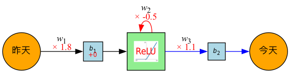

在輸入昨天股價漲跌情況後，模型會將這個值(0.5)乘上權重 $w_1$（1.8），再加上偏差 $b_1$（+0）。這樣可以得到：
$$z=0.5×1.8+0=0.9$$

#+begin_src dot :file ./images/simple_RNN-21.png :exports none :results none
digraph simple_rnn {
  rankdir=LR;
  node [shape=circle, width=0.8, fontsize=14, style=filled, fontname="DejaVu Sans"];
  input [label=<昨天 0.5>, fillcolor="orange"];

  ReLU [label=<ReLU>, image="images/relu.png", shape=box, width=0.8, height=0.8, fixedsize=true, fillcolor="lightgreen"];
  output [label=今天, fillcolor="orange"];
  node [shape=square, width=0.3, fontsize=10, style=filled, fontname="DejaVu Sans"];
  b1 [label=<<I>b</I>1 0>, fillcolor="lightblue"];
  b2 [label=<<I>b</I>2>, fillcolor="lightblue"];

  input ->  b1 [label=<<I>w</I>1=1.8>];
  b1 -> ReLU [label=<0.9>, minlen=1];
  ReLU -> ReLU [label=<<I>w</I>2=-0.5>, dir="back", arrowsize="1", minlen=4, color="red"];
  ReLU ->   b2 [label=<<I>w</I>3=1.1>, color="blue"];
  b2 -> output [color="blue"];

}
#+end_src

#+CAPTION: 與權重\(W_1\)計算過後
#+LABEL:fig:SimpleRNN-21
#+name: fig:SimpleRNN-21
#+ATTR_LATEX: :width 400
#+ATTR_ORG: :width 400
#+ATTR_HTML: :width 500
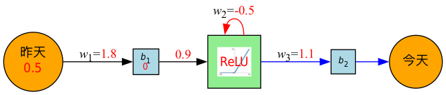

接著，這個\(z\)值會通過 ReLU 函數 進行處理。由於 ReLU 的定義是將輸入值小於 0 的部分設為 0，否則保留原值，因此 $0.9$ 通過 ReLU 後仍然是 $0.9$。

接下來，這個值（$0.9$）會：
1. 一方面進入自循環路徑(圖[[fig:SimpleRNN-2]]中的紅色箭頭)與 $w_2$ 進行運算，成為下一個時間點的神經元隱藏狀態 $h_t$，計算方式為 $h_t=0.9×(-0.5)=-0.45$ 。這個部份應該很容易理解，因為我們在預測今天的股價時，會參考昨天的股價漲跌情況。
1. 另一方面，照理來說這個值還會再乘上權重 $w_3$，加上偏差 $b_2$，產生最後的輸出 $y_t=h_t×w_3+b_2$ ，即圖[[fig:SimpleRNN-3]]中的藍色箭頭。如果 $b_2=0$，那麼 $y_t = 0.99$，這個值（$y_t=0.9\times1.1+0=0.99$）就是模型對今天股價漲跌情況的預測結果。

#+begin_src dot :file ./images/simple_RNN-3.png :exports none :results none
digraph simple_rnn {
  rankdir=LR;
  node [shape=circle, width=0.8, fontsize=14, style=filled, fontname="DejaVu Sans"];
  input [label=<昨天 (0.5)>, fillcolor="orange"];
  ReLU [label=<ht=0.9>, image="images/relu.png", shape=box, width=0.8, height=0.8, fixedsize=true, fillcolor="lightgreen"];
  output [label=<今天 (0.99)>, fillcolor="orange"];
  node [shape=square, width=0.3, fontsize=10, style=filled, fontname="DejaVu Sans"];
  b1 [label=<<I>b</I>1 0>, fillcolor="lightblue"];
  b2 [label=<<I>b</I>2 0>, fillcolor="lightblue"];

  input ->  b1 [label=<<I>w</I>1=1.8>];
  b1 -> ReLU [label=<0.9>, minlen=1];
  ReLU -> ReLU [label=<<I>w</I>2=-0.5>, dir="back", arrowsize="1", minlen=4, color="red"];
  ReLU ->   b2 [label=<<I>w</I>3=1.1>, color="blue"];
  b2 -> output [label=<<I>y</I>t=0.99>, color="blue"];
}
#+end_src
#+CAPTION: 輸入昨天股價漲跌情況後得到今天股價漲跌預測
#+LABEL:fig:SimpleRNN-3
#+name: fig:SimpleRNN-3
#+ATTR_LATEX: :width 200
#+ATTR_ORG: :width 400
#+ATTR_HTML: :width 500
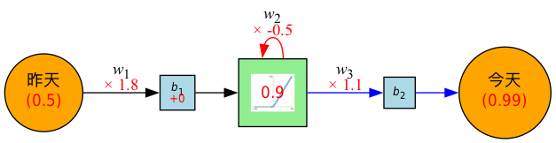

但是，由於這是個股價預測模型，所以不像之前的例子會在每個時間點都產生輸出(也就是每個時間點的 $y_t$)。況且，其實我們已經知道今天的股價漲跌情況是平盤(0.5)，所以我們並不需要這個輸出來預測今天的股價漲跌情況。

為了預測明天的股價，我們要再重跑一次剛才的運算，輸入兩項資訊給模型：
1. 有關於昨天的股價漲跌記憶
2. 今天的實際漲跌

**有關於昨天的股價漲跌記憶** ，也就是圖[[fig:SimpleRNN-3]]中的\(h_t\)(值為0,9)，在RNN模型中，它有個特殊名詞叫「隱藏狀態(hidden status)」，但是那已經是上一回合的事了，來到這一回合，它就變成是 **上一個時間點的隱藏狀態** ，記做 $h_{t-1}$(值為0.9)。

那麼，這回合的隱藏狀態要怎麼計算呢？我們還得先知道 **今天的實際漲跌** 情況，假設今天的股價還是平盤(\(x_t=0.5\))，那麼我們就可以下列公式來算出 **今天的隱藏狀態**  \(h_t\)：
$$h_t=ReLU(x_t×w_1+h_{t-1}×w_2+b_1)=ReLU(0.5×1.8+0.9×(−0.5)+0)=ReLU(0.45)=0.45$$

接著，我們再用這個 **今天的隱藏狀態** $h_t$ 來算出 **明天的最終預測結果** ，也就是 \(y_t\)：
$$y_t=h_t×w_3+b_2=0.45×1.1+0=0.495$$

所以模型預測「明天」的股價漲跌情況為 $0.495$。

整個預測過程分為以下兩步，對應模型如圖[[fig:SimpleRNN-4]]所示：
#+begin_src dot :file ./images/simple_RNN-4.png :exports none :results none
digraph simple_rnn {
  rankdir=LR;
  node [shape=circle, width=0.8, fontsize=14, style=filled, fontname="DejaVu Sans"];
  input [label=<今天 (0.5)>, fillcolor="orange"];
  ReLU [label=<<I>h</I>t=0.45>, image="images/relu.png", shape=box, width=0.8, height=0.8, fixedsize=true, fillcolor="lightgreen"];
  output [label=<明天 (0.495)>, fillcolor="orange"];
  node [shape=square, width=0.3, fontsize=10, style=filled, fontname="DejaVu Sans"];
  b1 [label=<<I>b</I>1 0>, fillcolor="lightblue"];
  b2 [label=<<I>b</I>2 0>, fillcolor="lightblue"];

input -> b1 [label=<<I>w</I>1=1.8>];
  b1 -> ReLU [label=<0.9>, minlen=1];
  ReLU -> ReLU [label=<<I>w</I>2=-0.5>, dir="back", arrowsize="1", minlen=4];
  ReLU ->   b2 [label=<<I>w</I>3=1.1>];
  b2 -> output[label=<<I>y</I>t=0.495>];
}
#+end_src
#+CAPTION: 輸入今股價漲跌情況後得到明天股價漲跌預測
#+LABEL:fig:SimpleRNN-4
#+name: fig:SimpleRNN-4
#+ATTR_LATEX: :width 200
#+ATTR_ORG: :width 400
#+ATTR_HTML: :width 500
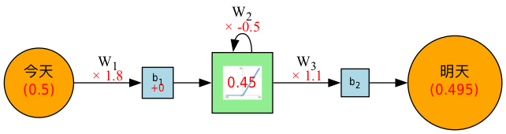

** 待用1
RNN 能夠處理「任意個數的輸入序列」，所以十分適合用在「語言塑模」或「語音辨識」。理論上，RNN 可以用來處理任何問題，因為它已被證明具有「圖靈完備性」(Turing-Complete)。以循環關係的函數表示 RNN 可將其視為 \(S_t=f(S_{t-1},X_t)\)，這裡的\(S_t\)表示第\(t\)步的狀態，它是由函數\(f\)對上一步(\(t-1\))的狀態(即\(S_{t-1}\))與這一步的輸入\(X_t\)所計算出來的結果，這裡的函數\(f\)可以是任何可微分的函數，如\(S_t=tang(S_{t-1}*W+X_t*U)\)。
正因為每個狀態都會與之前所有的計算有關，其所代表的重要含義為：隨著時間的推移，RNNs 可以說是有記憶力的，因為狀態 S 包含了之前所有步驟的資訊。

語言塑模的目標是計算「字的序列」的機率，這在「語音辨識」、OCR、「機器翻譯」、「拼字校正」上都非常重要。以「字」為基準的「語言模型」是由「字的序列」來定義機率分佈，給定一個長度為\(m\)的字序列，它會為整個字序列給定一個機率\(P(w_1,...,w_m)\)，其「聯合機率」(joint probability)可以由公式[[eqn:JointProbability]]中的連鎖規則(chain rule)計算出來：
#+NAME: eqn:JointProbability
\begin{equation}
P(w_1,...,w_m)=P(w_1)P(w_2|w_1)P(w3|w_2,w_1)...P(w_m|w_1,...,w_{m-1})
\end{equation}

這個聯合機率一般是基於一個「獨立性假設」(independence assumption)，即，第 i 個字只會相依於它之前的 n-1 個字，如果我們的模型是連續 n 個字的聯合機率，就稱為「n元」(n-gram)。例：
- 1-gram / unigram: "The", "quick", "brown" and "fox"
- 2-grams / bigram: "The quick", "quick brown" and "brown fox"
- 3-grams / trigram: "The quick brown" and "quick brown fox"
- 4-grams: "The quick brown fox"

現在，如果我們有一個巨大的語料庫(corpus of text)，我們就可以用一個特定的 n(通常為 2-4)搜尋所有「n元」在「語料庫」中出現的次數，進而在「給定前 n-1 個字的前提下」，估計出每個 n 元中最後一個字出現的機率。
** Bi-directional RNN:
另一個循環網路的變種 - 雙向循環網路(Bi-directional RNN)也是現階段自然語言處理和語音分析中的重要模型。開發雙向循環網路的原因是語言/語音的構成取決於上下文，即「現在」依託於「過去」和「未來」。單向的循環網路僅著重於從「過去」推出「現在」，而無法對「未來」的依賴性有效的建模。
** RNN: Recurrent Neural Network，Recursive neural networks。
雖然很多時候我們把這兩種網路都叫做RNN，但事實上這兩種網路的結構事實上是不同的。而我們常常把兩個網路放在一起的原因是：它們都可以處理有序列的問題，比如時間序列等。

舉個最簡單的例子，我們預測股票走勢用RNN就比普通的DNN效果要好，原因是股票走勢和時間相關，今天的價格和昨天、上周、上個月都有關係。而RNN有「記憶」能力，可以「模擬」資料間的依賴關係(Dependency)。
** RNN
RNN 是一種有「記憶力」的神經網路，其最為人所知的形式如下：
#+CAPTION: Caption
#+LABEL:fig:Labl
#+name: fig:Name
#+ATTR_LATEX: :width 500
#+ATTR_ORG: :width 300
#+ATTR_HTML: :width 500
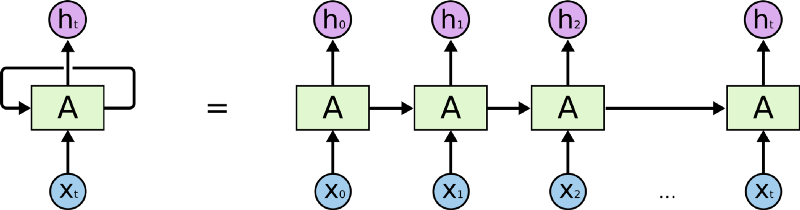
如同上圖等號左側所示，RNN 跟一般深度學習中常見的前饋神經網路（Feedforward Neural Network, 後簡稱 FFNN）最不一樣的地方在於它有一個遞迴連接(self-loop)。

要了解這個迴圈在 RNN 裏頭怎麼運作，現在讓我們想像有一個輸入序列 X（Input Sequence）其長相如下：
$$ X = [ x_0, x_1, x_2, \dots x_t ]$$
1. 不同於 FFNN，RNN 在第一個時間點 $t_0$ 並不會直接把整個序列 $x$ 讀入。反之，在第一個時間點 $t_0$，它只將該序列中的第一個元素 $x_0$ 讀入中間的細胞 A。細胞 A 則會針對 $x_0$ 做些處理以後，更新自己的「狀態」並輸出第一個結果 $h_0$ 。
2. 在下個時間點 $t_1$，RNN 如法炮製，讀入序列 $x$ 中的下一個元素 $x_1$，並利用剛剛處理完 $x_0$ 得到的細胞狀態，處理 $x_1$ 並更新自己的狀態（也被稱為記憶），接著輸出另個結果 $h_1$。
3. 剩下的 $x_t$ 都會被以同樣的方式處理。但不管輸入的序列 $x$ 有多長，RNN 的本體從頭到尾都是等號左邊的樣子：迴圈代表細胞 A 利用「上」一個時間點（比方說 $t_1$）儲存的狀態，來處理當下的輸入（比方說 $x_2$ ）。

但如果你將不同時間點（$t_0$, $t_1$ ...）的 RNN 以及它的輸入一起截圖，並把所有截圖從左到右一字排開的話，就會長得像等號右邊的形式。將 RNN 以右邊的形式表示的話，你可以很清楚地了解，當輸入序列越長，向右展開的 RNN 也就越長。（模型也就需要訓練更久時間，這也是為何我們在資料前處理時設定了序列的最長長度）

為了確保你 100 % 理解 RNN，讓我們假設剛剛的序列 X 實際上是一個內容如下的英文問句：
#+begin_src python -r -n :results output :exports both
X = [ What, time, is, it, ? ]
#+end_src
而且 RNN 已經處理完前兩個元素 What 和 time 了。

則接下來 RNN 會這樣處理剩下的句子：
#+CAPTION: Caption
#+LABEL:fig:Labl
#+name: fig:Name
#+ATTR_LATEX: :width 300
#+ATTR_ORG: :width 300
#+ATTR_HTML: :width 500

就像你現在閱讀這段話一樣，你是由左到右逐字在大腦裡處理我現在寫的文字，同時不斷地更新你腦中的記憶狀態。

每當下個詞彙映入眼中，你腦中的處理都會跟以下兩者相關：
- 前面所有已讀的詞彙
- 目前腦中的記憶狀態

當然，實際人腦的閱讀機制更為複雜，但RNN的運作原理大致上就是這樣。RNN 會將每個時間點的輸入（$x_t$）和前一個時間點的狀態（$h_{t-1}$）結合起來，然後經過一個非線性函數（通常是 tanh 或 ReLU）來更新當前的狀態（$h_t$）。這樣的設計使得 RNN 能夠捕捉到序列中長期依賴的關係。

* 這裡只是用來測試org-mode中的圖片顯示功能 :noexport:
** 原圖
#+CAPTION: ReLU 函數的小icon，用來測試 org-mode 中圖片顯示功能
#+LABEL:fig:Labl
#+name: fig:Name
#+ATTR_LATEX: :width 20
#+ATTR_ORG: :width 20
#+ATTR_HTML: :width 20
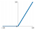
** plantuml
#+BEGIN_SRC plantuml :file neural_network_with_img.png
@startuml
skinparam linetype polyline
left to right direction
skinparam defaultTextAlignment center
skinparam RectangleBorderThickness 0

rectangle "Input Layer" {
    circle "x₁" as x1 #dodgerblue
    circle "x₂" as x2 #dodgerblue
}

rectangle "Hidden Layer" {
    circle "h₁" as h1 #tomato
    circle "h₂" as h2 #tomato
}

rectangle "Output Layer" {
    circle "y" as y #seagreen
}

x1 --> h1 : "w₁₁"
x1 --> h2 : "w₁₂"
x2 --> h1 : "w₂₁"
x2 --> h2 : "w₂₂"
h1 --> y : "v₁"
h2 --> y : "v₂"
@enduml
#+END_SRC

#+RESULTS:
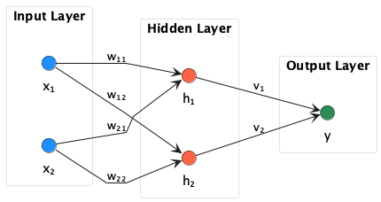
** digraph
#+begin_src dot :file ./images/three_layer_net.png :exports results
digraph simple_rnn {
  rankdir=LR;
  node [shape=circle, width=0.8, fontsize=20, style=filled, fontname="DejaVu Sans"];
  input [label=輸入, fillcolor="orange"];
  output [label=輸出, fillcolor="orange"];
  ReLU [label=ReLU, fillcolor="lightgreen"];

  input -> ReLU [label=<W1 (×1.8)>];
  ReLU -> output [label=<W3 (×1.1)>];
  ReLU -> ReLU [label=<W2 (×0.5)>, dir="back", arrowsize="1", minlen=12];

}
#+end_src
#+RESULTS:
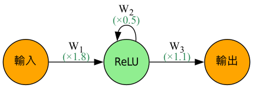

#+begin_src shell -r -n :results output :exports both

#+end_src

#+RESULTS:
: Collecting graphviz
:   Downloading graphviz-0.21-py3-none-any.whl.metadata (12 kB)
: Downloading graphviz-0.21-py3-none-any.whl (47 kB)
: Installing collected packages: graphviz
: Successfully installed graphviz-0.21

#+begin_src python -r -n :results output :exports both
from graphviz import Digraph

font_choice = 'DejaVu Sans'

dot = Digraph(format='png')
dot.attr('node', fontname=font_choice)

dot.attr(rankdir='LR', nodesep='0.8')
dot.attr('node', shape='circle', width='0.8', fontsize='14', style='filled', fillcolor='orange')

# nodes
dot.node('x', 'x', fillcolor='orange')
dot.node('h', 'h', fillcolor='lightgreen')
dot.node('y', 'y', fillcolor='deepskyblue')

# edge: input to hidden
dot.edge('x', 'h', label='W')
# edge: hidden to output
dot.edge('h', 'y', label='Wy')
# edge: hidden state recurrent (self-loop)
dot.edge('h', 'h', label='W', dir='both', arrowtail='loop', arrowsize='0.8')

dot.render('simple_rnn', view=True)
#+end_src

#+RESULTS:

* Footnotes

[fn:1] [[https://ithelp.ithome.com.tw/articles/10191820][Day 06：處理影像的利器 -- 卷積神經網路(Convolutional Neural Network)]]

