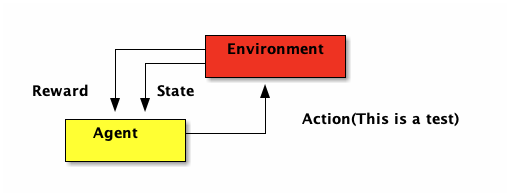
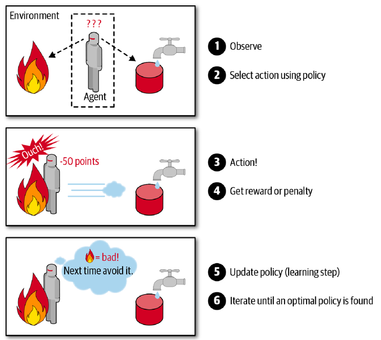
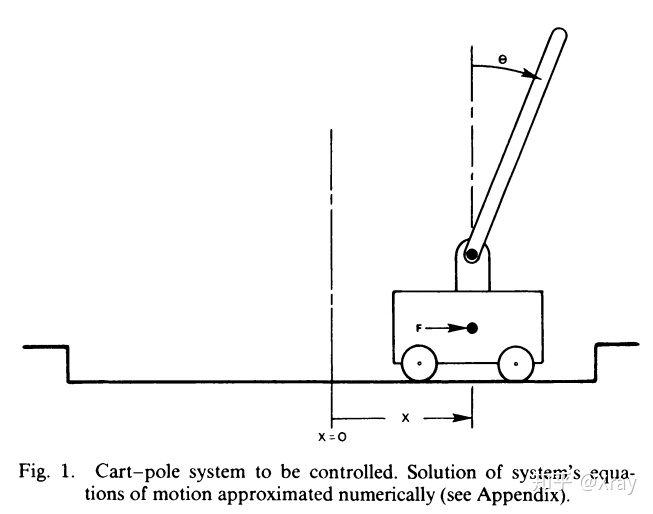
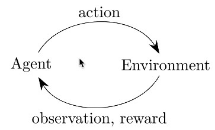
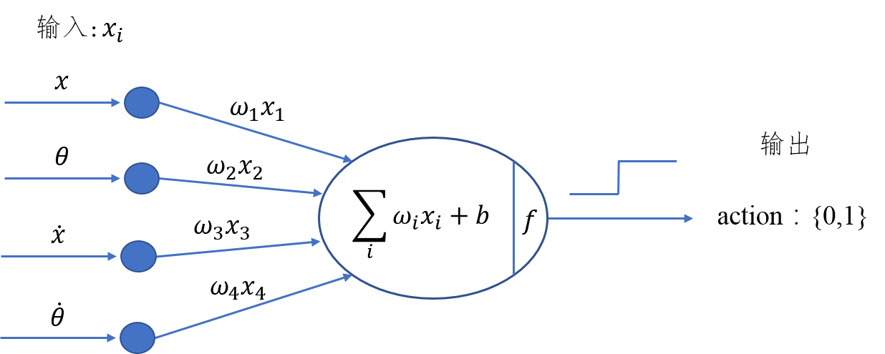
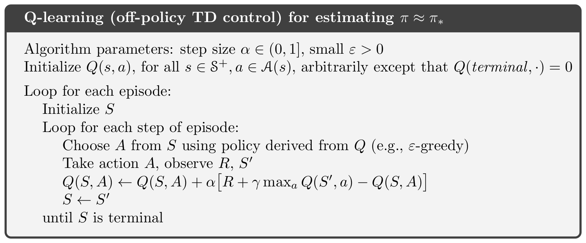
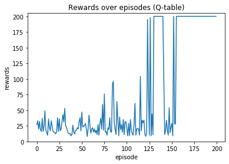

:PROPERTIES:
:ID:       0a5c37c0-741a-4a1a-bec7-f98074830132
:ROAM_ALIASES: 強化學習
:END:
#+title: 增強式學習
#+AUTHOR: 顏永進

#+TAGS: AI
#+INCLUDE: ../pdf.org
#+OPTIONS: toc:2     ^:nil num:5
#+PROPERTY: header-args :python :python "/Users/letranger/Dropbox/notes/roam/venv/bin/python3" :eval never-export
#+EXCLUDE_TAGS: noexport
#+latex:\newpage
#+HTML_HEAD: <link rel="stylesheet" type="text/css" href="../css/muse.css" />
#+HTML_HEAD_EXTRA: 

#+begin_export html

<!-- Google tag (gtag.js) -->

#+end_export

* 增強式學習
:PROPERTIES:
:CUSTOM_ID: AI-RL
:END:
想像你正在學騎腳踏車：沒有人告訴你「左手用力 3.7 牛頓、右腳踩 45 度」這種標準答案，你只知道一件事 — *摔倒了就是做錯了，沒摔倒就繼續* 。透過不斷嘗試和修正，你最終學會了騎車。這就是增強式學習（Reinforcement Learning, RL）的核心精神[fn:1]。

在 RL 中，有一個 *Agent*（代理人）會不斷與 *環境* 互動：做出一個動作（Action），環境回饋一個獎勵（Reward），Agent 再根據獎勵調整自己的策略（Policy）。如圖[[fig:ReinforcementLearning]]所示。RL 的目標就是找到一個最佳策略，讓累積的 Reward 最多。

最常見的應用是教 AI 玩遊戲 — 在這種情境下，我們不會對某個動作貼標籤說它是「好」或「壞」，而是根據遊戲的結果（贏或輸、得分或失分）來做為回饋。

#+BEGIN_SRC ditaa :file images/ReinforcementLearning.png
                  +-------------+
         +--------+ Environment |
         |  +-----+     cRED    |
         |  |     +-------------+
 Reward  |  |State      ^
         v  V           |
    +-----------+       |Action(This is a test)
    |  Agent    +-------+
    |   cYEL    |
    +-----------+
#+END_SRC
#+CAPTION: 強化學習流程圖
#+name: fig:ReinforcementLearning
#+ATTR_LATEX: :width 300
#+ATTR_HTML: :width 600
#+ATTR_ORG: :width 300
#+RESULTS:

RL 的學習過程就是不斷 try-and-error：做了一個動作 → 看看結果好不好 → 好就記住、不好就避免。強化學習在過去曾被長期忽視，但在 Google DeepMind 成功用它玩 Atari 遊戲後（AI 從零開始學會打磚塊，還自己發現了把球打到磚塊後面的密技），就開始受到大量關注。

常見的 RL 應用領域：
- 電腦遊戲（Atari、星海爭霸）
- 棋類對弈（AlphaGo、AlphaZero）
- 自動駕駛
- 機器人控制

** 與[[id:20221023T101626.420918][監督式學習]]的比較
| 比較項目   | 監督式學習                               | 增強式學習                           |
|----------+----------------------------------------+--------------------------------------|
| 學習方式   | 有老師教（給正確答案）                    | 自己摸索（只知道做得好不好）           |
| 圍棋的例子 | 看大量棋譜，模仿人類下棋                  | 兩台 AI 互相對弈，自己發明招式        |
| 優點       | 有明確的標準答案，學習效率高              | 能突破人類的經驗限制，可能找到更好的策略 |
| 缺點       | 受限於人類提供的資料品質                  | 需要大量的嘗試，訓練時間長             |

** 與[[id:20221023T101228.247381][深度學習]]的比較
深度學習和強化學習不是互斥的，它們可以搭配使用。最經典的例子就是 AlphaGo 和 AlphaZero[fn:2]：

- *AlphaGo* ：用[[id:20221023T101414.457264][深度學習]]（CNN）學習三千萬盤人類棋譜 → 打敗了世界冠軍柯潔
- *AlphaZero* ：完全不看人類棋譜，只用 *強化學習* 自己和自己下棋 → 打敗了 AlphaGo

AlphaZero 的故事告訴我們：當 AI 不再被人類經驗束縛，反而可能找到人類從沒想過的策略。

** 實例
- [[https://www.youtube.com/watch?v=AJ1TR28KNqY][“影分身之术”！训练50亿次的AI能有多智能]]
- [[https://www.youtube.com/watch?v=Z6fjTZAtziQ][讓人工智慧玩捉迷藏，最後居然發展出連人類都想不到的策略!? | 一探啾竟 第80集 | 啾啾鞋]]

** 探索與利用的兩難（Exploration vs. Exploitation）
RL 有一個很有趣的兩難問題[fn:3]：假設你發現了一家還不錯的餐廳，你應該：
- *每次都去那家*（利用 Exploitation）— 穩穩拿到不錯的分數
- *還是嘗試新餐廳*（探索 Exploration）— 可能踩雷，但也可能發現更棒的

這就是 RL 中最經典的 *Exploration-Exploitation Tradeoff* 。Agent 必須在「利用已知的好策略」和「探索未知的可能性」之間取得平衡。

最常見的做法叫做 $\epsilon$-greedy：設定一個探索率 $\epsilon$（例如 0.1），Agent 有 10% 的機率隨機選動作（探索），90% 的機率選目前已知最好的動作（利用）。隨著訓練進行，$\epsilon$ 會逐漸降低 — 因為 Agent 越來越有經驗了，不需要再那麼常亂試了。

#+CAPTION: 增強式學習的探索與利用
#+LABEL:fig:RL-explore
#+name: fig:RL-explore
#+ATTR_LATEX: :width 300
#+ATTR_ORG: :width 300
#+ATTR_HTML: :width 400

* Gymnasium（前身為 OpenAI Gym）
OpenAI Gym 曾經是強化學習界最受歡迎的工具包，提供許多現成的測試環境（遊戲），讓大家可以專心開發 RL 演算法，不用自己寫遊戲。2022 年後，Gym 由 Farama Foundation 接手維護，改名為 *Gymnasium* ，API 也做了些調整。

安裝方式很簡單：
#+begin_src shell -r :results output :exports both
pip install gymnasium
#+end_src

* CartPole：讓桿子不要倒！
Gymnasium 上有許多可用的環境，CartPole 是其中最經典也最簡單的一種。想像一台小車上面立著一根桿子（倒立擺），小車可以左右移動，你的目標就是 *透過左右移動小車，讓桿子盡可能不要倒下來* 。就像你小時候玩過的平衡遊戲一樣！
#+CAPTION: Cart-pole system
#+LABEL:fig:Cart-pole
#+name: fig:Cart-pole
#+ATTR_LATEX: :width 300
#+ATTR_ORG: :width 300
#+ATTR_HTML: :width 400

** 執行測試與環境變數
以下是一段最基本的測試程式，讓 Agent 完全隨機地操控小車：
#+begin_src python -r -n :results output :exports both
import gymnasium as gym

# 建立執行環境
env = gym.make('CartPole-v1')
# 將執行環境初始化（回傳初始觀測值和額外資訊）
observation, info = env.reset()
for _ in range(100):
    # 隨機從action_space中挑選下一動作(action)丟入step執行
    observation, reward, terminated, truncated, info = env.step(env.action_space.sample())
    if terminated or truncated:
        break
env.close()
print("隨機亂動，遊戲結束！")
#+end_src
如下圖所示，增強式學習的核心就是：Agent 採取 Action，採取行動後環境可能會改變，而環境會給 Agent 一個 Reward，讓 Agent 知道這個 Action 好不好。其中 action 有 0 或 1 兩種可能值，代表將車子向左或向右推動。
#+CAPTION: Cartpole cycle
#+LABEL:fig:Cart-cycle
#+name: fig:Cart-cycle
#+ATTR_LATEX: :width 200
#+ATTR_ORG: :width 200
#+ATTR_HTML: :width 300

就 CartPole 來說，action 丟入環境執行後，可以得到幾個相關的環境資訊（由 =step= 函式傳回），這些變數可由以下方式取得：
#+begin_src python -r -n :results output :exports both
import gymnasium as gym

env = gym.make('CartPole-v1')
observation, info = env.reset()
rewards = 0
for _ in range(100):
    action = env.action_space.sample()  # 仍然隨機產生 action
    # action丟入環境執行，傳回環境資訊（5個回傳值）
    observation, reward, terminated, truncated, info = env.step(action)
    rewards += reward
    print(observation)
    if terminated or truncated:  # 回合結束，可能柱子太傾斜或車子跑遠
        print("Rewards:", rewards)
        break
env.close()
#+end_src
每次執行的結果都不同（因為是隨機動作），但大致上會看到類似這樣的輸出：
#+begin_example
[-0.00943879  0.18031594 -0.0417659  -0.35468228]
[-0.00583247  0.37600609 -0.04885955 -0.66023713]
...
Rewards: 11.0
#+end_example
雖然程式指定跑 100 次動作，但因為隨機亂動，桿子很快就倒了，所以通常 10 幾步就結束了。
** 重要環境變數
在 Gymnasium 的環境中，有兩個重要的空間：動作空間 =action_space= 和觀測空間 =observation_space= ，分別描述了 Agent 能做什麼動作、以及能看到什麼資訊。
#+begin_src python -r -n :results output :exports both
import gymnasium as gym
env = gym.make('CartPole-v1')
print("動作空間:", env.action_space)
print("觀測空間:", env.observation_space)
#+end_src

#+RESULTS:
: 動作空間: Discrete(2)
: 觀測空間: Box([-4.8 ...], [4.8 ...], (4,), float32)
由結果可以看出：
- =action_space= 是離散型 =Discrete(2)= ，代表只有兩個動作：0（向左推）和 1（向右推）。
- =observation_space= 是連續型 =Box= ，代表觀測值是一個長度為 4 的浮點數陣列，每個元素都有上下界。
*** Observation（觀測值）:
Type: Box(4)[fn:4]
| Num | Observation           |                  Min |                Max |
|-----+-----------------------+----------------------+--------------------|
|   0 | Cart Position         |                 -4.8 |                4.8 |
|   1 | Cart Velocity         |                 -Inf |                Inf |
|   2 | Pole Angle            | -0.418 rad (-24 deg) | 0.418 rad (24 deg) |
|   3 | Pole Angular Velocity |                 -Inf |                Inf |
*** Actions（動作空間，離散空間）
Type: Discrete(2)
| Num | Action                 |
|-----+------------------------|
|   0 | Push cart to the left  |
|   1 | Push cart to the right |
註：施加的力大小是固定的，但減小或增大的速度不是固定的，它取決於當時桿子與豎直方向的角度。角度不同，產生的速度和位移也不同。
*** Reward（獎勵）
每撐過一步就得到 1 分獎勵（包括結束那一步）。在 CartPole-v1 中，最高可以撐 500 步，所以滿分是 500 分。
*** 初始狀態:
初始狀態所有觀測值都從[-0.05, 0.05]中隨機取值。
*** 達到下列條件之一即結束一回合:
1. 桿子與豎直方向角度超過 12 度（ =terminated=True= ）
2. 小車位置距離中心超過 2.4（小車跑出畫面， =terminated=True= ）
3. 回合步數達到 500 步（ =truncated=True= ，恭喜你撐到滿分！）
** 小練習
上述程式只執行了一回合的模擬，請你修改上述程式，進行 200 回合的模擬，記錄每回合隨機運作的 reward 結果，並將結果畫成折線圖（x 軸為回合數，y 軸為每回合的 reward）。你覺得隨機亂動平均能撐幾步？

* 直覺反應的 CartPole
前面的程式用隨機方式來操控小車，效果當然很差。但就算是最笨的人，也知道「桿子往左倒，車就往左推」這種直覺反應。讓我們把這個簡單策略寫成程式：
#+begin_src python -r -n :results output :exports both
import gymnasium as gym

env = gym.make('CartPole-v1')
observation, info = env.reset()
rewards = 0
for t in range(500):
    # 取得目前狀態
    pos, v, ang, rot = observation
    # 直覺策略：桿子往左傾就往左推，往右傾就往右推
    if ang < 0:
        action = 0  # 車往左推
    else:
        action = 1  # 車往右推
    observation, reward, terminated, truncated, info = env.step(action)
    rewards += reward
    if terminated or truncated:
        print('Rewards:', rewards)
        break

env.close()
#+end_src
這個策略沒有在「學習」，只是一個固定的 if-else 規則。但比起隨機亂動，已經好很多了 — 大概能撐 40~60 步。

#+RESULTS:
: Rewards: 51.0

不過離滿分 500 還差得遠。為什麼？因為這個策略只看了「桿子角度」一個特徵，完全忽略了速度、位置等資訊。

** 小練習
上述程式只看了桿子角度，你能否再想出更好的策略？提示：觀察 observation 的 4 個數值，思考哪些資訊也該納入決策。目標是讓 reward 超過 100！

* Hill Climbing：讓電腦自己找最佳策略 [fn:5]
前面的「直覺策略」是我們人類自己寫的規則，但如果讓電腦 *自己去找* 最好的策略呢？這就是「爬山演算法」（Hill Climbing）的概念。

想像你在一座山上，被蒙住眼睛，你要爬到最高點。你的策略很簡單：往四周摸一摸，哪邊比較高就往哪邊走一步。這就是爬山演算法的精神 — *每次微調一點點，如果變好就保留，變差就放棄* 。

具體來說，我們建立一個簡單的模型：把觀測值（4個數字）分別乘上一組權重，求加權和，如果和為正就往右推、為負就往左推。模型如下圖所示：
#+CAPTION: Hill Climbing Model
#+LABEL:fig:HCModel
#+name: fig:HCModel
#+ATTR_LATEX: :width 300
#+ATTR_ORG: :width 500
#+ATTR_HTML: :width 500

這個模型的決策公式為：
$$H_{sum} = w_1 \cdot x + w_2 \cdot \theta + w_3 \cdot \dot{x} + w_4 \cdot \dot{\theta} + b$$
如果 $H_{sum} \geq 0$，就往右推（action=1）；否則往左推（action=0）。

爬山演算法的流程很簡單：
1. 隨機生成一組權重
2. 用這組權重跑一回合遊戲，記錄得分
3. 在當前最佳權重上加入一點隨機微調
4. 如果微調後得分更高 → 更新最佳權重
5. 如果沒有改善 → 保持原來的權重
6. 重複步驟 3~5，直到找到滿分的權重
** 程式碼
#+begin_src python -r -n :results output :exports both :session hc
import numpy as np
import gymnasium as gym
import matplotlib.pyplot as plt

def run_one_episode(env, weights):
    """用指定的權重跑一回合，回傳總 reward"""
    observation, info = env.reset()
    rewards = 0
    for t in range(500):
        # 加權和決定動作
        action = 1 if np.dot(weights[:4], observation) + weights[4] >= 0 else 0
        observation, reward, terminated, truncated, info = env.step(action)
        rewards += reward
        if terminated or truncated:
            break
    return rewards

# 爬山演算法主程式
env = gym.make("CartPole-v1")
np.random.seed(10)

best_reward = 0
best_weights = np.random.rand(5)  # 初始權重隨機
reward_history = []

for i in range(300):
    # 在最佳權重上加入微小隨機擾動
    new_weights = best_weights + np.random.normal(0, 0.1, 5)
    r = run_one_episode(env, new_weights)
    reward_history.append(r)
    if r > best_reward:
        best_reward = r
        best_weights = new_weights
    if best_reward >= 500:  # CartPole-v1 滿分 500
        print(f"第 {i} 次迭代就找到滿分策略！")
        break

print(f"最佳 reward: {best_reward}")
env.close()

# 畫出學習過程
plt.figure(figsize=(10, 4))
plt.plot(reward_history)
plt.xlabel("Iteration")
plt.ylabel("Reward")
plt.title("Hill Climbing: Reward per Iteration")
plt.grid(True)
plt.tight_layout()
plt.savefig("images/hill_climbing_result.png", dpi=150)
#+end_src
爬山演算法本質上是一種「局部搜尋」的方法 — 效率很高（通常幾十次就能找到不錯的解），但因為不是全局搜索，找到的不一定是最佳解。就像蒙著眼睛爬山，你可能爬到一座小丘就以為到了山頂，卻不知道隔壁還有更高的山。

* Q-Learning：讓 Agent 自己學會查表決策
前面的爬山演算法只是在「碰運氣」找好的權重，並沒有真正在學習。Q-Learning 才是強化學習中最經典的學習演算法之一[fn:6]。

Q-Learning 的核心概念很簡單：建立一張「作弊表」（Q-Table），記錄「在某個狀態下，做某個動作，預期能得到多少分」。Agent 每次遇到新狀態時，就查表選擇分數最高的動作。

這張表一開始是空白的（全部填 0），Agent 必須透過一次又一次的嘗試來填入正確的數值。更新公式如下：
$$Q(s_t, a_t) \leftarrow Q(s_t, a_t) + \alpha \Big[ R_{t+1} + \gamma \max_a Q(s_{t+1}, a) - Q(s_t, a_t) \Big]$$
其中：
- $\alpha$ 是學習率（每次更新幅度多大）
- $\gamma$ 是折扣因子（多重視未來的獎勵）
- $R_{t+1}$ 是這一步實際得到的獎勵
- $\max_a Q(s_{t+1}, a)$ 是下一步最好的預期分數

簡單來說：Agent 不只看眼前的獎勵，還會估計「到了下一個狀態後，最多還能拿多少分」，就像下棋時不只看當前這步，還要想後面幾步。
** Algorithms
#+CAPTION: Q-Learning Algorithm
#+LABEL:fig:Q-Learning-Algo
#+name: fig:Q-Learning-Algo
#+ATTR_LATEX: :width 500
#+ATTR_ORG: :width 600
#+ATTR_HTML: :width 500

用一個經典的比喻來解釋：想像你是一個小朋友，眼前有一顆棉花糖。如果 $\gamma = 0$，你只看到眼前的棉花糖就立刻吃掉了；但如果 $\gamma$ 接近 1，你會想：「如果我現在忍住不吃，等一下可能會有兩顆棉花糖！」。這就是 Q-Learning 厲害的地方 — 它讓 Agent 學會為了更大的未來回報，而犧牲眼前的小利。
** Q-Table 實作細節
上面講了一堆理論，現在讓我們看看 Q-Table 在 CartPole 中要怎麼實作。

由於 CartPole 的 state 是連續值（角度可以是 0.123456...），這樣會有無限多種狀態，沒辦法建一個無限大的表格。所以我們要把連續值「離散化」（discretize），把它們分成幾個區間（bucket）。

例如我們把 state 的 4 個特徵 (position, velocity, angle, rotation rate) 分別離散化成 (1, 1, 6, 3) 個 bucket — 其中 6 個 bucket 代表角度的範圍被切成 6 個區間，區間中的值都對應到同一個離散值。

1. 首先，我們要把連續的觀測值離散化，建立 Q-Table：
   #+begin_src python -r -n :results output :exports both
import numpy as np
import math
import gymnasium as gym

env = gym.make('CartPole-v1')

# 每個特徵要切成幾個區間（bucket）
n_buckets = (1, 1, 6, 3)
n_actions = env.action_space.n  # = 2

# 建立 Q-table（所有值初始為 0）
q_table = np.zeros(n_buckets + (n_actions,))
print(f"Q-table 大小: {q_table.shape}")  # (1, 1, 6, 3, 2)

# 設定每個特徵的上下界
state_bounds = list(zip(env.observation_space.low, env.observation_space.high))
state_bounds[1] = [-0.5, 0.5]  # 速度範圍限制
state_bounds[3] = [-math.radians(50), math.radians(50)]  # 角速度範圍限制

def get_state(observation, n_buckets, state_bounds):
    """將連續的觀測值轉換成離散的 bucket 索引"""
    state = [0] * len(observation)
    for i, s in enumerate(observation):
        l, u = state_bounds[i][0], state_bounds[i][1]
        if s <= l:
            state[i] = 0
        elif s >= u:
            state[i] = n_buckets[i] - 1
        else:
            state[i] = int(((s - l) / (u - l)) * n_buckets[i])
    return tuple(state)
#+end_src
=state_bounds= 初始內容為
#+begin_example
[(-4.8, 4.8),
 [-0.5, 0.5],
 (-0.41887903, 0.41887903),
 [-0.8726646259971648, 0.8726646259971648]]
#+end_example
=q_table= 為 =(1, 1, 6, 3, 2)= 的 ndarray，初始值全為 0，代表 Agent 一開始對所有狀態-動作的組合完全沒有任何經驗。
2. 再來是 $\epsilon$-greedy 策略。選動作時，有 $\epsilon$ 的機率隨機選（exploration，探索未知），其他時間照著 Q-Table 選最高分的動作（exploitation，利用已知）：
   #+begin_src python -r -n :results output :exports both
def choose_action(state, q_table, action_space, epsilon):
    if np.random.random_sample() < epsilon:  # 探索：隨機選
        return action_space.sample()
    else:  # 利用：選 Q 值最大的動作
        return np.argmax(q_table[state])
   #+end_src
3. 做出 action 後，收到 observation 和 reward，就可以更新 Q-Table：
   #+begin_src python -r -n :results output :exports both
# 算出下個 state 的離散值
next_state = get_state(observation, n_buckets, state_bounds)

# Q-learning 更新公式
q_next_max = np.amax(q_table[next_state])
q_table[state + (action,)] += lr * (reward + gamma * q_next_max - q_table[state + (action,)])

# 移動到下個 state
state = next_state
   #+end_src
4. 訓練過程中，$\epsilon$ 和學習率 $\alpha$ 會隨著訓練逐漸降低。一開始 Agent 什麼都不知道，所以多探索（高 $\epsilon$）；後期已經學到不少經驗了，就多利用已學的知識（低 $\epsilon$）。
   #+begin_src python -r -n :results output :exports both
# epsilon 和 lr 隨回合數遞減
get_epsilon = lambda i: max(0.01, min(1, 1.0 - math.log10((i+1)/25)))
get_lr = lambda i: max(0.01, min(0.5, 1.0 - math.log10((i+1)/25)))

# 每回合開始時更新
epsilon = get_epsilon(i_episode)
lr = get_lr(i_episode)
   #+end_src
5. 成果
   #+CAPTION: Q-Learning Performance
#+LABEL:fig:Q-Learn-Perf
#+name: fig:Q-Learn-Perf
#+ATTR_LATEX: :width 300
#+ATTR_ORG: :width 300
#+ATTR_HTML: :width 500

* 增強式學習有多強？[fn:7]
RL 的戰績相當輝煌：
- *圍棋* ：AlphaGo/AlphaZero 擊敗世界冠軍
- *電玩* ：DeepMind 的 AI 學會玩 57 種 Atari 遊戲，其中 29 種超越人類水準
- *超級瑪利歐* ：AI 透過一次又一次的死亡，學會了跳躍、閃避怪物的時機
- *機器人* ：OpenAI 訓練機械手臂學會轉魔術方塊

那麼 RL 無敵了嗎？當然不是：
- *訓練成本高* ：要跑幾百萬、甚至幾十億次模擬才能學會，非常耗時耗能
- *安全問題* ：自動駕駛中如果 AI 誤判了紅綠燈，後果不堪設想
- *獎勵設計困難* ：如果獎勵函數設計不好，AI 可能會找到「作弊」的方式拿高分，卻完全不是我們想要的行為

RL 很強大也很有趣，但它不是萬能的。在特定領域（遊戲、棋類、機器人控制），RL 可以達到超越人類的表現！

* 作業：強化學習大冒險
** 作業一：隨機 vs 直覺 — 200 回合大對決
讓隨機策略和直覺策略各跑 200 回合，畫出兩條 reward 折線圖，看看誰比較厲害。

以下範例程式跑 200 回合的「隨機策略」：

#+begin_src python -r -n :results output :exports both :session hw_rl1
import gymnasium as gym
import matplotlib.pyplot as plt
import numpy as np

def run_episodes(strategy, n_episodes=200):
    """跑 n_episodes 回合，回傳每回合的 reward 列表"""
    env = gym.make('CartPole-v1')
    rewards_list = []
    for _ in range(n_episodes):
        obs, info = env.reset()
        total_reward = 0
        for t in range(500):
            if strategy == 'random':
                action = env.action_space.sample()
            elif strategy == 'intuition':
                # 直覺策略：桿子往左傾就往左推
                action = 0 if obs[2] < 0 else 1
            obs, reward, terminated, truncated, info = env.step(action)
            total_reward += reward
            if terminated or truncated:
                break
        rewards_list.append(total_reward)
    env.close()
    return rewards_list

# 只跑隨機策略
random_rewards = run_episodes('random')
print(f"隨機策略平均 reward: {np.mean(random_rewards):.1f}")
#+end_src

*** 你的任務
1. 修改上面的程式，再跑一次「直覺策略」（ =intuition= ）的 200 回合
2. 把兩條折線畫在同一張圖上（用不同顏色），加上圖例（legend）
3. 在圖的標題中顯示兩種策略的平均 reward

*** 預期輸出
#+begin_example
隨機策略平均 reward: 22.x
直覺策略平均 reward: 42.x

（一張折線圖，藍色=隨機、橘色=直覺，直覺策略明顯比隨機高）
#+end_example

*** 參考解答 :noexport:
#+begin_src python -r -n :results output :exports both :session hw_rl1_ans
import gymnasium as gym
import matplotlib.pyplot as plt
import numpy as np

def run_episodes(strategy, n_episodes=200):
    env = gym.make('CartPole-v1')
    rewards_list = []
    for _ in range(n_episodes):
        obs, info = env.reset()
        total_reward = 0
        for t in range(500):
            if strategy == 'random':
                action = env.action_space.sample()
            elif strategy == 'intuition':
                action = 0 if obs[2] < 0 else 1
            obs, reward, terminated, truncated, info = env.step(action)
            total_reward += reward
            if terminated or truncated:
                break
        rewards_list.append(total_reward)
    env.close()
    return rewards_list

random_rewards = run_episodes('random')
intuition_rewards = run_episodes('intuition')

plt.figure(figsize=(10, 4))
plt.plot(random_rewards, alpha=0.7, label=f'Random (avg={np.mean(random_rewards):.1f})')
plt.plot(intuition_rewards, alpha=0.7, label=f'Intuition (avg={np.mean(intuition_rewards):.1f})')
plt.xlabel('Episode')
plt.ylabel('Reward')
plt.title(f'Random vs Intuition Strategy')
plt.legend()
plt.grid(True)
plt.tight_layout()
plt.savefig('images/hw_rl_compare.png', dpi=150)
print(f"隨機策略平均 reward: {np.mean(random_rewards):.1f}")
print(f"直覺策略平均 reward: {np.mean(intuition_rewards):.1f}")
#+end_src

** 作業二：爬山高手 — 微調的藝術
在教材的爬山演算法中，我們用 =np.random.normal(0, 0.1, 5)= 來產生微調的隨機值，其中 0.1 是「步幅」（step size）。步幅太大，權重會亂跳；步幅太小，搜尋速度太慢。

以下範例程式用步幅 0.1 來跑爬山演算法：

#+begin_src python -r -n :results output :exports both :session hw_rl2
import numpy as np
import gymnasium as gym

def hill_climb(step_size, max_iter=300, seed=42):
    """用指定步幅跑爬山演算法，回傳找到的最佳 reward 和歷史紀錄"""
    env = gym.make('CartPole-v1')
    np.random.seed(seed)
    best_reward = 0
    best_weights = np.random.rand(5)
    history = []

    for i in range(max_iter):
        new_weights = best_weights + np.random.normal(0, step_size, 5)
        obs, info = env.reset()
        total = 0
        for _ in range(500):
            action = 1 if np.dot(new_weights[:4], obs) + new_weights[4] >= 0 else 0
            obs, reward, terminated, truncated, info = env.step(action)
            total += reward
            if terminated or truncated:
                break
        history.append(total)
        if total > best_reward:
            best_reward = total
            best_weights = new_weights
    env.close()
    return best_reward, history

best, hist = hill_climb(step_size=0.1)
print(f"步幅 0.1 → 最佳 reward: {best}")
#+end_src

*** 你的任務
測試三種不同的步幅：0.01、0.1、0.5，各跑一次爬山演算法（300 次迭代），比較哪個步幅最快找到好的策略。

提示：用迴圈呼叫 =hill_climb()= 三次就好。

*** 預期輸出
#+begin_example
步幅 0.01 → 最佳 reward: xxx
步幅 0.10 → 最佳 reward: xxx
步幅 0.50 → 最佳 reward: xxx

結論：步幅 0.1 左右效果最好
#+end_example

*** 參考解答 :noexport:
#+begin_src python -r -n :results output :exports both :session hw_rl2_ans
import numpy as np
import gymnasium as gym

def hill_climb(step_size, max_iter=300, seed=42):
    env = gym.make('CartPole-v1')
    np.random.seed(seed)
    best_reward = 0
    best_weights = np.random.rand(5)
    history = []

    for i in range(max_iter):
        new_weights = best_weights + np.random.normal(0, step_size, 5)
        obs, info = env.reset()
        total = 0
        for _ in range(500):
            action = 1 if np.dot(new_weights[:4], obs) + new_weights[4] >= 0 else 0
            obs, reward, terminated, truncated, info = env.step(action)
            total += reward
            if terminated or truncated:
                break
        history.append(total)
        if total > best_reward:
            best_reward = total
            best_weights = new_weights
    env.close()
    return best_reward, history

for step in [0.01, 0.1, 0.5]:
    best, hist = hill_climb(step_size=step)
    print(f"步幅 {step:.2f} → 最佳 reward: {best}")
#+end_src

** 作業三：自創策略挑戰賽 — 你能打敗直覺嗎？
直覺策略只看了桿子角度（ =obs[2]= ），但 observation 其實有 4 個數值。如果我們把更多資訊加入決策，應該能做得更好！

以下是直覺策略的程式，平均大概能撐 40~60 步：

#+begin_src python -r -n :results output :exports both :session hw_rl3
import gymnasium as gym
import numpy as np

def my_strategy(obs):
    """直覺策略：只看桿子角度"""
    pos, vel, angle, ang_vel = obs
    if angle < 0:
        return 0  # 往左推
    else:
        return 1  # 往右推

# 測試策略
env = gym.make('CartPole-v1')
rewards = []
for _ in range(100):
    obs, info = env.reset()
    total = 0
    for _ in range(500):
        action = my_strategy(obs)
        obs, reward, terminated, truncated, info = env.step(action)
        total += reward
        if terminated or truncated:
            break
    rewards.append(total)
env.close()
print(f"直覺策略平均 reward: {np.mean(rewards):.1f}")
#+end_src

*** 你的任務
修改 =my_strategy()= 函式，設計你自己的策略，目標是讓平均 reward 超過 *100* ！

提示：
- =obs[0]= 是車子位置，太偏左偏右都不好
- =obs[1]= 是車子速度，跑太快要煞車
- =obs[2]= 是桿子角度，快倒了要趕快救
- =obs[3]= 是桿子角速度，正在加速倒的時候更緊急
- 你可以組合多個條件，例如：「如果桿子角度 + 角速度 < 0，就往左推」

*** 預期輸出
#+begin_example
我的策略平均 reward: 1xx.x （超過 100 就算過關！）
#+end_example

*** 參考解答 :noexport:
#+begin_src python -r -n :results output :exports both :session hw_rl3_ans
import gymnasium as gym
import numpy as np

def my_strategy(obs):
    """改良策略：同時考慮角度和角速度"""
    pos, vel, angle, ang_vel = obs
    # 綜合考慮角度和角速度（角速度的影響力更大）
    score = angle + 0.5 * ang_vel
    if score < 0:
        return 0
    else:
        return 1

env = gym.make('CartPole-v1')
rewards = []
for _ in range(100):
    obs, info = env.reset()
    total = 0
    for _ in range(500):
        action = my_strategy(obs)
        obs, reward, terminated, truncated, info = env.step(action)
        total += reward
        if terminated or truncated:
            break
    rewards.append(total)
env.close()
print(f"改良策略平均 reward: {np.mean(rewards):.1f}")
#+end_src

* Footnotes

[fn:1] Hands-On Machine Learning with Scikit-Learn: Aurelien Geron

[fn:2] [[https://kknews.cc/tech/xln95b8.html#google_vignette][機器學習、深度學習與強化學習區別]]

[fn:3] [[https://kknews.cc/zh-tw/news/34mob53.html][強化學習Exploration漫遊]]

[fn:4] [[https://github.com/openai/gym/blob/master/gym/envs/classic_control/cartpole.py][GitHub: openai/gym ]]

[fn:5] [[https://blog.csdn.net/qq_32892383/article/details/89576003][OpenAI Gym 經典控制環境介紹——CartPole（倒立擺）]]

[fn:6] [[https://blog.csdn.net/qq_30615903/article/details/80739243][【強化學習】Q-Learning算法詳解]]

[fn:7] [[https://ithelp.ithome.com.tw/articles/10234272][Day 6 強化學習就是一直學習? ]]

[fn:8] [[http://gym.openai.com/docs/][Getting Started with Gym]]

[fn:9] [[https://towardsai.net/p/programming/decision-trees-explained-with-a-practical-example-fe47872d3b53][Decision Trees Explained With a Practical Example]]
