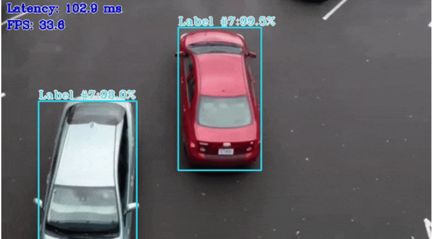
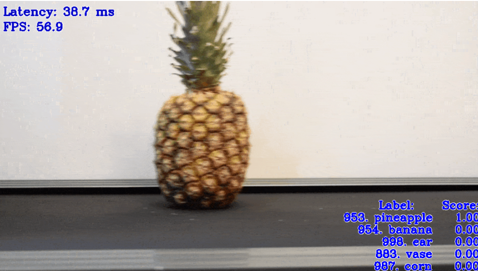

:PROPERTIES:
:ID:       67d42bc7-eade-407d-b8c7-a197caa94a68
:END:
#+title: 邊緣運算
#+SUBTITLE: 台南一中AI選修教材 / 顏永進
#+AUTHOR: 顏永進

#+TAGS: AI
#+INCLUDE: ../pdf.org
#+OPTIONS: toc:2 ^:nil num:5
#+PROPERTY: header-args :python :python "/Users/letranger/Dropbox/notes/roam/venv/bin/python3" :eval never-export
#+EXCLUDE_TAGS: noexport
#+latex:\newpage
#+HTML_HEAD: <link rel="stylesheet" type="text/css" href="../css/muse.css" />
#+HTML_HEAD_EXTRA: 

#+begin_export html

#+end_export

* 什麼是邊緣運算

** 從一個問題開始

假設你家門口裝了一台 AI 監視攝影機，它能辨識走過來的人是家人還是陌生人。問題來了：辨識這件事情應該在哪裡做？

- *方案 A：雲端運算*——攝影機把影像傳到遠方的 Google 伺服器，伺服器辨識完再把結果傳回來
- *方案 B：邊緣運算*——攝影機自己就有一顆 AI 晶片，當場辨識，不用傳到任何地方

方案 A 就是「雲端運算」（Cloud Computing），方案 B 就是「邊緣運算」（Edge Computing）。

#+begin_quote
為什麼叫「邊緣」？因為在網路架構圖中，雲端伺服器在中央，而使用者的裝置散佈在「邊緣」。邊緣運算就是把運算能力從中央推到邊緣——讓資料在產生的地方就被處理掉，不用千里迢迢送到雲端。
#+end_quote

** 生活中的邊緣運算

你可能不知道，邊緣運算早就在你身邊了：

| 應用 | 說明 | 為什麼不用雲端？ |
|------+------+------------------|
| Face ID 解鎖手機 | iPhone 上的 Neural Engine 直接在手機上辨識你的臉 | 你的臉部資料不應該傳到蘋果的伺服器 |
| 特斯拉自動駕駛 | 車上的 AI 晶片即時分析路況 | 開車時延遲 0.1 秒就可能撞到人 |
| 智慧音箱喚醒詞 | 「Hey Siri」的偵測在裝置端完成 | 不可能 24 小時把家裡的聲音都傳到雲端 |
| AirPods 降噪 | 即時分析環境噪音並產生反向音波 | 聲音處理必須在毫秒內完成 |
| 工廠品質檢測 | 相機即時檢查產品有沒有瑕疵 | 生產線一秒好幾個產品，來不及傳雲端 |

** 雲端 vs 邊緣：完整比較

| 比較項目 | 雲端運算 | 邊緣運算 |
|----------+----------+----------|
| 運算地點 | 遠方的資料中心 | 裝置本身或附近的伺服器 |
| 延遲 | 高（資料要來回傳輸） | 低（就地處理） |
| 隱私 | 資料要上傳，有洩漏風險 | 資料留在本地，較安全 |
| 運算能力 | 超強（整個資料中心的算力） | 有限（受裝置硬體限制） |
| 網路依賴 | 必須有網路 | 可以離線運作 |
| 成本 | 要付雲端服務費 | 硬體成本較高，但沒有傳輸費 |
| 模型大小 | 可以跑超大模型 | 只能跑精簡過的小模型 |
| 適合場景 | 訓練模型、大量資料分析 | 即時推論、隱私敏感、無網路環境 |

#+begin_quote
一句話總結：雲端是大腦，邊緣是反射神經。手碰到燙的東西會立刻縮回來，不用等大腦思考——這就是邊緣運算的精神。
#+end_quote

* 邊緣 AI 的核心挑戰：把大象塞進冰箱

雲端的 AI 模型可以無限大——ChatGPT 的參數量是數千億，需要整個資料中心的 GPU 叢集才能運行。但邊緣裝置（手機、攝影機、感測器）的記憶體和運算能力都很有限。

所以邊緣 AI 的核心問題是：*怎麼把一個很大的模型變小，又不要損失太多準確度？*

** 模型壓縮技術

常見的「把大象塞進冰箱」的方法：

*** 量化（Quantization）
把模型的參數從高精度（32 位元浮點數）降到低精度（8 位元整數甚至更低）。

想像一下：你量體重時，用體重計可以精確到 0.1 公斤（65.3 kg），但如果你跟朋友說「我大概 65 公斤」，雖然不那麼精確，但日常使用完全夠用。量化做的就是這件事——犧牲一點精度，換來大幅的空間和速度提升。

#+begin_src python -r -n :results output :exports both :session edge
import numpy as np

# 模擬模型參數（用 float32 儲存）
np.random.seed(42)
weights_fp32 = np.random.randn(1000).astype(np.float32)

# 量化成 int8（8 位元整數）
w_min, w_max = weights_fp32.min(), weights_fp32.max()
scale = (w_max - w_min) / 255
weights_int8 = np.round((weights_fp32 - w_min) / scale).astype(np.int8)

# 反量化回來看看損失多少
weights_recovered = weights_int8.astype(np.float32) * scale + w_min

# 比較
error = np.mean(np.abs(weights_fp32 - weights_recovered))
size_fp32 = weights_fp32.nbytes
size_int8 = weights_int8.nbytes

print("=== 量化效果 ===")
print(f"原始大小（float32）：{size_fp32} bytes")
print(f"量化後大小（int8）： {size_int8} bytes")
print(f"壓縮比：{size_fp32 / size_int8:.1f}x")
print(f"平均誤差：{error:.6f}")
print(f"\n原始前 5 個參數：{weights_fp32[:5]}")
print(f"量化後恢復值：  {weights_recovered[:5]}")
#+end_src

壓縮了 4 倍，但平均誤差非常小！在大多數 AI 應用中，這點精度損失幾乎不影響結果。

*** 剪枝（Pruning）
把模型中「不重要」的神經元或連結刪掉。就像修剪花園的樹枝——剪掉多餘的枝葉，樹不會死，反而長得更好。

#+begin_src python -r -n :results output :exports both :session edge
import numpy as np

# 模擬一個神經網路層的權重矩陣
np.random.seed(42)
weights = np.random.randn(10, 10).astype(np.float32)

print("原始權重矩陣（10x10）：")
print(f"  非零元素數量：{np.count_nonzero(weights)}")
print(f"  矩陣大小：{weights.nbytes} bytes")

# 剪枝：把絕對值小於 0.5 的權重設為 0（認為它們「不重要」）
threshold = 0.5
pruned_weights = weights.copy()
pruned_weights[np.abs(pruned_weights) < threshold] = 0

sparsity = 1 - np.count_nonzero(pruned_weights) / pruned_weights.size
print(f"\n剪枝後（閾值 = {threshold}）：")
print(f"  非零元素數量：{np.count_nonzero(pruned_weights)}")
print(f"  稀疏度：{sparsity * 100:.1f}%（有 {sparsity * 100:.1f}% 的權重被剪掉了）")
print(f"\n原始矩陣前 3 行：")
for row in weights[:3]:
    print(f"  {np.array2string(row, precision=2, suppress_small=True)}")
print(f"\n剪枝後前 3 行（0 就是被剪掉的）：")
for row in pruned_weights[:3]:
    print(f"  {np.array2string(row, precision=2, suppress_small=True)}")
#+end_src

*** 知識蒸餾（Knowledge Distillation）
讓一個小模型（學生）向大模型（老師）學習。大模型已經學會了很多知識，小模型不用從頭學，只要模仿大模型的行為就好。

#+begin_quote
就像考試前，學霸同學把重點整理成一張精華筆記給你——你不用讀整本課本，看這張筆記就能考到不錯的分數。大模型是學霸，小模型是你，精華筆記就是蒸餾出來的知識。
#+end_quote

** 模型大小 vs 準確度的取捨

不同大小的模型在邊緣裝置上的表現差異很大：

#+begin_src python -r -n :results output :exports both :session edge
import matplotlib.pyplot as plt

# 常見影像分類模型的參數量和準確度（ImageNet 資料）
models = {
    'MobileNetV2':    {'params': 3.4,   'accuracy': 71.8, 'edge': True},
    'EfficientNet-B0':{'params': 5.3,   'accuracy': 77.1, 'edge': True},
    'ResNet-50':      {'params': 25.6,  'accuracy': 76.1, 'edge': False},
    'EfficientNet-B4':{'params': 19.3,  'accuracy': 82.9, 'edge': False},
    'ResNet-152':     {'params': 60.2,  'accuracy': 78.3, 'edge': False},
    'VGG-16':         {'params': 138.4, 'accuracy': 71.3, 'edge': False},
}

print("=== 常見模型比較（ImageNet Top-1 Accuracy）===\n")
print(f"{'模型名稱':20s} {'參數量(M)':>10s} {'準確度(%)':>10s} {'適合邊緣?':>10s}")
print("-" * 55)
for name, info in models.items():
    edge_str = "Yes" if info['edge'] else "No"
    print(f"{name:20s} {info['params']:>10.1f} {info['accuracy']:>10.1f} {edge_str:>10s}")

# 繪圖
fig, ax = plt.subplots(figsize=(10, 6))
for name, info in models.items():
    color = 'green' if info['edge'] else 'gray'
    marker = '*' if info['edge'] else 'o'
    size = 200 if info['edge'] else 100
    ax.scatter(info['params'], info['accuracy'], c=color, s=size, marker=marker, zorder=5)
    ax.annotate(name, (info['params'], info['accuracy']),
                textcoords="offset points", xytext=(5, 5), fontsize=9)

ax.set_xlabel('Parameters (Millions)', fontsize=12)
ax.set_ylabel('Top-1 Accuracy (%)', fontsize=12)
ax.set_title('Model Size vs Accuracy: Edge-friendly Models in Green', fontsize=13)
ax.grid(True, alpha=0.3)
plt.tight_layout()
plt.savefig("images/edge-model-comparison.png", dpi=100)
plt.close()
print("\n圖表已儲存至 images/edge-model-comparison.png")
print("\n觀察：VGG-16 有 1.38 億參數，但準確度只有 71.3%；")
print("MobileNetV2 只有 340 萬參數，準確度卻有 71.8%！")
print("→ 模型不是越大越好，架構設計才是關鍵。")
#+end_src

* 邊緣 AI 的開發工具

想要在邊緣裝置上跑 AI，光有模型還不夠，你還需要專門的工具來：
1. 把模型轉換成邊緣裝置能讀懂的格式
2. 優化模型的執行速度
3. 充分利用硬體的加速功能

常見的邊緣 AI 開發工具：

| 工具 | 開發者 | 目標硬體 | 特色 |
|------+--------+----------+------|
| TensorFlow Lite | Google | 手機、樹莓派、微控制器 | 生態系最大，支援最多裝置 |
| OpenVINO | Intel | Intel CPU/GPU/VPU | 針對 Intel 硬體深度優化 |
| ONNX Runtime | Microsoft | 跨平台 | 通用格式，各家模型都能轉換 |
| Core ML | Apple | iPhone/iPad/Mac | 與蘋果生態系深度整合 |
| TensorRT | NVIDIA | NVIDIA GPU (Jetson) | 專為 NVIDIA GPU 極致優化 |

** Intel OpenVINO 簡介

OpenVINO（Open Visual Inference and Neural network Optimization）是 Intel 開發的邊緣 AI 工具套件，專門用來在 Intel 的硬體（CPU、內建 GPU、神經運算棒等）上加速 AI 推論。

OpenVINO 的工作流程：
1. *訓練*：在雲端用 TensorFlow/PyTorch 訓練好模型
2. *轉換*：用 Model Optimizer 把模型轉成 OpenVINO 的中間格式（IR）
3. *優化*：自動進行量化、剪枝等優化
4. *部署*：在 Intel 邊緣裝置上執行推論

OpenVINO 提供了豐富的預訓練模型庫（Open Model Zoo），包含物件偵測、人體姿態估計、影像分類等各種任務，可以直接下載使用。

** 動手體驗：模擬邊緣推論 vs 雲端推論

我們來用一個簡單的實驗，感受「模型大小」對推論速度的影響：

#+begin_src python -r -n :results output :exports both :session edge
import numpy as np
import time

def simulate_inference(model_name, input_size, hidden_sizes, output_size, n_trials=100):
    """模擬不同大小模型的推論時間"""
    # 建立模型的權重矩陣
    layers = []
    prev_size = input_size
    total_params = 0
    for h in hidden_sizes:
        w = np.random.randn(prev_size, h).astype(np.float32)
        b = np.random.randn(h).astype(np.float32)
        layers.append((w, b))
        total_params += prev_size * h + h
        prev_size = h
    # 最後一層
    w = np.random.randn(prev_size, output_size).astype(np.float32)
    b = np.random.randn(output_size).astype(np.float32)
    layers.append((w, b))
    total_params += prev_size * output_size + output_size

    # 模擬推論
    x = np.random.randn(1, input_size).astype(np.float32)
    start = time.time()
    for _ in range(n_trials):
        out = x
        for w, b in layers:
            out = np.maximum(0, out @ w + b)  # ReLU activation
    elapsed = (time.time() - start) / n_trials * 1000  # 毫秒

    return total_params, elapsed

# 模擬三種大小的模型
configs = {
    "小型（邊緣用）":  ([64, 32], ),
    "中型（一般用）":  ([256, 128, 64], ),
    "大型（雲端用）":  ([1024, 512, 256, 128], ),
}

print("=== 模型大小 vs 推論速度 ===\n")
print(f"{'模型':15s} {'參數量':>10s} {'推論時間(ms)':>15s} {'相對速度':>10s}")
print("-" * 55)

results = {}
for name, (hidden,) in configs.items():
    params, latency = simulate_inference(name, 100, hidden, 10)
    results[name] = (params, latency)

base_latency = results["小型（邊緣用）"][1]
for name, (params, latency) in results.items():
    relative = latency / base_latency
    print(f"{name:15s} {params:>10,d} {latency:>15.3f} {relative:>10.1f}x")

print(f"\n大型模型的參數量是小型的 {results['大型（雲端用）'][0] / results['小型（邊緣用）'][0]:.0f} 倍，")
print(f"推論時間約是小型的 {results['大型（雲端用）'][1] / results['小型（邊緣用）'][1]:.1f} 倍。")
print("這就是為什麼邊緣裝置需要精簡的模型！")
#+end_src

* OpenVINO 實作指引                                                :noexport:

以下為在 Windows 上安裝 OpenVINO 並執行範例的詳細步驟（僅供進階參考）。

** 軟體安裝與環境建置

*** 安裝 Anaconda 並建立虛擬環境
#+begin_example
conda create -n ov_2022_1 python=3.8
conda activate ov_2022_1
conda install notebook
#+end_example

*** 安裝 Git
#+begin_example
conda install -c anaconda git
#+end_example

*** 下載安裝 OpenVINO Runtime
到 [[https://www.intel.com/content/www/us/en/developer/tools/openvino-toolkit/overview.html][Intel Distribution of OpenVINO Toolkit 官網]] 下載並安裝。

*** 安裝 OpenVINO Development Tools
#+begin_example
conda upgrade pip
conda update -n base -c defaults conda
pip install openvino-dev[tensorflow2,onnx,pytorch]
#+end_example

** 範例專案

*** 範例1：物件偵測（Object Detection）

使用 Open Model Zoo 的 =object_detection_demo.py=，搭配 =ssd_mobilenet_v1_coco= 預訓練模型，透過筆電內建鏡頭進行即時物件偵測。

#+CAPTION: 物件偵測範例執行畫面
#+name: fig:openvino-objdet
#+ATTR_HTML: :width 500

*** 範例2：人體姿態估計（Human Pose Estimation）

使用 =human-pose-estimation-0005= 預訓練模型，即時偵測畫面中人物的骨架姿態。

*** 範例3：影像分類（Classification）

使用 =mobilenet-v2-pytorch= 模型搭配 ImageNet 標籤，對鏡頭畫面中的物體進行分類。

#+CAPTION: 影像分類範例執行畫面
#+name: fig:openvino-classify
#+ATTR_HTML: :width 500

** 如何開始進行 AI 專題

*** 使用 Intel 類神經電腦棒 2（NCS2）
搭配 OpenVINO 可在樹莓派等裝置上執行 AI 推論。

*** 在邊緣裝置執行推論
使用 Intel DevCloud 將 AI 推論應用程式部署到實體邊緣裝置。
- [[https://makerpro.cc/2021/07/intel-devcloud-let-you-try-artificial-intelligence-before-buying-it/][Intel DevCloud 助你雲端驗證 AI 佈署]]

*** Teachable Machine 與 OpenVINO
使用 Google 的 Teachable Machine 快速建立影像分類模型，再用 OpenVINO 部署到邊緣裝置。
- [[https://makerpro.cc/2022/06/learn-edge-ai-with-openvino-notebooks/][邊緣 AI 的最佳學習路徑 – OpenVINO Notebooks]]

* 邊緣 AI 的未來趨勢

邊緣運算正在快速發展，幾個值得關注的趨勢：

1. *AI 手機晶片越來越強*：蘋果的 Neural Engine、高通的 Hexagon、Google 的 Tensor 晶片，讓手機也能跑相當複雜的 AI 模型
2. *模型越做越小*：MobileNet、EfficientNet 等架構專為邊緣設計，小模型也能有好表現
3. *聯邦學習（Federated Learning）*：資料不出裝置，模型在各裝置上分別訓練，只把學到的「知識」（梯度）傳回雲端整合。兼顧隱私和模型品質
4. *邊雲協作*：不是非黑即白，而是「簡單的事邊緣做，複雜的事交給雲端」。例如手機先用小模型初步辨識，不確定的再傳到雲端用大模型確認

#+begin_quote
未來的 AI 不會只住在雲端的資料中心裡。它會住在你的手機、你的手錶、你的耳機、你的車、你家的冰箱裡。無所不在的 AI，就是邊緣運算的終極願景。
#+end_quote

* 作業
** 作業一：雲端還是邊緣？場景分析大挑戰

不是所有的 AI 應用都適合邊緣運算，也不是所有都該放雲端。判斷在哪裡做運算，要考慮延遲、隱私、網路、成本等因素。

*** 任務說明

以下有 6 個 AI 應用場景，請判斷每個場景應該用 *雲端運算*、*邊緣運算*、還是 *邊雲協作*，並說明理由（每個至少寫 2 個理由）。

| 編號 | 場景 | 你的選擇 | 理由 |
|------+------+----------+------|
| 1 | 醫院的 AI 輔助 X 光片判讀 | ??? | ??? |
| 2 | 智慧紅綠燈根據車流量自動調整秒數 | ??? | ??? |
| 3 | Netflix 推薦你可能喜歡的電影 | ??? | ??? |
| 4 | 無人商店的結帳系統（自動辨識你拿了什麼商品） | ??? | ??? |
| 5 | 手機的語音輸入法（語音轉文字） | ??? | ??? |
| 6 | 訓練一個能下圍棋的 AI（像 AlphaGo） | ??? | ??? |

*** 預期作答格式
#+begin_example
場景 1：醫院 AI X 光判讀 → 邊雲協作
理由：
  1. X 光片涉及病患隱私（HIPAA 法規），原始影像不應隨意上傳雲端 → 邊緣初篩
  2. 複雜病例需要超大模型才能準確判斷 → 雲端確認
  3. 醫療不容許判斷錯誤，邊緣先篩 + 雲端覆核的雙重保險最安全
#+end_example

** 作業二：量化大實驗

你已經看到量化可以把模型壓縮 4 倍（float32 → int8），但犧牲了一些精度。如果我們壓得更狠呢？

*** 任務說明

修改量化的程式碼，分別嘗試以下三種量化方式，比較結果：

1. =float32= → =int8=（8 位元，256 個等級）
2. =float32= → =int4=（模擬 4 位元，16 個等級）
3. =float32= → =int2=（模擬 2 位元，4 個等級）

*提示：* Python 沒有 int4 或 int2 型態，但你可以用 =np.round()= 模擬：

#+begin_src python -r -n :results output :exports both :eval no
# 模擬 N 位元量化
def quantize(weights, n_bits):
    n_levels = 2 ** n_bits  # 例如 4 位元有 16 個等級
    w_min, w_max = weights.min(), weights.max()
    scale = (w_max - w_min) / (n_levels - 1)
    quantized = np.round((weights - w_min) / scale)
    recovered = quantized * scale + w_min
    error = np.mean(np.abs(weights - recovered))
    return error, n_levels

# 你的任務：用 8, 4, 2 位元分別量化，比較誤差
#+end_src

*** 預期輸出格式
#+begin_example
=== 量化位元數 vs 誤差 ===
8 位元 (256 等級)：平均誤差 = 0.00XXXX，壓縮比 = 4.0x
4 位元 ( 16 等級)：平均誤差 = 0.0XXXXX，壓縮比 = 8.0x
2 位元 (  4 等級)：平均誤差 = 0.XXXXXX，壓縮比 = 16.0x

結論：X 位元量化的誤差急劇增加，表示 ___
#+end_example

*** 延伸思考
如果用 1 位元量化（只有 0 和 1 兩個等級），模型還能用嗎？這種極端量化在什麼情況下可能有用？

** 作業三：邊緣 AI 產品企劃書

假設你是一家新創公司的產品經理，要設計一個使用邊緣 AI 的產品。

*** 任務說明

寫一份 200-300 字的「產品企劃書」，包含：

1. *產品名稱*（取一個有創意的名字）
2. *解決什麼問題*（用 1-2 句話描述痛點）
3. *為什麼必須用邊緣運算*（至少列 2 個理由，例如延遲、隱私、離線等）
4. *需要什麼 AI 功能*（影像辨識？語音辨識？自然語言處理？）
5. *可能遇到的技術挑戰*（模型大小限制？電池續航？散熱？）
6. *競爭對手分析*（市面上有沒有類似產品？你的優勢是什麼？）

*** 範例
#+begin_example
產品名稱：PetWatch 寵物健康手環

解決什麼問題：
寵物不會說話，主人常常等到寵物明顯生病才發現異常，延誤就醫時機。

為什麼用邊緣運算：
1. 手環必須 24 小時運作，如果每秒都傳資料到雲端，電池撐不了一天
2. 即時偵測異常行為（如癲癇發作），延遲太高可能來不及通知主人

需要什麼 AI 功能：
- 時間序列異常偵測（分析活動量、心率、體溫的模式）
- 行為分類（走路、跑步、睡覺、異常抖動）

技術挑戰：
- 模型必須夠小才能在微控制器上跑（RAM < 256KB）
- 電池至少要撐一週

競爭對手：FitBark、Whistle，但它們主要是 GPS 追蹤，
缺乏即時健康異常偵測功能。
#+end_example

** 作業參考解答                                                    :noexport:
*** 作業一參考解答

| 場景 | 建議 | 關鍵理由 |
|------+------+----------|
| 1. 醫院 X 光 | 邊雲協作 | 隱私（病患資料）+ 需要高準確度（雲端大模型覆核） |
| 2. 智慧紅綠燈 | 邊緣運算 | 低延遲（交通安全）+ 斷網也要能運作 |
| 3. Netflix 推薦 | 雲端運算 | 需要分析所有用戶的觀看記錄（大數據）+ 不需要即時 |
| 4. 無人商店結帳 | 邊緣運算 | 低延遲（即時辨識）+ 隱私（顧客影像不該上傳）+ 斷網也要能結帳 |
| 5. 語音輸入法 | 邊雲協作 | 喚醒詞在邊緣偵測 + 複雜語音辨識由雲端處理（或新款手機已可全部在邊緣完成） |
| 6. 訓練 AlphaGo | 雲端運算 | 訓練需要極大量運算資源，不可能在邊緣裝置上完成 |

重點：
- 「訓練」幾乎都在雲端，「推論」才有機會在邊緣
- 涉及隱私或低延遲需求 → 邊緣優先
- 需要大量資料或超大模型 → 雲端優先
- 很多場景的最佳解是「邊雲協作」

*** 作業二參考解答
#+begin_src python -r -n :results output :exports both :eval no
import numpy as np

np.random.seed(42)
weights = np.random.randn(10000).astype(np.float32)

print("=== 量化位元數 vs 誤差 ===\n")
for n_bits in [8, 4, 2, 1]:
    n_levels = 2 ** n_bits
    w_min, w_max = weights.min(), weights.max()
    scale = (w_max - w_min) / (n_levels - 1)
    quantized = np.round((weights - w_min) / scale)
    recovered = quantized * scale + w_min
    error = np.mean(np.abs(weights - recovered))
    compression = 32 / n_bits
    print(f"{n_bits} 位元 ({n_levels:>3d} 等級)：平均誤差 = {error:.6f}，壓縮比 = {compression:.1f}x")

print("\n結論：2 位元以下的量化誤差急劇增加，")
print("表示太少的等級無法保留足夠的精度。")
print("在實務上，8 位元量化（INT8）是最常見的甜蜜點。")
print("1 位元量化在 Binary Neural Networks 研究中有探討，")
print("適用於極度資源受限的微控制器，但準確度會明顯下降。")
#+end_src

*** 作業三參考解答
開放性作業，評分重點：
- 產品概念是否合理且有創意
- 「為什麼必須用邊緣運算」的理由是否充分（不能是任何場景都適用的萬用理由）
- 技術挑戰分析是否切合實際（不能只寫「模型要小」這種空泛的答案）
- 競爭對手分析是否做過基本調查

* 學習資源
- [[https://www.intel.com/content/www/us/en/developer/tools/openvino-toolkit/overview.html][Intel OpenVINO Toolkit 官網]]
- [[https://makerpro.cc/2022/06/learn-edge-ai-with-openvino-notebooks/][邊緣 AI 的最佳學習路徑 – OpenVINO Notebooks]]
- [[https://www.tensorflow.org/lite][TensorFlow Lite 官方文件]]
- [[https://www.youtube.com/watch?v=dS93WOrwuQw][Intel OpenVINO toolkit 介紹影片]]
