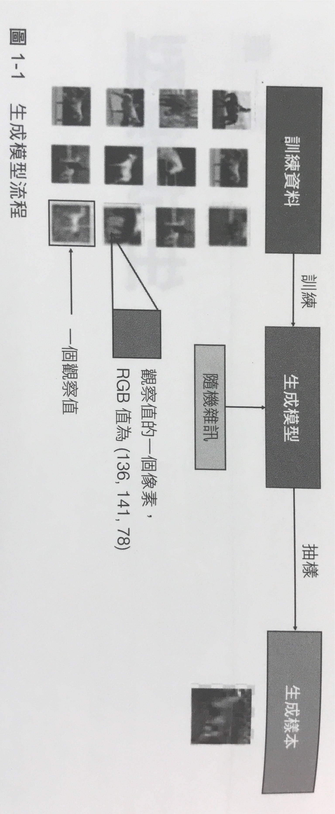

:PROPERTIES:
:ID:       47974f82-aec3-45ba-8222-303751f2f103
:END:
#+title: 生成對抗網路
#+SUBTITLE: 台南一中AI選修教材 / 顏永進
#+AUTHOR: 顏永進

#+TAGS: AI
#+INCLUDE: ../pdf.org
#+OPTIONS: toc:2 ^:nil num:5
#+PROPERTY: header-args :python :python "/Users/letranger/Dropbox/notes/roam/venv/bin/python3" :eval never-export
#+EXCLUDE_TAGS: noexport
#+latex:\newpage
#+HTML_HEAD: <link rel="stylesheet" type="text/css" href="../css/muse.css" />
#+HTML_HEAD_EXTRA: 

#+begin_export html

#+end_export

* GAN 的誕生：一杯啤酒改變世界

2014 年的一個夜晚，蒙特婁大學的研究生 Ian Goodfellow 和幾個朋友在酒吧裡討論一個問題：怎麼讓 AI 學會「創造」全新的圖片？

幾杯啤酒下肚後，Goodfellow 靈光一閃，提出了一個瘋狂的想法——如果讓兩個 AI 互相對抗，一個負責「造假」，一個負責「抓假」，它們會不會在互相競爭中變得越來越厲害？

朋友們覺得他瘋了。但 Goodfellow 回家後立刻開始寫程式，幾個小時內就做出了第一個能運作的 GAN。Meta 首席 AI 科學家 Yann LeCun 後來稱 GAN 是「深度學習領域過去二十年來最酷的概念」[fn:1]。

* 什麼是 GAN

GAN（Generative Adversarial Network，生成對抗網路）的核心概念可以用一個比喻來理解：

#+begin_quote
*偽鈔犯 vs 警察*

想像有一個偽鈔犯（生成器），他的目標是製造出以假亂真的假鈔。同時有一個警察（鑑別器），他的工作是辨別哪些是真鈔、哪些是假鈔。

一開始，偽鈔犯的技術很差，印出來的假鈔一眼就被看穿。但每次被抓到後，他都會研究「為什麼被識破」，然後改進技術。

同時，警察也在不斷進步——他見過的假鈔越多，鑑別能力就越強。

兩者不斷對抗、不斷進化。到最後，偽鈔犯印出來的「假鈔」已經完美到連警察都分不出真假——這就是 GAN 的精神。
#+end_quote

** 生成器（Generator）：偽鈔犯

生成器的工作是 *從隨機雜訊中創造出逼真的資料*。

- 輸入：一串隨機數字（稱為 latent vector 或 noise）
- 輸出：一張看起來「像真的」的圖片（或文字、音樂等）
- 目標：騙過鑑別器，讓它分不出真假

生成器是一種 *生成模型*（Generative Model），它學習的是資料的「產生方式」——理解馬的照片長什麼樣子，然後「畫」出一匹全新的、從未存在過的馬。

** 鑑別器（Discriminator）：警察

鑑別器的工作是 *判斷一筆資料是真的還是假的*。

- 輸入：一張圖片（可能是真的，也可能是生成器製造的假貨）
- 輸出：一個機率值（0~1），表示「這張圖是真的」的機率
- 目標：正確分辨真假

鑑別器是一種 *鑑別模型*（Discriminative Model），它學習的是「如何分類」——給定一張圖，判斷它是真實照片還是 AI 生成的。

** 生成器 vs 鑑別器 比較

| 比較項目 | 生成器 (Generator) | 鑑別器 (Discriminator) |
|----------+--------------------+------------------------|
| 角色 | 偽鈔犯 | 警察 |
| 輸入 | 隨機雜訊 | 圖片（真或假） |
| 輸出 | 假圖片 | 真假判斷（機率值） |
| 目標 | 騙過鑑別器 | 分辨真假 |
| 學習方式 | 無監督（沒有標籤） | 監督式（有真/假標籤） |
| 模型類型 | 生成模型（Generative） | 鑑別模型（Discriminative） |
| 數學描述 | 學習 $p(x)$：資料的分佈 | 學習 $p(y \vert x)$：給定資料判斷類別 |

** 訓練流程

GAN 的訓練就像是一場永無止境的攻防戰：

1. *初始化*：生成器和鑑別器都是隨機初始化的神經網路（兩個都是菜鳥）
2. *訓練鑑別器*：
   - 從真實資料集抽一批真圖片
   - 用生成器產生一批假圖片
   - 讓鑑別器看這些圖片，學習分辨真假
3. *訓練生成器*：
   - 生成器產生一批假圖片
   - 把假圖片丟給鑑別器判斷
   - 如果鑑別器看穿了 → 生成器調整參數，下次做得更像
   - 如果鑑別器被騙了 → 生成器的策略很成功，繼續保持
4. *重複*：交替訓練步驟 2 和 3，直到生成器做出的假圖片連鑑別器都分不出來

#+CAPTION: GAN 的生成器與鑑別器互動流程
#+name: fig:GAN-flow-1
#+ATTR_HTML: :width 500

* 用 Python 理解 GAN 的核心概念

完整的 GAN 需要用到深度學習框架（如 Keras/PyTorch），但我們可以用簡單的 numpy 來理解核心概念。

** 最簡單的 GAN：學習一個數字分佈

假設「真實資料」是一群服從常態分佈的數字（平均值=5，標準差=1）。生成器的任務是：從隨機雜訊中，學會產生看起來也像常態分佈的數字。

#+begin_src python -r -n :results output :exports both :session gan
import numpy as np
import matplotlib.pyplot as plt

np.random.seed(42)

# === 真實資料：常態分佈，平均值=5，標準差=1 ===
real_data = np.random.normal(loc=5.0, scale=1.0, size=1000)

# === 生成器：一開始什麼都不會，只會產生隨機數字 ===
# 生成器的參數：兩個可學習的數字 (mean, std)
gen_mean = 0.0  # 一開始猜平均值是 0（差很遠）
gen_std = 3.0   # 一開始猜標準差是 3（也差很遠）

print("=== GAN 訓練開始 ===\n")
print(f"真實資料：mean={np.mean(real_data):.2f}, std={np.std(real_data):.2f}")
print(f"生成器初始猜測：mean={gen_mean:.2f}, std={gen_std:.2f}")
print(f"（差好遠！生成器現在像是一個連鈔票長什麼樣都沒看過的偽鈔犯）\n")

# === 訓練迴圈 ===
learning_rate = 0.01
history = []

for epoch in range(500):
    # 生成器產生假資料
    fake_data = np.random.normal(loc=gen_mean, scale=abs(gen_std), size=100)

    # 計算生成器和真實資料的差距
    mean_diff = np.mean(real_data) - np.mean(fake_data)
    std_diff = np.std(real_data) - np.std(fake_data)

    # 更新生成器的參數（往真實資料靠近）
    gen_mean += learning_rate * mean_diff
    gen_std += learning_rate * std_diff

    if epoch % 100 == 0:
        history.append((epoch, gen_mean, abs(gen_std)))
        print(f"Epoch {epoch:3d}: gen_mean={gen_mean:.3f}, gen_std={abs(gen_std):.3f}")

# 最終結果
print(f"\n=== 訓練完成 ===")
print(f"真實資料：mean={np.mean(real_data):.3f}, std={np.std(real_data):.3f}")
print(f"生成器學到：mean={gen_mean:.3f}, std={abs(gen_std):.3f}")
print(f"\n生成器已經學會模仿真實資料的分佈了！")
#+end_src

** 視覺化：生成器的進化過程

#+begin_src python -r -n :results output :exports both :session gan
fig, axes = plt.subplots(1, 3, figsize=(15, 4))

# 真實資料
axes[0].hist(real_data, bins=50, alpha=0.7, color='blue', density=True)
axes[0].set_title('Real Data Distribution')
axes[0].set_xlim(-5, 15)

# 生成器一開始（亂猜）
fake_initial = np.random.normal(loc=0.0, scale=3.0, size=1000)
axes[1].hist(fake_initial, bins=50, alpha=0.7, color='red', density=True)
axes[1].set_title('Generator (Before Training)')
axes[1].set_xlim(-5, 15)

# 生成器訓練後
fake_final = np.random.normal(loc=gen_mean, scale=abs(gen_std), size=1000)
axes[2].hist(real_data, bins=50, alpha=0.5, color='blue', density=True, label='Real')
axes[2].hist(fake_final, bins=50, alpha=0.5, color='red', density=True, label='Generated')
axes[2].set_title('Generator (After Training)')
axes[2].set_xlim(-5, 15)
axes[2].legend()

plt.tight_layout()
plt.savefig("images/gan-1d-training.png", dpi=100)
plt.close()
print("圖表已儲存至 images/gan-1d-training.png")
print("\n觀察：訓練後，紅色（生成）和藍色（真實）幾乎完全重疊！")
print("這就是 GAN 的目標——讓生成的資料和真實資料無法區分。")
#+end_src

** 用 Keras 建立一個真正的 GAN（MNIST 手寫數字）

以下是一個簡化版的 GAN，它能學會從隨機雜訊中「畫」出手寫數字。我們來看看生成器和鑑別器的模型架構：

#+begin_src python -r -n :results output :exports both :session gan
import os
os.environ['TF_CPP_MIN_LOG_LEVEL'] = '3'
import keras
from keras import layers
import numpy as np

# === 生成器：把隨機雜訊變成 28x28 的圖片 ===
def build_generator():
    model = keras.Sequential([
        layers.Input(shape=(100,)),             # 輸入：100 維的隨機雜訊
        layers.Dense(256, activation='relu'),   # 先展開成 256 個神經元
        layers.Dense(512, activation='relu'),   # 再展開成 512 個
        layers.Dense(784, activation='sigmoid'),# 輸出 784 個值（28x28 像素）
        layers.Reshape((28, 28, 1))             # 重塑成圖片形狀
    ], name="Generator")
    return model

# === 鑑別器：判斷一張 28x28 的圖片是真是假 ===
def build_discriminator():
    model = keras.Sequential([
        layers.Input(shape=(28, 28, 1)),        # 輸入：28x28 的圖片
        layers.Flatten(),                       # 攤平成一維
        layers.Dense(512, activation='relu'),
        layers.Dense(256, activation='relu'),
        layers.Dense(1, activation='sigmoid')   # 輸出：0~1 的機率（真的機率）
    ], name="Discriminator")
    return model

generator = build_generator()
discriminator = build_discriminator()

print("=== 生成器架構 ===")
generator.summary()
print("\n=== 鑑別器架構 ===")
discriminator.summary()

# 測試：生成器能不能產生圖片？
noise = np.random.normal(0, 1, (1, 100))
fake_image = generator.predict(noise, verbose=0)
print(f"\n生成器輸出形狀：{fake_image.shape}")
print(f"像素值範圍：{fake_image.min():.3f} ~ {fake_image.max():.3f}")
print("（目前生成器還沒訓練，產生的只是隨機噪點）")
#+end_src

#+begin_quote
注意看生成器的架構：輸入是 100 個隨機數字，輸出是 784 個像素值（28x28）。這 100 個隨機數字就像是一個「密碼」，不同的密碼會產生不同的圖片。訓練完成後，只要輸入不同的隨機密碼，生成器就能「畫」出不同的手寫數字。
#+end_quote

* GAN 的實際應用

GAN 發明至今不到十年，卻已經在各個領域掀起革命：

** 影像生成

| 應用 | 技術 | 說明 |
|------+------+------|
| AI 生成人臉 | StyleGAN (NVIDIA) | 生成完全不存在的逼真人臉，[[https://thispersondoesnotexist.com/][This Person Does Not Exist]] 每次刷新都是全新的臉 |
| 文字轉圖片 | DALL-E、Midjourney、Stable Diffusion | 輸入文字描述，AI 直接「畫」出對應的圖片 |
| 風格轉換 | CycleGAN | 把照片變成莫內的畫風，或把馬變成斑馬 |
| 超解析度 | SRGAN | 把低畫質圖片變成高畫質（像是 CSI 影集裡「放大增強」終於成真了） |
| 修復老照片 | GFP-GAN | 把模糊的老照片修復成清晰的彩色照片 |

** 其他領域

- *遊戲與電影*：自動生成遊戲場景、角色、特效
- *時尚*：虛擬試衣——把不同衣服「穿」到你的照片上（ZARA 等品牌已在使用）
- *醫療*：生成合成醫療影像用於訓練（解決真實資料不足的問題）
- *資安*：生成對抗樣本來測試 AI 系統的安全性

** Deepfake：GAN 的陰暗面

GAN 也帶來了嚴重的問題。Deepfake 利用 GAN 技術，可以：
- 把 A 的臉換到 B 的身體上（換臉影片）
- 模仿某人的聲音說任何話（語音合成）
- 製造假的政治人物影片（假新聞）

#+begin_quote
「偉大的力量伴隨偉大的責任。」GAN 能創造出美麗的藝術作品，也能製造出危險的假資訊。學習這項技術的同時，我們也必須學會如何辨別真偽、負責任地使用 AI。
#+end_quote

* GAN 的訓練困難

訓練 GAN 出了名地困難，就像是在走鋼絲——稍有不慎就會掉下去。常見的問題：

** 模式崩塌（Mode Collapse）
生成器發現只要一直產生同一種圖片就能騙過鑑別器，於是它就懶得學其他的了。就像偽鈔犯發現只要印千元鈔就不會被抓，於是他就只會印千元鈔，不會印五百元或一百元的。

** 訓練不穩定
生成器和鑑別器必須保持平衡。如果鑑別器太強，生成器怎麼努力都騙不過去，就會放棄學習；如果鑑別器太弱，生成器不用努力就能過關，也學不到東西。

#+begin_src python -r -n :results output :exports both :session gan
# 模擬 GAN 訓練的三種狀況
import numpy as np

scenarios = {
    "理想狀態（雙方平衡）": {
        "gen_loss": [2.0, 1.5, 1.2, 1.0, 0.8, 0.7, 0.69, 0.69, 0.69, 0.69],
        "disc_loss": [0.3, 0.5, 0.6, 0.65, 0.68, 0.69, 0.69, 0.69, 0.69, 0.69],
    },
    "鑑別器太強（生成器學不會）": {
        "gen_loss": [5.0, 6.0, 7.0, 8.0, 10.0, 12.0, 15.0, 20.0, 25.0, 30.0],
        "disc_loss": [0.01, 0.005, 0.002, 0.001, 0.001, 0.0, 0.0, 0.0, 0.0, 0.0],
    },
    "模式崩塌（生成器偷懶）": {
        "gen_loss": [2.0, 1.0, 0.3, 0.1, 0.1, 0.1, 0.1, 0.1, 0.1, 0.1],
        "disc_loss": [0.5, 0.8, 0.5, 0.3, 0.5, 0.3, 0.5, 0.3, 0.5, 0.3],
    },
}

fig, axes = plt.subplots(1, 3, figsize=(15, 4))
for idx, (name, data) in enumerate(scenarios.items()):
    epochs = range(1, 11)
    axes[idx].plot(epochs, data["gen_loss"], 'r-o', label='Generator Loss', markersize=4)
    axes[idx].plot(epochs, data["disc_loss"], 'b-s', label='Discriminator Loss', markersize=4)
    axes[idx].set_title(name, fontsize=11)
    axes[idx].set_xlabel('Epoch')
    axes[idx].set_ylabel('Loss')
    axes[idx].legend(fontsize=8)
    axes[idx].grid(True, alpha=0.3)

plt.tight_layout()
plt.savefig("images/gan-training-scenarios.png", dpi=100)
plt.close()
print("圖表已儲存至 images/gan-training-scenarios.png")
print()

for name, data in scenarios.items():
    final_g = data["gen_loss"][-1]
    final_d = data["disc_loss"][-1]
    print(f"{name}:")
    print(f"  最終 Generator Loss = {final_g:.2f}, Discriminator Loss = {final_d:.2f}")
    if abs(final_g - 0.69) < 0.1 and abs(final_d - 0.69) < 0.1:
        print(f"  → 兩者 loss 都收斂到 ~0.69（ln2），代表雙方勢均力敵！")
    elif final_g > 10:
        print(f"  → 生成器 loss 爆炸，學不到任何東西")
    else:
        print(f"  → 鑑別器 loss 不穩定震盪，可能發生了模式崩塌")
    print()
#+end_src

* GAN 的進化

GAN 自 2014 年以來不斷進化，產生了許多變體：

| 模型 | 年份 | 特色 |
|------+------+------|
| GAN | 2014 | 原始版本，全連接層 |
| DCGAN | 2015 | 用卷積神經網路取代全連接層，生成更好的圖片 |
| Pix2Pix | 2016 | 圖片到圖片的轉換（如素描→照片、黑白→彩色） |
| CycleGAN | 2017 | 不需要配對資料的風格轉換（馬→斑馬） |
| StyleGAN | 2018 | NVIDIA 的傑作，能生成超逼真人臉 |
| StyleGAN2 | 2019 | 修正 StyleGAN 的瑕疵，品質更上一層 |
| Diffusion Models | 2020+ | 新一代生成模型，DALL-E 2 和 Stable Diffusion 的基礎（嚴格來說不是 GAN，但受 GAN 啟發） |

#+begin_quote
有趣的是，2022 年以後最熱門的影像生成技術（如 Stable Diffusion）其實已經不用 GAN 了，而是用 *擴散模型*（Diffusion Model）。但 GAN 的「兩個模型互相對抗」的概念，至今仍是 AI 領域最具影響力的思想之一。
#+end_quote

* 作業
** 作業一：真假難辨大挑戰

GAN 生成的圖片越來越逼真，你能分辨真假嗎？

*** 任務說明

1. 前往 [[https://www.whichfaceisreal.com/][Which Face Is Real?]] 網站
2. 進行至少 *20 輪* 真假人臉判斷
3. 記錄你的正確率
4. 寫一篇 150-200 字的心得，回答以下問題：
   - 你的正確率是多少？你覺得意外嗎？
   - 你是根據什麼特徵來判斷真假的？（提示：注意背景、耳環、眼鏡、頭髮邊緣、牙齒等細節）
   - 如果 AI 生成的人臉已經這麼逼真，可能帶來哪些社會問題？

*** 繳交內容
#+begin_example
=== 真假人臉判斷記錄 ===
總測試次數：20 次
答對次數：XX 次
正確率：XX%

我的判斷策略：
  - 觀察 XXX 特徵...
  - 注意 XXX 細節...

心得（150-200字）：
  ......
#+end_example

** 作業二：我的 GAN 訓練模擬器

在上面的 1D GAN 範例中，生成器要學習模仿 =mean=5, std=1= 的常態分佈。現在請你修改程式碼，讓生成器學習不同的目標分佈。

*** 任務說明

分別設定以下 3 種真實資料分佈，訓練生成器並觀察結果：

1. =mean=0, std=2=（平均值 0，標準差 2）
2. =mean=-3, std=0.5=（平均值 -3，標準差 0.5）
3. 混合分佈：50% 的資料來自 =mean=2, std=0.5=，50% 來自 =mean=8, std=0.5=（雙峰分佈）

*提示：* 混合分佈可以這樣產生：
#+begin_src python -r -n :results output :exports both :eval no
part1 = np.random.normal(loc=2, scale=0.5, size=500)
part2 = np.random.normal(loc=8, scale=0.5, size=500)
real_data = np.concatenate([part1, part2])
#+end_src

*** 思考問題
第 3 題的雙峰分佈，生成器能學會嗎？為什麼？（提示：我們的生成器只有兩個參數 =mean= 和 =std=，而雙峰分佈至少需要 4 個參數）

*** 預期輸出格式
#+begin_example
=== 分佈 1：mean=0, std=2 ===
真實：mean=0.00, std=2.00
學到：mean=X.XX, std=X.XX  ✓ 成功

=== 分佈 2：mean=-3, std=0.5 ===
真實：mean=-3.00, std=0.50
學到：mean=X.XX, std=X.XX  ✓ 成功

=== 分佈 3：雙峰分佈 ===
真實：mean=5.00, std=3.XX
學到：mean=X.XX, std=X.XX  ✗ 失敗（形狀不對）
結論：簡單的生成器無法學會複雜分佈，這就是為什麼需要神經網路！
#+end_example

** 作業三：AI 藝術評論家

AI 生成的藝術作品究竟算不算「藝術」？這個問題從 GAN 誕生以來就爭論不休。2022 年，一幅 AI 生成的畫作甚至贏得了科羅拉多州藝術博覽會的首獎，引發了巨大爭議。

*** 任務說明

1. 用任何一個 AI 繪圖工具（如 ChatGPT 的 DALL-E、Bing Image Creator、或其他免費工具）生成一張圖片
2. 把你使用的 prompt（提示詞）記錄下來
3. 撰寫一篇 200-300 字的「AI 藝術評論」，討論以下問題：
   - 你覺得這張圖片「美」嗎？為什麼？
   - 你認為 AI 生成的作品算不算「藝術」？理由是什麼？
   - 如果一個人用 AI 生成了一張圖片並拿去賣錢，這合理嗎？版權歸誰？
   - 你覺得 AI 繪圖工具對人類藝術家是威脅還是工具？

*** 繳交內容
1. 你生成的圖片（截圖）
2. 使用的工具名稱和 prompt
3. 200-300 字的評論

** 作業參考解答                                                    :noexport:
*** 作業一參考解答
常見的 GAN 生成人臉破綻：
- *背景*：背景常有不自然的模糊或扭曲
- *不對稱*：耳環只有一邊、眼鏡歪斜
- *頭髮邊緣*：與背景交界處常有奇怪的融合
- *牙齒*：數量不對或形狀奇怪
- *文字/Logo*：衣服上的文字通常是亂碼

一般人在 Which Face Is Real 上的正確率約 60-70%，比隨機猜（50%）好一些但不多，這說明 GAN 的生成品質已經非常高。

社會問題討論重點：
- Deepfake 假影片可能被用於詐騙、政治操弄
- 身份盜用（用你的臉做不好的事）
- 假新聞更難辨別
- 數位內容的信任危機

*** 作業二參考解答
- 分佈 1 和 2：生成器能成功學會，因為目標是單峰常態分佈，生成器的兩個參數（mean, std）足以描述
- 分佈 3（雙峰）：生成器會失敗！
  - 它會學到 mean ≈ 5（兩個峰的中間），std ≈ 3（很大）
  - 但生成出來的是一個寬寬的單峰分佈，不是兩個尖尖的峰
  - 這說明了：如果生成器的結構（capacity）不夠複雜，就無法學會複雜的資料分佈
  - 真正的 GAN 用神經網路當生成器，有數百萬個參數，所以能學會非常複雜的分佈

*** 作業三參考解答
開放性作業，評分重點：
- 是否有嘗試使用 AI 繪圖工具
- 評論是否有自己的觀點（不是全部抄 ChatGPT）
- 是否有討論到版權和倫理問題
- 論述是否合理、有邏輯

常見觀點整理：
- 「AI 只是工具，就像相機取代了肖像畫家」→ 支持 AI 藝術
- 「藝術需要情感和意圖，AI 沒有」→ 反對 AI 藝術
- 版權問題目前法律尚未明確，各國規定不同
- 比較平衡的觀點：AI 是強大的創作輔助工具，但不應取代人類的創意思考

* 學習資源
- [[https://www.youtube.com/watch?v=4OWp0wDu6Xw][李宏毅：GAN 課程]]
- [[https://thispersondoesnotexist.com/][This Person Does Not Exist：AI 生成的人臉]]
- [[https://www.whichfaceisreal.com/][Which Face Is Real：測試你能否分辨真假人臉]]
- [[https://github.com/eriklindernoren/Keras-GAN][Keras-GAN：各種 GAN 的 Keras 實作]]

* Footnotes

[fn:1]  [[https://www.books.com.tw/products/E050141335][AI無所不在的未來, Rule of the Robots]], P.248
