:PROPERTIES:
:ID:       a2cc4686-5e51-46e4-84b3-e930dccb4b91
:ROAM_ALIASES: Google CoLab
:END:
#+title: CoLab
#+OPTIONS: toc:2 ^:nil num:3
#+TAGS: Python, Basic
#+PROPERTY: header-args :eval never-export
#+include: ../pdf.org
#+EXCLUDE_TAGS: noexport
#+HTML_HEAD: <link rel="stylesheet" type="text/css" href="../css/muse.css" />

#+begin_export html
</a>

#+end_export

Google Colaboratory 是一個基於雲端的Python開發環境，由Google提供開發者虛擬機，提供免費的GPU和TPU資源，並支援Python程式及機器學習TensorFlow演算法。Google Colab具有強大的協作功能，可以與他人共享和編輯程式碼，支援Jupyter筆記本，並提供預裝的Python套件，方便進行數據分析、機器學習等任務。

總之，如果你是一個Python初學者或是剛要開始學習機器學習的學生，Google Colaboratory是你非常好的選擇，它提供了一個簡單易用的環境，讓你可以專注於學習Python和機器學習，而不需要擔心環境配置和資源限制。

#+CAPTION: Google Colaboratory
#+LABEL:fig:Labl
#+name: fig:Name
#+ATTR_LATEX: :width 300
#+ATTR_ORG: :width 300
#+ATTR_HTML: :width 500
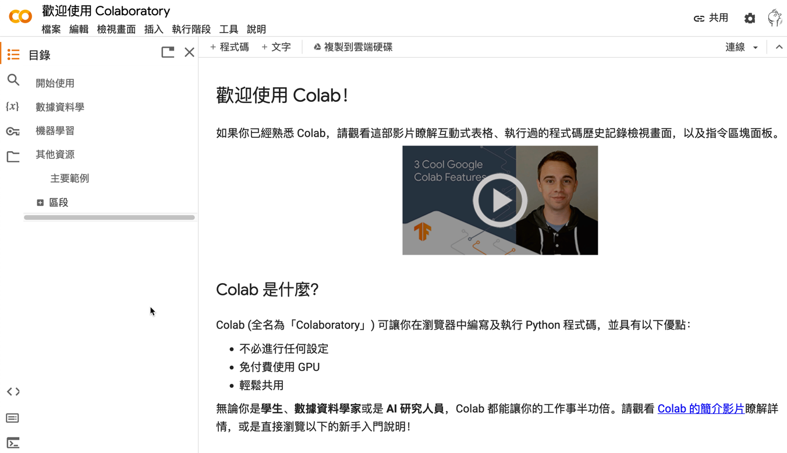

* Colab編寫環境
當我們透過瀏覽器連上、登入Colab，Google就幫我們建立了一個虛擬機，我們在上面寫的程式就在Colab的虛擬機上執行。
- [[https://colab.research.google.com/drive/1IowJ_8ZYdGLCdxCJarYbhR_haic66v30?usp=sharing][20231111專題式程式教學1-Colab環境.ipynb]]
- 儲存格的類型
- Text Cell
- 練習1
- Code Cell: 輸出
- Code Cell: 輸入
** Colab的預設目錄
Colab的虛擬機有CPU、記憶體、磁碟空間等資源(如圖[[fig:Colab-1]])
#+CAPTION: Colab虛擬機的系統資源
#+LABEL:fig:Labl
#+name: fig:Colab-1
#+ATTR_LATEX: :width 300
#+ATTR_ORG: :width 300
#+ATTR_HTML: :width 300
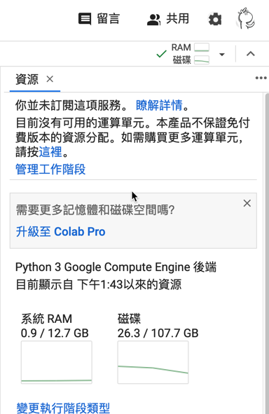

預設的磁碟所在目錄位置為/content，裡面有一個資料夾sample_data。這裡的pwd是linux指令，顯示目前所在的目錄位置，而ls則是列出目前目錄下的檔案與資料夾。這些指令可以讓我們了解Colab虛擬機的檔案系統結構。
#+begin_src python -r -n :results output :exports both
!pwd
!ls
#+end_src
#+RESULTS:
: /content
: sample_data
** 上傳檔案到Colab中
在Colab中執行AI相關的運算有時需要將你自己的檔案上傳到Colab的雲端磁碟中，這些檔案也許是你想要辨識的圖片、也許是你想進行預測結果的實驗數據。有兩種模式可以將你的檔案儲存到磁碟中：
*** 有時效的Colab雲端硬碟
有兩種方式:網頁模式與程式模式，要留意的是這些上傳的檔案在Colab執行階段被刪除後就會消失，就算我們沒有手動刪除現行的Colab運算，這個運算在12小時後也會被自動刪除。
**** 網頁模式
第一種方式是直接點選點圖[[fig:uploadFile]]中的上傳圖案，選取本地端的檔案後上傳至雲端硬碟中
#+CAPTION: 將檔案上傳至Colab雲端硬碟
#+LABEL:fig:Labl
#+name: fig:uploadFile
#+ATTR_LATEX: :width 300
#+ATTR_ORG: :width 300
#+ATTR_HTML: :width 300
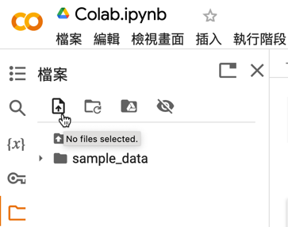
**** 程式模式
第二種方式是引入google.colab，使用files.upload()函式來上傳檔案
#+begin_src python -r -n :results output :exports both
from google.colab import files
uploaded = files.upload()
#+end_src
#+CAPTION: 使用程式上傳本地端檔案
#+LABEL:fig:Labl
#+name: fig:Name
#+ATTR_LATEX: :width 300
#+ATTR_ORG: :width 300
#+ATTR_HTML: :width 500
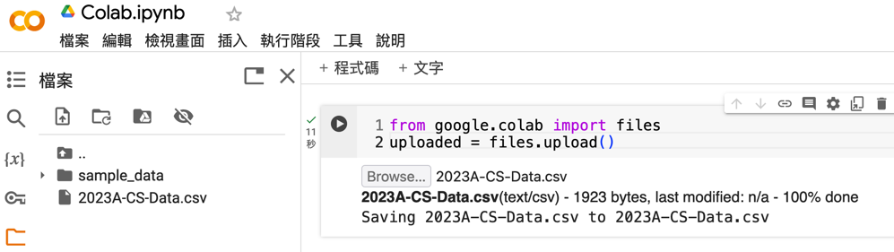
*** 從Colab連線到自己的Google drive
前述模式只能儲存臨時的檔案，這些檔案在你重新啟動colab後也會被一併刪除。第二種方式是 *允許* Colab直接存取我們的Google Drive (這個動作在作業系統的世界裡叫做mount)，有兩種方式可以完成此項設定：網頁拖拽與程式執行。
**** 網頁操作
1. 點選圖[[fig:linkGD1]]中的"掛載雲端硬碟"圖示
2. 在對話框中點選"連網至Google雲端硬碟"
完成後，在現行目錄下會多出一個drive的資料夾。
#+CAPTION: 手動掛載Google Drive
#+LABEL:fig:Labl
#+name: fig:linkGD1
#+ATTR_LATEX: :width 300
#+ATTR_ORG: :width 300
#+ATTR_HTML: :width 600
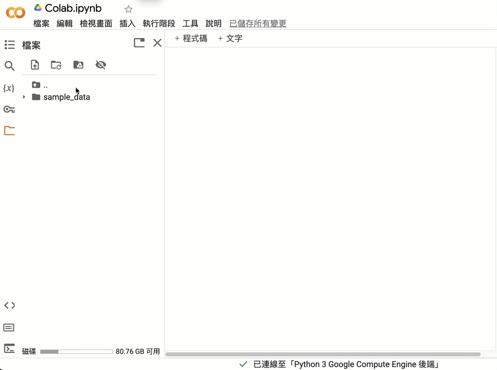
drive資料夾裡還有幾個資料夾，其中MyDrive就是你自己的雲端硬碟，如果有其他人曾經透過Google Drive分享檔案給你，那你還會看到SharedDrives資料夾。
#+CAPTION: Colab連結Google Drive
#+LABEL:fig:Labl
#+name: fig:Name
#+ATTR_LATEX: :width 300
#+ATTR_ORG: :width 300
#+ATTR_HTML: :width 300
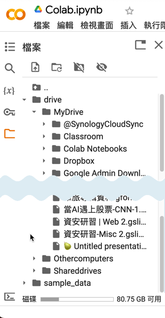
**** 程式執行
第二種連結Google Drive的方式是執行以下程式
#+begin_src python -r -n :results output :exports both
from google.colab import drive
drive.mount('/content/drive')
#+end_src
因為是程式執行，其實你也可以自行為這個被mount的資料夾命名，例如叫做GDrive:
#+begin_src python -r -n :results output :exports both
from google.colab import drive
drive.mount('/content/gDrive')
#+end_src
** Colab的notebook存在哪?
我們在Colab所輸入的指令、程式執行的結果都儲存在一個副檔名為ipynb的筆記本中，這個檔案的預設檔名為UntitledX.ipynb(如圖[[fig:untitled]])，預設的儲存資料夾是在Google Drive裡的Colab Notebooks資料夾裡(如圖[[fig:notebook]])。

請養成習慣把這些UntitledXX的檔名修改成符合筆記本內容的名稱，否則以後你會在Colab Notebooks裡看到Untitled0.ipynb、Untitled1.ipynb、Untitled2.ipynb、Untitled3.ipynb.....Untitled999.ipynb這樣的畫面Q_Q。

#+CAPTION: Colab筆記本
#+LABEL:fig:Labl
#+name: fig:untitled
#+ATTR_LATEX: :width 300
#+ATTR_ORG: :width 300
#+ATTR_HTML: :width 500
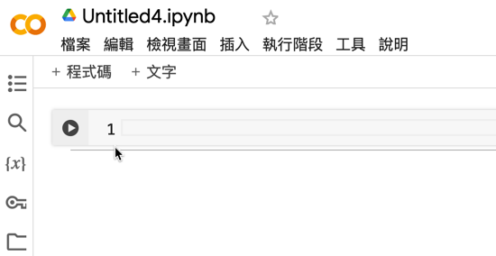

#+CAPTION: Colab筆記本的儲存位置
#+LABEL:fig:Labl
#+name: fig:notebook
#+ATTR_LATEX: :width 300
#+ATTR_ORG: :width 300
#+ATTR_HTML: :width 500
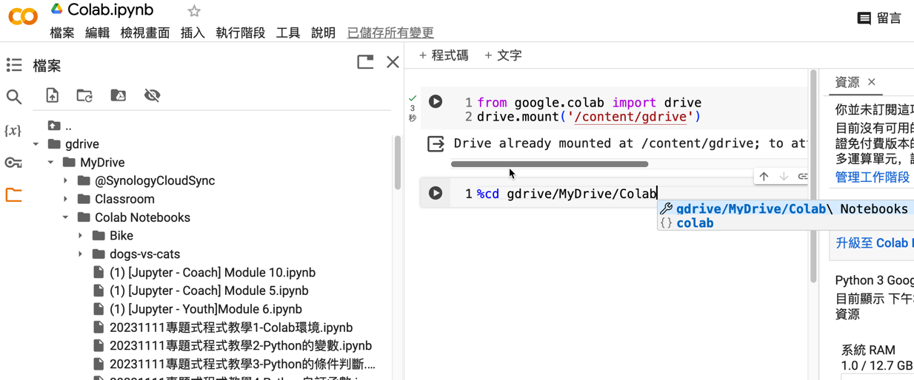

* Text Cell和Code Cell
在 Google Colaboratory 中， *儲存格(Cells)* 是編寫與執行筆記本的基本單元。主要分為兩種類型：Text Cell 和 Code Cell。
** Text Cell
Text Cell 用於輸入說明文字、標題、公式或其他非程式碼的內容，以便為程式碼提供註解或結構化說明。支持 Markdown 語法，可以使用簡單的標記進行格式化。
用途
- 撰寫筆記與說明。
- 添加標題和子標題。
- 插入數學公式（使用 LaTeX 語法）。
- 美化筆記結構，讓內容更易於閱讀。
*** 常見 Markdown 語法
**** 標題： 使用 # 進行分級：
#+begin_src markdown 
# 標題 1
## 標題 2
### 標題 3
#+end_src
**** 加粗與斜體：
#+begin_src markdown -r -n :results output :exports both
加粗：**文字**
斜體：*文字*
#+end_src
**** 清單：
***** 無序清單：- 或 * 開頭。
#+begin_src markdown -r -n :results output :exports both
- 第一項
- 第二項
#+end_src
***** 有序清單：數字加點號。
#+begin_src markdown -r -n :results output :exports both
1. 第一項
2. 第二項
#+end_src
**** 數學公式： 使用 $...$ 或 \($$...$$\) 包裹 LaTeX 公式：
#+begin_src markdown -r -n :results output :exports both
行內公式：$a^2 + b^2 = c^2$
區塊公式：$$$a^2 + b^2 = c^2$$
#+end_src
行內公式和區塊公式的差異是：前者可以顯示在行內，後者則會在下一行置中呈現，變成一個獨立的區塊公式。
- 這是行內公式：$a^2 + b^2 = c^2$
- 這是區塊公式：$$a^2 + b^2 = c^2$$
** Code Cell
Code Cell 用於編寫 Python 程式碼並執行。Colab 提供了即時執行環境，允許你在瀏覽器中直接運行程式碼。
*** 用途
- 實際編寫與執行程式碼。
- 測試數據分析、機器學習模型。
- 可即時顯示執行結果（如圖表或輸出文字）。
*** 功能與特性
- 輸入程式碼： 在儲存格中輸入 Python 程式碼，按下 Shift + Enter 即可執行。
  #+begin_src python -r -n :results output :exports both
print("Hello World.")
  #+end_src

  #+RESULTS:
  : Hello World.

- 輸出結果：
  - 執行後，結果直接顯示在 Code Cell 下方。
  - 支持文字、數據表、圖形等多種格式的輸出。
- 導入套件與使用命令： Colab 支持直接執行 shell 指令（以 ! 開頭），如果你想在 Code Cell 中使用 Linux 命令，可以在指令前加上驚嘆號（!），如此一來它就不會被當成 Python 程式碼，而是直接執行 Linux 命令。例如，使用 !ls 可以列出目前目錄下的檔案與資料夾，或是使用 !pip install 安裝 Python 套件。
  #+begin_src shell -r -n :results output :exports both
!ls  # 查看目錄內容
!pip install numpy  # 安裝 numpy 套件
  #+end_src

* 有用和沒用的功能
** AI輔助
Google Colaboratory 提供了許多內建功能，有些功能能顯著提高效率，而有些則可能讓用戶感到繁瑣或無聊。在這裡，我們介紹兩種功能：AI輔助功能 和 動畫特效，幫助使用者了解其實用性。
*** AI 輔助功能
Colab 的 AI 輔助功能致力於幫助使用者快速生成程式碼、修正錯誤，或者根據上下文提供建議。
功能特點
- 智慧提示：輸入程式碼時，自動提供函數補全或參數建議。
- 錯誤修正：在程式執行錯誤時，會根據報錯提供修正建議，並推薦相關的資源或文件。
- 程式生成：利用 Colab 提供的 AI 工具，快速生成範例程式碼，適合初學者或快速測試想法。
*** 設定
點選右上角設定、開啟AI輔助功能
#+CAPTION: 設定ColabAI輔助功能
#+LABEL:fig:Labl
#+name: fig:Name
#+ATTR_LATEX: :width 300
#+ATTR_ORG: :width 300
#+ATTR_HTML: :width 500
#+attr_org: :width 600px
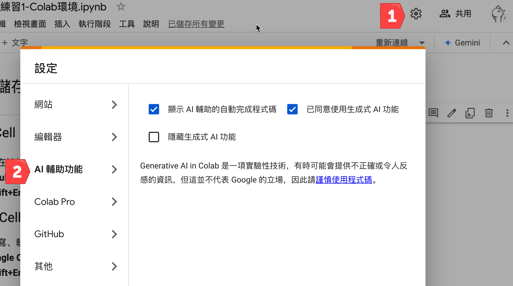

*** 教學範例
**** 使用智慧提示與補全
#+begin_src python -r -n :results output :exports both
# 輸入 plt.
# Colab 自動提示 matplotlib.pyplot 的函數選項
import matplotlib.pyplot as plt
#+end_src
**** 自動生成程式碼
在 Colab 中輸入：
#+begin_src python -r -n :results output :exports both
#如何計算陣列的平均值？
#+end_src
AI 輔助會生成程式碼範例：
#+begin_src python -r -n :results output :exports both
#如何計算陣列的平均值？
import numpy as np
arr = [1, 2, 3, 4, 5]
mean = np.mean(arr)
print(f"陣列的平均值為：{mean}")
#+end_src
** 無聊動畫與打字特效
Colab 內建一些無聊的特效，例如「動畫字體效果」或「輸出時的打字效果」，雖然有趣，但在大多數情況下並不實用。
*** 設定
點選右上角設定、開啟打字效果（效能等級）或其他廢廢的特效。
#+CAPTION: 設定Colab動畫與打字特效
#+LABEL:fig:Labl
#+name: fig:Name
#+ATTR_LATEX: :width 300
#+ATTR_ORG: :width 300
#+ATTR_HTML: :width 500
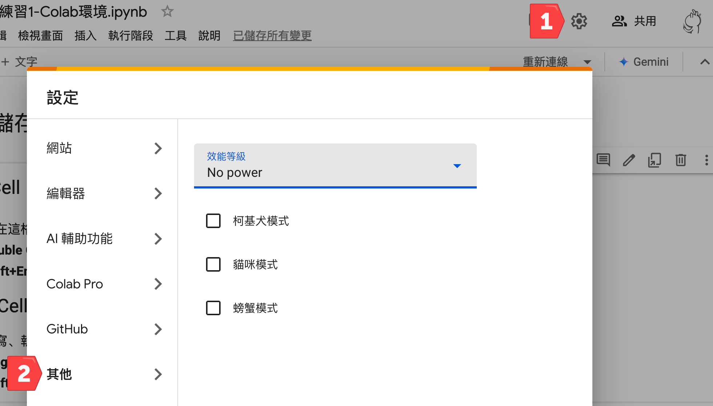

* GPU執行階段
** 如何確定有在跑 GPU:
#+begin_src python -r -n :results output :exports both
import tensorflow as tf
gpu_name = tf.test.gpu_device_name()
if gpu_name != '/device:GPU:0':
  raise SystemError('無 GPU')
print(f'有 GPU: {gpu_name}')
#+end_src
** 在CoLab中使用GPU
1. 執行階段/變更執行階段類型
2. 硬體加速器
#+CAPTION: 標題
#+LABEL:fig:Labl
#+name: fig:Name
#+ATTR_LATEX: :width 300
#+ATTR_ORG: :width 300
#+ATTR_HTML: :width 500
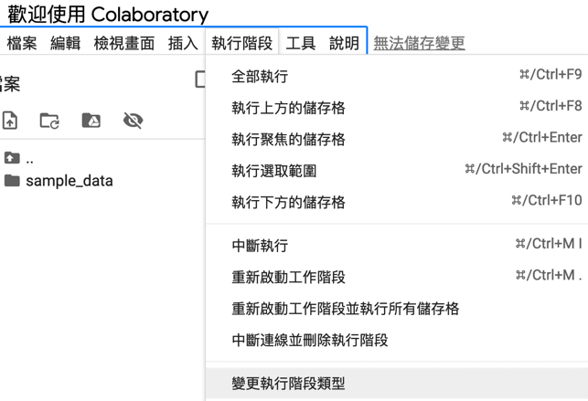

#+CAPTION: 標題
#+LABEL:fig:Labl
#+name: fig:Name
#+ATTR_LATEX: :width 300
#+ATTR_ORG: :width 300
#+ATTR_HTML: :width 500

** 查看使用的GPU類型
*** Colab
#+begin_src python -r -n :results output :exports both
!nvidia-smi -L
#+end_src
#+CAPTION: 標題
#+LABEL:fig:Labl
#+name: fig:Name
#+ATTR_LATEX: :width 300
#+ATTR_ORG: :width 300
#+ATTR_HTML: :width 500
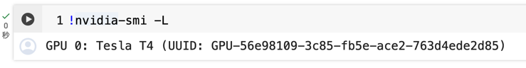
*** Linux
#+begin_src shell -r -n :results output :exports both
nvidia-smi -L
#+end_src
#+CAPTION: 標題
#+LABEL:fig:Labl
#+name: fig:Name
#+ATTR_LATEX: :width 300
#+ATTR_ORG: :width 300
#+ATTR_HTML: :width 500
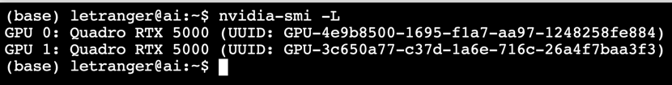

* 進階操作
** Command Line
 Colab 其中一個厲害的地方就是，你除了可以執行 Python、也能執行 Command Line，只要在 Command Line 指令加上驚嘆號就能做到，像是 !mkdir。你可以在 Colab 裡 Python 程式碼寫到一半的時候，突然加進幾行 Command Line 來操作檔案，完成後，再讓 Python 程式碼接著寫下去，Python 與 Command Line 可以無痛切換。更厲害的是，Colab 甚至讓你在同一段程式碼裡 Python 和 Command Line 能夠 混合使用，例如，可以把 !ls 輸出的內容存進 Python 變數裡[fn:1]。

此外，Colab 還有「魔法」指令（Magic Command），這個指令的寫法是在最前面加上 % 或 %% 符號，例如 %timeit，Magic 為 Colab 補充一些方便的功能。筆者最常用的功能有二：

- %%timeit：算出你的程式碼區塊花多少時間執行，分析你的演算法效率時很好用
- %run my_script.py：執行你的另一個 Python 程式，如果你的程式還需要呼叫另一個程式，就需要使用這個 Magic 指令
** Google 提供的 VM
#+begin_src shell -r -n :results output :exports both
!pwd
!cat /proc/meminfo
!cat  /proc/cpuinfo
#+end_src
- use colab to mount google drive
- 同時最多 5 個 session
- 每個 session 最多 24hr
- 查看 colab 已安裝了哪些 package
  #+begin_src shell -r -n :results output :exports both
  !pip list
  #+end_src

* Footnotes

[fn:1] [[https://haosquare.com/why-google-colab-python/][為什麼我超愛用 Google Colab？Python 菜鳥與老手都適合的利器]]
