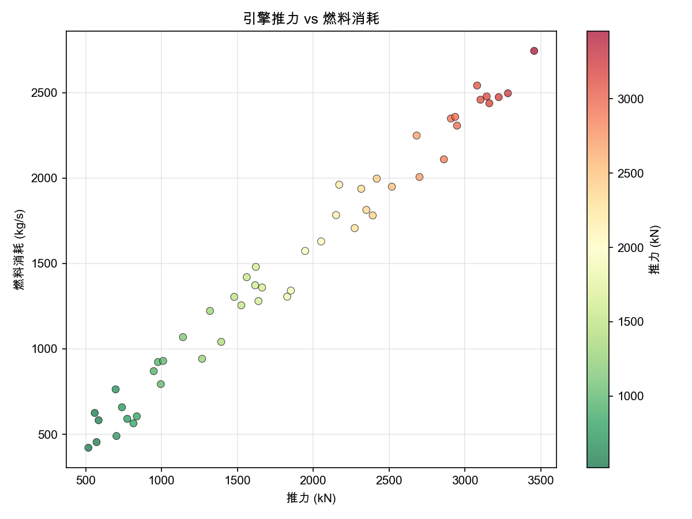
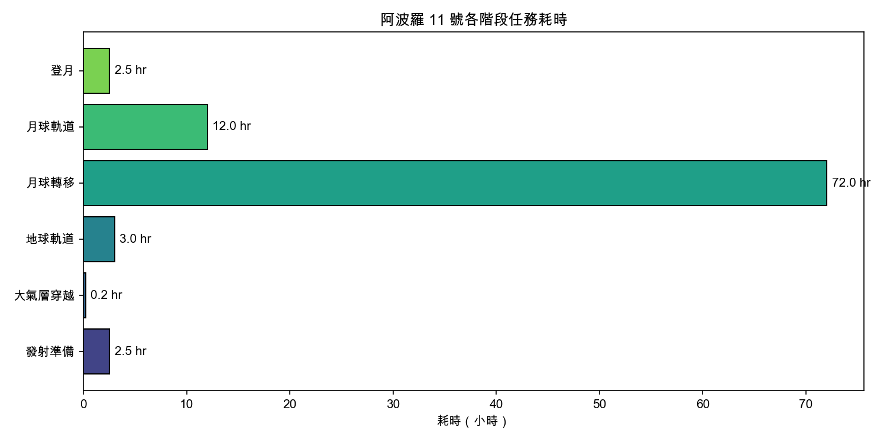
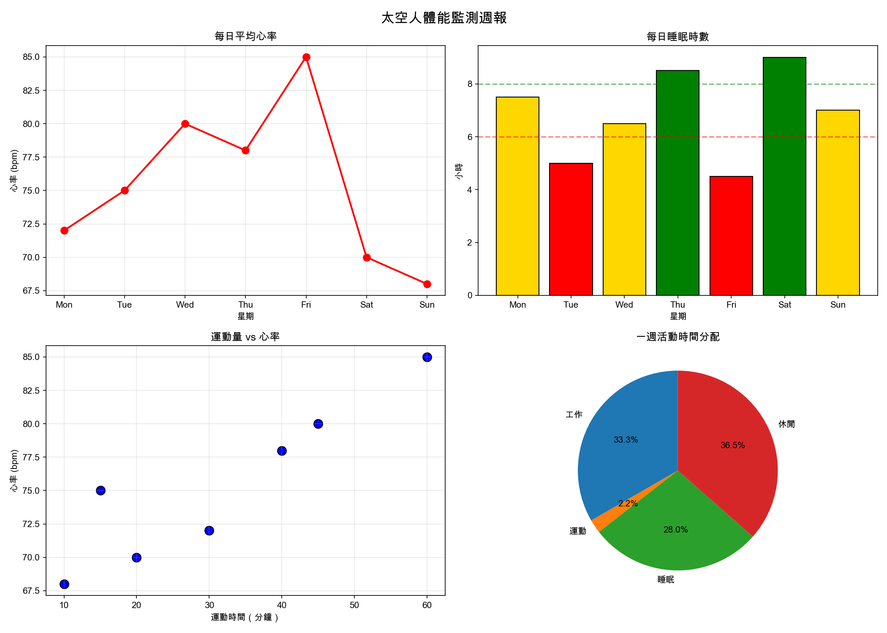

#+title: 時空旅行社：用 Python 拯救被 Bug 吞噬的世界
# -*- org-export-babel-evaluate: nil -*-
#+INCLUDE: ../pdf-m1.org
#+TAGS: Python, Colab, Numpy, Matplotlib, Pandas, 爬蟲, GUI
#+OPTIONS: toc:2 ^:nil num:5
#+OPTIONS: H:4
#+PROPERTY: header-args :python :python "/Users/letranger/Dropbox/notes/roam/venv/bin/python3" :eval never-export
#+HTML_HEAD: <link rel="stylesheet" type="text/css" href="../css/muse.css" />
#+HTML_HEAD_EXTRA: 
#+EXCLUDE_TAGS: noexport
#+latex:\newpage
#+begin_export html

#+end_export

* 序章：歡迎來到時空旅行社

學校地下室的老舊電腦教室裡，有一台從來沒人用過的古董電腦。某天放學後，你不小心按下了一個看起來像「Enter」但其實刻著奇怪符號的按鍵，螢幕上冒出一行字：

#+begin_example
> 歡迎來到「時空旅行社」。本系統偵測到你的世界正在崩壞中。
> 原因：有人在時間線上埋了 Bug。
> 修復方式：學會 Python，逐一修復六個時代的資料異常。
> 警告：若不修復，你的學期成績將從時間線上消失。
#+end_example

你環顧四周，確認沒有人在整你之後，決定接受這個任務——畢竟，比起學期成績消失，學 Python 聽起來還算可以接受。

螢幕閃了一下，一隻橘貓從像素中慢慢浮現。牠戴著一副過小的眼鏡，尾巴尖端發著微光。

「喵。我是編譯醬，時空旅行社的導航 AI。」牠開口說話的時候，你注意到牠的語氣裡帶著一種「我已經帶過八百個實習生了」的疲憊感。

「在你問之前：是的，我是一隻貓；不，這不是夢；是的，你的成績真的會消失。」

#+begin_quote
*時空旅行社基本資訊*
- 社長：編譯醬（一隻會說話的橘貓，自稱未來 AI）
- 座右銘：「所有的 Bug 都是暫時的，只有 Deadline 是永恆的。」
- 任務數量：6 個時代，6 個 Bug
- 獎勵：每修復一個時代，獲得一枚「除錯徽章」
- 懲罰：寫出 SyntaxError 時，編譯醬會用憐憫的眼神看你三秒鐘然後嘆氣
#+end_quote

-----

* 任務1. 環境建置（Colab）
:PROPERTIES:
:CUSTOM_ID: mission-1-colab
:END:

#+begin_quote
📍 時空座標：西元 3025 年・未來太空站
🎭 你的身份：時空旅行社實習生（無薪）
🐱 編譯醬語錄：「未來人類早就不用本機開發了。你還在用本機？難怪你從過去來的。」
#+end_quote

時空旅行社的傳送裝置需要一個「雲端控制台」才能啟動。編譯醬告訴你，未來人類所有程式都在雲端執行。你的第一個任務：學會使用 Google Colab——時空旅行社的官方控制台。

** A：認識 Colab 介面與 Cell 操作
:PROPERTIES:
:CUSTOM_ID: mission-1a
:END:

#+begin_quote
🐱 編譯醬小教室：

Google Colab 是 Google 提供的免費雲端 Python 開發環境。你只需要一個瀏覽器就能寫程式、跑程式、甚至訓練 AI 模型。

Colab 的基本單位是 Cell（儲存格），有兩種：
- *程式碼 Cell*：寫 Python 程式的地方，按 Shift+Enter 執行
- *文字 Cell*：寫筆記的地方，支援 Markdown 語法
#+end_quote

*你的第一個任務：*

在 Colab 中建立一個程式碼 Cell，輸入以下程式碼並執行：

#+begin_src python -r -n :results output :exports both :session colab
# 你的第一行 Python 程式
print("時空旅行社，啟動！")
#+end_src

#+RESULTS:
: 時空旅行社，啟動！

#+begin_quote
🐱 編譯醬：「恭喜，你成功執行了你人生中最簡單的程式。別太驕傲，後面會讓你哭的。」
#+end_quote

** B：Python 基礎語法
:PROPERTIES:
:CUSTOM_ID: mission-1b
:END:

#+begin_quote
🐱 編譯醬小教室：

Python 的四種基本資料型別：
- =int= ：整數，例如 =42= 、 =-7=
- =float= ：浮點數（小數），例如 =3.14= 、 =1337.5=
- =str= ：字串，例如 ="hello"= 、 ='world'=
- =bool= ：布林值，只有 =True= 和 =False= 兩種
#+end_quote

*太空站物資管理*

你被指派管理太空站的物資清單：

#+begin_src python -r -n :results output :exports both :session colab
# === 太空站物資清單 ===
oxygen_tanks = 42           # int：氧氣瓶數量
fuel = 1337.5               # float：燃料公升數
station_name = "時空旅行社轉運站"  # str：站名
is_operational = True       # bool：是否運作中

print(f"站名：{station_name}")
print(f"氧氣瓶：{oxygen_tanks} 瓶")
print(f"燃料：{fuel} 公升")
print(f"運作狀態：{is_operational}")
#+end_src

#+RESULTS:
: 站名：時空旅行社轉運站
: 氧氣瓶：42 瓶
: 燃料：1337.5 公升
: 運作狀態：True

*你的任務：*

1. 每天消耗 3 瓶氧氣，計算氧氣瓶可以撐幾天（用整數除法 =//= ）
2. 建立一個格式化的狀態報告字串

請修改下方程式碼中 =???= 的部分：

#+begin_src python -r -n :results output :exports both :session colab
# --- 你的任務 ---
consumption_per_day = 3
days_remaining = ???  # //
status_report = ???  # f-string

print(f"氧氣可維持天數：{days_remaining} 天")
print(status_report)
#+end_src

*預期輸出：*
#+begin_example
氧氣可維持天數：14 天
【時空旅行社轉運站狀態報告】氧氣剩餘 14 天，燃料 1337.5 公升
#+end_example

*** 參考解答                                                     :noexport:

#+begin_src python -r -n :results output :exports both :session colab
consumption_per_day = 3
days_remaining = oxygen_tanks // consumption_per_day
status_report = f"【{station_name}狀態報告】氧氣剩餘 {days_remaining} 天，燃料 {fuel} 公升"
print(f"氧氣可維持天數：{days_remaining} 天")
print(status_report)
#+end_src

** C：流程控制
:PROPERTIES:
:CUSTOM_ID: mission-1c
:END:

#+begin_quote
🐱 編譯醬：「太空站系統健康檢查來了。上次有人忘了檢查咖啡機，結果它炸了。在太空中，沒有咖啡比沒有氧氣更致命——至少對工程師來說是這樣。」
#+end_quote

*太空站系統診斷*

轉運站有五大系統，每個系統的健康值介於 0~100：

#+begin_src python -r -n :results output :exports both :session colab
systems = {
    "生命維持": 98,
    "導航": 45,
    "通訊": 72,
    "推進器": 15,
    "咖啡機": 100  # 最重要的系統，永遠不能壞
}

print("=== 太空站系統列表 ===")
for name, health in systems.items():
    print(f"  {name}：{health}%")
#+end_src

#+begin_quote
🐱 編譯醬小教室：

判斷標準：
- 健康值 >= 80：正常
- 健康值 >= 50：注意
- 健康值 < 50：危險
#+end_quote

*你的任務：*

用 =for= 迴圈遍歷 =systems= 字典，對每個系統判斷狀態並印出結果。修改 =???= 的部分：

#+begin_src python -r -n :results output :exports both :session colab
print("=== 太空站系統診斷報告 ===")
for name, health in systems.items():
    if ???:       # 健康值 >= 80
        status = "正常"
    elif ???:     # 健康值 >= 50
        status = "注意"
    else:
        status = "危險"
    print(f"  {name} ({health}%)：{status}")
#+end_src

*預期輸出：*
#+begin_example
=== 太空站系統診斷報告 ===
  生命維持 (98%)：正常
  導航 (45%)：危險
  通訊 (72%)：注意
  推進器 (15%)：危險
  咖啡機 (100%)：正常
#+end_example

#+begin_quote
🐱 編譯醬：「推進器 15%？沒關係，反正我們現在停在太空裡，又不用動。等等，我們不是正在被小行星追嗎？」
#+end_quote

*** 參考解答                                                     :noexport:

#+begin_src python -r -n :results output :exports both :session colab
print("=== 太空站系統診斷報告 ===")
for name, health in systems.items():
    if health >= 80:
        status = "正常"
    elif health >= 50:
        status = "注意"
    else:
        status = "危險"
    print(f"  {name} ({health}%)：{status}")
#+end_src

** D：函式定義與呼叫
:PROPERTIES:
:CUSTOM_ID: mission-1d
:END:

#+begin_quote
🐱 編譯醬：「你剛剛寫的診斷程式碼很棒，但如果每次都要複製貼上，你跟 2020 年代的工程師有什麼兩樣？把它包成函式，這樣才叫寫程式，不然那叫貼上。」
#+end_quote

#+begin_src python -r -n :results output :exports both :session colab
def greet_traveler(name):
    """跟時空旅行者打招呼"""
    return f"歡迎來到時空旅行社，{name}！請簽署免責聲明（包含但不限於：被恐龍吃掉、被黑洞吸走、不小心當了你自己的祖父）"

message = greet_traveler("實習生")
print(message)
#+end_src

*你的任務：*

1. 寫一個 =diagnose(name, health)= 函式，根據健康值回傳狀態字串
2. 寫一個 =repair_cost(health)= 函式，計算維修費用：=(100 - health) * 1000=
3. 用迴圈對所有系統呼叫這兩個函式

#+begin_src python -r -n :results output :exports both :session colab
def diagnose(name, health):
    if ???:
        status = "正常"
    elif ???:
        status = "注意"
    else:
        status = "危險"
    return f"{name} ({health}%)：{status}"

def repair_cost(health):
    cost = ???  # 算術運算
    return cost

print("=== 太空站完整診斷報告 ===")
print("-" * 40)
for name, health in systems.items():
    result = diagnose(name, health)
    cost = repair_cost(health)
    print(f"  {result}")
    if cost > 0:
        print(f"    → 預估維修費：{cost:,} 銀河幣")
print("-" * 40)
total_cost = sum(repair_cost(h) for h in systems.values())
print(f"  總維修預算：{total_cost:,} 銀河幣")
#+end_src

*預期輸出：*
#+begin_example
=== 太空站完整診斷報告 ===
----------------------------------------
  生命維持 (98%)：正常
    → 預估維修費：2,000 銀河幣
  導航 (45%)：危險
    → 預估維修費：55,000 銀河幣
  通訊 (72%)：注意
    → 預估維修費：28,000 銀河幣
  推進器 (15%)：危險
    → 預估維修費：85,000 銀河幣
  咖啡機 (100%)：正常
----------------------------------------
  總維修預算：170,000 銀河幣
#+end_example

#+begin_quote
🐱 編譯醬：「17 萬銀河幣？還好咖啡機不用修，不然我就要發起群眾募資了。」
#+end_quote

*** 參考解答                                                     :noexport:

#+begin_src python -r -n :results output :exports both :session colab
def diagnose(name, health):
    if health >= 80:
        status = "正常"
    elif health >= 50:
        status = "注意"
    else:
        status = "危險"
    return f"{name} ({health}%)：{status}"

def repair_cost(health):
    cost = (100 - health) * 1000
    return cost

print("=== 太空站完整診斷報告 ===")
print("-" * 40)
for name, health in systems.items():
    result = diagnose(name, health)
    cost = repair_cost(health)
    print(f"  {result}")
    if cost > 0:
        print(f"    → 預估維修費：{cost:,} 銀河幣")
print("-" * 40)
total_cost = sum(repair_cost(h) for h in systems.values())
print(f"  總維修預算：{total_cost:,} 銀河幣")
#+end_src

** E：套件安裝與 import
:PROPERTIES:
:CUSTOM_ID: mission-1e
:END:

#+begin_quote
🐱 編譯醬：「Python 厲害的地方不是 Python 本身，是別人幫你寫好的那些套件。就像你厲害的地方不是你自己，是你有我。」
#+end_quote

#+begin_src python -r -n :results output :exports both :session colab
# 在 Colab 中安裝套件（前面的 ! 表示終端機指令）
# !pip install numpy pandas matplotlib

import random
import datetime
import numpy as np

print("匯入成功！")
print(f"NumPy 版本：{np.__version__}")
#+end_src

*你的任務：*

#+begin_src python -r -n :results output :exports both :session colab
# 1. 產生時間異常代碼（6 位數隨機整數）
random.seed(42)
anomaly_code = ???  # random.randint()
print(f"時間異常代碼：{anomaly_code}")

# 2. 取得現在的時間戳記
now = ???  # datetime.datetime.now()
print(f"當前時間戳記：{now}")

# 3. 建立旅行者日誌（跨任務使用）
traveler_log = {
    "旅行者": "你的名字",   # 請改成你的名字
    "已完成任務": [],
    "除錯徽章": 0,
    "備註": {}
}

traveler_log["已完成任務"].append("任務1：環境建置")
traveler_log["除錯徽章"] += 1
traveler_log["備註"]["任務1"] = f"異常代碼 {anomaly_code}"

print(f"\n旅行者日誌：{traveler_log}")
#+end_src

*預期輸出（anomaly_code 因 seed=42 固定）：*
#+begin_example
時間異常代碼：639426
當前時間戳記：2026-02-18 10:30:00.123456
旅行者日誌：{'旅行者': '你的名字', '已完成任務': ['任務1：環境建置'], '除錯徽章': 1, '備註': {'任務1': '異常代碼 639426'}}
#+end_example

（注意：時間戳記會因執行環境而異）

*** 參考解答                                                     :noexport:

#+begin_src python -r -n :results output :exports both :session colab
random.seed(42)
anomaly_code = random.randint(100000, 999999)
print(f"時間異常代碼：{anomaly_code}")

now = datetime.datetime.now()
print(f"當前時間戳記：{now}")

traveler_log = {
    "旅行者": "你的名字",
    "已完成任務": [],
    "除錯徽章": 0,
    "備註": {}
}
traveler_log["已完成任務"].append("任務1：環境建置")
traveler_log["除錯徽章"] += 1
traveler_log["備註"]["任務1"] = f"異常代碼 {anomaly_code}"
print(f"\n旅行者日誌：{traveler_log}")
#+end_src

** F：實作挑戰——太空站補給計算器
:PROPERTIES:
:CUSTOM_ID: mission-1f
:END:

#+begin_quote
🐱 編譯醬：「最後一題。編譯醬要出門巡視時間線了，但在那之前，你得幫太空站寫一個完整的補給計算器。這題用到前面學的所有東西：變數、條件判斷、迴圈、函式。搞定它，你才配拿第一枚徽章。」
#+end_quote

*太空站補給計算器*

太空站有以下物資，每天的消耗量已知：

| 物資     | 庫存量 | 每日消耗 |
|----------+--------+----------|
| 氧氣瓶   |     42 |        3 |
| 食物(份) |    120 |        5 |
| 水(公升) |    200 |        8 |
| 電池(顆) |     60 |        2 |
| 咖啡(杯) |     99 |       12 |

請完成以下程式：
1. 用一個 =dict= 儲存物資資料（庫存量和每日消耗）
2. 寫一個函式 =days_left(stock, daily)= 回傳可撐天數（整數除法）
3. 寫一個函式 =urgency(days)= 回傳急迫程度：<=3 天回傳 ="緊急"=, <=7 天 ="警告"=, 否則 ="安全"=
4. 用迴圈對每項物資呼叫上述函式，印出完整的補給報告
5. 找出最先耗盡的物資，印出「最先耗盡：{物資名} ({天數} 天後）」

#+begin_src python -r -n :results output :exports both :session colab
# --- 你的任務：太空站補給計算器 ---

supplies = {
    "氧氣瓶": {"庫存": 42, "每日消耗": 3},
    "食物":   {"庫存": 120, "每日消耗": 5},
    "水":     {"庫存": 200, "每日消耗": 8},
    "電池":   {"庫存": 60, "每日消耗": 2},
    "咖啡":   {"庫存": 99, "每日消耗": 12},
}

def days_left(stock, daily):
    """回傳可撐天數"""
    ???  # //

def urgency(days):
    """回傳急迫程度"""
    ???  # if/elif/else

# 印出完整報告
print("=== 太空站補給報告 ===")
print(f"{'物資':>6} {'庫存':>6} {'日耗':>6} {'可撐天數':>8} {'急迫程度':>8}")
print("-" * 42)

min_days = float('inf')
min_item = ""

for name, info in supplies.items():
    days = days_left(info["庫存"], info["每日消耗"])
    level = urgency(days)
    print(f"{name:>6} {info['庫存']:>6} {info['每日消耗']:>6} {days:>8} {level:>8}")
    ???  # if 比較

print("-" * 42)
print(f"最先耗盡：{min_item}（{min_days} 天後）")
#+end_src

*預期輸出：*
#+begin_example
=== 太空站補給報告 ===
  物資     庫存     日耗   可撐天數   急迫程度
------------------------------------------
氧氣瓶     42      3       14       安全
  食物    120      5       24       安全
    水    200      8       25       安全
  電池     60      2       30       安全
  咖啡     99     12        8       警告
------------------------------------------
最先耗盡：咖啡（8 天後）
#+end_example

*** 參考解答                                                     :noexport:

#+begin_src python -r -n :results output :exports both :session colab
supplies = {
    "氧氣瓶": {"庫存": 42, "每日消耗": 3},
    "食物":   {"庫存": 120, "每日消耗": 5},
    "水":     {"庫存": 200, "每日消耗": 8},
    "電池":   {"庫存": 60, "每日消耗": 2},
    "咖啡":   {"庫存": 99, "每日消耗": 12},
}

def days_left(stock, daily):
    return stock // daily

def urgency(days):
    if days <= 3:
        return "緊急"
    elif days <= 7:
        return "警告"
    else:
        return "安全"

print("=== 太空站補給報告 ===")
print(f"{'物資':>6} {'庫存':>6} {'日耗':>6} {'可撐天數':>8} {'急迫程度':>8}")
print("-" * 42)

min_days = float('inf')
min_item = ""

for name, info in supplies.items():
    days = days_left(info["庫存"], info["每日消耗"])
    level = urgency(days)
    print(f"{name:>6} {info['庫存']:>6} {info['每日消耗']:>6} {days:>8} {level:>8}")
    if days < min_days:
        min_days = days
        min_item = name

print("-" * 42)
print(f"最先耗盡：{min_item}（{min_days} 天後）")
#+end_src

#+begin_quote
🐱 編譯醬：「任務 1 完成！你獲得了第一枚『除錯徽章』。別太得意，後面還有五個時代的 Bug 等著你。下一站：古埃及。記得帶防曬乳。」
#+end_quote

-----

* 任務2. 數值運算（NumPy）
:PROPERTIES:
:CUSTOM_ID: mission-2-numpy
:END:

#+begin_quote
📍 時空座標：西元前 2580 年・吉薩高原・金字塔建造現場
🎭 你的身份：數據祭司的助手（日薪三根蘆葦，無勞健保）
🐱 編譯醬語錄：「古埃及人用石板記錄數據，你用 NumPy。差別在於石板不會有 =NaN= 。」
#+end_quote

時空裂縫把你丟到了古埃及的金字塔工地。到處都是搬石頭的工人、拿鞭子的監工，還有一個看起來很焦慮的人——他是數據祭司阿蒙霍特普。

「你是神明派來的救星嗎？」他抓著你的手，眼眶含淚。「石塊數據泥板出了大問題！有石塊的長度變成負數了！有一塊石頭的重量跟太陽一樣重！還有些數據直接消失了！」

他指著一堆刻滿楔形文字的泥板：「法老說，如果明天之前修不好，我就要被拿去當金字塔的填充物。」

#+begin_quote
🐱 編譯醬：「好消息是，NumPy 可以處理這些問題。壞消息是，如果你搞砸了，阿蒙霍特普就會變成建材。沒有壓力。」
#+end_quote

** A：建立石塊資料的 ndarray
:PROPERTIES:
:CUSTOM_ID: mission-2a
:END:

#+begin_quote
🐱 編譯醬小教室：

=ndarray= 是 NumPy 的核心資料結構，全名 N-dimensional array（N 維陣列）：
- 所有元素必須是同一型別（通常是數字）
- 可以做向量化運算（一次算整個陣列，不用寫迴圈）
- 速度比 Python list 快 10~100 倍
#+end_quote

我們有 30 塊石頭的數據，每塊記錄 4 個值： =長(m)= 、 =寬(m)= 、 =高(m)= 、 =重量(kg)= 。

#+begin_src python -r -n :results output :exports both :session numpy
import numpy as np

np.random.seed(2025)

lengths = np.random.uniform(1.0, 3.0, 30)
widths = np.random.uniform(0.5, 2.0, 30)
heights = np.random.uniform(0.5, 1.5, 30)
volumes = lengths * widths * heights
weights = volumes * 2500 + np.random.normal(0, 100, 30)

blocks = np.column_stack([lengths, widths, heights, weights])

# === 注入 BUG ===
blocks[5, 0] = -2.3       # 石塊 5：長度為負數
blocks[12, 2] = -0.8      # 石塊 12：高度為負數
blocks[20, 3] = 1.989e30  # 石塊 20：重量等於太陽
blocks[25, 1] = np.nan    # 石塊 25：寬度遺失
blocks[8, 3] = np.nan     # 石塊 8：重量遺失

print("石塊資料已建立！（含 5 個 bug）")
print(f"陣列形狀：{blocks.shape}")
print(f"資料型別：{blocks.dtype}")
#+end_src

*你的任務：* 印出陣列的基本資訊和前 5 筆資料。修改 =???= ：

#+begin_src python -r -n :results output :exports both :session numpy
print(f"陣列形狀：{???}")  # .shape
print(f"資料型別：{???}")  # .dtype

print(f"\n前 5 塊石頭的資料：")
print(f"{'編號':>4} {'長(m)':>8} {'寬(m)':>8} {'高(m)':>8} {'重量(kg)':>12}")
print("-" * 44)
for i in range(5):
    row = ???  # 陣列索引
    print(f"{i:>4} {row[0]:>8.2f} {row[1]:>8.2f} {row[2]:>8.2f} {row[3]:>12.2f}")
#+end_src

*** 參考解答                                                     :noexport:

#+begin_src python -r -n :results output :exports both :session numpy
print(f"陣列形狀：{blocks.shape}")
print(f"資料型別：{blocks.dtype}")

print(f"\n前 5 塊石頭的資料：")
print(f"{'編號':>4} {'長(m)':>8} {'寬(m)':>8} {'高(m)':>8} {'重量(kg)':>12}")
print("-" * 44)
for i in range(5):
    row = blocks[i]
    print(f"{i:>4} {row[0]:>8.2f} {row[1]:>8.2f} {row[2]:>8.2f} {row[3]:>12.2f}")
#+end_src

** B：陣列索引與切片
:PROPERTIES:
:CUSTOM_ID: mission-2b
:END:

#+begin_quote
🐱 編譯醬：「陣列索引就像在圖書館找書。你要知道它在第幾排、第幾格。只不過 Python 從 0 開始數，因為程式設計師都是從 0 開始的——包括他們的社交能力。」
#+end_quote

索引規則： =blocks[i]= 第 i 列、 =blocks[i, j]= 第 i 列第 j 欄、 =blocks[a:b]= 切片、 =blocks[:, j]= 整欄。欄位：0=長, 1=寬, 2=高, 3=重量。

#+begin_src python -r -n :results output :exports both :session numpy
# 1. 石塊 0 的全部資料
block_0 = ???  # 索引
print(f"石塊 0：長={block_0[0]:.2f}m, 寬={block_0[1]:.2f}m, 高={block_0[2]:.2f}m, 重={block_0[3]:.2f}kg")

# 2. 石塊 10~14 的重量
weights_10_to_14 = ???  # 切片
print(f"\n石塊 10~14 的重量：{weights_10_to_14}")

# 3. 所有石塊的高度
all_heights = ???  # 整欄取值
print(f"\n所有石塊的高度（前 10 個）：{all_heights[:10]}")

# 4. Bug 石塊
print(f"\n石塊 5 的長度：{blocks[5, 0]} ← 負數的長度？")
print(f"石塊 20 的重量：{blocks[20, 3]:.2e} ← 太陽表示：你在抄我？")
#+end_src

*** 參考解答                                                     :noexport:

#+begin_src python -r -n :results output :exports both :session numpy
block_0 = blocks[0]
print(f"石塊 0：長={block_0[0]:.2f}m, 寬={block_0[1]:.2f}m, 高={block_0[2]:.2f}m, 重={block_0[3]:.2f}kg")

weights_10_to_14 = blocks[10:15, 3]
print(f"\n石塊 10~14 的重量：{weights_10_to_14}")

all_heights = blocks[:, 2]
print(f"\n所有石塊的高度（前 10 個）：{all_heights[:10]}")

print(f"\n石塊 5 的長度：{blocks[5, 0]} ← 負數的長度？")
print(f"石塊 20 的重量：{blocks[20, 3]:.2e} ← 太陽表示：你在抄我？")
#+end_src

** C：陣列運算與廣播
:PROPERTIES:
:CUSTOM_ID: mission-2c
:END:

#+begin_quote
🐱 編譯醬：「NumPy 最猛的地方就是向量化運算。你不需要寫 for 迴圈一個一個算，直接對整個陣列操作。就像你不需要一個一個打電話通知全班，直接在群組裡發訊息就好。雖然一樣沒人會看。」
#+end_quote

#+begin_src python -r -n :results output :exports both :session numpy
# 1. 計算體積 = 長 × 寬 × 高
calc_volumes = ???  # 向量化乘法
print("=== 各石塊體積（前 10 塊）===")
for i in range(10):
    print(f"  石塊 {i:>2}：{calc_volumes[i]:>8.3f} m³")

# 2. 預期重量（密度 = 2500 kg/m³）
density = 2500
expected_weights = ???  # 廣播
print(f"\n=== 預期 vs 實際重量（前 5 塊）===")
for i in range(5):
    diff = blocks[i, 3] - expected_weights[i]
    print(f"  石塊 {i}：預期 {expected_weights[i]:>8.2f} kg, 實際 {blocks[i, 3]:>8.2f} kg, 差異 {diff:>8.2f} kg")

# 3. 廣播：公尺轉公分
dimensions_m = blocks[:, :3]
dimensions_cm = ???  # 廣播
print(f"\n石塊 0 尺寸：{dimensions_m[0, 0]:.2f}m = {dimensions_cm[0, 0]:.1f}cm")
#+end_src

#+begin_quote
🐱 編譯醬：「注意看石塊 5，它的體積是負數。負數的體積代表什麼？代表你需要往石頭裡面塞空間。這在物理學上叫做『不可能』。」
#+end_quote

*** 參考解答                                                     :noexport:

#+begin_src python -r -n :results output :exports both :session numpy
calc_volumes = blocks[:, 0] * blocks[:, 1] * blocks[:, 2]
print("=== 各石塊體積（前 10 塊）===")
for i in range(10):
    print(f"  石塊 {i:>2}：{calc_volumes[i]:>8.3f} m³")

density = 2500
expected_weights = calc_volumes * density
print(f"\n=== 預期 vs 實際重量（前 5 塊）===")
for i in range(5):
    diff = blocks[i, 3] - expected_weights[i]
    print(f"  石塊 {i}：預期 {expected_weights[i]:>8.2f} kg, 實際 {blocks[i, 3]:>8.2f} kg, 差異 {diff:>8.2f} kg")

dimensions_m = blocks[:, :3]
dimensions_cm = dimensions_m * 100
print(f"\n石塊 0 尺寸：{dimensions_m[0, 0]:.2f}m = {dimensions_cm[0, 0]:.1f}cm")
#+end_src

** D：統計函式找出異常石塊
:PROPERTIES:
:CUSTOM_ID: mission-2d
:END:

#+begin_quote
🐱 編譯醬：「統計學是抓 bug 的好朋友。如果一塊石頭的重量偏離平均值三個標準差以上，它不是壞了就是從另一個宇宙來的。」
#+end_quote

#+begin_src python -r -n :results output :exports both :session numpy
col_names = ["長(m)", "寬(m)", "高(m)", "重量(kg)"]

print("=== 石塊資料統計摘要 ===")
print(f"{'欄位':>8} {'平均值':>12} {'標準差':>12} {'最小值':>12} {'最大值':>12}")
print("-" * 60)
for j in range(4):
    col = blocks[:, j]
    avg = ???  # np.nanmean()
    std = ???  # np.nanstd()
    col_min = ???  # np.nanmin()
    col_max = ???  # np.nanmax()
    print(f"{col_names[j]:>8} {avg:>12.2f} {std:>12.2f} {col_min:>12.2f} {col_max:>12.2e}")

# 找出重量偏離超過 3 個標準差的石塊
weight_col = blocks[:, 3]
weight_mean = np.nanmean(weight_col)
weight_std = np.nanstd(weight_col)

print(f"\n=== 超出 3 sigma 的異常石塊 ===")
for i in range(len(blocks)):
    w = blocks[i, 3]
    if np.isnan(w):
        print(f"  石塊 {i:>2}：重量 = NaN（資料遺失）")
    elif abs(w - weight_mean) > 3 * weight_std:
        print(f"  石塊 {i:>2}：重量 = {w:.2e}（偏離 {abs(w - weight_mean)/weight_std:.1f} 個標準差）")
#+end_src

#+begin_quote
🐱 編譯醬：「看到了嗎？石塊 20 的重量把整個平均值拉到天文數字。一顆老鼠屎壞了一鍋粥。呃，一顆太陽壞了一座金字塔。」
#+end_quote

*** 參考解答                                                     :noexport:

#+begin_src python -r -n :results output :exports both :session numpy
col_names = ["長(m)", "寬(m)", "高(m)", "重量(kg)"]

print("=== 石塊資料統計摘要 ===")
print(f"{'欄位':>8} {'平均值':>12} {'標準差':>12} {'最小值':>12} {'最大值':>12}")
print("-" * 60)
for j in range(4):
    col = blocks[:, j]
    avg = np.nanmean(col)
    std = np.nanstd(col)
    col_min = np.nanmin(col)
    col_max = np.nanmax(col)
    print(f"{col_names[j]:>8} {avg:>12.2f} {std:>12.2f} {col_min:>12.2f} {col_max:>12.2e}")

weight_col = blocks[:, 3]
weight_mean = np.nanmean(weight_col)
weight_std = np.nanstd(weight_col)

print(f"\n=== 超出 3 sigma 的異常石塊 ===")
for i in range(len(blocks)):
    w = blocks[i, 3]
    if np.isnan(w):
        print(f"  石塊 {i:>2}：重量 = NaN（資料遺失）")
    elif abs(w - weight_mean) > 3 * weight_std:
        print(f"  石塊 {i:>2}：重量 = {w:.2e}（偏離 {abs(w - weight_mean)/weight_std:.1f} 個標準差）")
#+end_src

** E：布林索引篩選不可能的石塊
:PROPERTIES:
:CUSTOM_ID: mission-2e
:END:

#+begin_quote
🐱 編譯醬：「布林索引是 NumPy 的殺手鐧。你可以用一個條件式直接篩選整個陣列。就像你用一句『期末考不及格的站起來』就能篩選出全班一半的人。」
#+end_quote

#+begin_src python -r -n :results output :exports both :session numpy
# 布林索引示範
demo = np.array([10, -3, 7, -1, 5])
print(f"原始陣列：{demo}")
print(f"哪些 > 0：{demo > 0}")
print(f"正數：{demo[demo > 0]}")
print(f"負數的位置：{np.where(demo < 0)}")
#+end_src

*你的任務：* 找出所有有問題的石塊，建立清理過的陣列。

#+begin_src python -r -n :results output :exports both :session numpy
print("=== 石塊異常檢測報告 ===\n")

negative_length = ???  # 布林比較
negative_height = ???  # 布林比較

neg_length_idx = np.where(negative_length)[0]
neg_height_idx = np.where(negative_height)[0]

print("負數尺寸：")
for idx in neg_length_idx:
    print(f"  石塊 {idx}：長度 = {blocks[idx, 0]}（不可能！石頭又不是反物質）")
for idx in neg_height_idx:
    print(f"  石塊 {idx}：高度 = {blocks[idx, 2]}（地下石塊？那叫地基）")

too_heavy = ???  # 布林比較
heavy_idx = np.where(too_heavy)[0]
print(f"\n不可能的重量：")
for idx in heavy_idx:
    print(f"  石塊 {idx}：重量 = {blocks[idx, 3]:.2e} kg（太陽質量 1.989e30 kg，你確定？）")

nan_mask = np.isnan(blocks)
nan_rows, nan_cols = np.where(nan_mask)
print(f"\n遺失資料（NaN）：")
for r, c in zip(nan_rows, nan_cols):
    print(f"  石塊 {r}：{col_names[c]} = NaN（泥板被白蟻吃了）")

# 建立清理過的陣列
bad_rows = set()
bad_rows.update(neg_length_idx)
bad_rows.update(neg_height_idx)
bad_rows.update(heavy_idx)
bad_rows.update(nan_rows)

good_mask = np.ones(len(blocks), dtype=bool)
for idx in bad_rows:
    good_mask[idx] = False

clean_blocks = ???  # 布林索引

print(f"\n=== 清理結果 ===")
print(f"原始石塊數：{len(blocks)}")
print(f"有問題的石塊：{sorted(bad_rows)}")
print(f"清理後石塊數：{len(clean_blocks)}")
#+end_src

*預期輸出：*
#+begin_example
=== 石塊異常檢測報告 ===

負數尺寸：
  石塊 5：長度 = -2.3（不可能！石頭又不是反物質）
  石塊 12：高度 = -0.8（地下石塊？那叫地基）

不可能的重量：
  石塊 20：重量 = 1.99e+30 kg（太陽質量 1.989e30 kg，你確定？）

遺失資料（NaN）：
  石塊 8：重量(kg) = NaN（泥板被白蟻吃了）
  石塊 25：寬(m) = NaN（泥板被白蟻吃了）

=== 清理結果 ===
原始石塊數：30
有問題的石塊：[5, 8, 12, 20, 25]
清理後石塊數：25
#+end_example

*** 參考解答                                                     :noexport:

#+begin_src python -r -n :results output :exports both :session numpy
print("=== 石塊異常檢測報告 ===\n")

negative_length = blocks[:, 0] < 0
negative_height = blocks[:, 2] < 0

neg_length_idx = np.where(negative_length)[0]
neg_height_idx = np.where(negative_height)[0]

print("負數尺寸：")
for idx in neg_length_idx:
    print(f"  石塊 {idx}：長度 = {blocks[idx, 0]}（不可能！石頭又不是反物質）")
for idx in neg_height_idx:
    print(f"  石塊 {idx}：高度 = {blocks[idx, 2]}（地下石塊？那叫地基）")

too_heavy = blocks[:, 3] > 1e10
heavy_idx = np.where(too_heavy)[0]
print(f"\n不可能的重量：")
for idx in heavy_idx:
    print(f"  石塊 {idx}：重量 = {blocks[idx, 3]:.2e} kg（太陽質量 1.989e30 kg，你確定？）")

nan_mask = np.isnan(blocks)
nan_rows, nan_cols = np.where(nan_mask)
print(f"\n遺失資料（NaN）：")
for r, c in zip(nan_rows, nan_cols):
    print(f"  石塊 {r}：{col_names[c]} = NaN（泥板被白蟻吃了）")

bad_rows = set()
bad_rows.update(neg_length_idx)
bad_rows.update(neg_height_idx)
bad_rows.update(heavy_idx)
bad_rows.update(nan_rows)

good_mask = np.ones(len(blocks), dtype=bool)
for idx in bad_rows:
    good_mask[idx] = False

clean_blocks = blocks[good_mask]

print(f"\n=== 清理結果 ===")
print(f"原始石塊數：{len(blocks)}")
print(f"有問題的石塊：{sorted(bad_rows)}")
print(f"清理後石塊數：{len(clean_blocks)}")
#+end_src

** F：實作挑戰——尼羅河水位分析
:PROPERTIES:
:CUSTOM_ID: mission-2f
:END:

#+begin_quote
🐱 編譯醬：「修完石塊資料， *阿蒙霍特普* 又來求救了——尼羅河水位數據也被 Bug 污染了。這題要從頭到尾自己寫，用到前面學的所有 NumPy 技巧：建立陣列、統計、布林索引、向量化運算。」

失敗的話， *阿蒙霍特普* 就會被丟到尼羅河裡餵鱷魚，不過這次不太好笑了，因為你也會被一起丟下去。

成功的話，你就能獲得第二枚『數據清理徽章』，還有阿蒙霍特普的永生感激（和一個鱷魚皮錢包）。

加油！
#+end_quote

*尼羅河全年水位分析*

以下是尼羅河 12 個月的水位測量資料（單位：公尺），每月測量 3 次，共 36 筆。其中有 Bug 需要你處理。

請完成以下任務：
1. 建立資料陣列（shape 為 (12, 3)，代表 12 個月 x 每月 3 次測量）
2. 找出並報告所有異常值（負數、超過 30m 的值、NaN）
3. 將異常值替換為該月份其他有效測量的平均值（若整月都異常，用全年中位數）
4. 計算每月平均水位，找出水位最高和最低的月份
5. 找出「洪水月份」：月平均水位超過 15m 的月份

#+begin_src python -r -n :results output :exports both :session numpy
import numpy as np

np.random.seed(1234)
# 尼羅河水位：夏季（6~9月）較高，冬季較低
base_levels = np.array([5, 4, 5, 7, 10, 14, 18, 20, 17, 12, 8, 6])
water_data = np.zeros((12, 3))
for m in range(12):
    water_data[m] = base_levels[m] + np.random.normal(0, 1.5, 3)

# 注入 Bug
water_data[2, 1] = -3.5     # 3月第2次測量：負數
water_data[7, 0] = 999.0    # 8月第1次測量：不可能的值
water_data[10, 2] = np.nan  # 11月第3次測量：遺失

months = ["1月","2月","3月","4月","5月","6月",
          "7月","8月","9月","10月","11月","12月"]

# --- 你的任務 ---

# 1. 印出原始資料的形狀
print(f"資料形狀：{???}")  # .shape

# 2. 找出異常值
print("\n=== 異常值報告 ===")
???  # np.where(), np.isnan()

# 3. 清理異常值（替換為該月其他有效值的平均）
clean_data = water_data.copy()
???  # np.nanmean()

# 4. 計算每月平均水位
monthly_avg = ???  # .mean()
print("\n=== 每月平均水位 ===")
for i in range(12):
    print(f"  {months[i]}：{monthly_avg[i]:.2f} m")

# 5. 找出最高和最低月份
max_month = ???  # np.argmax()
min_month = ???  # np.argmin()
print(f"\n水位最高：{months[max_month]}（{monthly_avg[max_month]:.2f} m）")
print(f"水位最低：{months[min_month]}（{monthly_avg[min_month]:.2f} m）")

# 6. 找出洪水月份（月平均 > 15m）
flood_mask = ???  # 布林比較
flood_months = np.where(flood_mask)[0]
print(f"\n洪水月份：{[months[i] for i in flood_months]}")
#+end_src

*預期輸出（大致）：*
#+begin_example
資料形狀：(12, 3)

=== 異常值報告 ===
  3月 第2次測量：-3.50（負數）
  8月 第1次測量：999.00（超過 30m）
  11月 第3次測量：NaN（遺失）

=== 每月平均水位 ===
  1月：5.xx m
  2月：4.xx m
  ...
  8月：20.xx m
  ...

水位最高：8月（20.xx m）
水位最低：2月（4.xx m）

洪水月份：['7月', '8月', '9月']
#+end_example

*** 參考解答                                                     :noexport:

#+begin_src python -r -n :results output :exports both :session numpy
import numpy as np

np.random.seed(1234)
base_levels = np.array([5, 4, 5, 7, 10, 14, 18, 20, 17, 12, 8, 6])
water_data = np.zeros((12, 3))
for m in range(12):
    water_data[m] = base_levels[m] + np.random.normal(0, 1.5, 3)

water_data[2, 1] = -3.5
water_data[7, 0] = 999.0
water_data[10, 2] = np.nan

months = ["1月","2月","3月","4月","5月","6月",
          "7月","8月","9月","10月","11月","12月"]

print(f"資料形狀：{water_data.shape}")

print("\n=== 異常值報告 ===")
for m in range(12):
    for t in range(3):
        v = water_data[m, t]
        if np.isnan(v):
            print(f"  {months[m]} 第{t+1}次測量：NaN（遺失）")
        elif v < 0:
            print(f"  {months[m]} 第{t+1}次測量：{v:.2f}（負數）")
        elif v > 30:
            print(f"  {months[m]} 第{t+1}次測量：{v:.2f}（超過 30m）")

clean_data = water_data.copy()
global_median = np.nanmedian(clean_data[(clean_data >= 0) & (clean_data <= 30)])

for m in range(12):
    for t in range(3):
        v = clean_data[m, t]
        if np.isnan(v) or v < 0 or v > 30:
            others = clean_data[m]
            valid = others[(~np.isnan(others)) & (others >= 0) & (others <= 30)]
            if len(valid) > 0:
                clean_data[m, t] = valid.mean()
            else:
                clean_data[m, t] = global_median

monthly_avg = clean_data.mean(axis=1)
print("\n=== 每月平均水位 ===")
for i in range(12):
    print(f"  {months[i]}：{monthly_avg[i]:.2f} m")

max_month = np.argmax(monthly_avg)
min_month = np.argmin(monthly_avg)
print(f"\n水位最高：{months[max_month]}（{monthly_avg[max_month]:.2f} m）")
print(f"水位最低：{months[min_month]}（{monthly_avg[min_month]:.2f} m）")

flood_mask = monthly_avg > 15
flood_months = np.where(flood_mask)[0]
print(f"\n洪水月份：{[months[i] for i in flood_months]}")
#+end_src

#+begin_quote
🐱 編譯醬：「任務 2 完成！阿蒙霍特普含淚感謝你，並送你三根蘆葦作為薪水。下一站的 bug 更棘手，做好心理準備吧。」
#+end_quote

-----

* 任務3. 資料視覺化（Matplotlib）
:PROPERTIES:
:CUSTOM_ID: mission-3-matplotlib
:END:

#+begin_quote
📍 時空座標：1969 年・NASA 阿波羅計畫控制中心・休士頓
🎭 你的身份：NASA 臨時工程師（你的名牌上寫著「Intern: Do Not Launch」）
🐱 編譯醬語錄：「一張圖勝過一千個數字。一張錯的圖則會讓太空人迷路一千公里。」
#+end_quote

來到 1969 年的休士頓太空中心，你發現阿波羅 11 號的飛行數據圖表全部變成一片空白——Bug 把所有視覺化程式碼都吃掉了。沒有圖表，地面控制中心的工程師們只能盯著一堆數字發呆。太空人在月球上等了兩小時，只收到一條訊息：「我們正在重新畫圖，請稍候。」

#+begin_quote
🐱 編譯醬：「沒有圖表的 NASA 就像沒有菜單的餐廳——你只能看著原材料猜今天吃什麼。」
#+end_quote

** 飛行資料準備

#+begin_src python -r -n :results output :exports both :session matplotlib
import numpy as np
import matplotlib
matplotlib.use('Agg')
import matplotlib.pyplot as plt
plt.rcParams['font.sans-serif'] = ['Arial Unicode MS', 'Microsoft JhengHei', 'SimHei']
plt.rcParams['axes.unicode_minus'] = False

np.random.seed(1969)

# 飛行高度資料
time_min = np.arange(0, 181, 1)
altitude_km = np.piecewise(time_min.astype(float),
    [time_min <= 10, (time_min > 10) & (time_min <= 50),
     (time_min > 50) & (time_min <= 120), time_min > 120],
    [lambda t: t * 20,
     lambda t: 200 + (t-10) * 4,
     lambda t: 360 + (t-50) * 0.5,
     lambda t: 395 + (t-120) * 6650])
altitude_km += np.random.normal(0, 5, len(time_min))

# 推力與燃料資料
thrust_kn = np.random.uniform(500, 3500, 50)
fuel_consumption = thrust_kn * 0.8 + np.random.normal(0, 100, 50)

# 任務階段時長
phases = ['發射準備', '大氣層穿越', '地球軌道', '月球轉移', '月球軌道', '登月']
durations_hr = [2.5, 0.2, 3.0, 72.0, 12.0, 2.5]

print("阿波羅飛行資料已載入！")
print(f"飛行時間點數：{len(time_min)}")
print(f"推力測量點數：{len(thrust_kn)}")
#+end_src

** A：折線圖（火箭高度 vs 時間）
:PROPERTIES:
:CUSTOM_ID: mission-3a
:END:

*你的任務：* 繪製火箭高度隨時間變化的折線圖。修改 =???= ：

#+begin_src python -r -n :results output :exports both :session matplotlib
plt.figure(figsize=(10, 5))
plt.plot(time_min, altitude_km, color='blue', linewidth=1.5)
plt.title(???)    # 字串
plt.xlabel(???)   # 字串
plt.ylabel(???)   # 字串
plt.grid(True, alpha=0.3)
plt.tight_layout()
plt.savefig("images/apollo_altitude.png")
print("圖表已儲存至 images/apollo_altitude.png")
#+end_src

*預期輸出：*

#+CAPTION: 阿波羅 11 號飛行高度曲線
#+name: fig:apollo-altitude
#+ATTR_HTML: :width 500
[[file:images/apollo_altitude.png]]

*** 參考解答                                                     :noexport:

#+begin_src python -r -n :results output :exports both :session matplotlib
plt.figure(figsize=(10, 5))
plt.plot(time_min, altitude_km, color='blue', linewidth=1.5)
plt.title("阿波羅 11 號飛行高度曲線")
plt.xlabel("時間（分鐘）")
plt.ylabel("高度（公里）")
plt.grid(True, alpha=0.3)
plt.tight_layout()
plt.savefig("images/apollo_altitude.png")
print("圖表已儲存至 images/apollo_altitude.png")
#+end_src

** B：散佈圖（引擎推力 vs 燃料消耗）
:PROPERTIES:
:CUSTOM_ID: mission-3b
:END:

*你的任務：* 繪製推力 vs 燃料消耗的散佈圖，用顏色表示推力大小。

#+begin_src python -r -n :results output :exports both :session matplotlib
plt.figure(figsize=(8, 6))
scatter = plt.scatter(thrust_kn, fuel_consumption,
                      c=???,           # 用哪個變數當顏色？
                      cmap='RdYlGn_r',
                      alpha=0.7, edgecolors='black', linewidth=0.5)
plt.colorbar(scatter, label='推力 (kN)')
plt.title("引擎推力 vs 燃料消耗")
plt.xlabel("推力 (kN)")
plt.ylabel("燃料消耗 (kg/s)")
plt.grid(True, alpha=0.3)
plt.tight_layout()
plt.savefig("images/apollo_thrust.png")
print("圖表已儲存至 images/apollo_thrust.png")
#+end_src

*預期輸出：*

#+CAPTION: 引擎推力 vs 燃料消耗散佈圖
#+name: fig:apollo-thrust
#+ATTR_HTML: :width 500

*** 參考解答                                                     :noexport:

#+begin_src python -r -n :results output :exports both :session matplotlib
plt.figure(figsize=(8, 6))
scatter = plt.scatter(thrust_kn, fuel_consumption,
                      c=thrust_kn, cmap='RdYlGn_r',
                      alpha=0.7, edgecolors='black', linewidth=0.5)
plt.colorbar(scatter, label='推力 (kN)')
plt.title("引擎推力 vs 燃料消耗")
plt.xlabel("推力 (kN)")
plt.ylabel("燃料消耗 (kg/s)")
plt.grid(True, alpha=0.3)
plt.tight_layout()
plt.savefig("images/apollo_thrust.png")
print("圖表已儲存至 images/apollo_thrust.png")
#+end_src

** C：長條圖（各階段任務耗時）
:PROPERTIES:
:CUSTOM_ID: mission-3c
:END:

#+begin_src python -r -n :results output :exports both :session matplotlib
colors = plt.cm.viridis(np.linspace(0.2, 0.8, len(phases)))

plt.figure(figsize=(10, 5))
bars = plt.barh(phases, durations_hr, color=colors, edgecolor='black')

# 在每個長條上標註數值
for bar, val in zip(bars, durations_hr):
    plt.text(bar.get_width() + 0.5, bar.get_y() + bar.get_height()/2,
             f'{val} hr', va='center', fontsize=10)

plt.xlabel("耗時（小時）")
plt.title("阿波羅 11 號各階段任務耗時")
plt.tight_layout()
plt.savefig("images/apollo_phases.png")
print("圖表已儲存至 images/apollo_phases.png")
#+end_src

*預期輸出：*

#+CAPTION: 阿波羅 11 號各階段任務耗時
#+name: fig:apollo-phases
#+ATTR_HTML: :width 500

** D：子圖與圖表美化
:PROPERTIES:
:CUSTOM_ID: mission-3d
:END:

*你的任務：* 用 =plt.subplot()= 建立 2x2 的儀表板，整合前面三種圖表。

#+begin_src python -r -n :results output :exports both :session matplotlib
fig = plt.figure(figsize=(14, 10))
fig.suptitle("阿波羅 11 號飛行任務儀表板", fontsize=16, fontweight='bold')

# 左上：折線圖
ax1 = fig.add_subplot(2, 2, 1)
ax1.plot(time_min, altitude_km, color='blue')
ax1.set_title("飛行高度曲線")
ax1.set_xlabel("時間（分鐘）")
ax1.set_ylabel("高度（公里）")
ax1.grid(True, alpha=0.3)

# 右上：散佈圖
ax2 = fig.add_subplot(2, 2, 2)
ax2.scatter(thrust_kn, fuel_consumption, c=thrust_kn, cmap='RdYlGn_r', alpha=0.7)
ax2.set_title("推力 vs 燃料消耗")
ax2.set_xlabel("推力 (kN)")
ax2.set_ylabel("燃料消耗")

# 左下：長條圖
ax3 = fig.add_subplot(2, 2, 3)
ax3.barh(phases, durations_hr, color=plt.cm.viridis(np.linspace(0.2, 0.8, len(phases))))
ax3.set_title("各階段耗時")
ax3.set_xlabel("小時")

# 右下：圓餅圖
ax4 = fig.add_subplot(2, 2, 4)
ax4.pie(durations_hr, labels=phases, autopct='%1.1f%%', startangle=90)
ax4.set_title("時間分配比例")

plt.tight_layout()
plt.savefig("images/apollo_dashboard.png", dpi=150)
print("儀表板已儲存至 images/apollo_dashboard.png")
#+end_src

*預期輸出：*

#+CAPTION: 阿波羅 11 號飛行任務儀表板（2x2 子圖）
#+name: fig:apollo-dashboard
#+ATTR_HTML: :width 600
[[file:images/apollo_dashboard.png]]

*** 參考解答                                                     :noexport:

（上方程式碼即為完整解答）

** E：金字塔石塊資料視覺化
:PROPERTIES:
:CUSTOM_ID: mission-3e
:END:

#+begin_quote
🐱 編譯醬：「還記得任務 2 的金字塔石塊嗎？讓我們把那些數據畫出來看看。你會發現，視覺化之後，異常值一眼就能看出來。」
#+end_quote

#+begin_src python -r -n :results output :exports both :session matplotlib
# 重建任務 2 的清理後石塊資料
np.random.seed(2025)
lengths = np.random.uniform(1.0, 3.0, 30)
widths = np.random.uniform(0.5, 2.0, 30)
heights = np.random.uniform(0.5, 1.5, 30)
volumes = lengths * widths * heights
weights = volumes * 2500 + np.random.normal(0, 100, 30)
pyramid_blocks = np.column_stack([lengths, widths, heights, weights])

# 移除 bug 石塊（索引 5, 8, 12, 20, 25）
clean_idx = [i for i in range(30) if i not in [5, 8, 12, 20, 25]]
clean = pyramid_blocks[clean_idx]

fig, (ax1, ax2) = plt.subplots(1, 2, figsize=(14, 5))

# 左：重量直方圖
ax1.hist(clean[:, 3], bins=10, color='sandybrown', edgecolor='black', alpha=0.8)
ax1.set_title("金字塔石塊重量分佈")
ax1.set_xlabel("重量 (kg)")
ax1.set_ylabel("數量")

# 右：長 vs 寬，顏色表示高度
scatter = ax2.scatter(clean[:, 0], clean[:, 1], c=clean[:, 2],
                      cmap='YlOrRd', s=100, edgecolors='black')
plt.colorbar(scatter, ax=ax2, label='高度 (m)')
ax2.set_title("石塊尺寸分佈（長 vs 寬，顏色=高度）")
ax2.set_xlabel("長 (m)")
ax2.set_ylabel("寬 (m)")

plt.tight_layout()
plt.savefig("images/pyramid_blocks.png", dpi=150)
print("金字塔石塊圖表已儲存至 images/pyramid_blocks.png")
#+end_src

*預期輸出：*

#+CAPTION: 金字塔石塊資料視覺化（重量分佈 + 尺寸散佈圖）
#+name: fig:pyramid-blocks
#+ATTR_HTML: :width 600
[[file:images/pyramid_blocks.png]]

#+begin_quote
🐱 編譯醬：「在檢視金字塔圖表的時候，你注意到數據裡藏著一組奇怪的訊號......」
#+end_quote

#+begin_src python -r -n :results output :exports both :session matplotlib
mysterious_signal = np.array([25.2861, -71.3544, 41.3851, 1912, 4, 10])
print("【發現神秘訊號】")
print(f"數據：{mysterious_signal}")
print(f"前兩個數字看起來像座標......{mysterious_signal[0]:.4f}, {mysterious_signal[1]:.4f}")
print(f"1912 年 4 月 10 日......這個日期好像在哪裡聽過？")
print(f"編譯醬：「這是下一個時代的線索。準備好了嗎？1912 年，南安普敦港。」")
#+end_src

** F：實作挑戰——太空人體能監測儀表板
:PROPERTIES:
:CUSTOM_ID: mission-3f
:END:

#+begin_quote
🐱 編譯醬：「NASA 的圖表修好了，但醫療組又跑來求救——太空人的體能監測報告也是空白的。你需要從給定數據畫出一張完整的四合一儀表板。這題考的是你能不能從零開始完成一張有意義的圖。」
#+end_quote

*太空人 7 天體能數據*

請根據以下數據，用 =plt.subplot()= 畫出 2x2 的儀表板：
- 左上：折線圖——7 天心率變化（含標題、軸標籤、網格）
- 右上：長條圖——每天睡眠時數（用顏色區分：<6小時紅色、6~8黃色、>8綠色）
- 左下：散佈圖——運動量 vs 心率，觀察相關性
- 右下：圓餅圖——7 天活動時間分配（工作/運動/睡眠/休閒）

#+begin_src python -r -n :results output :exports both :session matplotlib
import numpy as np
import matplotlib
matplotlib.use('Agg')
import matplotlib.pyplot as plt
plt.rcParams['font.sans-serif'] = ['Arial Unicode MS', 'Microsoft JhengHei', 'SimHei']
plt.rcParams['axes.unicode_minus'] = False

# === 給定資料 ===
days = ["Mon", "Tue", "Wed", "Thu", "Fri", "Sat", "Sun"]
heart_rate = [72, 75, 80, 78, 85, 70, 68]      # 每日平均心率
sleep_hours = [7.5, 5.0, 6.5, 8.5, 4.5, 9.0, 7.0]  # 每日睡眠時數
exercise_min = [30, 15, 45, 40, 60, 20, 10]     # 每日運動分鐘
activity_hours = {"工作": 56, "運動": 3.7, "睡眠": 47, "休閒": 61.3}  # 一週合計

# --- 你的任務：畫出 2x2 儀表板 ---
fig = plt.figure(figsize=(14, 10))
fig.suptitle("太空人體能監測週報", fontsize=16, fontweight='bold')

# 左上：折線圖 - 心率
ax1 = fig.add_subplot(2, 2, 1)
???  # 畫折線圖，加標題 "每日平均心率"、xlabel、ylabel、grid

# 右上：長條圖 - 睡眠（依時數著色）
ax2 = fig.add_subplot(2, 2, 2)
colors = []
for h in sleep_hours:
    if h < 6:
        colors.append('red')
    elif h <= 8:
        colors.append('gold')
    else:
        colors.append('green')
???  # 畫長條圖，加標題 "每日睡眠時數"

# 左下：散佈圖 - 運動量 vs 心率
ax3 = fig.add_subplot(2, 2, 3)
???  # 畫散佈圖，加標題 "運動量 vs 心率"

# 右下：圓餅圖 - 活動分配
ax4 = fig.add_subplot(2, 2, 4)
???  # 畫圓餅圖，加標題 "一週活動時間分配"

plt.tight_layout()
plt.savefig("images/astronaut_dashboard.png", dpi=150)
print("太空人體能儀表板已儲存至 images/astronaut_dashboard.png")
#+end_src

*預期輸出：*

#+CAPTION: 太空人體能監測週報（2x2 儀表板）
#+name: fig:astronaut-dashboard
#+ATTR_HTML: :width 600

*** 參考解答                                                     :noexport:

#+begin_src python -r -n :results output :exports both :session matplotlib
import numpy as np
import matplotlib
matplotlib.use('Agg')
import matplotlib.pyplot as plt
plt.rcParams['font.sans-serif'] = ['Arial Unicode MS', 'Microsoft JhengHei', 'SimHei']
plt.rcParams['axes.unicode_minus'] = False

days = ["Mon", "Tue", "Wed", "Thu", "Fri", "Sat", "Sun"]
heart_rate = [72, 75, 80, 78, 85, 70, 68]
sleep_hours = [7.5, 5.0, 6.5, 8.5, 4.5, 9.0, 7.0]
exercise_min = [30, 15, 45, 40, 60, 20, 10]
activity_hours = {"工作": 56, "運動": 3.7, "睡眠": 47, "休閒": 61.3}

fig = plt.figure(figsize=(14, 10))
fig.suptitle("太空人體能監測週報", fontsize=16, fontweight='bold')

ax1 = fig.add_subplot(2, 2, 1)
ax1.plot(days, heart_rate, 'ro-', linewidth=2, markersize=8)
ax1.set_title("每日平均心率")
ax1.set_xlabel("星期")
ax1.set_ylabel("心率 (bpm)")
ax1.grid(True, alpha=0.3)

ax2 = fig.add_subplot(2, 2, 2)
colors = []
for h in sleep_hours:
    if h < 6:
        colors.append('red')
    elif h <= 8:
        colors.append('gold')
    else:
        colors.append('green')
ax2.bar(days, sleep_hours, color=colors, edgecolor='black')
ax2.set_title("每日睡眠時數")
ax2.set_xlabel("星期")
ax2.set_ylabel("小時")
ax2.axhline(y=6, color='red', linestyle='--', alpha=0.5)
ax2.axhline(y=8, color='green', linestyle='--', alpha=0.5)

ax3 = fig.add_subplot(2, 2, 3)
ax3.scatter(exercise_min, heart_rate, c='blue', s=100, edgecolors='black')
ax3.set_title("運動量 vs 心率")
ax3.set_xlabel("運動時間（分鐘）")
ax3.set_ylabel("心率 (bpm)")
ax3.grid(True, alpha=0.3)

ax4 = fig.add_subplot(2, 2, 4)
ax4.pie(activity_hours.values(), labels=activity_hours.keys(),
        autopct='%1.1f%%', startangle=90)
ax4.set_title("一週活動時間分配")

plt.tight_layout()
plt.savefig("images/astronaut_dashboard.png", dpi=150)
print("太空人體能儀表板已儲存至 images/astronaut_dashboard.png")
#+end_src

#+begin_quote
🐱 編譯醬：「任務 3 完成！NASA 的工程師們終於可以看圖了，太空人也收到了新指令：『圖表已修復，歡迎回家。』」
#+end_quote

-----

* 任務4. 資料處理（Pandas）
:PROPERTIES:
:CUSTOM_ID: mission-4-pandas
:END:

#+begin_quote
📍 時空座標：1912 年 4 月 10 日・南安普敦港
🎭 你的身份：白星航運公司資料整理員（你的辦公桌在鍋爐房隔壁）
🐱 編譯醬語錄：「Pandas 是 Python 的 Excel，但比 Excel 強大一百倍。而且不會在你存檔的時候問你要不要保留格式。」
#+end_quote

抵達 1912 年的南安普敦港，你發現鐵達尼號的乘客名冊被 Bug 搞得一團亂：有人的年齡是 -5 歲，有人的船票價格是負數，有些乘客的姓名欄位是空的，而且不知道為什麼，有一位乘客的登船地點被記錄為「火星」。

#+begin_quote
🐱 編譯醬：「如果不修復這份名冊，船長會因為搞不清楚船上到底有多少人，而做出錯誤的救生艇分配決策。當然，歷史上他們的決策本來就不太好，但至少別讓數據也跟著沉船。」
#+end_quote

** 乘客資料集

#+begin_src python -r -n :results output :exports both :session pandas
import pandas as pd
import numpy as np
from io import StringIO

passenger_csv = """PassengerID,姓名,艙等,年齡,性別,票價,登船地點,同行人數,是否存活
P001,王大明,1,-5,男,72.5,Southampton,1,1
P002,陳美玲,2,28,女,13.0,,0,1
P003,林志豪,3,35,男,7.75,Southampton,0,0
P004,,1,54,男,51.8,Cherbourg,1,1
P005,張小芬,2,22,女,-8.5,Queenstown,2,1
P006,李國華,3,NaN,男,8.05,Southampton,0,0
P007,黃雅琪,1,38,女,71.3,Cherbourg,1,1
P008,吳建宏,3,19,男,7.90,火星,0,0
P009,劉淑芬,2,NaN,女,12.0,Southampton,3,1
P010,蔡明哲,3,42,男,7.85,Queenstown,0,0
P011,周雅玲,1,29,女,83.5,Southampton,2,1
P012,鄭大鵬,2,31,男,NaN,Cherbourg,0,0
P013,趙小萱,3,8,女,21.1,Southampton,4,1
P014,孫志偉,1,45,男,52.0,Southampton,0,1
P015,楊美惠,2,600,女,13.5,Queenstown,1,0
P016,許家豪,3,26,男,7.75,Southampton,0,0
P017,謝淑娟,1,33,女,76.5,Cherbourg,1,1
P018,呂明哲,3,NaN,男,8.15,Southampton,0,0
P019,何雅琪,2,27,女,10.5,Southampton,2,1
P020,蕭大衛,1,50,男,51.0,Southampton,1,1"""

df = pd.read_csv(StringIO(passenger_csv))
print(f"乘客名冊已載入：{df.shape[0]} 位乘客，{df.shape[1]} 個欄位")
print(df.head())
#+end_src

** A：建立 DataFrame
:PROPERTIES:
:CUSTOM_ID: mission-4a
:END:

#+begin_src python -r -n :results output :exports both :session pandas
print(f"資料形狀：{df.shape}")
print(f"\n欄位名稱：{list(df.columns)}")
print(f"\n前 5 筆：")
print(df.head())
print(f"\n後 5 筆：")
print(df.tail())
#+end_src

** B：資料檢視
:PROPERTIES:
:CUSTOM_ID: mission-4b
:END:

*你的任務：* 用 =describe()= 、 =info()= 檢視資料，找出異常。

#+begin_src python -r -n :results output :exports both :session pandas
print("=== 數值統計摘要 ===")
print(df.describe())
print("\n=== 資料型別 ===")
print(df.dtypes)
#+end_src

#+begin_quote
🐱 編譯醬：「看到了嗎？年齡的最小值是 -5（在子宮裡就買票了？），最大值是 600（吸血鬼嗎？），票價最小值是 -8.5（船公司倒貼你錢？）。這些都是 Bug。」
#+end_quote

** C：缺失值處理
:PROPERTIES:
:CUSTOM_ID: mission-4c
:END:

#+begin_src python -r -n :results output :exports both :session pandas
print("=== 缺失值統計（處理前）===")
print(df.isnull().sum())

# 你的任務：
# 1. 年齡缺失值用中位數填補
age_median = df['年齡'].median()
df['年齡'] = ???  # .fillna()

# 2. 修正不合理年齡：-5 改為 NaN 再填中位數，600 改為 NaN 再填中位數
df.loc[df['年齡'] < 0, '年齡'] = age_median
df.loc[df['年齡'] > 120, '年齡'] = age_median

# 3. 修正不合理票價：負數改為 NaN 再填中位數
ticket_median = df.loc[df['票價'] > 0, '票價'].median()
df.loc[df['票價'] < 0, '票價'] = ticket_median
df['票價'] = df['票價'].fillna(ticket_median)

# 4. 修正「火星」登船地點
df.loc[df['登船地點'] == '火星', '登船地點'] = 'Southampton'

# 5. 缺失登船地點用最常見值填補
df['登船地點'] = df['登船地點'].fillna(df['登船地點'].mode()[0])

# 6. 缺失姓名的列標記為「佚名」
df['姓名'] = df['姓名'].fillna('佚名')

print("\n=== 缺失值統計（處理後）===")
print(df.isnull().sum())
#+end_src

*** 參考解答                                                     :noexport:

#+begin_src python -r -n :results output :exports both :session pandas
print("=== 缺失值統計（處理前）===")
# 重新載入
df = pd.read_csv(StringIO(passenger_csv))
print(df.isnull().sum())

age_median = df['年齡'].median()
df['年齡'] = df['年齡'].fillna(age_median)
df.loc[df['年齡'] < 0, '年齡'] = age_median
df.loc[df['年齡'] > 120, '年齡'] = age_median

ticket_median = df.loc[df['票價'] > 0, '票價'].median()
df.loc[df['票價'] < 0, '票價'] = ticket_median
df['票價'] = df['票價'].fillna(ticket_median)

df.loc[df['登船地點'] == '火星', '登船地點'] = 'Southampton'
df['登船地點'] = df['登船地點'].fillna(df['登船地點'].mode()[0])
df['姓名'] = df['姓名'].fillna('佚名')

print("\n=== 缺失值統計（處理後）===")
print(df.isnull().sum())
#+end_src

** D：資料篩選與排序
:PROPERTIES:
:CUSTOM_ID: mission-4d
:END:

#+begin_src python -r -n :results output :exports both :session pandas
# 1. 篩選頭等艙乘客
first_class = ???  # 布林篩選
print("=== 頭等艙乘客 ===")
print(first_class[['PassengerID', '姓名', '票價']].to_string(index=False))

# 2. 篩選女性乘客
female = ???  # 布林篩選
print(f"\n女性乘客數：{len(female)}")

# 3. 按票價排序（降序）
sorted_df = ???  # .sort_values()
print("\n=== 票價前 5 名 ===")
print(sorted_df[['PassengerID', '姓名', '票價']].head().to_string(index=False))
#+end_src

*** 參考解答                                                     :noexport:

#+begin_src python -r -n :results output :exports both :session pandas
first_class = df[df['艙等'] == 1]
print("=== 頭等艙乘客 ===")
print(first_class[['PassengerID', '姓名', '票價']].to_string(index=False))

female = df[df['性別'] == '女']
print(f"\n女性乘客數：{len(female)}")

sorted_df = df.sort_values('票價', ascending=False)
print("\n=== 票價前 5 名 ===")
print(sorted_df[['PassengerID', '姓名', '票價']].head().to_string(index=False))
#+end_src

** E：分組統計（groupby）
:PROPERTIES:
:CUSTOM_ID: mission-4e
:END:

#+begin_src python -r -n :results output :exports both :session pandas
# 1. 各艙等平均票價
print("=== 各艙等平均票價 ===")
print(df.groupby('艙等')['票價'].mean())

# 2. 各艙等存活率
print("\n=== 各艙等存活率 ===")
print(df.groupby('艙等')['是否存活'].mean())

# 3. 性別存活率
print("\n=== 性別存活率 ===")
print(df.groupby('性別')['是否存活'].mean())

# 4. 交叉分析：艙等 x 性別 的存活率
print("\n=== 艙等 x 性別 存活率 ===")
print(pd.crosstab(df['艙等'], df['性別'], values=df['是否存活'], aggfunc='mean'))
#+end_src

** F：資料合併（merge）
:PROPERTIES:
:CUSTOM_ID: mission-4f
:END:

#+begin_src python -r -n :results output :exports both :session pandas
lifeboat_csv = """PassengerID,救生艇編號,登艇順序
P001,7,3
P002,6,1
P005,6,5
P007,3,2
P009,6,8
P011,3,1
P013,14,4
P014,1,6
P017,3,3
P019,6,2
P020,1,1"""

df_lifeboat = pd.read_csv(StringIO(lifeboat_csv))

# 合併乘客名冊與救生艇分配表
merged = pd.merge(df, df_lifeboat, on='PassengerID', how='left')

print("=== 有救生艇的乘客 ===")
with_boat = merged[merged['救生艇編號'].notna()]
print(with_boat[['PassengerID', '姓名', '艙等', '救生艇編號']].to_string(index=False))

print(f"\n有救生艇：{with_boat.shape[0]} 人")
print(f"沒有救生艇：{merged['救生艇編號'].isna().sum()} 人")
#+end_src

#+begin_quote
🐱 編譯醬：「在整理資料夾的時候，你發現了一封夾在文件裡的電報......」
#+end_quote

#+begin_src python -r -n :results output :exports both :session pandas
print("=" * 50)
print("【發現電報】")
print("日期：1912年4月10日")
print("內容：歷史資料庫位址 —— ")
print("此網址需要用爬蟲技術才能取得完整資料...")
print("下一個任務：學會從網頁上擷取資料！")
print("=" * 50)
#+end_src

** G：實作題 — 鐵達尼號生還報告產生器
:PROPERTIES:
:CUSTOM_ID: mission-4g
:END:

#+begin_quote
🐱 編譯醬：「船長要求你在沉船前（不是，是資料修復後）生成一份完整的分析報告。這份報告會決定下次造船時救生艇要放幾艘。」
#+end_quote

利用前面清理好的 =df= 和合併後的 =merged= DataFrame，完成以下分析報告：

#+begin_src python -r -n :results output :exports both :session pandas
# === 鐵達尼號生還分析報告 ===

# 1. 建立年齡分組欄位：將乘客分為「兒童(0-12)」「青少年(13-17)」「成人(18-59)」「長者(60+)」
???  # .apply() 或 pd.cut()

# 2. 用 groupby 計算每個年齡組的存活率，並印出結果
???  # .groupby().mean()

# 3. 計算各艙等中「有救生艇」vs「沒有救生艇」的人數
???  # pd.crosstab()

# 4. 找出「存活但沒有被分配到救生艇」的乘客（可能是游泳高手？）
???  # 布林篩選 + .isna()

# 5. 產生摘要報告
print("=" * 50)
print("【鐵達尼號生還分析摘要】")
print(f"總乘客數：???")
print(f"存活人數：???")
print(f"整體存活率：???")
print(f"頭等艙存活率：???")
print(f"三等艙存活率：???")
print(f"兒童存活率：???")
print("=" * 50)
#+end_src

*預期輸出格式：*
#+begin_example
=== 年齡分組存活率 ===
年齡組
兒童(0-12)      0.XXX
青少年(13-17)   0.XXX
成人(18-59)     0.XXX
長者(60+)       0.XXX

=== 各艙等救生艇分配 ===
        有救生艇  無救生艇
艙等
1          X        X
2          X        X
3          X        X

=== 存活但無救生艇的乘客 ===
PassengerID  姓名  艙等  是否存活

==================================================
【鐵達尼號生還分析摘要】
總乘客數：20
存活人數：XX
整體存活率：X.XX%
頭等艙存活率：X.XX%
三等艙存活率：X.XX%
兒童存活率：X.XX%
==================================================
#+end_example

*** 參考解答                                                     :noexport:

#+begin_src python -r -n :results output :exports both :session pandas
# 1. 建立年齡分組欄位
def age_group(age):
    if age <= 12:
        return "兒童(0-12)"
    elif age <= 17:
        return "青少年(13-17)"
    elif age <= 59:
        return "成人(18-59)"
    else:
        return "長者(60+)"

df['年齡組'] = df['年齡'].apply(age_group)

# 2. 各年齡組存活率
print("=== 年齡分組存活率 ===")
print(df.groupby('年齡組')['是否存活'].mean())

# 3. 各艙等救生艇分配
merged['有救生艇'] = merged['救生艇編號'].notna()
boat_stats = pd.crosstab(merged['艙等'], merged['有救生艇'])
boat_stats.columns = ['無救生艇', '有救生艇']
print("\n=== 各艙等救生艇分配 ===")
print(boat_stats)

# 4. 存活但無救生艇
lucky = merged[(merged['是否存活'] == 1) & (merged['救生艇編號'].isna())]
print("\n=== 存活但無救生艇的乘客 ===")
print(lucky[['PassengerID', '姓名', '艙等', '是否存活']].to_string(index=False))

# 5. 摘要報告
total = len(df)
survived = df['是否存活'].sum()
overall_rate = survived / total * 100
first_rate = df[df['艙等'] == 1]['是否存活'].mean() * 100
third_rate = df[df['艙等'] == 3]['是否存活'].mean() * 100
child_rate = df[df['年齡組'] == '兒童(0-12)']['是否存活'].mean() * 100

print("\n" + "=" * 50)
print("【鐵達尼號生還分析摘要】")
print(f"總乘客數：{total}")
print(f"存活人數：{survived}")
print(f"整體存活率：{overall_rate:.2f}%")
print(f"頭等艙存活率：{first_rate:.2f}%")
print(f"三等艙存活率：{third_rate:.2f}%")
print(f"兒童存活率：{child_rate:.2f}%")
print("=" * 50)
#+end_src

#+begin_quote
🐱 編譯醬：「任務 4 完成！你無法改變歷史，但至少你可以把數據整理得乾乾淨淨。下一站：2005 年的網際網路。」
#+end_quote

-----

* 任務5. 網路爬蟲
:PROPERTIES:
:CUSTOM_ID: mission-5-scraping
:END:

#+begin_quote
📍 時空座標：2005 年・早期網際網路
🎭 你的身份：網路考古學家（你的裝備是一台撥接數據機和無限的耐心）
🐱 編譯醬語錄：「爬蟲是一種強大的能力，但強大的能力伴隨著強大的責任——以及強大的被封鎖 IP 的風險。」
#+end_quote

來到 2005 年的網路世界，你發現 Bug 入侵了一個重要的歷史資料庫網站，把網頁上的關鍵資訊全部打亂了。更糟的是，這個網站沒有提供 API，資料也沒有匯出功能。唯一的辦法：直接從網頁上把資料爬下來。

** 模擬網頁資料

#+begin_src python -r -n :results output :exports both :session scraping
from bs4 import BeautifulSoup
import pandas as pd

html_page1 = """
<html><head><title>時空異常資料庫 - 第1頁</title></head>
<body>
<h1>時空異常事件紀錄</h1>

本資料庫記錄了已確認的時空異常事件。 
<b>警告：</b>未經授權存取本資料庫將導致你的瀏覽器被傳送到侏羅紀。

<table border="1" id="anomaly-table">
<tr><th>事件編號</th><th>發生年份</th><th>地點</th><th>異常類型</th><th>嚴重程度</th><th>狀態</th></tr>
<tr><td>A001</td><td>2580 BC</td><td>吉薩</td><td>資料污染</td><td>高</td><td>已修復</td></tr>
<tr><td>A002</td><td>1969</td><td>休士頓</td><td>視覺化消失</td><td>中</td><td>已修復</td></tr>
<tr><td>A003</td><td>1912</td><td>南安普敦</td><td>資料損毀</td><td>高</td><td>已修復</td></tr>
<tr><td>A004</td><td>2005</td><td>網際網路</td><td>頁面錯亂</td><td>中</td><td>修復中</td></tr>
<tr><td>A005</td><td>2026</td><td>你的教室</td><td>介面崩壞</td><td>低</td><td>待修復</td></tr>
</table>
<a href="page2.html">下一頁</a>
</body></html>
"""

html_page2 = """
<html><head><title>時空異常資料庫 - 第2頁</title></head>
<body>
<h1>時空異常事件紀錄（續）</h1>
<table border="1" id="anomaly-table">
<tr><th>事件編號</th><th>發生年份</th><th>地點</th><th>異常類型</th><th>嚴重程度</th><th>狀態</th></tr>
<tr><td>A006</td><td>1687</td><td>倫敦</td><td>物理定律偏移</td><td>極高</td><td>已修復</td></tr>
<tr><td>A007</td><td>1945</td><td>洛斯阿拉莫斯</td><td>能量異常</td><td>極高</td><td>已修復</td></tr>
<tr><td>A008</td><td>3025</td><td>太空站</td><td>系統初始化</td><td>低</td><td>已修復</td></tr>
<tr><td>A009</td><td>1776</td><td>費城</td><td>文件篡改</td><td>高</td><td>已修復</td></tr>
<tr><td>A010</td><td>2012</td><td>日內瓦</td><td>粒子對撞異常</td><td>極高</td><td>已修復</td></tr>
</table>

共 2 頁，共 10 筆記錄

</body></html>
"""

html_agents = """
<html><head><title>時空旅行社特工檔案</title></head>
<body>
<h1>特工檔案</h1>

  <h2>編譯醬</h2>
  <ul>
    <li><b>物種：</b>橘貓（自稱未來AI）</li>
    <li><b>專長：</b>嘆氣、憐憫的眼神、Debug</li>
    <li><b>任務完成數：</b>9999</li>
    <li><b>最愛食物：</b>刪除的程式碼</li>
  </ul>

  <h2>你</h2>
  <ul>
    <li><b>物種：</b>人類（暫定）</li>
    <li><b>專長：</b>按 Enter、製造 SyntaxError</li>
    <li><b>任務完成數：</b>看你的造化</li>
    <li><b>最愛食物：</b>早餐（如果來得及吃的話）</li>
  </ul>

  <h2>Bug 始祖</h2>
  <ul>
    <li><b>物種：</b>不明</li>
    <li><b>專長：</b>在時間線上埋 Bug</li>
    <li><b>任務完成數：</b>∞</li>
    <li><b>座右銘：</b>「你以為你修完了？天真。」</li>
  </ul>

</body></html>
"""

print("模擬網頁資料已載入！")
#+end_src

** A：認識 HTML 結構
:PROPERTIES:
:CUSTOM_ID: mission-5a
:END:

#+begin_quote
🐱 編譯醬小教室：

HTML 的基本結構：
- =<tag>= ：開始標籤
- =</tag>= ：結束標籤
- =<tag attribute="value">= ：帶屬性的標籤
- 標籤可以巢狀： =

文字

=
#+end_quote

#+begin_src python -r -n :results output :exports both :session scraping
# 看一下 HTML 原始碼（前幾行）
print("=== HTML 原始碼（節錄）===")
for line in html_page1.strip().split('\n')[:10]:
    print(line)
#+end_src

** B：使用 BeautifulSoup 解析 HTML
:PROPERTIES:
:CUSTOM_ID: mission-5b
:END:

#+begin_src python -r -n :results output :exports both :session scraping
soup = BeautifulSoup(html_page1, 'html.parser')

# 取得標題
title = ???  # soup.find()
print(f"頁面標題：{title}")

# 取得 h1
h1 = ???  # soup.find()
print(f"主標題：{h1}")

# 取得所有連結
links = soup.find_all('a')
for link in links:
    print(f"連結：{link.text} → {link['href']}")

# 取得警告文字
warning = soup.find('b').text
print(f"警告：{warning}")
#+end_src

*** 參考解答                                                     :noexport:

#+begin_src python -r -n :results output :exports both :session scraping
soup = BeautifulSoup(html_page1, 'html.parser')

title = soup.find('title').text
print(f"頁面標題：{title}")

h1 = soup.find('h1').text
print(f"主標題：{h1}")

links = soup.find_all('a')
for link in links:
    print(f"連結：{link.text} → {link['href']}")

warning = soup.find('b').text
print(f"警告：{warning}")
#+end_src

** C：擷取表格資料
:PROPERTIES:
:CUSTOM_ID: mission-5c
:END:

#+begin_src python -r -n :results output :exports both :session scraping
table = soup.find('table', id='anomaly-table')

# 取得表頭
headers = [th.text for th in table.find('tr').find_all('th')]
print(f"表頭：{headers}")

# 取得資料列
rows = []
for tr in table.find_all('tr')[1:]:
    row = [td.text for td in tr.find_all('td')]
    rows.append(row)

df1 = pd.DataFrame(rows, columns=headers)
print(f"\n時空異常資料庫 - 第1頁：")
print(df1)
#+end_src

** D：處理多頁資料
:PROPERTIES:
:CUSTOM_ID: mission-5d
:END:

*你的任務：* 寫一個函式 =parse_table(html_string)= ，接收 HTML 字串回傳 DataFrame，然後合併兩頁資料。

#+begin_src python -r -n :results output :exports both :session scraping
def parse_table(html_string):
    """從 HTML 字串中擷取表格，回傳 DataFrame"""
    soup = BeautifulSoup(html_string, 'html.parser')
    table = soup.find('table', id='anomaly-table')
    headers = [th.text for th in table.find('tr').find_all('th')]
    rows = []
    for tr in table.find_all('tr')[1:]:
        row = [td.text for td in tr.find_all('td')]
        rows.append(row)
    return pd.DataFrame(rows, columns=headers)

df1 = parse_table(html_page1)
df2 = parse_table(html_page2)
df_all = pd.concat([df1, df2], ignore_index=True)

print("=== 合併後的完整資料庫 ===")
print(df_all)
print(f"\n共 {len(df_all)} 筆記錄")
#+end_src

** E：進階解析與存成 CSV
:PROPERTIES:
:CUSTOM_ID: mission-5e
:END:

#+begin_src python -r -n :results output :exports both :session scraping
# 解析特工檔案
soup_agents = BeautifulSoup(html_agents, 'html.parser')
agent_cards = soup_agents.find_all('div', class_='agent-card')

agents_data = []
for card in agent_cards:
    agent = {'名稱': card.find('h2').text, '代號': card['id']}
    for li in card.find_all('li'):
        key = li.find('b').text.replace('：', '')
        value = li.text.replace(li.find('b').text, '').strip()
        agent[key] = value
    agents_data.append(agent)

df_agents = pd.DataFrame(agents_data)
print("=== 特工檔案 ===")
print(df_agents)
#+end_src

#+begin_src python -r -n :results output :exports both :session scraping
# 儲存 CSV
df_all.to_csv('anomaly_records.csv', index=False)
print("已儲存 anomaly_records.csv")

# 讀回確認
df_check = pd.read_csv('anomaly_records.csv')
print(f"\n讀回確認 - 前 3 筆：")
print(df_check.head(3))
#+end_src

#+begin_src python -r -n :results output :exports both :session scraping
print("\n" + "=" * 50)
print("【發現座標】")
print("在資料庫深處，你發現了一組被加密的座標：")
print("25.0330 N, 121.5654 E")
print("編譯醬：「這是......你學校的座標。」")
print("編譯醬：「最後一個 Bug，就在你的教室裡。」")
print("編譯醬：「回去吧。用 GUI 修復時空旅行社的控制面板。」")
print("=" * 50)
#+end_src

** F：實作題 — 時空特工人員名錄爬取
:PROPERTIES:
:CUSTOM_ID: mission-5f
:END:

#+begin_quote
🐱 編譯醬：「資料庫裡還藏著一個隱藏頁面——時空特工的人員名錄。你得把它爬下來，整理成表格，然後找出誰負責哪個時代的任務。」
#+end_quote

以下是模擬的 HTML 頁面，包含時空特工的資料。請用 BeautifulSoup 解析並完成指定任務：

#+begin_src python -r -n :results output :exports both :session scraping
from bs4 import BeautifulSoup
import pandas as pd

# 模擬的時空特工名錄（兩頁）
agent_page1 = """
<html><body>
<h2>時空特工名錄 - 第1頁</h2>
<table class="agent-table">
<tr><th>代號</th><th>名稱</th><th>負責時代</th><th>專長</th><th>任務次數</th><th>成功率</th></tr>
<tr><td>T-001</td><td>量子貓</td><td>古埃及</td><td>數值計算</td><td>42</td><td>95.2%</td></tr>
<tr><td>T-002</td><td>像素鷹</td><td>1969太空</td><td>視覺化</td><td>38</td><td>89.5%</td></tr>
<tr><td>T-003</td><td>資料龍</td><td>1912航海</td><td>資料分析</td><td>55</td><td>91.0%</td></tr>
<tr><td>T-004</td><td>蜘蛛俠</td><td>2005網路</td><td>爬蟲</td><td>67</td><td>78.4%</td></tr>
</table>

頁數：第 1 頁，共 2 頁

</body></html>
"""

agent_page2 = """
<html><body>
<h2>時空特工名錄 - 第2頁</h2>
<table class="agent-table">
<tr><th>代號</th><th>名稱</th><th>負責時代</th><th>專長</th><th>任務次數</th><th>成功率</th></tr>
<tr><td>T-005</td><td>介面獸</td><td>現代</td><td>GUI設計</td><td>23</td><td>82.6%</td></tr>
<tr><td>T-006</td><td>迴圈蟲</td><td>未來3025</td><td>環境建置</td><td>99</td><td>99.9%</td></tr>
<tr><td>T-007</td><td>編譯醬</td><td>全時代</td><td>吐槽</td><td>999</td><td>100.0%</td></tr>
</table>

頁數：第 2 頁，共 2 頁

</body></html>
"""

pages = [agent_page1, agent_page2]

# === 你的任務 ===

# 1. 用迴圈解析兩頁 HTML，把所有 <table> 中的資料合併成一個 DataFrame
???  # find_all('tr'), find_all('td')

# 2. 將「成功率」欄位從字串（如 "95.2%"）轉為浮點數（如 95.2）
???  # .str.replace(), .astype()

# 3. 將「任務次數」轉為整數型別
???  # .astype()

# 4. 篩選出成功率 >= 90% 的特工，印出他們的代號和名稱
???  # 布林篩選

# 5. 找出任務次數最多的特工
???  # .idxmax()

# 6. 將完整的 DataFrame 存成 CSV（用 to_csv）
???  # .to_csv()
#+end_src

*預期輸出：*
#+begin_example
=== 完整特工名錄 ===
    代號   名稱  負責時代    專長  任務次數   成功率
0  T-001  量子貓    古埃及  數值計算      42   95.2
1  T-002  像素鷹  1969太空   視覺化      38   89.5
2  T-003  資料龍  1912航海  資料分析      55   91.0
3  T-004  蜘蛛俠  2005網路    爬蟲      67   78.4
4  T-005  介面獸      現代  GUI設計      23   82.6
5  T-006  迴圈蟲  未來3025  環境建置      99   99.9
6  T-007  編譯醬    全時代    吐槽     999  100.0

=== 成功率 >= 90% 的菁英特工 ===
代號     名稱    成功率
T-001  量子貓    95.2
T-003  資料龍    91.0
T-006  迴圈蟲    99.9
T-007  編譯醬   100.0

=== 任務次數最多的特工 ===
編譯醬，共執行 999 次任務（成功率 100.0%）
毫不意外。

已儲存至 time_agents.csv
#+end_example

*** 參考解答                                                     :noexport:

#+begin_src python -r -n :results output :exports both :session scraping
from bs4 import BeautifulSoup
import pandas as pd

agent_page1 = """
<html><body>
<h2>時空特工名錄 - 第1頁</h2>
<table class="agent-table">
<tr><th>代號</th><th>名稱</th><th>負責時代</th><th>專長</th><th>任務次數</th><th>成功率</th></tr>
<tr><td>T-001</td><td>量子貓</td><td>古埃及</td><td>數值計算</td><td>42</td><td>95.2%</td></tr>
<tr><td>T-002</td><td>像素鷹</td><td>1969太空</td><td>視覺化</td><td>38</td><td>89.5%</td></tr>
<tr><td>T-003</td><td>資料龍</td><td>1912航海</td><td>資料分析</td><td>55</td><td>91.0%</td></tr>
<tr><td>T-004</td><td>蜘蛛俠</td><td>2005網路</td><td>爬蟲</td><td>67</td><td>78.4%</td></tr>
</table>
</body></html>
"""

agent_page2 = """
<html><body>
<h2>時空特工名錄 - 第2頁</h2>
<table class="agent-table">
<tr><th>代號</th><th>名稱</th><th>負責時代</th><th>專長</th><th>任務次數</th><th>成功率</th></tr>
<tr><td>T-005</td><td>介面獸</td><td>現代</td><td>GUI設計</td><td>23</td><td>82.6%</td></tr>
<tr><td>T-006</td><td>迴圈蟲</td><td>未來3025</td><td>環境建置</td><td>99</td><td>99.9%</td></tr>
<tr><td>T-007</td><td>編譯醬</td><td>全時代</td><td>吐槽</td><td>999</td><td>100.0%</td></tr>
</table>
</body></html>
"""

pages = [agent_page1, agent_page2]

# 1. 解析兩頁 HTML，合併成 DataFrame
all_rows = []
for page_html in pages:
    soup = BeautifulSoup(page_html, 'html.parser')
    table = soup.find('table')
    rows = table.find_all('tr')
    for row in rows[1:]:  # 跳過表頭
        cells = [td.text for td in row.find_all('td')]
        all_rows.append(cells)

df_agents = pd.DataFrame(all_rows, columns=['代號', '名稱', '負責時代', '專長', '任務次數', '成功率'])

# 2. 成功率轉浮點數
df_agents['成功率'] = df_agents['成功率'].str.replace('%', '').astype(float)

# 3. 任務次數轉整數
df_agents['任務次數'] = df_agents['任務次數'].astype(int)

print("=== 完整特工名錄 ===")
print(df_agents.to_string())

# 4. 篩選成功率 >= 90%
elite = df_agents[df_agents['成功率'] >= 90]
print("\n=== 成功率 >= 90% 的菁英特工 ===")
print(elite[['代號', '名稱', '成功率']].to_string(index=False))

# 5. 任務次數最多的特工
top = df_agents.loc[df_agents['任務次數'].idxmax()]
print(f"\n=== 任務次數最多的特工 ===")
print(f"{top['名稱']}，共執行 {top['任務次數']} 次任務（成功率 {top['成功率']}%）")
print("毫不意外。")

# 6. 存成 CSV
df_agents.to_csv("time_agents.csv", index=False)
print("\n已儲存至 time_agents.csv")
#+end_src

#+begin_quote
🐱 編譯醬：「記住，能力越大，責任越大。爬蟲是工具，不是武器。而且如果你把學校伺服器爬掛了，被記過的是你不是我。我是一隻貓，我沒有學籍。」
#+end_quote

-----

* 任務6. 圖形介面（GUI）
:PROPERTIES:
:CUSTOM_ID: mission-6-gui
:END:

#+begin_quote
📍 時空座標：現在・你的教室
🎭 你的身份：時空旅行社首席介面設計師（兼唯一的工程師）
🐱 編譯醬語錄：「為什麼不用網頁？因為我是一隻貓，我不會 JavaScript。」
#+end_quote

修復了五個時代的 Bug 之後，你終於回到了現在。但編譯醬告訴你，最後一個 Bug 就藏在你的學校裡——時空旅行社的控制面板壞了，你必須用 Python 重新做一個。

#+begin_quote
*注意：本任務需要在本機 Python 環境中執行，無法在 Google Colab 中運行 tkinter。*
請使用電腦上安裝的 Python（Thonny、IDLE、VS Code 等）來完成本任務。
#+end_quote

** A：tkinter 基礎
:PROPERTIES:
:CUSTOM_ID: mission-6a
:END:

#+begin_quote
🐱 編譯醬：「 =tkinter= 是 Python 內建的 GUI 套件。不用安裝，開箱即用。就像泡麵一樣方便，味道嘛......也差不多。」
#+end_quote

#+begin_src python -r -n :results output :exports both
import tkinter as tk

def on_click():
    print("時空旅行社系統啟動中...")
    label.config(text="歡迎回來，時空旅行者！")

root = tk.Tk()
root.title("時空旅行社控制面板 v0.1")
root.geometry("400x300")

label = tk.Label(root, text="系統啟動中...", font=("Arial", 16))
label.pack(pady=20)

btn = tk.Button(root, text="啟動系統", command=on_click, font=("Arial", 12))
btn.pack(pady=10)

root.mainloop()
#+end_src

*你的任務：*
1. 把視窗大小改成 =500x400=
2. 把標籤文字改成「時空旅行社 - 控制面板」
3. 把按鈕文字改成「連接時間線」
4. 按下按鈕後，標籤文字變成「時間線已連接！」

*** 參考解答                                                     :noexport:

#+begin_src python -r -n :results output :exports both
import tkinter as tk

def on_click():
    label.config(text="時間線已連接！")

root = tk.Tk()
root.title("時空旅行社控制面板")
root.geometry("500x400")

label = tk.Label(root, text="時空旅行社 - 控制面板", font=("Arial", 16))
label.pack(pady=20)

btn = tk.Button(root, text="連接時間線", command=on_click, font=("Arial", 12))
btn.pack(pady=10)

root.mainloop()
#+end_src

** B：輸入框與事件處理
:PROPERTIES:
:CUSTOM_ID: mission-6b
:END:

#+begin_src python -r -n :results output :exports both
import tkinter as tk

VALID_ERAS = ["古埃及", "阿波羅任務", "鐵達尼號", "早期網路", "你的教室", "未來太空站"]

root = tk.Tk()
root.title("時空旅行社 - 目的地選擇")
root.geometry("450x350")

destination_var = tk.StringVar()
result_var = tk.StringVar(value="請輸入目的地時代")

tk.Label(root, text="時空旅行社", font=("Arial", 18, "bold")).pack(pady=10)
tk.Label(root, text="請輸入目的地：", font=("Arial", 12)).pack()
entry = tk.Entry(root, textvariable=destination_var, font=("Arial", 12), width=30)
entry.pack(pady=5)

result_label = tk.Label(root, textvariable=result_var, font=("Arial", 12), fg="blue")
result_label.pack(pady=20)

def travel():
    dest = destination_var.get().strip()
    if not dest:
        result_var.set("錯誤：請輸入目的地！")
        result_label.config(fg="red")
    elif dest in VALID_ERAS:
        result_var.set(f"正在傳送到：{dest}...請繫好安全帶")
        result_label.config(fg="green")
    else:
        result_var.set(f"錯誤：{dest} 不在時空旅行社的行程中！")
        result_label.config(fg="red")

btn = tk.Button(root, text="啟動傳送", command=travel, font=("Arial", 12))
btn.pack(pady=10)

root.mainloop()
#+end_src

*你的任務：* 修改驗證邏輯——目的地必須是六個合法時代之一，否則顯示錯誤訊息。

** C：版面配置（pack, grid）
:PROPERTIES:
:CUSTOM_ID: mission-6c
:END:

#+begin_quote
🐱 編譯醬：「 =pack()= 就像把東西往箱子裡丟。 =grid()= 讓你用行列來排版，像 Excel。千萬不要在同一個容器裡混用它們，它們會打架。」
#+end_quote

#+begin_src python -r -n :results output :exports both
import tkinter as tk

root = tk.Tk()
root.title("時空旅行社 - 旅客登記")
root.geometry("400x300")

tk.Label(root, text="旅客登記表", font=("Arial", 16, "bold")).grid(
    row=0, column=0, columnspan=2, pady=15)

tk.Label(root, text="姓名：", font=("Arial", 12)).grid(
    row=1, column=0, sticky=tk.E, padx=10, pady=5)
name_entry = tk.Entry(root, font=("Arial", 12))
name_entry.grid(row=1, column=1, padx=10, pady=5)

tk.Label(root, text="物種：", font=("Arial", 12)).grid(
    row=2, column=0, sticky=tk.E, padx=10, pady=5)
species_entry = tk.Entry(root, font=("Arial", 12))
species_entry.grid(row=2, column=1, padx=10, pady=5)

tk.Label(root, text="目的地：", font=("Arial", 12)).grid(
    row=3, column=0, sticky=tk.E, padx=10, pady=5)
dest_entry = tk.Entry(root, font=("Arial", 12))
dest_entry.grid(row=3, column=1, padx=10, pady=5)

def register():
    name = name_entry.get()
    species = species_entry.get()
    dest = dest_entry.get()
    print(f"登記完成：{name}（{species}）→ {dest}")

tk.Button(root, text="登記", command=register, font=("Arial", 12)).grid(
    row=4, column=0, columnspan=2, pady=20)

root.mainloop()
#+end_src

** D：實作——時空旅行社控制面板
:PROPERTIES:
:CUSTOM_ID: mission-6d
:END:

#+begin_quote
🐱 編譯醬：「好了，這是最後的大工程。你要做一個完整的控制面板。準備好了嗎？這是你拿到最後一枚徽章的關鍵。」
#+end_quote

#+begin_src python -r -n :results output :exports both
import tkinter as tk

MISSIONS = {
    "任務1 - Colab 基礎": {
        "時代": "3025年", "地點": "太空站",
        "描述": "學會使用 Google Colab，啟動時空旅行社的雲端控制台。",
        "徽章": "Colab 新手"
    },
    "任務2 - NumPy 金字塔": {
        "時代": "2580 BC", "地點": "吉薩大金字塔",
        "描述": "用 NumPy 修復了金字塔的石塊數據。拯救了數據祭司阿蒙霍特普。",
        "徽章": "數據修復師"
    },
    "任務3 - Matplotlib 登月": {
        "時代": "1969", "地點": "NASA 休士頓",
        "描述": "用 Matplotlib 重建了阿波羅任務的遙測圖表。",
        "徽章": "視覺化大師"
    },
    "任務4 - Pandas 鐵達尼號": {
        "時代": "1912", "地點": "南安普敦港",
        "描述": "用 Pandas 分析了鐵達尼號的乘客資料。",
        "徽章": "數據分析師"
    },
    "任務5 - 網路爬蟲": {
        "時代": "2005", "地點": "早期網際網路",
        "描述": "用 BeautifulSoup 從時空異常資料庫中爬取數據。",
        "徽章": "網路考古學家"
    },
    "任務6 - GUI 控制面板": {
        "時代": "現在", "地點": "你的教室",
        "描述": "用 tkinter 製作了這個控制面板。很後設吧？",
        "徽章": "介面設計師"
    }
}

completed = {name: False for name in MISSIONS}

root = tk.Tk()
root.title("時空旅行社控制面板 v1.0")
root.geometry("550x500")
root.configure(bg="#1a1a2e")

# 標題
title_frame = tk.Frame(root, bg="#16213e")
title_frame.pack(fill=tk.X, padx=10, pady=10)
tk.Label(title_frame, text="時空旅行社控制面板 v1.0",
         font=("Arial", 18, "bold"), fg="#e94560", bg="#16213e").pack(pady=10)

# 下拉選單
select_frame = tk.Frame(root, bg="#1a1a2e")
select_frame.pack(fill=tk.X, padx=10, pady=5)
tk.Label(select_frame, text="選擇時代：",
         font=("Arial", 12), fg="white", bg="#1a1a2e").pack(side=tk.LEFT)

selected_mission = tk.StringVar(value="任務1 - Colab 基礎")
dropdown = tk.OptionMenu(select_frame, selected_mission, *MISSIONS.keys())
dropdown.config(font=("Arial", 11), width=25)
dropdown.pack(side=tk.LEFT, padx=10)

# 任務摘要
info_frame = tk.Frame(root, bg="#0f3460", bd=2, relief=tk.GROOVE)
info_frame.pack(fill=tk.BOTH, expand=True, padx=10, pady=10)
tk.Label(info_frame, text="任務摘要",
         font=("Arial", 14, "bold"), fg="#e94560", bg="#0f3460").pack(pady=5)
info_text = tk.Text(info_frame, font=("Arial", 11), height=8, width=55,
                    bg="#16213e", fg="white", wrap=tk.WORD)
info_text.pack(padx=10, pady=5)

# 完成按鈕
def mark_complete():
    mission_name = selected_mission.get()
    completed[mission_name] = True
    count = sum(completed.values())
    badge_var.set(f"已獲得徽章：{count} / 6")
    if count == 6:
        status_var.set("恭喜！所有 Bug 已修復！時間線已完全穩定！")
    else:
        status_var.set(f"系統狀態：{mission_name} 已完成！")
    update_display()

tk.Button(root, text="標記為已完成", command=mark_complete,
          font=("Arial", 12), bg="#e94560", fg="white").pack(pady=5)

# 徽章計數器
badge_var = tk.StringVar(value="已獲得徽章：0 / 6")
tk.Label(root, textvariable=badge_var,
         font=("Arial", 12, "bold"), fg="#e94560", bg="#1a1a2e").pack()

# 狀態列
status_var = tk.StringVar(value="系統狀態：等待操作...")
tk.Label(root, textvariable=status_var,
         font=("Arial", 10), fg="#a0a0a0", bg="#0f3460",
         anchor=tk.W, padx=10).pack(fill=tk.X, side=tk.BOTTOM, padx=10, pady=5)

def update_display(*args):
    mission_name = selected_mission.get()
    mission = MISSIONS[mission_name]
    status = "已完成" if completed[mission_name] else "未完成"
    info_text.config(state=tk.NORMAL)
    info_text.delete(1.0, tk.END)
    info_text.insert(tk.END, f"時代：{mission['時代']}\n")
    info_text.insert(tk.END, f"地點：{mission['地點']}\n")
    info_text.insert(tk.END, f"徽章：{mission['徽章']}\n")
    info_text.insert(tk.END, f"狀態：{status}\n")
    info_text.insert(tk.END, f"\n{mission['描述']}")
    info_text.config(state=tk.DISABLED)

selected_mission.trace('w', update_display)
update_display()

root.mainloop()
#+end_src

*你的任務：* 在上面的控制面板基礎上，加入以下功能：
1. 點「標記為已完成」按鈕後更新徽章計數器
2. 完成全部 6 個任務時，狀態列顯示「恭喜！所有 Bug 已修復！」

*** 參考解答                                                     :noexport:

（上方程式碼即為完整解答，已包含完成追蹤功能）

** E：（進階）整合前面任務的資料
:PROPERTIES:
:CUSTOM_ID: mission-6e
:END:

#+begin_quote
🐱 編譯醬：「最後的進階挑戰。你能把之前任務的資料整合到控制面板裡嗎？這不是必做的，但如果你做了，我會對你刮目相看。當然，我是貓，我本來就一直在看你。」
#+end_quote

#+begin_src python -r -n :results output :exports both
import tkinter as tk
from tkinter import ttk

root = tk.Tk()
root.title("時空旅行社 - 資料檢視器")
root.geometry("600x400")

tk.Label(root, text="時空異常資料庫檢視器",
         font=("Arial", 16, "bold")).pack(pady=10)

columns = ("事件編號", "發生年份", "地點", "異常類型", "嚴重程度", "狀態")
tree = ttk.Treeview(root, columns=columns, show="headings", height=10)

for col in columns:
    tree.heading(col, text=col)
    tree.column(col, width=90, anchor=tk.CENTER)

anomaly_data = [
    ("A001", "2580 BC", "吉薩", "資料污染", "高", "已修復"),
    ("A002", "1969", "休士頓", "視覺化消失", "中", "已修復"),
    ("A003", "1912", "南安普敦", "資料損毀", "高", "已修復"),
    ("A004", "2005", "網際網路", "頁面錯亂", "中", "已修復"),
    ("A005", "2026", "你的教室", "介面崩壞", "低", "已修復"),
]

for row in anomaly_data:
    tree.insert("", tk.END, values=row)

tree.pack(padx=10, pady=10, fill=tk.BOTH, expand=True)

root.mainloop()
#+end_src

** F：實作題 — 時空旅行者個人檔案產生器
:PROPERTIES:
:CUSTOM_ID: mission-6f
:END:

#+begin_quote
🐱 編譯醬：「每個時空旅行者都需要一張 ID 卡。用 tkinter 做一個個人檔案產生器——輸入資料，按下按鈕，生成你的旅行者 ID 卡。」
#+end_quote

製作一個 tkinter 視窗程式，讓使用者輸入資料後生成「時空旅行者 ID 卡」：

#+begin_src python -r -n :results output :exports both
import tkinter as tk

root = tk.Tk()
root.title("時空旅行者 ID 卡產生器")
root.geometry("500x450")

# --- 輸入區 ---
input_frame = tk.Frame(root)
input_frame.pack(pady=10)

# 1. 建立三個輸入欄位（用 grid 排版）：
#    - 「旅行者代號」（Entry）
#    - 「專長」（Entry）
#    - 「最喜歡的時代」（OptionMenu，選項為六個任務的時代）
???  # tk.Label(), tk.Entry(), .grid()
???  # tk.OptionMenu()

# --- 顯示區 ---
display_frame = tk.Frame(root, bg="#16213e", bd=3, relief=tk.RIDGE)
display_frame.pack(fill=tk.BOTH, expand=True, padx=20, pady=10)

card_text = tk.Text(display_frame, font=("Courier", 12), height=10,
                    bg="#16213e", fg="#00ff00", wrap=tk.WORD)
card_text.pack(padx=10, pady=10, fill=tk.BOTH, expand=True)

# 2. 定義 generate_card() 函式：
#    - 從三個輸入欄位取得值
#    - 清空 card_text
#    - 在 card_text 中插入格式化的 ID 卡內容（見預期輸出）
def generate_card():
    ???  # .get(), .delete(), .insert()

# 3. 建立「生成 ID 卡」按鈕，點擊時呼叫 generate_card()
???  # tk.Button()

root.mainloop()
#+end_src

*預期輸出（視窗中的 ID 卡）：*
#+begin_example
╔══════════════════════════════════╗
║     時空旅行社 — 旅行者 ID 卡     ║
╠══════════════════════════════════╣
║ 代號：T-999                      ║
║ 專長：用 Python 拯救世界          ║
║ 最愛時代：古埃及                  ║
║ 除錯徽章：6 / 6                   ║
║ 狀態：合格的時空旅行者             ║
╚══════════════════════════════════╝
  — 編譯醬認證 🐱
#+end_example

*** 參考解答                                                     :noexport:

#+begin_src python -r -n :results output :exports both
import tkinter as tk

root = tk.Tk()
root.title("時空旅行者 ID 卡產生器")
root.geometry("500x450")

# --- 輸入區 ---
input_frame = tk.Frame(root)
input_frame.pack(pady=10)

tk.Label(input_frame, text="旅行者代號：", font=("Arial", 12)).grid(row=0, column=0, sticky="e", pady=3)
entry_code = tk.Entry(input_frame, font=("Arial", 12), width=20)
entry_code.grid(row=0, column=1, pady=3)

tk.Label(input_frame, text="專長：", font=("Arial", 12)).grid(row=1, column=0, sticky="e", pady=3)
entry_skill = tk.Entry(input_frame, font=("Arial", 12), width=20)
entry_skill.grid(row=1, column=1, pady=3)

tk.Label(input_frame, text="最喜歡的時代：", font=("Arial", 12)).grid(row=2, column=0, sticky="e", pady=3)
eras = ["未來3025", "古埃及", "1969太空", "1912航海", "2005網路", "現代"]
selected_era = tk.StringVar(value=eras[0])
tk.OptionMenu(input_frame, selected_era, *eras).grid(row=2, column=1, sticky="w", pady=3)

# --- 顯示區 ---
display_frame = tk.Frame(root, bg="#16213e", bd=3, relief=tk.RIDGE)
display_frame.pack(fill=tk.BOTH, expand=True, padx=20, pady=10)

card_text = tk.Text(display_frame, font=("Courier", 12), height=10,
                    bg="#16213e", fg="#00ff00", wrap=tk.WORD)
card_text.pack(padx=10, pady=10, fill=tk.BOTH, expand=True)

def generate_card():
    code = entry_code.get() or "未命名旅行者"
    skill = entry_skill.get() or "尚未發現"
    era = selected_era.get()

    card_text.delete(1.0, tk.END)
    lines = [
        "+" + "=" * 34 + "+",
        "|     時空旅行社 — 旅行者 ID 卡     |",
        "+" + "=" * 34 + "+",
        f"| 代號：{code:<26} |",
        f"| 專長：{skill:<26} |",
        f"| 最愛時代：{era:<22} |",
        "| 除錯徽章：6 / 6                   |",
        "| 狀態：合格的時空旅行者             |",
        "+" + "=" * 34 + "+",
        "  — 編譯醬認證",
    ]
    card_text.insert(tk.END, "\n".join(lines))

tk.Button(root, text="生成 ID 卡", command=generate_card,
          font=("Arial", 13, "bold"), bg="#e94560", fg="white").pack(pady=8)

root.mainloop()
#+end_src

#+begin_quote
🐱 編譯醬：「做完了嗎？很好。你已經準備好了。這趟旅程到此結束。不過記住——Bug 永遠不會停止，學習也是。」
#+end_quote

-----

* 終章：所有的 Bug 都已修復

完成控制面板後，編譯醬從螢幕裡探出頭來（對，牠真的從螢幕裡探出來了），用爪子在鍵盤上敲出最後一行訊息：

#+begin_example
> 時空旅行社系統報告
> =====================
> 已修復時代：6/6
> 除錯徽章：6/6
> 時間線狀態：穩定
> 學期成績：已從時間線上恢復
>
> 恭喜你，時空旅行者。
> 你已獲得全部六枚除錯徽章。
>
> P.S. 下學期見。Bug 永遠不會停止。
> P.P.S. 編譯醬提醒你：記得存檔。
#+end_example

編譯醬滿意地眨了眨眼，然後縮回了螢幕裡。古董電腦的螢幕暗了下來，只剩下一個閃爍的游標。

你看了看時鐘——放學後才過了五分鐘。

「時間旅行真方便。」你自言自語，收拾書包離開了電腦教室。

走出教室的時候，你隱約聽到身後傳來一聲貓叫。

#+begin_quote
*座右銘回顧：「所有的 Bug 都是暫時的，只有 Deadline 是永恆的。」*

感謝你完成了時空旅行社的所有任務。在這趟旅程中，你學會了：
1. Google Colab 雲端開發環境
2. NumPy 數值運算
3. Matplotlib 資料視覺化
4. Pandas 資料處理與分析
5. 網路爬蟲與資料擷取
6. tkinter 圖形介面設計

這些技能不只能修復時間線上的 Bug——它們是你在數據時代生存的基本裝備。

下一次，當你面對一堆看不懂的數據時，記住編譯醬說過的話：

*「不要慌。先 =import= 再說。」*
#+end_quote
