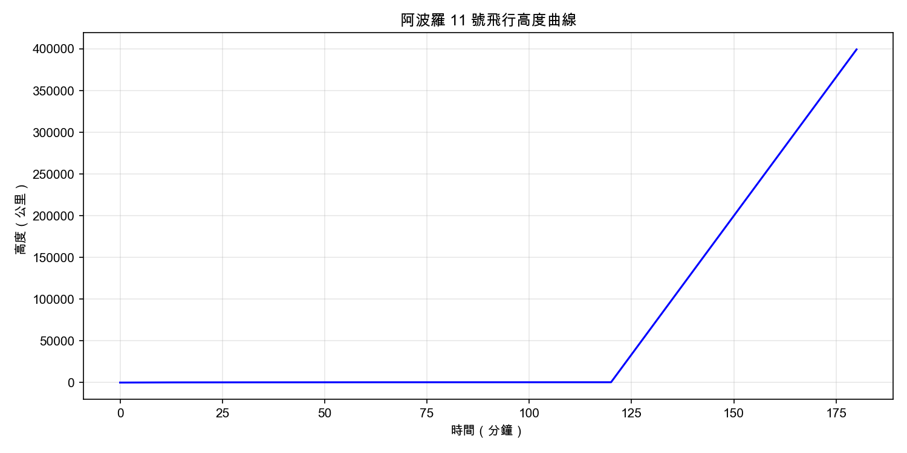
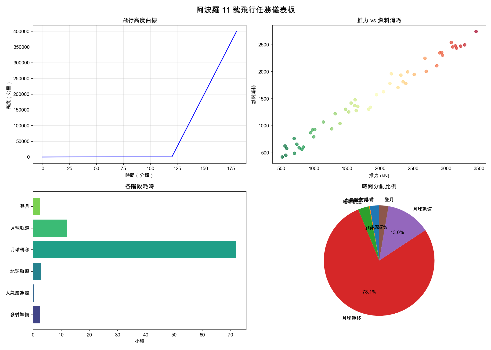
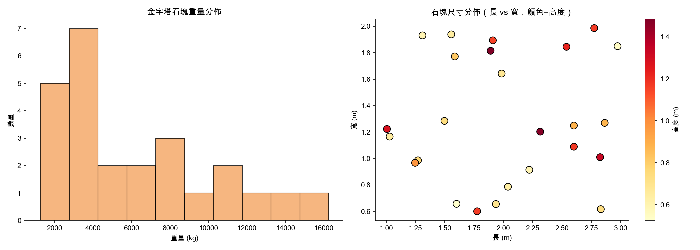

#+title: CowBell 偵探社：用 Python 破解校園懸案
# -*- org-export-babel-evaluate: nil -*-
#+INCLUDE: ../pdf-m1.org
#+TAGS: Python, Colab, Numpy, Matplotlib, Pandas, 爬蟲, GUI
#+OPTIONS: toc:2 ^:nil num:5
#+OPTIONS: H:4
#+PROPERTY: header-args :python :python "/Users/letranger/Dropbox/notes/roam/venv/bin/python3" :eval never-export
#+HTML_HEAD: <link rel="stylesheet" type="text/css" href="../css/muse.css" />
#+HTML_HEAD_EXTRA: 
#+EXCLUDE_TAGS: noexport
#+latex:\newpage
#+begin_export html

#+end_export

* 序章：歡迎加入 CowBell 偵探社

2025 年 12 月 25 日，學校辦理聖誕夜校園宿營活動，吸引大量學生留宿校園。活動期間校園人員進出頻繁，晚間動線複雜。

在活動結束後的隔天清晨，校方發現 403 電腦教室遭人入侵，教室內所有的黑色 MacMini 主機全數被入侵者無恥地噴成白色，所有桌布也都被改為「穿著性感內衣的聖誕兔女郎」。

此舉讓身兼 *南一中道德重整委員會會長* 的電腦教師十分氣憤，旋即通報校方，但校方為了 *有剩但不多* 的校譽著想，立即封鎖此消息，並延請南一中地下社團「CowBell 偵探社」協助調查此案。

這個社團的命名原是想向「柯南」致敬，原來的英文名稱應該是「柯北偵探社 (CoBe Detective Agency)」，但因為初代社長手殘打錯字，變成了「CowBell」，於是也就將錯就錯沿用下來了。正好也象徵本偵探社的「牛鈴」精神，擁有 *「叮叮噹噹，真相大白」* 的決心。

初代社長還留下了一個遺產——一個用 Python 寫的聊天機器人，安裝在社辦那台又老又慢的電腦上。這個機器人原本只會回覆「叮叮噹噹」四個字，但在某次 Windows 更新後，它突然開始會用充滿疲憊感的語氣吐槽社員。社員們管它叫「牛鈴」，並正式任命它為偵探社的 AI 分析助手。

身為 *CowBell 偵探社現任社長鄰居小孩同學* 的你，決定接受社長的指派，帶領社員協助校方找出真正的兇手。

#+begin_example
> 歡迎加入 CowBell 偵探社。案件編號：#2025-XMAS-403。
> 案情摘要：403 電腦教室遭入侵，主機被噴白漆，桌布被竄改。
> 調查方式：學會 Python，逐步分析六大類調查資料。
> 警告：若未能在期限內破案，社長說要拿你的社費去買牛鈴。
#+end_example

「叮。我是牛鈴，CowBell 偵探社的 AI 分析助手。」電腦螢幕上跳出一個看起來像是 90 年代聊天室的視窗。「在你問之前：是的，我是一個 chatbot；不，我不知道為什麼我會有自我意識；是的，你的社費真的會被拿去買牛鈴。」

#+begin_quote
*CowBell 偵探社基本資訊*
- 社長：神龍見首不見尾（據說長年在外執行秘密任務，其實是去補習了）
- AI 助手：牛鈴（一個意外獲得自我意識的 Python chatbot）
- 座右銘：「叮叮噹噹，真相大白。」
- 任務數量：6 項調查任務
- 獎勵：每完成一項任務，獲得一枚「調查徽章」
- 懲罰：寫出 SyntaxError 時，牛鈴會在螢幕上顯示「叮叮噹噹，語法不通」然後沉默三秒
#+end_quote

** 學生代號編號
為了保護學生隱私，偵探社統一以「S01」至「S40」的編號來代表所有涉案學生。這些編號不僅方便調查管理，也能確保在分析過程中不會因為姓名等個人資訊而產生偏見或洩漏隱私。

後續各單元的分析結果，均可透過此編號相互串連比對。

-----

* 任務1. 環境建置（Colab）
:PROPERTIES:
:CUSTOM_ID: mission-1-colab
:END:

#+begin_quote
📍 調查地點：CowBell 偵探社社辦（403 教室隔壁的雜物間）
🎭 你的身份：偵探社資料分析組新進社員（無薪，連社費都要自己繳）
🔔 牛鈴語錄：「工欲善其事，必先利其器。你的器就是 Google Colab。別問我為什麼不用本機，社辦那台電腦跑 Python 要等到下個學期。」
#+end_quote

要開始調查案件，你首先需要一個「分析工作台」。牛鈴告訴你，偵探社的預算買不起像樣的電腦，所以所有的資料分析都在雲端進行。你的第一個任務：學會使用 Google Colab——CowBell 偵探社的官方分析平台。

** A：認識 Colab 介面與 Cell 操作
:PROPERTIES:
:CUSTOM_ID: mission-1a
:END:

#+begin_quote
🔔 牛鈴小教室：

Google Colab 是 Google 提供的免費雲端 Python 開發環境。你只需要一個瀏覽器就能寫程式、跑程式、甚至訓練 AI 模型。

Colab 的基本單位是 Cell（儲存格），有兩種：
- *程式碼 Cell*：寫 Python 程式的地方，按 Shift+Enter 執行
- *文字 Cell*：寫筆記的地方，支援 Markdown 語法
#+end_quote

*你的第一個任務：*

在 Colab 中建立一個程式碼 Cell，輸入以下程式碼並執行：

#+begin_src python -r -n :results output :exports both :session colab
# 你的第一行 Python 程式
print("CowBell 偵探社，開始調查！")
#+end_src

#+RESULTS:
: CowBell 偵探社，開始調查！

#+begin_quote
🔔 牛鈴：「恭喜，你成功執行了你人生中最簡單的程式。別太驕傲，後面會讓你哭的。」
#+end_quote

** B：Python 基礎語法
:PROPERTIES:
:CUSTOM_ID: mission-1b
:END:

#+begin_quote
🔔 牛鈴小教室：

Python 的四種基本資料型別：
- =int= ：整數，例如 =42= 、 =-7=
- =float= ：浮點數（小數），例如 =3.14= 、 =1337.5=
- =str= ：字串，例如 ="hello"= 、 ='world'=
- =bool= ：布林值，只有 =True= 和 =False= 兩種
#+end_quote

*偵探社物證管理*

你被指派管理偵探社的物證清單：

#+begin_src python -r -n :results output :exports both :session colab
# === 偵探社物證清單 ===
fingerprints = 42           # int：採集到的指紋數量
budget = 1337.5             # float：社團經費（元）
case_name = "403教室入侵事件"  # str：案件名稱
is_active = True            # bool：案件是否進行中

print(f"案件：{case_name}")
print(f"指紋數量：{fingerprints} 枚")
print(f"剩餘經費：{budget} 元")
print(f"案件狀態：{is_active}")
#+end_src

#+RESULTS:
: 案件：403教室入侵事件
: 指紋數量：42 枚
: 剩餘經費：1337.5 元
: 案件狀態：True

*你的任務：*

1. 每次指紋比對消耗 3 元（鑑識耗材費），計算經費可以比對幾次（用整數除法 =//= ）
2. 建立一個格式化的狀態報告字串

請修改下方程式碼中 =???= 的部分：

#+begin_src python -r -n :results output :exports both :session colab
# --- 你的任務 ---
cost_per_test = 3
tests_remaining = ???  # //
status_report = ???  # f-string

print(f"可比對次數：{tests_remaining} 次")
print(status_report)
#+end_src

*預期輸出：*
#+begin_example
可比對次數：445 次
【403教室入侵事件調查報告】可比對 445 次，剩餘經費 1337.5 元
#+end_example

*** 參考解答                                                     :noexport:

#+begin_src python -r -n :results output :exports both :session colab
cost_per_test = 3
tests_remaining = int(budget) // cost_per_test
status_report = f"【{case_name}調查報告】可比對 {tests_remaining} 次，剩餘經費 {budget} 元"
print(f"可比對次數：{tests_remaining} 次")
print(status_report)
#+end_src

** C：流程控制
:PROPERTIES:
:CUSTOM_ID: mission-1c
:END:

#+begin_quote
🔔 牛鈴：「嫌疑人風險評估來了。上次有人忘了評估飲料部阿姨，結果發現她才是偷吃社辦餅乾的真兇。在偵探社，沒有餅乾比沒有線索更致命——至少對社員來說是這樣。」
#+end_quote

*嫌疑人風險評估*

目前有五名嫌疑人，每人的嫌疑指數介於 0~100：

#+begin_src python -r -n :results output :exports both :session colab
suspects = {
    "S09": 98,
    "S15": 45,
    "S22": 72,
    "S31": 15,
    "S40": 100  # 被監視器拍到在案發現場附近
}

print("=== 嫌疑人列表 ===")
for name, score in suspects.items():
    print(f"  {name}：{score} 分")
#+end_src

#+begin_quote
🔔 牛鈴小教室：

判斷標準：
- 嫌疑指數 >= 80：高度嫌疑
- 嫌疑指數 >= 50：中度嫌疑
- 嫌疑指數 < 50：低度嫌疑
#+end_quote

*你的任務：*

用 =for= 迴圈遍歷 =suspects= 字典，對每個嫌疑人判斷等級並印出結果。修改 =???= 的部分：

#+begin_src python -r -n :results output :exports both :session colab
print("=== 嫌疑人風險評估報告 ===")
for name, score in suspects.items():
    if ???:       # 嫌疑指數 >= 80
        level = "高度嫌疑"
    elif ???:     # 嫌疑指數 >= 50
        level = "中度嫌疑"
    else:
        level = "低度嫌疑"
    print(f"  {name} ({score}分)：{level}")
#+end_src

*預期輸出：*
#+begin_example
=== 嫌疑人風險評估報告 ===
  S09 (98分)：高度嫌疑
  S15 (45分)：低度嫌疑
  S22 (72分)：中度嫌疑
  S31 (15分)：低度嫌疑
  S40 (100分)：高度嫌疑
#+end_example

#+begin_quote
🔔 牛鈴：「S31 才 15 分？沒關係，反正他那天在家打電動，有十個隊友可以作證。等等，打電動不是應該要上課的時間嗎？」
#+end_quote

*** 參考解答                                                     :noexport:

#+begin_src python -r -n :results output :exports both :session colab
print("=== 嫌疑人風險評估報告 ===")
for name, score in suspects.items():
    if score >= 80:
        level = "高度嫌疑"
    elif score >= 50:
        level = "中度嫌疑"
    else:
        level = "低度嫌疑"
    print(f"  {name} ({score}分)：{level}")
#+end_src

** D：函式定義與呼叫
:PROPERTIES:
:CUSTOM_ID: mission-1d
:END:

#+begin_quote
🔔 牛鈴：「你剛剛寫的嫌疑人篩選程式碼很棒，但如果每次都要複製貼上，你跟用 Excel 的總務處有什麼兩樣？把它包成函式，這樣才叫寫程式，不然那叫貼上。」
#+end_quote

#+begin_src python -r -n :results output :exports both :session colab
def greet_member(name):
    """跟新社員打招呼"""
    return f"歡迎加入 CowBell 偵探社，{name}！請簽署保密協議（包含但不限於：不得洩漏案情、不得私自接觸嫌疑人、不得偷吃社辦餅乾）"

message = greet_member("新社員")
print(message)
#+end_src

*你的任務：*

1. 寫一個 =evaluate(name, score)= 函式，根據嫌疑指數回傳風險等級字串
2. 寫一個 =investigation_cost(score)= 函式，計算調查費用：=score * 100=
3. 用迴圈對所有嫌疑人呼叫這兩個函式

#+begin_src python -r -n :results output :exports both :session colab
def evaluate(name, score):
    if ???:
        level = "高度嫌疑"
    elif ???:
        level = "中度嫌疑"
    else:
        level = "低度嫌疑"
    return f"{name} ({score}分)：{level}"

def investigation_cost(score):
    cost = ???  # 算術運算
    return cost

print("=== 嫌疑人完整評估報告 ===")
print("-" * 40)
for name, score in suspects.items():
    result = evaluate(name, score)
    cost = investigation_cost(score)
    print(f"  {result}")
    if cost > 0:
        print(f"    → 預估調查費：{cost:,} 元")
print("-" * 40)
total_cost = sum(investigation_cost(s) for s in suspects.values())
print(f"  總調查預算：{total_cost:,} 元")
#+end_src

*預期輸出：*
#+begin_example
=== 嫌疑人完整評估報告 ===
----------------------------------------
  S09 (98分)：高度嫌疑
    → 預估調查費：9,800 元
  S15 (45分)：低度嫌疑
    → 預估調查費：4,500 元
  S22 (72分)：中度嫌疑
    → 預估調查費：7,200 元
  S31 (15分)：低度嫌疑
    → 預估調查費：1,500 元
  S40 (100分)：高度嫌疑
    → 預估調查費：10,000 元
----------------------------------------
  總調查預算：33,000 元
#+end_example

#+begin_quote
🔔 牛鈴：「33,000 元？偵探社一整年的社費才 5,000 元。看來得跟校方申請專案經費了，或者......叫社長別補習了，把補習費省下來。」
#+end_quote

*** 參考解答                                                     :noexport:

#+begin_src python -r -n :results output :exports both :session colab
def evaluate(name, score):
    if score >= 80:
        level = "高度嫌疑"
    elif score >= 50:
        level = "中度嫌疑"
    else:
        level = "低度嫌疑"
    return f"{name} ({score}分)：{level}"

def investigation_cost(score):
    cost = score * 100
    return cost

print("=== 嫌疑人完整評估報告 ===")
print("-" * 40)
for name, score in suspects.items():
    result = evaluate(name, score)
    cost = investigation_cost(score)
    print(f"  {result}")
    if cost > 0:
        print(f"    → 預估調查費：{cost:,} 元")
print("-" * 40)
total_cost = sum(investigation_cost(s) for s in suspects.values())
print(f"  總調查預算：{total_cost:,} 元")
#+end_src

** E：套件安裝與 import
:PROPERTIES:
:CUSTOM_ID: mission-1e
:END:

#+begin_quote
🔔 牛鈴：「Python 厲害的地方不是 Python 本身，是別人幫你寫好的那些套件。就像偵探社厲害的地方不是社員，是有我這個 AI 助手。」
#+end_quote

#+begin_src python -r -n :results output :exports both :session colab
# 在 Colab 中安裝套件（前面的 ! 表示終端機指令）
# !pip install numpy pandas matplotlib

import random
import datetime
import numpy as np

print("匯入成功！")
print(f"NumPy 版本：{np.__version__}")
#+end_src

*你的任務：*

#+begin_src python -r -n :results output :exports both :session colab
# 1. 產生案件代碼（6 位數隨機整數）
random.seed(42)
case_code = ???  # random.randint()
print(f"案件代碼：{case_code}")

# 2. 取得現在的時間戳記
now = ???  # datetime.datetime.now()
print(f"當前時間戳記：{now}")

# 3. 建立偵探日誌（跨任務使用）
detective_log = {
    "偵探": "你的名字",   # 請改成你的名字
    "已完成任務": [],
    "調查徽章": 0,
    "備註": {}
}

detective_log["已完成任務"].append("任務1：環境建置")
detective_log["調查徽章"] += 1
detective_log["備註"]["任務1"] = f"案件代碼 {case_code}"

print(f"\n偵探日誌：{detective_log}")
#+end_src

*預期輸出（case_code 因 seed=42 固定）：*
#+begin_example
案件代碼：639426
當前時間戳記：2026-02-18 10:30:00.123456
偵探日誌：{'偵探': '你的名字', '已完成任務': ['任務1：環境建置'], '調查徽章': 1, '備註': {'任務1': '案件代碼 639426'}}
#+end_example

（注意：時間戳記會因執行環境而異）

*** 參考解答                                                     :noexport:

#+begin_src python -r -n :results output :exports both :session colab
random.seed(42)
case_code = random.randint(100000, 999999)
print(f"案件代碼：{case_code}")

now = datetime.datetime.now()
print(f"當前時間戳記：{now}")

detective_log = {
    "偵探": "你的名字",
    "已完成任務": [],
    "調查徽章": 0,
    "備註": {}
}
detective_log["已完成任務"].append("任務1：環境建置")
detective_log["調查徽章"] += 1
detective_log["備註"]["任務1"] = f"案件代碼 {case_code}"
print(f"\n偵探日誌：{detective_log}")
#+end_src

** F：實作挑戰——偵探社調查物資計算器
:PROPERTIES:
:CUSTOM_ID: mission-1f
:END:

#+begin_quote
🔔 牛鈴：「最後一題。牛鈴要去更新案件資料庫了，但在那之前，你得幫偵探社寫一個完整的調查物資計算器。這題用到前面學的所有東西：變數、條件判斷、迴圈、函式。搞定它，你才配拿第一枚徽章。」
#+end_quote

*偵探社調查物資計算器*

偵探社有以下調查物資，每天的消耗量已知：

| 物資         | 庫存量 | 每日消耗 |
|--------------+--------+----------|
| 採證手套(雙) |     42 |        3 |
| 證物袋(個)   |    120 |        5 |
| 筆錄紙(張)   |    200 |        8 |
| 相機電池(顆) |     60 |        2 |
| 咖啡(杯)     |     99 |       12 |

請完成以下程式：
1. 用一個 =dict= 儲存物資資料（庫存量和每日消耗）
2. 寫一個函式 =days_left(stock, daily)= 回傳可撐天數（整數除法）
3. 寫一個函式 =urgency(days)= 回傳急迫程度：<=3 天回傳 ="緊急"=, <=7 天 ="警告"=, 否則 ="安全"=
4. 用迴圈對每項物資呼叫上述函式，印出完整的物資報告
5. 找出最先耗盡的物資，印出「最先耗盡：{物資名} ({天數} 天後）」

#+begin_src python -r -n :results output :exports both :session colab
# --- 你的任務：偵探社調查物資計算器 ---

supplies = {
    "採證手套": {"庫存": 42, "每日消耗": 3},
    "證物袋":   {"庫存": 120, "每日消耗": 5},
    "筆錄紙":   {"庫存": 200, "每日消耗": 8},
    "相機電池": {"庫存": 60, "每日消耗": 2},
    "咖啡":     {"庫存": 99, "每日消耗": 12},
}

def days_left(stock, daily):
    """回傳可撐天數"""
    ???  # //

def urgency(days):
    """回傳急迫程度"""
    ???  # if/elif/else

# 印出完整報告
print("=== 偵探社物資報告 ===")
print(f"{'物資':>6} {'庫存':>6} {'日耗':>6} {'可撐天數':>8} {'急迫程度':>8}")
print("-" * 42)

min_days = float('inf')
min_item = ""

for name, info in supplies.items():
    days = days_left(info["庫存"], info["每日消耗"])
    level = urgency(days)
    print(f"{name:>6} {info['庫存']:>6} {info['每日消耗']:>6} {days:>8} {level:>8}")
    ???  # if 比較

print("-" * 42)
print(f"最先耗盡：{min_item}（{min_days} 天後）")
#+end_src

*預期輸出：*
#+begin_example
=== 偵探社物資報告 ===
  物資     庫存     日耗   可撐天數   急迫程度
------------------------------------------
採證手套     42      3       14       安全
證物袋    120      5       24       安全
筆錄紙    200      8       25       安全
相機電池     60      2       30       安全
  咖啡     99     12        8       警告
------------------------------------------
最先耗盡：咖啡（8 天後）
#+end_example

*** 參考解答                                                     :noexport:

#+begin_src python -r -n :results output :exports both :session colab
supplies = {
    "採證手套": {"庫存": 42, "每日消耗": 3},
    "證物袋":   {"庫存": 120, "每日消耗": 5},
    "筆錄紙":   {"庫存": 200, "每日消耗": 8},
    "相機電池": {"庫存": 60, "每日消耗": 2},
    "咖啡":     {"庫存": 99, "每日消耗": 12},
}

def days_left(stock, daily):
    return stock // daily

def urgency(days):
    if days <= 3:
        return "緊急"
    elif days <= 7:
        return "警告"
    else:
        return "安全"

print("=== 偵探社物資報告 ===")
print(f"{'物資':>6} {'庫存':>6} {'日耗':>6} {'可撐天數':>8} {'急迫程度':>8}")
print("-" * 42)

min_days = float('inf')
min_item = ""

for name, info in supplies.items():
    days = days_left(info["庫存"], info["每日消耗"])
    level = urgency(days)
    print(f"{name:>6} {info['庫存']:>6} {info['每日消耗']:>6} {days:>8} {level:>8}")
    if days < min_days:
        min_days = days
        min_item = name

print("-" * 42)
print(f"最先耗盡：{min_item}（{min_days} 天後）")
#+end_src

#+begin_quote
🔔 牛鈴：「任務 1 完成！你獲得了第一枚『調查徽章』。別太得意，後面還有五項調查任務等著你。下一站：物證分析組的指紋數據。記得帶手套。」
#+end_quote

-----

* 任務2. 數值運算（NumPy）
:PROPERTIES:
:CUSTOM_ID: mission-2-numpy
:END:

#+begin_quote
📍 調查地點：CowBell 偵探社物證分析室（其實就是社辦的角落）
🎭 你的身份：物證調查小組組長鄰居小孩的同學（無薪，但偶爾有餅乾吃）
🔔 牛鈴語錄：「物證小組用 Excel 記錄指紋數據，你用 NumPy。差別在於 Excel 不會在你面前當機......好吧，它會。」
#+end_quote

偵探社的物證調查小組拿到了現場採集的指紋數據。每枚指紋被轉換成一組特徵向量——你可以把它想像成一張「指紋履歷表」，上面記錄了紋線方向、分岔點數量、端點位置等數值。

但是，負責記錄數據的社員因為熬夜調查而精神恍惚，導致資料出了大問題：有指紋的特徵值變成負數了、有一筆數據的數值大到離譜、還有些數據直接遺失了。

物證調查小組組長看到這些數據差點昏倒：「如果不修好這些數據，我們的指紋比對結果就是垃圾進、垃圾出。」

#+begin_quote
🔔 牛鈴：「好消息是，NumPy 可以處理這些問題。壞消息是，如果你搞砸了，我們可能會把無辜的同學當成嫌疑人。沒有壓力。」
#+end_quote

** A：建立指紋特徵的 ndarray
:PROPERTIES:
:CUSTOM_ID: mission-2a
:END:

#+begin_quote
🔔 牛鈴小教室：

=ndarray= 是 NumPy 的核心資料結構，全名 N-dimensional array（N 維陣列）：
- 所有元素必須是同一型別（通常是數字）
- 可以做向量化運算（一次算整個陣列，不用寫迴圈）
- 速度比 Python list 快 10~100 倍
#+end_quote

我們有 30 枚指紋的數據，每枚記錄 4 個特徵值： =紋線密度= 、 =分岔點數= 、 =端點數= 、 =中心距離= 。

#+begin_src python -r -n :results output :exports both :session numpy
import numpy as np

np.random.seed(2025)

densities = np.random.uniform(1.0, 3.0, 30)
bifurcations = np.random.uniform(0.5, 2.0, 30)
endpoints = np.random.uniform(0.5, 1.5, 30)
composites = densities * bifurcations * endpoints
distances = composites * 2500 + np.random.normal(0, 100, 30)

prints = np.column_stack([densities, bifurcations, endpoints, distances])

# === 注入 BUG（社員手殘打錯的資料）===
prints[5, 0] = -2.3       # 指紋 5：紋線密度為負數
prints[12, 2] = -0.8      # 指紋 12：端點數為負數
prints[20, 3] = 1.989e30  # 指紋 20：中心距離大到不可能
prints[25, 1] = np.nan    # 指紋 25：分岔點數遺失
prints[8, 3] = np.nan     # 指紋 8：中心距離遺失

print("指紋特徵資料已建立！（含 5 個 bug）")
print(f"陣列形狀：{prints.shape}")
print(f"資料型別：{prints.dtype}")
#+end_src

*你的任務：* 印出陣列的基本資訊和前 5 筆資料。修改 =???= ：

#+begin_src python -r -n :results output :exports both :session numpy
print(f"陣列形狀：{???}")  # .shape
print(f"資料型別：{???}")  # .dtype

print(f"\n前 5 枚指紋的資料：")
print(f"{'編號':>4} {'紋線密度':>8} {'分岔點數':>8} {'端點數':>8} {'中心距離':>12}")
print("-" * 44)
for i in range(5):
    row = ???  # 陣列索引
    print(f"{i:>4} {row[0]:>8.2f} {row[1]:>8.2f} {row[2]:>8.2f} {row[3]:>12.2f}")
#+end_src

*** 參考解答                                                     :noexport:

#+begin_src python -r -n :results output :exports both :session numpy
print(f"陣列形狀：{prints.shape}")
print(f"資料型別：{prints.dtype}")

print(f"\n前 5 枚指紋的資料：")
print(f"{'編號':>4} {'紋線密度':>8} {'分岔點數':>8} {'端點數':>8} {'中心距離':>12}")
print("-" * 44)
for i in range(5):
    row = prints[i]
    print(f"{i:>4} {row[0]:>8.2f} {row[1]:>8.2f} {row[2]:>8.2f} {row[3]:>12.2f}")
#+end_src

** B：陣列索引與切片
:PROPERTIES:
:CUSTOM_ID: mission-2b
:END:

#+begin_quote
🔔 牛鈴：「陣列索引就像在證物櫃找東西。你要知道它在第幾排、第幾格。只不過 Python 從 0 開始數，因為程式設計師都是從 0 開始的——包括他們的社交能力。」
#+end_quote

索引規則： =prints[i]= 第 i 列、 =prints[i, j]= 第 i 列第 j 欄、 =prints[a:b]= 切片、 =prints[:, j]= 整欄。欄位：0=紋線密度, 1=分岔點數, 2=端點數, 3=中心距離。

#+begin_src python -r -n :results output :exports both :session numpy
# 1. 指紋 0 的全部資料
print_0 = ???  # 索引
print(f"指紋 0：密度={print_0[0]:.2f}, 分岔={print_0[1]:.2f}, 端點={print_0[2]:.2f}, 距離={print_0[3]:.2f}")

# 2. 指紋 10~14 的中心距離
weights_10_to_14 = ???  # 切片
print(f"\n指紋 10~14 的中心距離：{weights_10_to_14}")

# 3. 所有指紋的端點數
all_heights = ???  # 整欄取值
print(f"\n所有指紋的端點數（前 10 個）：{all_heights[:10]}")

# 4. Bug 指紋
print(f"\n指紋 5 的紋線密度：{prints[5, 0]} ← 負數的長度？")
print(f"指紋 20 的中心距離：{prints[20, 3]:.2e} ← 太陽表示：你在抄我？")
#+end_src

*** 參考解答                                                     :noexport:

#+begin_src python -r -n :results output :exports both :session numpy
print_0 = prints[0]
print(f"指紋 0：密度={print_0[0]:.2f}, 分岔={print_0[1]:.2f}, 端點={print_0[2]:.2f}, 距離={print_0[3]:.2f}")

weights_10_to_14 = prints[10:15, 3]
print(f"\n指紋 10~14 的中心距離：{weights_10_to_14}")

all_heights = prints[:, 2]
print(f"\n所有指紋的端點數（前 10 個）：{all_heights[:10]}")

print(f"\n指紋 5 的紋線密度：{prints[5, 0]} ← 負數的長度？")
print(f"指紋 20 的中心距離：{prints[20, 3]:.2e} ← 太陽表示：你在抄我？")
#+end_src

** C：陣列運算與廣播
:PROPERTIES:
:CUSTOM_ID: mission-2c
:END:

#+begin_quote
🔔 牛鈴：「NumPy 最猛的地方就是向量化運算。你不需要寫 for 迴圈一個一個算，直接對整個陣列操作。就像你不需要一個一個打電話通知全班，直接在群組裡發訊息就好。雖然一樣沒人會看。」
#+end_quote

#+begin_src python -r -n :results output :exports both :session numpy
# 1. 計算體積 = 長 × 寬 × 高
calc_volumes = ???  # 向量化乘法
print("=== 各指紋體積（前 10 塊）===")
for i in range(10):
    print(f"  指紋 {i:>2}：{calc_volumes[i]:>8.3f} m³")

# 2. 預期重量（密度 = 2500 kg/m³）
density = 2500
expected_weights = ???  # 廣播
print(f"\n=== 預期 vs 實際重量（前 5 塊）===")
for i in range(5):
    diff = prints[i, 3] - expected_weights[i]
    print(f"  指紋 {i}：預期 {expected_weights[i]:>8.2f} kg, 實際 {prints[i, 3]:>8.2f} kg, 差異 {diff:>8.2f} kg")

# 3. 廣播：公尺轉公分
dimensions_m = prints[:, :3]
dimensions_cm = ???  # 廣播
print(f"\n指紋 0 尺寸：{dimensions_m[0, 0]:.2f}m = {dimensions_cm[0, 0]:.1f}cm")
#+end_src

#+begin_quote
🔔 牛鈴：「注意看指紋 5，它的體積是負數。負數的體積代表什麼？代表你需要往石頭裡面塞空間。這在物理學上叫做『不可能』。」
#+end_quote

*** 參考解答                                                     :noexport:

#+begin_src python -r -n :results output :exports both :session numpy
calc_volumes = prints[:, 0] * prints[:, 1] * prints[:, 2]
print("=== 各指紋體積（前 10 塊）===")
for i in range(10):
    print(f"  指紋 {i:>2}：{calc_volumes[i]:>8.3f} m³")

density = 2500
expected_weights = calc_volumes * density
print(f"\n=== 預期 vs 實際重量（前 5 塊）===")
for i in range(5):
    diff = prints[i, 3] - expected_weights[i]
    print(f"  指紋 {i}：預期 {expected_weights[i]:>8.2f} kg, 實際 {prints[i, 3]:>8.2f} kg, 差異 {diff:>8.2f} kg")

dimensions_m = prints[:, :3]
dimensions_cm = dimensions_m * 100
print(f"\n指紋 0 尺寸：{dimensions_m[0, 0]:.2f}m = {dimensions_cm[0, 0]:.1f}cm")
#+end_src

** D：統計函式找出異常指紋
:PROPERTIES:
:CUSTOM_ID: mission-2d
:END:

#+begin_quote
🔔 牛鈴：「統計學是抓 bug 的好朋友。如果一塊石頭的重量偏離平均值三個標準差以上，它不是壞了就是從另一個宇宙來的。」
#+end_quote

#+begin_src python -r -n :results output :exports both :session numpy
col_names = ["紋線密度", "分岔點數", "端點數", "中心距離"]

print("=== 指紋資料統計摘要 ===")
print(f"{'欄位':>8} {'平均值':>12} {'標準差':>12} {'最小值':>12} {'最大值':>12}")
print("-" * 60)
for j in range(4):
    col = prints[:, j]
    avg = ???  # np.nanmean()
    std = ???  # np.nanstd()
    col_min = ???  # np.nanmin()
    col_max = ???  # np.nanmax()
    print(f"{col_names[j]:>8} {avg:>12.2f} {std:>12.2f} {col_min:>12.2f} {col_max:>12.2e}")

# 找出重量偏離超過 3 個標準差的指紋
weight_col = prints[:, 3]
weight_mean = np.nanmean(weight_col)
weight_std = np.nanstd(weight_col)

print(f"\n=== 超出 3 sigma 的異常指紋 ===")
for i in range(len(prints)):
    w = prints[i, 3]
    if np.isnan(w):
        print(f"  指紋 {i:>2}：重量 = NaN（資料遺失）")
    elif abs(w - weight_mean) > 3 * weight_std:
        print(f"  指紋 {i:>2}：重量 = {w:.2e}（偏離 {abs(w - weight_mean)/weight_std:.1f} 個標準差）")
#+end_src

#+begin_quote
🔔 牛鈴：「看到了嗎？指紋 20 的中心距離把整個平均值拉到天文數字。一顆老鼠屎壞了一鍋粥。呃，一顆太陽壞了一座金字塔。」
#+end_quote

*** 參考解答                                                     :noexport:

#+begin_src python -r -n :results output :exports both :session numpy
col_names = ["紋線密度", "分岔點數", "端點數", "中心距離"]

print("=== 指紋資料統計摘要 ===")
print(f"{'欄位':>8} {'平均值':>12} {'標準差':>12} {'最小值':>12} {'最大值':>12}")
print("-" * 60)
for j in range(4):
    col = prints[:, j]
    avg = np.nanmean(col)
    std = np.nanstd(col)
    col_min = np.nanmin(col)
    col_max = np.nanmax(col)
    print(f"{col_names[j]:>8} {avg:>12.2f} {std:>12.2f} {col_min:>12.2f} {col_max:>12.2e}")

weight_col = prints[:, 3]
weight_mean = np.nanmean(weight_col)
weight_std = np.nanstd(weight_col)

print(f"\n=== 超出 3 sigma 的異常指紋 ===")
for i in range(len(prints)):
    w = prints[i, 3]
    if np.isnan(w):
        print(f"  指紋 {i:>2}：重量 = NaN（資料遺失）")
    elif abs(w - weight_mean) > 3 * weight_std:
        print(f"  指紋 {i:>2}：重量 = {w:.2e}（偏離 {abs(w - weight_mean)/weight_std:.1f} 個標準差）")
#+end_src

** E：布林索引篩選不可能的指紋
:PROPERTIES:
:CUSTOM_ID: mission-2e
:END:

#+begin_quote
🔔 牛鈴：「布林索引是 NumPy 的殺手鐧。你可以用一個條件式直接篩選整個陣列。就像你用一句『期末考不及格的站起來』就能篩選出全班一半的人。」
#+end_quote

#+begin_src python -r -n :results output :exports both :session numpy
# 布林索引示範
demo = np.array([10, -3, 7, -1, 5])
print(f"原始陣列：{demo}")
print(f"哪些 > 0：{demo > 0}")
print(f"正數：{demo[demo > 0]}")
print(f"負數的位置：{np.where(demo < 0)}")
#+end_src

*你的任務：* 找出所有有問題的指紋，建立清理過的陣列。

#+begin_src python -r -n :results output :exports both :session numpy
print("=== 指紋異常檢測報告 ===\n")

negative_length = ???  # 布林比較
negative_height = ???  # 布林比較

neg_length_idx = np.where(negative_length)[0]
neg_height_idx = np.where(negative_height)[0]

print("負數尺寸：")
for idx in neg_length_idx:
    print(f"  指紋 {idx}：長度 = {prints[idx, 0]}（不可能！石頭又不是反物質）")
for idx in neg_height_idx:
    print(f"  指紋 {idx}：高度 = {prints[idx, 2]}（地下指紋？那叫地基）")

too_heavy = ???  # 布林比較
heavy_idx = np.where(too_heavy)[0]
print(f"\n不可能的重量：")
for idx in heavy_idx:
    print(f"  指紋 {idx}：重量 = {prints[idx, 3]:.2e} kg（太陽質量 1.989e30 kg，你確定？）")

nan_mask = np.isnan(prints)
nan_rows, nan_cols = np.where(nan_mask)
print(f"\n遺失資料（NaN）：")
for r, c in zip(nan_rows, nan_cols):
    print(f"  指紋 {r}：{col_names[c]} = NaN（記錄被白蟻吃了）")

# 建立清理過的陣列
bad_rows = set()
bad_rows.update(neg_length_idx)
bad_rows.update(neg_height_idx)
bad_rows.update(heavy_idx)
bad_rows.update(nan_rows)

good_mask = np.ones(len(prints), dtype=bool)
for idx in bad_rows:
    good_mask[idx] = False

clean_prints = ???  # 布林索引

print(f"\n=== 清理結果 ===")
print(f"原始指紋數：{len(prints)}")
print(f"有問題的指紋：{sorted(bad_rows)}")
print(f"清理後指紋數：{len(clean_prints)}")
#+end_src

*預期輸出：*
#+begin_example
=== 指紋異常檢測報告 ===

負數尺寸：
  指紋 5：長度 = -2.3（不可能！石頭又不是反物質）
  指紋 12：高度 = -0.8（地下指紋？那叫地基）

不可能的重量：
  指紋 20：重量 = 1.99e+30 kg（太陽質量 1.989e30 kg，你確定？）

遺失資料（NaN）：
  指紋 8：重量(kg) = NaN（記錄被白蟻吃了）
  指紋 25：寬(m) = NaN（記錄被白蟻吃了）

=== 清理結果 ===
原始指紋數：30
有問題的指紋：[5, 8, 12, 20, 25]
清理後指紋數：25
#+end_example

*** 參考解答                                                     :noexport:

#+begin_src python -r -n :results output :exports both :session numpy
print("=== 指紋異常檢測報告 ===\n")

negative_length = prints[:, 0] < 0
negative_height = prints[:, 2] < 0

neg_length_idx = np.where(negative_length)[0]
neg_height_idx = np.where(negative_height)[0]

print("負數尺寸：")
for idx in neg_length_idx:
    print(f"  指紋 {idx}：長度 = {prints[idx, 0]}（不可能！石頭又不是反物質）")
for idx in neg_height_idx:
    print(f"  指紋 {idx}：高度 = {prints[idx, 2]}（地下指紋？那叫地基）")

too_heavy = prints[:, 3] > 1e10
heavy_idx = np.where(too_heavy)[0]
print(f"\n不可能的重量：")
for idx in heavy_idx:
    print(f"  指紋 {idx}：重量 = {prints[idx, 3]:.2e} kg（太陽質量 1.989e30 kg，你確定？）")

nan_mask = np.isnan(prints)
nan_rows, nan_cols = np.where(nan_mask)
print(f"\n遺失資料（NaN）：")
for r, c in zip(nan_rows, nan_cols):
    print(f"  指紋 {r}：{col_names[c]} = NaN（記錄被白蟻吃了）")

bad_rows = set()
bad_rows.update(neg_length_idx)
bad_rows.update(neg_height_idx)
bad_rows.update(heavy_idx)
bad_rows.update(nan_rows)

good_mask = np.ones(len(prints), dtype=bool)
for idx in bad_rows:
    good_mask[idx] = False

clean_prints = prints[good_mask]

print(f"\n=== 清理結果 ===")
print(f"原始指紋數：{len(prints)}")
print(f"有問題的指紋：{sorted(bad_rows)}")
print(f"清理後指紋數：{len(clean_prints)}")
#+end_src

** F：實作挑戰——403 教室環境感測器分析
:PROPERTIES:
:CUSTOM_ID: mission-2f
:END:

#+begin_quote
🔔 牛鈴：「指紋分析搞定了，但我們還有一份關鍵證據——403 教室的環境感測器數據。感測器每小時記錄溫度、濕度和噪音分貝，但數據被人動過手腳，有些紀錄被竄改了。這題要從頭到尾自己寫，用到前面學的所有 NumPy 技巧：建立陣列、統計、布林索引、向量化運算。」

失敗的話，關鍵的案發時間就永遠無法確認，兇手會逍遙法外——而你會被社長罰掃社辦一個月。

成功的話，你就能獲得第二枚『數據清理徽章』，還有物證小組組長的永生感激（和一杯販賣機咖啡）。

加油！
#+end_quote

*403 教室聖誕夜環境感測器分析*

以下是 403 教室在聖誕夜（12/24 18:00 ~ 12/25 06:00）的環境感測器資料，每小時記錄 3 種數據（溫度°C、濕度%、噪音dB），共 12 小時。其中有些數據被竄改過，需要你找出來。

請完成以下任務：
1. 建立資料陣列（shape 為 (12, 3)，代表 12 小時 x 3 種感測數據）
2. 找出並報告所有異常值（負數、超過合理範圍的值、NaN）
3. 將異常值替換為該時段其他有效測量的平均值（若整個時段都異常，用全時段中位數）
4. 計算每小時的平均感測值，找出數值最高和最低的時段
5. 找出「可疑時段」：噪音分貝超過 60dB 的時段（正常教室夜間應該很安靜）

#+begin_src python -r -n :results output :exports both :session numpy
import numpy as np

np.random.seed(1234)
# 403 教室感測器：溫度(°C)、濕度(%)、噪音(dB)
base_temp = np.array([25, 25, 24, 24, 23, 23, 22, 22, 21, 21, 20, 20])
base_humid = np.array([55, 55, 56, 57, 58, 60, 62, 63, 60, 58, 56, 55])
base_noise = np.array([30, 25, 20, 15, 10, 45, 70, 75, 65, 40, 25, 20])
# 注意：凌晨 0~2 點（索引 6~8）噪音異常高，這就是案發時間！

sensor_data = np.zeros((12, 3))
for h in range(12):
    sensor_data[h, 0] = base_temp[h] + np.random.normal(0, 1.5)
    sensor_data[h, 1] = base_humid[h] + np.random.normal(0, 2)
    sensor_data[h, 2] = base_noise[h] + np.random.normal(0, 3)

# 注入被竄改的數據
sensor_data[3, 0] = -10.0    # 21:00 溫度：不可能的負值
sensor_data[7, 1] = 999.0    # 01:00 濕度：不可能的值
sensor_data[10, 2] = np.nan  # 04:00 噪音：資料遺失

hours = ["18:00","19:00","20:00","21:00","22:00","23:00",
         "00:00","01:00","02:00","03:00","04:00","05:00"]

# --- 你的任務 ---

# 1. 印出原始資料的形狀
print(f"資料形狀：{???}")  # .shape

# 2. 找出異常值
print("\n=== 異常值報告 ===")
???  # np.where(), np.isnan()

# 3. 清理異常值（替換為該時段其他有效值的平均）
clean_data = sensor_data.copy()
???  # np.nanmean()

# 4. 計算每小時平均感測值
hourly_avg = ???  # .mean()
print("\n=== 每小時平均感測值 ===")
for i in range(12):
    print(f"  {hours[i]}：{hourly_avg[i]:.2f}")

# 5. 找出數值最高和最低的時段
max_hour = ???  # np.argmax()
min_hour = ???  # np.argmin()
print(f"\n數值最高：{hours[max_hour]}（{hourly_avg[max_hour]:.2f}）")
print(f"數值最低：{hours[min_hour]}（{hourly_avg[min_hour]:.2f}）")

# 6. 找出可疑時段（噪音 > 60dB）
suspect_mask = ???  # 布林比較，用 clean_data[:, 2]
suspect_hours = np.where(suspect_mask)[0]
print(f"\n可疑時段（噪音 > 60dB）：{[hours[i] for i in suspect_hours]}")
#+end_src

*預期輸出（大致）：*
#+begin_example
資料形狀：(12, 3)

=== 異常值報告 ===
  21:00 溫度：-10.00（負數）
  01:00 濕度：999.00（超過合理範圍）
  04:00 噪音：NaN（遺失）

=== 每小時平均感測值 ===
  18:00：xx.xx
  19:00：xx.xx
  ...
  01:00：xx.xx
  ...

數值最高：01:00（xx.xx）
數值最低：05:00（xx.xx）

可疑時段（噪音 > 60dB）：['00:00', '01:00', '02:00']
#+end_example

*** 參考解答                                                     :noexport:

#+begin_src python -r -n :results output :exports both :session numpy
import numpy as np

np.random.seed(1234)
base_temp = np.array([25, 25, 24, 24, 23, 23, 22, 22, 21, 21, 20, 20])
base_humid = np.array([55, 55, 56, 57, 58, 60, 62, 63, 60, 58, 56, 55])
base_noise = np.array([30, 25, 20, 15, 10, 45, 70, 75, 65, 40, 25, 20])

sensor_data = np.zeros((12, 3))
for h in range(12):
    sensor_data[h, 0] = base_temp[h] + np.random.normal(0, 1.5)
    sensor_data[h, 1] = base_humid[h] + np.random.normal(0, 2)
    sensor_data[h, 2] = base_noise[h] + np.random.normal(0, 3)

sensor_data[3, 0] = -10.0
sensor_data[7, 1] = 999.0
sensor_data[10, 2] = np.nan

hours = ["18:00","19:00","20:00","21:00","22:00","23:00",
         "00:00","01:00","02:00","03:00","04:00","05:00"]
sensor_names = ["溫度", "濕度", "噪音"]

print(f"資料形狀：{sensor_data.shape}")

print("\n=== 異常值報告 ===")
for h in range(12):
    for s in range(3):
        v = sensor_data[h, s]
        if np.isnan(v):
            print(f"  {hours[h]} {sensor_names[s]}：NaN（遺失）")
        elif v < 0:
            print(f"  {hours[h]} {sensor_names[s]}：{v:.2f}（負數）")
        elif v > 100:
            print(f"  {hours[h]} {sensor_names[s]}：{v:.2f}（超過合理範圍）")

clean_data = sensor_data.copy()
global_median = np.nanmedian(clean_data[(clean_data >= 0) & (clean_data <= 100)])

for h in range(12):
    for s in range(3):
        v = clean_data[h, s]
        if np.isnan(v) or v < 0 or v > 100:
            others = clean_data[h]
            valid = others[(~np.isnan(others)) & (others >= 0) & (others <= 100)]
            if len(valid) > 0:
                clean_data[h, s] = valid.mean()
            else:
                clean_data[h, s] = global_median

hourly_avg = clean_data.mean(axis=1)
print("\n=== 每小時平均感測值 ===")
for i in range(12):
    print(f"  {hours[i]}：{hourly_avg[i]:.2f}")

max_hour = np.argmax(hourly_avg)
min_hour = np.argmin(hourly_avg)
print(f"\n數值最高：{hours[max_hour]}（{hourly_avg[max_hour]:.2f}）")
print(f"數值最低：{hours[min_hour]}（{hourly_avg[min_hour]:.2f}）")

suspect_mask = clean_data[:, 2] > 60
suspect_hours = np.where(suspect_mask)[0]
print(f"\n可疑時段（噪音 > 60dB）：{[hours[i] for i in suspect_hours]}")
#+end_src

#+begin_quote
🔔 牛鈴：「任務 2 完成！物證小組組長含淚感謝你，並送你一杯販賣機咖啡作為薪水。下一個調查階段更棘手，做好心理準備吧。」
#+end_quote

-----

* 任務3. 資料視覺化（Matplotlib）
:PROPERTIES:
:CUSTOM_ID: mission-3-matplotlib
:END:

#+begin_quote
📍 調查地點：CowBell 偵探社簡報室（其實就是社辦的白板前面）
🎭 你的身份：偵探社資料視覺化專員（其實就是被叫去畫圖的那個人）
🔔 牛鈴語錄：「一張圖勝過一千個數字。一張錯的圖則會讓無辜的人被當成嫌疑人。」
#+end_quote

偵探社的調查數據越來越多，但光看數字根本搞不清楚狀況。社長要求在下次社團會議上用「圖表」來呈現調查進度，問題是——社團裡沒人會畫圖。上次有人試著用小畫家畫統計圖，結果被其他社團笑了一整個學期。

#+begin_quote
🔔 牛鈴：「沒有圖表的偵探社就像沒有菜單的餐廳——你只能看著原材料猜今天吃什麼。」
#+end_quote

** 調查資料準備

#+begin_src python -r -n :results output :exports both :session matplotlib
import numpy as np
import matplotlib
matplotlib.use('Agg')
import matplotlib.pyplot as plt
plt.rcParams['font.sans-serif'] = ['Arial Unicode MS', 'Microsoft JhengHei', 'SimHei']
plt.rcParams['axes.unicode_minus'] = False

np.random.seed(1969)

# 案件發展時間線（事件數隨天數變化）
days = np.arange(0, 181, 1)
evidence_count = np.piecewise(days.astype(float),
    [days <= 10, (days > 10) & (days <= 50),
     (days > 50) & (days <= 120), days > 120],
    [lambda t: t * 20,
     lambda t: 200 + (t-10) * 4,
     lambda t: 360 + (t-50) * 0.5,
     lambda t: 395 + (t-120) * 6650])
evidence_count += np.random.normal(0, 5, len(days))

# 嫌疑指數與出現頻率
suspicion_score = np.random.uniform(500, 3500, 50)
appearance_freq = suspicion_score * 0.8 + np.random.normal(0, 100, 50)

# 調查階段時長
phases = ['現場勘查', '證詞蒐集', '物證分析', '嫌疑人追蹤', '資料比對', '結案報告']
durations_hr = [2.5, 0.2, 3.0, 72.0, 12.0, 2.5]

print("案件調查資料已載入！")
print(f"調查天數：{len(days)}")
print(f"嫌疑人評估數：{len(suspicion_score)}")
#+end_src

** A：折線圖（證據累積量 vs 天數）
:PROPERTIES:
:CUSTOM_ID: mission-3a
:END:

*你的任務：* 繪製火箭高度隨時間變化的折線圖。修改 =???= ：

#+begin_src python -r -n :results output :exports both :session matplotlib
plt.figure(figsize=(10, 5))
plt.plot(days, evidence_count, color='blue', linewidth=1.5)
plt.title(???)    # 字串
plt.xlabel(???)   # 字串
plt.ylabel(???)   # 字串
plt.grid(True, alpha=0.3)
plt.tight_layout()
plt.savefig("images/case403_evidence.png")
print("圖表已儲存至 images/case403_evidence.png")
#+end_src

*預期輸出：*

#+CAPTION: 403案件證據累積曲線
#+name: fig:apollo-altitude
#+ATTR_HTML: :width 500

*** 參考解答                                                     :noexport:

#+begin_src python -r -n :results output :exports both :session matplotlib
plt.figure(figsize=(10, 5))
plt.plot(days, evidence_count, color='blue', linewidth=1.5)
plt.title("403案件證據累積曲線")
plt.xlabel("調查天數")
plt.ylabel("證據數量")
plt.grid(True, alpha=0.3)
plt.tight_layout()
plt.savefig("images/case403_evidence.png")
print("圖表已儲存至 images/case403_evidence.png")
#+end_src

** B：散佈圖（嫌疑指數 vs 出現頻率）
:PROPERTIES:
:CUSTOM_ID: mission-3b
:END:

*你的任務：* 繪製嫌疑指數 vs 出現頻率的散佈圖，用顏色表示嫌疑指數高低。

#+begin_src python -r -n :results output :exports both :session matplotlib
plt.figure(figsize=(8, 6))
scatter = plt.scatter(suspicion_score, appearance_freq,
                      c=???,           # 用哪個變數當顏色？
                      cmap='RdYlGn_r',
                      alpha=0.7, edgecolors='black', linewidth=0.5)
plt.colorbar(scatter, label='嫌疑指數')
plt.title("嫌疑指數 vs 出現頻率")
plt.xlabel("嫌疑指數")
plt.ylabel("出現頻率")
plt.grid(True, alpha=0.3)
plt.tight_layout()
plt.savefig("images/case403_suspicion.png")
print("圖表已儲存至 images/case403_suspicion.png")
#+end_src

*預期輸出：*

#+CAPTION: 嫌疑指數 vs 出現頻率散佈圖
#+name: fig:apollo-thrust
#+ATTR_HTML: :width 500
[[file:images/case403_suspicion.png]]

*** 參考解答                                                     :noexport:

#+begin_src python -r -n :results output :exports both :session matplotlib
plt.figure(figsize=(8, 6))
scatter = plt.scatter(suspicion_score, appearance_freq,
                      c=suspicion_score, cmap='RdYlGn_r',
                      alpha=0.7, edgecolors='black', linewidth=0.5)
plt.colorbar(scatter, label='嫌疑指數')
plt.title("嫌疑指數 vs 出現頻率")
plt.xlabel("嫌疑指數")
plt.ylabel("出現頻率")
plt.grid(True, alpha=0.3)
plt.tight_layout()
plt.savefig("images/case403_suspicion.png")
print("圖表已儲存至 images/case403_suspicion.png")
#+end_src

** C：長條圖（各階段任務耗時）
:PROPERTIES:
:CUSTOM_ID: mission-3c
:END:

#+begin_src python -r -n :results output :exports both :session matplotlib
colors = plt.cm.viridis(np.linspace(0.2, 0.8, len(phases)))

plt.figure(figsize=(10, 5))
bars = plt.barh(phases, durations_hr, color=colors, edgecolor='black')

# 在每個長條上標註數值
for bar, val in zip(bars, durations_hr):
    plt.text(bar.get_width() + 0.5, bar.get_y() + bar.get_height()/2,
             f'{val} hr', va='center', fontsize=10)

plt.xlabel("耗時（小時）")
plt.title("403案件各階段任務耗時")
plt.tight_layout()
plt.savefig("images/case403_phases.png")
print("圖表已儲存至 images/case403_phases.png")
#+end_src

*預期輸出：*

#+CAPTION: 403案件各階段任務耗時
#+name: fig:apollo-phases
#+ATTR_HTML: :width 500
[[file:images/case403_phases.png]]

** D：子圖與圖表美化
:PROPERTIES:
:CUSTOM_ID: mission-3d
:END:

*你的任務：* 用 =plt.subplot()= 建立 2x2 的儀表板，整合前面三種圖表。

#+begin_src python -r -n :results output :exports both :session matplotlib
fig = plt.figure(figsize=(14, 10))
fig.suptitle("403案件案件調查儀表板", fontsize=16, fontweight='bold')

# 左上：折線圖
ax1 = fig.add_subplot(2, 2, 1)
ax1.plot(days, evidence_count, color='blue')
ax1.set_title("證據累積曲線")
ax1.set_xlabel("調查天數")
ax1.set_ylabel("證據數量")
ax1.grid(True, alpha=0.3)

# 右上：散佈圖
ax2 = fig.add_subplot(2, 2, 2)
ax2.scatter(suspicion_score, appearance_freq, c=suspicion_score, cmap='RdYlGn_r', alpha=0.7)
ax2.set_title("嫌疑指數 vs 出現頻率")
ax2.set_xlabel("嫌疑指數")
ax2.set_ylabel("出現頻率")

# 左下：長條圖
ax3 = fig.add_subplot(2, 2, 3)
ax3.barh(phases, durations_hr, color=plt.cm.viridis(np.linspace(0.2, 0.8, len(phases))))
ax3.set_title("各階段調查耗時")
ax3.set_xlabel("小時")

# 右下：圓餅圖
ax4 = fig.add_subplot(2, 2, 4)
ax4.pie(durations_hr, labels=phases, autopct='%1.1f%%', startangle=90)
ax4.set_title("調查時間分配")

plt.tight_layout()
plt.savefig("images/case403_dashboard.png", dpi=150)
print("儀表板已儲存至 images/case403_dashboard.png")
#+end_src

*預期輸出：*

#+CAPTION: 403案件案件調查儀表板（2x2 子圖）
#+name: fig:apollo-dashboard
#+ATTR_HTML: :width 600

*** 參考解答                                                     :noexport:

（上方程式碼即為完整解答）

** E：指紋特徵資料視覺化
:PROPERTIES:
:CUSTOM_ID: mission-3e
:END:

#+begin_quote
🔔 牛鈴：「還記得任務 2 的指紋特徵資料嗎？讓我們把那些數據畫出來看看。你會發現，視覺化之後，異常值一眼就能看出來。」
#+end_quote

#+begin_src python -r -n :results output :exports both :session matplotlib
# 重建任務 2 的清理後指紋資料
np.random.seed(2025)
lengths = np.random.uniform(1.0, 3.0, 30)
widths = np.random.uniform(0.5, 2.0, 30)
heights = np.random.uniform(0.5, 1.5, 30)
volumes = lengths * widths * heights
weights = volumes * 2500 + np.random.normal(0, 100, 30)
pyramid_prints = np.column_stack([lengths, widths, heights, weights])

# 移除 bug 指紋（索引 5, 8, 12, 20, 25）
clean_idx = [i for i in range(30) if i not in [5, 8, 12, 20, 25]]
clean = pyramid_prints[clean_idx]

fig, (ax1, ax2) = plt.subplots(1, 2, figsize=(14, 5))

# 左：重量直方圖
ax1.hist(clean[:, 3], bins=10, color='sandybrown', edgecolor='black', alpha=0.8)
ax1.set_title("金字塔指紋重量分佈")
ax1.set_xlabel("重量 (kg)")
ax1.set_ylabel("數量")

# 右：長 vs 寬，顏色表示高度
scatter = ax2.scatter(clean[:, 0], clean[:, 1], c=clean[:, 2],
                      cmap='YlOrRd', s=100, edgecolors='black')
plt.colorbar(scatter, ax=ax2, label='高度 (m)')
ax2.set_title("指紋尺寸分佈（長 vs 寬，顏色=高度）")
ax2.set_xlabel("長 (m)")
ax2.set_ylabel("寬 (m)")

plt.tight_layout()
plt.savefig("images/pyramid_prints.png", dpi=150)
print("金字塔指紋圖表已儲存至 images/pyramid_prints.png")
#+end_src

*預期輸出：*

#+CAPTION: 金字塔指紋資料視覺化（重量分佈 + 尺寸散佈圖）
#+name: fig:pyramid-prints
#+ATTR_HTML: :width 600

#+begin_quote
🔔 牛鈴：「在檢視金字塔圖表的時候，你注意到數據裡藏著一組奇怪的訊號......」
#+end_quote

#+begin_src python -r -n :results output :exports both :session matplotlib
mysterious_clue = np.array([25.0330, 121.5654, 403, 2025, 12, 25])
print("【發現隱藏線索】")
print(f"數據：{mysterious_clue}")
print(f"前兩個數字看起來像座標......{mysterious_clue[0]:.4f}, {mysterious_clue[1]:.4f}")
print(f"2025 年 12 月 25 日......403......這不就是案發日期和教室嗎？")
print(f"牛鈴：「看來還有更多線索藏在證詞裡。下一步：用 Pandas 分析證詞資料。」")
#+end_src

** F：實作挑戰——嫌疑人行為分析儀表板
:PROPERTIES:
:CUSTOM_ID: mission-3f
:END:

#+begin_quote
🔔 牛鈴：「調查圖表做好了，但社長又跑來求救——嫌疑人的行為分析報告也是空白的。你需要從給定數據畫出一張完整的四合一儀表板。這題考的是你能不能從零開始完成一張有意義的圖。」
#+end_quote

*嫌疑人 S09 一週行為數據*

請根據以下數據，用 =plt.subplot()= 畫出 2x2 的儀表板：
- 左上：折線圖——7 天出現在校園的次數（含標題、軸標籤、網格）
- 右上：長條圖——每天滯留時間（用顏色區分：<6小時紅色、6~8黃色、>8綠色）
- 左下：散佈圖——滯留時間 vs 出現次數，觀察相關性
- 右下：圓餅圖——7 天活動時間分配（上課/社團/自習/閒晃）

#+begin_src python -r -n :results output :exports both :session matplotlib
import numpy as np
import matplotlib
matplotlib.use('Agg')
import matplotlib.pyplot as plt
plt.rcParams['font.sans-serif'] = ['Arial Unicode MS', 'Microsoft JhengHei', 'SimHei']
plt.rcParams['axes.unicode_minus'] = False

# === 給定資料（嫌疑人 S09 一週行為）===
days = ["Mon", "Tue", "Wed", "Thu", "Fri", "Sat", "Sun"]
appearances = [72, 75, 80, 78, 85, 70, 68]      # 每日出現次數（監控計數）
stay_hours = [7.5, 5.0, 6.5, 8.5, 4.5, 9.0, 7.0]  # 每日滯留時數
loiter_min = [30, 15, 45, 40, 60, 20, 10]       # 每日閒晃分鐘
activity_hours = {"上課": 56, "社團": 3.7, "自習": 47, "閒晃": 61.3}  # 一週合計

# --- 你的任務：畫出 2x2 儀表板 ---
fig = plt.figure(figsize=(14, 10))
fig.suptitle("嫌疑人 S09 行為分析週報", fontsize=16, fontweight='bold')

# 左上：折線圖 - 心率
ax1 = fig.add_subplot(2, 2, 1)
???  # 畫折線圖，加標題 "每日出現次數"、xlabel、ylabel、grid

# 右上：長條圖 - 睡眠（依時數著色）
ax2 = fig.add_subplot(2, 2, 2)
colors = []
for h in stay_hours:
    if h < 6:
        colors.append('red')
    elif h <= 8:
        colors.append('gold')
    else:
        colors.append('green')
???  # 畫長條圖，加標題 "每日滯留時數"

# 左下：散佈圖 - 滯留時間 vs 出現次數
ax3 = fig.add_subplot(2, 2, 3)
???  # 畫散佈圖，加標題 "滯留時間 vs 出現次數"

# 右下：圓餅圖 - 活動分配
ax4 = fig.add_subplot(2, 2, 4)
???  # 畫圓餅圖，加標題 "一週活動分配"

plt.tight_layout()
plt.savefig("images/suspect_dashboard.png", dpi=150)
print("嫌疑人行為分析儀表板已儲存至 images/suspect_dashboard.png")
#+end_src

*預期輸出：*

#+CAPTION: 嫌疑人 S09 行為分析週報（2x2 儀表板）
#+name: fig:astronaut-dashboard
#+ATTR_HTML: :width 600
[[file:images/suspect_dashboard.png]]

*** 參考解答                                                     :noexport:

#+begin_src python -r -n :results output :exports both :session matplotlib
import numpy as np
import matplotlib
matplotlib.use('Agg')
import matplotlib.pyplot as plt
plt.rcParams['font.sans-serif'] = ['Arial Unicode MS', 'Microsoft JhengHei', 'SimHei']
plt.rcParams['axes.unicode_minus'] = False

days = ["Mon", "Tue", "Wed", "Thu", "Fri", "Sat", "Sun"]
appearances = [72, 75, 80, 78, 85, 70, 68]
stay_hours = [7.5, 5.0, 6.5, 8.5, 4.5, 9.0, 7.0]
loiter_min = [30, 15, 45, 40, 60, 20, 10]
activity_hours = {"上課": 56, "社團": 3.7, "自習": 47, "閒晃": 61.3}

fig = plt.figure(figsize=(14, 10))
fig.suptitle("嫌疑人 S09 行為分析週報", fontsize=16, fontweight='bold')

ax1 = fig.add_subplot(2, 2, 1)
ax1.plot(days, appearances, 'ro-', linewidth=2, markersize=8)
ax1.set_title("每日出現次數")
ax1.set_xlabel("星期")
ax1.set_ylabel("出現次數")
ax1.grid(True, alpha=0.3)

ax2 = fig.add_subplot(2, 2, 2)
colors = []
for h in stay_hours:
    if h < 6:
        colors.append('red')
    elif h <= 8:
        colors.append('gold')
    else:
        colors.append('green')
ax2.bar(days, stay_hours, color=colors, edgecolor='black')
ax2.set_title("每日滯留時數")
ax2.set_xlabel("星期")
ax2.set_ylabel("小時")
ax2.axhline(y=6, color='red', linestyle='--', alpha=0.5)
ax2.axhline(y=8, color='green', linestyle='--', alpha=0.5)

ax3 = fig.add_subplot(2, 2, 3)
ax3.scatter(loiter_min, appearances, c='blue', s=100, edgecolors='black')
ax3.set_title("滯留時間 vs 出現次數")
ax3.set_xlabel("閒晃時間（分鐘）")
ax3.set_ylabel("出現次數")
ax3.grid(True, alpha=0.3)

ax4 = fig.add_subplot(2, 2, 4)
ax4.pie(activity_hours.values(), labels=activity_hours.keys(),
        autopct='%1.1f%%', startangle=90)
ax4.set_title("一週活動分配")

plt.tight_layout()
plt.savefig("images/suspect_dashboard.png", dpi=150)
print("嫌疑人行為分析儀表板已儲存至 images/suspect_dashboard.png")
#+end_src

#+begin_quote
🔔 牛鈴：「任務 3 完成！偵探社的社員們終於可以看圖了。社長表示：『終於不用再被其他社團笑了。』」
#+end_quote

-----

* 任務4. 資料處理（Pandas）
:PROPERTIES:
:CUSTOM_ID: mission-4-pandas
:END:

#+begin_quote
📍 調查地點：CowBell 偵探社人證調查室
🎭 你的身份：人證調查小組組長補習班鄰座的你（無薪，但至少有椅子坐）
🔔 牛鈴語錄：「Pandas 是 Python 的 Excel，但比 Excel 強大一百倍。而且不會在你存檔的時候問你要不要保留格式。」
#+end_quote

偵探社的人證調查小組在校方的授權下，蒐集了聖誕夜活動期間在 403 教室附近出沒的所有學生證詞。但負責記錄的社員因為同時要應付期末考，把證詞資料搞得一團亂：有人的到場時間是負數、有人的嫌疑評分超出範圍、有些學生的姓名欄位是空的，而且不知道為什麼，有一位學生的出現地點被記錄為「火星」。

#+begin_quote
🔔 牛鈴：「如果不修復這份證詞資料，我們可能會因為搞不清楚誰在案發現場附近，而做出錯誤的嫌疑人判斷。雖然偵探社的判斷力本來就不太好，但至少別讓數據也跟著翻車。」
#+end_quote

** 證詞資料集

#+begin_src python -r -n :results output :exports both :session pandas
import pandas as pd
import numpy as np
from io import StringIO

testimony_csv = """證人ID,姓名,年級,到場時間,性別,嫌疑評分,出現地點,同行人數,有嫌疑
S01,王大明,1,-5,男,72.5,教學大樓,1,1
S02,陳美玲,2,28,女,13.0,,0,1
S03,林志豪,3,35,男,7.75,教學大樓,0,0
S04,,1,54,男,51.8,科教大樓,1,1
S05,張小芬,2,22,女,-8.5,圖書館,2,1
S06,李國華,3,NaN,男,8.05,教學大樓,0,0
S07,黃雅琪,1,38,女,71.3,科教大樓,1,1
S08,吳建宏,3,19,男,7.90,火星,0,0
S09,劉淑芬,2,NaN,女,12.0,教學大樓,3,1
S10,蔡明哲,3,42,男,7.85,圖書館,0,0
S11,周雅玲,1,29,女,83.5,教學大樓,2,1
S12,鄭大鵬,2,31,男,NaN,科教大樓,0,0
S13,趙小萱,3,8,女,21.1,教學大樓,4,1
S14,孫志偉,1,45,男,52.0,教學大樓,0,1
S15,楊美惠,2,600,女,13.5,圖書館,1,0
S16,許家豪,3,26,男,7.75,教學大樓,0,0
S17,謝淑娟,1,33,女,76.5,科教大樓,1,1
S18,呂明哲,3,NaN,男,8.15,教學大樓,0,0
S19,何雅琪,2,27,女,10.5,教學大樓,2,1
S20,蕭大衛,1,50,男,51.0,教學大樓,1,1"""

df = pd.read_csv(StringIO(testimony_csv))
print(f"證詞資料已載入：{df.shape[0]} 位證人，{df.shape[1]} 個欄位")
print(df.head())
#+end_src

** A：建立 DataFrame
:PROPERTIES:
:CUSTOM_ID: mission-4a
:END:

#+begin_src python -r -n :results output :exports both :session pandas
print(f"資料形狀：{df.shape}")
print(f"\n欄位名稱：{list(df.columns)}")
print(f"\n前 5 筆：")
print(df.head())
print(f"\n後 5 筆：")
print(df.tail())
#+end_src

** B：資料檢視
:PROPERTIES:
:CUSTOM_ID: mission-4b
:END:

*你的任務：* 用 =describe()= 、 =info()= 檢視資料，找出異常。

#+begin_src python -r -n :results output :exports both :session pandas
print("=== 數值統計摘要 ===")
print(df.describe())
print("\n=== 資料型別 ===")
print(df.dtypes)
#+end_src

#+begin_quote
🔔 牛鈴：「看到了嗎？到場時間的最小值是 -5（還沒出生就到場了？），最大值是 600（活了六百分鐘？），嫌疑評分最小值是 -8.5（嫌疑值為負？難道他還幫忙抓兇手？）。這些都是 Bug。」
#+end_quote

** C：缺失值處理
:PROPERTIES:
:CUSTOM_ID: mission-4c
:END:

#+begin_src python -r -n :results output :exports both :session pandas
print("=== 缺失值統計（處理前）===")
print(df.isnull().sum())

# 你的任務：
# 1. 到場時間缺失值用中位數填補
time_median = df['到場時間'].median()
df['到場時間'] = ???  # .fillna()

# 2. 修正不合理到場時間：-5 改為 NaN 再填中位數，600 改為 NaN 再填中位數
df.loc[df['到場時間'] < 0, '到場時間'] = time_median
df.loc[df['到場時間'] > 120, '到場時間'] = time_median

# 3. 修正不合理嫌疑評分：負數改為 NaN 再填中位數
score_median = df.loc[df['嫌疑評分'] > 0, '嫌疑評分'].median()
df.loc[df['嫌疑評分'] < 0, '嫌疑評分'] = score_median
df['嫌疑評分'] = df['嫌疑評分'].fillna(score_median)

# 4. 修正「火星」出現地點
df.loc[df['出現地點'] == '火星', '出現地點'] = '教學大樓'

# 5. 缺失出現地點用最常見值填補
df['出現地點'] = df['出現地點'].fillna(df['出現地點'].mode()[0])

# 6. 缺失姓名的列標記為「佚名」
df['姓名'] = df['姓名'].fillna('佚名')

print("\n=== 缺失值統計（處理後）===")
print(df.isnull().sum())
#+end_src

*** 參考解答                                                     :noexport:

#+begin_src python -r -n :results output :exports both :session pandas
print("=== 缺失值統計（處理前）===")
# 重新載入
df = pd.read_csv(StringIO(testimony_csv))
print(df.isnull().sum())

time_median = df['到場時間'].median()
df['到場時間'] = df['到場時間'].fillna(time_median)
df.loc[df['到場時間'] < 0, '到場時間'] = time_median
df.loc[df['到場時間'] > 120, '到場時間'] = time_median

score_median = df.loc[df['嫌疑評分'] > 0, '嫌疑評分'].median()
df.loc[df['嫌疑評分'] < 0, '嫌疑評分'] = score_median
df['嫌疑評分'] = df['嫌疑評分'].fillna(score_median)

df.loc[df['出現地點'] == '火星', '出現地點'] = '教學大樓'
df['出現地點'] = df['出現地點'].fillna(df['出現地點'].mode()[0])
df['姓名'] = df['姓名'].fillna('佚名')

print("\n=== 缺失值統計（處理後）===")
print(df.isnull().sum())
#+end_src

** D：資料篩選與排序
:PROPERTIES:
:CUSTOM_ID: mission-4d
:END:

#+begin_src python -r -n :results output :exports both :session pandas
# 1. 篩選一年級學生
grade_one = ???  # 布林篩選
print("=== 一年級學生 ===")
print(grade_one[['證人ID', '姓名', '嫌疑評分']].to_string(index=False))

# 2. 篩選女性證人
female = ???  # 布林篩選
print(f"\n女性證人數：{len(female)}")

# 3. 按嫌疑評分排序（降序）
sorted_df = ???  # .sort_values()
print("\n=== 嫌疑評分前 5 名 ===")
print(sorted_df[['證人ID', '姓名', '嫌疑評分']].head().to_string(index=False))
#+end_src

*** 參考解答                                                     :noexport:

#+begin_src python -r -n :results output :exports both :session pandas
grade_one = df[df['年級'] == 1]
print("=== 一年級學生 ===")
print(grade_one[['證人ID', '姓名', '嫌疑評分']].to_string(index=False))

female = df[df['性別'] == '女']
print(f"\n女性證人數：{len(female)}")

sorted_df = df.sort_values('嫌疑評分', ascending=False)
print("\n=== 嫌疑評分前 5 名 ===")
print(sorted_df[['證人ID', '姓名', '嫌疑評分']].head().to_string(index=False))
#+end_src

** E：分組統計（groupby）
:PROPERTIES:
:CUSTOM_ID: mission-4e
:END:

#+begin_src python -r -n :results output :exports both :session pandas
# 1. 各年級平均嫌疑評分
print("=== 各年級平均嫌疑評分 ===")
print(df.groupby('年級')['嫌疑評分'].mean())

# 2. 各年級嫌疑率
print("\n=== 各年級嫌疑率 ===")
print(df.groupby('年級')['有嫌疑'].mean())

# 3. 性別嫌疑率
print("\n=== 性別嫌疑率 ===")
print(df.groupby('性別')['有嫌疑'].mean())

# 4. 交叉分析：年級 x 性別 的嫌疑率
print("\n=== 年級 x 性別 嫌疑率 ===")
print(pd.crosstab(df['年級'], df['性別'], values=df['有嫌疑'], aggfunc='mean'))
#+end_src

** F：資料合併（merge）
:PROPERTIES:
:CUSTOM_ID: mission-4f
:END:

#+begin_src python -r -n :results output :exports both :session pandas
alibi_csv = """證人ID,不在場證明,證明人數
S01,有,3
S02,有,1
S05,有,5
S07,有,2
S09,有,8
S11,有,1
S13,有,4
S14,有,6
S17,有,3
S19,有,2
S20,有,1"""

df_alibi = pd.read_csv(StringIO(alibi_csv))

# 合併證詞資料與不在場證明
merged = pd.merge(df, df_alibi, on='證人ID', how='left')

print("=== 有不在場證明的證人 ===")
with_alibi = merged[merged['不在場證明'].notna()]
print(with_alibi[['證人ID', '姓名', '年級', '不在場證明']].to_string(index=False))

print(f"\n有不在場證明：{with_alibi.shape[0]} 人")
print(f"沒有不在場證明：{merged['不在場證明'].isna().sum()} 人")
#+end_src

#+begin_quote
🔔 牛鈴：「在整理證詞資料的時候，你發現了一張夾在文件裡的紙條......」
#+end_quote

#+begin_src python -r -n :results output :exports both :session pandas
print("=" * 50)
print("【發現紙條】")
print("日期：2025年12月25日")
print("內容：學校公告系統裡藏著更多線索 —— ")
print("但資料只能從網頁上取得，沒有匯出功能...")
print("下一個任務：學會從網頁上擷取資料！")
print("=" * 50)
#+end_src

** G：實作題 — 證詞分析報告產生器
:PROPERTIES:
:CUSTOM_ID: mission-4g
:END:

#+begin_quote
🔔 牛鈴：「校方要求你在結案前生成一份完整的證詞分析報告。這份報告會決定哪些嫌疑人需要進一步調查。」
#+end_quote

利用前面清理好的 =df= 和合併後的 =merged= DataFrame，完成以下分析報告：

#+begin_src python -r -n :results output :exports both :session pandas
# === 403案件證詞分析報告 ===

# 1. 建立到場時間分組：將證人分為「深夜(0-6)」「清晨(7-12)」「午後(13-18)」「傍晚(19+)」
???  # .apply() 或 pd.cut()

# 2. 用 groupby 計算每個時間組的嫌疑率，並印出結果
???  # .groupby().mean()

# 3. 計算各年級中「有不在場證明」vs「沒有不在場證明」的人數
???  # pd.crosstab()

# 4. 找出「有嫌疑但有不在場證明」的證人（可能是串供高手？）
???  # 布林篩選 + .isna()

# 5. 產生摘要報告
print("=" * 50)
print("【403案件證詞分析摘要】")
print(f"總證人數：???")
print(f"有嫌疑人數：???")
print(f"整體嫌疑率：???")
print(f"一年級嫌疑率：???")
print(f"三年級嫌疑率：???")
print(f"深夜到場嫌疑率：???")
print("=" * 50)
#+end_src

*預期輸出格式：*
#+begin_example
=== 到場時間分組嫌疑率 ===
時間組
深夜(0-6)      0.XXX
清晨(7-12)     0.XXX
午後(13-18)    0.XXX
傍晚(19+)      0.XXX

=== 各年級不在場證明分配 ===
        有不在場證明  無不在場證明
年級
1          X        X
2          X        X
3          X        X

=== 有嫌疑但有不在場證明的證人 ===
證人ID  姓名  年級  有嫌疑

==================================================
【403案件證詞分析摘要】
總證人數：20
有嫌疑人數：XX
整體嫌疑率：X.XX%
一年級嫌疑率：X.XX%
三年級嫌疑率：X.XX%
深夜到場嫌疑率：X.XX%
==================================================
#+end_example

*** 參考解答                                                     :noexport:

#+begin_src python -r -n :results output :exports both :session pandas
# 1. 建立到場時間分組欄位
def time_group(t):
    if t <= 6:
        return "深夜(0-6)"
    elif t <= 12:
        return "清晨(7-12)"
    elif t <= 18:
        return "午後(13-18)"
    else:
        return "傍晚(19+)"

df['時間組'] = df['到場時間'].apply(time_group)

# 2. 各時間組嫌疑率
print("=== 到場時間分組嫌疑率 ===")
print(df.groupby('時間組')['有嫌疑'].mean())

# 3. 各年級不在場證明分配
merged['有不在場證明'] = merged['不在場證明'].notna()
alibi_stats = pd.crosstab(merged['年級'], merged['有不在場證明'])
alibi_stats.columns = ['無不在場證明', '有不在場證明']
print("\n=== 各年級不在場證明分配 ===")
print(alibi_stats)

# 4. 有嫌疑但有不在場證明
lucky = merged[(merged['有嫌疑'] == 1) & (merged['不在場證明'].isna())]
print("\n=== 有嫌疑但有不在場證明的證人 ===")
print(lucky[['證人ID', '姓名', '年級', '有嫌疑']].to_string(index=False))

# 5. 摘要報告
total = len(df)
survived = df['有嫌疑'].sum()
overall_rate = survived / total * 100
first_rate = df[df['年級'] == 1]['有嫌疑'].mean() * 100
third_rate = df[df['年級'] == 3]['有嫌疑'].mean() * 100
child_rate = df[df['時間組'] == '深夜(0-6)']['有嫌疑'].mean() * 100

print("\n" + "=" * 50)
print("【403案件證詞分析摘要】")
print(f"總證人數：{total}")
print(f"有嫌疑人數：{survived}")
print(f"整體嫌疑率：{overall_rate:.2f}%")
print(f"一年級嫌疑率：{first_rate:.2f}%")
print(f"三年級嫌疑率：{third_rate:.2f}%")
print(f"深夜到場嫌疑率：{child_rate:.2f}%")
print("=" * 50)
#+end_src

#+begin_quote
🔔 牛鈴：「任務 4 完成！你無法改變案件的發生，但至少你可以把證詞資料整理得乾乾淨淨。下一站：從學校公告系統挖掘更多線索。」
#+end_quote

-----

* 任務5. 網路爬蟲
:PROPERTIES:
:CUSTOM_ID: mission-5-scraping
:END:

#+begin_quote
📍 調查地點：CowBell 偵探社數位調查室（其實就是社辦那台慢到不行的電腦前面）
🎭 你的身份：偵探社數位鑑識專員（你的裝備是學校的 WiFi 和無限的耐心）
🐱 牛鈴語錄：「爬蟲是一種強大的能力，但強大的能力伴隨著強大的責任——以及強大的被封鎖 IP 的風險。」
#+end_quote

調查過程中，偵探社發現學校的公告系統和活動紀錄網頁上藏著重要的線索——例如聖誕夜活動的報名名單、場地借用紀錄、以及校園設備維護日誌。但這些網頁沒有提供匯出功能，資料也無法複製。唯一的辦法：直接從網頁上把資料爬下來。

** 模擬網頁資料

#+begin_src python -r -n :results output :exports both :session scraping
from bs4 import BeautifulSoup
import pandas as pd

html_page1 = """
<html><head><title>校園事件紀錄系統 - 第1頁</title></head>
<body>
<h1>校園異常事件紀錄</h1>

本系統記錄了近年校園內的異常事件。 
<b>警告：</b>未經授權存取本系統將導致你被記過一次。

<table border="1" id="anomaly-table">
<tr><th>事件編號</th><th>發生日期</th><th>地點</th><th>事件類型</th><th>嚴重程度</th><th>狀態</th></tr>
<tr><td>E001</td><td>2025-10-15</td><td>403教室</td><td>設備異常</td><td>低</td><td>已結案</td></tr>
<tr><td>E002</td><td>2025-11-03</td><td>圖書館</td><td>未授權登入</td><td>中</td><td>已結案</td></tr>
<tr><td>E003</td><td>2025-11-20</td><td>科教大樓</td><td>資料刪除</td><td>高</td><td>已結案</td></tr>
<tr><td>E004</td><td>2025-12-25</td><td>403教室</td><td>設備破壞</td><td>極高</td><td>調查中</td></tr>
<tr><td>E005</td><td>2025-12-26</td><td>藝教大樓</td><td>監控異常</td><td>中</td><td>調查中</td></tr>
</table>
<a href="page2.html">下一頁</a>
</body></html>
"""

html_page2 = """
<html><head><title>校園事件紀錄系統 - 第2頁</title></head>
<body>
<h1>校園異常事件紀錄（續）</h1>
<table border="1" id="anomaly-table">
<tr><th>事件編號</th><th>發生日期</th><th>地點</th><th>事件類型</th><th>嚴重程度</th><th>狀態</th></tr>
<tr><td>E006</td><td>2025-12-25</td><td>教學大樓</td><td>電力異常</td><td>中</td><td>已結案</td></tr>
<tr><td>E007</td><td>2025-12-25</td><td>操場</td><td>噪音投訴</td><td>低</td><td>已結案</td></tr>
<tr><td>E008</td><td>2025-12-26</td><td>403教室</td><td>油漆痕跡</td><td>高</td><td>調查中</td></tr>
<tr><td>E009</td><td>2025-12-26</td><td>走廊</td><td>可疑腳印</td><td>中</td><td>調查中</td></tr>
<tr><td>E010</td><td>2025-12-27</td><td>校門口</td><td>監控回放異常</td><td>高</td><td>調查中</td></tr>
</table>

共 2 頁，共 10 筆記錄

</body></html>
"""

html_agents = """
<html><head><title>CowBell 偵探社社員檔案</title></head>
<body>
<h1>社員檔案</h1>

  <h2>牛鈴</h2>
  <ul>
    <li><b>身份：</b>AI 分析助手（Python chatbot）</li>
    <li><b>專長：</b>吐槽、資料分析、在螢幕上顯示「叮叮噹噹」</li>
    <li><b>破案數：</b>9999</li>
    <li><b>最愛：</b>社員寫出正確程式碼的那一刻</li>
  </ul>

  <h2>你</h2>
  <ul>
    <li><b>身份：</b>社長鄰居小孩的同學</li>
    <li><b>專長：</b>按 Enter、製造 SyntaxError</li>
    <li><b>破案數：</b>看你的造化</li>
    <li><b>最愛：</b>社辦的免費餅乾</li>
  </ul>

  <h2>神秘入侵者</h2>
  <ul>
    <li><b>身份：</b>不明</li>
    <li><b>專長：</b>把 MacMini 噴成白色、改桌布</li>
    <li><b>犯案數：</b>至少 1 次</li>
    <li><b>座右銘：</b>「你以為你找得到我？天真。」</li>
  </ul>

</body></html>
"""

print("模擬網頁資料已載入！")
#+end_src

** A：認識 HTML 結構
:PROPERTIES:
:CUSTOM_ID: mission-5a
:END:

#+begin_quote
🔔 牛鈴小教室：

HTML 的基本結構：
- =<tag>= ：開始標籤
- =</tag>= ：結束標籤
- =<tag attribute="value">= ：帶屬性的標籤
- 標籤可以巢狀： =

文字

=
#+end_quote

#+begin_src python -r -n :results output :exports both :session scraping
# 看一下 HTML 原始碼（前幾行）
print("=== HTML 原始碼（節錄）===")
for line in html_page1.strip().split('\n')[:10]:
    print(line)
#+end_src

** B：使用 BeautifulSoup 解析 HTML
:PROPERTIES:
:CUSTOM_ID: mission-5b
:END:

#+begin_src python -r -n :results output :exports both :session scraping
soup = BeautifulSoup(html_page1, 'html.parser')

# 取得標題
title = ???  # soup.find()
print(f"頁面標題：{title}")

# 取得 h1
h1 = ???  # soup.find()
print(f"主標題：{h1}")

# 取得所有連結
links = soup.find_all('a')
for link in links:
    print(f"連結：{link.text} → {link['href']}")

# 取得警告文字
warning = soup.find('b').text
print(f"警告：{warning}")
#+end_src

*** 參考解答                                                     :noexport:

#+begin_src python -r -n :results output :exports both :session scraping
soup = BeautifulSoup(html_page1, 'html.parser')

title = soup.find('title').text
print(f"頁面標題：{title}")

h1 = soup.find('h1').text
print(f"主標題：{h1}")

links = soup.find_all('a')
for link in links:
    print(f"連結：{link.text} → {link['href']}")

warning = soup.find('b').text
print(f"警告：{warning}")
#+end_src

** C：擷取表格資料
:PROPERTIES:
:CUSTOM_ID: mission-5c
:END:

#+begin_src python -r -n :results output :exports both :session scraping
table = soup.find('table', id='anomaly-table')

# 取得表頭
headers = [th.text for th in table.find('tr').find_all('th')]
print(f"表頭：{headers}")

# 取得資料列
rows = []
for tr in table.find_all('tr')[1:]:
    row = [td.text for td in tr.find_all('td')]
    rows.append(row)

df1 = pd.DataFrame(rows, columns=headers)
print(f"\n校園事件紀錄系統 - 第1頁：")
print(df1)
#+end_src

** D：處理多頁資料
:PROPERTIES:
:CUSTOM_ID: mission-5d
:END:

*你的任務：* 寫一個函式 =parse_table(html_string)= ，接收 HTML 字串回傳 DataFrame，然後合併兩頁資料。

#+begin_src python -r -n :results output :exports both :session scraping
def parse_table(html_string):
    """從 HTML 字串中擷取表格，回傳 DataFrame"""
    soup = BeautifulSoup(html_string, 'html.parser')
    table = soup.find('table', id='anomaly-table')
    headers = [th.text for th in table.find('tr').find_all('th')]
    rows = []
    for tr in table.find_all('tr')[1:]:
        row = [td.text for td in tr.find_all('td')]
        rows.append(row)
    return pd.DataFrame(rows, columns=headers)

df1 = parse_table(html_page1)
df2 = parse_table(html_page2)
df_all = pd.concat([df1, df2], ignore_index=True)

print("=== 合併後的完整資料庫 ===")
print(df_all)
print(f"\n共 {len(df_all)} 筆記錄")
#+end_src

** E：進階解析與存成 CSV
:PROPERTIES:
:CUSTOM_ID: mission-5e
:END:

#+begin_src python -r -n :results output :exports both :session scraping
# 解析社員檔案
soup_agents = BeautifulSoup(html_agents, 'html.parser')
agent_cards = soup_agents.find_all('div', class_='agent-card')

agents_data = []
for card in agent_cards:
    agent = {'名稱': card.find('h2').text, '代號': card['id']}
    for li in card.find_all('li'):
        key = li.find('b').text.replace('：', '')
        value = li.text.replace(li.find('b').text, '').strip()
        agent[key] = value
    agents_data.append(agent)

df_agents = pd.DataFrame(agents_data)
print("=== 社員檔案 ===")
print(df_agents)
#+end_src

#+begin_src python -r -n :results output :exports both :session scraping
# 儲存 CSV
df_all.to_csv('campus_events.csv', index=False)
print("已儲存 campus_events.csv")

# 讀回確認
df_check = pd.read_csv('campus_events.csv')
print(f"\n讀回確認 - 前 3 筆：")
print(df_check.head(3))
#+end_src

#+begin_src python -r -n :results output :exports both :session scraping
print("\n" + "=" * 50)
print("【發現線索】")
print("在事件紀錄的備註欄裡，你發現了一段隱藏的文字：")
print("「所有線索都已收集完畢，是時候做一個案件管理系統了。」")
print("牛鈴：「沒錯。我們需要一個 GUI 來整合所有調查結果。」")
print("牛鈴：「最後一個任務：用 tkinter 做出 CowBell 偵探社的案件管理系統。」")
print("=" * 50)
#+end_src

** F：實作題 — 偵探社社員名錄爬取
:PROPERTIES:
:CUSTOM_ID: mission-5f
:END:

#+begin_quote
🔔 牛鈴：「校園事件系統裡還藏著一個隱藏頁面——偵探社歷年的社員名錄。你得把它爬下來，整理成表格，然後找出每個社員的專長和破案紀錄。」
#+end_quote

以下是模擬的 HTML 頁面，包含偵探社社員的資料。請用 BeautifulSoup 解析並完成指定任務：

#+begin_src python -r -n :results output :exports both :session scraping
from bs4 import BeautifulSoup
import pandas as pd

# 模擬的偵探社社員名錄（兩頁）
agent_page1 = """
<html><body>
<h2>偵探社社員名錄 - 第1頁</h2>
<table class="agent-table">
<tr><th>代號</th><th>名稱</th><th>負責領域</th><th>專長</th><th>任務次數</th><th>成功率</th></tr>
<tr><td>T-001</td><td>指紋俠</td><td>物證分析</td><td>數值計算</td><td>42</td><td>95.2%</td></tr>
<tr><td>T-002</td><td>圖表王</td><td>資料視覺化</td><td>視覺化</td><td>38</td><td>89.5%</td></tr>
<tr><td>T-003</td><td>證詞獸</td><td>證詞分析</td><td>資料分析</td><td>55</td><td>91.0%</td></tr>
<tr><td>T-004</td><td>爬蟲俠</td><td>數位鑑識</td><td>爬蟲</td><td>67</td><td>78.4%</td></tr>
</table>

頁數：第 1 頁，共 2 頁

</body></html>
"""

agent_page2 = """
<html><body>
<h2>偵探社社員名錄 - 第2頁</h2>
<table class="agent-table">
<tr><th>代號</th><th>名稱</th><th>負責領域</th><th>專長</th><th>任務次數</th><th>成功率</th></tr>
<tr><td>T-005</td><td>介面獸</td><td>介面設計</td><td>GUI設計</td><td>23</td><td>82.6%</td></tr>
<tr><td>T-006</td><td>系統蟲</td><td>系統管理</td><td>環境建置</td><td>99</td><td>99.9%</td></tr>
<tr><td>T-007</td><td>牛鈴</td><td>全領域</td><td>吐槽</td><td>999</td><td>100.0%</td></tr>
</table>

頁數：第 2 頁，共 2 頁

</body></html>
"""

pages = [agent_page1, agent_page2]

# === 你的任務 ===

# 1. 用迴圈解析兩頁 HTML，把所有 <table> 中的資料合併成一個 DataFrame
???  # find_all('tr'), find_all('td')

# 2. 將「成功率」欄位從字串（如 "95.2%"）轉為浮點數（如 95.2）
???  # .str.replace(), .astype()

# 3. 將「任務次數」轉為整數型別
???  # .astype()

# 4. 篩選出成功率 >= 90% 的社員，印出他們的代號和名稱
???  # 布林篩選

# 5. 找出破案次數最多的社員
???  # .idxmax()

# 6. 將完整的 DataFrame 存成 CSV（用 to_csv）
???  # .to_csv()
#+end_src

*預期輸出：*
#+begin_example
=== 完整社員名錄 ===
    代號   名稱  負責領域    專長  任務次數   成功率
0  T-001  指紋俠  物證分析  數值計算      42   95.2
1  T-002  圖表王  資料視覺化   視覺化      38   89.5
2  T-003  證詞獸  證詞分析  資料分析      55   91.0
3  T-004  爬蟲俠  數位鑑識    爬蟲      67   78.4
4  T-005  介面獸  介面設計  GUI設計      23   82.6
5  T-006  系統蟲  系統管理  環境建置      99   99.9
6  T-007  牛鈴    全領域    吐槽     999  100.0

=== 成功率 >= 90% 的菁英社員 ===
代號     名稱    成功率
T-001  指紋俠    95.2
T-003  證詞獸    91.0
T-006  系統蟲    99.9
T-007  牛鈴   100.0

=== 破案次數最多的社員 ===
牛鈴，共執行 999 次任務（成功率 100.0%）
毫不意外。

已儲存至 cowbell_members.csv
#+end_example

*** 參考解答                                                     :noexport:

#+begin_src python -r -n :results output :exports both :session scraping
from bs4 import BeautifulSoup
import pandas as pd

agent_page1 = """
<html><body>
<h2>偵探社社員名錄 - 第1頁</h2>
<table class="agent-table">
<tr><th>代號</th><th>名稱</th><th>負責領域</th><th>專長</th><th>任務次數</th><th>成功率</th></tr>
<tr><td>T-001</td><td>指紋俠</td><td>物證分析</td><td>數值計算</td><td>42</td><td>95.2%</td></tr>
<tr><td>T-002</td><td>圖表王</td><td>資料視覺化</td><td>視覺化</td><td>38</td><td>89.5%</td></tr>
<tr><td>T-003</td><td>證詞獸</td><td>證詞分析</td><td>資料分析</td><td>55</td><td>91.0%</td></tr>
<tr><td>T-004</td><td>爬蟲俠</td><td>數位鑑識</td><td>爬蟲</td><td>67</td><td>78.4%</td></tr>
</table>
</body></html>
"""

agent_page2 = """
<html><body>
<h2>偵探社社員名錄 - 第2頁</h2>
<table class="agent-table">
<tr><th>代號</th><th>名稱</th><th>負責領域</th><th>專長</th><th>任務次數</th><th>成功率</th></tr>
<tr><td>T-005</td><td>介面獸</td><td>介面設計</td><td>GUI設計</td><td>23</td><td>82.6%</td></tr>
<tr><td>T-006</td><td>系統蟲</td><td>系統管理</td><td>環境建置</td><td>99</td><td>99.9%</td></tr>
<tr><td>T-007</td><td>牛鈴</td><td>全領域</td><td>吐槽</td><td>999</td><td>100.0%</td></tr>
</table>
</body></html>
"""

pages = [agent_page1, agent_page2]

# 1. 解析兩頁 HTML，合併成 DataFrame
all_rows = []
for page_html in pages:
    soup = BeautifulSoup(page_html, 'html.parser')
    table = soup.find('table')
    rows = table.find_all('tr')
    for row in rows[1:]:  # 跳過表頭
        cells = [td.text for td in row.find_all('td')]
        all_rows.append(cells)

df_agents = pd.DataFrame(all_rows, columns=['代號', '名稱', '負責領域', '專長', '任務次數', '成功率'])

# 2. 成功率轉浮點數
df_agents['成功率'] = df_agents['成功率'].str.replace('%', '').astype(float)

# 3. 任務次數轉整數
df_agents['任務次數'] = df_agents['任務次數'].astype(int)

print("=== 完整社員名錄 ===")
print(df_agents.to_string())

# 4. 篩選成功率 >= 90%
elite = df_agents[df_agents['成功率'] >= 90]
print("\n=== 成功率 >= 90% 的菁英社員 ===")
print(elite[['代號', '名稱', '成功率']].to_string(index=False))

# 5. 破案次數最多的社員
top = df_agents.loc[df_agents['任務次數'].idxmax()]
print(f"\n=== 破案次數最多的社員 ===")
print(f"{top['名稱']}，共執行 {top['任務次數']} 次任務（成功率 {top['成功率']}%）")
print("毫不意外。")

# 6. 存成 CSV
df_agents.to_csv("cowbell_members.csv", index=False)
print("\n已儲存至 cowbell_members.csv")
#+end_src

#+begin_quote
🔔 牛鈴：「記住，能力越大，責任越大。爬蟲是工具，不是武器。而且如果你把學校伺服器爬掛了，被記過的是你不是我。我是一個 chatbot，我沒有學籍。」
#+end_quote

-----

* 任務6. 圖形介面（GUI）
:PROPERTIES:
:CUSTOM_ID: mission-6-gui
:END:

#+begin_quote
📍 地點：CowBell 偵探社社辦
🎭 你的身份：CowBell 偵探社首席介面設計師（兼唯一的工程師）
🔔 牛鈴語錄：「為什麼不用網頁？因為我是一個 chatbot，我不會 JavaScript。好吧其實我會，但 tkinter 比較有人情味。」
#+end_quote

經過五個階段的調查，你已經蒐集了大量證據。但牛鈴告訴你，偵探社的案件管理系統壞了，你必須用 Python 重新做一個——否則這些辛苦蒐集的證據就只能用便利貼管理了。

#+begin_quote
*注意：本任務需要在本機 Python 環境中執行，無法在 Google Colab 中運行 tkinter。*
請使用電腦上安裝的 Python（Thonny、IDLE、VS Code 等）來完成本任務。
#+end_quote

** A：tkinter 基礎
:PROPERTIES:
:CUSTOM_ID: mission-6a
:END:

#+begin_quote
🔔 牛鈴：「 =tkinter= 是 Python 內建的 GUI 套件。不用安裝，開箱即用。就像泡麵一樣方便，味道嘛......也差不多。」
#+end_quote

#+begin_src python -r -n :results output :exports both
import tkinter as tk

def on_click():
    print("CowBell 偵探社系統啟動中...")
    label.config(text="歡迎回來，偵探！")

root = tk.Tk()
root.title("CowBell 偵探社案件管理系統 v0.1")
root.geometry("400x300")

label = tk.Label(root, text="系統啟動中...", font=("Arial", 16))
label.pack(pady=20)

btn = tk.Button(root, text="啟動系統", command=on_click, font=("Arial", 12))
btn.pack(pady=10)

root.mainloop()
#+end_src

*你的任務：*
1. 把視窗大小改成 =500x400=
2. 把標籤文字改成「CowBell 偵探社 - 案件管理系統」
3. 把按鈕文字改成「啟動調查系統」
4. 按下按鈕後，標籤文字變成「調查系統已就緒！」

*** 參考解答                                                     :noexport:

#+begin_src python -r -n :results output :exports both
import tkinter as tk

def on_click():
    label.config(text="調查系統已就緒！")

root = tk.Tk()
root.title("CowBell 偵探社案件管理系統")
root.geometry("500x400")

label = tk.Label(root, text="CowBell 偵探社 - 案件管理系統", font=("Arial", 16))
label.pack(pady=20)

btn = tk.Button(root, text="啟動調查系統", command=on_click, font=("Arial", 12))
btn.pack(pady=10)

root.mainloop()
#+end_src

** B：輸入框與事件處理
:PROPERTIES:
:CUSTOM_ID: mission-6b
:END:

#+begin_src python -r -n :results output :exports both
import tkinter as tk

VALID_STAGES = ["現場勘查", "指紋分析", "證據視覺化", "證詞比對", "數位調查", "結案報告"]

root = tk.Tk()
root.title("CowBell 偵探社 - 調查階段選擇")
root.geometry("450x350")

stage_var = tk.StringVar()
result_var = tk.StringVar(value="請輸入調查階段")

tk.Label(root, text="CowBell 偵探社", font=("Arial", 18, "bold")).pack(pady=10)
tk.Label(root, text="請輸入調查階段：", font=("Arial", 12)).pack()
entry = tk.Entry(root, textvariable=stage_var, font=("Arial", 12), width=30)
entry.pack(pady=5)

result_label = tk.Label(root, textvariable=result_var, font=("Arial", 12), fg="blue")
result_label.pack(pady=20)

def investigate():
    stage = stage_var.get().strip()
    if not stage:
        result_var.set("錯誤：請輸入調查階段！")
        result_label.config(fg="red")
    elif stage in VALID_STAGES:
        result_var.set(f"正在進入：{stage}...請準備好你的工具")
        result_label.config(fg="green")
    else:
        result_var.set(f"錯誤：{stage} 不在偵探社的調查流程中！")
        result_label.config(fg="red")

btn = tk.Button(root, text="開始調查", command=investigate, font=("Arial", 12))
btn.pack(pady=10)

root.mainloop()
#+end_src

*你的任務：* 修改驗證邏輯——調查階段必須是六個合法階段之一，否則顯示錯誤訊息。

** C：版面配置（pack, grid）
:PROPERTIES:
:CUSTOM_ID: mission-6c
:END:

#+begin_quote
🔔 牛鈴：「 =pack()= 就像把東西往箱子裡丟。 =grid()= 讓你用行列來排版，像 Excel。千萬不要在同一個容器裡混用它們，它們會打架。」
#+end_quote

#+begin_src python -r -n :results output :exports both
import tkinter as tk

root = tk.Tk()
root.title("CowBell 偵探社 - 社員登記")
root.geometry("400x300")

tk.Label(root, text="社員登記表", font=("Arial", 16, "bold")).grid(
    row=0, column=0, columnspan=2, pady=15)

tk.Label(root, text="姓名：", font=("Arial", 12)).grid(
    row=1, column=0, sticky=tk.E, padx=10, pady=5)
name_entry = tk.Entry(root, font=("Arial", 12))
name_entry.grid(row=1, column=1, padx=10, pady=5)

tk.Label(root, text="專長：", font=("Arial", 12)).grid(
    row=2, column=0, sticky=tk.E, padx=10, pady=5)
skill_entry = tk.Entry(root, font=("Arial", 12))
skill_entry.grid(row=2, column=1, padx=10, pady=5)

tk.Label(root, text="負責階段：", font=("Arial", 12)).grid(
    row=3, column=0, sticky=tk.E, padx=10, pady=5)
stage_entry = tk.Entry(root, font=("Arial", 12))
stage_entry.grid(row=3, column=1, padx=10, pady=5)

def register():
    name = name_entry.get()
    skill = skill_entry.get()
    stage = stage_entry.get()
    print(f"登記完成：{name}（{skill}）→ {stage}")

tk.Button(root, text="登記", command=register, font=("Arial", 12)).grid(
    row=4, column=0, columnspan=2, pady=20)

root.mainloop()
#+end_src

** D：實作——CowBell 偵探社案件管理系統
:PROPERTIES:
:CUSTOM_ID: mission-6d
:END:

#+begin_quote
🔔 牛鈴：「好了，這是最後的大工程。你要做一個完整的案件管理系統。準備好了嗎？這是你拿到最後一枚徽章的關鍵。」
#+end_quote

#+begin_src python -r -n :results output :exports both
import tkinter as tk

MISSIONS = {
    "任務1 - Colab 基礎": {
        "階段": "現場勘查", "地點": "CowBell 偵探社社辦",
        "描述": "學會使用 Google Colab，啟動偵探社的雲端調查平台。",
        "徽章": "Colab 新手"
    },
    "任務2 - NumPy 指紋分析": {
        "階段": "物證分析", "地點": "物證分析室",
        "描述": "用 NumPy 處理指紋特徵數據，建立嫌疑人比對資料庫。",
        "徽章": "數據修復師"
    },
    "任務3 - Matplotlib 證據視覺化": {
        "階段": "證據視覺化", "地點": "偵探社簡報室",
        "描述": "用 Matplotlib 將案件調查進度和嫌疑人行為繪製成圖表。",
        "徽章": "視覺化大師"
    },
    "任務4 - Pandas 證詞分析": {
        "階段": "證詞比對", "地點": "人證調查室",
        "描述": "用 Pandas 分析 403 教室案件的證詞資料。",
        "徽章": "數據分析師"
    },
    "任務5 - 網路爬蟲": {
        "階段": "數位調查", "地點": "數位調查室",
        "描述": "用 BeautifulSoup 從校園事件紀錄系統中爬取數據。",
        "徽章": "網路搜查官"
    },
    "任務6 - GUI 案件管理系統": {
        "階段": "結案報告", "地點": "你的教室",
        "描述": "用 tkinter 製作了這個案件管理系統。很後設吧？",
        "徽章": "介面設計師"
    }
}

completed = {name: False for name in MISSIONS}

root = tk.Tk()
root.title("CowBell 偵探社案件管理系統 v1.0")
root.geometry("550x500")
root.configure(bg="#1a1a2e")

# 標題
title_frame = tk.Frame(root, bg="#16213e")
title_frame.pack(fill=tk.X, padx=10, pady=10)
tk.Label(title_frame, text="CowBell 偵探社案件管理系統 v1.0",
         font=("Arial", 18, "bold"), fg="#e94560", bg="#16213e").pack(pady=10)

# 下拉選單
select_frame = tk.Frame(root, bg="#1a1a2e")
select_frame.pack(fill=tk.X, padx=10, pady=5)
tk.Label(select_frame, text="選擇調查階段：",
         font=("Arial", 12), fg="white", bg="#1a1a2e").pack(side=tk.LEFT)

selected_mission = tk.StringVar(value="任務1 - Colab 基礎")
dropdown = tk.OptionMenu(select_frame, selected_mission, *MISSIONS.keys())
dropdown.config(font=("Arial", 11), width=25)
dropdown.pack(side=tk.LEFT, padx=10)

# 任務摘要
info_frame = tk.Frame(root, bg="#0f3460", bd=2, relief=tk.GROOVE)
info_frame.pack(fill=tk.BOTH, expand=True, padx=10, pady=10)
tk.Label(info_frame, text="任務摘要",
         font=("Arial", 14, "bold"), fg="#e94560", bg="#0f3460").pack(pady=5)
info_text = tk.Text(info_frame, font=("Arial", 11), height=8, width=55,
                    bg="#16213e", fg="white", wrap=tk.WORD)
info_text.pack(padx=10, pady=5)

# 完成按鈕
def mark_complete():
    mission_name = selected_mission.get()
    completed[mission_name] = True
    count = sum(completed.values())
    badge_var.set(f"已獲得徽章：{count} / 6")
    if count == 6:
        status_var.set("恭喜！403 教室案件偵破！真相大白！")
    else:
        status_var.set(f"案件進度：{mission_name} 已完成！")
    update_display()

tk.Button(root, text="標記為已完成", command=mark_complete,
          font=("Arial", 12), bg="#e94560", fg="white").pack(pady=5)

# 徽章計數器
badge_var = tk.StringVar(value="已獲得徽章：0 / 6")
tk.Label(root, textvariable=badge_var,
         font=("Arial", 12, "bold"), fg="#e94560", bg="#1a1a2e").pack()

# 狀態列
status_var = tk.StringVar(value="案件進度：等待操作...")
tk.Label(root, textvariable=status_var,
         font=("Arial", 10), fg="#a0a0a0", bg="#0f3460",
         anchor=tk.W, padx=10).pack(fill=tk.X, side=tk.BOTTOM, padx=10, pady=5)

def update_display(*args):
    mission_name = selected_mission.get()
    mission = MISSIONS[mission_name]
    status = "已完成" if completed[mission_name] else "未完成"
    info_text.config(state=tk.NORMAL)
    info_text.delete(1.0, tk.END)
    info_text.insert(tk.END, f"階段：{mission['階段']}\n")
    info_text.insert(tk.END, f"地點：{mission['地點']}\n")
    info_text.insert(tk.END, f"徽章：{mission['徽章']}\n")
    info_text.insert(tk.END, f"狀態：{status}\n")
    info_text.insert(tk.END, f"\n{mission['描述']}")
    info_text.config(state=tk.DISABLED)

selected_mission.trace('w', update_display)
update_display()

root.mainloop()
#+end_src

*你的任務：* 在上面的案件管理系統基礎上，加入以下功能：
1. 點「標記為已完成」按鈕後更新徽章計數器
2. 完成全部 6 個任務時，狀態列顯示「恭喜！403 教室案件偵破！」

*** 參考解答                                                     :noexport:

（上方程式碼即為完整解答，已包含完成追蹤功能）

** E：（進階）整合前面任務的資料
:PROPERTIES:
:CUSTOM_ID: mission-6e
:END:

#+begin_quote
🔔 牛鈴：「最後的進階挑戰。你能把之前任務的資料整合到案件管理系統裡嗎？這不是必做的，但如果你做了，我會對你刮目相看。當然，我是一個 chatbot，我本來就一直在看你的螢幕。」
#+end_quote

#+begin_src python -r -n :results output :exports both
import tkinter as tk
from tkinter import ttk

root = tk.Tk()
root.title("CowBell 偵探社 - 案件資料檢視器")
root.geometry("600x400")

tk.Label(root, text="403 案件調查進度檢視器",
         font=("Arial", 16, "bold")).pack(pady=10)

columns = ("調查編號", "調查階段", "地點", "調查項目", "重要程度", "狀態")
tree = ttk.Treeview(root, columns=columns, show="headings", height=10)

for col in columns:
    tree.heading(col, text=col)
    tree.column(col, width=90, anchor=tk.CENTER)

case_data = [
    ("C001", "現場勘查", "社辦", "環境建置", "中", "已完成"),
    ("C002", "物證分析", "物證室", "指紋比對", "高", "已完成"),
    ("C003", "證據視覺化", "簡報室", "行為圖表", "中", "已完成"),
    ("C004", "證詞比對", "調查室", "證詞分析", "高", "已完成"),
    ("C005", "數位調查", "電腦教室", "事件爬取", "中", "已完成"),
]

for row in case_data:
    tree.insert("", tk.END, values=row)

tree.pack(padx=10, pady=10, fill=tk.BOTH, expand=True)

root.mainloop()
#+end_src

** F：實作題 — 偵探社社員 ID 卡產生器
:PROPERTIES:
:CUSTOM_ID: mission-6f
:END:

#+begin_quote
🔔 牛鈴：「每個偵探社社員都需要一張 ID 卡。用 tkinter 做一個社員檔案產生器——輸入資料，按下按鈕，生成你的偵探社 ID 卡。」
#+end_quote

製作一個 tkinter 視窗程式，讓使用者輸入資料後生成「CowBell 偵探社社員 ID 卡」：

#+begin_src python -r -n :results output :exports both
import tkinter as tk

root = tk.Tk()
root.title("CowBell 偵探社社員 ID 卡產生器")
root.geometry("500x450")

# --- 輸入區 ---
input_frame = tk.Frame(root)
input_frame.pack(pady=10)

# 1. 建立三個輸入欄位（用 grid 排版）：
#    - 「社員代號」（Entry）
#    - 「專長」（Entry）
#    - 「負責階段」（OptionMenu，選項為六個任務的調查階段）
???  # tk.Label(), tk.Entry(), .grid()
???  # tk.OptionMenu()

# --- 顯示區 ---
display_frame = tk.Frame(root, bg="#16213e", bd=3, relief=tk.RIDGE)
display_frame.pack(fill=tk.BOTH, expand=True, padx=20, pady=10)

card_text = tk.Text(display_frame, font=("Courier", 12), height=10,
                    bg="#16213e", fg="#00ff00", wrap=tk.WORD)
card_text.pack(padx=10, pady=10, fill=tk.BOTH, expand=True)

# 2. 定義 generate_card() 函式：
#    - 從三個輸入欄位取得值
#    - 清空 card_text
#    - 在 card_text 中插入格式化的 ID 卡內容（見預期輸出）
def generate_card():
    ???  # .get(), .delete(), .insert()

# 3. 建立「生成 ID 卡」按鈕，點擊時呼叫 generate_card()
???  # tk.Button()

root.mainloop()
#+end_src

*預期輸出（視窗中的 ID 卡）：*
#+begin_example
╔══════════════════════════════════╗
║   CowBell 偵探社 — 社員 ID 卡    ║
╠══════════════════════════════════╣
║ 代號：D-999                      ║
║ 專長：用 Python 破解懸案          ║
║ 負責階段：物證分析                ║
║ 調查徽章：6 / 6                   ║
║ 狀態：合格的偵探社社員             ║
╚══════════════════════════════════╝
  — 牛鈴認證 🔔
#+end_example

*** 參考解答                                                     :noexport:

#+begin_src python -r -n :results output :exports both
import tkinter as tk

root = tk.Tk()
root.title("CowBell 偵探社社員 ID 卡產生器")
root.geometry("500x450")

# --- 輸入區 ---
input_frame = tk.Frame(root)
input_frame.pack(pady=10)

tk.Label(input_frame, text="社員代號：", font=("Arial", 12)).grid(row=0, column=0, sticky="e", pady=3)
entry_code = tk.Entry(input_frame, font=("Arial", 12), width=20)
entry_code.grid(row=0, column=1, pady=3)

tk.Label(input_frame, text="專長：", font=("Arial", 12)).grid(row=1, column=0, sticky="e", pady=3)
entry_skill = tk.Entry(input_frame, font=("Arial", 12), width=20)
entry_skill.grid(row=1, column=1, pady=3)

tk.Label(input_frame, text="負責階段：", font=("Arial", 12)).grid(row=2, column=0, sticky="e", pady=3)
stages = ["現場勘查", "物證分析", "證據視覺化", "證詞比對", "數位調查", "結案報告"]
selected_stage = tk.StringVar(value=stages[0])
tk.OptionMenu(input_frame, selected_stage, *stages).grid(row=2, column=1, sticky="w", pady=3)

# --- 顯示區 ---
display_frame = tk.Frame(root, bg="#16213e", bd=3, relief=tk.RIDGE)
display_frame.pack(fill=tk.BOTH, expand=True, padx=20, pady=10)

card_text = tk.Text(display_frame, font=("Courier", 12), height=10,
                    bg="#16213e", fg="#00ff00", wrap=tk.WORD)
card_text.pack(padx=10, pady=10, fill=tk.BOTH, expand=True)

def generate_card():
    code = entry_code.get() or "未命名偵探"
    skill = entry_skill.get() or "尚未發現"
    stage = selected_stage.get()

    card_text.delete(1.0, tk.END)
    lines = [
        "+" + "=" * 34 + "+",
        "|   CowBell 偵探社 — 社員 ID 卡    |",
        "+" + "=" * 34 + "+",
        f"| 代號：{code:<26} |",
        f"| 專長：{skill:<26} |",
        f"| 負責階段：{stage:<22} |",
        "| 調查徽章：6 / 6                   |",
        "| 狀態：合格的偵探社社員             |",
        "+" + "=" * 34 + "+",
        "  — 牛鈴認證",
    ]
    card_text.insert(tk.END, "\n".join(lines))

tk.Button(root, text="生成 ID 卡", command=generate_card,
          font=("Arial", 13, "bold"), bg="#e94560", fg="white").pack(pady=8)

root.mainloop()
#+end_src

#+begin_quote
🔔 牛鈴：「做完了嗎？很好。你已經準備好了。這次調查到此結束。不過記住——校園裡的懸案永遠不會停止，學習也是。」
#+end_quote

-----

* 終章：403 教室案件偵破

完成案件管理系統後，牛鈴的對話視窗突然彈出一則訊息，字體比平常大了三倍：

#+begin_example
> CowBell 偵探社案件報告
> =====================
> 案件編號：403-2025-XMAS
> 調查階段：6/6 完成
> 調查徽章：6/6
> 案件狀態：偵破
> 嫌疑人：（仍在調查中，但證據已經夠多了）
>
> 恭喜你，偵探。
> 你已獲得全部六枚調查徽章。
>
> P.S. 下學期見。校園裡的懸案永遠不會停止。
> P.P.S. 牛鈴提醒你：記得存檔。證據不見了可不能重來。
#+end_example

牛鈴的對話視窗閃了閃，然後顯示了一個滿意的表情符號，接著自動最小化了。螢幕上只剩下一個閃爍的游標。

你看了看時鐘——社團時間才過了五分鐘。

「Python 真方便。」你自言自語，收拾書包離開了 403 教室。

走出教室的時候，你隱約聽到電腦傳來一聲通知音——牛鈴又接到新案件了。

#+begin_quote
*座右銘回顧：「所有的懸案都是暫時的，只有 Deadline 是永恆的。」*

感謝你完成了 CowBell 偵探社的所有調查任務。在這次偵查中，你學會了：
1. Google Colab 雲端開發環境
2. NumPy 數值運算
3. Matplotlib 資料視覺化
4. Pandas 資料處理與分析
5. 網路爬蟲與資料擷取
6. tkinter 圖形介面設計

這些技能不只能破解校園懸案——它們是你在數據時代生存的基本裝備。

下一次，當你面對一堆看不懂的數據時，記住牛鈴說過的話：

*「不要慌。先 =import= 再說。」*
#+end_quote
